# Raspbot v2 자율주행 시스템 분석 문서

## 📋 목차
1. [시스템 개요](#시스템-개요)
2. [전체 유저 플로우](#전체-유저-플로우)
3. [주요 실행 단계](#주요-실행-단계)
4. [시스템 아키텍처](#시스템-아키텍처)
5. [이미지 처리 파이프라인](#이미지-처리-파이프라인)
6. [방향 결정 알고리즘](#방향-결정-알고리즘)
7. [주요 기능 상세](#주요-기능-상세)
8. [하드웨어 구성](#하드웨어-구성)
9. [설정 파라미터](#설정-파라미터)

---

## 시스템 개요

### 프로젝트 정보
- **파일명**: `0_autoplot___test.py`
- **목적**: Raspbot v2 자율주행 라인 트레이싱 테스트
- **주요 특징**:
  - 서보 모터 제어를 통한 카메라 각도 조절
  - 빨간색/회색 도로선 기반 라인 트레이싱
  - 히스토그램 3등분 분석 기반 방향 결정
  - 실시간 이미지 처리 및 차량 제어

### 현재 구현된 기능
- **막다른 길 감지**: 중앙 영역의 도로선 비율(70% 이상) 분석
- **랜덤 방향 선택**: 막다른 길 감지 시 LEFT/RIGHT 랜덤 선택

### 교육생 실습 과제
- **서보 모터 활용 대체 경로 탐색**: 서보를 180도 회전하여 뒤쪽 확인
- **최적 경로 선택 알고리즘**: 히스토그램 분석으로 가장 주행 가능한 경로 결정
- **랜덤 대신 지능형 선택**: 현재 랜덤 선택을 서보 기반 분석으로 개선

### 핵심 기술
- **비전 처리**: OpenCV 기반 이미지 처리
- **도로선 감지**: HSV 색상 공간 + 그레이스케일 임계값
- **방향 결정**: 히스토그램 3등분 분석
- **하드웨어 제어**: Raspbot 라이브러리 활용

---

## 전체 유저 플로우

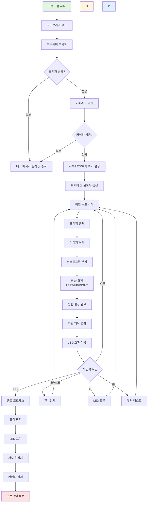
```mermaid
graph TD
    A[프로그램 시작] --> B[라이브러리 로드]
    B --> C[하드웨어 초기화]
    C --> D{초기화 성공?}
    D -->|실패| E[에러 메시지 출력 및 종료]
    D -->|성공| F[카메라 초기화]
    F --> G{카메라 성공?}
    G -->|실패| E
    G -->|성공| H[서보/LED/부저 초기 설정]
    H --> I[트랙바 및 윈도우 생성]
    I --> J[메인 루프 시작]
    
    J --> K[프레임 캡처]
    K --> L[이미지 처리]
    L --> M[히스토그램 분석]
    M --> N[방향 결정<br/>LEFT/UP/RIGHT]
    N --> Q[방향 결정 완료]
    Q --> R[차량 제어 명령]
    R --> S[LED 효과 적용]
    S --> T{키 입력 확인}
    T -->|ESC| U[종료 프로세스]
    T -->|SPACE| V[일시정지]
    T -->|L| W[LED 토글]
    T -->|B| X[부저 테스트]
    T -->|없음| J
    V --> J
    W --> J
    X --> J
    
    U --> Y[모터 정지]
    Y --> Z[LED 끄기]
    Z --> AA[서보 원위치]
    AA --> AB[카메라 해제]
    AB --> AC[프로그램 종료]
    
    style A fill:#e1f5e1
    style AC fill:#ffe1e1
    style O fill:#fff4e1
    style P fill:#e1f0ff
```

---

## 주요 실행 단계

### 9단계 실행 프로세스

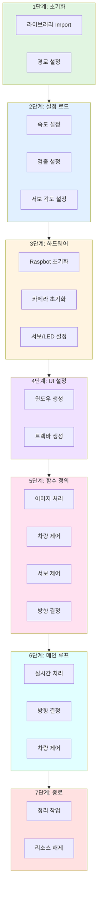
```mermaid
flowchart TB
    subgraph Step1[1단계: 초기화]
        A1[라이브러리 Import]
        A2[경로 설정]
    end
    
    subgraph Step2[2단계: 설정 로드]
        B1[속도 설정]
        B2[검출 설정]
        B3[서보 각도 설정]
    end
    
    subgraph Step3[3단계: 하드웨어]
        C1[Raspbot 초기화]
        C2[카메라 초기화]
        C3[서보/LED 설정]
    end
    
    subgraph Step4[4단계: UI 설정]
        D1[윈도우 생성]
        D2[트랙바 생성]
    end
    
    subgraph Step5[5단계: 함수 정의]
        E1[이미지 처리]
        E2[차량 제어]
        E3[서보 제어]
        E4[방향 결정]
    end
    
    subgraph Step6[6단계: 메인 루프]
        F1[실시간 처리]
        F2[방향 결정]
        F3[차량 제어]
    end
    
    subgraph Step7[7단계: 종료]
        G1[정리 작업]
        G2[리소스 해제]
    end
    
    Step1 --> Step2 --> Step3 --> Step4 --> Step5 --> Step6 --> Step7
    
    style Step1 fill:#e1f5e1
    style Step2 fill:#e1f0ff
    style Step3 fill:#fff4e1
    style Step4 fill:#f0e1ff
    style Step5 fill:#ffe1f0
    style Step6 fill:#e1ffff
    style Step7 fill:#ffe1e1
```

---

## 시스템 아키텍처

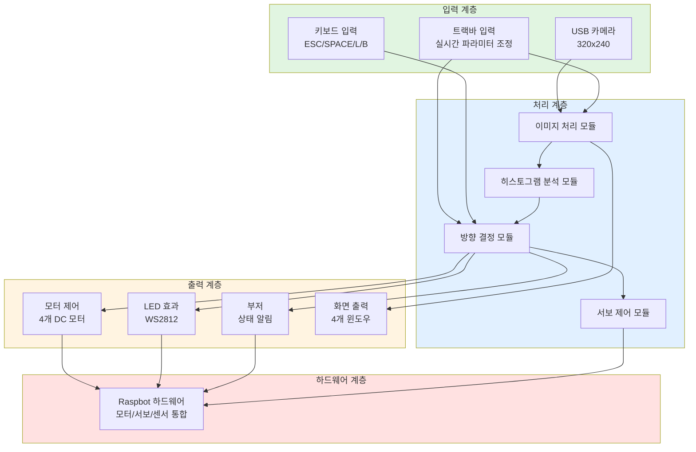
```mermaid
graph TB
    subgraph 입력층[입력 계층]
        CAM[USB 카메라<br/>320x240]
        TRK[트랙바 입력<br/>실시간 파라미터 조정]
        KEY[키보드 입력<br/>ESC/SPACE/L/B]
    end
    
    subgraph 처리층[처리 계층]
        IMG[이미지 처리 모듈]
        HIST[히스토그램 분석 모듈]
        DEC[방향 결정 모듈]
        SERVO[서보 제어 모듈]
    end
    
    subgraph 출력층[출력 계층]
        MOTOR[모터 제어<br/>4개 DC 모터]
        LED[LED 효과<br/>WS2812]
        BEEP[부저<br/>상태 알림]
        DISP[화면 출력<br/>4개 윈도우]
    end
    
    subgraph 하드웨어층[하드웨어 계층]
        RASP[Raspbot 하드웨어<br/>모터/서보/센서 통합]
    end
    
    CAM --> IMG
    TRK --> IMG
    TRK --> DEC
    KEY --> DEC
    
    IMG --> HIST
    HIST --> DEC
    DEC --> MOTOR
    DEC --> SERVO
    DEC --> LED
    DEC --> BEEP
    IMG --> DISP
    
    MOTOR --> RASP
    LED --> RASP
    BEEP --> RASP
    SERVO --> RASP
    
    style 입력층 fill:#e1f5e1
    style 처리층 fill:#e1f0ff
    style 출력층 fill:#fff4e1
    style 하드웨어층 fill:#ffe1e1
```

---

## 이미지 처리 파이프라인

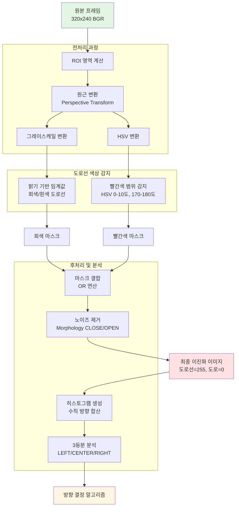
```mermaid
flowchart TD
    A[원본 프레임<br/>320x240 BGR] --> B[ROI 영역 계산]
    B --> C[원근 변환<br/>Perspective Transform]
    C --> D[그레이스케일 변환]
    C --> E[HSV 변환]
    
    D --> F[밝기 기반 임계값<br/>회색/흰색 도로선]
    E --> G[빨간색 범위 감지<br/>HSV 0-10도, 170-180도]
    
    F --> H[회색 마스크]
    G --> I[빨간색 마스크]
    
    H --> J[마스크 결합<br/>OR 연산]
    I --> J
    
    J --> K[노이즈 제거<br/>Morphology CLOSE/OPEN]
    K --> L[최종 이진화 이미지<br/>도로선=255, 도로=0]
    
    L --> M[히스토그램 생성<br/>수직 방향 합산]
    M --> N[3등분 분석<br/>LEFT/CENTER/RIGHT]
    
    N --> O[방향 결정 알고리즘]
    
    style A fill:#e1f5e1
    style L fill:#ffe1e1
    style O fill:#fff4e1
    
    subgraph 색상감지[도로선 색상 감지]
        F
        G
    end
    
    subgraph 전처리[전처리 과정]
        B
        C
        D
        E
    end
    
    subgraph 후처리[후처리 및 분석]
        J
        K
        M
        N
    end
```

### 이미지 처리 단계별 상세

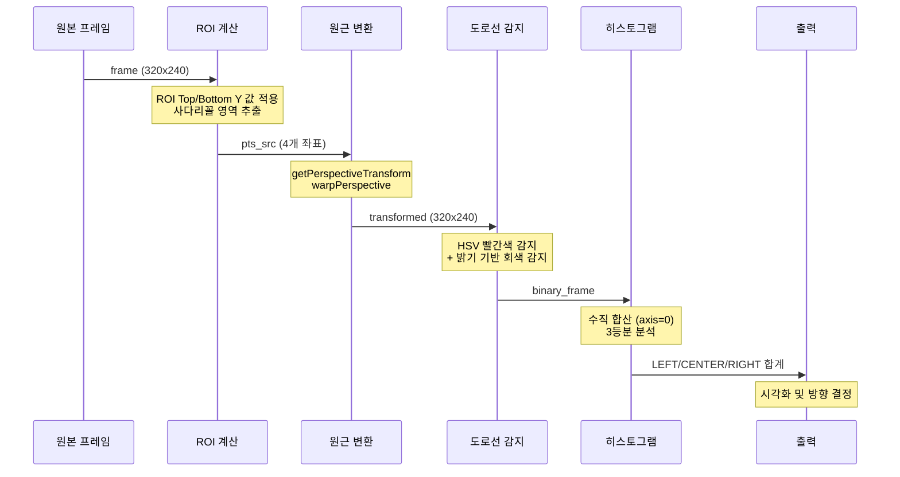
```mermaid
sequenceDiagram
    participant F as 원본 프레임
    participant R as ROI 계산
    participant P as 원근 변환
    participant D as 도로선 감지
    participant H as 히스토그램
    participant O as 출력
    
    F->>R: frame (320x240)
    Note over R: ROI Top/Bottom Y 값 적용<br/>사다리꼴 영역 추출
    R->>P: pts_src (4개 좌표)
    Note over P: getPerspectiveTransform<br/>warpPerspective
    P->>D: transformed (320x240)
    Note over D: HSV 빨간색 감지<br/>+ 밝기 기반 회색 감지
    D->>H: binary_frame
    Note over H: 수직 합산 (axis=0)<br/>3등분 분석
    H->>O: LEFT/CENTER/RIGHT 합계
    Note over O: 시각화 및 방향 결정
```

---

## 방향 결정 알고리즘

### 방향 결정 플로우차트

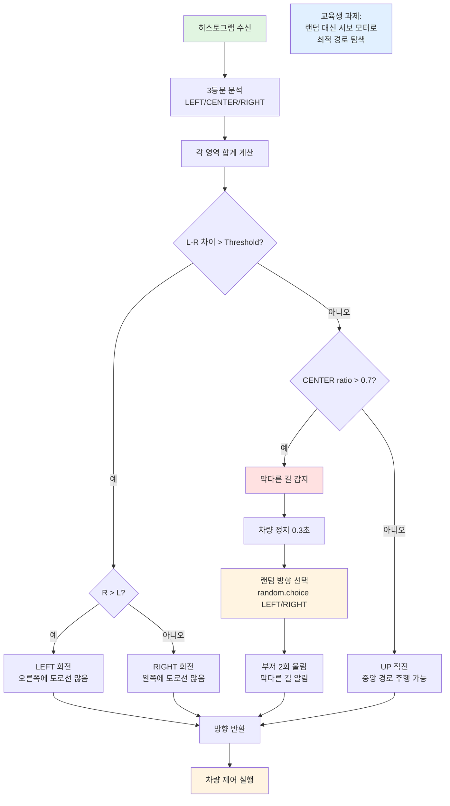
```mermaid
flowchart TD
    A[히스토그램 수신] --> B[3등분 분석<br/>LEFT/CENTER/RIGHT]
    B --> C[각 영역 합계 계산]
    C --> D{L-R 차이 > Threshold?}
    
    D -->|예| E{R > L?}
    E -->|예| F[LEFT 회전<br/>오른쪽에 도로선 많음]
    E -->|아니오| G[RIGHT 회전<br/>왼쪽에 도로선 많음]
    
    D -->|아니오| H{CENTER ratio > 0.7?}
    H -->|예| I[막다른 길 감지]
    I --> J[차량 정지 0.3초]
    J --> K[랜덤 방향 선택<br/>random.choice LEFT/RIGHT]
    K --> L[부저 2회 울림<br/>막다른 길 알림]
    
    H -->|아니오| Q[UP 직진<br/>중앙 경로 주행 가능]
    
    F --> R[방향 반환]
    G --> R
    L --> R
    Q --> R
    
    R --> S[차량 제어 실행]
    
    style A fill:#e1f5e1
    style I fill:#ffe1e1
    style S fill:#fff4e1
    style K fill:#fff4e1
    
    note1[교육생 과제:<br/>랜덤 대신 서보 모터로<br/>최적 경로 탐색]
    style note1 fill:#e1f0ff
```

### 히스토그램 해석 로직

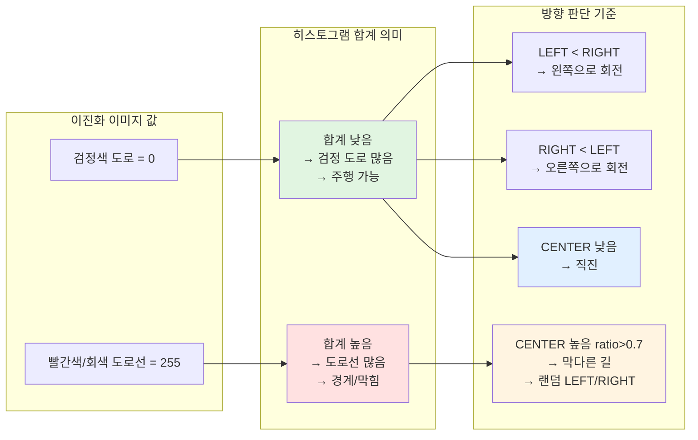
```mermaid
graph LR
    subgraph 이진화값[이진화 이미지 값]
        A1[검정색 도로 = 0]
        A2[빨간색/회색 도로선 = 255]
    end
    
    subgraph 히스토그램합[히스토그램 합계 의미]
        B1[합계 낮음<br/>→ 검정 도로 많음<br/>→ 주행 가능]
        B2[합계 높음<br/>→ 도로선 많음<br/>→ 경계/막힘]
    end
    
    subgraph 방향판단[방향 판단 기준]
        C1[LEFT < RIGHT<br/>→ 왼쪽으로 회전]
        C2[RIGHT < LEFT<br/>→ 오른쪽으로 회전]
        C3[CENTER 낮음<br/>→ 직진]
        C4[CENTER 높음 ratio>0.7<br/>→ 막다른 길<br/>→ 랜덤 LEFT/RIGHT]
    end
    
    A1 --> B1
    A2 --> B2
    B1 --> C1
    B1 --> C2
    B1 --> C3
    B2 --> C4
    
    style B1 fill:#e1f5e1
    style B2 fill:#ffe1e1
    style C3 fill:#e1f0ff
    style C4 fill:#fff4e1
```

---

## 주요 기능 상세

### 1. 하드웨어 초기화 기능

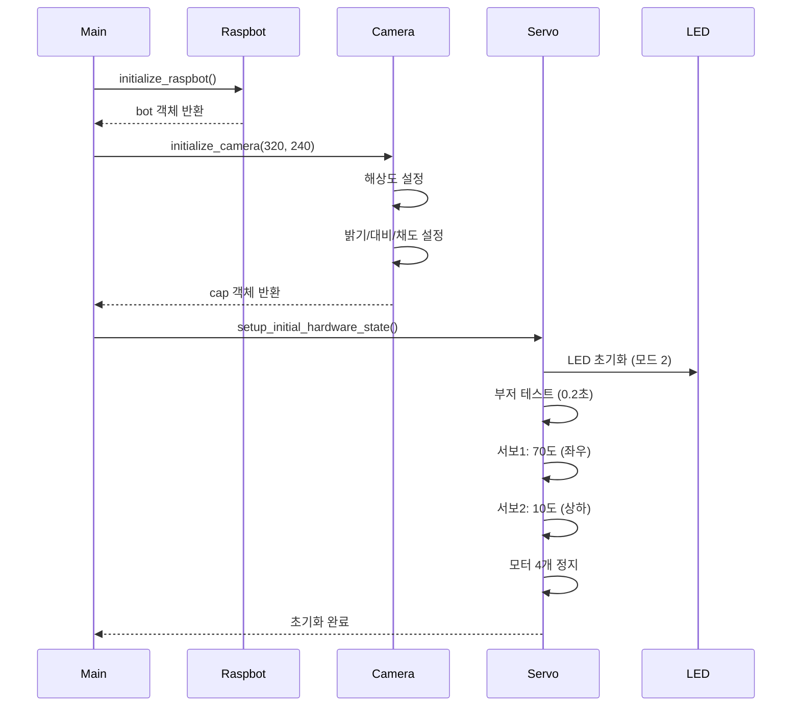
```mermaid
sequenceDiagram
    participant M as Main
    participant R as Raspbot
    participant C as Camera
    participant S as Servo
    participant L as LED
    
    M->>R: initialize_raspbot()
    R-->>M: bot 객체 반환
    
    M->>C: initialize_camera(320, 240)
    C->>C: 해상도 설정
    C->>C: 밝기/대비/채도 설정
    C-->>M: cap 객체 반환
    
    M->>S: setup_initial_hardware_state()
    S->>L: LED 초기화 (모드 2)
    S->>S: 부저 테스트 (0.2초)
    S->>S: 서보1: 70도 (좌우)
    S->>S: 서보2: 10도 (상하)
    S->>S: 모터 4개 정지
    S-->>M: 초기화 완료
```

### 2. 차량 제어 기능 상세

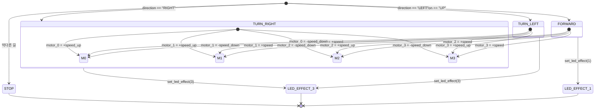
```mermaid
stateDiagram-v2
    [*] --> FORWARD: direction == "UP"
    [*] --> TURN_LEFT: direction == "LEFT"
    [*] --> TURN_RIGHT: direction == "RIGHT"
    [*] --> STOP: 막다른 길
    
    FORWARD --> LED_EFFECT_1: set_led_effect(1)
    TURN_LEFT --> LED_EFFECT_3: set_led_effect(3)
    TURN_RIGHT --> LED_EFFECT_3: set_led_effect(3)
    
    state FORWARD {
        [*] --> M0: motor_0 = +speed
        [*] --> M1: motor_1 = +speed
        [*] --> M2: motor_2 = +speed
        [*] --> M3: motor_3 = +speed
    }
    
    state TURN_LEFT {
        [*] --> M0: motor_0 = -speed_down
        [*] --> M1: motor_1 = -speed_down
        [*] --> M2: motor_2 = +speed_up
        [*] --> M3: motor_3 = +speed_up
    }
    
    state TURN_RIGHT {
        [*] --> M0: motor_0 = +speed_up
        [*] --> M1: motor_1 = +speed_up
        [*] --> M2: motor_2 = -speed_down
        [*] --> M3: motor_3 = -speed_down
    }
    
    LED_EFFECT_1 --> [*]
    LED_EFFECT_3 --> [*]
    STOP --> [*]
```

### 3. 막다른 길 감지 및 랜덤 방향 선택

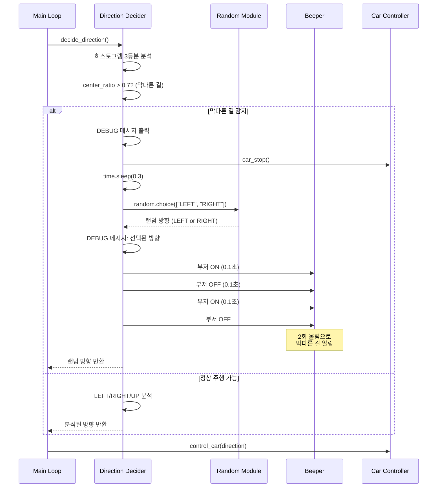
```mermaid
sequenceDiagram
    participant M as Main Loop
    participant D as Direction Decider
    participant R as Random Module
    participant B as Beeper
    participant C as Car Controller
    
    M->>D: decide_direction()
    D->>D: 히스토그램 3등분 분석
    D->>D: center_ratio > 0.7? (막다른 길)
    
    alt 막다른 길 감지
        D->>D: DEBUG 메시지 출력
        D->>C: car_stop()
        D->>D: time.sleep(0.3)
        
        D->>R: random.choice(["LEFT", "RIGHT"])
        R-->>D: 랜덤 방향 (LEFT or RIGHT)
        
        D->>D: DEBUG 메시지: 선택된 방향
        
        D->>B: 부저 ON (0.1초)
        D->>B: 부저 OFF (0.1초)
        D->>B: 부저 ON (0.1초)
        D->>B: 부저 OFF
        Note over B: 2회 울림으로<br/>막다른 길 알림
        
        D-->>M: 랜덤 방향 반환
    else 정상 주행 가능
        D->>D: LEFT/RIGHT/UP 분석
        D-->>M: 분석된 방향 반환
    end
    
    M->>C: control_car(direction)
```

### 교육생 실습: 서보 모터 대체 경로 탐색 (개선 과제)

**현재 문제점**: 막다른 길에서 랜덤으로 방향을 선택하므로 비효율적

**개선 목표**: 서보 모터를 활용하여 실제로 주행 가능한 경로를 찾아 선택

**구현 단계**:
1. 서보1을 180도로 회전 (뒤쪽 확인)
2. 서보2를 100도로 조정 (시야 확보)
3. 새 프레임 캡처 및 처리
4. 히스토그램 3등분 분석
5. 최소 합계(도로선 가장 적음) 영역 찾기
6. 서보 원위치
7. 최적 방향 반환

```python
# 교육생 구현 예시 (참고용)
def rotate_servo_and_check_direction(detect_value, roi_top_y, roi_bottom_y):
    # 1. 서보 회전
    bot.Ctrl_Servo(1, 180)
    bot.Ctrl_Servo(2, 100)
    time.sleep(0.5)
    
    # 2. 프레임 캡처 및 처리
    ret, frame = cap.read()
    processed_frame = process_frame(frame, detect_value, roi_top_y, roi_bottom_y)
    histogram = np.sum(processed_frame, axis=0)
    
    # 3. 3등분 분석
    left_sum, center_sum, right_sum, _, _, _ = analyze_histogram(histogram)
    
    # 4. 서보 원위치
    bot.Ctrl_Servo(1, 70)
    bot.Ctrl_Servo(2, 10)
    
    # 5. 최소값 방향 반환
    min_sum = min(left_sum, center_sum, right_sum)
    if min_sum == left_sum:
        return "LEFT"
    elif min_sum == right_sum:
        return "RIGHT"
    else:
        return "UP"
```

### 4. 키보드 입력 처리

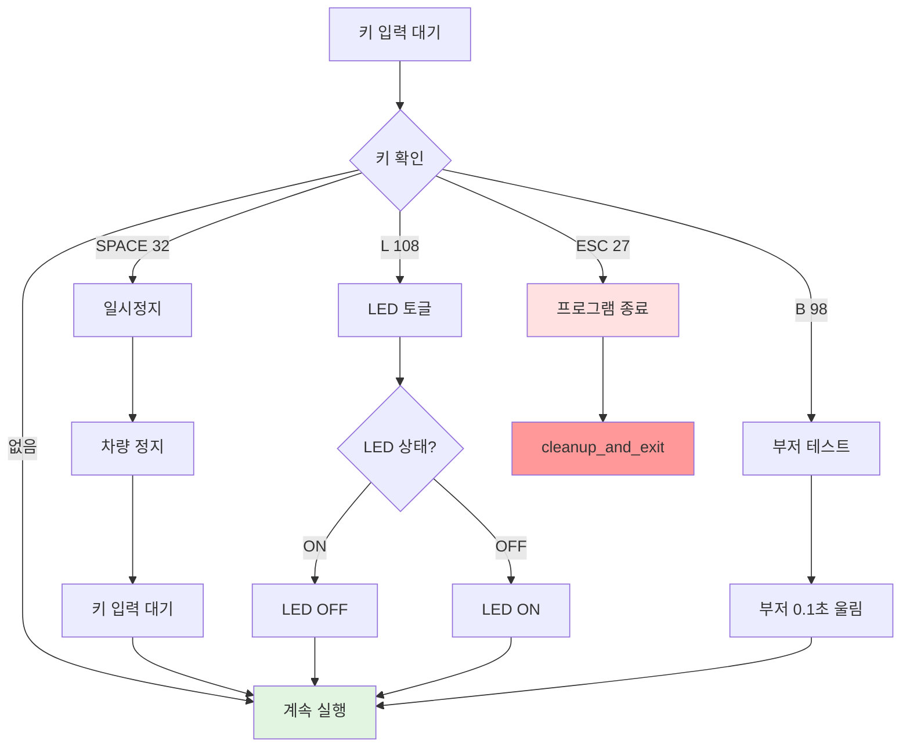
```mermaid
graph TD
    A[키 입력 대기] --> B{키 확인}
    B -->|ESC 27| C[프로그램 종료]
    B -->|SPACE 32| D[일시정지]
    B -->|L 108| E[LED 토글]
    B -->|B 98| F[부저 테스트]
    B -->|없음| G[계속 실행]
    
    D --> H[차량 정지]
    H --> I[키 입력 대기]
    I --> G
    
    E --> J{LED 상태?}
    J -->|ON| K[LED OFF]
    J -->|OFF| L[LED ON]
    K --> G
    L --> G
    
    F --> M[부저 0.1초 울림]
    M --> G
    
    C --> N[cleanup_and_exit]
    
    style C fill:#ffe1e1
    style G fill:#e1f5e1
    style N fill:#ff9999
```

---

## 하드웨어 구성

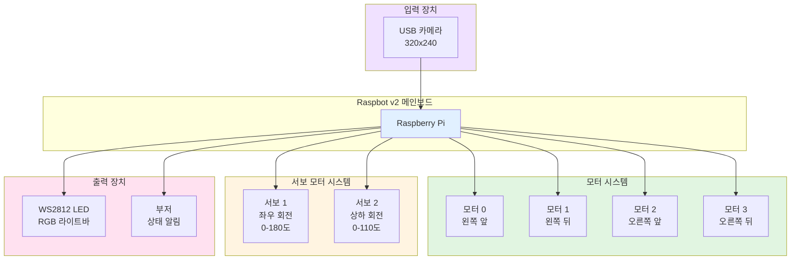
```mermaid
graph TB
    subgraph Raspbot[Raspbot v2 메인보드]
        CPU[Raspberry Pi]
    end
    
    subgraph 모터시스템[모터 시스템]
        M0[모터 0<br/>왼쪽 앞]
        M1[모터 1<br/>왼쪽 뒤]
        M2[모터 2<br/>오른쪽 앞]
        M3[모터 3<br/>오른쪽 뒤]
    end
    
    subgraph 서보시스템[서보 모터 시스템]
        S1[서보 1<br/>좌우 회전<br/>0-180도]
        S2[서보 2<br/>상하 회전<br/>0-110도]
    end
    
    subgraph 입력장치[입력 장치]
        CAM[USB 카메라<br/>320x240]
    end
    
    subgraph 출력장치[출력 장치]
        LED[WS2812 LED<br/>RGB 라이트바]
        BEEP[부저<br/>상태 알림]
    end
    
    CPU --> M0
    CPU --> M1
    CPU --> M2
    CPU --> M3
    CPU --> S1
    CPU --> S2
    CPU --> LED
    CPU --> BEEP
    CAM --> CPU
    
    style CPU fill:#e1f0ff
    style 모터시스템 fill:#e1f5e1
    style 서보시스템 fill:#fff4e1
    style 입력장치 fill:#f0e1ff
    style 출력장치 fill:#ffe1f0
```

### 모터 제어 매핑

| 모터 번호 | 위치 | 전진 시 | 좌회전 시 | 우회전 시 |
|---------|------|---------|-----------|-----------|
| Motor 0 | 왼쪽 앞 | +속도 | -속도 | +속도 |
| Motor 1 | 왼쪽 뒤 | +속도 | -속도 | +속도 |
| Motor 2 | 오른쪽 앞 | +속도 | +속도 | -속도 |
| Motor 3 | 오른쪽 뒤 | +속도 | +속도 | -속도 |

---

## 설정 파라미터

### 주요 파라미터 구성도

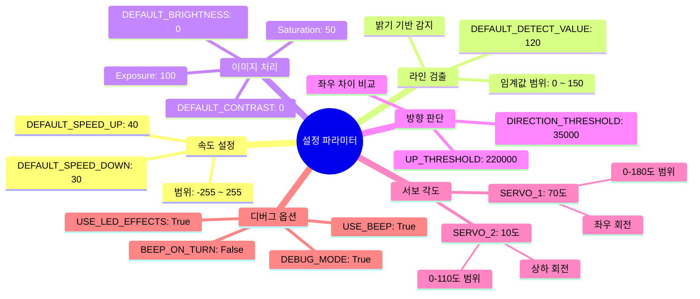
```mermaid
mindmap
  root((설정 파라미터))
    속도 설정
      DEFAULT_SPEED_UP: 40
      DEFAULT_SPEED_DOWN: 30
      범위: -255 ~ 255
    라인 검출
      DEFAULT_DETECT_VALUE: 120
      임계값 범위: 0 ~ 150
      밝기 기반 감지
    이미지 처리
      DEFAULT_BRIGHTNESS: 0
      DEFAULT_CONTRAST: 0
      Saturation: 50
      Exposure: 100
    방향 판단
      DIRECTION_THRESHOLD: 35000
      UP_THRESHOLD: 220000
      좌우 차이 비교
    서보 각도
      SERVO_1: 70도
        좌우 회전
        0-180도 범위
      SERVO_2: 10도
        상하 회전
        0-110도 범위
    디버그 옵션
      DEBUG_MODE: True
      USE_LED_EFFECTS: True
      USE_BEEP: True
      BEEP_ON_TURN: False
```

### 트랙바 파라미터 목록

| 파라미터 | 범위 | 기본값 | 설명 |
|---------|------|--------|------|
| Servo_1_Angle | 0-180 | 70 | 서보 좌우 각도 |
| Servo_2_Angle | 0-110 | 10 | 서보 상하 각도 |
| ROI_Top_Y | 0-1000 | 871 | ROI 상단 Y 좌표 (비율) |
| ROI_Bottom_Y | 0-1000 | 946 | ROI 하단 Y 좌표 (비율) |
| Direction_Threshold | 0-500000 | 35000 | 좌우 방향 판단 임계값 |
| Up_Threshold | 0-500000 | 220000 | 직진 판단 임계값 |
| Brightness | 0-100 | 0 | 카메라 밝기 |
| Contrast | 0-100 | 0 | 카메라 대비 |
| Detect_Value | 0-150 | 120 | 도로선 검출 임계값 |
| Motor_Up_Speed | 0-255 | 40 | 전진/회전 고속 |
| Motor_Down_Speed | 0-255 | 30 | 회전 저속 |
| Saturation | 0-100 | 0 | 카메라 채도 |
| Gain | 0-100 | 0 | 카메라 게인 |

---

## 윈도우 출력 구성

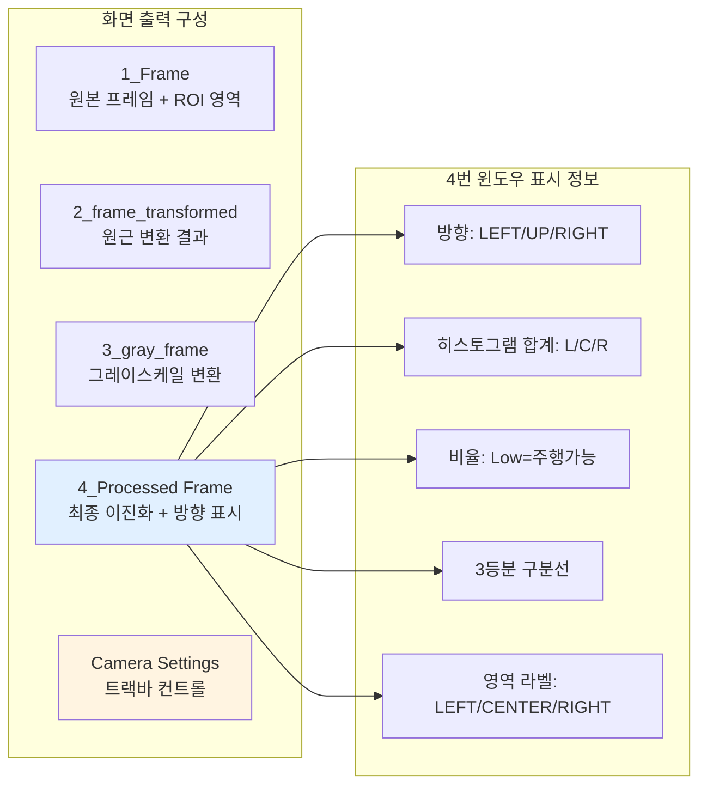
```mermaid
graph LR
    subgraph 윈도우구성[화면 출력 구성]
        W1[1_Frame<br/>원본 프레임 + ROI 영역]
        W2[2_frame_transformed<br/>원근 변환 결과]
        W3[3_gray_frame<br/>그레이스케일 변환]
        W4[4_Processed Frame<br/>최종 이진화 + 방향 표시]
        W5[Camera Settings<br/>트랙바 컨트롤]
    end
    
    subgraph 정보표시[4번 윈도우 표시 정보]
        I1[방향: LEFT/UP/RIGHT]
        I2[히스토그램 합계: L/C/R]
        I3[비율: Low=주행가능]
        I4[3등분 구분선]
        I5[영역 라벨: LEFT/CENTER/RIGHT]
    end
    
    W4 --> I1
    W4 --> I2
    W4 --> I3
    W4 --> I4
    W4 --> I5
    
    style W4 fill:#e1f0ff
    style W5 fill:#fff4e1
```

---

## 도로선 감지 알고리즘 상세

### 색상 기반 감지 로직

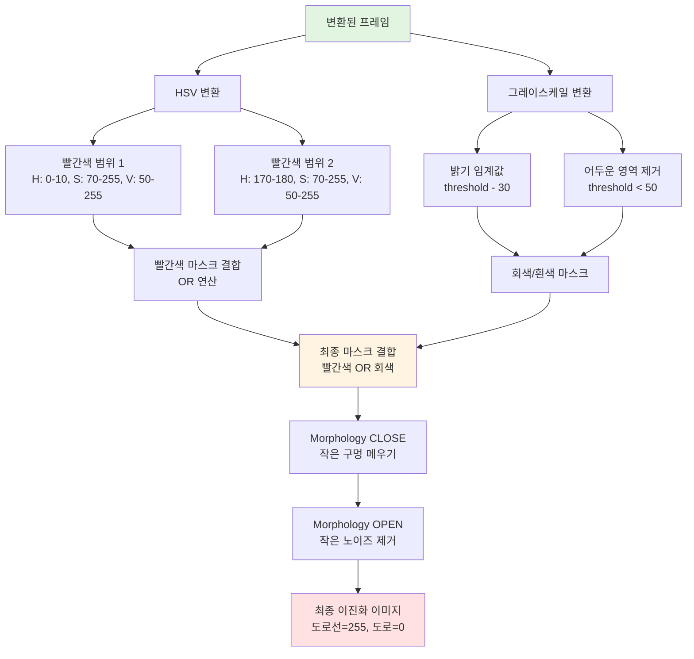
```mermaid
flowchart TD
    A[변환된 프레임] --> B[HSV 변환]
    A --> C[그레이스케일 변환]
    
    B --> D1[빨간색 범위 1<br/>H: 0-10, S: 70-255, V: 50-255]
    B --> D2[빨간색 범위 2<br/>H: 170-180, S: 70-255, V: 50-255]
    
    D1 --> E[빨간색 마스크 결합<br/>OR 연산]
    D2 --> E
    
    C --> F[밝기 임계값<br/>threshold - 30]
    C --> G[어두운 영역 제거<br/>threshold < 50]
    
    F --> H[회색/흰색 마스크]
    G --> H
    
    E --> I[최종 마스크 결합<br/>빨간색 OR 회색]
    H --> I
    
    I --> J[Morphology CLOSE<br/>작은 구멍 메우기]
    J --> K[Morphology OPEN<br/>작은 노이즈 제거]
    
    K --> L[최종 이진화 이미지<br/>도로선=255, 도로=0]
    
    style A fill:#e1f5e1
    style L fill:#ffe1e1
    style I fill:#fff4e1
```

### 도로선 감지 특징

**검출 대상:**
- ✅ 빨간색 도로선 (HSV 색상 공간 활용)
- ✅ 회색/흰색 도로선 (밝기 기준)
- ✅ 반사된 검정색 부분 (범위 확장)

**제외 대상:**
- ❌ 검정색 도로 (threshold < 50)
- ❌ 너무 어두운 배경
- ❌ 작은 노이즈 (Morphology 연산)

---

## 성능 최적화 전략

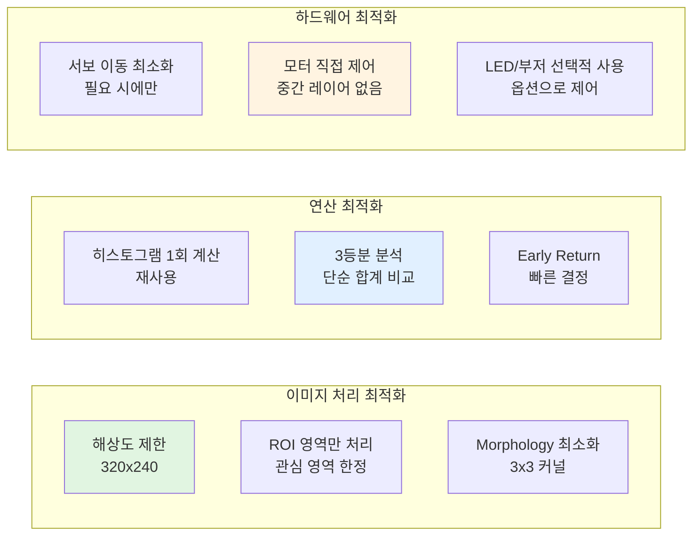
```mermaid
graph LR
    subgraph 이미지처리최적화[이미지 처리 최적화]
        A1[해상도 제한<br/>320x240]
        A2[ROI 영역만 처리<br/>관심 영역 한정]
        A3[Morphology 최소화<br/>3x3 커널]
    end
    
    subgraph 연산최적화[연산 최적화]
        B1[히스토그램 1회 계산<br/>재사용]
        B2[3등분 분석<br/>단순 합계 비교]
        B3[Early Return<br/>빠른 결정]
    end
    
    subgraph 하드웨어최적화[하드웨어 최적화]
        C1[서보 이동 최소화<br/>필요 시에만]
        C2[모터 직접 제어<br/>중간 레이어 없음]
        C3[LED/부저 선택적 사용<br/>옵션으로 제어]
    end
    
    style A1 fill:#e1f5e1
    style B2 fill:#e1f0ff
    style C2 fill:#fff4e1
```

---

## 에러 처리 및 안전 장치

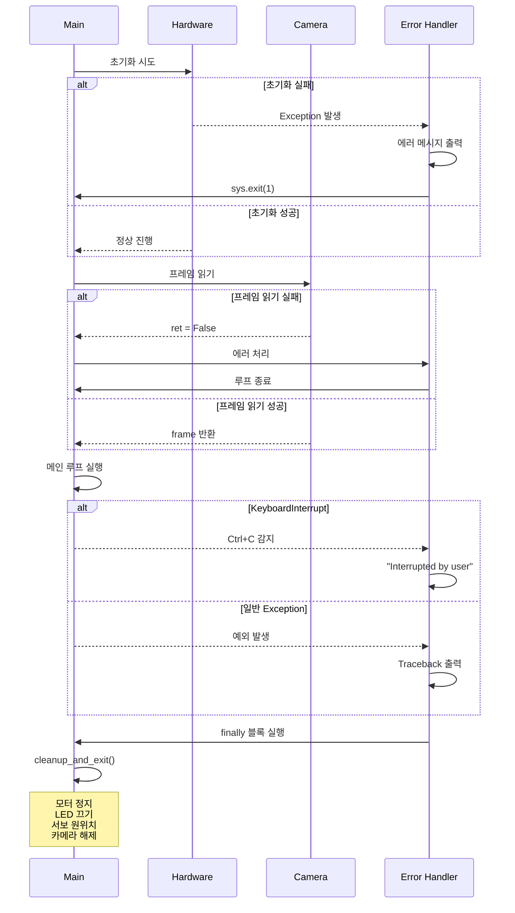
```mermaid
sequenceDiagram
    participant M as Main
    participant H as Hardware
    participant C as Camera
    participant E as Error Handler
    
    M->>H: 초기화 시도
    alt 초기화 실패
        H-->>E: Exception 발생
        E->>E: 에러 메시지 출력
        E->>M: sys.exit(1)
    else 초기화 성공
        H-->>M: 정상 진행
    end
    
    M->>C: 프레임 읽기
    alt 프레임 읽기 실패
        C-->>M: ret = False
        M->>E: 에러 처리
        E->>M: 루프 종료
    else 프레임 읽기 성공
        C-->>M: frame 반환
    end
    
    M->>M: 메인 루프 실행
    alt KeyboardInterrupt
        M-->>E: Ctrl+C 감지
        E->>E: "Interrupted by user"
    else 일반 Exception
        M-->>E: 예외 발생
        E->>E: Traceback 출력
    end
    
    E->>M: finally 블록 실행
    M->>M: cleanup_and_exit()
    Note over M: 모터 정지<br/>LED 끄기<br/>서보 원위치<br/>카메라 해제
```

---

## 실행 환경 및 요구사항

### 시스템 요구사항

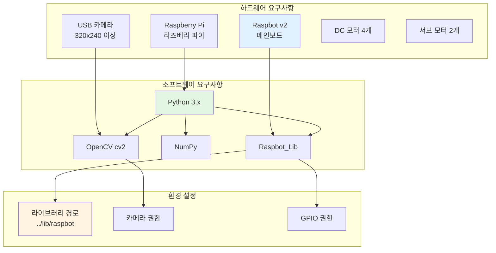
```mermaid
graph TB
    subgraph 하드웨어[하드웨어 요구사항]
        H1[Raspberry Pi<br/>라즈베리 파이]
        H2[Raspbot v2<br/>메인보드]
        H3[USB 카메라<br/>320x240 이상]
        H4[DC 모터 4개]
        H5[서보 모터 2개]
    end
    
    subgraph 소프트웨어[소프트웨어 요구사항]
        S1[Python 3.x]
        S2[OpenCV cv2]
        S3[NumPy]
        S4[Raspbot_Lib]
    end
    
    subgraph 환경설정[환경 설정]
        E1[라이브러리 경로<br/>../lib/raspbot]
        E2[카메라 권한]
        E3[GPIO 권한]
    end
    
    H1 --> S1
    H2 --> S4
    H3 --> S2
    S1 --> S2
    S1 --> S3
    S1 --> S4
    S4 --> E1
    S2 --> E2
    S4 --> E3
    
    style H2 fill:#e1f0ff
    style S1 fill:#e1f5e1
    style E1 fill:#fff4e1
```

---

## 향후 개선 방향

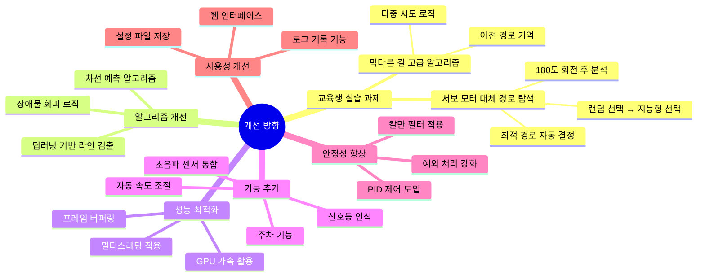
```mermaid
mindmap
  root((개선 방향))
    교육생 실습 과제
      서보 모터 대체 경로 탐색
        랜덤 선택 → 지능형 선택
        180도 회전 후 분석
        최적 경로 자동 결정
      막다른 길 고급 알고리즘
        다중 시도 로직
        이전 경로 기억
    알고리즘 개선
      딥러닝 기반 라인 검출
      차선 예측 알고리즘
      장애물 회피 로직
    성능 최적화
      멀티스레딩 적용
      GPU 가속 활용
      프레임 버퍼링
    기능 추가
      초음파 센서 통합
      신호등 인식
      주차 기능
      자동 속도 조절
    안정성 향상
      PID 제어 도입
      칼만 필터 적용
      예외 처리 강화
    사용성 개선
      웹 인터페이스
      설정 파일 저장
      로그 기록 기능
```

---

## 디버그 팁

### 주요 디버그 포인트

1. **이미지 처리 확인**
   - 4개 윈도우로 각 단계 시각화
   - ROI 영역이 적절한지 확인
   - 도로선이 제대로 감지되는지 확인

2. **히스토그램 분석**
   - DEBUG_MODE를 True로 설정
   - 콘솔에서 LEFT/CENTER/RIGHT 값 확인
   - 비율(ratio)이 적절한지 검토

3. **방향 결정 로직**
   - direction_threshold 값 조정
   - center_ratio 임계값 튜닝 (기본 0.7)
   - 막다른 길 감지 조건 확인

4. **막다른 길 감지**
   - center_ratio > 0.7일 때 감지됨
   - 부저 2회 울림으로 확인
   - 콘솔에서 "Dead end detected!" 메시지 확인
   - 랜덤 방향 선택 로그 확인

5. **차량 제어**
   - 모터 속도 조정 (up_speed, down_speed)
   - LED 효과로 상태 확인
   - 부저로 방향 전환 및 막다른 길 확인

6. **교육생 과제 디버깅**
   - 서보 모터 회전 각도 확인 (180도)
   - 프레임 캡처 타이밍 조정
   - 히스토그램 분석 결과 검증
   - 최적 경로 선택 로직 테스트

---

## 참고 자료

### 관련 문서
- `autoplot_설명서.md`: 기본 사용 설명서
- `QUICK_START.md`: 빠른 시작 가이드
- `TUNING_GUIDE.md`: 파라미터 튜닝 가이드

### 주요 라이브러리 문서
- OpenCV 공식 문서: https://docs.opencv.org/
- NumPy 공식 문서: https://numpy.org/doc/
- Raspbot 라이브러리: `/lib/raspbot/`

---

**작성일**: 2025-11-30  
**최종 수정일**: 2025-11-30  
**버전**: 1.1  
**작성자**: AI Coding Assistant  
**소스 파일**: `0_autoplot___test.py`

### 변경 이력
- **v1.1 (2025-11-30)**: 막다른 길 감지 시 랜덤 방향 선택 기능 추가, 서보 모터 대체 경로 탐색을 교육생 실습 과제로 이동
- **v1.0 (2025-11-30)**: 초기 문서 작성

