# Raspbot v2 자율주행 시스템 분석 문서

## 📋 목차
1. [시스템 개요](#시스템-개요)
2. [전체 유저 플로우](#전체-유저-플로우)
3. [주요 실행 단계](#주요-실행-단계)
4. [시스템 아키텍처](#시스템-아키텍처)
5. [이미지 처리 파이프라인](#이미지-처리-파이프라인)
6. [방향 결정 알고리즘](#방향-결정-알고리즘)
7. [주요 기능 상세](#주요-기능-상세)
8. [하드웨어 구성](#하드웨어-구성)
9. [설정 파라미터](#설정-파라미터)

---

## 시스템 개요

### 프로젝트 정보
- **파일명**: `0_autoplot___test.py`
- **목적**: Raspbot v2 자율주행 라인 트레이싱 테스트
- **주요 특징**:
  - 서보 모터 제어를 통한 카메라 각도 조절
  - 빨간색/회색 도로선 기반 라인 트레이싱
  - 히스토그램 3등분 분석 기반 방향 결정
  - 실시간 이미지 처리 및 차량 제어

### 현재 구현된 기능
- **막다른 길 감지**: 중앙 영역의 도로선 비율(70% 이상) 분석
- **랜덤 방향 선택**: 막다른 길 감지 시 LEFT/RIGHT 랜덤 선택

### 교육생 실습 과제
- **서보 모터 활용 대체 경로 탐색**: 서보를 180도 회전하여 뒤쪽 확인
- **최적 경로 선택 알고리즘**: 히스토그램 분석으로 가장 주행 가능한 경로 결정
- **랜덤 대신 지능형 선택**: 현재 랜덤 선택을 서보 기반 분석으로 개선

### 핵심 기술
- **비전 처리**: OpenCV 기반 이미지 처리
- **도로선 감지**: HSV 색상 공간 + 그레이스케일 임계값
- **방향 결정**: 히스토그램 3등분 분석
- **하드웨어 제어**: Raspbot 라이브러리 활용

---

## 전체 유저 플로우

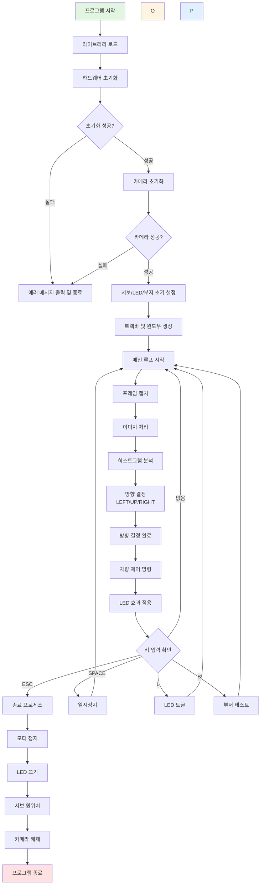

---

## 주요 실행 단계

### 9단계 실행 프로세스

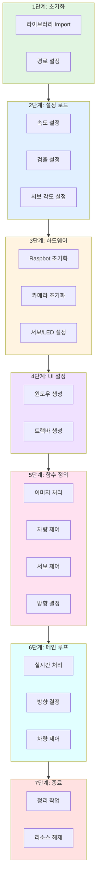

---

## 시스템 아키텍처

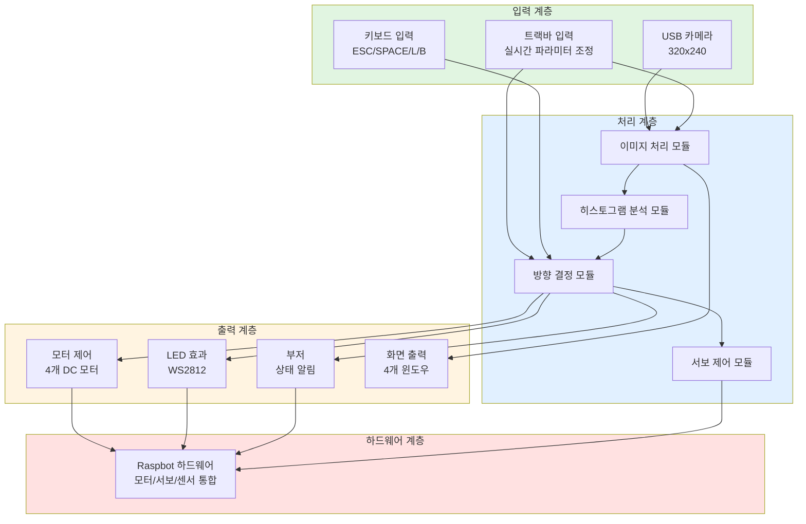

---

## 이미지 처리 파이프라인

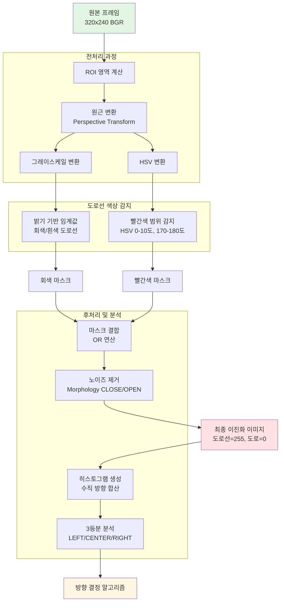

### 이미지 처리 단계별 상세 순서도

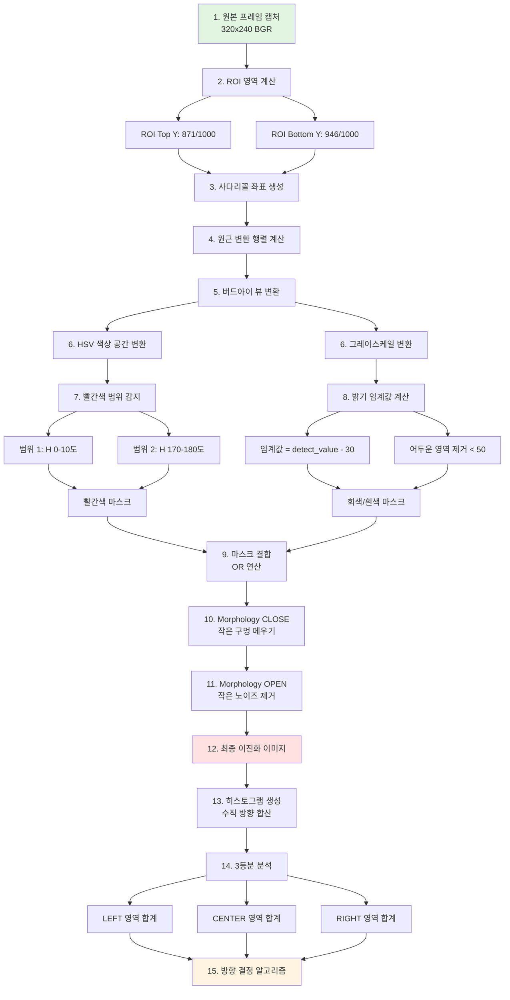

### 이미지 처리 단계별 처리 시간

| 단계 | 처리 내용 | 예상 시간 | 비고 |
|------|----------|----------|------|
| 1 | 프레임 캡처 | 30ms | 카메라에서 읽기 |
| 2-3 | ROI 계산 및 좌표 생성 | 1ms | 사다리꼴 영역 |
| 4-5 | 원근 변환 | 5ms | 행렬 계산 + 변환 |
| 6 | 색상 공간 변환 | 3ms | HSV + 그레이스케일 |
| 7-8 | 도로선 감지 | 8ms | 빨간색 + 회색 마스크 |
| 9 | 마스크 결합 | 1ms | OR 연산 |
| 10-11 | Morphology 연산 | 5ms | CLOSE + OPEN |
| 12 | 이진화 완료 | - | 최종 이미지 |
| 13 | 히스토그램 생성 | 2ms | 수직 합산 |
| 14 | 3등분 분석 | 1ms | LEFT/CENTER/RIGHT |
| 15 | 방향 결정 | 1ms | 알고리즘 실행 |
| **총 시간** | **전체 처리** | **약 57ms** | **약 17-18 FPS** |

---

## 방향 결정 알고리즘

### 방향 결정 알고리즘 상세 순서도

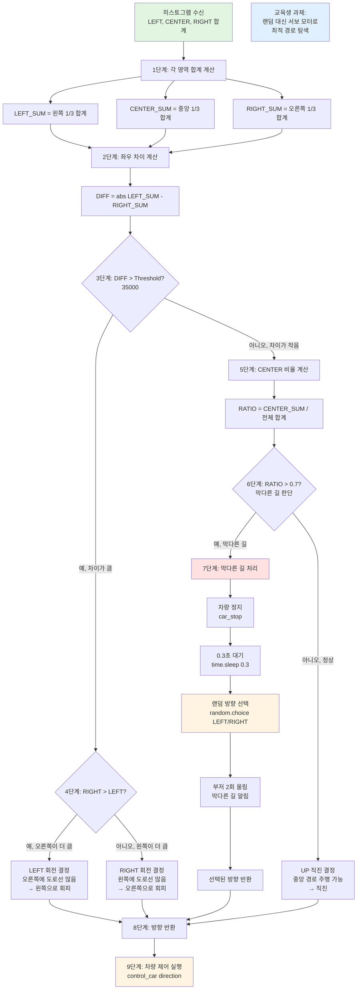

### 방향 결정 알고리즘 단계별 설명

| 단계 | 처리 내용 | 계산식 | 판단 기준 |
|------|----------|--------|----------|
| 1 | 영역 합계 계산 | LEFT_SUM, CENTER_SUM, RIGHT_SUM | 각 영역의 픽셀 합계 |
| 2 | 좌우 차이 계산 | DIFF = \|LEFT_SUM - RIGHT_SUM\| | 절대값 차이 |
| 3 | 차이 임계값 비교 | DIFF > 35000 | 좌우 차이가 큰지 확인 |
| 4 | 좌우 비교 | RIGHT > LEFT? | 어느 쪽이 더 큰지 |
| 5 | 중앙 비율 계산 | RATIO = CENTER_SUM / 전체 | 중앙 영역 비율 |
| 6 | 막다른 길 판단 | RATIO > 0.7 | 중앙이 70% 이상 차지 |
| 7 | 막다른 길 처리 | 정지 → 대기 → 랜덤 선택 | 0.3초 대기 후 선택 |
| 8 | 방향 반환 | LEFT / RIGHT / UP | 결정된 방향 반환 |
| 9 | 차량 제어 | control_car(direction) | 모터 제어 실행 |

### 히스토그램 해석 로직 상세

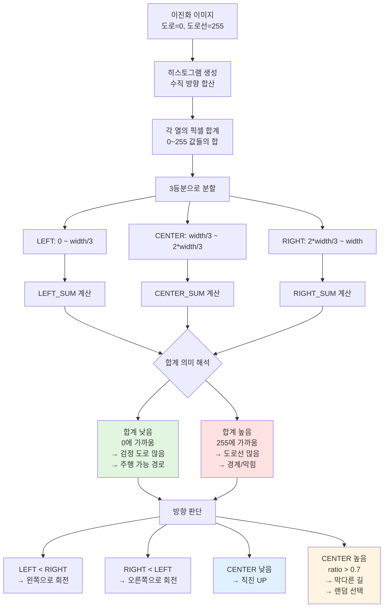

### 히스토그램 값 해석 표

| 이진화 값 | 의미 | 히스토그램 합계 | 주행 가능성 | 방향 결정 |
|----------|------|----------------|------------|----------|
| 0 (검정) | 도로 | 낮음 (0에 가까움) | ✅ 주행 가능 | 해당 방향으로 이동 |
| 255 (흰색) | 도로선 | 높음 (255에 가까움) | ❌ 막힘/경계 | 해당 방향 회피 |
| LEFT_SUM < RIGHT_SUM | 왼쪽이 더 열려있음 | LEFT 낮음, RIGHT 높음 | ✅ 왼쪽 주행 가능 | LEFT 회전 |
| RIGHT_SUM < LEFT_SUM | 오른쪽이 더 열려있음 | RIGHT 낮음, LEFT 높음 | ✅ 오른쪽 주행 가능 | RIGHT 회전 |
| CENTER_SUM 낮음 | 중앙이 열려있음 | CENTER 낮음 | ✅ 직진 가능 | UP 직진 |
| CENTER_SUM 높음 (ratio > 0.7) | 중앙이 막힘 | CENTER 높음 (70% 이상) | ❌ 막다른 길 | 랜덤 LEFT/RIGHT |

---

## 주요 기능 상세

### 전체 시스템 초기화 순서도

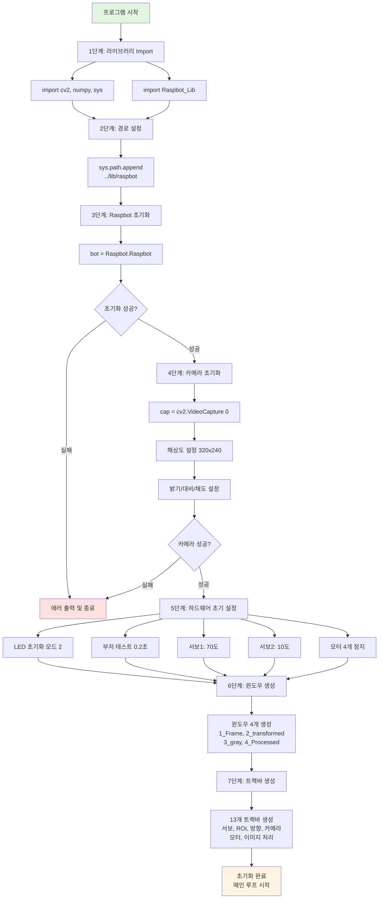

### 1. 하드웨어 초기화 기능

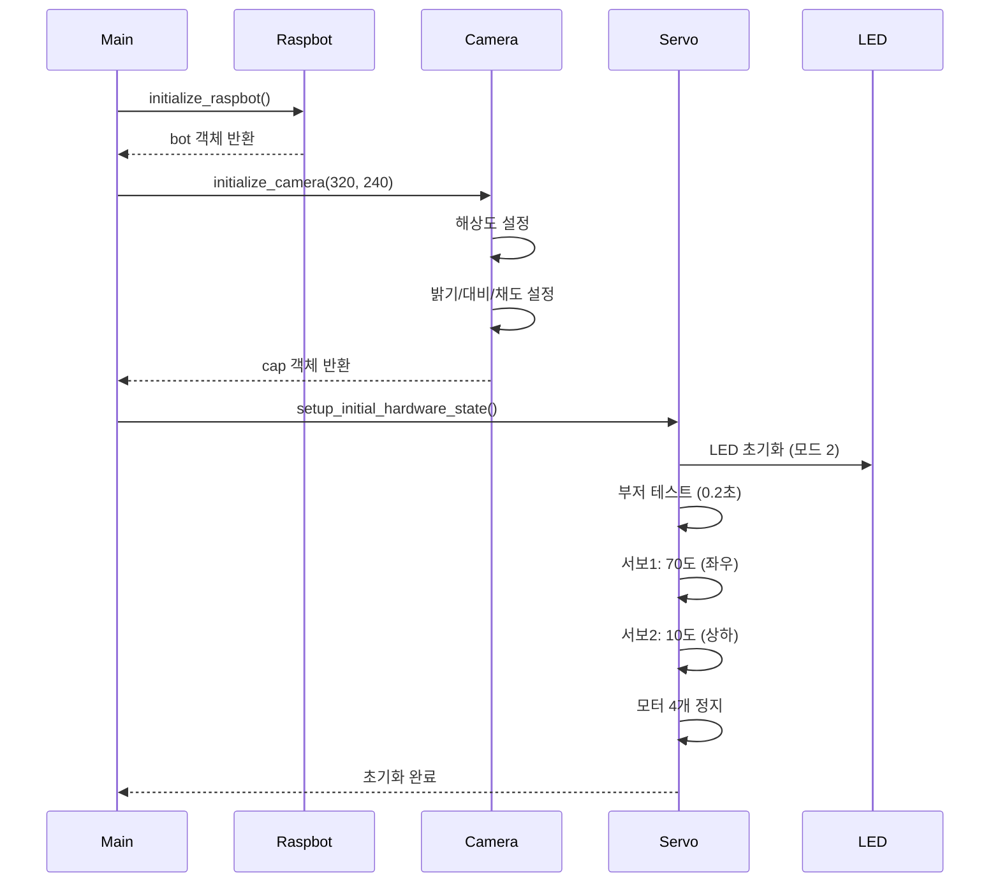

### 2. 차량 제어 기능 상세

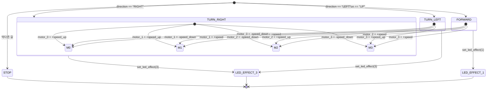

### 3. 막다른 길 감지 및 랜덤 방향 선택 알고리즘

```mermaid
flowchart LR
    A[decide_direction 호출] --> B[1단계: 히스토그램 3등분 분석]
    B --> B1[LEFT_SUM 계산]
    B --> B2[CENTER_SUM 계산]
    B --> B3[RIGHT_SUM 계산]
    
    B1 --> C[2단계: 중앙 비율 계산]
    B2 --> C
    B3 --> C
    C --> C1[center_ratio = CENTER_SUM / 전체 합계]
    
    C1 --> D{3단계: 막다른 길 판단<br/>center_ratio > 0.7?}
    
    D -->|예, 막다른 길| E[4단계: 막다른 길 처리]
    D -->|아니오, 정상| F[5단계: 정상 방향 분석]
    
    E --> E1[DEBUG 메시지 출력<br/>Dead end detected!]
    E1 --> E2[차량 정지<br/>car_stop]
    E2 --> E3[0.3초 대기<br/>time.sleep 0.3]
    E3 --> E4[랜덤 방향 선택<br/>random.choice LEFT/RIGHT]
    E4 --> E5[DEBUG 메시지<br/>Selected direction: LEFT/RIGHT]
    E5 --> E6[부저 2회 울림]
    E6 --> E61[부저 ON 0.1초]
    E61 --> E62[부저 OFF 0.1초]
    E62 --> E63[부저 ON 0.1초]
    E63 --> E64[부저 OFF]
    E64 --> G[랜덤 방향 반환]
    
    F --> F1[LEFT/RIGHT 차이 계산<br/>DIFF = abs LEFT - RIGHT]
    F1 --> F2{DIFF > Threshold?}
    F2 -->|예| F3{RIGHT > LEFT?}
    F2 -->|아니오| F4[UP 직진 반환]
    F3 -->|예| F5[LEFT 회전 반환]
    F3 -->|아니오| F6[RIGHT 회전 반환]
    
    G --> H[방향 반환 완료]
    F4 --> H
    F5 --> H
    F6 --> H
    
    H --> I[control_car direction 호출]
    
    style E fill:#ffe1e1
    style G fill:#fff4e1
    style H fill:#e1f5e1
```

### 막다른 길 처리 단계별 상세표

| 단계 | 처리 내용 | 함수/명령 | 파라미터 | 시간 |
|------|----------|-----------|---------|------|
| 1 | 히스토그램 분석 | analyze_histogram() | histogram | 즉시 |
| 2 | 중앙 비율 계산 | center_ratio = CENTER / 전체 | - | 즉시 |
| 3 | 막다른 길 판단 | if center_ratio > 0.7 | 0.7 | 즉시 |
| 4-1 | DEBUG 출력 | print("Dead end detected!") | - | 즉시 |
| 4-2 | 차량 정지 | car_stop() | - | 즉시 |
| 4-3 | 대기 | time.sleep(0.3) | 0.3초 | 0.3초 |
| 4-4 | 랜덤 선택 | random.choice(["LEFT", "RIGHT"]) | - | 즉시 |
| 4-5 | DEBUG 출력 | print("Selected:", direction) | - | 즉시 |
| 4-6 | 부저 1회 | bot.Beep(0.1) | 0.1초 | 0.1초 |
| 4-7 | 대기 | time.sleep(0.1) | 0.1초 | 0.1초 |
| 4-8 | 부저 2회 | bot.Beep(0.1) | 0.1초 | 0.1초 |
| **총 시간** | **막다른 길 처리** | - | - | **약 0.6초** |

### 교육생 실습: 서보 모터 대체 경로 탐색 알고리즘

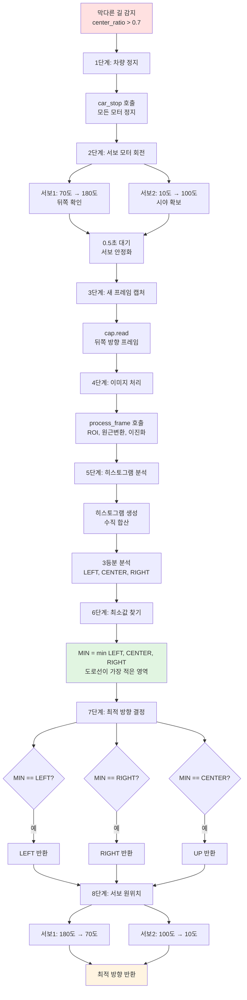

**현재 문제점**: 막다른 길에서 랜덤으로 방향을 선택하므로 비효율적

**개선 목표**: 서보 모터를 활용하여 실제로 주행 가능한 경로를 찾아 선택

### 구현 단계 상세표

| 단계 | 처리 내용 | 함수/명령 | 파라미터 | 예상 시간 |
|------|----------|-----------|---------|----------|
| 1 | 차량 정지 | car_stop() | - | 즉시 |
| 2-1 | 서보1 회전 | bot.Ctrl_Servo(1, 180) | 180도 | 0.3초 |
| 2-2 | 서보2 조정 | bot.Ctrl_Servo(2, 100) | 100도 | 0.3초 |
| 2-3 | 안정화 대기 | time.sleep(0.5) | 0.5초 | 0.5초 |
| 3 | 프레임 캡처 | cap.read() | - | 0.03초 |
| 4 | 이미지 처리 | process_frame() | detect_value, ROI | 0.05초 |
| 5-1 | 히스토그램 생성 | np.sum(axis=0) | - | 0.002초 |
| 5-2 | 3등분 분석 | analyze_histogram() | - | 0.001초 |
| 6 | 최소값 찾기 | min(LEFT, CENTER, RIGHT) | - | 즉시 |
| 7 | 방향 결정 | if-elif-else | - | 즉시 |
| 8-1 | 서보1 원위치 | bot.Ctrl_Servo(1, 70) | 70도 | 0.3초 |
| 8-2 | 서보2 원위치 | bot.Ctrl_Servo(2, 10) | 10도 | 0.3초 |
| **총 시간** | **전체 처리** | - | - | **약 1.5초** |

```python
# 교육생 구현 예시 (참고용)
def rotate_servo_and_check_direction(detect_value, roi_top_y, roi_bottom_y):
    # 1. 서보 회전
    bot.Ctrl_Servo(1, 180)
    bot.Ctrl_Servo(2, 100)
    time.sleep(0.5)
    
    # 2. 프레임 캡처 및 처리
    ret, frame = cap.read()
    processed_frame = process_frame(frame, detect_value, roi_top_y, roi_bottom_y)
    histogram = np.sum(processed_frame, axis=0)
    
    # 3. 3등분 분석
    left_sum, center_sum, right_sum, _, _, _ = analyze_histogram(histogram)
    
    # 4. 서보 원위치
    bot.Ctrl_Servo(1, 70)
    bot.Ctrl_Servo(2, 10)
    
    # 5. 최소값 방향 반환
    min_sum = min(left_sum, center_sum, right_sum)
    if min_sum == left_sum:
        return "LEFT"
    elif min_sum == right_sum:
        return "RIGHT"
    else:
        return "UP"
```

### 4. 키보드 입력 처리

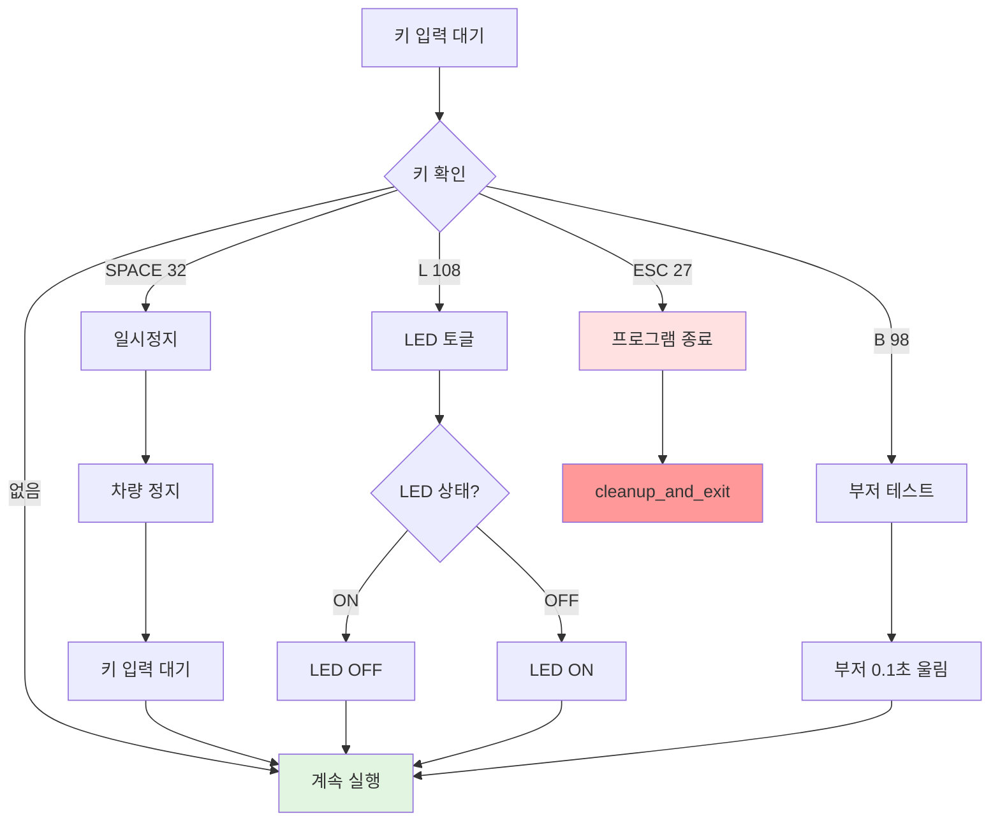

---

## 하드웨어 구성

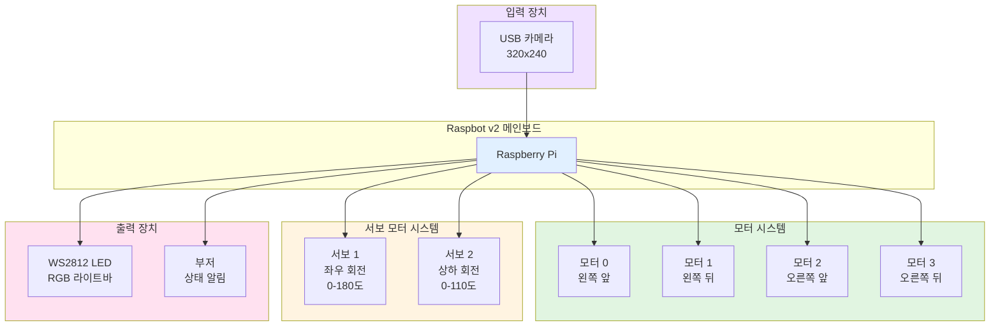

### 모터 제어 알고리즘 상세

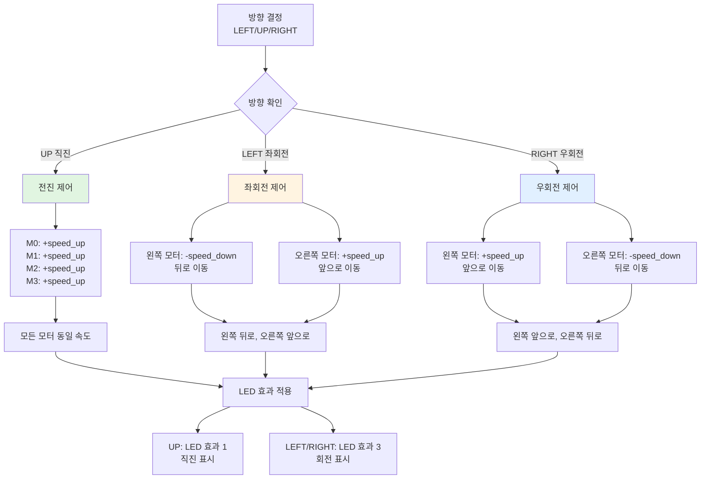

### 모터 제어 매핑 상세표

| 모터 번호 | 위치 | 전진 (UP) | 좌회전 (LEFT) | 우회전 (RIGHT) | 속도 값 |
|---------|------|-----------|--------------|--------------|---------|
| Motor 0 | 왼쪽 앞 | +speed_up | -speed_down | +speed_up | 기본: 40/-30 |
| Motor 1 | 왼쪽 뒤 | +speed_up | -speed_down | +speed_up | 기본: 40/-30 |
| Motor 2 | 오른쪽 앞 | +speed_up | +speed_up | -speed_down | 기본: 40/-30 |
| Motor 3 | 오른쪽 뒤 | +speed_up | +speed_up | -speed_down | 기본: 40/-30 |

**제어 원리**:
- **전진**: 모든 모터가 같은 방향으로 같은 속도
- **좌회전**: 왼쪽 모터는 뒤로, 오른쪽 모터는 앞으로 → 왼쪽으로 회전
- **우회전**: 왼쪽 모터는 앞으로, 오른쪽 모터는 뒤로 → 오른쪽으로 회전

---

## 설정 파라미터

### 주요 파라미터 구성도

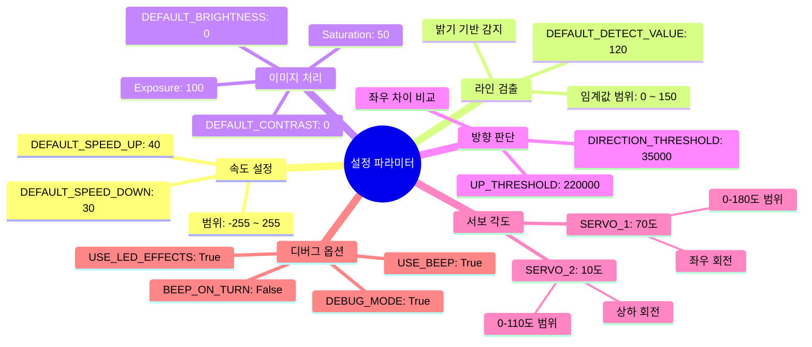

### 트랙바 파라미터 상세표

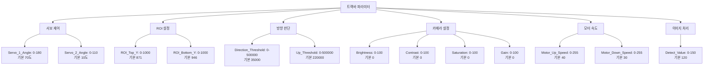

| 카테고리 | 파라미터 | 범위 | 기본값 | 단위 | 설명 |
|---------|---------|------|--------|------|------|
| **서보 제어** | Servo_1_Angle | 0-180 | 70 | 도 | 카메라 좌우 회전 각도 |
| | Servo_2_Angle | 0-110 | 10 | 도 | 카메라 상하 회전 각도 |
| **ROI 설정** | ROI_Top_Y | 0-1000 | 871 | 비율 | 관심 영역 상단 Y 좌표 (0.871) |
| | ROI_Bottom_Y | 0-1000 | 946 | 비율 | 관심 영역 하단 Y 좌표 (0.946) |
| **방향 판단** | Direction_Threshold | 0-500000 | 35000 | 픽셀 합계 | 좌우 차이 임계값 (이상이면 회전) |
| | Up_Threshold | 0-500000 | 220000 | 픽셀 합계 | 직진 판단 임계값 (이하이면 직진) |
| **카메라 설정** | Brightness | 0-100 | 0 | % | 카메라 밝기 조절 |
| | Contrast | 0-100 | 0 | % | 카메라 대비 조절 |
| | Saturation | 0-100 | 0 | % | 카메라 채도 조절 |
| | Gain | 0-100 | 0 | % | 카메라 게인 조절 |
| **모터 속도** | Motor_Up_Speed | 0-255 | 40 | 속도 | 전진/회전 고속 (양수) |
| | Motor_Down_Speed | 0-255 | 30 | 속도 | 회전 저속 (음수) |
| **이미지 처리** | Detect_Value | 0-150 | 120 | 임계값 | 도로선 검출 밝기 임계값 |

### 파라미터 튜닝 가이드

| 상황 | 조정할 파라미터 | 권장값 | 효과 |
|------|---------------|--------|------|
| 도로선이 잘 안 보임 | Detect_Value | 100-110 | 더 낮은 밝기까지 감지 |
| 도로선이 너무 많이 감지됨 | Detect_Value | 130-150 | 더 높은 밝기만 감지 |
| 회전이 너무 민감함 | Direction_Threshold | 50000-100000 | 더 큰 차이에서만 회전 |
| 회전이 너무 둔함 | Direction_Threshold | 20000-30000 | 작은 차이에서도 회전 |
| 직진이 어려움 | Up_Threshold | 250000-300000 | 더 높은 값에서 직진 |
| 막다른 길을 못 찾음 | center_ratio 임계값 | 0.6-0.65 | 코드에서 수정 필요 |
| 카메라가 너무 어두움 | Brightness | 20-40 | 밝기 증가 |
| 카메라가 너무 밝음 | Brightness | 0, Contrast 증가 | 대비 조절 |

---

## 윈도우 출력 구성

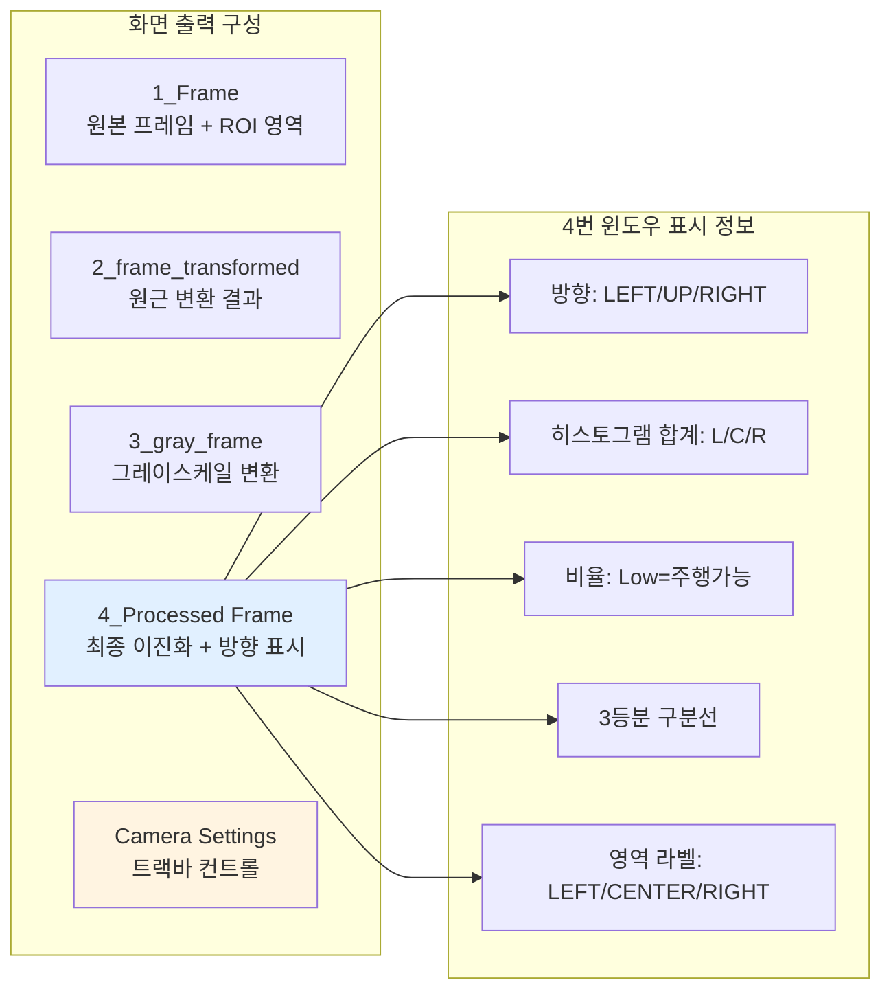

---

## 도로선 감지 알고리즘 상세

### 도로선 감지 알고리즘 상세 순서도

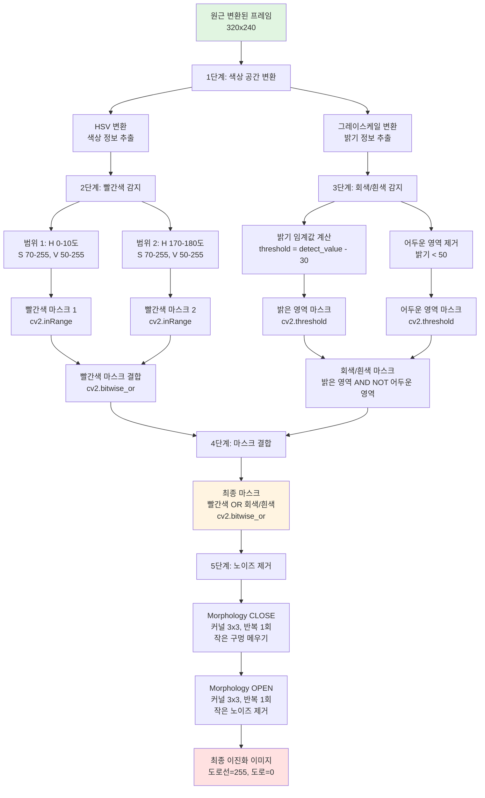

### 도로선 감지 단계별 상세표

| 단계 | 처리 내용 | 함수/연산 | 파라미터 | 결과 |
|------|----------|-----------|---------|------|
| 1 | 색상 공간 변환 | cv2.cvtColor | BGR→HSV, BGR→GRAY | HSV, 그레이스케일 이미지 |
| 2-1 | 빨간색 범위 1 | cv2.inRange | H:0-10, S:70-255, V:50-255 | 빨간색 마스크 1 |
| 2-2 | 빨간색 범위 2 | cv2.inRange | H:170-180, S:70-255, V:50-255 | 빨간색 마스크 2 |
| 2-3 | 빨간색 결합 | cv2.bitwise_or | 마스크1, 마스크2 | 통합 빨간색 마스크 |
| 3-1 | 밝기 임계값 | cv2.threshold | threshold = detect_value - 30 | 밝은 영역 마스크 |
| 3-2 | 어두운 영역 제거 | cv2.threshold | threshold < 50 | 어두운 영역 마스크 |
| 3-3 | 회색/흰색 마스크 | 논리 연산 | 밝은 AND NOT 어두운 | 회색/흰색 마스크 |
| 4 | 마스크 결합 | cv2.bitwise_or | 빨간색 OR 회색/흰색 | 최종 마스크 |
| 5-1 | Morphology CLOSE | cv2.morphologyEx | 커널 3x3, 반복 1 | 구멍 메움 |
| 5-2 | Morphology OPEN | cv2.morphologyEx | 커널 3x3, 반복 1 | 노이즈 제거 |
| 최종 | 이진화 완료 | - | - | 도로선=255, 도로=0 |

### 도로선 감지 특징 비교표

| 구분 | 검출 대상 | 제외 대상 | 처리 방법 |
|------|----------|----------|----------|
| **빨간색 도로선** | ✅ HSV 색상 공간 활용 | ❌ 다른 색상 | cv2.inRange (2개 범위) |
| **회색/흰색 도로선** | ✅ 밝기 기준 감지 | ❌ 어두운 영역 (< 50) | cv2.threshold |
| **반사된 부분** | ✅ 밝은 영역 포함 | ❌ 너무 어두운 배경 | 임계값 조정 |
| **노이즈** | - | ❌ 작은 노이즈 | Morphology OPEN |
| **구멍** | - | ❌ 작은 구멍 | Morphology CLOSE |

---

## 성능 최적화 전략

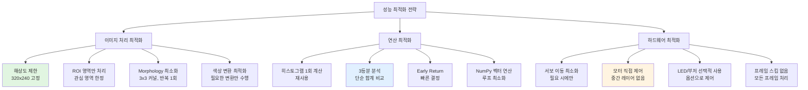

### 성능 최적화 방법 비교표

| 최적화 영역 | 방법 | 효과 | 구현 난이도 | 적용 여부 |
|------------|------|------|------------|----------|
| **이미지 처리** | 해상도 제한 320x240 | 처리량 75% 감소 | 쉬움 | ✅ 적용됨 |
| | ROI 영역만 처리 | 처리량 30% 감소 | 쉬움 | ✅ 적용됨 |
| | Morphology 최소화 | 처리 시간 50% 감소 | 쉬움 | ✅ 적용됨 |
| **연산** | 히스토그램 1회 계산 | 중복 계산 제거 | 쉬움 | ✅ 적용됨 |
| | 3등분 단순 비교 | 복잡도 O(1) | 쉬움 | ✅ 적용됨 |
| | NumPy 벡터 연산 | Python 루프 제거 | 중간 | ✅ 적용됨 |
| **하드웨어** | 서보 이동 최소화 | 지연 시간 감소 | 쉬움 | ✅ 적용됨 |
| | 모터 직접 제어 | 오버헤드 제거 | 쉬움 | ✅ 적용됨 |
| | LED/부저 옵션 | 불필요한 연산 제거 | 쉬움 | ✅ 적용됨 |
| **추가 가능** | 멀티스레딩 | 병렬 처리 | 어려움 | ❌ 미적용 |
| | GPU 가속 | OpenCV GPU | 어려움 | ❌ 미적용 |
| | 프레임 버퍼링 | 지연 시간 감소 | 중간 | ❌ 미적용 |

---

## 에러 처리 및 안전 장치

```mermaid
sequenceDiagram
    participant M as Main
    participant H as Hardware
    participant C as Camera
    participant E as Error Handler
    
    M->>H: 초기화 시도
    alt 초기화 실패
        H-->>E: Exception 발생
        E->>E: 에러 메시지 출력
        E->>M: sys.exit(1)
    else 초기화 성공
        H-->>M: 정상 진행
    end
    
    M->>C: 프레임 읽기
    alt 프레임 읽기 실패
        C-->>M: ret = False
        M->>E: 에러 처리
        E->>M: 루프 종료
    else 프레임 읽기 성공
        C-->>M: frame 반환
    end
    
    M->>M: 메인 루프 실행
    alt KeyboardInterrupt
        M-->>E: Ctrl+C 감지
        E->>E: "Interrupted by user"
    else 일반 Exception
        M-->>E: 예외 발생
        E->>E: Traceback 출력
    end
    
    E->>M: finally 블록 실행
    M->>M: cleanup_and_exit()
    Note over M: 모터 정지<br/>LED 끄기<br/>서보 원위치<br/>카메라 해제
```

---

## 실행 환경 및 요구사항

### 시스템 요구사항

```mermaid
graph TB
    subgraph 하드웨어[하드웨어 요구사항]
        H1[Raspberry Pi<br/>라즈베리 파이]
        H2[Raspbot v2<br/>메인보드]
        H3[USB 카메라<br/>320x240 이상]
        H4[DC 모터 4개]
        H5[서보 모터 2개]
    end
    
    subgraph 소프트웨어[소프트웨어 요구사항]
        S1[Python 3.x]
        S2[OpenCV cv2]
        S3[NumPy]
        S4[Raspbot_Lib]
    end
    
    subgraph 환경설정[환경 설정]
        E1[라이브러리 경로<br/>../lib/raspbot]
        E2[카메라 권한]
        E3[GPIO 권한]
    end
    
    H1 --> S1
    H2 --> S4
    H3 --> S2
    S1 --> S2
    S1 --> S3
    S1 --> S4
    S4 --> E1
    S2 --> E2
    S4 --> E3
    
    style H2 fill:#e1f0ff
    style S1 fill:#e1f5e1
    style E1 fill:#fff4e1
```

---

## 향후 개선 방향

```mermaid
mindmap
  root((개선 방향))
    교육생 실습 과제
      서보 모터 대체 경로 탐색
        랜덤 선택 → 지능형 선택
        180도 회전 후 분석
        최적 경로 자동 결정
      막다른 길 고급 알고리즘
        다중 시도 로직
        이전 경로 기억
    알고리즘 개선
      딥러닝 기반 라인 검출
      차선 예측 알고리즘
      장애물 회피 로직
    성능 최적화
      멀티스레딩 적용
      GPU 가속 활용
      프레임 버퍼링
    기능 추가
      초음파 센서 통합
      신호등 인식
      주차 기능
      자동 속도 조절
    안정성 향상
      PID 제어 도입
      칼만 필터 적용
      예외 처리 강화
    사용성 개선
      웹 인터페이스
      설정 파일 저장
      로그 기록 기능
```

---

## 디버그 팁

### 주요 디버그 포인트

1. **이미지 처리 확인**
   - 4개 윈도우로 각 단계 시각화
   - ROI 영역이 적절한지 확인
   - 도로선이 제대로 감지되는지 확인

2. **히스토그램 분석**
   - DEBUG_MODE를 True로 설정
   - 콘솔에서 LEFT/CENTER/RIGHT 값 확인
   - 비율(ratio)이 적절한지 검토

3. **방향 결정 로직**
   - direction_threshold 값 조정
   - center_ratio 임계값 튜닝 (기본 0.7)
   - 막다른 길 감지 조건 확인

4. **막다른 길 감지**
   - center_ratio > 0.7일 때 감지됨
   - 부저 2회 울림으로 확인
   - 콘솔에서 "Dead end detected!" 메시지 확인
   - 랜덤 방향 선택 로그 확인

5. **차량 제어**
   - 모터 속도 조정 (up_speed, down_speed)
   - LED 효과로 상태 확인
   - 부저로 방향 전환 및 막다른 길 확인

6. **교육생 과제 디버깅**
   - 서보 모터 회전 각도 확인 (180도)
   - 프레임 캡처 타이밍 조정
   - 히스토그램 분석 결과 검증
   - 최적 경로 선택 로직 테스트

---

## 참고 자료

### 관련 문서
- `autoplot_설명서.md`: 기본 사용 설명서
- `QUICK_START.md`: 빠른 시작 가이드
- `TUNING_GUIDE.md`: 파라미터 튜닝 가이드

### 주요 라이브러리 문서
- OpenCV 공식 문서: https://docs.opencv.org/
- NumPy 공식 문서: https://numpy.org/doc/
- Raspbot 라이브러리: `/lib/raspbot/`

---

**작성일**: 2025-11-30  
**최종 수정일**: 2025-11-30  
**버전**: 1.1  
**작성자**: AI Coding Assistant  
**소스 파일**: `0_autoplot___test.py`

### 변경 이력
- **v1.1 (2025-11-30)**: 막다른 길 감지 시 랜덤 방향 선택 기능 추가, 서보 모터 대체 경로 탐색을 교육생 실습 과제로 이동
- **v1.0 (2025-11-30)**: 초기 문서 작성

