# Raspbot v2 자율주행 시스템 분석 문서

## 📋 목차
1. [시스템 개요](#시스템-개요)
2. [버전 비교](#버전-비교)
3. [전체 유저 플로우](#전체-유저-플로우)
4. [주요 실행 단계](#주요-실행-단계)
5. [시스템 아키텍처](#시스템-아키텍처)
6. [이미지 처리 파이프라인](#이미지-처리-파이프라인)
7. [방향 결정 알고리즘](#방향-결정-알고리즘)
8. [주요 기능 상세](#주요-기능-상세)
9. [하드웨어 구성](#하드웨어-구성)
10. [설정 파라미터](#설정-파라미터)
11. [교육생 실습 과제](#교육생-실습-과제)

---

## 시스템 개요

### 프로젝트 정보
- **파일명**: 
  - `0_autoplot___test.py` (기본 교육용 버전)
  - `1_autoplot___rgb_filter.py` (RGB 필터링 버전)
- **목적**: Raspbot v2 자율주행 라인 트레이싱 교육용 시스템
- **현재 버전**: v1.4 (RGB 필터링)
- **주요 특징**:
  - 서보 모터 제어를 통한 카메라 각도 조절
  - 빨간색/회색 도로선 기반 라인 트레이싱
  - 히스토그램 3등분 분석 기반 방향 결정
  - ⭐ RGB 가중치 기반 그레이스케일 변환 (빛 반사 필터링)
  - 실시간 이미지 처리 및 차량 제어

---

## 버전 비교

### 📚 v1.3 - 기본 교육용 버전 (`0_autoplot___test.py`)

#### 구현된 핵심 기능
- ✅ **도로선 감지**: 빨간색 + 회색 도로선 감지 (HSV + 밝기 기반)
- ✅ **히스토그램 3등분 분석**: LEFT/CENTER/RIGHT 영역 분석
- ✅ **좌우 차이 기반 회전**: abs(right - left) > threshold → 회전
- ✅ **중앙 뚫림 체크**: center_ratio < 0.2 → 직진
- ✅ **막다른 길 감지**: 좌우 평균 < threshold → 랜덤 선택
- ✅ **즉시 반응**: 복잡한 안정화 없이 빠른 방향 결정
- ✅ **기본 cv2.cvtColor 그레이스케일**: 표준 그레이스케일 변환

#### 장점
- 📖 **명확한 로직**: 단계별 주석으로 이해 용이
- 🎯 **LEFT/RIGHT 정확도**: 좌우 차이만 집중하여 판단
- 🚀 **빠른 반응**: 이력 없이 즉시 방향 결정
- 🔍 **디버깅 용이**: 각 단계별 출력으로 동작 확인
- 🏃 **낮은 학습 곡선**: 기본 OpenCV 함수만 사용

#### 단점
- ⚠️ **빛 반사 취약**: 도로 검정색 표면의 빛 반사로 인한 오검출
- ⚠️ **환경 조명 민감**: 밝기 변화에 민감하게 반응
- ⚠️ **고정된 그레이스케일**: RGB 채널 비율 조정 불가

---

### ⭐ v1.4 - RGB 필터링 버전 (`1_autoplot___rgb_filter.py`)

#### 추가된 핵심 기능
- ✅ **RGB 가중치 기반 그레이스케일 변환**: 빛 반사 필터링
  - R/G/B 채널별 가중치 조정 가능 (트랙바)
  - 도로 검정색의 빛 반사 필터링
  - 환경 조명 변화 대응
- ✅ **실시간 가중치 조정**: 트랙바로 R/G/B 비율 실시간 변경
- ✅ **화면에 RGB 가중치 표시**: 디버깅 정보 제공

#### v1.3 대비 개선사항

| 항목 | v1.3 기본 버전 | v1.4 RGB 필터링 버전 |
|------|---------------|---------------------|
| **그레이스케일 변환** | cv2.cvtColor (고정) | weighted_gray (가변) |
| **빛 반사 대응** | ❌ 없음 | ✅ RGB 가중치 조정 |
| **환경 조명 적응** | ❌ 없음 | ✅ 실시간 트랙바 조정 |
| **트랙바 개수** | 13개 | 16개 (RGB 3개 추가) |
| **처리 시간** | ~57ms (17-18 FPS) | ~60ms (16-17 FPS) |
| **튜닝 난이도** | 쉬움 | 중간 (RGB 이해 필요) |
| **학습 곡선** | 낮음 | 중간 |

#### 권장 RGB 설정값

```
빛 반사 심한 환경 (실내, 형광등):
  R_weight: 30 (빨강 낮춤)
  G_weight: 40 (초록 중간)
  B_weight: 60-80 (파랑 높임) ⭐

밝은 환경 (야외, 햇빛):
  R_weight: 30 (빨강 낮춤)
  G_weight: 40 (초록 중간)
  B_weight: 60 (파랑 높임)

어두운 환경 (저조도):
  R_weight: 60 (빨강 높임)
  G_weight: 40 (초록 중간)
  B_weight: 30 (파랑 낮춤)

균형 잡힌 환경 (기본):
  R_weight: 33 (균등)
  G_weight: 33 (균등)
  B_weight: 33 (균등)
```

#### RGB 가중치 원리

```
도로 검정색 표면의 빛 반사 특성:
- 빨강(R) 채널: 빛 반사에 민감, 밝게 나타남
- 초록(G) 채널: 중간 민감도
- 파랑(B) 채널: 빛 반사에 둔감, 어둡게 나타남 ⭐

빛 반사 필터링 전략:
1. B 가중치 ↑ (60-80) → 반사 영역이 상대적으로 어둡게 처리
2. R 가중치 ↓ (30) → 반사 영역의 밝기 영향 감소
3. 결과: 빛 반사 영역이 도로선으로 오검출되지 않음
```

---

## 전체 유저 플로우

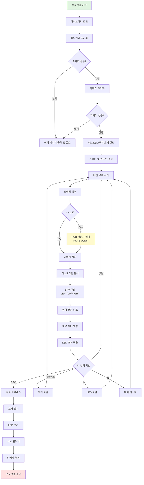
```mermaid
graph TD
    A[프로그램 시작] --> B[라이브러리 로드]
    B --> C[하드웨어 초기화]
    C --> D{초기화 성공?}
    D -->|실패| E[에러 메시지 출력 및 종료]
    D -->|성공| F[카메라 초기화]
    F --> G{카메라 성공?}
    G -->|실패| E
    G -->|성공| H[서보/LED/부저 초기 설정]
    H --> I[트랙바 및 윈도우 생성]
    I --> J[메인 루프 시작]
    
    J --> K[프레임 캡처]
    K --> K1{⭐ v1.4?}
    K1 -->|YES| K2[RGB 가중치 읽기<br/>R/G/B weight]
    K1 -->|NO| L
    K2 --> L[이미지 처리]
    L --> M[히스토그램 분석]
    M --> N[방향 결정<br/>LEFT/UP/RIGHT]
    N --> Q[방향 결정 완료]
    Q --> R[차량 제어 명령]
    R --> S[LED 효과 적용]
    S --> T{키 입력 확인}
    T -->|ESC| U[종료 프로세스]
    T -->|SPACE| V[모터 토글]
    T -->|L| W[LED 토글]
    T -->|B| X[부저 테스트]
    T -->|없음| J
    V --> J
    W --> J
    X --> J
    
    U --> Y[모터 정지]
    Y --> Z[LED 끄기]
    Z --> AA[서보 원위치]
    AA --> AB[카메라 해제]
    AB --> AC[프로그램 종료]
    
    style A fill:#e1f5e1
    style AC fill:#ffe1e1
    style K2 fill:#fffacd
```

---

## 주요 실행 단계

### 9단계 실행 프로세스


```mermaid
flowchart TB
    subgraph Step1[1단계: 초기화]
        A1[라이브러리 Import]
        A2[경로 설정]
    end
    
    subgraph Step2[2단계: 설정 로드]
        B1[속도 설정]
        B2[검출 설정]
        B3[서보 각도 설정]
        B4[⭐ RGB 가중치 설정<br/>v1.4만]
    end
    
    subgraph Step3[3단계: 하드웨어]
        C1[Raspbot 초기화]
        C2[카메라 초기화]
        C3[서보/LED 설정]
    end
    
    subgraph Step4[4단계: UI 설정]
        D1[윈도우 생성]
        D2[트랙바 생성 13개<br/>v1.3]
        D3[⭐ 트랙바 생성 16개<br/>v1.4: RGB 3개 추가]
    end
    
    subgraph Step5[5단계: 함수 정의]
        E1[이미지 처리]
        E2[⭐ weighted_gray<br/>v1.4만]
        E3[차량 제어]
        E4[서보 제어]
        E5[방향 결정]
    end
    
    subgraph Step6[6단계: 메인 루프]
        F1[실시간 처리]
        F2[방향 결정]
        F3[차량 제어]
    end
    
    subgraph Step7[7단계: 종료]
        G1[정리 작업]
        G2[리소스 해제]
    end
    
    Step1 --> Step2 --> Step3 --> Step4 --> Step5 --> Step6 --> Step7
    
    style Step1 fill:#e1f5e1
    style Step2 fill:#e1f0ff
    style Step3 fill:#fff4e1
    style Step4 fill:#f0e1ff
    style Step5 fill:#ffe1f0
    style Step6 fill:#e1ffff
    style Step7 fill:#ffe1e1
    style B4 fill:#fffacd
    style D3 fill:#fffacd
    style E2 fill:#fffacd
```

---

## 시스템 아키텍처

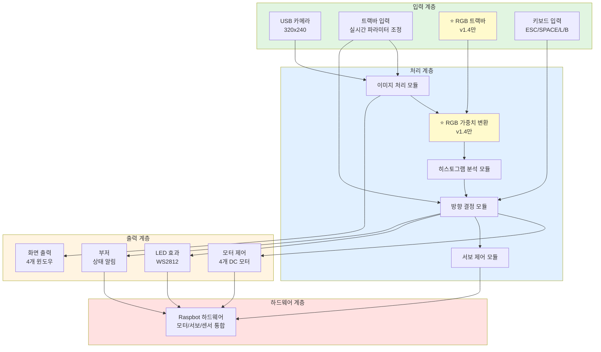
```mermaid
graph TB
    subgraph 입력층[입력 계층]
        CAM[USB 카메라<br/>320x240]
        TRK[트랙바 입력<br/>실시간 파라미터 조정]
        TRK2[⭐ RGB 트랙바<br/>v1.4만]
        KEY[키보드 입력<br/>ESC/SPACE/L/B]
    end
    
    subgraph 처리층[처리 계층]
        IMG[이미지 처리 모듈]
        RGB[⭐ RGB 가중치 변환<br/>v1.4만]
        HIST[히스토그램 분석 모듈]
        DEC[방향 결정 모듈]
        SERVO[서보 제어 모듈]
    end
    
    subgraph 출력층[출력 계층]
        MOTOR[모터 제어<br/>4개 DC 모터]
        LED[LED 효과<br/>WS2812]
        BEEP[부저<br/>상태 알림]
        DISP[화면 출력<br/>4개 윈도우]
    end
    
    subgraph 하드웨어층[하드웨어 계층]
        RASP[Raspbot 하드웨어<br/>모터/서보/센서 통합]
    end
    
    CAM --> IMG
    TRK --> IMG
    TRK2 --> RGB
    TRK --> DEC
    KEY --> DEC
    
    IMG --> RGB
    RGB --> HIST
    HIST --> DEC
    DEC --> MOTOR
    DEC --> SERVO
    DEC --> LED
    DEC --> BEEP
    IMG --> DISP
    
    MOTOR --> RASP
    LED --> RASP
    BEEP --> RASP
    SERVO --> RASP
    
    style 입력층 fill:#e1f5e1
    style 처리층 fill:#e1f0ff
    style 출력층 fill:#fff4e1
    style 하드웨어층 fill:#ffe1e1
    style TRK2 fill:#fffacd
    style RGB fill:#fffacd
```

---

## 이미지 처리 파이프라인

### v1.3 기본 버전 (`0_autoplot___test.py`)

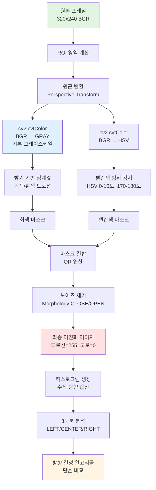
```mermaid
flowchart TD
    A[원본 프레임<br/>320x240 BGR] --> B[ROI 영역 계산]
    B --> C[원근 변환<br/>Perspective Transform]
    C --> D[cv2.cvtColor<br/>BGR → GRAY<br/>기본 그레이스케일]
    C --> E[cv2.cvtColor<br/>BGR → HSV]
    
    D --> F[밝기 기반 임계값<br/>회색/흰색 도로선]
    E --> G[빨간색 범위 감지<br/>HSV 0-10도, 170-180도]
    
    F --> H[회색 마스크]
    G --> I[빨간색 마스크]
    
    H --> J[마스크 결합<br/>OR 연산]
    I --> J
    
    J --> K[노이즈 제거<br/>Morphology CLOSE/OPEN]
    K --> L[최종 이진화 이미지<br/>도로선=255, 도로=0]
    
    L --> M[히스토그램 생성<br/>수직 방향 합산]
    M --> N[3등분 분석<br/>LEFT/CENTER/RIGHT]
    
    N --> O[방향 결정 알고리즘<br/>단순 비교]
    
    style A fill:#e1f5e1
    style D fill:#e1f0ff
    style L fill:#ffe1e1
    style O fill:#fff4e1
```

### ⭐ v1.4 RGB 필터링 버전 (`1_autoplot___rgb_filter.py`)

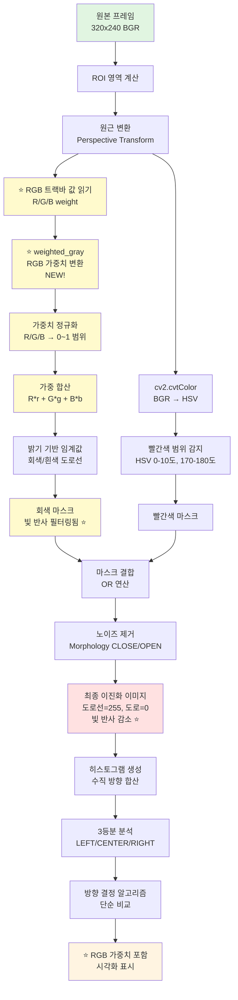
```mermaid
flowchart TD
    A[원본 프레임<br/>320x240 BGR] --> B[ROI 영역 계산]
    B --> C[원근 변환<br/>Perspective Transform]
    C --> C1[⭐ RGB 트랙바 값 읽기<br/>R/G/B weight]
    C1 --> D[⭐ weighted_gray<br/>RGB 가중치 변환<br/>NEW!]
    C --> E[cv2.cvtColor<br/>BGR → HSV]
    
    D --> D1[가중치 정규화<br/>R/G/B → 0~1 범위]
    D1 --> D2[가중 합산<br/>R*r + G*g + B*b]
    D2 --> F[밝기 기반 임계값<br/>회색/흰색 도로선]
    
    E --> G[빨간색 범위 감지<br/>HSV 0-10도, 170-180도]
    
    F --> H[회색 마스크<br/>빛 반사 필터링됨 ⭐]
    G --> I[빨간색 마스크]
    
    H --> J[마스크 결합<br/>OR 연산]
    I --> J
    
    J --> K[노이즈 제거<br/>Morphology CLOSE/OPEN]
    K --> L[최종 이진화 이미지<br/>도로선=255, 도로=0<br/>빛 반사 감소 ⭐]
    
    L --> M[히스토그램 생성<br/>수직 방향 합산]
    M --> N[3등분 분석<br/>LEFT/CENTER/RIGHT]
    
    N --> O[방향 결정 알고리즘<br/>단순 비교]
    
    O --> P[⭐ RGB 가중치 포함<br/>시각화 표시]
    
    style A fill:#e1f5e1
    style C1 fill:#fffacd
    style D fill:#fffacd
    style D1 fill:#fffacd
    style D2 fill:#fffacd
    style H fill:#fffacd
    style L fill:#ffe1e1
    style P fill:#fff4e1
```

### RGB 가중치 변환 상세 (`weighted_gray` 함수)

```python
def weighted_gray(image, r_weight, g_weight, b_weight):
    """
    RGB 가중치 기반 그레이스케일 변환
    
    처리 단계:
    1. 가중치 정규화 (0~100 → 0~1)
    2. BGR 채널 분리
    3. 가중 합산: gray = B*b + G*g + R*r
    
    원리:
    - 파랑(B) 가중치 ↑ → 빛 반사 영역 어둡게
    - 빨강(R) 가중치 ↓ → 빛 반사 영향 감소
    """
    # 1. 가중치 정규화
    r_weight /= 100.0  # 예: 30 → 0.3
    g_weight /= 100.0  # 예: 40 → 0.4
    b_weight /= 100.0  # 예: 60 → 0.6
    
    # 2-3. OpenCV BGR 순서로 가중 합산
    # image[:,:,0] = B, image[:,:,1] = G, image[:,:,2] = R
    weighted_gray_frame = cv2.addWeighted(
        cv2.addWeighted(
            image[:, :, 2], r_weight,  # R 채널
            image[:, :, 1], g_weight,  # G 채널
            0
        ),
        1.0,
        image[:, :, 0], b_weight,      # B 채널
        0
    )
    
    return weighted_gray_frame
```

### 버전별 이미지 처리 비교표

| 단계 | v1.3 기본 버전 | v1.4 RGB 필터링 버전 | 차이점 |
|------|---------------|---------------------|--------|
| **원본 프레임** | BGR 320x240 | BGR 320x240 | 동일 |
| **ROI 계산** | 사다리꼴 영역 | 사다리꼴 영역 | 동일 |
| **원근 변환** | Perspective Transform | Perspective Transform | 동일 |
| **그레이스케일** | `cv2.cvtColor(GRAY)` | `weighted_gray(R, G, B)` | ⭐ 다름 |
| **RGB 가중치** | - | R:30, G:40, B:60 | ⭐ v1.4만 |
| **HSV 변환** | 빨간색 감지용 | 빨간색 감지용 | 동일 |
| **도로선 감지** | 빨간색 + 회색 | 빨간색 + 회색 | 동일 |
| **빛 반사 대응** | ❌ 없음 | ✅ RGB 가중치로 필터링 | ⭐ 차이 |
| **노이즈 제거** | Morphology | Morphology | 동일 |
| **히스토그램** | 3등분 분석 | 3등분 분석 | 동일 |
| **방향 결정** | 좌우 차이 비교 | 좌우 차이 비교 | 동일 |
| **시각화** | 기본 정보 | ⭐ RGB 가중치 포함 | v1.4 추가 |

---

## 방향 결정 알고리즘

### 공통 알고리즘 (v1.3 & v1.4)

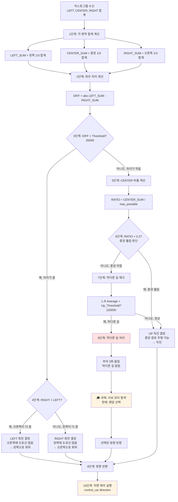
```mermaid
flowchart TD
    A[히스토그램 수신<br/>LEFT, CENTER, RIGHT 합계] --> B[1단계: 각 영역 합계 계산]
    
    B --> B1[LEFT_SUM = 왼쪽 1/3 합계]
    B --> B2[CENTER_SUM = 중앙 1/3 합계]
    B --> B3[RIGHT_SUM = 오른쪽 1/3 합계]
    
    B1 --> C[2단계: 좌우 차이 계산]
    B2 --> C
    B3 --> C
    C --> C1[DIFF = abs LEFT_SUM - RIGHT_SUM]
    
    C1 --> D{3단계: DIFF > Threshold?<br/>35000}
    
    D -->|예, 차이가 큼| E{4단계: RIGHT > LEFT?}
    E -->|예, 오른쪽이 더 큼| F[LEFT 회전 결정<br/>오른쪽에 도로선 많음<br/>→ 왼쪽으로 회피]
    E -->|아니오, 왼쪽이 더 큼| G[RIGHT 회전 결정<br/>왼쪽에 도로선 많음<br/>→ 오른쪽으로 회피]
    
    D -->|아니오, 차이가 작음| H[5단계: CENTER 비율 계산]
    H --> H1[RATIO = CENTER_SUM / max_possible]
    H1 --> I{6단계: RATIO < 0.2?<br/>중앙 뚫림 판단}
    
    I -->|예, 중앙 뚫림| L[UP 직진 결정<br/>중앙 경로 주행 가능<br/>→ 직진]
    
    I -->|아니오, 중앙 막힘| J[7단계: 막다른 길 체크]
    J --> J1[L-R Average < Up_Threshold?<br/>220000]
    
    J1 -->|예, 막다른 길| K[8단계: 막다른 길 처리]
    K --> K1[부저 3회 울림<br/>막다른 길 알림]
    K1 --> K2[🎓 과제: 서보 모터 탐색<br/>현재: 랜덤 선택]
    K2 --> M[선택된 방향 반환]
    
    J1 -->|아니오, 정상| L
    
    F --> N[9단계: 방향 반환]
    G --> N
    M --> N
    L --> N
    
    N --> O[10단계: 차량 제어 실행<br/>control_car direction]
    
    style K fill:#ffe1e1
    style O fill:#fff4e1
    style K2 fill:#fff4e1
```

### 방향 결정 로직 비교

| 단계 | v1.3 기본 버전 | v1.4 RGB 필터링 버전 | 차이점 |
|------|---------------|---------------------|--------|
| **1. 히스토그램 입력** | LEFT/CENTER/RIGHT | LEFT/CENTER/RIGHT | 동일 |
| **2. 좌우 차이 계산** | abs(R - L) | abs(R - L) | 동일 |
| **3. 차이 임계값 비교** | > 35000 | > 35000 | 동일 |
| **4. 회전 방향 결정** | RIGHT > LEFT → LEFT 회전 | RIGHT > LEFT → LEFT 회전 | 동일 |
| **5. 중앙 비율 계산** | center_ratio | center_ratio | 동일 |
| **6. 중앙 뚫림 체크** | < 0.2 → 직진 | < 0.2 → 직진 | 동일 |
| **7. 막다른 길 감지** | L-R 평균 < 220000 | L-R 평균 < 220000 | 동일 |
| **8. 막다른 길 처리** | 부저 3회 + 랜덤 | 부저 3회 + 랜덤 | 동일 |
| **9. 방향 반환** | LEFT/UP/RIGHT | LEFT/UP/RIGHT | 동일 |
| **10. 차량 제어** | control_car() | control_car() | 동일 |

**결론**: 방향 결정 로직은 두 버전이 완전히 동일합니다.  
v1.4의 개선점은 **이미지 처리 단계**에서만 적용됩니다.

---

## 주요 기능 상세

### ⭐ v1.4 신규 기능: RGB 가중치 기반 그레이스케일 변환

#### 문제 상황
```
문제: 도로 검정색 표면의 빛 반사
- 형광등, 햇빛 반사로 검정 도로가 밝게 보임
- 기본 그레이스케일 변환: R, G, B 동일 비율 (0.33, 0.33, 0.33)
- 빛 반사 영역이 도로선으로 오검출
- 회전 방향 오판단 발생
```

#### 해결 방법: RGB 가중치 조정

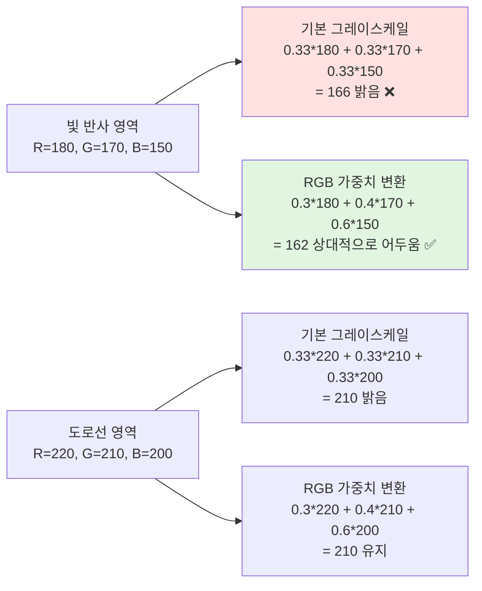
```mermaid
flowchart LR
    A[빛 반사 영역<br/>R=180, G=170, B=150] --> B[기본 그레이스케일<br/>0.33*180 + 0.33*170 + 0.33*150<br/>= 166 밝음 ❌]
    A --> C[RGB 가중치 변환<br/>0.3*180 + 0.4*170 + 0.6*150<br/>= 162 상대적으로 어두움 ✅]
    
    D[도로선 영역<br/>R=220, G=210, B=200] --> E[기본 그레이스케일<br/>0.33*220 + 0.33*210 + 0.33*200<br/>= 210 밝음]
    D --> F[RGB 가중치 변환<br/>0.3*220 + 0.4*210 + 0.6*200<br/>= 210 유지]
    
    style B fill:#ffe1e1
    style C fill:#e1f5e1
```

#### 실전 예시

```python
# 상황: 빛 반사로 인한 오검출
원본 프레임 (BGR):
  빛 반사 영역: [150, 170, 180] (B, G, R)
  실제 도로선: [200, 210, 220]

# v1.3 기본 버전 (cv2.cvtColor)
그레이스케일 변환:
  빛 반사: 0.299*180 + 0.587*170 + 0.114*150 ≈ 171
  도로선:   0.299*220 + 0.587*210 + 0.114*200 ≈ 214
  차이:     214 - 171 = 43 (구분 어려움)

# v1.4 RGB 필터링 버전 (R:30, G:40, B:60)
가중치 변환:
  빛 반사: 0.3*180 + 0.4*170 + 0.6*150 = 162
  도로선:   0.3*220 + 0.4*210 + 0.6*200 = 210
  차이:     210 - 162 = 48 (구분 개선)

효과: B 가중치를 높여 빛 반사 영향 감소 ✅
```

#### 트랙바 설정 가이드

| 환경 | R_weight | G_weight | B_weight | 설명 |
|------|---------|---------|---------|------|
| **빛 반사 심함** | 30 | 40 | 70-80 | B 채널 최대 강조 |
| **밝은 실내** | 30 | 40 | 60 | 기본 권장 설정 |
| **야외 햇빛** | 30 | 40 | 60 | 밝은 환경 대응 |
| **어두운 환경** | 60 | 40 | 30 | R 채널 강조 |
| **균형 잡힌 환경** | 33 | 33 | 33 | 표준 그레이스케일 |

---

### 막다른 길 감지 및 처리 (v1.3 & v1.4 공통)

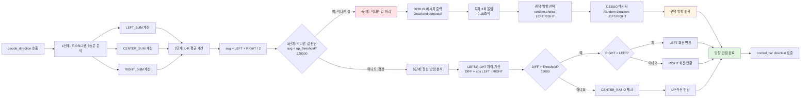
```mermaid
flowchart LR
    A[decide_direction 호출] --> B[1단계: 히스토그램 3등분 분석]
    B --> B1[LEFT_SUM 계산]
    B --> B2[CENTER_SUM 계산]
    B --> B3[RIGHT_SUM 계산]
    
    B1 --> C[2단계: L-R 평균 계산]
    B2 --> C
    B3 --> C
    C --> C1[avg = LEFT + RIGHT / 2]
    
    C1 --> D{3단계: 막다른 길 판단<br/>avg < up_threshold?<br/>220000}
    
    D -->|예, 막다른 길| E[4단계: 막다른 길 처리]
    D -->|아니오, 정상| F[5단계: 정상 방향 분석]
    
    E --> E1[DEBUG 메시지 출력<br/>Dead end detected!]
    E1 --> E2[부저 3회 울림<br/>0.15초씩]
    E2 --> E3[랜덤 방향 선택<br/>random.choice LEFT/RIGHT]
    E3 --> E4[DEBUG 메시지<br/>Random direction: LEFT/RIGHT]
    E4 --> G[랜덤 방향 반환]
    
    F --> F1[LEFT/RIGHT 차이 계산<br/>DIFF = abs LEFT - RIGHT]
    F1 --> F2{DIFF > Threshold?<br/>35000}
    F2 -->|예| F3{RIGHT > LEFT?}
    F2 -->|아니오| F4[CENTER_RATIO 체크]
    F3 -->|예| F5[LEFT 회전 반환]
    F3 -->|아니오| F6[RIGHT 회전 반환]
    F4 --> F7[UP 직진 반환]
    
    G --> H[방향 반환 완료]
    F5 --> H
    F6 --> H
    F7 --> H
    
    H --> I[control_car direction 호출]
    
    style E fill:#ffe1e1
    style G fill:#fff4e1
    style H fill:#e1f5e1
```

---

## 하드웨어 구성

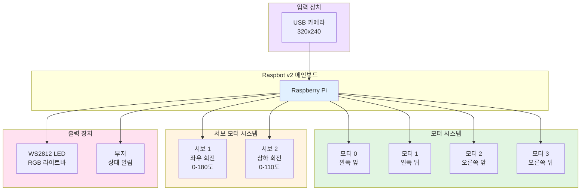
```mermaid
graph TB
    subgraph Raspbot[Raspbot v2 메인보드]
        CPU[Raspberry Pi]
    end
    
    subgraph 모터시스템[모터 시스템]
        M0[모터 0<br/>왼쪽 앞]
        M1[모터 1<br/>왼쪽 뒤]
        M2[모터 2<br/>오른쪽 앞]
        M3[모터 3<br/>오른쪽 뒤]
    end
    
    subgraph 서보시스템[서보 모터 시스템]
        S1[서보 1<br/>좌우 회전<br/>0-180도]
        S2[서보 2<br/>상하 회전<br/>0-110도]
    end
    
    subgraph 입력장치[입력 장치]
        CAM[USB 카메라<br/>320x240]
    end
    
    subgraph 출력장치[출력 장치]
        LED[WS2812 LED<br/>RGB 라이트바]
        BEEP[부저<br/>상태 알림]
    end
    
    CPU --> M0
    CPU --> M1
    CPU --> M2
    CPU --> M3
    CPU --> S1
    CPU --> S2
    CPU --> LED
    CPU --> BEEP
    CAM --> CPU
    
    style CPU fill:#e1f0ff
    style 모터시스템 fill:#e1f5e1
    style 서보시스템 fill:#fff4e1
    style 입력장치 fill:#f0e1ff
    style 출력장치 fill:#ffe1f0
```

---

## 설정 파라미터

### 공통 파라미터 (v1.3 & v1.4)

| 카테고리 | 파라미터 | 범위 | 기본값 | 단위 | 설명 |
|---------|---------|------|--------|------|------|
| **속도** | Motor_Up_Speed | 0-255 | 15 | 속도 | 전진/회전 고속 |
| | Motor_Down_Speed | 0-255 | 8 | 속도 | 회전 저속 |
| **라인 검출** | Detect_Value | 0-150 | 120 | 임계값 | 도로선 검출 밝기 |
| **이미지** | Brightness | 0-100 | 32 | % | 카메라 밝기 |
| | Contrast | 0-100 | 0 | % | 카메라 대비 |
| | Saturation | 0-100 | 0 | % | 카메라 채도 |
| | Gain | 0-100 | 0 | % | 카메라 게인 |
| **방향 판단** | Direction_Threshold | 0-500000 | 35000 | 픽셀 합계 | 좌우 차이 임계값 |
| | Up_Threshold | 0-500000 | 220000 | 픽셀 합계 | 막다른 길 감지 |
| **서보** | Servo_1_Angle | 0-180 | 95 | 도 | 좌우 각도 |
| | Servo_2_Angle | 0-110 | 0 | 도 | 상하 각도 |
| **ROI** | ROI_Top_Y | 0-1000 | 695 | 비율 | 상단 Y (0.695) |
| | ROI_Bottom_Y | 0-1000 | 812 | 비율 | 하단 Y (0.812) |

### ⭐ v1.4 전용 파라미터 (RGB 필터링)

| 카테고리 | 파라미터 | 범위 | 기본값 | 단위 | 설명 |
|---------|---------|------|--------|------|------|
| **RGB 가중치** | R_weight | 0-100 | 30 | % | 빨강 채널 가중치 |
| | G_weight | 0-100 | 40 | % | 초록 채널 가중치 |
| | B_weight | 0-100 | 60 | % | 파랑 채널 가중치 ⭐ |

### 트랙바 개수 비교

| 버전 | 트랙바 개수 | 추가 항목 |
|------|-----------|----------|
| v1.3 기본 | 13개 | - |
| v1.4 RGB | 16개 | R_weight, G_weight, B_weight (3개) |

---

## 교육생 실습 과제

### 🎓 과제 1: 서보 모터 활용 대체 경로 탐색 (v1.3 & v1.4)

#### 현재 문제점
```python
# 현재 구현 (랜덤 방식)
if left_right_avg < up_threshold:
    # 막다른 길 감지
    bot.Ctrl_BEEP_Switch(1)  # 부저 3회
    random_direction = random.choice(["LEFT", "RIGHT"])
    return random_direction  # 랜덤 선택 ❌
```

#### 개선 목표
- 서보 모터를 180도 회전하여 뒤쪽 확인
- 히스토그램 분석으로 최적 경로 결정
- 좌/우/뒤 중 가장 주행 가능한 방향 선택

#### 구현 단계

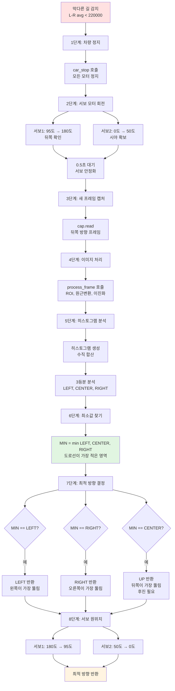
```mermaid
flowchart TD
    A[막다른 길 감지<br/>L-R avg < 220000] --> B[1단계: 차량 정지]
    B --> B1[car_stop 호출<br/>모든 모터 정지]
    B1 --> C[2단계: 서보 모터 회전]
    
    C --> C1[서보1: 95도 → 180도<br/>뒤쪽 확인]
    C --> C2[서보2: 0도 → 50도<br/>시야 확보]
    C1 --> D[0.5초 대기<br/>서보 안정화]
    C2 --> D
    
    D --> E[3단계: 새 프레임 캡처]
    E --> E1[cap.read<br/>뒤쪽 방향 프레임]
    E1 --> F[4단계: 이미지 처리]
    
    F --> F1[process_frame 호출<br/>ROI, 원근변환, 이진화]
    F1 --> G[5단계: 히스토그램 분석]
    
    G --> G1[히스토그램 생성<br/>수직 합산]
    G1 --> G2[3등분 분석<br/>LEFT, CENTER, RIGHT]
    G2 --> H[6단계: 최소값 찾기]
    
    H --> H1[MIN = min LEFT, CENTER, RIGHT<br/>도로선이 가장 적은 영역]
    H1 --> I[7단계: 최적 방향 결정]
    
    I --> I1{MIN == LEFT?}
    I --> I2{MIN == RIGHT?}
    I --> I3{MIN == CENTER?}
    
    I1 -->|예| J1[LEFT 반환<br/>왼쪽이 가장 뚫림]
    I2 -->|예| J2[RIGHT 반환<br/>오른쪽이 가장 뚫림]
    I3 -->|예| J3[UP 반환<br/>뒤쪽이 가장 뚫림<br/>후진 필요]
    
    J1 --> K[8단계: 서보 원위치]
    J2 --> K
    J3 --> K
    
    K --> K1[서보1: 180도 → 95도]
    K --> K2[서보2: 50도 → 0도]
    K1 --> L[최적 방향 반환]
    K2 --> L
    
    style A fill:#ffe1e1
    style H1 fill:#e1f5e1
    style L fill:#fff4e1
```

#### 참고 코드 (교육생 구현용)

```python
def rotate_servo_and_check_direction(detect_value, roi_top_y, roi_bottom_y, 
                                     r_weight=None, g_weight=None, b_weight=None):
    """
    서보 모터를 활용한 대체 경로 탐색
    
    Args:
        detect_value: 도로선 검출 임계값
        roi_top_y: ROI 상단 Y 좌표
        roi_bottom_y: ROI 하단 Y 좌표
        r_weight, g_weight, b_weight: RGB 가중치 (v1.4만 사용)
    
    Returns:
        str: 최적 방향 ("LEFT", "RIGHT", "UP")
    """
    print("\n" + "=" * 60)
    print("🔍 서보 모터 대체 경로 탐색 시작")
    print("=" * 60)
    
    # 1. 서보 회전 (뒤쪽 확인)
    print("1. 서보 모터 회전 중...")
    bot.Ctrl_Servo(1, 180)  # 180도 회전
    bot.Ctrl_Servo(2, 50)   # 상하 조정
    time.sleep(0.5)         # 안정화 대기
    
    # 2. 프레임 캡처 및 처리
    print("2. 뒤쪽 프레임 캡처 및 분석 중...")
    ret, frame = cap.read()
    if not ret:
        print("   ❌ 프레임 캡처 실패")
        bot.Ctrl_Servo(1, 95)
        bot.Ctrl_Servo(2, 0)
        return "LEFT"  # 기본값
    
    # v1.4 RGB 필터링 버전
    if r_weight is not None:
        processed_frame = process_frame(
            frame, detect_value, roi_top_y, roi_bottom_y,
            r_weight, g_weight, b_weight
        )
    else:
        # v1.3 기본 버전
        processed_frame = process_frame(
            frame, detect_value, roi_top_y, roi_bottom_y
        )
    
    # 3. 히스토그램 생성 및 3등분 분석
    histogram = np.sum(processed_frame, axis=0)
    left_sum, center_sum, right_sum, _, _, _ = analyze_histogram(histogram)
    
    print(f"   LEFT:   {left_sum:7d} (낮을수록 주행 가능)")
    print(f"   CENTER: {center_sum:7d}")
    print(f"   RIGHT:  {right_sum:7d}")
    
    # 4. 최소값 찾기 (도로선이 가장 적은 영역)
    min_sum = min(left_sum, center_sum, right_sum)
    
    # 5. 방향 결정
    if min_sum == left_sum:
        direction = "LEFT"
        print(f"   ✅ 왼쪽이 가장 뚫림 (합계: {left_sum})")
    elif min_sum == right_sum:
        direction = "RIGHT"
        print(f"   ✅ 오른쪽이 가장 뚫림 (합계: {right_sum})")
    else:
        direction = "UP"
        print(f"   ✅ 뒤쪽(중앙)이 가장 뚫림 (합계: {center_sum})")
        print(f"   ⚠️ 후진 기능 필요 (과제 확장)")
    
    # 6. 서보 원위치
    print("3. 서보 모터 원위치 복귀 중...")
    bot.Ctrl_Servo(1, 95)
    bot.Ctrl_Servo(2, 0)
    time.sleep(0.3)
    
    print(f"🎯 선택된 방향: {direction}")
    print("=" * 60 + "\n")
    
    return direction
```

#### 구현 위치

```python
# decide_direction 함수 내부에서 막다른 길 감지 시
if left_right_avg < up_threshold:
    if DEBUG_MODE:
        print("\n" + "=" * 60)
        print("WARNING: Dead End Detected!")
        print("=" * 60)
    
    # Beep alarm for dead end (3 times)
    if USE_BEEP:
        for _ in range(3):
            bot.Ctrl_BEEP_Switch(1)
            time.sleep(0.15)
            bot.Ctrl_BEEP_Switch(0)
            time.sleep(0.1)
    
    # 🎓 과제: 서보 모터 탐색으로 변경
    # 기존: random_direction = random.choice(["LEFT", "RIGHT"])
    # 신규: rotate_servo_and_check_direction 호출
    if USE_SERVO_SEARCH:  # 새로운 설정 변수 추가
        params = read_trackbar_values()
        if 'r_weight' in params:  # v1.4
            random_direction = rotate_servo_and_check_direction(
                params["detect_value"],
                params["roi_top_y"],
                params["roi_bottom_y"],
                params["r_weight"],
                params["g_weight"],
                params["b_weight"]
            )
        else:  # v1.3
            random_direction = rotate_servo_and_check_direction(
                params["detect_value"],
                params["roi_top_y"],
                params["roi_bottom_y"]
            )
    else:
        # 기본: 랜덤 선택
        random_direction = random.choice(["LEFT", "RIGHT"])
    
    return random_direction, left_sum, center_sum, right_sum
```

#### 예상 효과
- ✅ 막다른 길에서 지능형 방향 선택
- ✅ 랜덤 선택 대비 정확도 향상
- ✅ 불필요한 재시도 감소
- ⚠️ 처리 시간 약 1.5초 추가

---

### 🎓 과제 2: 빛 반사 고급 필터링 (v1.4 확장)

#### 현재 상황 (v1.4)
- RGB 가중치로 빛 반사 영향 감소
- 수동 트랙바 조정 필요
- 환경 변화 시 재조정 필요

#### 개선 목표
- 자동으로 과도한 반사 영역 감지 및 제거
- 전체 밝기 체크하여 빛 반사 판단
- 좌우 유사도 체크하여 무조건 직진

#### 구현 알고리즘

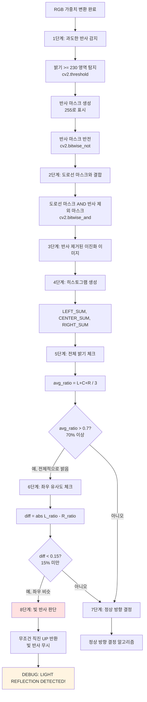
```mermaid
flowchart TD
    A[RGB 가중치 변환 완료] --> B[1단계: 과도한 반사 감지]
    B --> B1[밝기 >= 230 영역 탐지<br/>cv2.threshold]
    B1 --> B2[반사 마스크 생성<br/>255로 표시]
    B2 --> B3[반사 마스크 반전<br/>cv2.bitwise_not]
    
    B3 --> C[2단계: 도로선 마스크와 결합]
    C --> C1[도로선 마스크 AND 반사 제외 마스크<br/>cv2.bitwise_and]
    C1 --> D[3단계: 반사 제거된 이진화 이미지]
    
    D --> E[4단계: 히스토그램 생성]
    E --> E1[LEFT_SUM, CENTER_SUM, RIGHT_SUM]
    
    E1 --> F[5단계: 전체 밝기 체크]
    F --> F1[avg_ratio = L+C+R / 3]
    F1 --> G{avg_ratio > 0.7?<br/>70% 이상}
    
    G -->|예, 전체적으로 밝음| H[6단계: 좌우 유사도 체크]
    G -->|아니오| I[7단계: 정상 방향 결정]
    
    H --> H1[diff = abs L_ratio - R_ratio]
    H1 --> J{diff < 0.15?<br/>15% 미만}
    
    J -->|예, 좌우 비슷| K[8단계: 빛 반사 판단]
    J -->|아니오| I
    
    K --> K1[무조건 직진 UP 반환<br/>빛 반사 무시]
    K1 --> L[DEBUG: LIGHT REFLECTION DETECTED!]
    
    I --> M[정상 방향 결정 알고리즘]
    
    style K fill:#ffe1e1
    style L fill:#fff4e1
```

#### 참고 코드 (교육생 구현용)

```python
def detect_road_lines_with_reflection_filter(color_frame, gray_frame, detect_value):
    """
    도로선 감지 + 빛 반사 고급 필터링
    
    v1.4 기반 확장 버전
    """
    # 0. 과도한 반사 영역 감지
    REFLECTION_THRESHOLD = 230
    _, reflection_mask = cv2.threshold(
        gray_frame, REFLECTION_THRESHOLD, 255, cv2.THRESH_BINARY
    )
    reflection_mask_inv = cv2.bitwise_not(reflection_mask)
    
    # 1. HSV 변환 (빨간색 감지)
    hsv_frame = cv2.cvtColor(color_frame, cv2.COLOR_BGR2HSV)
    
    # 빨간색 범위 감지
    lower_red1 = np.array([0, 70, 50])
    upper_red1 = np.array([10, 255, 255])
    mask_red1 = cv2.inRange(hsv_frame, lower_red1, upper_red1)
    
    lower_red2 = np.array([170, 70, 50])
    upper_red2 = np.array([180, 255, 255])
    mask_red2 = cv2.inRange(hsv_frame, lower_red2, upper_red2)
    
    mask_red = cv2.bitwise_or(mask_red1, mask_red2)
    
    # 2. 엷은 회색/흰색 감지
    threshold_gray = max(detect_value - 30, 80)
    _, mask_gray = cv2.threshold(gray_frame, threshold_gray, 255, cv2.THRESH_BINARY)
    
    dark_threshold = 50
    _, mask_dark = cv2.threshold(gray_frame, dark_threshold, 255, cv2.THRESH_BINARY)
    mask_gray = cv2.bitwise_and(mask_gray, mask_dark)
    
    # 3. 마스크 결합
    mask_lines = cv2.bitwise_or(mask_red, mask_gray)
    
    # 4. ⭐ 빛 반사 영역 제거
    mask_lines = cv2.bitwise_and(mask_lines, reflection_mask_inv)
    
    # 5. 노이즈 제거
    kernel = np.ones((3, 3), np.uint8)
    mask_lines = cv2.morphologyEx(mask_lines, cv2.MORPH_CLOSE, kernel)
    mask_lines = cv2.morphologyEx(mask_lines, cv2.MORPH_OPEN, kernel)
    
    return mask_lines


def check_light_reflection(left_sum, center_sum, right_sum, height):
    """
    빛 반사 판단 알고리즘
    
    Returns:
        bool: True=빛 반사 감지, False=정상
    """
    OVERALL_BRIGHTNESS_THRESHOLD = 0.7  # 70%
    LEFT_RIGHT_RATIO_THRESHOLD = 0.15   # 15%
    
    # 1. 전체 밝기 체크
    max_possible = height * 255
    left_ratio = left_sum / (max_possible / 3)
    center_ratio = center_sum / (max_possible / 3)
    right_ratio = right_sum / (max_possible / 3)
    
    avg_ratio = (left_ratio + center_ratio + right_ratio) / 3
    
    if avg_ratio < OVERALL_BRIGHTNESS_THRESHOLD:
        return False  # 전체적으로 어두움 → 정상
    
    # 2. 좌우 유사도 체크
    diff = abs(left_ratio - right_ratio)
    
    if diff >= LEFT_RIGHT_RATIO_THRESHOLD:
        return False  # 좌우 차이 큼 → 정상 (실제 도로선)
    
    # 3. 빛 반사 판단
    if DEBUG_MODE:
        print("\n" + "=" * 60)
        print("⚠️ LIGHT REFLECTION DETECTED!")
        print("=" * 60)
        print(f"Overall brightness: {avg_ratio:.2f} (> {OVERALL_BRIGHTNESS_THRESHOLD})")
        print(f"Left-Right diff: {diff:.2f} (< {LEFT_RIGHT_RATIO_THRESHOLD})")
        print("Action: Force STRAIGHT (ignore reflection)")
        print("=" * 60 + "\n")
    
    return True  # 빛 반사 감지


# decide_direction 함수 내부에 추가
def decide_direction_with_reflection_check(...):
    # ... 기존 히스토그램 분석 ...
    
    # ⭐ 빛 반사 체크 (최우선)
    if check_light_reflection(left_sum, center_sum, right_sum, len(histogram)):
        return "UP", left_sum, center_sum, right_sum  # 무조건 직진
    
    # ... 기존 방향 결정 로직 ...
```

#### 예상 효과
- ✅ 빛 반사 자동 감지 및 대응
- ✅ 환경 변화에 강건한 주행
- ✅ 수동 조정 빈도 감소

---

### 🎓 과제 3: 방향 안정화 시스템 (v1.3 & v1.4)

#### 현재 문제점
- 순간적인 노이즈로 급격한 방향 변화
- 프레임마다 다른 방향 선택
- 불안정한 주행 패턴

#### 개선 목표
- 최근 5개 프레임 이력 저장
- 다수결 방식으로 방향 선택
- 급격한 히스토그램 변화 감지

#### 구현 알고리즘

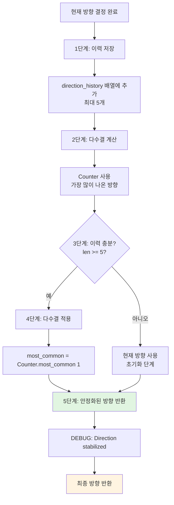
```mermaid
flowchart TD
    A[현재 방향 결정 완료] --> B[1단계: 이력 저장]
    B --> B1[direction_history 배열에 추가<br/>최대 5개]
    
    B1 --> C[2단계: 다수결 계산]
    C --> C1[Counter 사용<br/>가장 많이 나온 방향]
    
    C1 --> D{3단계: 이력 충분?<br/>len >= 5?}
    
    D -->|예| E[4단계: 다수결 적용]
    D -->|아니오| F[현재 방향 사용<br/>초기화 단계]
    
    E --> E1[most_common = Counter.most_common 1]
    E1 --> G[5단계: 안정화된 방향 반환]
    
    F --> G
    
    G --> H[DEBUG: Direction stabilized]
    H --> I[최종 방향 반환]
    
    style G fill:#e1f5e1
    style I fill:#fff4e1
```

#### 참고 코드 (교육생 구현용)

```python
from collections import Counter, deque

# 전역 변수
DIRECTION_HISTORY_SIZE = 5
direction_history = deque(maxlen=DIRECTION_HISTORY_SIZE)

def stabilize_direction(current_direction):
    """
    방향 안정화 - 다수결 방식
    
    Args:
        current_direction: 현재 프레임의 방향
    
    Returns:
        str: 안정화된 방향
    """
    # 1. 이력에 추가
    direction_history.append(current_direction)
    
    # 2. 이력이 충분하지 않으면 현재 방향 사용
    if len(direction_history) < 3:
        return current_direction
    
    # 3. 다수결 계산
    counter = Counter(direction_history)
    most_common_direction, count = counter.most_common(1)[0]
    
    # 4. 디버그 출력
    if DEBUG_MODE and current_direction != most_common_direction:
        print(f"   📊 Direction stabilized:")
        print(f"      Current: {current_direction}")
        print(f"      History: {list(direction_history)}")
        print(f"      Stabilized: {most_common_direction} (count: {count})")
    
    return most_common_direction


# decide_direction 함수에서 반환 직전에 추가
def decide_direction(...):
    # ... 기존 방향 결정 로직 ...
    
    # 최종 반환 전에 안정화 적용
    stabilized_direction = stabilize_direction(direction)
    
    return stabilized_direction, left_sum, center_sum, right_sum
```

#### 히스토그램 안정성 체크 (추가)

```python
from collections import deque
import numpy as np

# 전역 변수
HISTOGRAM_HISTORY_SIZE = 3
STABILITY_THRESHOLD = 50000
histogram_history = deque(maxlen=HISTOGRAM_HISTORY_SIZE)

def check_histogram_stability(left_sum, center_sum, right_sum):
    """
    히스토그램 안정성 체크
    
    Returns:
        bool: True=안정, False=불안정
    """
    # 1. 이력에 추가
    histogram_history.append([left_sum, center_sum, right_sum])
    
    # 2. 이력이 충분하지 않으면 안정으로 간주
    if len(histogram_history) < 3:
        return True
    
    # 3. 표준편차 계산
    hist_array = np.array(histogram_history)
    std_dev = np.std(hist_array, axis=0)
    avg_std = np.mean([std_dev[0], std_dev[2]])  # left, right
    
    # 4. 임계값 비교
    if avg_std > STABILITY_THRESHOLD:
        if DEBUG_MODE:
            print(f"   ⚠️ Histogram unstable! (std: {avg_std:.0f})")
        return False
    
    return True


# decide_direction 함수 내부에서 사용
def decide_direction(...):
    # ... 히스토그램 분석 ...
    
    # ⭐ 히스토그램 안정성 체크
    is_stable = check_histogram_stability(left_sum, center_sum, right_sum)
    
    if not is_stable and len(direction_history) > 0:
        # 불안정하면 이전 방향 유지
        prev_direction = direction_history[-1]
        if DEBUG_MODE:
            print(f"   Keeping previous direction: {prev_direction}")
        return prev_direction, left_sum, center_sum, right_sum
    
    # ... 기존 방향 결정 로직 ...
```

#### 예상 효과
- ✅ 급격한 방향 변화 방지
- ✅ 안정적인 주행 패턴
- ✅ 노이즈 필터링

---

## 성능 및 처리 시간 비교

| 항목 | v1.3 기본 | v1.4 RGB | 과제 1 | 과제 2 | 과제 3 |
|------|---------|---------|--------|--------|--------|
| **그레이스케일 변환** | 3ms | 5ms (+2ms) | 5ms | 5ms | 5ms |
| **반사 영역 제거** | - | - | - | 2ms (+2ms) | - |
| **히스토그램 생성** | 2ms | 2ms | 2ms | 2ms | 2ms |
| **방향 결정** | 1ms | 1ms | 1ms | 3ms (+2ms) | 3ms (+2ms) |
| **서보 모터 탐색** | - | - | 1500ms (+1.5s) | - | - |
| **안정화 처리** | - | - | - | - | 1ms (+1ms) |
| **총 처리 시간** | ~57ms | ~60ms | ~1.5s (탐색 시만) | ~65ms | ~63ms |
| **예상 FPS** | 17-18 | 16-17 | 일반: 16-17 | 15-16 | 15-16 |

---

## 버전 선택 가이드

### 어떤 버전을 사용할까?

| 상황 | 권장 버전 | 이유 |
|------|---------|------|
| **학습 초기 단계** | v1.3 기본 | 단순한 로직, 낮은 학습 곡선 |
| **빛 반사 문제 있음** | v1.4 RGB | RGB 가중치로 필터링 |
| **밝은 실내 환경** | v1.4 RGB | 형광등 반사 대응 |
| **야외 햇빛 환경** | v1.4 RGB | 햇빛 반사 대응 |
| **어두운 환경** | v1.3 기본 | 추가 처리 불필요 |
| **빠른 응답 필요** | v1.3 기본 | 처리 시간 최소화 |
| **안정적인 주행** | v1.4 + 과제 3 | 방향 안정화 적용 |
| **막다른 길 많음** | 둘 다 + 과제 1 | 서보 모터 탐색 |

### 구현 난이도

```
v1.3 기본 버전
├─ 학습 곡선: ★☆☆☆☆
├─ 구현 난이도: ★☆☆☆☆
├─ 튜닝 난이도: ★★☆☆☆
└─ 디버깅 난이도: ★☆☆☆☆

v1.4 RGB 필터링
├─ 학습 곡선: ★★★☆☆
├─ 구현 난이도: ★★☆☆☆
├─ 튜닝 난이도: ★★★☆☆
└─ 디버깅 난이도: ★★☆☆☆

과제 1 (서보 모터 탐색)
├─ 학습 곡선: ★★★★☆
├─ 구현 난이도: ★★★★☆
├─ 튜닝 난이도: ★★★☆☆
└─ 디버깅 난이도: ★★★★☆

과제 2 (빛 반사 고급 필터링)
├─ 학습 곡선: ★★★★★
├─ 구현 난이도: ★★★★☆
├─ 튜닝 난이도: ★★★★★
└─ 디버깅 난이도: ★★★★☆

과제 3 (방향 안정화)
├─ 학습 곡선: ★★★☆☆
├─ 구현 난이도: ★★★☆☆
├─ 튜닝 난이도: ★★★☆☆
└─ 디버깅 난이도: ★★★☆☆
```

---

## 디버그 팁

### v1.3 기본 버전 디버깅

1. **이미지 처리 확인**
   - 4개 윈도우로 각 단계 시각화
   - `3_gray_frame` 윈도우에서 cv2.cvtColor 결과 확인
   - 도로선이 제대로 감지되는지 확인

2. **히스토그램 분석**
   - DEBUG_MODE를 True로 설정
   - 콘솔에서 LEFT/CENTER/RIGHT 값 확인

3. **방향 결정 로직**
   - direction_threshold 값 조정 (기본: 35000)
   - center_ratio 임계값 확인 (0.2)

### v1.4 RGB 필터링 버전 디버깅

1. **RGB 가중치 확인**
   - `3_gray_frame` 윈도우에서 weighted_gray 결과 확인
   - R/G/B 트랙바를 조정하며 실시간 확인
   - 빛 반사 영역이 어둡게 처리되는지 확인

2. **가중치 최적화**
   - 밝은 환경: B↑(60-80), R↓(30)
   - 어두운 환경: R↑(60), B↓(30)
   - 화면에 표시되는 RGB 값 확인

3. **효과 비교**
   - v1.3과 v1.4를 번갈아 실행하여 비교
   - 빛 반사 영역에서 차이 확인
   - 히스토그램 값 비교

### 과제 디버깅

1. **과제 1 (서보 모터 탐색)**
   - 서보 회전 각도 확인 (180도)
   - 프레임 캡처 타이밍 조정
   - 히스토그램 분석 결과 검증
   - 최적 경로 선택 로직 테스트

2. **과제 2 (빛 반사 고급 필터링)**
   - 콘솔에서 "LIGHT REFLECTION DETECTED!" 메시지 확인
   - Overall brightness 값 확인 (70% 이상?)
   - Left-Right diff 값 확인 (15% 미만?)
   - 반사 마스크 시각화

3. **과제 3 (방향 안정화)**
   - 콘솔에서 "Direction stabilized" 메시지 확인
   - History 배열 확인 (최근 5개 프레임)
   - 다수결 결과 확인
   - 히스토그램 표준편차 확인

---

## 참고 자료

### 관련 문서
- `autoplot_설명서.md`: 기본 사용 설명서
- `QUICK_START.md`: 빠른 시작 가이드
- `TUNING_GUIDE.md`: 파라미터 튜닝 가이드

### 주요 라이브러리 문서
- OpenCV 공식 문서: https://docs.opencv.org/
- NumPy 공식 문서: https://numpy.org/doc/
- Raspbot 라이브러리: `/lib/raspbot/`

### 교육 자료
- RGB 색상 공간: https://en.wikipedia.org/wiki/RGB_color_model
- HSV 색상 공간: https://en.wikipedia.org/wiki/HSL_and_HSV
- Morphology 연산: https://docs.opencv.org/4.x/d9/d61/tutorial_py_morphological_ops.html

---

**작성일**: 2025-11-30  
**최종 수정일**: 2025-12-02  
**버전**: 1.4 (RGB 필터링)  
**작성자**: AI Coding Assistant  
**소스 파일**: 
- `0_autoplot___test.py` (v1.3 기본 버전)
- `1_autoplot___rgb_filter.py` (v1.4 RGB 필터링 버전)

### 변경 이력
- **v1.4 (2025-12-02)**: ⭐ RGB 가중치 기반 그레이스케일 변환 추가
  - `weighted_gray` 함수 구현
  - R/G/B weight 트랙바 3개 추가
  - 빛 반사 필터링 기능 (빛 반사 영역 상대적으로 어둡게 처리)
  - 환경 조명 변화 대응 (실시간 트랙바 조정)
  - 처리 시간 약 3ms 증가 (60ms → 16-17 FPS)
  - 교육생 과제 2 (빛 반사 고급 필터링) 추가
- **v1.3 (2025-11-30)**: 기본 교육용 버전
  - 빨간색 + 회색 도로선 감지
  - 히스토그램 3등분 분석
  - 막다른 길 랜덤 방향 선택
  - 교육생 과제 1 (서보 모터 탐색) 추가
  - 교육생 과제 3 (방향 안정화) 추가

---

## 요약

### 핵심 차이점

| 항목 | v1.3 기본 | v1.4 RGB 필터링 |
|------|---------|----------------|
| **그레이스케일 변환** | cv2.cvtColor (고정) | weighted_gray (가변) |
| **빛 반사 대응** | ❌ 없음 | ✅ RGB 가중치 조정 |
| **트랙바 개수** | 13개 | 16개 (RGB 3개 추가) |
| **처리 시간** | ~57ms (17-18 FPS) | ~60ms (16-17 FPS) |
| **학습 곡선** | 낮음 ★☆☆ | 중간 ★★★☆☆ |
| **권장 환경** | 어두운 환경, 학습 초기 | 밝은 환경, 빛 반사 있음 |

### 교육생 실습 과제 요약

| 과제 | 목표 | 난이도 | 예상 효과 |
|------|------|--------|----------|
| **과제 1** | 서보 모터 대체 경로 탐색 | ★★★★☆ | 막다른 길 지능형 선택 |
| **과제 2** | 빛 반사 고급 필터링 | ★★★★★ | 자동 빛 반사 감지/대응 |
| **과제 3** | 방향 안정화 시스템 | ★★★☆☆ | 안정적인 주행 패턴 |

### 추천 학습 경로

```
1단계: v1.3 기본 버전으로 시작
  ├─ 기본 개념 이해
  ├─ 이미지 처리 파이프라인 학습
  └─ 방향 결정 알고리즘 이해

2단계: v1.4 RGB 필터링 버전으로 업그레이드
  ├─ RGB 색상 공간 이해
  ├─ weighted_gray 함수 분석
  └─ 트랙바로 실시간 조정 실험

3단계: 교육생 과제 3 (방향 안정화) 구현
  ├─ deque 자료구조 학습
  ├─ 다수결 알고리즘 구현
  └─ 안정성 테스트

4단계: 교육생 과제 1 (서보 모터 탐색) 구현
  ├─ 서보 모터 제어 심화
  ├─ 히스토그램 분석 활용
  └─ 최적 경로 선택 로직

5단계: 교육생 과제 2 (빛 반사 고급 필터링) 구현
  ├─ 반사 영역 자동 감지
  ├─ 마스크 연산 심화
  └─ 자동 판단 알고리즘
```

---

**🎓 교육용 자율주행 시스템 완성!**

이 문서는 Raspbot v2 자율주행 시스템의 모든 것을 담고 있습니다.  
v1.3 기본 버전으로 시작하여, v1.4 RGB 필터링 버전으로 발전하고,  
3가지 교육생 실습 과제를 통해 고급 기능을 구현할 수 있습니다.

**행운을 빕니다! 🚗💨**
