# 🚗 Raspbot v2 자율주행 알고리즘 상세 가이드

## 📋 목차

1. [개요](#-개요)
2. [파일 비교 분석](#-파일-비교-분석)
3. [시스템 아키텍처](#-시스템-아키텍처)
4. [실행 단계별 흐름](#-실행-단계별-흐름)
5. [핵심 알고리즘 상세](#-핵심-알고리즘-상세)
6. [ROI 및 원근 변환](#-roi-및-원근-변환)
7. [도로선 검출 알고리즘](#-도로선-검출-알고리즘)
8. [방향 결정 알고리즘](#-방향-결정-알고리즘)
9. [RGB 가중치 필터링](#-rgb-가중치-필터링)
10. [차량 제어 로직](#-차량-제어-로직)
11. [파라미터 튜닝 가이드](#-파라미터-튜닝-가이드)
12. [개선 사항 및 최적화](#-개선-사항-및-최적화)

---

## 📌 개요

### 도로 환경 특성

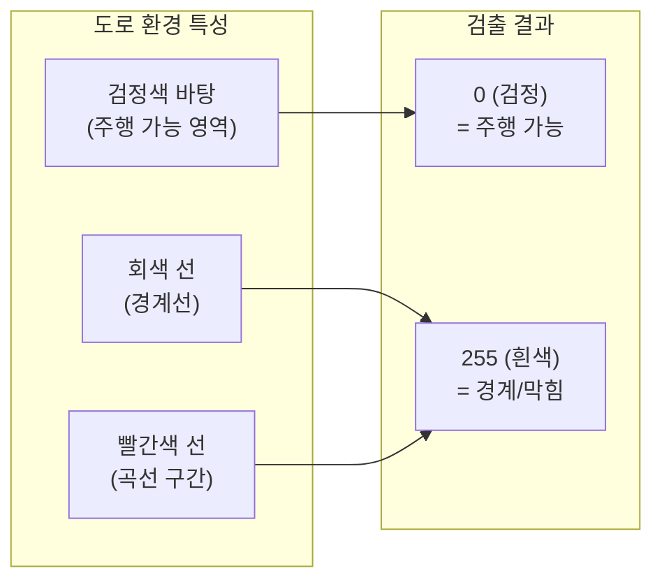

### 환경 특성 요약

| 요소 | 색상 | 의미 | 이진화 결과 |
|------|------|------|-------------|
| **도로 바닥** | 검정색 | 주행 가능 영역 | 0 (검정) |
| **직선 경계** | 회색/흰색 | 도로 경계선 | 255 (흰색) |
| **곡선 구간** | 빨간색 | 회전 필요 구간 | 255 (흰색) |

### 핵심 판단 기준

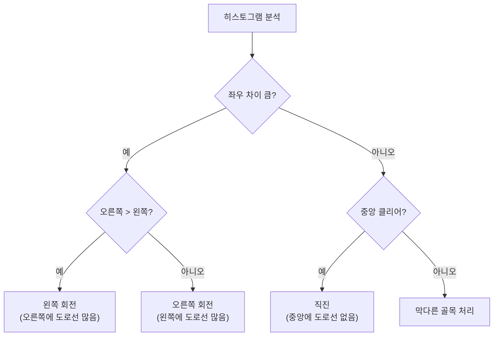

**핵심 원리:**
- **합이 작을수록 = 검정 도로가 많음 = 주행 가능**
- **합이 클수록 = 도로선(회색/빨강)이 많음 = 경계/막힘**
- **좌우 판단이 최우선!** (곡선 구간 대응)

---

## 📊 파일 비교 분석

### 파일별 특징 비교

| 항목 | `0_autoplot___test.py` | `1_autoplot___rgb_filter.py` |
|------|------------------------|------------------------------|
| **버전** | 기본 버전 | RGB 필터링 버전 |
| **그레이스케일 변환** | `cv2.cvtColor()` (표준) | `weighted_gray()` (가중치) |
| **RGB 가중치** | ❌ 미지원 | ✅ R/G/B 개별 조정 가능 |
| **빛 반사 필터링** | ❌ 미지원 | ✅ 지원 |
| **트랙바 개수** | 13개 | 16개 (RGB 3개 추가) |
| **윈도우 높이** | 800px | 900px |
| **권장 환경** | 조명 일정한 환경 | 빛 반사가 있는 환경 |

### 그레이스케일 변환 비교

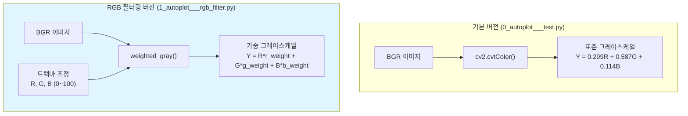

---

## 🏗️ 시스템 아키텍처

### 전체 시스템 구조

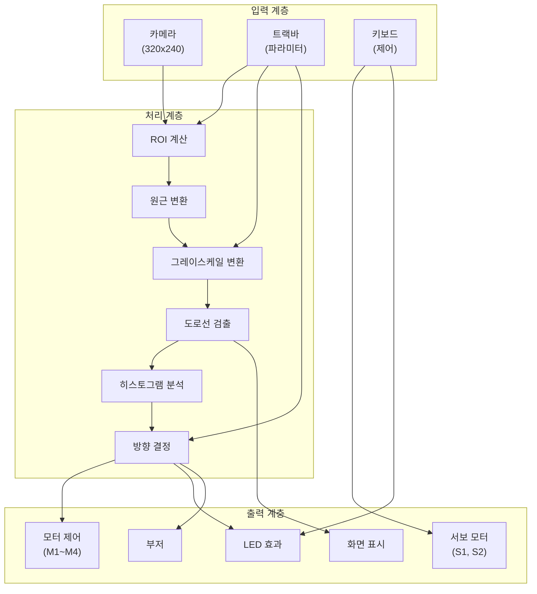

### 하드웨어 연결 구조

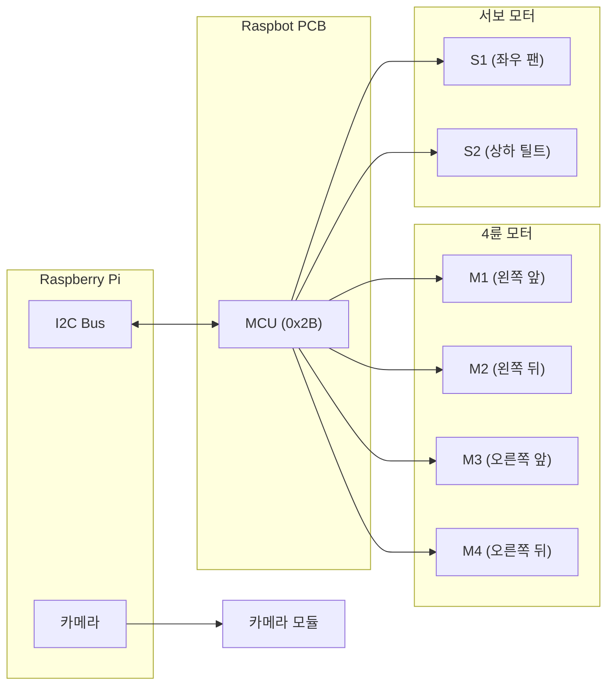

---

## 📈 실행 단계별 흐름

### 프로그램 실행 순서

```mermaid
sequenceDiagram
    participant Main as 메인
    participant Init as 초기화
    participant Loop as 메인 루프
    participant Proc as 이미지 처리
    participant Ctrl as 차량 제어

    Main->>Init: 1. 라이브러리 Import
    Init->>Init: 2. Raspbot 초기화
    Init->>Init: 3. 카메라 초기화
    Init->>Init: 4. 트랙바 설정
    Init->>Init: 5. 서보/LED/부저 초기화
    
    loop 메인 루프
        Main->>Loop: 프레임 캡처
        Loop->>Proc: ROI 계산
        Proc->>Proc: 원근 변환
        Proc->>Proc: 그레이스케일 변환
        Proc->>Proc: 도로선 검출
        Proc->>Proc: 히스토그램 분석
        Proc->>Loop: 방향 결정
        Loop->>Ctrl: 차량 제어
        Ctrl->>Ctrl: 모터 속도 설정
        Ctrl->>Ctrl: LED 효과
        Loop->>Main: 키보드 입력 확인
    end
    
    Main->>Init: 종료 및 정리
```

### 단계별 상세 설명

| 단계 | 함수/로직 | 설명 |
|------|----------|------|
| **1단계** | `import` | 라이브러리 로딩 (cv2, numpy, Raspbot_Lib) |
| **2단계** | `initialize_raspbot()` | I2C 통신 초기화 |
| **3단계** | `initialize_camera()` | 카메라 해상도/속성 설정 |
| **4단계** | `cv2.createTrackbar()` | 파라미터 조정용 트랙바 생성 |
| **5단계** | `setup_initial_hardware_state()` | 서보 위치, LED, 부저 초기화 |
| **6단계** | `process_frame()` | ROI → 원근 변환 → 그레이스케일 → 이진화 |
| **7단계** | `decide_direction()` | 히스토그램 분석 → 방향 결정 |
| **8단계** | `control_car()` | 모터 속도 제어 |
| **9단계** | `handle_keyboard_input()` | ESC/SPACE/l/b 키 처리 |
| **10단계** | `cleanup_and_exit()` | 리소스 해제 |

---

## 🧮 핵심 알고리즘 상세

### 이미지 처리 파이프라인

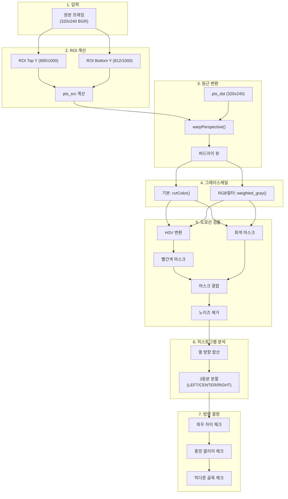

### 알고리즘 단계별 코드 매핑

| 단계 | 함수명 | 입력 | 출력 | 코드 라인 |
|------|--------|------|------|-----------|
| ROI 계산 | `calculate_roi_points()` | 해상도, roi_top_y, roi_bottom_y | pts_src, top_y, bottom_y | 288~308 |
| 원근 변환 | `apply_perspective_transform()` | frame, pts_src | frame_transformed | 311~316 |
| 그레이스케일 | `weighted_gray()` | image, r/g/b_weight | gray_frame | 349~390 |
| 도로선 검출 | `detect_road_lines()` | color_frame, gray_frame, detect_value | mask_lines | 319~372 |
| 히스토그램 분석 | `analyze_histogram()` | histogram | left/center/right_sum/ratio | 662~705 |
| 방향 결정 | `decide_direction()` | histogram, thresholds | direction | 710~831 |

---

## 🎯 ROI 및 원근 변환

### ROI (Region of Interest) 개념

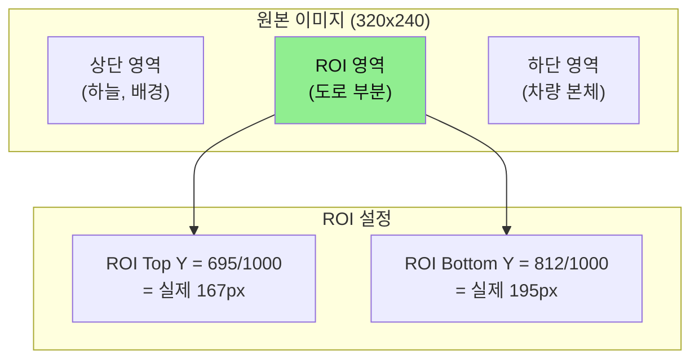

### ROI 영역 계산 상세

```python
def calculate_roi_points(actual_w, actual_h, roi_top_y, roi_bottom_y):
    """
    ROI 포인트 계산
    
    ROI Top Y = 695 → 실제 Y = 695 * 240 / 1000 = 166.8px
    ROI Bottom Y = 812 → 실제 Y = 812 * 240 / 1000 = 194.9px
    
    사다리꼴 영역 정의:
        좌하(margin, bottom_y) → 우하(w-margin, bottom_y)
        → 우상(w-margin, top_y) → 좌상(margin, top_y)
    """
    top_y = int(roi_top_y * actual_h / 1000)    # 비율 → 픽셀 변환
    bottom_y = int(roi_bottom_y * actual_h / 1000)
    
    margin = 10  # 좌우 여백
    
    pts_src = np.float32([
        [margin, bottom_y],           # 좌하
        [actual_w - margin, bottom_y], # 우하
        [actual_w - margin, top_y],    # 우상
        [margin, top_y],              # 좌상
    ])
    
    return pts_src, top_y, bottom_y
```

### 원근 변환 (Bird's Eye View)

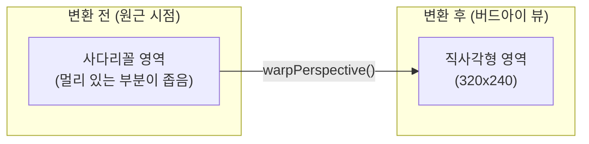

### ROI 설정의 중요성

| ROI 설정 | 효과 | 권장 상황 |
|----------|------|----------|
| **Top Y ↑ (작은 값)** | 더 멀리 바라봄 | 고속 주행, 미리 회전 준비 |
| **Top Y ↓ (큰 값)** | 가까이 바라봄 | 저속 주행, 정밀 제어 |
| **Bottom Y ↑ (작은 값)** | 차량 본체 제외 | 차량 앞부분이 보일 때 |
| **Bottom Y ↓ (큰 값)** | 가까운 도로 포함 | 급회전 구간 |

**권장 설정:**
- **안정적 주행**: ROI Top Y = 695, ROI Bottom Y = 812
- **미리 보기 (회전 대비)**: ROI Top Y = 600~650

---

## 🔍 도로선 검출 알고리즘

### 검출 원리

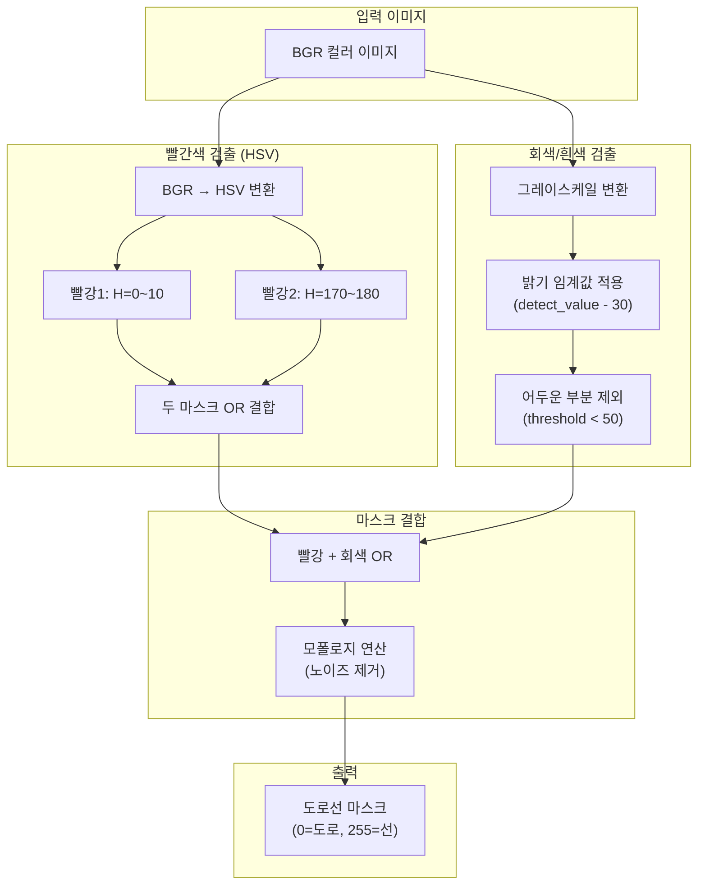

### 빨간색 HSV 범위

| 범위 | Hue (색조) | Saturation (채도) | Value (명도) | 설명 |
|------|-----------|-------------------|--------------|------|
| **빨강 1** | 0~10 | 70~255 | 50~255 | 빨간색 (주황색 방향) |
| **빨강 2** | 170~180 | 70~255 | 50~255 | 빨간색 (보라색 방향) |

### 코드 상세

```python
def detect_road_lines(color_frame, gray_frame, detect_value):
    """
    도로선 감지 (빨간색 + 엷은 회색)
    
    결과 해석:
    - 255 (흰색) = 도로선 (빨강/회색) = 경계/막힘
    - 0 (검정) = 검정색 도로 = 주행 가능
    
    히스토그램 합이 작을수록 → 검정 도로 많음 → 주행 가능!
    """
    # 1. HSV 변환 (빨간색 감지)
    hsv_frame = cv2.cvtColor(color_frame, cv2.COLOR_BGR2HSV)
    
    # 빨간색 범위 1: 0~10도
    lower_red1 = np.array([0, 70, 50])
    upper_red1 = np.array([10, 255, 255])
    mask_red1 = cv2.inRange(hsv_frame, lower_red1, upper_red1)
    
    # 빨간색 범위 2: 170~180도
    lower_red2 = np.array([170, 70, 50])
    upper_red2 = np.array([180, 255, 255])
    mask_red2 = cv2.inRange(hsv_frame, lower_red2, upper_red2)
    
    # 두 빨간색 마스크 결합
    mask_red = cv2.bitwise_or(mask_red1, mask_red2)
    
    # 2. 회색/흰색 감지 (밝기 기준)
    threshold_gray = max(detect_value - 30, 80)
    _, mask_gray = cv2.threshold(gray_frame, threshold_gray, 255, cv2.THRESH_BINARY)
    
    # 검정 도로 보호 (50 이하는 확실히 도로)
    dark_threshold = 50
    _, mask_dark = cv2.threshold(gray_frame, dark_threshold, 255, cv2.THRESH_BINARY)
    mask_gray = cv2.bitwise_and(mask_gray, mask_dark)
    
    # 3. 마스크 결합
    mask_lines = cv2.bitwise_or(mask_red, mask_gray)
    
    # 4. 노이즈 제거
    kernel = np.ones((3, 3), np.uint8)
    mask_lines = cv2.morphologyEx(mask_lines, cv2.MORPH_CLOSE, kernel)
    mask_lines = cv2.morphologyEx(mask_lines, cv2.MORPH_OPEN, kernel)
    
    return mask_lines
```

---

## 🧭 방향 결정 알고리즘

### 히스토그램 3등분 분석

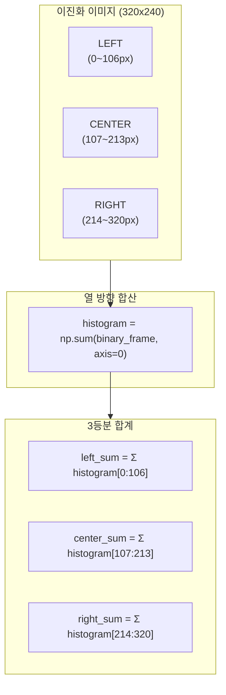

### 방향 결정 우선순위

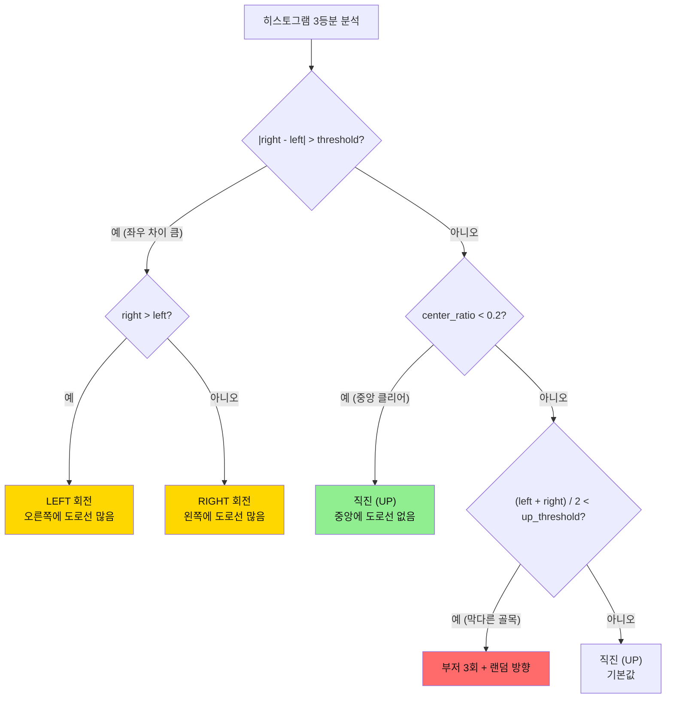

### 방향 결정 임계값 설명

| 임계값 | 기본값 | 범위 | 역할 |
|--------|--------|------|------|
| **direction_threshold** | 35,000 | 0~500,000 | 좌우 차이 판단 기준 |
| **up_threshold** | 220,000 | 0~500,000 | 막다른 골목 감지 기준 |
| **CENTER_CLEAR_THRESHOLD** | 0.2 (20%) | 0.0~1.0 | 중앙 클리어 판단 |

### 코드 상세

```python
def decide_direction(histogram, direction_threshold, up_threshold, ...):
    """
    히스토그램 기반 방향 결정 (3등분 분석)
    
    우선순위:
    1. |right - left| > threshold → LEFT/RIGHT (최우선! ⭐)
    2. center_ratio < 0.2 → 직진 (중앙 클리어)
    3. 좌우 평균 < up_threshold → 막다른 골목
    4. 기본 → 직진
    
    핵심 원리:
    - 합이 작을수록 = 검정 도로 많음 = 주행 가능
    - right_sum > left_sum → 오른쪽에 도로선 → 왼쪽 회전
    - left_sum > right_sum → 왼쪽에 도로선 → 오른쪽 회전
    """
    # 1. 3등분 분석
    left_sum, center_sum, right_sum, left_ratio, center_ratio, right_ratio = \
        analyze_histogram(histogram)
    
    # 2. 좌우 차이 체크 (최우선!)
    if abs(right_sum - left_sum) > direction_threshold:
        if right_sum > left_sum:
            return "LEFT", left_sum, center_sum, right_sum  # 왼쪽이 주행 가능
        else:
            return "RIGHT", left_sum, center_sum, right_sum  # 오른쪽이 주행 가능
    
    # 3. 중앙 클리어 체크
    if center_ratio < CENTER_CLEAR_THRESHOLD:  # 0.2 미만
        return "UP", left_sum, center_sum, right_sum  # 중앙 도로 있음 → 직진
    
    # 4. 막다른 골목 감지
    left_right_avg = (left_sum + right_sum) // 2
    if left_right_avg < up_threshold:
        # 부저 3회 알림
        for _ in range(3):
            bot.Ctrl_BEEP_Switch(1)
            time.sleep(0.15)
            bot.Ctrl_BEEP_Switch(0)
            time.sleep(0.1)
        
        # 랜덤 방향 선택
        return random.choice(["LEFT", "RIGHT"]), left_sum, center_sum, right_sum
    
    # 5. 기본: 직진
    return "UP", left_sum, center_sum, right_sum
```

---

## 🎨 RGB 가중치 필터링

### RGB 필터링 원리

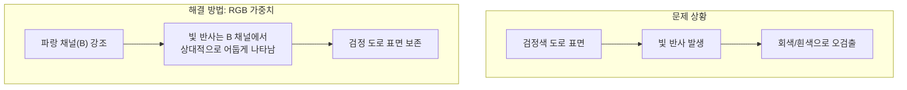

### RGB 가중치 공식

```
표준 그레이스케일:
Y = 0.299 × R + 0.587 × G + 0.114 × B

가중 그레이스케일 (빛 반사 필터링):
Y = (R × r_weight) + (G × g_weight) + (B × b_weight)

권장 설정:
- 밝은 환경: R=30, G=40, B=60 (파랑 강조)
- 어두운 환경: R=60, G=40, B=30 (빨강 강조)
- 빛 반사 심함: R=20, G=30, B=70~80 (파랑 최대)
```

### 코드 상세

```python
def weighted_gray(image, r_weight, g_weight, b_weight):
    """
    RGB 가중치 기반 그레이스케일 변환
    
    원리:
    - 파랑 채널(B)은 빛 반사에 덜 민감
    - 빨강 채널(R)은 빛 반사에 민감
    - B 가중치↑ → 빛 반사 영역이 상대적으로 어둡게 처리
    
    OpenCV BGR 순서: [:,:,0]=B, [:,:,1]=G, [:,:,2]=R
    """
    r_weight /= 100.0  # 0~100 → 0~1 정규화
    g_weight /= 100.0
    b_weight /= 100.0
    
    # BGR → 가중 합산
    weighted = cv2.addWeighted(
        cv2.addWeighted(
            image[:, :, 2],  # R 채널
            r_weight,
            image[:, :, 1],  # G 채널
            g_weight,
            0
        ),
        1.0,
        image[:, :, 0],  # B 채널
        b_weight,
        0
    )
    
    return weighted
```

### RGB 가중치 설정 가이드

| 환경 | R 가중치 | G 가중치 | B 가중치 | 효과 |
|------|---------|---------|---------|------|
| **표준** | 30 | 40 | 60 | 균형있는 처리 |
| **밝은 실내** | 20 | 40 | 70 | 빛 반사 억제 |
| **어두운 환경** | 60 | 40 | 30 | 명암 강조 |
| **직사광선** | 10 | 30 | 80 | 최대 빛 반사 억제 |
| **형광등 조명** | 40 | 50 | 50 | 색온도 보정 |

---

## 🚗 차량 제어 로직

### 모터 제어 방식

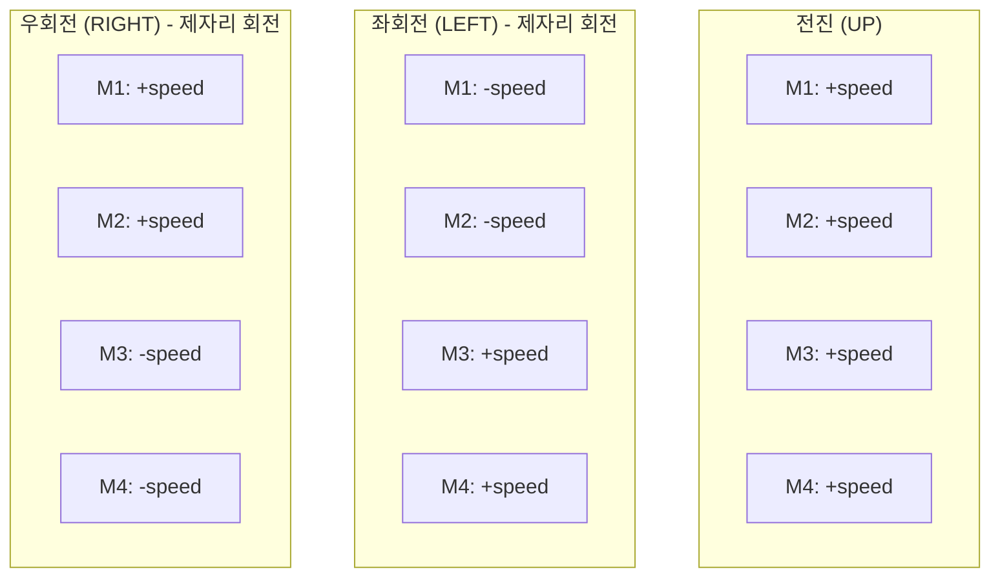

### 제어 함수 상세

```python
def car_run(speed_left, speed_right):
    """전진: 4개 모터 모두 전진"""
    set_motor_speeds(speed_left, speed_left, speed_right, speed_right)


def car_left(speed_left, speed_right):
    """좌회전: 왼쪽 모터 후진, 오른쪽 모터 전진 (제자리 회전)"""
    set_motor_speeds(-speed_left, -speed_left, speed_right, speed_right)


def car_right(speed_left, speed_right):
    """우회전: 왼쪽 모터 전진, 오른쪽 모터 후진 (제자리 회전)"""
    set_motor_speeds(speed_left, speed_left, -speed_right, -speed_right)


def control_car(direction, up_speed, down_speed):
    """
    방향에 따른 차량 제어
    
    LED 효과:
    - 직진: 초록색 (1)
    - 회전: 노란색 (3)
    """
    if direction == "UP":
        car_run(up_speed, up_speed)
        set_led_effect(1)  # 초록색
    elif direction == "LEFT":
        car_left(down_speed, up_speed)
        set_led_effect(3)  # 노란색
    elif direction == "RIGHT":
        car_right(up_speed, down_speed)
        set_led_effect(3)  # 노란색
```

### 속도 파라미터

| 파라미터 | 기본값 | 범위 | 용도 |
|----------|--------|------|------|
| **Motor_Up_Speed** | 15 | 0~255 | 직진/회전 시 주 속도 |
| **Motor_Down_Speed** | 8 | 0~255 | 회전 시 감속 측 속도 |

---

## ⚙️ 파라미터 튜닝 가이드

### 전체 파라미터 목록

| 파라미터 | 기본값 | 범위 | 영향 | 조정 방법 |
|----------|--------|------|------|----------|
| **Servo_1_Angle** | 95 | 0~180 | 카메라 좌우 | 도로 중앙 맞춤 |
| **Servo_2_Angle** | 0 | 0~110 | 카메라 상하 | ROI 영역 조정 |
| **ROI_Top_Y** | 695 | 0~1000 | 미리 보기 범위 | 낮출수록 먼 곳 봄 |
| **ROI_Bottom_Y** | 812 | 0~1000 | 근접 범위 | 높일수록 가까운 곳 봄 |
| **Direction_Threshold** | 35,000 | 0~500,000 | 회전 민감도 | 높이면 덜 회전 |
| **Up_Threshold** | 220,000 | 0~500,000 | 막다른 골목 감지 | 높이면 덜 감지 |
| **Brightness** | 32 | 0~100 | 카메라 밝기 | 환경에 맞게 |
| **Contrast** | 0 | 0~100 | 카메라 대비 | 도로선 선명도 |
| **Detect_Value** | 120 | 0~150 | 이진화 임계값 | 도로선 검출 민감도 |
| **Motor_Up_Speed** | 15 | 0~255 | 주행 속도 | 직진 속도 |
| **Motor_Down_Speed** | 8 | 0~255 | 회전 감속 | 회전 속도 |
| **R_weight** | 30 | 0~100 | 빨강 가중치 | 빛 반사 필터링 |
| **G_weight** | 40 | 0~100 | 초록 가중치 | 빛 반사 필터링 |
| **B_weight** | 60 | 0~100 | 파랑 가중치 | 빛 반사 필터링 |

### 상황별 권장 설정

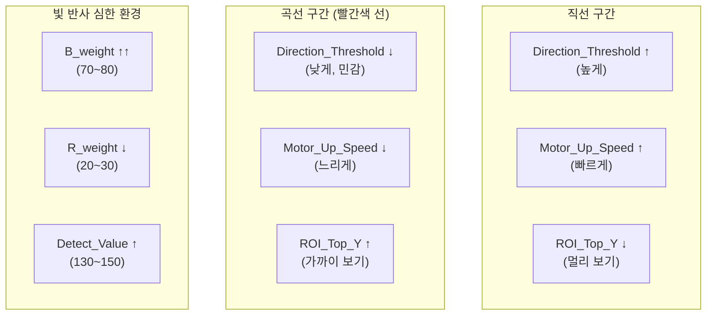

---

## 🔧 개선 사항 및 최적화

### 현재 버전 한계점

| 한계점 | 설명 | 영향 |
|--------|------|------|
| **막다른 골목 처리** | 랜덤 방향 선택 | 비효율적 탈출 |
| **곡선 미리 예측** | 현재 프레임만 분석 | 급회전 시 불안정 |
| **속도 고정** | 상황별 속도 조절 없음 | 곡선에서 과속 |
| **빛 변화 대응** | 수동 RGB 조정 | 자동 적응 미지원 |

### 개선 방안

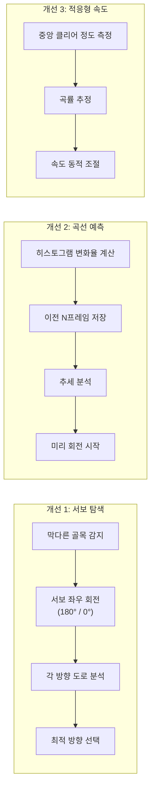

### 개선 코드 예시: 서보 탐색

```python
def rotate_servo_and_check_direction(detect_value, r_weight, g_weight, b_weight):
    """
    서보 모터 회전으로 대체 경로 확인 (개선 버전)
    
    처리 단계:
    1. 서보를 왼쪽(180°)으로 회전 → 히스토그램 분석
    2. 서보를 오른쪽(0°)으로 회전 → 히스토그램 분석
    3. 더 낮은 합(더 많은 검정 도로)을 가진 방향 선택
    4. 서보 원위치(90°)
    """
    results = {}
    
    # 왼쪽 방향 확인
    bot.Ctrl_Servo(1, 180)
    time.sleep(0.5)
    ret, frame = cap.read()
    processed = process_frame(frame, detect_value, ...)
    histogram = np.sum(processed, axis=0)
    results['LEFT'] = np.sum(histogram[2*len(histogram)//5:3*len(histogram)//5])
    
    # 오른쪽 방향 확인
    bot.Ctrl_Servo(1, 0)
    time.sleep(0.5)
    ret, frame = cap.read()
    processed = process_frame(frame, detect_value, ...)
    histogram = np.sum(processed, axis=0)
    results['RIGHT'] = np.sum(histogram[2*len(histogram)//5:3*len(histogram)//5])
    
    # 원위치
    bot.Ctrl_Servo(1, 90)
    time.sleep(0.3)
    
    # 더 낮은 합 = 더 많은 도로 = 최적 방향
    if results['LEFT'] < results['RIGHT']:
        return "LEFT"
    else:
        return "RIGHT"
```

### 성능 최적화 팁

| 최적화 | 방법 | 효과 |
|--------|------|------|
| **해상도 조정** | 320x240 유지 | FPS 유지 |
| **프레임 스킵** | `time.sleep(0.05)` | CPU 부하 감소 |
| **ROI 최소화** | 필요한 영역만 처리 | 연산량 감소 |
| **트랙바 갱신** | 10프레임마다 | I/O 감소 |

---

## 📚 요약

### 핵심 알고리즘 요약

1. **ROI 설정**: 도로 영역만 관심 영역으로 설정
2. **원근 변환**: 버드아이 뷰로 변환하여 분석 용이
3. **도로선 검출**: HSV(빨강) + 밝기(회색) 이중 마스크
4. **히스토그램 분석**: 3등분하여 좌/중앙/우 도로선 양 측정
5. **방향 결정**: 좌우 차이 > 중앙 클리어 > 막다른 골목 순 판단
6. **RGB 필터링**: 빛 반사 환경에서 파랑 채널 강조

### 파일 선택 가이드

| 환경 | 권장 파일 |
|------|----------|
| 조명 일정, 빛 반사 없음 | `0_autoplot___test.py` |
| 빛 반사 있음, 조명 변화 | `1_autoplot___rgb_filter.py` |

### 키보드 조작

| 키 | 동작 |
|----|------|
| **ESC** | 프로그램 종료 |
| **SPACE** | 모터 ON/OFF 토글 |
| **l** | LED ON/OFF 토글 |
| **b** | 부저 ON/OFF 토글 |

---

**작성일**: 2025-12-08  
**버전**: v1.0  
**파일 위치**: `03_self_driving/AUTOPLOT_알고리즘_가이드.md`

