# 🚗 Raspbot v2 자율주행 시스템 가이드 (v3.0)

## 📋 목차

1. [개요](#-개요)
2. [시스템 아키텍처](#-시스템-아키텍처)
3. [실행 단계별 흐름](#-실행-단계별-흐름)
4. [핵심 알고리즘 상세](#-핵심-알고리즘-상세)
5. [이미지 처리 파이프라인](#-이미지-처리-파이프라인)
6. [방향 결정 알고리즘](#-방향-결정-알고리즘)
7. [RGB 가중치 필터링](#-rgb-가중치-필터링)
8. [파라미터 튜닝 가이드](#-파라미터-튜닝-가이드)
9. [함수 레퍼런스](#-함수-레퍼런스)
10. [트러블슈팅](#-트러블슈팅)

---

## 📌 개요

### 버전 정보

| 항목 | 내용 |
|------|------|
| **버전** | v3.0 (RGB 필터링 + 3등분 분석 + 모듈화) |
| **파일** | `autoplot.py` |
| **기반** | `1_autoplot___rgb_filter.py` 통합 |
| **작성일** | 2025-12-08 |

### 주요 특징

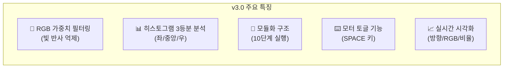

### 도로 환경 특성

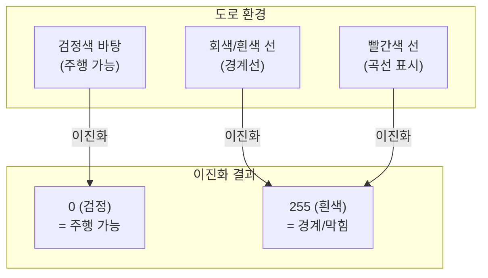

| 요소 | 색상 | 의미 | 이진화 결과 | 히스토그램 합 |
|------|------|------|-------------|--------------|
| **도로 바닥** | 검정색 | 주행 가능 영역 | 0 (검정) | 낮음 (좋음) |
| **직선 경계** | 회색/흰색 | 도로 경계선 | 255 (흰색) | 높음 (막힘) |
| **곡선 구간** | 빨간색 | 회전 필요 구간 | 255 (흰색) | 높음 (막힘) |

---

## 🏗️ 시스템 아키텍처

### 전체 시스템 구조

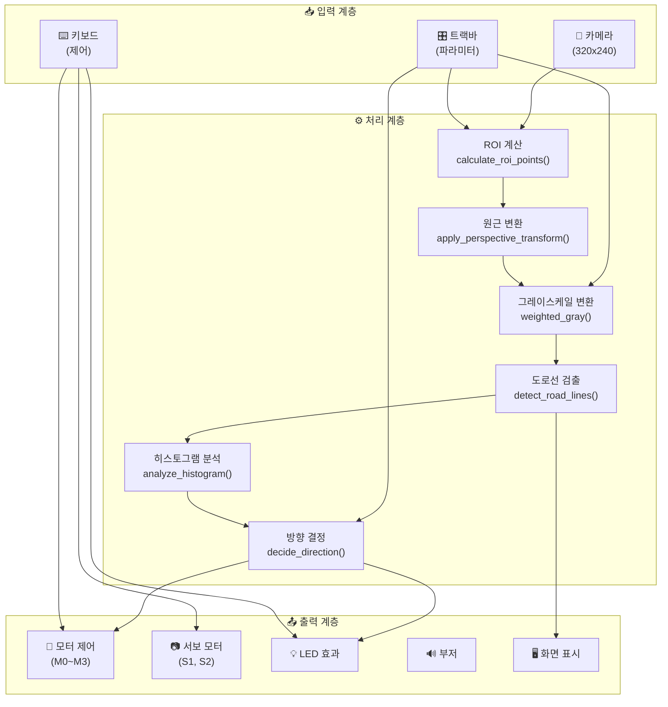

### 하드웨어 연결 구조

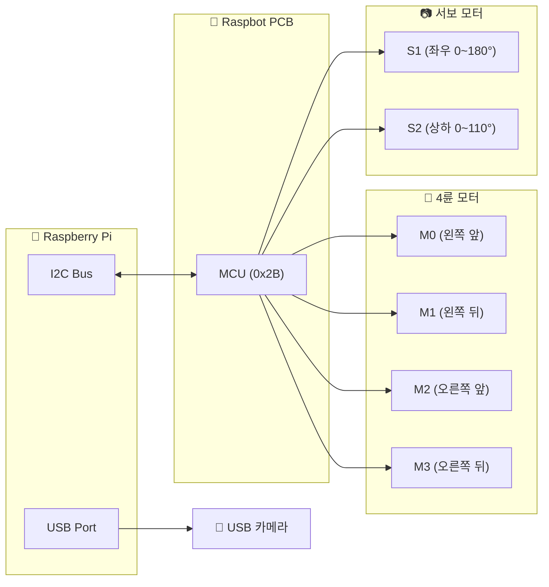

---

## 📈 실행 단계별 흐름

### 10단계 실행 순서

```mermaid
sequenceDiagram
    participant Main as 🚀 메인
    participant Init as ⚙️ 초기화
    participant Loop as 🔄 메인 루프
    participant Proc as 🖼️ 이미지 처리
    participant Ctrl as 🚗 차량 제어

    Main->>Init: STEP 1: 라이브러리 Import
    Init->>Init: STEP 2: 설정값 로딩
    Init->>Init: STEP 3: 하드웨어 초기화
    Init->>Init: STEP 4: 트랙바 설정
    Init->>Init: STEP 5~8: 함수 정의
    
    rect rgb(200, 230, 200)
        note over Loop: STEP 9: 메인 루프
        loop 프레임 반복
            Loop->>Proc: 프레임 캡처
            Proc->>Proc: ROI 계산
            Proc->>Proc: 원근 변환
            Proc->>Proc: 그레이스케일 (RGB 가중치)
            Proc->>Proc: 도로선 검출
            Proc->>Proc: 히스토그램 분석
            Proc->>Loop: 방향 결정
            Loop->>Ctrl: 차량 제어
            Loop->>Loop: 키보드 입력 확인
        end
    end
    
    Main->>Init: STEP 10: 정리 및 종료
```

### 단계별 상세 설명

| 단계 | 함수/로직 | 설명 |
|------|----------|------|
| **STEP 1** | `import` | cv2, numpy, Raspbot_Lib 로딩 |
| **STEP 2** | 설정값 | 속도, RGB 가중치, 임계값 등 설정 |
| **STEP 3** | `initialize_raspbot()`, `initialize_camera()` | 하드웨어 초기화 |
| **STEP 4** | `cv2.createTrackbar()` | 16개 트랙바 생성 |
| **STEP 5** | 이미지 처리 함수 | ROI, 원근 변환, 도로선 검출 |
| **STEP 6** | 차량 제어 함수 | car_run, car_left, car_right |
| **STEP 7** | 서보 제어 함수 | rotate_servo |
| **STEP 8** | 방향 결정 함수 | analyze_histogram, decide_direction |
| **STEP 9** | 메인 루프 | 프레임 처리 및 제어 반복 |
| **STEP 10** | `cleanup_and_exit()` | 리소스 해제 |

---

## 🧮 핵심 알고리즘 상세

### 알고리즘 전체 흐름

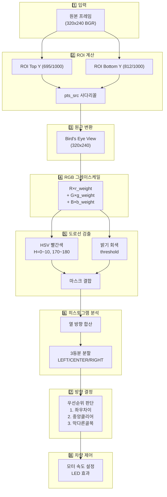

---

## 🖼️ 이미지 처리 파이프라인

### ROI (Region of Interest) 계산

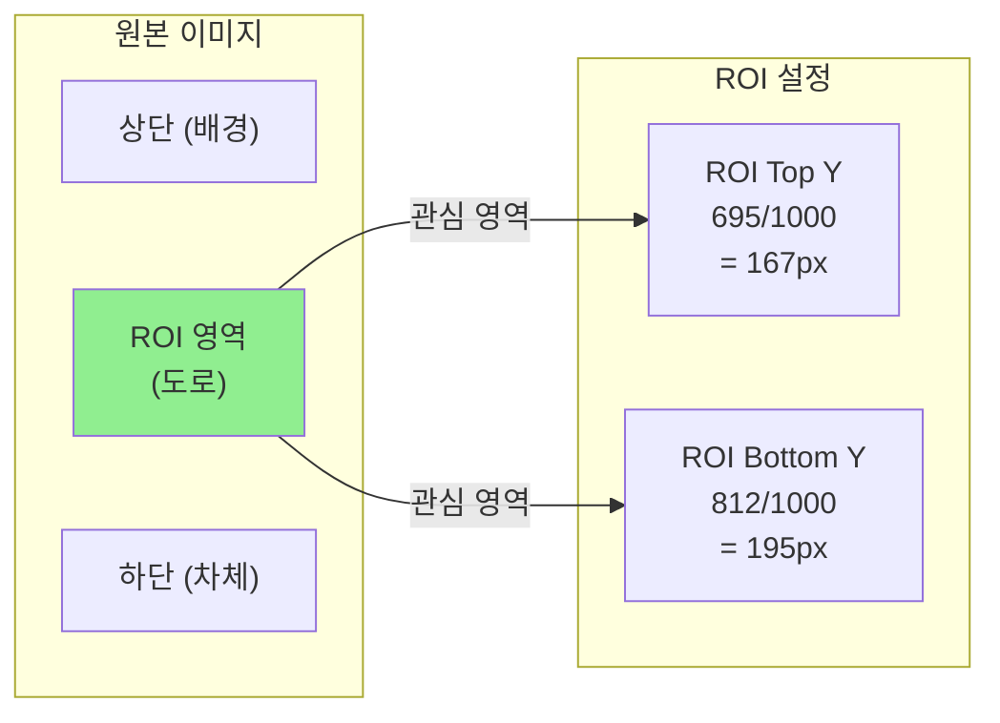

### ROI 좌표 계산 공식

```python
def calculate_roi_points(actual_w, actual_h, roi_top_y, roi_bottom_y):
    """
    ROI 포인트 계산
    
    트랙바 값(0~1000) → 실제 픽셀 좌표로 변환
    
    예시 (해상도 320x240):
    - roi_top_y = 695 → top_y = 695 × 240 / 1000 = 166.8px
    - roi_bottom_y = 812 → bottom_y = 812 × 240 / 1000 = 194.9px
    """
    top_y = int(roi_top_y * actual_h / 1000)
    bottom_y = int(roi_bottom_y * actual_h / 1000)
    
    # 범위 제한 및 최소 높이 보장
    top_y = max(0, min(top_y, actual_h - 1))
    bottom_y = max(0, min(bottom_y, actual_h - 1))
    if top_y >= bottom_y:
        top_y = max(0, bottom_y - 50)
    
    margin = 10  # 좌우 여백
    
    # 사다리꼴: [좌하, 우하, 우상, 좌상]
    pts_src = np.float32([
        [margin, bottom_y],
        [actual_w - margin, bottom_y],
        [actual_w - margin, top_y],
        [margin, top_y],
    ])
    
    return pts_src, top_y, bottom_y
```

### 원근 변환 (Perspective Transform)

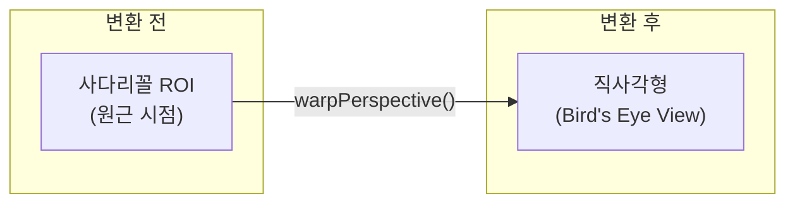

### 도로선 검출 알고리즘

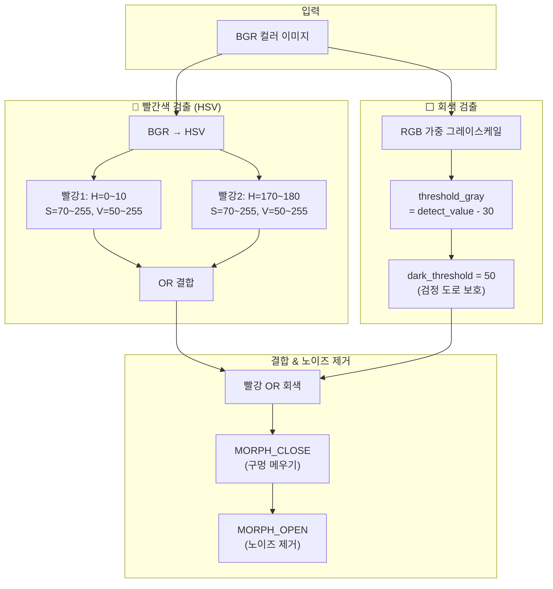

### 빨간색 HSV 범위 상세

| 범위 | Hue (색조) | Saturation | Value | 설명 |
|------|-----------|------------|-------|------|
| **빨강 1** | 0~10 | 70~255 | 50~255 | 주황색 방향 빨강 |
| **빨강 2** | 170~180 | 70~255 | 50~255 | 보라색 방향 빨강 |

---

## 🧭 방향 결정 알고리즘

### 히스토그램 3등분 분석

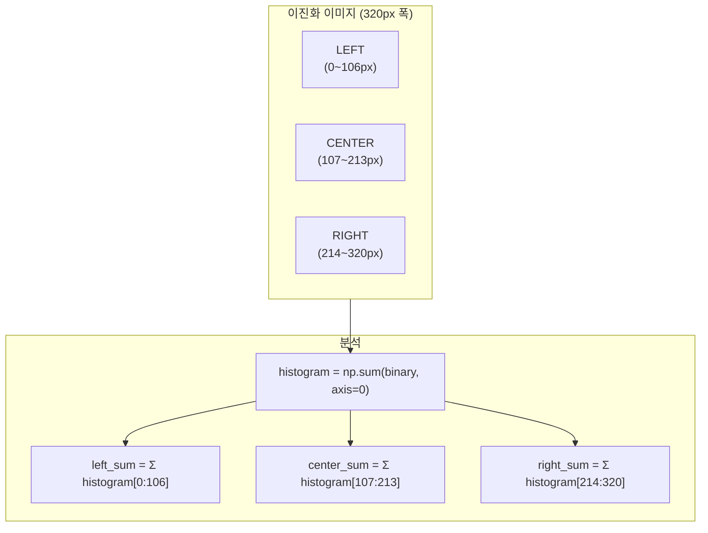

### 방향 결정 우선순위 (핵심 로직)

```mermaid
flowchart TD
    A["📊 히스토그램 3등분 분석"] --> B{"|right - left| > threshold?<br/>(좌우 차이 큼?)"}
    
    B -->|"예 ⭐최우선"| C{right > left?}
    C -->|"예"| D["◀️ LEFT 회전<br/>(오른쪽에 도로선 많음)"]
    C -->|"아니오"| E["▶️ RIGHT 회전<br/>(왼쪽에 도로선 많음)"]
    
    B -->|"아니오"| F{center_ratio < 0.2?<br/>(중앙 클리어?)}
    F -->|"예"| G["⬆️ 직진<br/>(중앙에 도로선 없음)"]
    
    F -->|"아니오"| H{"(left + right) / 2 < up_threshold?<br/>(막다른 골목?)"}
    H -->|"예"| I["🎲 랜덤 방향<br/>(부저 3회 알림)"]
    H -->|"아니오"| J["⬆️ 직진<br/>(기본값)"]

    style D fill:#FFD700
    style E fill:#FFD700
    style G fill:#90EE90
    style I fill:#FF6B6B
    style J fill:#90EE90
```

### 방향 결정 핵심 원리

```
┌─────────────────────────────────────────────────────────────┐
│  핵심 원리: 히스토그램 합과 주행 가능성의 반비례 관계       │
├─────────────────────────────────────────────────────────────┤
│                                                             │
│  • 합이 작음 = 검정 도로 많음 = 주행 가능 영역              │
│  • 합이 큼   = 도로선 많음   = 경계/막힘                    │
│                                                             │
│  로직:                                                      │
│  • right_sum > left_sum → 오른쪽에 도로선 → LEFT 회전      │
│  • left_sum > right_sum → 왼쪽에 도로선  → RIGHT 회전      │
│                                                             │
└─────────────────────────────────────────────────────────────┘
```

### 임계값 설명

| 임계값 | 기본값 | 범위 | 역할 |
|--------|--------|------|------|
| **direction_threshold** | 35,000 | 0~500,000 | 좌우 차이 판단 (높으면 덜 회전) |
| **up_threshold** | 220,000 | 0~500,000 | 막다른 골목 감지 |
| **CENTER_CLEAR_THRESHOLD** | 0.2 (20%) | 0.0~1.0 | 중앙 클리어 판단 |

---

## 🎨 RGB 가중치 필터링

### 빛 반사 문제와 해결

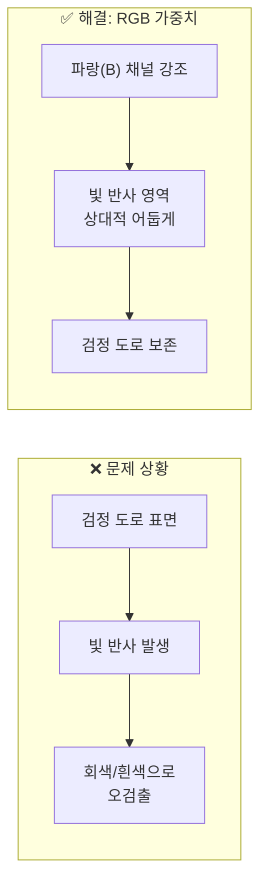

### RGB 가중치 공식

```python
def weighted_gray(image, r_weight, g_weight, b_weight):
    """
    RGB 가중치 기반 그레이스케일 변환
    
    표준 그레이스케일:
    Y = 0.299 × R + 0.587 × G + 0.114 × B
    
    가중 그레이스케일 (v3.0):
    Y = R × r_weight + G × g_weight + B × b_weight
    
    원리:
    - 파랑(B)은 빛 반사에 덜 민감
    - 빨강(R)은 빛 반사에 민감
    - B 가중치↑ → 빛 반사 억제
    """
    r_weight /= 100.0  # 0~100 → 0~1
    g_weight /= 100.0
    b_weight /= 100.0
    
    # OpenCV BGR 순서
    # [:,:,0] = B, [:,:,1] = G, [:,:,2] = R
    weighted = cv2.addWeighted(
        cv2.addWeighted(image[:,:,2], r_weight,
                       image[:,:,1], g_weight, 0),
        1.0,
        image[:,:,0], b_weight, 0
    )
    return weighted
```

### 환경별 권장 RGB 설정

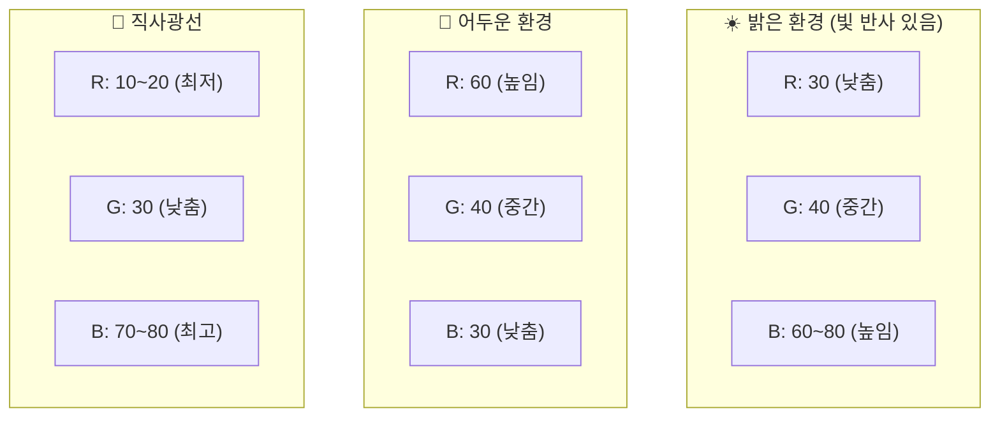

| 환경 | R | G | B | 효과 |
|------|---|---|---|------|
| **표준** | 30 | 40 | 60 | 균형있는 처리 |
| **밝은 실내** | 20 | 40 | 70 | 빛 반사 억제 |
| **어두운 환경** | 60 | 40 | 30 | 명암 강조 |
| **직사광선** | 10 | 30 | 80 | 최대 빛 반사 억제 |

---

## ⚙️ 파라미터 튜닝 가이드

### 전체 트랙바 목록

| 카테고리 | 파라미터 | 기본값 | 범위 | 설명 |
|----------|----------|--------|------|------|
| **서보** | Servo_1_Angle | 95 | 0~180 | 카메라 좌우 |
| | Servo_2_Angle | 0 | 0~110 | 카메라 상하 |
| **ROI** | ROI_Top_Y | 695 | 0~1000 | ROI 상단 (작을수록 멀리) |
| | ROI_Bottom_Y | 812 | 0~1000 | ROI 하단 (클수록 가까이) |
| **임계값** | Direction_Threshold | 35,000 | 0~500,000 | 회전 민감도 |
| | Up_Threshold | 220,000 | 0~500,000 | 막다른 골목 감지 |
| **카메라** | Brightness | 32 | 0~100 | 밝기 |
| | Contrast | 0 | 0~100 | 대비 |
| | Detect_Value | 120 | 0~150 | 이진화 임계값 |
| **속도** | Motor_Up_Speed | 15 | 0~255 | 주 속도 |
| | Motor_Down_Speed | 8 | 0~255 | 감속 측 속도 |
| **RGB** | R_weight | 30 | 0~100 | 빨강 가중치 |
| | G_weight | 40 | 0~100 | 초록 가중치 |
| | B_weight | 60 | 0~100 | 파랑 가중치 |

### 상황별 권장 설정

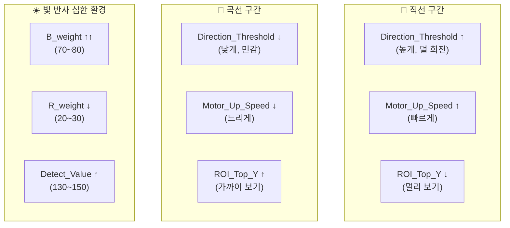

---

## 📚 함수 레퍼런스

### 이미지 처리 함수

| 함수명 | 입력 | 출력 | 설명 |
|--------|------|------|------|
| `calculate_roi_points()` | actual_w, actual_h, roi_top_y, roi_bottom_y | pts_src, top_y, bottom_y | ROI 좌표 계산 |
| `apply_roi_visualization()` | frame, pts_src, ... | frame_with_rect | ROI 시각화 |
| `apply_perspective_transform()` | frame, pts_src | frame_transformed | 원근 변환 |
| `weighted_gray()` | image, r/g/b_weight | gray_frame | RGB 그레이스케일 |
| `detect_road_lines()` | color_frame, gray_frame, detect_value | mask_lines | 도로선 검출 |
| `process_frame()` | frame, params... | binary_frame | 전체 처리 파이프라인 |

### 방향 결정 함수

| 함수명 | 입력 | 출력 | 설명 |
|--------|------|------|------|
| `analyze_histogram()` | histogram | left/center/right_sum, ratios | 3등분 분석 |
| `decide_direction()` | histogram, thresholds... | direction, sums | 방향 결정 |
| `visualize_direction_on_frame()` | binary_frame, direction, sums, rgb_weights | frame_color | 시각화 |

### 차량 제어 함수

| 함수명 | 입력 | 동작 |
|--------|------|------|
| `car_run(speed_l, speed_r)` | 좌/우 속도 | 직진 (4륜 전진) |
| `car_left(speed_l, speed_r)` | 좌/우 속도 | 좌회전 (제자리) |
| `car_right(speed_l, speed_r)` | 좌/우 속도 | 우회전 (제자리) |
| `car_stop()` | - | 정지 |
| `control_car(direction, up_speed, down_speed)` | 방향, 속도 | 방향별 제어 |

### 보조 함수

| 함수명 | 설명 |
|--------|------|
| `handle_keyboard_input()` | 키보드 입력 처리 (ESC/SPACE/l/b) |
| `read_trackbar_values()` | 트랙바 값 일괄 읽기 |
| `apply_camera_settings()` | 카메라 속성 설정 |
| `cleanup_and_exit()` | 정리 및 종료 |

---

## 🔧 트러블슈팅

### 일반적인 문제 해결

| 문제 | 원인 | 해결 방법 |
|------|------|----------|
| **빛 반사로 오검출** | R 가중치 높음 | B_weight ↑ (60~80), R_weight ↓ (20~30) |
| **회전 너무 민감** | threshold 낮음 | Direction_Threshold ↑ |
| **회전 안 함** | threshold 높음 | Direction_Threshold ↓ |
| **막다른 골목 미감지** | up_threshold 높음 | Up_Threshold ↓ |
| **직진 불안정** | 중앙 클리어 판단 실패 | CENTER_CLEAR_THRESHOLD 조정 |
| **ROI 영역 부적절** | 해상도 미스매치 | ROI_Top_Y, ROI_Bottom_Y 조정 |

### 키보드 조작

| 키 | 동작 |
|----|------|
| **ESC** | 프로그램 종료 |
| **SPACE** | 모터 ON/OFF 토글 (카메라 계속 작동) |
| **l** | LED ON/OFF 토글 |
| **b** | 부저 ON/OFF 토글 |

### 디버그 정보 해석

```
--- Frame 100 ---
RGB Weights: R=30, G=40, B=60

   📊 히스토그램 분석 (도로선 검출 모드):
      LEFT:   12345 (ratio: 0.150) - 낮을수록 주행 가능
      CENTER: 23456 (ratio: 0.280) - 낮을수록 주행 가능
      RIGHT:  56789 (ratio: 0.680) - 낮을수록 주행 가능
      L-R 차이:  44444 | 임계값: 35000
   🔄 결정: LEFT 회전 (도로선 적은 쪽으로)
```

**해석:**
- LEFT (12,345) < RIGHT (56,789) → 왼쪽이 더 주행 가능
- L-R 차이 (44,444) > 임계값 (35,000) → 회전 필요
- 결론: LEFT 회전

---

## 📊 성능 최적화

### 최적화 팁

| 최적화 | 방법 | 효과 |
|--------|------|------|
| **해상도** | 320x240 유지 | FPS 유지 |
| **프레임 스킵** | `time.sleep(0.05)` | CPU 부하 감소 |
| **ROI 최소화** | 필요 영역만 처리 | 연산량 감소 |
| **디버그 출력** | 10프레임마다 | I/O 감소 |

---

**작성일**: 2025-12-08  
**버전**: v3.0  
**파일 위치**: `03_self_driving/AUTOPLOT_v3_가이드.md`

