# 두 라인 인식 기반 중앙 유지 자율주행 가이드

## 📋 목차

1. [개요](#개요)
2. [동작 단계](#동작-단계)
3. [동작 순서](#동작-순서)
4. [주요 기능](#주요-기능)
5. [선명도 개선 방법](#선명도-개선-방법)
6. [사용 이유와 장점](#사용-이유와-장점)
7. [YOLO 방식과의 비교](#yolo-방식과의-비교)
8. [안정적 운전 방법](#안정적-운전-방법)
9. [파라미터 튜닝 가이드](#파라미터-튜닝-가이드)

---

## 개요

이 시스템은 **두 개의 도로선(좌우)을 인식하여 차량을 가운데 위치로 유지**하며 자율주행하는 시스템입니다. C++ 기반 검증된 알고리즘을 Python으로 구현하여 Raspberry Pi 환경에서 실시간으로 동작합니다.

### 카메라 해상도

**기본 해상도: 640x480**
- 원본 프레임: 640x480
- 원근 변환 후: 640x480 (정확도 우선) 또는 320x240 (속도 우선)
- 모든 파라미터는 640x480 기준으로 자동 조정됨

### 핵심 개념

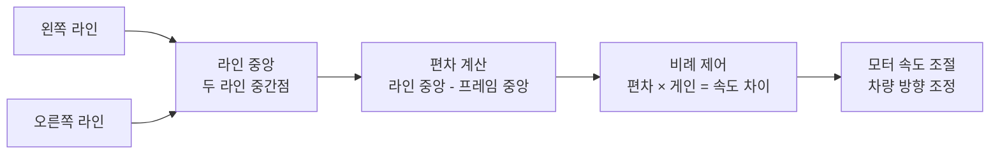

**핵심 원리**:
- **라인 중앙 계산**: 좌우 라인의 중간점을 계산
- **편차 계산**: 프레임 중앙과 라인 중앙의 차이를 계산
- **비례 제어**: 편차에 비례하여 좌우 모터 속도를 조절

---

## 동작 단계

### 전체 시스템 구조

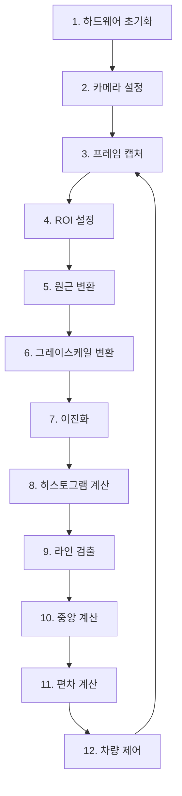

### 상세 단계 설명

#### 1단계: 하드웨어 초기화
- Raspbot 하드웨어 초기화
- USB 카메라 연결 및 설정
- 서보 모터 초기 위치 설정
- LED 및 부저 테스트

#### 2단계: 카메라 설정
- 해상도: **640x480** (기본)
- 밝기/대비/채도 설정
- 카메라 속성 최적화
- 실제 해상도 자동 감지 및 조정

#### 3단계: 프레임 캡처
- 실시간 프레임 읽기
- 프레임 유효성 검사

#### 4단계: ROI 설정 (관심 영역 선택)

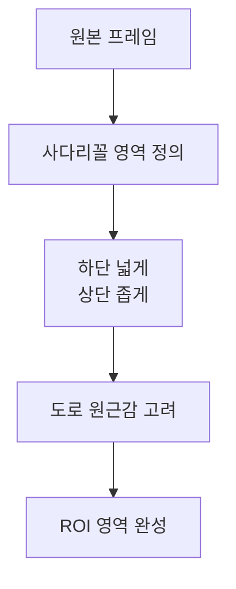

**설정 내용**:
- 사다리꼴 ROI 영역 정의
- 하단이 넓고 상단이 좁은 형태
- 도로의 원근감을 고려한 영역 선택

#### 5단계: 원근 변환 (위에서 본 모습으로 변환)

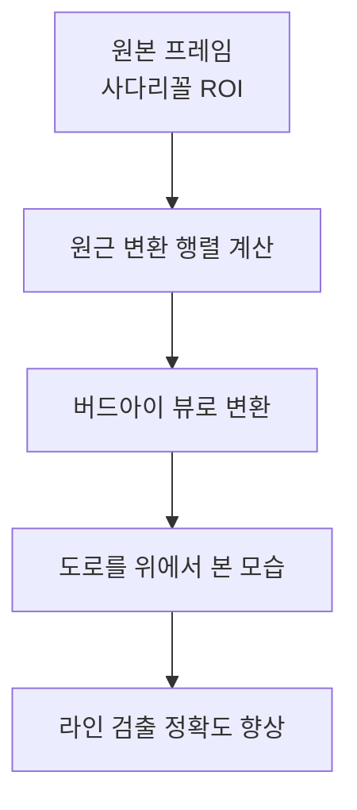

**변환 내용**:
- 버드아이 뷰로 변환
- 도로를 위에서 내려다본 형태로 변환
- 라인 검출 정확도 향상

#### 6단계: 그레이스케일 변환 (색상 제거)

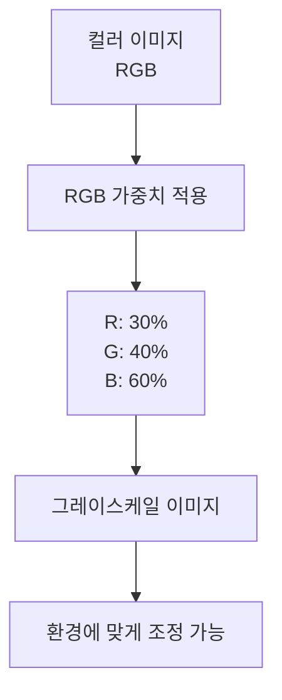

**변환 내용**:
- RGB 가중치 적용
- 환경에 맞는 가중치 조정 가능

#### 7단계: 이진화 (흑백 변환)

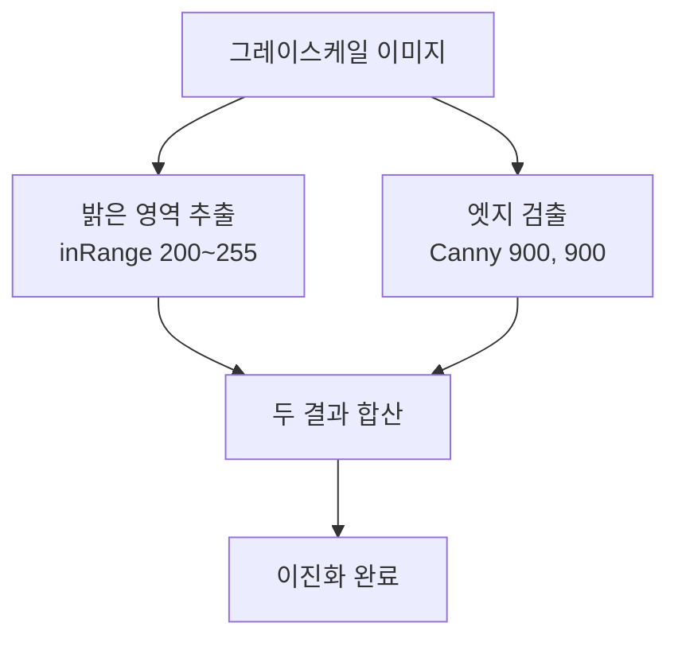

**처리 과정**:
- **inRange**: 밝은 영역 추출 (200~255)
- **Canny**: 엣지 검출 (임계값 900, 900)
- 두 결과 합산하여 라인 강조

#### 8단계: 히스토그램 계산 (라인 위치 찾기)

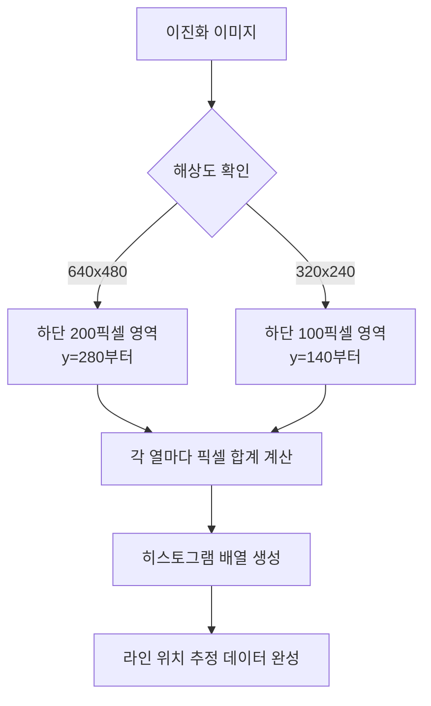

**처리 과정**:
- **640x480 기준**: 하단 200픽셀 영역(y=280부터) 사용
- **320x240 기준**: 하단 100픽셀 영역(y=140부터) 사용
- 각 열마다 픽셀 합계 계산
- 라인 위치 추정을 위한 데이터 생성
- 해상도에 따라 자동 조정

#### 9단계: 라인 검출 (좌우 라인 찾기)

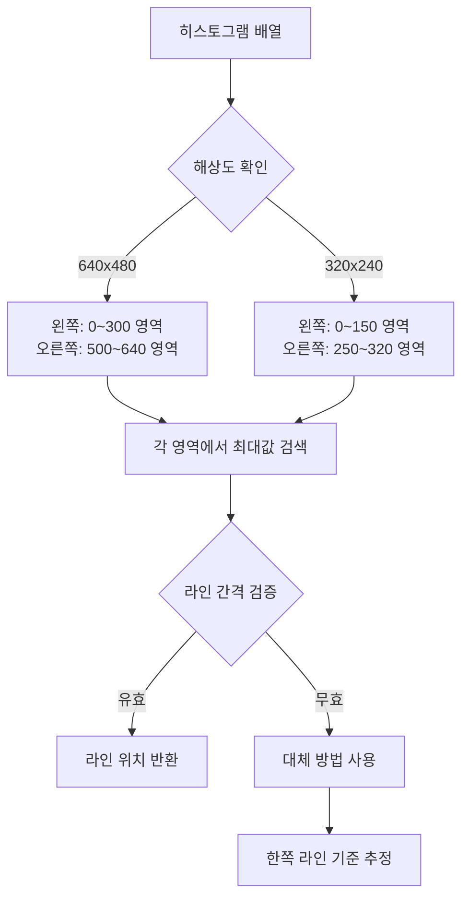

**처리 과정**:
- **640x480 기준**:
  - 왼쪽 라인: 0~300 영역에서 최대값 검색
  - 오른쪽 라인: 500~640 영역에서 최대값 검색
- **320x240 기준**:
  - 왼쪽 라인: 0~150 영역에서 최대값 검색
  - 오른쪽 라인: 250~320 영역에서 최대값 검색
- 최소/최대 라인 간격 검증 (해상도에 따라 자동 조정)

#### 10단계: 중앙 계산 (라인 가운데 찾기)

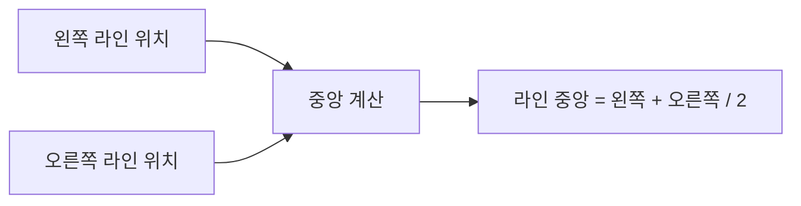

**계산식**:
```python
lane_center = (right_lane_pos - left_lane_pos) / 2 + left_lane_pos
```

#### 11단계: 편차 계산 (차량 위치 확인)

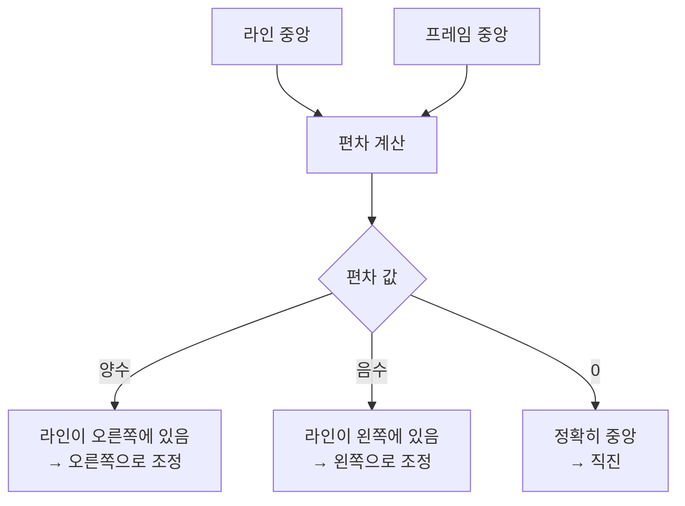

**계산식**:
```python
bias = lane_center - frame_center
```

**의미**:
- 양수: 라인 중앙이 오른쪽 → 오른쪽으로 조정 필요
- 음수: 라인 중앙이 왼쪽 → 왼쪽으로 조정 필요
- 0: 정확히 중앙에 위치

#### 12단계: 차량 제어 (모터 속도 조절)

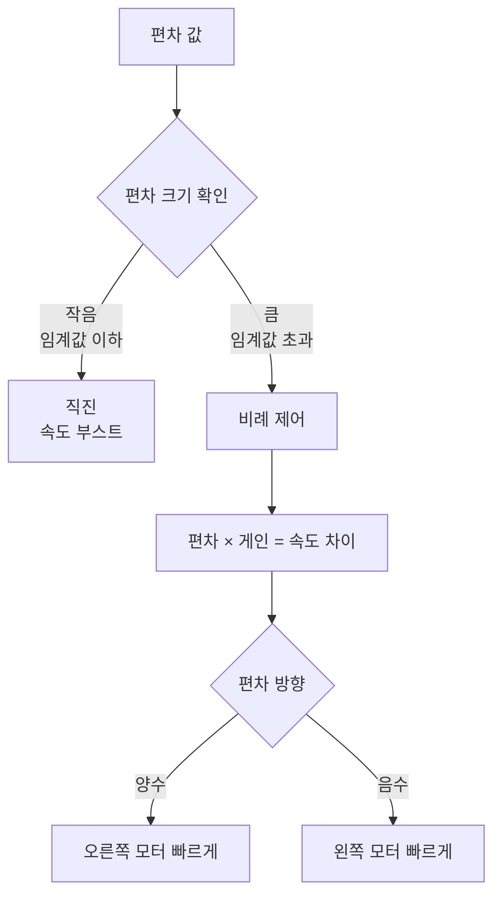

**제어 방식**:
- 편차가 임계값 이하면 직진 (속도 부스트)
- 편차가 크면 비례 제어로 좌우 모터 속도 조절

---

## 동작 순서

### 메인 루프 흐름

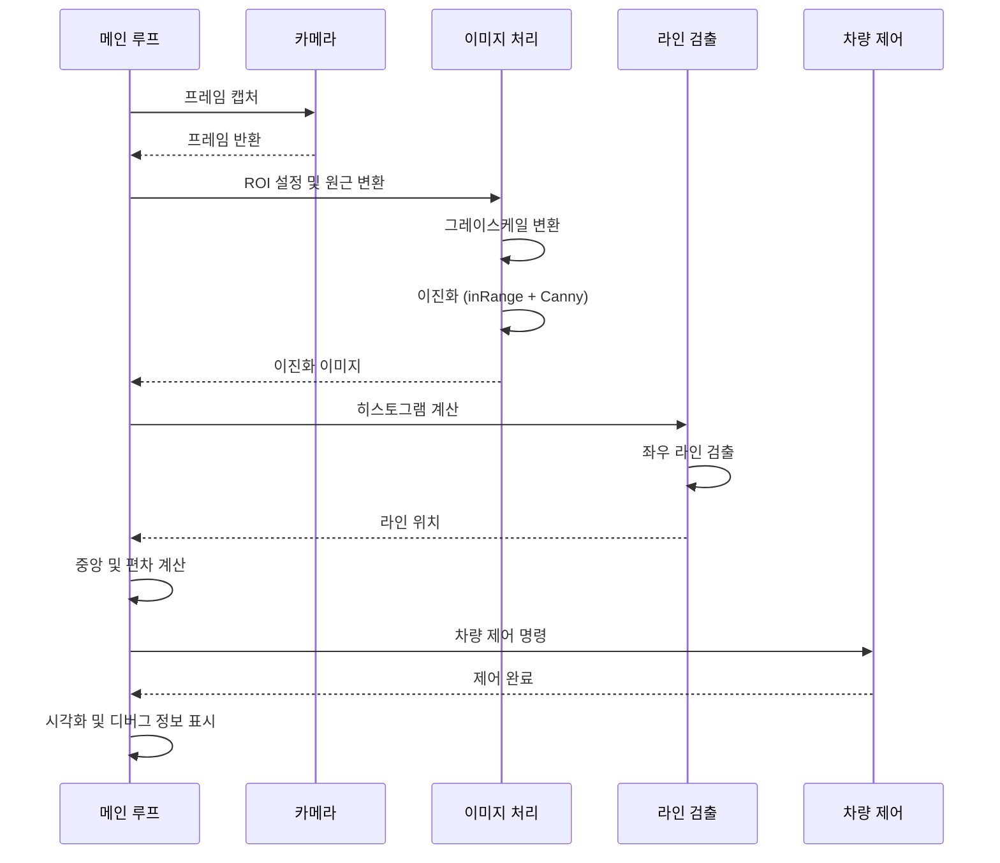

### 실시간 처리 흐름

```mermaid
gantt
    title 프레임 처리 시간 분배 (640x480 기준)
    dateFormat X
    axisFormat %Lms
    
    section 프레임 읽기
    카메라에서 읽기 :0, 30
    
    section 이미지 처리
    ROI 설정 :30, 5
    원근 변환 :35, 10
    그레이스케일 변환 :45, 5
    이진화 :50, 10
    
    section 라인 검출
    히스토그램 계산 :60, 5
    최대값 검색 :65, 5
    
    section 제어 계산
    중앙 계산 :70, 1
    편차 계산 :71, 1
    속도 결정 :72, 1
    
    section 차량 제어
    모터 제어 :73, 1
    
    section 시각화
    화면 표시 :74, 6
```

**단계별 처리 시간**:

| 단계 | 640x480 | 320x240 | 설명 |
|------|---------|---------|------|
| 프레임 읽기 | 30ms | 30ms | 카메라에서 이미지 가져오기 |
| 이미지 처리 | 30-40ms | 10-20ms | ROI, 원근변환, 이진화 |
| 라인 검출 | 10-15ms | 5-10ms | 히스토그램, 최대값 검색 |
| 제어 계산 | 3ms | 1ms | 중앙, 편차, 속도 계산 |
| 차량 제어 | 1ms | 1ms | 모터 속도 조절 |
| 시각화 | 6ms | 5ms | 화면에 표시 |
| **총 시간** | **80-120ms** | **50-70ms** | **전체 처리 시간** |
| **FPS** | **8-12** | **14-20** | **초당 프레임 수** |

**참고**: 해상도가 높을수록 처리 시간이 증가하지만 정확도가 향상됩니다.

---

## 주요 기능

### 전체 이미지 처리 파이프라인

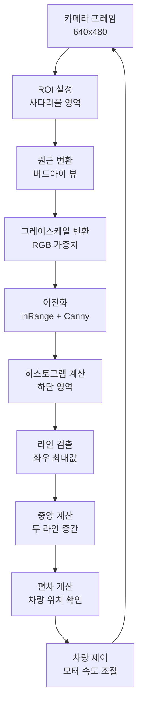

### 1. 두 라인 인식 (좌우 라인 찾기)

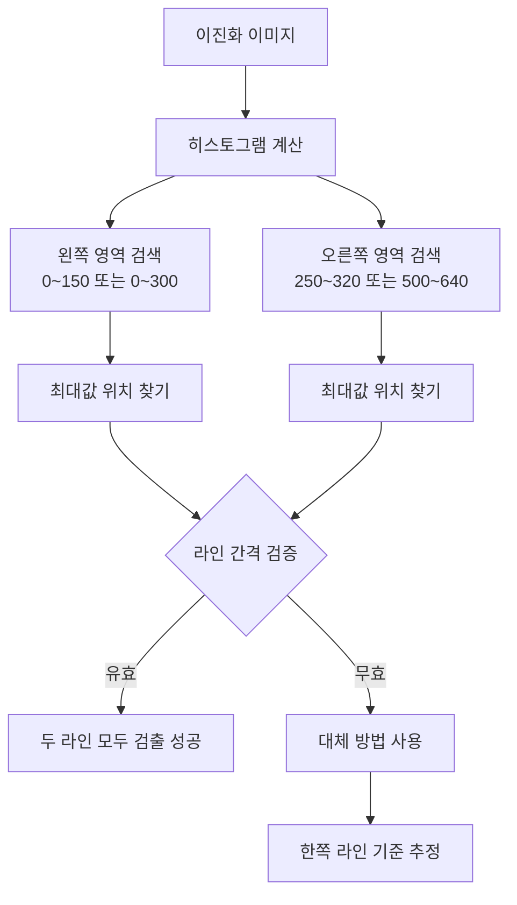

**특징**:
- 좌우 라인을 독립적으로 검출
- 라인 간격 검증으로 오탐 방지
- 한쪽 라인만 검출된 경우 대체 방법 사용

### 2. 중앙 위치 계산 (라인 가운데 찾기)

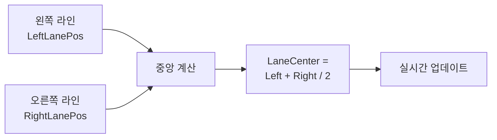

**특징**:
- 두 라인의 정확한 중간점 계산
- 실시간으로 업데이트
- 라인 위치 변화에 즉각 반응

### 3. 편차 기반 제어 (차량 방향 조절)

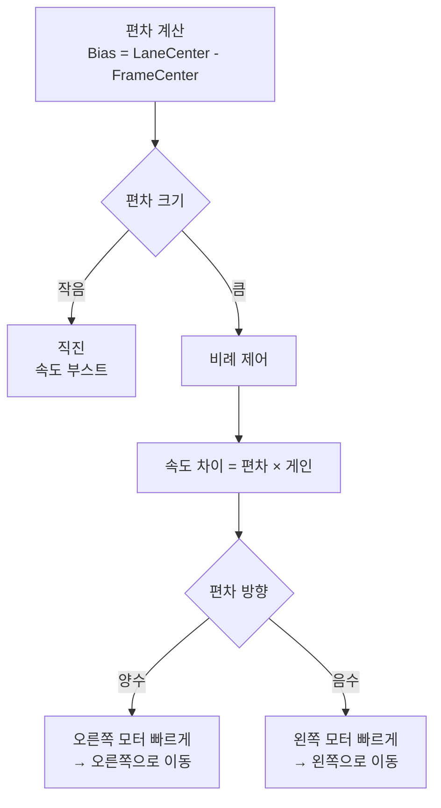

**특징**:
- 부드러운 제어
- 과도한 조정 방지
- 안정적인 주행

### 4. 실시간 파라미터 조정

트랙바를 통해 실시간으로 조정 가능:
- ROI 영역
- 밝기/대비
- RGB 가중치
- 제어 파라미터

### 5. 시각화

5개 윈도우로 처리 과정 표시:
- `1_Original`: 원본 + ROI
- `2_Perspective`: 원근 변환
- `3_Gray`: 그레이스케일
- `4_Binary`: 이진화
- `5_Final`: 최종 결과 (라인, 중앙선, 편차)

---

## 선명도 개선 방법

### 현재 사용 중인 방법

#### 기본 이진화 알고리즘

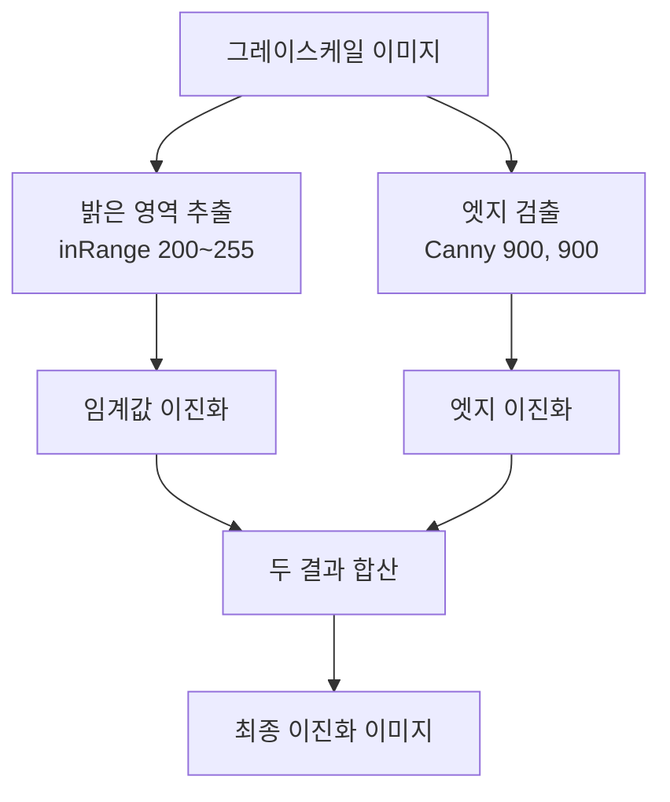

**처리 과정**:
1. 밝은 영역 추출 (inRange): 200~255 밝기만 선택
2. 엣지 검출 (Canny): 경계선 찾기
3. 두 결과 합산: 라인을 더 선명하게

### 추가 개선 방법

#### 1. 적응형 임계값 (조명 변화에 강한 이진화)

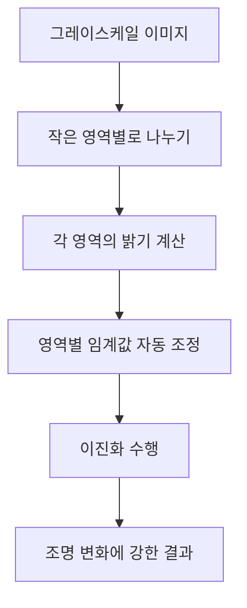

**처리 과정**:
- 이미지를 작은 영역으로 나눔
- 각 영역의 밝기를 계산
- 영역별로 임계값을 자동 조정
- 조명이 달라도 잘 동작

**장점**:
- 조명 변화에 강함
- 지역적 밝기 차이에 적응
- 더 선명한 라인 검출

#### 2. 모폴로지 연산 강화 (라인 다듬기)

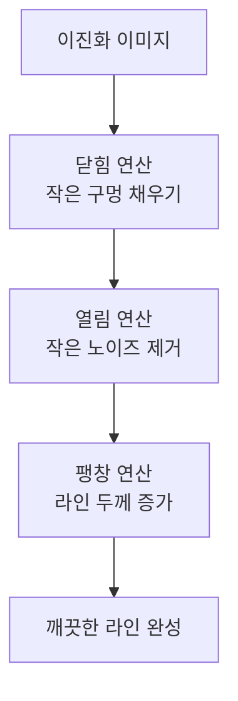

**처리 과정**:
1. **닫힘 연산**: 라인의 작은 구멍을 채움
2. **열림 연산**: 작은 노이즈를 제거
3. **팽창 연산**: 라인 두께를 증가시켜 일정하게 만듦

**장점**:
- 라인 연결성 향상
- 노이즈 제거
- 라인 두께 일정화

#### 3. 언샤프 마스킹 (선명도 향상)

```mermaid
flowchart TD
    A[그레이스케일 이미지] --> B[가우시안 블러<br/>흐리게 만들기]
    A --> C[원본 이미지]
    B --> D[원본 - 흐린 이미지]
    C --> D
    D --> E[선명한 이미지]
```

**처리 과정**:
1. 원본 이미지를 흐리게 만듦 (블러)
2. 원본에서 흐린 이미지를 빼기
3. 결과를 원본에 더하기
4. 엣지가 더 선명해짐

**장점**:
- 엣지 선명도 향상
- 라인 경계 명확화

#### 4. 히스토그램 균등화 (대비 향상)

```mermaid
flowchart TD
    A[그레이스케일 이미지] --> B[작은 영역별로 나누기]
    B --> C[각 영역의 밝기 분포 분석]
    C --> D[밝기 분포 균등하게 조정]
    D --> E[대비가 향상된 이미지]
```

**처리 과정**:
1. 이미지를 작은 영역으로 나눔
2. 각 영역의 밝기 분포를 분석
3. 밝기 분포를 균등하게 조정
4. 어두운 부분도 잘 보이게 됨

**장점**:
- 대비 향상
- 어두운 영역에서도 라인 검출 가능

#### 5. 다중 스케일 검출 (여러 크기에서 검출)

```mermaid
flowchart TD
    A[이진화 이미지] --> B[원본 크기 검출]
    A --> C[2배 확대 검출]
    A --> D[0.5배 축소 검출]
    B --> E[결과 1]
    C --> F[결과 2<br/>좌표 축소]
    D --> G[결과 3<br/>좌표 확대]
    E --> H[결과 결합<br/>가중 평균]
    F --> H
    G --> H
    H --> I[최종 라인 위치]
```

**처리 과정**:
1. 원본 크기에서 라인 검출
2. 2배 확대한 이미지에서 검출 (작은 라인 찾기)
3. 0.5배 축소한 이미지에서 검출 (큰 라인 찾기)
4. 세 결과를 결합하여 평균 계산
5. 더 정확한 라인 위치 얻기

**장점**:
- 다양한 크기의 라인 검출
- 정확도 향상

#### 6. 통합 개선 함수 (모든 방법 결합)

```mermaid
flowchart TD
    A[원본 프레임] --> B[그레이스케일 변환]
    B --> C[히스토그램 균등화<br/>대비 향상]
    C --> D[언샤프 마스킹<br/>선명도 향상]
    D --> E[이진화<br/>inRange + Canny]
    E --> F[모폴로지 연산<br/>라인 다듬기]
    F --> G[라인 검출]
    G --> H[최종 결과]
```

**처리 순서**:
1. 그레이스케일 변환
2. 히스토그램 균등화 (대비 향상)
3. 언샤프 마스킹 (선명도 향상)
4. 이진화 (inRange + Canny)
5. 모폴로지 연산 (라인 다듬기)
6. 라인 검출

**장점**: 모든 개선 방법을 결합하여 최고 정확도 달성

### 성능 비교

```mermaid
graph LR
    A[선명도 개선 방법] --> B[기본 방법]
    A --> C[적응형 임계값]
    A --> D[모폴로지 강화]
    A --> E[언샤프 마스킹]
    A --> F[히스토그램 균등화]
    A --> G[통합 방법]
    
    B --> B1[처리 시간: 빠름 5ms<br/>정확도: 보통<br/>조명 대응: 보통]
    C --> C1[처리 시간: 보통 10ms<br/>정확도: 높음<br/>조명 대응: 높음]
    D --> D1[처리 시간: 빠름 7ms<br/>정확도: 높음<br/>조명 대응: 보통]
    E --> E1[처리 시간: 보통 8ms<br/>정확도: 높음<br/>조명 대응: 보통]
    F --> F1[처리 시간: 빠름 3ms<br/>정확도: 높음<br/>조명 대응: 높음]
    G --> G1[처리 시간: 느림 25ms<br/>정확도: 매우 높음<br/>조명 대응: 매우 높음]
```

**상세 비교표**:

| 방법 | 처리 시간 | 정확도 | 조명 변화 대응 | 추천 상황 |
|------|----------|--------|----------------|-----------|
| 기본 (inRange + Canny) | 빠름 (5ms) | 보통 | 보통 | 일반 환경 |
| 적응형 임계값 | 보통 (10ms) | 높음 | 높음 | 조명 변화 많음 |
| 모폴로지 강화 | 빠름 (7ms) | 높음 | 보통 | 노이즈 많음 |
| 언샤프 마스킹 | 보통 (8ms) | 높음 | 보통 | 선명도 중요 |
| 히스토그램 균등화 | 빠름 (3ms) | 높음 | 높음 | 어두운 환경 |
| 통합 방법 | 느림 (25ms) | 매우 높음 | 매우 높음 | 최고 정확도 필요 |

---

## 사용 이유와 장점

### 1. 실시간 처리 성능

```mermaid
graph LR
    A[처리 속도] --> B[빠름<br/>50-70ms]
    A --> C[지연시간<br/>낮음]
    A --> D[반응 속도<br/>실시간]
    
    B --> E[단순 알고리즘]
    C --> F[GPU 불필요]
    D --> G[CPU만으로 충분]
```

**장점**:
- 빠른 처리 속도 (50-70ms)
- 낮은 지연시간
- 실시간 반응 가능

**이유**:
- 단순한 이미지 처리 알고리즘
- GPU 불필요
- CPU만으로 충분

### 2. 하드웨어 요구사항 낮음

```mermaid
graph TD
    A[하드웨어 요구사항] --> B[Raspberry Pi<br/>충분]
    A --> C[추가 하드웨어<br/>불필요]
    A --> D[전력 소비<br/>낮음]
    
    B --> E[경량 알고리즘]
    C --> F[메모리 적음]
    D --> G[계산 단순]
```

**장점**:
- Raspberry Pi에서도 동작
- 추가 하드웨어 불필요
- 저전력 소비

**이유**:
- 경량 알고리즘
- 메모리 사용량 적음
- 계산 복잡도 낮음

### 3. 안정성

**장점**:
- 검증된 알고리즘 (C++ 기반)
- 다양한 환경에서 테스트됨
- 예측 가능한 동작

**이유**:
- 수학적으로 명확한 계산
- 파라미터 튜닝 용이
- 디버깅 쉬움

### 4. 비용 효율성

**장점**:
- 추가 비용 없음
- 오픈소스 라이브러리 사용
- 유지보수 비용 낮음

**이유**:
- OpenCV만으로 구현 가능
- 특수 하드웨어 불필요
- 라이선스 비용 없음

### 5. 실시간 튜닝 가능

**장점**:
- 트랙바로 실시간 조정
- 즉각적인 피드백
- 환경 변화에 빠른 대응

**이유**:
- 파라미터가 명확함
- 시각적 피드백 제공
- 실험적 접근 가능

### 6. 교육적 가치

**장점**:
- 알고리즘 이해 용이
- 단계별 처리 과정 명확
- 학습 자료로 활용 가능

**이유**:
- 전통적인 컴퓨터 비전 기법
- 수학적 원리 명확
- 코드 가독성 높음

---

## YOLO 방식과의 비교

### YOLO (You Only Look Once) 방식

#### 장점

1. **높은 정확도**
   - 딥러닝 기반 객체 검출
   - 다양한 각도와 조명 조건에서 강함
   - 복잡한 도로 환경에서도 동작

2. **다양한 객체 인식**
   - 도로선뿐만 아니라 차량, 보행자, 표지판 등도 인식 가능
   - 종합적인 주행 환경 이해

3. **일반화 능력**
   - 다양한 도로 환경에 적응
   - 학습 데이터에 따라 성능 향상 가능

#### 단점

1. **처리 속도**
   - GPU 필요 (Raspberry Pi에서 느림)
   - 처리 시간: 100-500ms
   - 실시간 처리 어려움

2. **하드웨어 요구사항**
   - GPU 또는 고성능 CPU 필요
   - 메모리 사용량 많음 (수백 MB ~ 수 GB)
   - 전력 소비 높음

3. **비용**
   - 모델 학습 비용
   - 하드웨어 비용
   - 유지보수 복잡

4. **튜닝 어려움**
   - 모델 재학습 필요
   - 파라미터 조정 복잡
   - 실시간 튜닝 불가능

### 현재 방식 (히스토그램 기반)

#### 장점

1. **빠른 처리 속도**
   - CPU만으로 실시간 처리
   - 처리 시간: 50-70ms
   - 낮은 지연시간

2. **낮은 하드웨어 요구사항**
   - Raspberry Pi에서도 충분
   - 메모리 사용량 적음 (수십 MB)
   - 저전력 소비

3. **실시간 튜닝**
   - 트랙바로 즉시 조정
   - 환경 변화에 빠른 대응
   - 실험적 접근 가능

4. **비용 효율성**
   - 추가 비용 없음
   - 유지보수 쉬움

#### 단점

1. **제한적인 환경**
   - 명확한 도로선 필요
   - 조명 변화에 민감
   - 복잡한 환경에서 어려움

2. **단일 목적**
   - 도로선 검출만 가능
   - 다른 객체 인식 불가

### 비교표

```mermaid
graph TD
    A[비교 항목] --> B[처리 속도]
    A --> C[정확도]
    A --> D[하드웨어]
    A --> E[메모리]
    A --> F[전력 소비]
    A --> G[비용]
    A --> H[튜닝]
    A --> I[일반화]
    A --> J[다양한 객체]
    
    B --> B1[현재: 빠름 50-70ms<br/>YOLO: 느림 100-500ms]
    C --> C1[현재: 보통<br/>YOLO: 높음]
    D --> D1[현재: Raspberry Pi<br/>YOLO: GPU 필요]
    E --> E1[현재: 수십 MB<br/>YOLO: 수백 MB ~ 수 GB]
    F --> F1[현재: 낮음<br/>YOLO: 높음]
    G --> G1[현재: 낮음<br/>YOLO: 높음]
    H --> H1[현재: 쉬움 실시간<br/>YOLO: 어려움 재학습]
    I --> I1[현재: 제한적<br/>YOLO: 높음]
    J --> J1[현재: 불가능<br/>YOLO: 가능]
```

**상세 비교표**:

| 항목 | 현재 방식 | YOLO 방식 | 승자 |
|------|----------|----------|------|
| **처리 속도** | 빠름 (50-70ms) | 느림 (100-500ms) | 현재 방식 |
| **정확도** | 보통 | 높음 | YOLO |
| **하드웨어** | Raspberry Pi | GPU 필요 | 현재 방식 |
| **메모리** | 수십 MB | 수백 MB ~ 수 GB | 현재 방식 |
| **전력 소비** | 낮음 | 높음 | 현재 방식 |
| **비용** | 낮음 | 높음 | 현재 방식 |
| **튜닝** | 쉬움 (실시간) | 어려움 (재학습) | 현재 방식 |
| **일반화** | 제한적 | 높음 | YOLO |
| **다양한 객체** | 불가능 | 가능 | YOLO |

### 결론: YOLO가 더 안전할까?

**YOLO가 더 안전한 경우**:
- 복잡한 도로 환경 (다양한 차량, 보행자)
- 다양한 객체 인식 필요
- 높은 정확도 요구
- 충분한 하드웨어 자원

**현재 방식이 더 적합한 경우**:
- 제한된 하드웨어 (Raspberry Pi)
- 명확한 도로선이 있는 환경
- 실시간 처리 중요
- 비용 효율성 중요
- 빠른 프로토타이핑

**하이브리드 접근**:
- 기본 주행: 현재 방식 (빠른 처리)
- 특수 상황: YOLO (높은 정확도)
- 두 방식을 상황에 따라 전환

---

## 안정적 운전 방법

### 1. 다중 검증 시스템

#### 이전 프레임 정보 활용 (과거 정보로 안정화)

```mermaid
flowchart TD
    A[현재 프레임<br/>라인 위치] --> B[이전 프레임<br/>라인 위치]
    B --> C{위치 변화량 계산}
    C --> D{변화량 크기}
    D -->|작음<br/>50픽셀 이하| E[신뢰도 증가<br/>+0.1]
    D -->|큼<br/>50픽셀 초과| F[신뢰도 감소<br/>×0.5]
    E --> G[안정적인 결과]
    F --> G
    G --> H[다음 프레임에 저장]
```

**처리 과정**:
1. 현재 프레임의 라인 위치를 이전 프레임과 비교
2. 위치 변화량이 작으면 신뢰도 증가
3. 위치 변화량이 크면 급격한 변화로 판단하여 신뢰도 감소
4. 신뢰도에 따라 차량 제어 조정

**장점**:
- 급격한 변화 필터링
- 안정적인 라인 추적
- 오탐 감소

#### 칼만 필터 적용 (노이즈 제거 및 예측)

```mermaid
flowchart TD
    A[측정된 라인 위치] --> B{측정 성공?}
    B -->|성공| C[칼만 필터 업데이트<br/>측정값 + 예측값 결합]
    B -->|실패| D[예측만 사용<br/>이전 속도로 추정]
    C --> E[부드러운 위치 추적]
    D --> E
    E --> F[다음 프레임 예측]
    F --> A
```

**처리 과정**:
1. 이전 위치와 속도로 현재 위치 예측
2. 실제 측정값과 예측값을 결합
3. 노이즈를 제거한 부드러운 위치 계산
4. 측정 실패 시에도 예측값 사용 가능

**장점**:
- 노이즈 필터링
- 부드러운 위치 추적
- 측정 실패 시에도 예측 가능

### 2. 다중 ROI 검출 (여러 영역에서 검출)

```mermaid
flowchart TD
    A[이진화 이미지] --> B[상단 영역 검출<br/>y=100, 높이=50]
    A --> C[중간 영역 검출<br/>y=140, 높이=100]
    A --> D[하단 영역 검출<br/>y=180, 높이=50]
    B --> E[결과 1]
    C --> F[결과 2]
    D --> G[결과 3]
    E --> H{결과 결합}
    F --> H
    G --> H
    H --> I[평균 계산]
    I --> J[최종 라인 위치]
```

**처리 과정**:
1. 이미지를 여러 영역(상단, 중간, 하단)으로 나눔
2. 각 영역에서 독립적으로 라인 검출
3. 검출된 결과들을 평균 계산
4. 일부 영역이 실패해도 다른 영역으로 보완

**장점**:
- 여러 영역 검증
- 정확도 향상
- 일부 영역 실패해도 동작

### 3. 속도 적응 제어 (상황에 맞는 속도 조절)

```mermaid
flowchart TD
    A[신뢰도 + 편차] --> B{신뢰도 확인}
    B -->|낮음 <0.5| C[속도 50%<br/>안전 속도]
    B -->|보통 0.5~0.7| D[속도 70%<br/>조심 주행]
    B -->|높음 >0.7| E[정상 속도 100%]
    C --> F{편차 크기}
    D --> F
    E --> F
    F -->|큼 >50픽셀| G[추가 감속 80%]
    F -->|작음| H[계산된 속도 유지]
    G --> I[최종 속도]
    H --> I
```

**처리 과정**:
1. 라인 검출 신뢰도 확인
2. 신뢰도가 낮으면 속도 감소 (안전)
3. 편차가 크면 추가 감속
4. 상황에 맞는 안전한 속도로 주행

**장점**:
- 불확실할 때 안전 속도
- 급격한 조작 방지
- 안정적인 주행

### 4. 긴급 정지 시스템 (위험 상황 감지)

```mermaid
flowchart TD
    A[라인 검출 결과] --> B{라인 검출 성공?}
    B -->|실패| C[긴급 정지]
    B -->|성공| D{중앙 변화량 확인}
    D -->|급격한 변화<br/>50픽셀 이상| C
    D -->|정상| E{라인 간격 확인}
    E -->|너무 좁음<br/><30픽셀| C
    E -->|너무 넓음<br/>350픽셀 초과| C
    E -->|정상| F[정상 주행 계속]
```

**감지 조건**:
1. 라인 검출 실패 (양쪽 모두 없음)
2. 급격한 중앙 변화 (50픽셀 이상)
3. 라인 간격 이상 (너무 좁거나 넓음)

**장점**:
- 위험 상황 감지
- 자동 정지
- 안전성 향상

### 5. PID 제어 개선 (부드러운 제어)

```mermaid
flowchart TD
    A[편차 Error] --> B[비례 P<br/>현재 편차 × 게인]
    A --> C[적분 I<br/>누적 편차 × 게인]
    A --> D[미분 D<br/>편차 변화율 × 게인]
    B --> E[P 항]
    C --> F[I 항]
    D --> G[D 항]
    E --> H[세 항 합산]
    F --> H
    G --> H
    H --> I[최종 제어 출력]
    I --> J[모터 속도 조절]
```

**PID 제어 구성**:
- **P (비례)**: 현재 편차에 비례하여 제어
- **I (적분)**: 누적된 편차를 보정
- **D (미분)**: 편차 변화율을 고려하여 미리 조정

**장점**:
- 부드러운 제어
- 정확한 추적
- 오버슈트 방지

### 6. 통합 안정화 시스템 (모든 방법 결합)

```mermaid
flowchart TD
    A[이진화 이미지] --> B[다중 ROI 검출<br/>여러 영역에서 검출]
    B --> C[칼만 필터<br/>노이즈 제거]
    C --> D[신뢰도 계산<br/>이전 프레임 비교]
    D --> E{긴급 정지 확인}
    E -->|위험| F[정지]
    E -->|안전| G[편차 계산]
    G --> H[속도 적응 제어<br/>신뢰도 기반]
    H --> I[PID 제어<br/>부드러운 조정]
    I --> J[최종 모터 속도]
```

**처리 순서**:
1. 다중 ROI 검출 (여러 영역 검증)
2. 칼만 필터 적용 (노이즈 제거)
3. 신뢰도 계산 (이전 프레임 비교)
4. 긴급 정지 확인 (위험 상황 감지)
5. 속도 적응 제어 (신뢰도 기반)
6. PID 제어 (부드러운 조정)

### 안정성 비교

```mermaid
graph LR
    A[안정화 방법] --> B[기본 방식]
    A --> C[이전 프레임 활용]
    A --> D[칼만 필터]
    A --> E[다중 ROI]
    A --> F[속도 적응]
    A --> G[PID 제어]
    A --> H[통합 시스템]
    
    B --> B1[안정성: 보통<br/>속도: 빠름<br/>복잡도: 낮음]
    C --> C1[안정성: 높음<br/>속도: 빠름<br/>복잡도: 낮음]
    D --> D1[안정성: 매우 높음<br/>속도: 보통<br/>복잡도: 중간]
    E --> E1[안정성: 높음<br/>속도: 보통<br/>복잡도: 중간]
    F --> F1[안정성: 높음<br/>속도: 빠름<br/>복잡도: 낮음]
    G --> G1[안정성: 높음<br/>속도: 빠름<br/>복잡도: 중간]
    H --> H1[안정성: 매우 높음<br/>속도: 보통<br/>복잡도: 높음]
```

**상세 비교표**:

| 방법 | 안정성 | 처리 시간 | 구현 복잡도 | 추천 상황 |
|------|--------|----------|------------|-----------|
| 기본 방식 | 보통 | 빠름 | 낮음 | 간단한 환경 |
| 이전 프레임 활용 | 높음 | 빠름 | 낮음 | 빠른 개선 필요 |
| 칼만 필터 | 매우 높음 | 보통 | 중간 | 노이즈 많음 |
| 다중 ROI | 높음 | 보통 | 중간 | 정확도 중요 |
| 속도 적응 | 높음 | 빠름 | 낮음 | 안전성 중요 |
| PID 제어 | 높음 | 빠름 | 중간 | 부드러운 제어 필요 |
| 통합 시스템 | 매우 높음 | 보통 | 높음 | 최고 안정성 필요 |

---

## 파라미터 튜닝 가이드

### 1. ROI 설정

**목적**: 도로선이 명확한 영역 선택

**튜닝 방법** (640x480 기준):
- `ROI Top Y`: 상단 위치 조정 (200-400)
- `ROI Bottom Y`: 하단 위치 조정 (600-900)
- `ROI Start Y`: 히스토그램 계산 시작 위치 (200-360, 최대 480)
- `ROI Height`: 히스토그램 계산 높이 (100-300, 최대 480)

**권장값** (640x480):

```mermaid
graph TD
    A[도로 환경] --> B[일반 도로]
    A --> C[좁은 도로]
    A --> D[넓은 도로]
    
    B --> B1[Top: 200<br/>Bottom: 800<br/>Start: 280<br/>Height: 200]
    C --> C1[Top: 150<br/>Bottom: 850<br/>Start: 240<br/>Height: 240]
    D --> D1[Top: 250<br/>Bottom: 750<br/>Start: 320<br/>Height: 160]
```

**참고**: 320x240 해상도 사용 시 모든 값을 절반으로 조정

### 2. 이미지 처리

**목적**: 라인 선명도 향상

**튜닝 방법**:
- `Brightness`: 밝기 조정 (0-100)
- `Contrast`: 대비 조정 (0-100)
- `Detect Value`: 이진화 임계값 (100-200)
- `R/G/B Weight`: RGB 가중치 (각 0-100)

**권장값**:

```mermaid
graph TD
    A[조명 환경] --> B[밝은 환경]
    A --> C[어두운 환경]
    A --> D[일반 환경]
    
    B --> B1[Brightness: 0<br/>Contrast: 40<br/>Detect: 200]
    C --> C1[Brightness: 20<br/>Contrast: 60<br/>Detect: 120]
    D --> D1[Brightness: 0<br/>Contrast: 40<br/>Detect: 150]
```

### 3. 제어 파라미터

**목적**: 부드러운 주행

**튜닝 방법**:
- `Base Speed`: 기본 속도 (20-50)
- `P Gain`: 비례 게인 (0.3-1.0)
- `Bias Threshold`: 편차 임계값 (5-20)

**권장값**:

```mermaid
graph TD
    A[주행 모드] --> B[빠른 주행]
    A --> C[안정적 주행]
    A --> D[정밀 주행]
    
    B --> B1[Base Speed: 40<br/>P Gain: 0.7<br/>Threshold: 15]
    C --> C1[Base Speed: 30<br/>P Gain: 0.5<br/>Threshold: 10]
    D --> D1[Base Speed: 25<br/>P Gain: 0.4<br/>Threshold: 8]
```

---

## 결론

### 현재 방식의 적합성

**적합한 환경**:
- 명확한 도로선이 있는 환경
- 제한된 하드웨어 자원
- 실시간 처리 중요
- 비용 효율성 중요

**개선 방향**:
1. 선명도 개선 방법 적용
2. 안정화 시스템 추가
3. 다중 검증 시스템 구현
4. 속도 적응 제어 적용

### YOLO 방식 고려 시점

**고려해야 할 경우**:
- 복잡한 도로 환경
- 다양한 객체 인식 필요
- 충분한 하드웨어 자원
- 높은 정확도 요구

**하이브리드 접근**:
- 기본: 현재 방식 (빠른 처리)
- 특수 상황: YOLO (높은 정확도)
- 상황에 따라 전환

---

**작성일**: 2025-11-28  
**프로젝트**: Raspbot v2 Self-Driving Car  
**파일**: `03_self_driving/two_line_auto_plot/two_line_lane_center.py`

