# Raspbot v2 자율주행 시스템 - 함수별 순서도 및 알고리즘 가이드

## 📋 목차
1. [전체 시스템 흐름도](#전체-시스템-흐름도)
2. [초기화 함수 그룹](#초기화-함수-그룹)
3. [이미지 처리 함수 그룹](#이미지-처리-함수-그룹)
4. [차량 제어 함수 그룹](#차량-제어-함수-그룹)
5. [방향 결정 함수 그룹](#방향-결정-함수-그룹)
6. [보조 함수 그룹](#보조-함수-그룹)
7. [메인 루프 함수](#메인-루프-함수)
8. [함수 호출 관계도](#함수-호출-관계도)

---

## 전체 시스템 흐름도

### 메인 실행 흐름 (전체 프로그램)

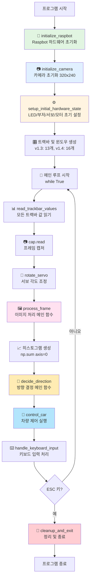

### 함수 호출 깊이별 분류

```
레벨 0 (메인 루프):
└─ while True (메인 루프)

레벨 1 (메인 루프 직접 호출):
├─ read_trackbar_values()
├─ cap.read()
├─ rotate_servo()
├─ process_frame() ⭐ 핵심
├─ decide_direction() ⭐ 핵심
├─ control_car() ⭐ 핵심
└─ handle_keyboard_input()

레벨 2 (핵심 함수 내부 호출):
├─ process_frame() 내부:
│   ├─ calculate_roi_points()
│   ├─ apply_roi_visualization()
│   ├─ apply_perspective_transform()
│   ├─ weighted_gray() (v1.4만)
│   └─ detect_road_lines()
│
├─ decide_direction() 내부:
│   ├─ analyze_histogram()
│   └─ visualize_direction_on_frame()
│
└─ control_car() 내부:
    ├─ car_run() / car_left() / car_right()
    ├─ log_car_action()
    └─ set_led_effect()

레벨 3 (세부 함수):
└─ car_run() / car_left() / car_right() 내부:
    └─ set_motor_speeds()
```

---

## 초기화 함수 그룹

### 1. `initialize_raspbot()` - Raspbot 하드웨어 초기화

#### 함수 시그니처
```python
def initialize_raspbot():
    """Raspbot 하드웨어 초기화"""
    return bot  # Raspbot 객체 반환
```

#### 역할
- Raspbot 하드웨어 객체 생성
- 초기화 실패 시 프로그램 종료

#### 순서도
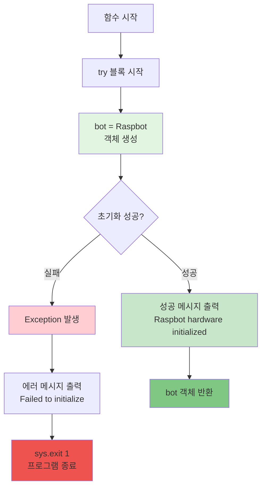

#### 코드 예시
```python
# 호출 방법
bot = initialize_raspbot()

# 반환값
# - 성공: Raspbot 객체
# - 실패: 프로그램 종료 (sys.exit(1))
```

---

### 2. `initialize_camera()` - 카메라 초기화

#### 함수 시그니처
```python
def initialize_camera(width=320, height=240):
    """카메라 초기화 및 설정"""
    return cap  # VideoCapture 객체 반환
```

#### 역할
- USB 카메라 초기화 (장치 번호 0)
- 해상도 및 속성 설정
- 프레임 읽기 테스트

#### 순서도
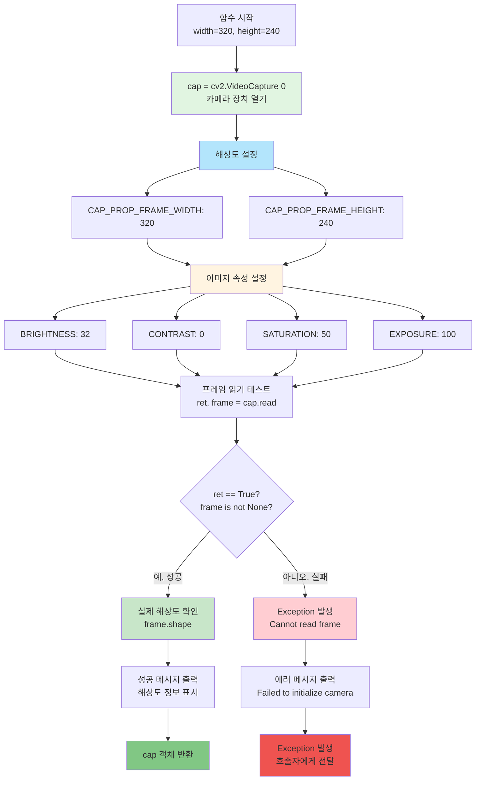

#### 처리 단계
```
1단계: 카메라 장치 열기
  └─ cv2.VideoCapture(0)

2단계: 해상도 설정
  ├─ FRAME_WIDTH: 320
  └─ FRAME_HEIGHT: 240

3단계: 이미지 속성 설정
  ├─ BRIGHTNESS: 32 (밝기)
  ├─ CONTRAST: 0 (대비)
  ├─ SATURATION: 50 (채도)
  └─ EXPOSURE: 100 (노출)

4단계: 프레임 읽기 테스트
  └─ cap.read() 호출 및 검증

5단계: 성공 메시지 출력
  └─ 요청 해상도 vs 실제 해상도 표시
```

#### 코드 예시
```python
# 호출 방법
try:
    cap = initialize_camera()  # 기본 320x240
    # 또는
    cap = initialize_camera(width=640, height=480)  # 커스텀 해상도
except Exception as e:
    print(f"카메라 초기화 실패: {e}")
    sys.exit(1)

# 반환값
# - 성공: cv2.VideoCapture 객체
# - 실패: Exception 발생
```

---

### 3. `setup_initial_hardware_state()` - 초기 하드웨어 상태 설정

#### 함수 시그니처
```python
def setup_initial_hardware_state(bot):
    """초기 하드웨어 상태 설정"""
    # 반환값 없음 (void)
```

#### 역할
- LED, 부저, 서보, 모터 초기 상태 설정
- 시작 시 부저 테스트 (옵션)

#### 순서도
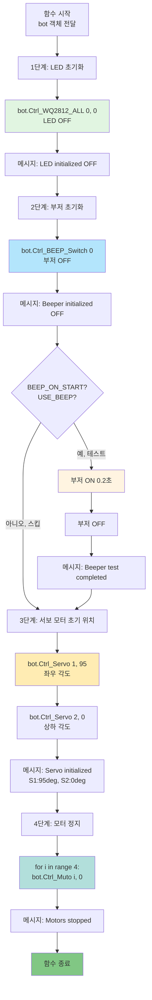

#### 처리 단계
```
1단계: LED 초기화
  └─ Ctrl_WQ2812_ALL(0, 0) - LED OFF

2단계: 부저 초기화
  ├─ Ctrl_BEEP_Switch(0) - 부저 OFF
  └─ (옵션) 부저 테스트 0.2초

3단계: 서보 모터 초기 위치
  ├─ Servo 1: 95도 (좌우)
  └─ Servo 2: 0도 (상하)

4단계: 모터 정지
  └─ 모터 0~3 모두 속도 0 설정
```

#### 코드 예시
```python
# 호출 방법
setup_initial_hardware_state(bot)

# 설정 변수
BEEP_ON_START = True  # 부저 테스트 여부
USE_BEEP = True       # 부저 사용 여부
DEFAULT_SERVO_1 = 95  # 서보1 초기 각도
DEFAULT_SERVO_2 = 0   # 서보2 초기 각도
```

---

## 이미지 처리 함수 그룹

### 4. `calculate_roi_points()` - ROI 포인트 계산

#### 함수 시그니처
```python
def calculate_roi_points(actual_w, actual_h, roi_top_y, roi_bottom_y):
    """ROI 포인트 계산"""
    return pts_src, top_y, bottom_y
```

#### 역할
- 관심 영역(ROI)의 사다리꼴 좌표 계산
- 트랙바 값(0-1000)을 실제 픽셀 좌표로 변환

#### 순서도
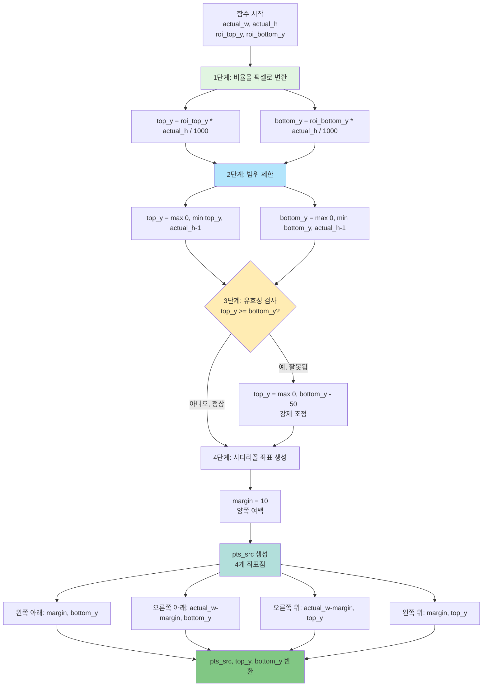

#### 처리 단계
```
입력값 예시:
  actual_w = 320, actual_h = 240
  roi_top_y = 695 (트랙바 값, 0-1000)
  roi_bottom_y = 812 (트랙바 값, 0-1000)

1단계: 비율을 픽셀로 변환
  top_y = 695 * 240 / 1000 = 166.8 → 166
  bottom_y = 812 * 240 / 1000 = 194.88 → 194

2단계: 범위 제한
  top_y = max(0, min(166, 239)) = 166
  bottom_y = max(0, min(194, 239)) = 194

3단계: 유효성 검사
  166 < 194 → 정상

4단계: 사다리꼴 좌표 생성
  margin = 10
  pts_src = [
    [10, 194],      # 왼쪽 아래
    [310, 194],     # 오른쪽 아래
    [310, 166],     # 오른쪽 위
    [10, 166]       # 왼쪽 위
  ]
```

#### 코드 예시
```python
# 호출 방법
actual_h, actual_w = frame.shape[:2]  # 240, 320
roi_top_y = cv2.getTrackbarPos("ROI_Top_Y", "Camera Settings")  # 695
roi_bottom_y = cv2.getTrackbarPos("ROI_Bottom_Y", "Camera Settings")  # 812

pts_src, top_y, bottom_y = calculate_roi_points(
    actual_w, actual_h, roi_top_y, roi_bottom_y
)

# 반환값
# pts_src: numpy array [[10,194], [310,194], [310,166], [10,166]]
# top_y: 166 (픽셀)
# bottom_y: 194 (픽셀)
```

---

### 5. `apply_perspective_transform()` - 원근 변환 적용

#### 함수 시그니처
```python
def apply_perspective_transform(frame, pts_src, target_w=320, target_h=240):
    """원근 변환 적용"""
    return frame_transformed
```

#### 역할
- 사다리꼴 ROI를 직사각형으로 변환 (버드아이 뷰)
- 왜곡 보정 및 정면 시점 변환

#### 순서도
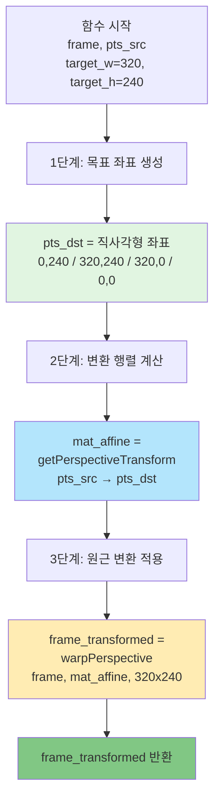

#### 처리 단계
```
입력값 예시:
  pts_src = [[10,194], [310,194], [310,166], [10,166]]
  target_w = 320, target_h = 240

1단계: 목표 좌표 생성 (직사각형)
  pts_dst = [
    [0, 240],      # 왼쪽 아래
    [320, 240],    # 오른쪽 아래
    [320, 0],      # 오른쪽 위
    [0, 0]         # 왼쪽 위
  ]

2단계: 변환 행렬 계산
  mat_affine = cv2.getPerspectiveTransform(pts_src, pts_dst)
  # 3x3 변환 행렬 생성

3단계: 원근 변환 적용
  frame_transformed = cv2.warpPerspective(
    frame, mat_affine, (320, 240)
  )
  # 사다리꼴 → 직사각형 변환
```

#### 비주얼 예시
```
원본 프레임 (사다리꼴 ROI):
┌──────────────────────┐
│                      │
│      ┌──────┐        │  ← 상단 좁음
│     │ ROI  │         │
│    │      │          │
│   └────────┘         │  ← 하단 넓음
└──────────────────────┘

변환 후 (직사각형):
┌──────────────┐
│              │
│   직사각형   │  ← 균일한 너비
│              │
│              │
└──────────────┘
```

#### 코드 예시
```python
# 호출 방법
frame_transformed = apply_perspective_transform(
    frame, pts_src, target_w=320, target_h=240
)

# 반환값
# frame_transformed: 320x240 BGR 이미지 (직사각형)
```

---

### 6. `weighted_gray()` - RGB 가중치 기반 그레이스케일 변환 (⭐ v1.4만)

#### 함수 시그니처
```python
def weighted_gray(image, r_weight, g_weight, b_weight):
    """RGB 가중치 기반 그레이스케일 변환"""
    return weighted_gray_frame
```

#### 역할
- RGB 채널별 가중치 조정하여 그레이스케일 생성
- 빛 반사 영역 필터링 (B 가중치 높임)
- 환경 조명 변화 대응

#### 순서도
```mermaid
flowchart TD
    A[함수 시작<br/>image BGR<br/>r_weight, g_weight, b_weight] --> B[1단계: 가중치 정규화]
    B --> B1[r_weight /= 100.0<br/>예: 30 → 0.3]
    B --> B2[g_weight /= 100.0<br/>예: 40 → 0.4]
    B --> B3[b_weight /= 100.0<br/>예: 60 → 0.6]
    
    B1 --> C[2단계: 채널 분리]
    B2 --> C
    B3 --> C
    C --> C1[image[:,:,0] = B 채널]
    C --> C2[image[:,:,1] = G 채널]
    C --> C3[image[:,:,2] = R 채널]
    
    C1 --> D[3단계: 가중 합산]
    C2 --> D
    C3 --> D
    D --> D1[temp1 = addWeighted<br/>R*0.3 + G*0.4]
    D1 --> D2[result = addWeighted<br/>temp1 + B*0.6]
    
    D2 --> E[weighted_gray_frame 반환]
    
    style B fill:#fffacd
    style C fill:#e1f5e1
    style D fill:#b3e5fc
    style E fill:#81c784
```

#### 처리 단계
```
입력값 예시:
  r_weight = 30, g_weight = 40, b_weight = 60

1단계: 가중치 정규화 (0~100 → 0~1)
  r_weight = 30 / 100.0 = 0.3
  g_weight = 40 / 100.0 = 0.4
  b_weight = 60 / 100.0 = 0.6
  합계 = 0.3 + 0.4 + 0.6 = 1.3 (100% 아님 - 의도적)

2단계: 채널 분리 (BGR 순서)
  B = image[:, :, 0]  # 파랑 채널
  G = image[:, :, 1]  # 초록 채널
  R = image[:, :, 2]  # 빨강 채널

3단계: 가중 합산
  step1 = R * 0.3 + G * 0.4
  result = step1 * 1.0 + B * 0.6
  
  최종 수식:
  gray = R * 0.3 + G * 0.4 + B * 0.6

빛 반사 필터링 원리:
  - 빛 반사 영역: R↑(밝음), B↓(상대적으로 어두움)
  - B 가중치 높임 → 반사 영역이 어둡게 처리됨
  - 결과: 도로선으로 오검출 방지
```

#### 비교: cv2.cvtColor vs weighted_gray

```
cv2.cvtColor (표준 그레이스케일):
  gray = 0.299*R + 0.587*G + 0.114*B
  # 고정 비율, 빛 반사 취약

weighted_gray (v1.4):
  gray = 0.3*R + 0.4*G + 0.6*B
  # 가변 비율, 빛 반사 대응
  # B 가중치 높임 → 반사 영향 감소
```

#### 코드 예시
```python
# 호출 방법 (v1.4)
r_weight = cv2.getTrackbarPos("R_weight", "Camera Settings")  # 30
g_weight = cv2.getTrackbarPos("G_weight", "Camera Settings")  # 40
b_weight = cv2.getTrackbarPos("B_weight", "Camera Settings")  # 60

gray_frame = weighted_gray(frame_transformed, r_weight, g_weight, b_weight)

# v1.3에서는 표준 그레이스케일 사용
gray_frame = cv2.cvtColor(frame_transformed, cv2.COLOR_BGR2GRAY)

# 반환값
# weighted_gray_frame: 320x240 단일 채널 (0-255)
```

---

### 7. `detect_road_lines()` - 도로선 감지

#### 함수 시그니처
```python
def detect_road_lines(color_frame, gray_frame, detect_value):
    """도로선 감지 (빨간색 + 엷은 회색)"""
    return mask_lines
```

#### 역할
- HSV 색상 공간에서 빨간색 도로선 감지
- 밝기 기반으로 회색/흰색 도로선 감지
- 두 마스크 결합 및 노이즈 제거

#### 순서도
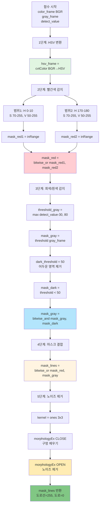

#### 처리 단계
```
입력값 예시:
  detect_value = 120

1단계: HSV 변환
  hsv_frame = cv2.cvtColor(color_frame, cv2.COLOR_BGR2HSV)

2단계: 빨간색 감지 (HSV 색상 공간)
  빨간색은 0도와 180도 근처 두 영역
  
  범위1: H[0, 10], S[70, 255], V[50, 255]
  mask_red1 = cv2.inRange(hsv_frame, lower_red1, upper_red1)
  
  범위2: H[170, 180], S[70, 255], V[50, 255]
  mask_red2 = cv2.inRange(hsv_frame, lower_red2, upper_red2)
  
  결합: mask_red = cv2.bitwise_or(mask_red1, mask_red2)

3단계: 회색/흰색 감지 (밝기 기반)
  threshold_gray = max(120 - 30, 80) = 90
  
  밝은 영역 감지:
  _, mask_gray = cv2.threshold(gray_frame, 90, 255, THRESH_BINARY)
  
  어두운 영역 제거 (검정 도로):
  _, mask_dark = cv2.threshold(gray_frame, 50, 255, THRESH_BINARY)
  mask_gray = cv2.bitwise_and(mask_gray, mask_dark)

4단계: 마스크 결합
  mask_lines = cv2.bitwise_or(mask_red, mask_gray)
  # 빨간색 + 회색/흰색

5단계: 노이즈 제거
  kernel = np.ones((3, 3), np.uint8)
  mask_lines = cv2.morphologyEx(mask_lines, cv2.MORPH_CLOSE, kernel)
  mask_lines = cv2.morphologyEx(mask_lines, cv2.MORPH_OPEN, kernel)
```

#### 결과 해석
```
이진화 이미지:
  - 255 (흰색): 도로선 (빨간색 또는 회색/흰색)
  - 0 (검정): 도로 (검정 표면)

히스토그램 합계 의미:
  - 합계 높음 → 도로선 많음 → 막힘/경계
  - 합계 낮음 → 검정 도로 많음 → 주행 가능
```

#### 코드 예시
```python
# 호출 방법
binary_frame = detect_road_lines(
    frame_transformed,  # BGR 컬러 이미지
    gray_frame,         # 그레이스케일 이미지
    detect_value        # 120
)

# 반환값
# mask_lines: 320x240 이진화 이미지 (0 또는 255)
# - 도로선: 255
# - 도로: 0
```

---

### 8. `process_frame()` - 프레임 처리 메인 함수 (⭐ 핵심)

#### 함수 시그니처
```python
# v1.3 기본 버전
def process_frame(frame, detect_value, roi_top_y, roi_bottom_y):
    """프레임 처리 및 도로선 검출"""
    return binary_frame

# v1.4 RGB 필터링 버전
def process_frame(frame, detect_value, roi_top_y, roi_bottom_y, 
                  r_weight, g_weight, b_weight):
    """프레임 처리 및 도로선 검출 (RGB 필터링)"""
    return binary_frame
```

#### 역할
- 전체 이미지 처리 파이프라인 통합
- ROI → 원근변환 → 그레이스케일 → 도로선 감지
- 4개 윈도우에 중간 결과 표시

#### 순서도
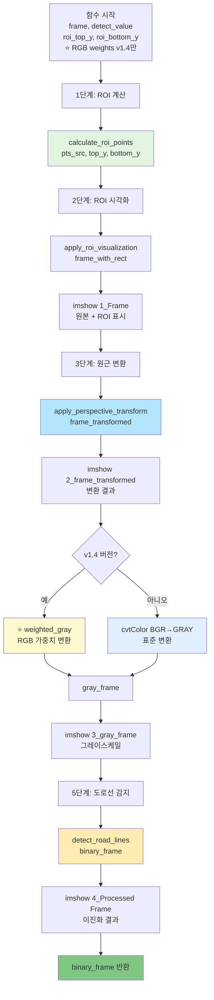

#### 처리 단계 (v1.3 vs v1.4 비교)

```
공통 단계 (v1.3 & v1.4):
├─ 1단계: ROI 계산
│   └─ calculate_roi_points()
├─ 2단계: ROI 시각화
│   └─ apply_roi_visualization()
├─ 3단계: 원근 변환
│   └─ apply_perspective_transform()
└─ 5단계: 도로선 감지
    └─ detect_road_lines()

차이점 (4단계):
├─ v1.3: cv2.cvtColor(BGR2GRAY)
└─ v1.4: weighted_gray(r_weight, g_weight, b_weight) ⭐

윈도우 출력 (4개):
├─ 1_Frame: 원본 + ROI 영역 표시
├─ 2_frame_transformed: 원근 변환 결과
├─ 3_gray_frame: 그레이스케일 변환
└─ 4_Processed Frame: 최종 이진화 (별도 함수에서 업데이트)
```

#### 코드 예시
```python
# v1.3 호출 방법
binary_frame = process_frame(
    frame,           # 원본 프레임
    detect_value,    # 120
    roi_top_y,       # 695
    roi_bottom_y     # 812
)

# v1.4 호출 방법
binary_frame = process_frame(
    frame,           # 원본 프레임
    detect_value,    # 120
    roi_top_y,       # 695
    roi_bottom_y,    # 812
    r_weight,        # 30 ⭐
    g_weight,        # 40 ⭐
    b_weight         # 60 ⭐
)

# 반환값
# binary_frame: 320x240 이진화 이미지
# - 도로선: 255
# - 도로: 0
```

---

## 방향 결정 함수 그룹

### 9. `analyze_histogram()` - 히스토그램 3등분 분석

#### 함수 시그니처
```python
def analyze_histogram(histogram):
    """히스토그램 3등분 분석"""
    return left_sum, center_sum, right_sum, left_ratio, center_ratio, right_ratio
```

#### 역할
- 히스토그램을 LEFT/CENTER/RIGHT 3등분
- 각 영역의 합계 및 비율 계산
- 주행 가능 영역 판단 기준 제공

#### 순서도
```mermaid
flowchart TD
    A[함수 시작<br/>histogram 1D 배열] --> B[1단계: 3등분 경계 계산]
    B --> B1[length = len histogram<br/>예: 320]
    B1 --> B2[left_end = length // 3<br/>예: 106]
    B1 --> B3[right_start = 2 * length // 3<br/>예: 213]
    
    B2 --> C[2단계: 각 영역 합계]
    B3 --> C
    C --> C1[left_sum = sum histogram[:106]]
    C --> C2[center_sum = sum histogram[106:213]]
    C --> C3[right_sum = sum histogram[213:]]
    
    C1 --> D[3단계: 비율 계산]
    C2 --> D
    C3 --> D
    D --> D1[left_ratio =<br/>left_sum / left_end * 255]
    D --> D2[center_ratio =<br/>center_sum / width * 255]
    D --> D3[right_ratio =<br/>right_sum / width * 255]
    
    D1 --> E[6개 값 반환<br/>sum x 3 + ratio x 3]
    D2 --> E
    D3 --> E
    
    style B fill:#e1f5e1
    style C fill:#b3e5fc
    style D fill:#ffecb3
    style E fill:#81c784
```

#### 처리 단계
```
입력값 예시:
  histogram: shape=(320,) 1D 배열
  각 값: 0~255 범위 (세로 합계)

1단계: 3등분 경계 계산
  length = 320
  left_end = 320 // 3 = 106
  right_start = 2 * 320 // 3 = 213
  
  분할:
  ├─ LEFT:   histogram[0:106]     (106개)
  ├─ CENTER: histogram[106:213]   (107개)
  └─ RIGHT:  histogram[213:320]   (107개)

2단계: 각 영역 합계
  left_sum = np.sum(histogram[0:106])
  center_sum = np.sum(histogram[106:213])
  right_sum = np.sum(histogram[213:320])
  
  예시 결과:
  left_sum = 45000
  center_sum = 12000
  right_sum = 38000

3단계: 비율 계산 (0~1 범위)
  left_ratio = 45000 / (106 * 255) = 0.166
  center_ratio = 12000 / (107 * 255) = 0.044
  right_ratio = 38000 / (107 * 255) = 0.139

해석:
  - 합계 낮음 = 비율 낮음 = 검정 도로 많음 = 주행 가능
  - 합계 높음 = 비율 높음 = 도로선 많음 = 막힘/경계
```

#### 코드 예시
```python
# 호출 방법
histogram = np.sum(binary_frame, axis=0)  # 세로 방향 합산 → shape=(320,)

left_sum, center_sum, right_sum, left_ratio, center_ratio, right_ratio = analyze_histogram(histogram)

# 반환값 예시
# left_sum = 45000 (픽셀 합계)
# center_sum = 12000
# right_sum = 38000
# left_ratio = 0.166 (정규화 비율)
# center_ratio = 0.044
# right_ratio = 0.139
```

---

### 10. `decide_direction()` - 방향 결정 메인 함수 (⭐ 핵심)

#### 함수 시그니처
```python
def decide_direction(histogram, direction_threshold, up_threshold, 
                     detect_value, roi_top_y, roi_bottom_y):
    """히스토그램 기반 방향 결정"""
    return direction, left_sum, center_sum, right_sum
```

#### 역할
- 히스토그램 분석하여 방향 결정
- 우선순위별 판단 로직 적용
- LEFT/UP/RIGHT 중 하나 반환

#### 순서도
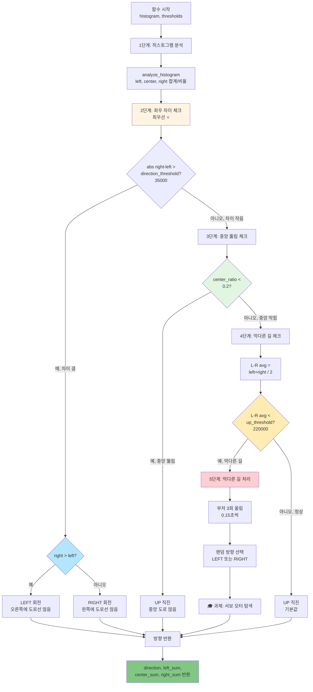

#### 우선순위 로직
```
최우선순위 1: 좌우 차이 체크 ⭐
  조건: abs(right_sum - left_sum) > 35000
  판단:
    - right_sum > left_sum → LEFT 회전 (오른쪽 도로선 많음)
    - left_sum > right_sum → RIGHT 회전 (왼쪽 도로선 많음)

우선순위 2: 중앙 뚫림 체크
  조건: center_ratio < 0.2 (20%)
  판단: UP 직진 (중앙에 검정 도로 많음)

우선순위 3: 막다른 길 체크
  조건: (left_sum + right_sum) / 2 < 220000
  판단: 막다른 길 → 랜덤 LEFT/RIGHT 선택

우선순위 4: 기본값
  판단: UP 직진 (기본 동작)
```

#### 처리 단계 상세
```
예시 1: 좌우 차이가 큰 경우
  left_sum = 25000
  center_sum = 15000
  right_sum = 60000
  
  1단계: abs(60000 - 25000) = 35000 ≥ 35000 ✅
  2단계: right_sum(60000) > left_sum(25000) ✅
  결과: LEFT 회전 (오른쪽에 도로선 많아서 왼쪽으로 회피)

예시 2: 중앙이 뚫린 경우
  left_sum = 30000
  center_sum = 8000
  right_sum = 28000
  
  1단계: abs(28000 - 30000) = 2000 < 35000 ❌
  2단계: center_ratio = 8000 / (107*255) = 0.029 < 0.2 ✅
  결과: UP 직진 (중앙에 검정 도로 많음)

예시 3: 막다른 길
  left_sum = 45000
  center_sum = 55000
  right_sum = 48000
  
  1단계: abs(48000 - 45000) = 3000 < 35000 ❌
  2단계: center_ratio = 55000 / (107*255) = 0.202 > 0.2 ❌
  3단계: (45000 + 48000) / 2 = 46500 < 220000 ✅
  결과: 막다른 길 → 부저 3회 + 랜덤 LEFT/RIGHT
```

#### 코드 예시
```python
# 호출 방법
histogram = np.sum(binary_frame, axis=0)

direction, hist_left, hist_center, hist_right = decide_direction(
    histogram,
    direction_threshold=35000,
    up_threshold=220000,
    detect_value=120,
    roi_top_y=695,
    roi_bottom_y=812
)

# 반환값
# direction: "LEFT" or "UP" or "RIGHT"
# hist_left: 좌측 영역 합계
# hist_center: 중앙 영역 합계
# hist_right: 우측 영역 합계
```

---

## 차량 제어 함수 그룹

### 11. `set_motor_speeds()` - 모터 속도 설정

#### 함수 시그니처
```python
def set_motor_speeds(motor_0, motor_1, motor_2, motor_3):
    """모터 속도 설정"""
    # 반환값 없음
```

#### 역할
- 4개 DC 모터에 속도 명령 전달
- mouse_use 플래그 확인 후 제어

#### 순서도
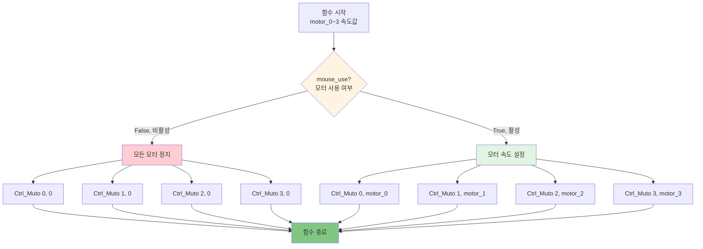

#### 모터 번호 매핑
```
Motor 0: 왼쪽 앞 (Left Front)
Motor 1: 왼쪽 뒤 (Left Rear)
Motor 2: 오른쪽 앞 (Right Front)
Motor 3: 오른쪽 뒤 (Right Rear)

속도 범위:
  -255 ~ +255
  + : 전진 방향
  - : 후진 방향
  0 : 정지
```

#### 코드 예시
```python
# 호출 방법
set_motor_speeds(15, 15, 15, 15)  # 모든 모터 15 속도
set_motor_speeds(-8, -8, 15, 15)  # 좌회전

# mouse_use 플래그
mouse_use = True   # 모터 활성화
mouse_use = False  # 모터 비활성화 (카메라만 작동)
```

---

### 12. `car_run()`, `car_left()`, `car_right()`, `car_stop()` - 기본 주행 함수

#### 함수 시그니처
```python
def car_run(speed_left, speed_right):
    """전진"""
    
def car_left(speed_left, speed_right):
    """좌회전 (제자리 회전)"""
    
def car_right(speed_left, speed_right):
    """우회전 (제자리 회전)"""
    
def car_stop():
    """정지"""
```

#### 순서도 (통합)
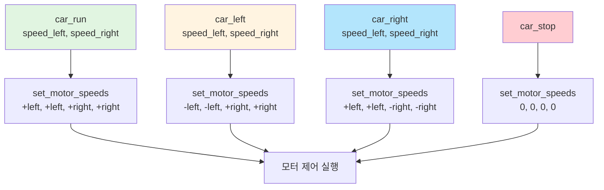

#### 주행 방식 상세
```
전진 (car_run):
  왼쪽 모터: +speed_left  (전진)
  오른쪽 모터: +speed_right (전진)
  → 두 바퀴 모두 앞으로

좌회전 (car_left):
  왼쪽 모터: -speed_left  (후진)
  오른쪽 모터: +speed_right (전진)
  → 왼쪽 뒤로, 오른쪽 앞으로
  → 제자리에서 왼쪽으로 회전

우회전 (car_right):
  왼쪽 모터: +speed_left  (전진)
  오른쪽 모터: -speed_right (후진)
  → 왼쪽 앞으로, 오른쪽 뒤로
  → 제자리에서 오른쪽으로 회전

정지 (car_stop):
  모든 모터: 0
  → 즉시 정지
```

#### 코드 예시
```python
# 전진
car_run(15, 15)  # 양쪽 15 속도로 직진

# 좌회전
car_left(8, 15)  # 왼쪽 -8, 오른쪽 +15

# 우회전
car_right(15, 8)  # 왼쪽 +15, 오른쪽 -8

# 정지
car_stop()  # 모든 모터 0
```

---

### 13. `control_car()` - 차량 제어 메인 함수 (⭐ 핵심)

#### 함수 시그니처
```python
def control_car(direction, up_speed, down_speed):
    """차량 제어 메인 함수"""
    # 반환값 없음
```

#### 역할
- 방향(LEFT/UP/RIGHT)에 따라 차량 제어
- LED 효과 및 로그 출력
- 실제 모터 명령 실행

#### 순서도
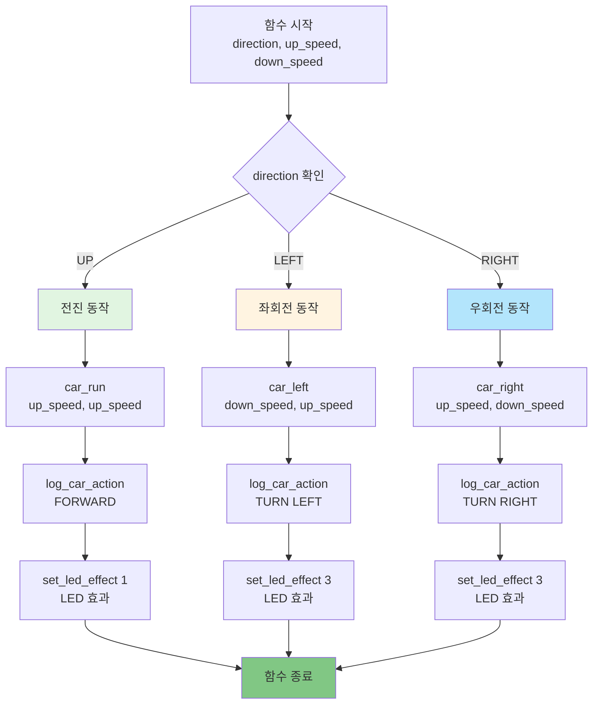

#### 처리 단계
```
입력값 예시:
  direction = "LEFT"
  up_speed = 15
  down_speed = 8

1단계: 방향 판단
  direction == "UP" → 전진
  direction == "LEFT" → 좌회전
  direction == "RIGHT" → 우회전

2단계 (LEFT 선택 시):
  car_left(8, 15)  # down_speed, up_speed
  └─ set_motor_speeds(-8, -8, 15, 15)

3단계: 로그 출력 (DEBUG_MODE=True)
  log_car_action("TURN LEFT")
  └─ 콘솔: "TURN LEFT"

4단계: LED 효과
  set_led_effect(3)
  └─ bot.Ctrl_WQ2812_ALL(1, 3)  # 회전 표시
```

#### LED 효과 매핑
```
LED 효과 모드:
  mode 1: 전진 표시 (UP)
  mode 3: 회전 표시 (LEFT/RIGHT)
```

#### 코드 예시
```python
# 호출 방법
control_car("UP", up_speed=15, down_speed=8)    # 전진
control_car("LEFT", up_speed=15, down_speed=8)  # 좌회전
control_car("RIGHT", up_speed=15, down_speed=8) # 우회전

# 실행 순서
# 1. 모터 제어
# 2. 로그 출력 (DEBUG_MODE)
# 3. LED 효과
```

---

## 보조 함수 그룹

### 14. `handle_keyboard_input()` - 키보드 입력 처리

#### 함수 시그니처
```python
def handle_keyboard_input():
    """키보드 입력 처리"""
    return "EXIT" or "CONTINUE"
```

#### 역할
- 키보드 입력 감지 및 처리
- ESC, SPACE, L, B 키 처리
- 종료 또는 계속 여부 반환

#### 순서도
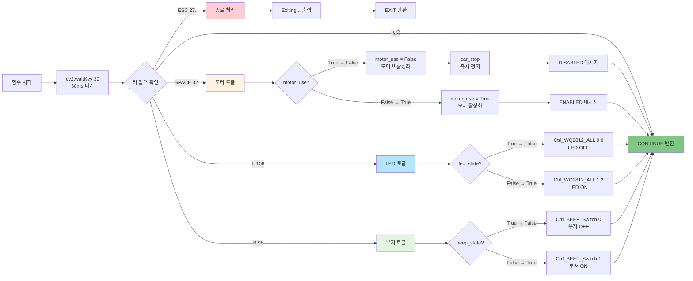

#### 키 매핑
```
ESC (27):
  └─ 프로그램 종료 → "EXIT" 반환

SPACE (32):
  ├─ mouse_use = True → False (모터 비활성화)
  └─ mouse_use = False → True (모터 활성화)
  └─ car_stop() 호출 (비활성화 시)

L (108):
  ├─ led_state = True → False (LED OFF)
  └─ led_state = False → True (LED ON)

B (98):
  ├─ beep_state = True → False (부저 OFF)
  └─ beep_state = False → True (부저 ON)

없음:
  └─ "CONTINUE" 반환 (계속 실행)
```

#### 코드 예시
```python
# 메인 루프에서 호출
result = handle_keyboard_input()
if result == "EXIT":
    break  # 루프 종료

# 반환값
# "EXIT": 프로그램 종료
# "CONTINUE": 계속 실행
```

---

### 15. `read_trackbar_values()` - 트랙바 값 일괄 읽기

#### 함수 시그니처
```python
def read_trackbar_values():
    """트랙바 값 일괄 읽기"""
    return values  # dict
```

#### 역할
- 모든 트랙바 값을 한 번에 읽기
- 딕셔너리로 반환하여 쉽게 접근

#### 순서도
```mermaid
flowchart TD
    A[함수 시작] --> B[빈 딕셔너리 생성<br/>values = {}]
    
    B --> C[카메라 설정 읽기]
    C --> C1[brightness]
    C --> C2[contrast]
    C --> C3[saturation]
    C --> C4[gain]
    
    C1 --> D[이미지 처리 읽기]
    C2 --> D
    C3 --> D
    C4 --> D
    D --> D1[detect_value]
    D --> D2[roi_top_y]
    D --> D3[roi_bottom_y]
    
    D1 --> E[모터 속도 읽기]
    D2 --> E
    D3 --> E
    E --> E1[motor_up_speed]
    E --> E2[motor_down_speed]
    
    E1 --> F[서보 각도 읽기]
    E2 --> F
    F --> F1[servo_1_angle]
    F --> F2[servo_2_angle]
    
    F1 --> G[방향 판단 읽기]
    F2 --> G
    G --> G1[direction_threshold]
    G --> G2[up_threshold]
    
    G1 --> H{⭐ v1.4?}
    G2 --> H
    H -->|예| I[RGB 가중치 읽기]
    I --> I1[r_weight]
    I --> I2[g_weight]
    I --> I3[b_weight]
    
    H -->|아니오| J[values 반환]
    I1 --> J
    I2 --> J
    I3 --> J
    
    style C fill:#e1f5e1
    style D fill:#b3e5fc
    style E fill:#fff4e1
    style F fill:#ffecb3
    style G fill:#b2dfdb
    style I fill:#fffacd
    style J fill:#81c784
```

#### 반환 딕셔너리 구조
```python
# v1.3 기본 버전 (13개)
values = {
    # 카메라 설정 (4개)
    "brightness": 32,
    "contrast": 0,
    "saturation": 0,
    "gain": 0,
    
    # 이미지 처리 (3개)
    "detect_value": 120,
    "roi_top_y": 695,
    "roi_bottom_y": 812,
    
    # 모터 속도 (2개)
    "motor_up_speed": 15,
    "motor_down_speed": 8,
    
    # 서보 각도 (2개)
    "servo_1_angle": 95,
    "servo_2_angle": 0,
    
    # 방향 판단 (2개)
    "direction_threshold": 35000,
    "up_threshold": 220000
}

# v1.4 RGB 필터링 버전 (+3개, 총 16개)
values["r_weight"] = 30  # ⭐
values["g_weight"] = 40  # ⭐
values["b_weight"] = 60  # ⭐
```

#### 코드 예시
```python
# 호출 방법
params = read_trackbar_values()

# 사용 방법
detect_value = params["detect_value"]
up_speed = params["motor_up_speed"]

# v1.4에서만
r_weight = params["r_weight"]  # KeyError if v1.3
```

---

### 16. `cleanup_and_exit()` - 정리 및 종료

#### 함수 시그니처
```python
def cleanup_and_exit(bot, cap):
    """정리 및 종료"""
    # 반환값 없음
```

#### 역할
- 모든 하드웨어 정리
- 리소스 해제
- 안전한 종료

#### 순서도
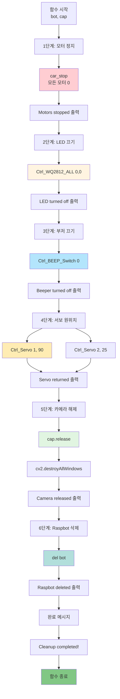

#### 정리 단계
```
1단계: 모터 정지
  └─ car_stop() 호출

2단계: LED 끄기
  └─ Ctrl_WQ2812_ALL(0, 0)

3단계: 부저 끄기
  └─ Ctrl_BEEP_Switch(0)

4단계: 서보 원위치
  ├─ Servo 1: 90도
  └─ Servo 2: 25도

5단계: 카메라 해제
  ├─ cap.release()
  └─ cv2.destroyAllWindows()

6단계: Raspbot 삭제
  └─ del bot
```

#### 코드 예시
```python
# 메인 루프 종료 후 (finally 블록)
try:
    while True:
        # ... 메인 루프 ...
        pass
except KeyboardInterrupt:
    print("Interrupted by user")
except Exception as e:
    print(f"Error: {e}")
finally:
    cleanup_and_exit(bot, cap)  # 항상 실행
```

---

## 메인 루프 함수

### 17. 메인 루프 - 전체 실행 흐름

#### 순서도
```mermaid
flowchart TD
    A[메인 루프 시작<br/>while True] --> B[프레임 카운터 증가<br/>frame_count += 1]
    
    B --> C{10프레임마다?<br/>frame_count % 10 == 0}
    C -->|예| D[상태 출력<br/>Frame/Motor/LED/Beep]
    C -->|아니오| E[트랙바 값 읽기]
    D --> E
    
    E --> E1[read_trackbar_values<br/>params 딕셔너리]
    E1 --> F[카메라 속성 설정]
    F --> F1[apply_camera_settings<br/>brightness, contrast, etc]
    
    F1 --> G[프레임 읽기]
    G --> G1[ret, frame = cap.read]
    G1 --> G2{ret == True?}
    G2 -->|실패| H[에러 메시지<br/>break]
    
    G2 -->|성공| I[서보 각도 조절]
    I --> I1[rotate_servo 1, angle]
    I --> I2[rotate_servo 2, angle]
    
    I1 --> J[⭐ 이미지 처리]
    I2 --> J
    J --> J1{v1.4?}
    J1 -->|예| J2[process_frame<br/>+ RGB weights]
    J1 -->|아니오| J3[process_frame<br/>기본]
    
    J2 --> K[히스토그램 생성]
    J3 --> K
    K --> K1[np.sum axis=0<br/>세로 합산]
    
    K1 --> L{DEBUG_MODE?<br/>10프레임마다?}
    L -->|예| M[디버그 출력<br/>Frame 번호]
    L -->|아니오| N[⭐ 방향 결정]
    M --> N
    
    N --> N1[decide_direction<br/>direction, hist_*]
    N1 --> O[방향 정보 시각화]
    O --> O1[visualize_direction_on_frame]
    O1 --> O2[imshow 4_Processed Frame]
    
    O2 --> P[⭐ 차량 제어]
    P --> P1[control_car<br/>direction, speeds]
    
    P1 --> Q{10프레임마다?}
    Q -->|예| R[FPS 계산]
    R --> R1[elapsed = time - start]
    R1 --> R2[fps = 10 / elapsed]
    R2 --> R3[FPS 출력]
    R3 --> S[키보드 입력 처리]
    
    Q -->|아니오| S
    S --> S1[handle_keyboard_input]
    S1 --> S2{result?}
    S2 -->|EXIT| T[루프 종료<br/>break]
    S2 -->|CONTINUE| U[대기]
    U --> U1[time.sleep 0.05]
    U1 --> A
    
    T --> V[cleanup_and_exit]
    V --> W[프로그램 종료]
    
    style J fill:#ffe1f0
    style N fill:#ffecb3
    style P fill:#b3e5fc
    style S fill:#fff4e1
    style V fill:#ffcdd2
    style W fill:#ef5350
```

#### 주요 처리 단계
```
무한 루프 (while True):

1단계: 상태 업데이트
  ├─ 프레임 카운터 증가
  └─ 10프레임마다 상태 출력

2단계: 파라미터 읽기
  ├─ read_trackbar_values()
  └─ apply_camera_settings()

3단계: 프레임 캡처
  └─ cap.read()

4단계: 서보 제어
  ├─ rotate_servo(1, angle)
  └─ rotate_servo(2, angle)

5단계: 이미지 처리 ⭐
  ├─ process_frame() - v1.3 또는 v1.4
  └─ 히스토그램 생성

6단계: 방향 결정 ⭐
  ├─ decide_direction()
  └─ visualize_direction_on_frame()

7단계: 차량 제어 ⭐
  └─ control_car()

8단계: FPS 계산
  └─ 10프레임마다 계산

9단계: 키보드 입력
  ├─ handle_keyboard_input()
  └─ ESC → break

10단계: 대기
  └─ time.sleep(0.05) - 50ms
```

---

## 함수 호출 관계도

### 전체 함수 호출 트리

```
main() - 메인 실행 흐름
│
├─── 초기화 단계
│    ├─ initialize_raspbot() → bot 객체
│    ├─ initialize_camera() → cap 객체
│    └─ setup_initial_hardware_state(bot)
│         ├─ bot.Ctrl_WQ2812_ALL()
│         ├─ bot.Ctrl_BEEP_Switch()
│         ├─ bot.Ctrl_Servo()
│         └─ bot.Ctrl_Muto()
│
├─── 메인 루프 (while True)
│    │
│    ├─ read_trackbar_values()
│    │   └─ cv2.getTrackbarPos() x N개
│    │
│    ├─ apply_camera_settings(cap, ...)
│    │   └─ cap.set() x 4개
│    │
│    ├─ cap.read()
│    │
│    ├─ rotate_servo(1, angle)
│    │   └─ bot.Ctrl_Servo()
│    ├─ rotate_servo(2, angle)
│    │   └─ bot.Ctrl_Servo()
│    │
│    ├─ ⭐ process_frame() [핵심 이미지 처리]
│    │   ├─ calculate_roi_points()
│    │   ├─ apply_roi_visualization()
│    │   │   └─ cv2.polylines(), cv2.putText()
│    │   ├─ apply_perspective_transform()
│    │   │   ├─ cv2.getPerspectiveTransform()
│    │   │   └─ cv2.warpPerspective()
│    │   ├─ weighted_gray() [v1.4만]
│    │   │   └─ cv2.addWeighted()
│    │   └─ detect_road_lines()
│    │       ├─ cv2.cvtColor(HSV)
│    │       ├─ cv2.inRange()
│    │       ├─ cv2.threshold()
│    │       ├─ cv2.bitwise_or()
│    │       └─ cv2.morphologyEx()
│    │
│    ├─ np.sum(axis=0) → histogram
│    │
│    ├─ ⭐ decide_direction() [핵심 방향 결정]
│    │   ├─ analyze_histogram()
│    │   │   └─ np.sum()
│    │   └─ (막다른 길 시)
│    │       ├─ bot.Ctrl_BEEP_Switch()
│    │       └─ random.choice()
│    │
│    ├─ visualize_direction_on_frame()
│    │   ├─ cv2.cvtColor()
│    │   ├─ cv2.rectangle()
│    │   ├─ cv2.addWeighted()
│    │   ├─ cv2.putText() x N개
│    │   └─ cv2.line()
│    │
│    ├─ ⭐ control_car() [핵심 차량 제어]
│    │   ├─ car_run() / car_left() / car_right()
│    │   │   └─ set_motor_speeds()
│    │   │       └─ bot.Ctrl_Muto() x 4개
│    │   ├─ log_car_action()
│    │   └─ set_led_effect()
│    │       └─ bot.Ctrl_WQ2812_ALL()
│    │
│    └─ handle_keyboard_input()
│         ├─ cv2.waitKey()
│         ├─ car_stop() (SPACE)
│         ├─ bot.Ctrl_WQ2812_ALL() (L)
│         └─ bot.Ctrl_BEEP_Switch() (B)
│
└─── 정리 단계 (finally)
     └─ cleanup_and_exit(bot, cap)
          ├─ car_stop()
          ├─ bot.Ctrl_WQ2812_ALL()
          ├─ bot.Ctrl_BEEP_Switch()
          ├─ bot.Ctrl_Servo()
          ├─ cap.release()
          ├─ cv2.destroyAllWindows()
          └─ del bot
```

### 핵심 함수 3개 상세 관계

```
┌─────────────────────────────────────────────┐
│         메인 루프 (while True)              │
└─────────────────────────────────────────────┘
                     │
        ┌────────────┼────────────┐
        │            │            │
    ┌───▼────┐   ┌──▼─────┐  ┌──▼─────┐
    │process │   │decide  │  │control │
    │_frame  │──▶│_direc  │─▶│_car    │
    │⭐     │   │tion⭐ │  │⭐     │
    └────────┘   └────────┘  └────────┘
        │            │            │
        │            │            │
    이미지 처리    방향 결정    차량 제어
        │            │            │
        ▼            ▼            ▼
  binary_frame   direction    모터 명령
   (이진화)     (LEFT/UP/    (속도 설정)
              RIGHT)
```

---

## 함수별 처리 시간 (예상)

| 함수 그룹 | 함수명 | 처리 시간 | 비고 |
|---------|--------|----------|------|
| **초기화** | initialize_raspbot | ~100ms | 최초 1회만 |
| | initialize_camera | ~500ms | 최초 1회만 |
| | setup_initial_hardware_state | ~200ms | 최초 1회만 |
| **이미지 처리** | calculate_roi_points | <1ms | 즉시 |
| | apply_perspective_transform | ~5ms | 행렬 연산 |
| | weighted_gray (v1.4) | ~2ms | 가중 합산 |
| | detect_road_lines | ~8ms | HSV + threshold |
| | **process_frame** | **~15ms** | **전체 통합** |
| **방향 결정** | analyze_histogram | ~1ms | 합계 계산 |
| | **decide_direction** | **~2ms** | **판단 로직** |
| **차량 제어** | set_motor_speeds | <1ms | 즉시 |
| | car_run/left/right | <1ms | 즉시 |
| | **control_car** | **~2ms** | **통합 제어** |
| **보조** | handle_keyboard_input | ~30ms | waitKey |
| | read_trackbar_values | ~1ms | getTrackbarPos |
| **기타** | 프레임 캡처 (cap.read) | ~30ms | 카메라 |
| | 히스토그램 생성 (np.sum) | ~2ms | NumPy |
| **총 처리 시간** | | **~60ms** | **16-17 FPS** |

---

## 버전별 함수 차이점 요약

| 항목 | v1.3 기본 | v1.4 RGB 필터링 |
|------|---------|----------------|
| **총 함수 개수** | 26개 | 27개 (+1) |
| **추가 함수** | - | weighted_gray() |
| **process_frame 파라미터** | 4개 | 7개 (+3: RGB) |
| **트랙바 개수** | 13개 | 16개 (+3: RGB) |
| **처리 시간** | ~57ms | ~60ms (+3ms) |
| **FPS** | 17-18 | 16-17 |

---

## 교육용 학습 순서 추천

```
1단계: 초기화 함수 그룹 (3개)
  ├─ initialize_raspbot()
  ├─ initialize_camera()
  └─ setup_initial_hardware_state()
  → 하드웨어 제어 기초 학습

2단계: 차량 제어 함수 그룹 (6개)
  ├─ set_motor_speeds()
  ├─ car_run(), car_left(), car_right(), car_stop()
  └─ control_car()
  → 모터 제어 원리 학습

3단계: 이미지 처리 함수 그룹 (8개)
  ├─ calculate_roi_points()
  ├─ apply_perspective_transform()
  ├─ weighted_gray() [v1.4]
  ├─ detect_road_lines()
  └─ process_frame()
  → OpenCV 기초 학습

4단계: 방향 결정 함수 그룹 (2개)
  ├─ analyze_histogram()
  └─ decide_direction()
  → 알고리즘 로직 학습

5단계: 보조 함수 그룹 (4개)
  ├─ handle_keyboard_input()
  ├─ read_trackbar_values()
  └─ cleanup_and_exit()
  → 완성도 향상

6단계: 메인 루프 통합
  └─ while True 전체 흐름
  → 시스템 통합 이해
```

---

**작성일**: 2025-12-02  
**버전**: 1.0  
**대상 파일**: 
- `0_autoplot___test.py` (v1.3)
- `1_autoplot___rgb_filter.py` (v1.4)

**총 함수 개수**: 
- v1.3: 26개
- v1.4: 27개 (weighted_gray 추가)

**핵심 함수 3개**: 
1. process_frame() - 이미지 처리
2. decide_direction() - 방향 결정
3. control_car() - 차량 제어

