# 🎥 Cascade 카메라 프로그램 가이드

> Raspbot 자율주행 자동차의 카메라 기반 객체 감지 시스템  
> Haar Cascade 제작부터 실시간 감지까지 완벽 가이드

---

## 📑 목차

1. [개요](#-개요)
2. [YOLO vs Haar Cascade 비교](#-yolo-vs-haar-cascade-비교)
3. [Haar Cascade 제작 프로세스](#-haar-cascade-제작-프로세스)
4. [신호등 빨간불 인식 전략](#-신호등-빨간불-인식-전략)
5. [이미지 수집 전략](#-이미지-수집-전략)
6. [파일 구조 및 단계별 설명](#-파일-구조-및-단계별-설명)
7. [기능 비교표](#-기능-비교표)
8. [시스템 아키텍처](#-시스템-아키텍처)
9. [단계별 순서도](#-단계별-순서도)
10. [핵심 알고리즘](#-핵심-알고리즘)
11. [사용법](#-사용법)
12. [트러블슈팅](#-트러블슈팅)

---

## 📋 개요

이 프로젝트는 **3단계 학습 구조**로 설계되어 있습니다:

| 단계 | 파일명 | 학습 목표 |
|:---:|--------|----------|
| **0단계** | `0_camera_color_rect.py` | 카메라 기본 설정 및 그레이스케일 변환 |
| **1단계** | `1_camera_weight.py` | RGB 가중치 기반 커스텀 그레이스케일 |
| **2단계** | `2_object_camera_haarcascade.py` | Haar Cascade 객체 감지 |

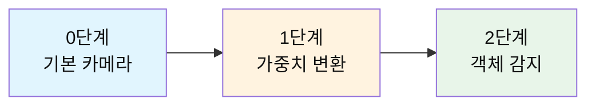

---

## 🆚 YOLO vs Haar Cascade 비교

### 종합 비교표

| 비교 항목 | **YOLO (You Only Look Once)** | **Haar Cascade** |
|-----------|-------------------------------|------------------|
| **🔬 기술 방식** | 딥러닝 (CNN 기반) | 머신러닝 (AdaBoost + Haar 특징) |
| **📅 개발 연도** | 2015년~ (YOLOv1~v11) | 2001년 (Viola-Jones) |
| **🎯 탐지 방식** | 단일 네트워크 End-to-End | 슬라이딩 윈도우 + Cascade 분류기 |
| **⚡ 처리 속도** | 빠름 (30-200+ FPS, GPU 사용 시) | 중간 (15-30 FPS, CPU) |
| **🎓 학습 난이도** | 높음 (딥러닝 지식 필요) | 중간 (전통적 ML 지식) |
| **💾 모델 크기** | 큼 (수 MB ~ 수백 MB) | 작음 (수백 KB ~ 수 MB) |
| **🖥️ 하드웨어 요구사항** | GPU 권장 (CUDA) | CPU 충분 |
| **📊 정확도** | 매우 높음 (mAP 50~90%) | 중간 (특정 객체에 최적화 시 높음) |
| **🔄 학습 데이터 수** | 많음 (수천~수만 장) | 적음 (수백~수천 장) |
| **⏱️ 학습 시간** | 매우 오래 걸림 (수 시간 ~ 수일) | 비교적 짧음 (수십 분 ~ 수 시간) |
| **🌐 범용성** | 높음 (다중 객체 동시 감지) | 낮음 (단일 객체 특화) |
| **💡 실시간 추론** | GPU 필수 (라즈베리파이 어려움) | CPU 가능 (라즈베리파이 적합) |

### 개발 환경 비교

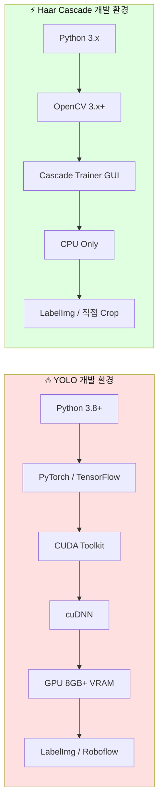

### 모델 생성 프로세스 비교

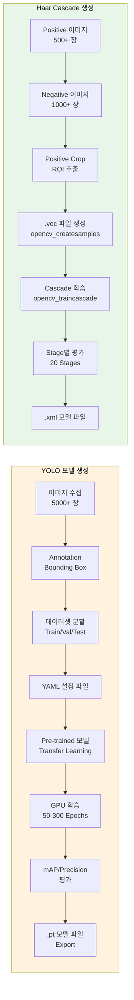

### 라즈베리파이 성능 비교

| 지표 | **YOLO (라즈베리파이 4)** | **Haar Cascade** |
|------|--------------------------|------------------|
| **평균 FPS** | 0.5-3 FPS (YOLOv8n) | 15-25 FPS |
| **CPU 사용률** | 90-100% | 40-70% |
| **메모리 사용** | 1-2 GB | 200-500 MB |
| **추론 지연** | 300-2000ms | 40-100ms |
| **실시간 제어** | ❌ 불가능 | ✅ 가능 |
| **권장 용도** | 오프라인 분석 | 실시간 자율주행 |

### 난이도 및 적용 시나리오

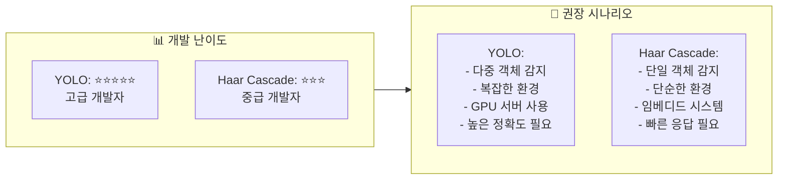

### 결론: Raspbot 프로젝트에 Haar Cascade를 선택한 이유

| 이유 | 설명 |
|------|------|
| **💰 비용 효율성** | GPU 없이 라즈베리파이 CPU만으로 동작 |
| **⚡ 실시간 성능** | 15-25 FPS로 자율주행 실시간 제어 가능 |
| **🎯 특화된 감지** | 신호등, 정지 표지판 등 특정 객체에 최적화 |
| **📚 학습 용이성** | 적은 데이터로 빠른 학습 및 테스트 가능 |
| **🔋 저전력** | 배터리 기반 로봇에 적합한 낮은 전력 소모 |

---

## 🏗️ Haar Cascade 제작 프로세스

### 전체 워크플로우

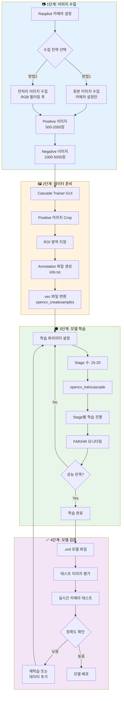

### 1단계: 이미지 수집 상세

#### Positive 이미지 (긍정 샘플)
- **정의**: 감지하려는 객체가 포함된 이미지
- **권장 수량**: 500-2000장 (최소 500장)
- **촬영 조건**:
  - 다양한 각도 (정면, 측면, 상하 각도)
  - 다양한 거리 (근거리, 중거리, 원거리)
  - 다양한 조명 (밝음, 어두움, 역광)
  - 다양한 배경
  - 객체 크기 변화

#### Negative 이미지 (부정 샘플)
- **정의**: 감지 객체가 없는 배경 이미지
- **권장 수량**: 1000-5000장 (Positive의 2-3배)
- **촬영 조건**:
  - 실제 주행 환경과 유사한 배경
  - 다양한 도로, 건물, 사물
  - 유사한 색상/형태는 포함 (오탐 방지 학습)

### 2단계: Cascade Trainer GUI 사용법

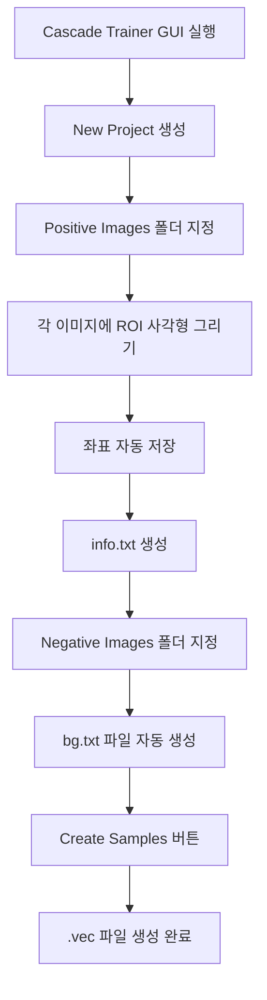

**주요 설정값**:
```
Width: 24 (감지할 객체의 표준 너비)
Height: 24 (감지할 객체의 표준 높이)
Number of samples: Positive 이미지 수 × 10
```

### 3단계: 학습 파라미터 설정

```bash
# opencv_traincascade 명령어 예시
opencv_traincascade \
  -data cascade_output/              # 출력 폴더
  -vec positive.vec \                # .vec 파일
  -bg bg.txt \                       # Negative 이미지 리스트
  -numPos 800 \                      # Positive 샘플 수 (실제의 80%)
  -numNeg 1500 \                     # Negative 샘플 수
  -numStages 20 \                    # 학습 Stage 수
  -w 24 -h 24 \                      # 샘플 크기
  -minHitRate 0.995 \                # 최소 적중률 (99.5%)
  -maxFalseAlarmRate 0.5 \           # 최대 오탐률 (50%)
  -mode ALL                          # 모든 Haar 특징 사용
```

**파라미터 설명**:

| 파라미터 | 값 | 설명 |
|----------|-----|------|
| `numStages` | 15-20 | 학습 단계 수 (많을수록 정확하지만 느림) |
| `minHitRate` | 0.995 | 각 Stage에서 최소 탐지율 (높을수록 정확) |
| `maxFalseAlarmRate` | 0.5 | 각 Stage에서 최대 오탐율 (낮을수록 정확) |
| `w, h` | 24x24 | 학습 샘플 크기 (작을수록 빠름) |
| `mode` | ALL | Haar 특징 타입 (BASIC/CORE/ALL) |

### 4단계: 학습 진행 모니터링

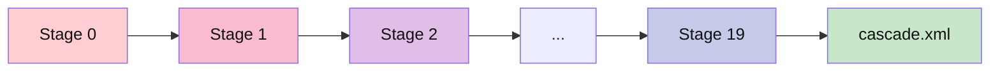

**각 Stage 출력 예시**:
```
===== TRAINING 0-stage =====
POS count : consumed 800 : 800
NEG count : acceptanceRatio 1500 : 1
Hit Rate: 0.9975
False Alarm Rate: 0.45
```

**좋은 학습 지표**:
- ✅ Hit Rate > 0.995
- ✅ False Alarm Rate < 0.5
- ✅ 모든 Stage 완료
- ⚠️ Stage가 중간에 멈추면 데이터 부족 또는 파라미터 조정 필요

---

## 🚦 신호등 빨간불 인식 전략

### 신호등 인식의 핵심 과제

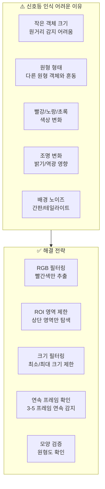

### 신호등 빨간불 인식 알고리즘

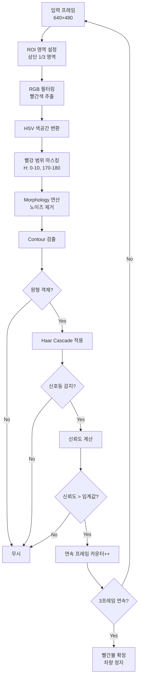

### 빨간불 인식 핵심 코드 예시

```python
def detect_red_traffic_light(frame, cascade):
    """
    신호등 빨간불을 감지하는 함수
    
    Args:
        frame: 입력 이미지 (BGR)
        cascade: Haar Cascade 분류기
    
    Returns:
        is_red_light: 빨간불 감지 여부 (bool)
        detection_boxes: 감지된 영역 리스트 [(x, y, w, h), ...]
    """
    height, width = frame.shape[:2]
    
    # 1단계: ROI 영역 설정 (상단 1/3만 검사)
    roi_frame = frame[0:height//3, :]
    
    # 2단계: HSV 색공간 변환
    hsv_frame = cv2.cvtColor(roi_frame, cv2.COLOR_BGR2HSV)
    
    # 3단계: 빨간색 범위 마스킹
    # 빨강은 HSV에서 0-10, 170-180 두 구간에 존재
    lower_red1 = np.array([0, 100, 100])
    upper_red1 = np.array([10, 255, 255])
    lower_red2 = np.array([170, 100, 100])
    upper_red2 = np.array([180, 255, 255])
    
    mask1 = cv2.inRange(hsv_frame, lower_red1, upper_red1)
    mask2 = cv2.inRange(hsv_frame, lower_red2, upper_red2)
    red_mask = cv2.bitwise_or(mask1, mask2)
    
    # 4단계: Morphology 연산으로 노이즈 제거
    kernel = cv2.getStructuringElement(cv2.MORPH_ELLIPSE, (5, 5))
    red_mask = cv2.morphologyEx(red_mask, cv2.MORPH_OPEN, kernel)
    red_mask = cv2.morphologyEx(red_mask, cv2.MORPH_CLOSE, kernel)
    
    # 5단계: 빨간색 영역만 추출
    red_filtered = cv2.bitwise_and(roi_frame, roi_frame, mask=red_mask)
    
    # 6단계: 그레이스케일 변환
    gray_filtered = cv2.cvtColor(red_filtered, cv2.COLOR_BGR2GRAY)
    
    # 7단계: Haar Cascade로 신호등 감지
    traffic_lights = cascade.detectMultiScale(
        gray_filtered,
        scaleFactor=1.05,      # 작은 객체 감지를 위해 1.05로 설정
        minNeighbors=3,        # 오탐을 줄이기 위해 3으로 설정
        minSize=(15, 15),      # 최소 크기
        maxSize=(80, 80)       # 최대 크기
    )
    
    # 8단계: 원형도 검증 (선택 사항)
    valid_detections = []
    for (x, y, w, h) in traffic_lights:
        # 종횡비 확인 (원형은 1에 가까움)
        aspect_ratio = w / float(h)
        if 0.7 <= aspect_ratio <= 1.3:
            valid_detections.append((x, y, w, h))
    
    is_red_light = len(valid_detections) > 0
    return is_red_light, valid_detections


# 메인 루프에서 사용 예시
consecutive_red_count = 0  # 연속 감지 카운터
RED_THRESHOLD = 3           # 3프레임 연속 감지 시 확정

while True:
    ret, frame = cap.read()
    
    is_red, detections = detect_red_traffic_light(frame, red_light_cascade)
    
    if is_red:
        consecutive_red_count += 1
        if consecutive_red_count >= RED_THRESHOLD:
            # 빨간불 확정: 차량 정지
            car.Ctrl_Motor(1, 0)  # 전진 정지
            car.Ctrl_Motor(2, 0)
            print("🔴 빨간불 감지! 차량 정지")
    else:
        consecutive_red_count = 0
        # 초록불: 주행 계속
```

### 신호등 학습 데이터 수집 전략

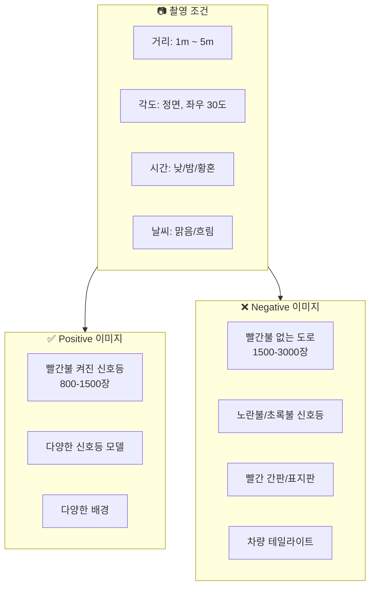

---

## 📸 이미지 수집 전략

### 방법1: 카메라 설정값만 사용 (원본 수집)

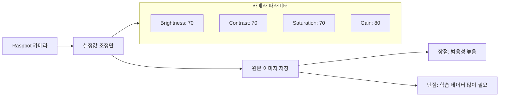

**장점** ✅:
- 다양한 환경에서 범용적으로 사용 가능
- 모델이 원본 이미지를 학습하여 강건함
- 다른 프로젝트에도 재사용 가능
- 과적합(Overfitting) 위험 낮음

**단점** ⚠️:
- 학습 시간이 오래 걸림
- 더 많은 학습 데이터 필요 (1000+ 장)
- 배경 노이즈에 민감할 수 있음
- 특정 색상 객체 감지에 불리

**권장 사용 상황**:
- 일반적인 객체 감지 (얼굴, 사람, 차량 등)
- 색상이 중요하지 않은 경우
- 다양한 환경에서 사용할 경우

**실행 코드**:
```python
# 0_camera_color_rect.py를 사용하여 이미지 수집
python 0_camera_color_rect.py

# SPACE 키를 눌러 이미지 저장
# 저장 경로: ./positive/rect/
```

---

### 방법2: RGB 필터링 후 수집 (전처리 수집)

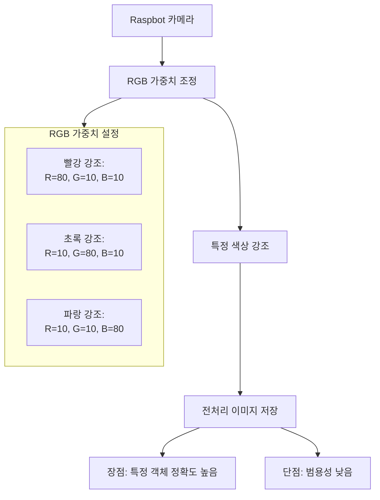

**장점** ✅:
- 특정 색상 객체 감지 정확도 향상 (신호등, 표지판)
- 적은 학습 데이터로도 좋은 성능 (500+ 장)
- 배경 노이즈 감소
- 학습 시간 단축
- 실시간 감지 속도 향상

**단점** ⚠️:
- 범용성이 낮음 (특정 색상에만 특화)
- 조명 변화에 민감할 수 있음
- 다른 프로젝트 재사용 어려움
- 과적합 위험 있음

**권장 사용 상황**:
- 색상이 중요한 객체 (신호등 빨간불, 정지 표지판)
- 제한된 환경에서 사용 (실내, 특정 코스)
- 빠른 프로토타입 제작
- 라즈베리파이 같은 저사양 하드웨어

**실행 코드**:
```python
# 1_camera_weight.py를 사용하여 이미지 수집
python 1_camera_weight.py

# 빨간불 신호등 감지용 RGB 가중치 설정
# R_weight: 80 (빨강 강조)
# G_weight: 10 (초록 억제)
# B_weight: 10 (파랑 억제)

# SPACE 키를 눌러 전처리된 이미지 저장
# 저장 경로: ./rectagle/rect/
```

---

### 두 방법 비교 및 추천

| 비교 항목 | **방법1: 원본 수집** | **방법2: RGB 필터링 수집** |
|-----------|---------------------|---------------------------|
| **학습 데이터 수** | 1000-2000장 | 500-1000장 |
| **학습 시간** | 2-4시간 | 1-2시간 |
| **감지 정확도** | 중간 (80-85%) | 높음 (90-95%, 특정 색상) |
| **범용성** | 높음 | 낮음 |
| **FPS 성능** | 15-20 FPS | 20-25 FPS |
| **난이도** | 쉬움 | 중간 (RGB 조정 필요) |

### 🎯 프로젝트별 추천

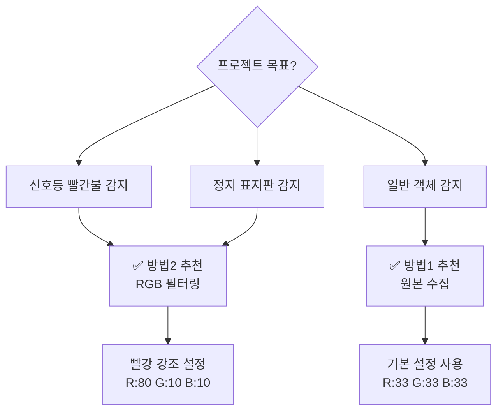

### 하이브리드 전략 (권장) 🌟

**최상의 결과를 위한 조합**:

1. **1차 수집**: 원본 이미지로 기본 모델 학습
2. **2차 수집**: RGB 필터링 이미지로 Fine-tuning
3. **실시간 적용**: 전처리 + Cascade 동시 사용

```python
# 하이브리드 감지 예시
def hybrid_detection(frame, cascade):
    """원본과 RGB 필터링을 모두 활용한 감지"""
    
    # 방법1: 원본 이미지로 1차 감지
    gray_original = cv2.cvtColor(frame, cv2.COLOR_BGR2GRAY)
    objects_original = cascade.detectMultiScale(gray_original, ...)
    
    # 방법2: RGB 필터링 이미지로 2차 감지
    red_filtered = apply_red_filter(frame)  # 빨강 강조
    gray_filtered = cv2.cvtColor(red_filtered, cv2.COLOR_BGR2GRAY)
    objects_filtered = cascade.detectMultiScale(gray_filtered, ...)
    
    # 두 결과 병합 (중복 제거)
    final_objects = merge_detections(objects_original, objects_filtered)
    
    return final_objects
```

---

## 📁 파일 구조 및 단계별 설명

### 📷 0단계: `0_camera_color_rect.py`

**목적**: 카메라 및 서보모터 기본 설정 테스트

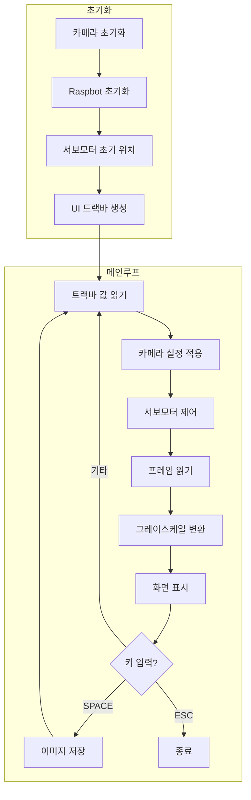

**핵심 기능**:
- 카메라 해상도: 320×240
- OpenCV 기본 그레이스케일 변환 (`cv2.COLOR_BGR2GRAY`)
- 트랙바: 서보 각도(2개), 카메라 설정(4개)

**소스 코드 - 그레이스케일 변환**:
```python
# 기본 OpenCV 그레이스케일 변환
gray = cv2.cvtColor(frame, cv2.COLOR_BGR2GRAY)
```

---

### ⚖️ 1단계: `1_camera_weight.py`

**목적**: RGB 가중치 기반 커스텀 그레이스케일 변환

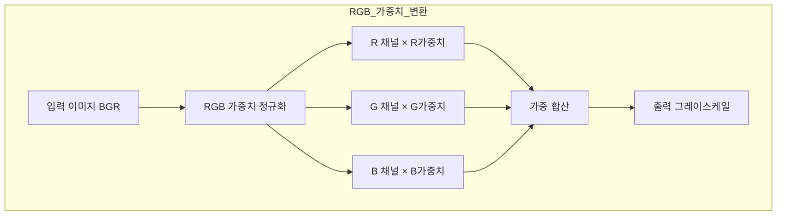

**핵심 기능**:
- RGB 채널별 가중치 조절 (0-100)
- 커스텀 그레이스케일 생성
- 특정 색상 강조/억제 가능

**소스 코드 - 가중치 그레이스케일 변환**:
```python
def weighted_grayscale_conversion(image, r_weight, g_weight, b_weight):
    """
    RGB 가중치를 사용하여 그레이스케일 이미지로 변환합니다.
    """
    sum_weight = r_weight + g_weight + b_weight
    
    # 가중치 합이 0이면 기본값 사용
    if sum_weight == 0:
        return cv2.cvtColor(image, cv2.COLOR_BGR2GRAY)
    
    # 가중치를 0-1 범위로 정규화
    r_norm = r_weight / sum_weight
    g_norm = g_weight / sum_weight
    b_norm = b_weight / sum_weight
    
    # BGR 순서로 가중치 적용 (OpenCV는 BGR 사용)
    weighted_rg = cv2.addWeighted(image[:, :, 2], r_norm, image[:, :, 1], g_norm, 0)
    weighted_result = cv2.addWeighted(weighted_rg, 1.0, image[:, :, 0], b_norm, 0)
    
    return weighted_result
```

---

### 🎯 2단계: `2_object_camera_haarcascade.py`

**목적**: Haar Cascade 기반 실시간 객체 감지

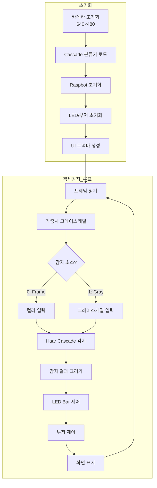

**핵심 기능**:
- 고해상도 카메라: 640×480
- Haar Cascade 객체 감지
- LED Bar 알림 (감지 수에 따라)
- 부저 알림 (삐익삐익)
- 감지 소스 선택 (컬러/그레이스케일)

**소스 코드 - 객체 감지**:
```python
def detect_objects(cascade, gray_image):
    """
    Haar Cascade를 사용하여 객체를 감지합니다.
    """
    # detectMultiScale는 (x, y, w, h) 튜플의 numpy 배열(np.ndarray)을 반환합니다.
    # 각 튜플은 감지된 객체의 좌상단 좌표(x, y)와 너비(w), 높이(h)를 의미합니다.
    objects = cascade.detectMultiScale(
        gray_image,
        scaleFactor=SCALE_FACTOR,      # 1.1
        minNeighbors=MIN_NEIGHBORS,    # 5
        minSize=MIN_SIZE,              # (30, 30)
    )
    # 예시: 2개 감지 시, 결과는 np.array([[100, 50, 30, 30], [200, 80, 40, 40]])
    # 즉, objects[0]: x=100, y=50, w=30, h=30 / objects[1]: x=200, y=80, w=40, h=40

    # 일반적으로 아래처럼 각 객체 박스를 그리거나, 후처리/출력에 활용합니다:
    for (x, y, w, h) in objects:
        cv2.rectangle(frame, (x, y), (x + w, y + h), (0, 255, 0), 2)   # 화면에 사각형 표시
        # 필요에 따라 여기서 감지된 영역만 crop하거나, ROI 추가 분석도 가능

    # "감지 소스"는 gray_image(그레이스케일), 또는 입력이미지(frame)을 선택적으로 적용  
    # 예시: detectMultiScale의 첫 번째 인자만 변경
    # objects = cascade.detectMultiScale(frame, ...)   # 컬러 입력 사용 (보통은 gray가 성능 우수)
    return objects
```

---

## 📊 기능 비교표

### 전체 기능 비교

| 기능 | 0단계 | 1단계 | 2단계 |
|------|:-----:|:-----:|:-----:|
| **카메라 해상도** | 320×240 | 320×240 | 640×480 |
| **서보모터 제어** | ✅ | ✅ | ✅ |
| **카메라 설정 조절** | ✅ | ✅ | ✅ |
| **기본 그레이스케일** | ✅ | ❌ | ❌ |
| **가중치 그레이스케일** | ❌ | ✅ | ✅ |
| **RGB 가중치 트랙바** | ❌ | ✅ | ✅ |
| **객체 감지** | ❌ | ❌ | ✅ |
| **LED Bar 알림** | ❌ | ❌ | ✅ |
| **부저 알림** | ❌ | ❌ | ✅ |
| **감지 소스 선택** | ❌ | ❌ | ✅ |
| **이미지 저장** | ✅ | ✅ | ✅ |

### 트랙바 비교

| 트랙바 | 0단계 | 1단계 | 2단계 | 범위 |
|--------|:-----:|:-----:|:-----:|------|
| Servo 1 Angle | ✅ | ✅ | ✅ | 0-180 |
| Servo 2 Angle | ✅ | ✅ | ✅ | 0-180 |
| Brightness | ✅ | ✅ | ✅ | 0-100 |
| Contrast | ✅ | ✅ | ✅ | 0-100 |
| Saturation | ✅ | ✅ | ✅ | 0-100 |
| Gain | ✅ | ✅ | ✅ | 0-100 |
| R_weight | ❌ | ✅ | ✅ | 0-100 |
| G_weight | ❌ | ✅ | ✅ | 0-100 |
| B_weight | ❌ | ✅ | ✅ | 0-100 |
| Detect_Source | ❌ | ❌ | ✅ | 0-1 |

### 코드 복잡도 비교

| 항목 | 0단계 | 1단계 | 2단계 |
|------|-------|-------|-------|
| **총 코드 라인** | ~395줄 | ~474줄 | ~780줄 |
| **함수 개수** | 10개 | 11개 | 16개 |
| **상수 정의** | 10개 | 13개 | 20개 |

---

## 🏗️ 시스템 아키텍처

### 전체 시스템 구조

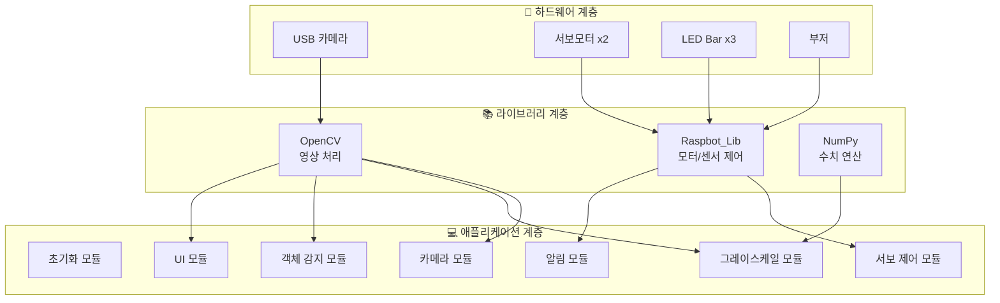

### 모듈별 함수 구조

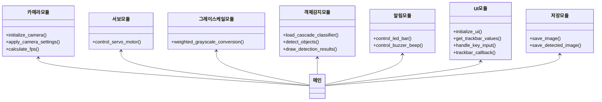

---

## 📈 단계별 순서도

### 0단계: 기본 카메라 프로그램

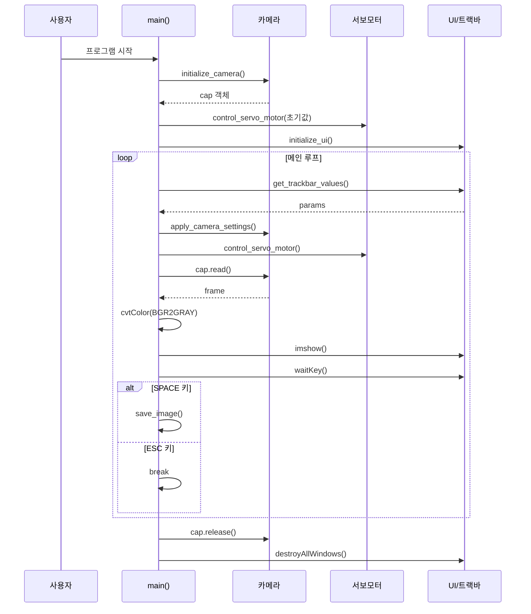

### 2단계: 객체 감지 프로그램

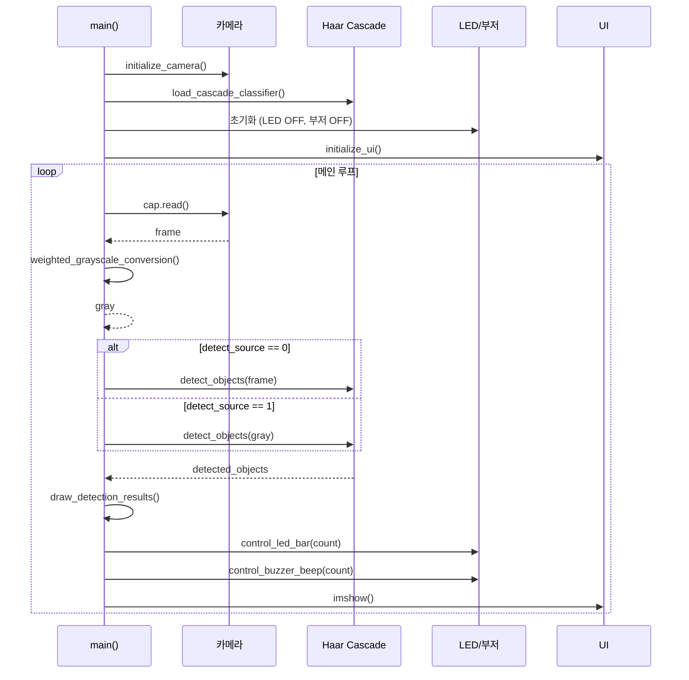

---

## 🔬 핵심 알고리즘

### 1. RGB 가중치 그레이스케일 변환

**일반 그레이스케일 공식**:
```
Gray = 0.299 × R + 0.587 × G + 0.114 × B
```

**가중치 그레이스케일 공식**:
```
Gray = (R_weight × R + G_weight × G + B_weight × B) / (R_weight + G_weight + B_weight)
```

```mermaid
flowchart LR
    subgraph 입력
        R[R 채널]
        G[G 채널]
        B[B 채널]
    end
    
    subgraph 가중치
        RW[R_weight]
        GW[G_weight]
        BW[B_weight]
    end
    
    subgraph 처리
        NR[R × R_norm]
        NG[G × G_norm]
        NB[B × B_norm]
        SUM[합산]
    end
    
    R --> NR
    G --> NG
    B --> NB
    RW --> NR
    GW --> NG
    BW --> NB
    NR --> SUM
    NG --> SUM
    NB --> SUM
    SUM --> OUT[Gray 출력]
```

### 2. Haar Cascade 객체 감지 알고리즘

```mermaid
flowchart TB
    A[입력 이미지] --> B[이미지 피라미드 생성]
    B --> C[슬라이딩 윈도우]
    C --> D[Haar 특징 계산]
    D --> E[Cascade 분류기]
    E --> F{객체?}
    F -->|Yes| G[후보 영역 저장]
    F -->|No| H[다음 윈도우]
    G --> I[비최대 억제<br/>NMS]
    H --> C
    I --> J[최종 검출 결과]
```

**파라미터 설명**:

| 파라미터 | 값 | 설명 |
|----------|-----|------|
| `scaleFactor` | 1.1 | 이미지 피라미드 축소 비율 |
| `minNeighbors` | 5 | 최소 인접 검출 수 (높을수록 정확) |
| `minSize` | (30, 30) | 최소 검출 크기 |

### 3. LED Bar 제어 알고리즘

```mermaid
flowchart TD
    A[감지된 객체 수] --> B{count == 0?}
    B -->|Yes| C[LED 모두 OFF]
    B -->|No| D{count == 1?}
    D -->|Yes| E[LED1 ON<br/>LED2,3 OFF]
    D -->|No| F{count == 2?}
    F -->|Yes| G[LED1,2 ON<br/>LED3 OFF]
    F -->|No| H[LED 모두 ON]
```

### 4. 부저 삐익삐익 알고리즘

```mermaid
flowchart TD
    A[프레임 카운터] --> B[beep_cycle = frame_counter // 15 % 2]
    B --> C{객체 감지?}
    C -->|No| D[부저 OFF]
    C -->|Yes| E{beep_cycle?}
    E -->|0| F[부저 ON]
    E -->|1| G[부저 OFF]
```

**소스 코드**:
```python
def control_buzzer_beep(car, detected_count, frame_counter):
    if detected_count > 0:
        # 15프레임마다 부저 토글 (삐익삐익 효과)
        beep_cycle = (frame_counter // 15) % 2
        if beep_cycle == 0:
            car.Ctrl_Buzzer(1)
        else:
            car.Ctrl_Buzzer(0)
    else:
        car.Ctrl_Buzzer(0)
```

---

## 🚀 사용법

### 실행 순서

```bash
# 1단계: 기본 카메라 테스트
python 0_camera_color_rect.py

# 2단계: 가중치 그레이스케일 테스트
python 1_camera_weight.py

# 3단계: 객체 감지 실행
python 2_object_camera_haarcascade.py
```

### 키보드 조작

| 키 | 기능 |
|----|------|
| `ESC` | 프로그램 종료 |
| `SPACE` | 현재 프레임 저장 |

### 트랙바 조작 가이드

```mermaid
flowchart LR
    subgraph 서보모터
        S1[Servo 1<br/>좌우 회전]
        S2[Servo 2<br/>상하 회전]
    end
    
    subgraph 카메라설정
        BR[Brightness<br/>밝기]
        CT[Contrast<br/>대비]
        SA[Saturation<br/>채도]
        GA[Gain<br/>게인]
    end
    
    subgraph 그레이스케일
        RW[R_weight<br/>빨강 강조]
        GW[G_weight<br/>초록 강조]
        BW[B_weight<br/>파랑 강조]
    end
    
    subgraph 감지소스
        DS[Detect_Source<br/>0:컬러 1:그레이]
    end
```

### 저장 경로

| 프로그램 | 저장 경로 |
|----------|-----------|
| 0단계 | `./positive/rect/` |
| 1단계 | `./rectagle/rect/` |
| 2단계 | `./save_images/detected_objects/` |

---

## 🔧 트러블슈팅

### 자주 발생하는 오류

| 오류 메시지 | 원인 | 해결 방법 |
|-------------|------|-----------|
| `Cannot open camera` | 카메라 연결 안됨 | USB 연결 확인, 다른 프로그램 종료 |
| `Cascade file not found` | XML 파일 없음 | `cascade.xml` 파일 경로 확인 |
| `Raspbot initialization failed` | 하드웨어 연결 안됨 | GPIO 연결 확인, 권한 확인 |

### 성능 최적화 팁

```mermaid
flowchart TB
    A[성능 문제] --> B{FPS 낮음?}
    B -->|Yes| C[해상도 낮추기]
    B -->|Yes| D[scaleFactor 높이기]
    B -->|Yes| E[minSize 크게]
    
    A --> F{오탐지 많음?}
    F -->|Yes| G[minNeighbors 높이기]
    F -->|Yes| H[Cascade 재학습]
    
    A --> I{미탐지 많음?}
    I -->|Yes| J[minNeighbors 낮추기]
    I -->|Yes| K[minSize 작게]
    I -->|Yes| L[RGB 가중치 조절]
```

---

## 📚 참고 자료

### OpenCV 함수 참조

| 함수 | 설명 |
|------|------|
| `cv2.VideoCapture()` | 카메라 캡처 객체 생성 |
| `cv2.cvtColor()` | 색공간 변환 |
| `cv2.CascadeClassifier()` | Haar Cascade 분류기 |
| `detectMultiScale()` | 다중 스케일 객체 감지 |
| `cv2.addWeighted()` | 이미지 가중 합성 |
| `cv2.createTrackbar()` | 트랙바 생성 |

### 상수 기본값 정리

| 상수명 | 0단계 | 1단계 | 2단계 |
|--------|-------|-------|-------|
| CAMERA_WIDTH | 320 | 320 | 640 |
| CAMERA_HEIGHT | 240 | 240 | 480 |
| SERVO_1_INITIAL | 90 | 90 | 90 |
| SERVO_2_INITIAL | 35 | 35 | 35 |
| BRIGHTNESS_INITIAL | 70 | 70 | 70 |
| CONTRAST_INITIAL | 70 | 70 | 70 |
| SATURATION_INITIAL | 70 | 70 | 70 |
| GAIN_INITIAL | 80 | 80 | 80 |
| R_WEIGHT_INITIAL | - | 33 | 33 |
| G_WEIGHT_INITIAL | - | 33 | 33 |
| B_WEIGHT_INITIAL | - | 33 | 33 |

---

## 🎓 학습 로드맵

```mermaid
flowchart TD
    subgraph 기초단계["🟢 기초 단계"]
        A[0_camera_color_rect.py<br/>카메라 기본]
    end
    
    subgraph 중급단계["🟡 중급 단계"]
        B[1_camera_weight.py<br/>가중치 변환]
    end
    
    subgraph 고급단계["🔴 고급 단계"]
        C[2_object_camera_haarcascade.py<br/>객체 감지]
    end
    
    subgraph 응용단계["🟣 응용 단계"]
        D[자율주행 통합]
        E[딥러닝 적용]
    end
    
    A -->|"그레이스케일 이해"| B
    B -->|"영상 전처리 이해"| C
    C -->|"감지 알고리즘 이해"| D
    C -->|"AI 확장"| E
```

---

> 📝 **문서 버전**: v1.0  
> 📅 **최종 수정**: 2025-12-08  
> 👤 **작성**: Raspbot 개발팀

