# 🎥 Cascade 카메라 프로그램 가이드

> Raspbot 자율주행 자동차의 카메라 기반 객체 감지 시스템  
> 단계별 학습 및 기능 비교 문서

---

## 📑 목차

1. [개요](#-개요)
2. [파일 구조 및 단계별 설명](#-파일-구조-및-단계별-설명)
3. [기능 비교표](#-기능-비교표)
4. [시스템 아키텍처](#-시스템-아키텍처)
5. [단계별 순서도](#-단계별-순서도)
6. [핵심 알고리즘](#-핵심-알고리즘)
7. [사용법](#-사용법)
8. [트러블슈팅](#-트러블슈팅)

---

## 📋 개요

이 프로젝트는 **3단계 학습 구조**로 설계되어 있습니다:

| 단계 | 파일명 | 학습 목표 |
|:---:|--------|----------|
| **0단계** | `0_camera_color_rect.py` | 카메라 기본 설정 및 그레이스케일 변환 |
| **1단계** | `1_camera_weight.py` | RGB 가중치 기반 커스텀 그레이스케일 |
| **2단계** | `2_object_camera_haarcascade.py` | Haar Cascade 객체 감지 |

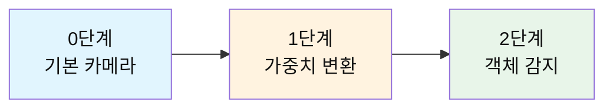

---

## 📁 파일 구조 및 단계별 설명

### 📷 0단계: `0_camera_color_rect.py`

**목적**: 카메라 및 서보모터 기본 설정 테스트

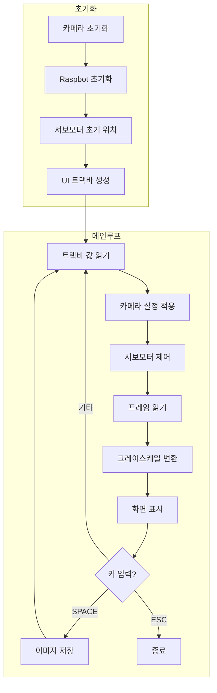

**핵심 기능**:
- 카메라 해상도: 320×240
- OpenCV 기본 그레이스케일 변환 (`cv2.COLOR_BGR2GRAY`)
- 트랙바: 서보 각도(2개), 카메라 설정(4개)

**소스 코드 - 그레이스케일 변환**:
```python
# 기본 OpenCV 그레이스케일 변환
gray = cv2.cvtColor(frame, cv2.COLOR_BGR2GRAY)
```

---

### ⚖️ 1단계: `1_camera_weight.py`

**목적**: RGB 가중치 기반 커스텀 그레이스케일 변환

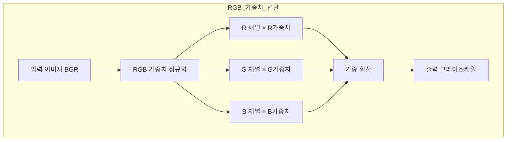

**핵심 기능**:
- RGB 채널별 가중치 조절 (0-100)
- 커스텀 그레이스케일 생성
- 특정 색상 강조/억제 가능

**소스 코드 - 가중치 그레이스케일 변환**:
```python
def weighted_grayscale_conversion(image, r_weight, g_weight, b_weight):
    """
    RGB 가중치를 사용하여 그레이스케일 이미지로 변환합니다.
    """
    sum_weight = r_weight + g_weight + b_weight
    
    # 가중치 합이 0이면 기본값 사용
    if sum_weight == 0:
        return cv2.cvtColor(image, cv2.COLOR_BGR2GRAY)
    
    # 가중치를 0-1 범위로 정규화
    r_norm = r_weight / sum_weight
    g_norm = g_weight / sum_weight
    b_norm = b_weight / sum_weight
    
    # BGR 순서로 가중치 적용 (OpenCV는 BGR 사용)
    weighted_rg = cv2.addWeighted(image[:, :, 2], r_norm, image[:, :, 1], g_norm, 0)
    weighted_result = cv2.addWeighted(weighted_rg, 1.0, image[:, :, 0], b_norm, 0)
    
    return weighted_result
```

---

### 🎯 2단계: `2_object_camera_haarcascade.py`

**목적**: Haar Cascade 기반 실시간 객체 감지

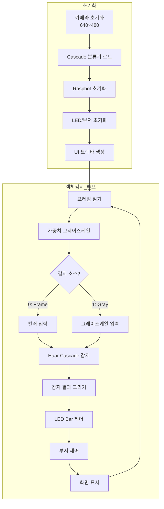

**핵심 기능**:
- 고해상도 카메라: 640×480
- Haar Cascade 객체 감지
- LED Bar 알림 (감지 수에 따라)
- 부저 알림 (삐익삐익)
- 감지 소스 선택 (컬러/그레이스케일)

**소스 코드 - 객체 감지**:
```python
def detect_objects(cascade, gray_image):
    """
    Haar Cascade를 사용하여 객체를 감지합니다.
    """
    # detectMultiScale는 (x, y, w, h) 튜플의 numpy 배열(np.ndarray)을 반환합니다.
    # 각 튜플은 감지된 객체의 좌상단 좌표(x, y)와 너비(w), 높이(h)를 의미합니다.
    objects = cascade.detectMultiScale(
        gray_image,
        scaleFactor=SCALE_FACTOR,      # 1.1
        minNeighbors=MIN_NEIGHBORS,    # 5
        minSize=MIN_SIZE,              # (30, 30)
    )
    # 예시: 2개 감지 시, 결과는 np.array([[100, 50, 30, 30], [200, 80, 40, 40]])
    # 즉, objects[0]: x=100, y=50, w=30, h=30 / objects[1]: x=200, y=80, w=40, h=40

    # 일반적으로 아래처럼 각 객체 박스를 그리거나, 후처리/출력에 활용합니다:
    for (x, y, w, h) in objects:
        cv2.rectangle(frame, (x, y), (x + w, y + h), (0, 255, 0), 2)   # 화면에 사각형 표시
        # 필요에 따라 여기서 감지된 영역만 crop하거나, ROI 추가 분석도 가능

    # "감지 소스"는 gray_image(그레이스케일), 또는 입력이미지(frame)을 선택적으로 적용  
    # 예시: detectMultiScale의 첫 번째 인자만 변경
    # objects = cascade.detectMultiScale(frame, ...)   # 컬러 입력 사용 (보통은 gray가 성능 우수)
    return objects
```

---

## 📊 기능 비교표

### 전체 기능 비교

| 기능 | 0단계 | 1단계 | 2단계 |
|------|:-----:|:-----:|:-----:|
| **카메라 해상도** | 320×240 | 320×240 | 640×480 |
| **서보모터 제어** | ✅ | ✅ | ✅ |
| **카메라 설정 조절** | ✅ | ✅ | ✅ |
| **기본 그레이스케일** | ✅ | ❌ | ❌ |
| **가중치 그레이스케일** | ❌ | ✅ | ✅ |
| **RGB 가중치 트랙바** | ❌ | ✅ | ✅ |
| **객체 감지** | ❌ | ❌ | ✅ |
| **LED Bar 알림** | ❌ | ❌ | ✅ |
| **부저 알림** | ❌ | ❌ | ✅ |
| **감지 소스 선택** | ❌ | ❌ | ✅ |
| **이미지 저장** | ✅ | ✅ | ✅ |

### 트랙바 비교

| 트랙바 | 0단계 | 1단계 | 2단계 | 범위 |
|--------|:-----:|:-----:|:-----:|------|
| Servo 1 Angle | ✅ | ✅ | ✅ | 0-180 |
| Servo 2 Angle | ✅ | ✅ | ✅ | 0-180 |
| Brightness | ✅ | ✅ | ✅ | 0-100 |
| Contrast | ✅ | ✅ | ✅ | 0-100 |
| Saturation | ✅ | ✅ | ✅ | 0-100 |
| Gain | ✅ | ✅ | ✅ | 0-100 |
| R_weight | ❌ | ✅ | ✅ | 0-100 |
| G_weight | ❌ | ✅ | ✅ | 0-100 |
| B_weight | ❌ | ✅ | ✅ | 0-100 |
| Detect_Source | ❌ | ❌ | ✅ | 0-1 |

### 코드 복잡도 비교

| 항목 | 0단계 | 1단계 | 2단계 |
|------|-------|-------|-------|
| **총 코드 라인** | ~395줄 | ~474줄 | ~780줄 |
| **함수 개수** | 10개 | 11개 | 16개 |
| **상수 정의** | 10개 | 13개 | 20개 |

---

## 🏗️ 시스템 아키텍처

### 전체 시스템 구조

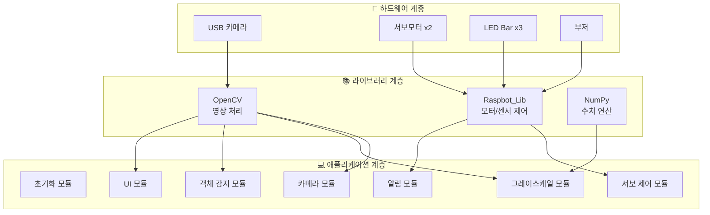

### 모듈별 함수 구조


---

## 📈 단계별 순서도

### 0단계: 기본 카메라 프로그램

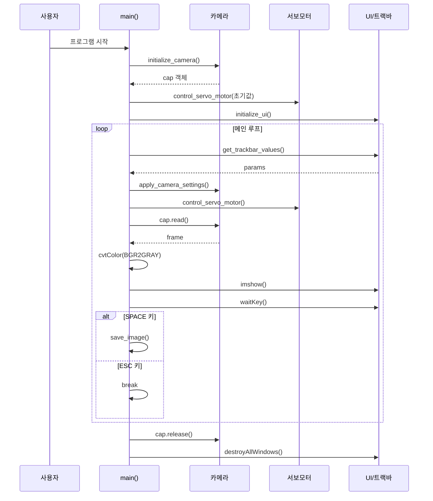

### 2단계: 객체 감지 프로그램

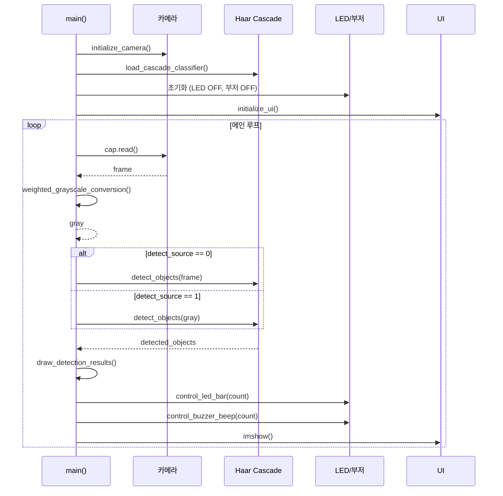

---

## 🔬 핵심 알고리즘

### 1. RGB 가중치 그레이스케일 변환

**일반 그레이스케일 공식**:
```
Gray = 0.299 × R + 0.587 × G + 0.114 × B
```

**가중치 그레이스케일 공식**:
```
Gray = (R_weight × R + G_weight × G + B_weight × B) / (R_weight + G_weight + B_weight)
```

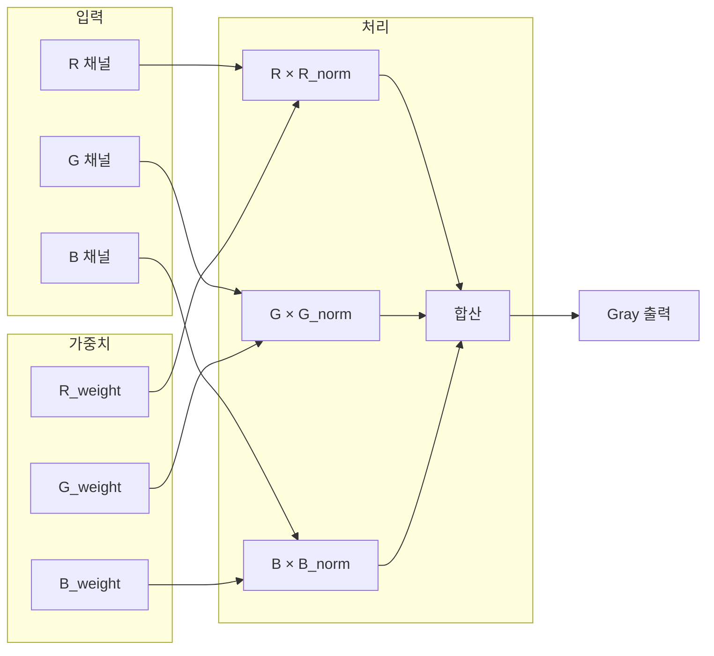

### 2. Haar Cascade 객체 감지 알고리즘

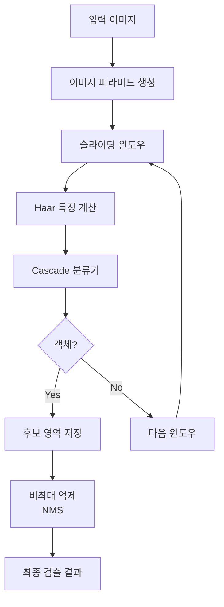

**파라미터 설명**:

| 파라미터 | 값 | 설명 |
|----------|-----|------|
| `scaleFactor` | 1.1 | 이미지 피라미드 축소 비율 |
| `minNeighbors` | 5 | 최소 인접 검출 수 (높을수록 정확) |
| `minSize` | (30, 30) | 최소 검출 크기 |

### 3. LED Bar 제어 알고리즘

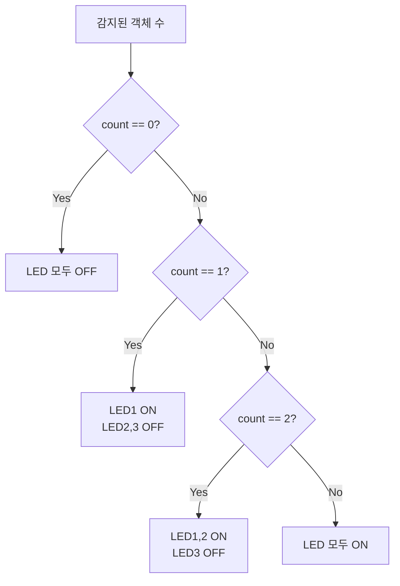

### 4. 부저 삐익삐익 알고리즘

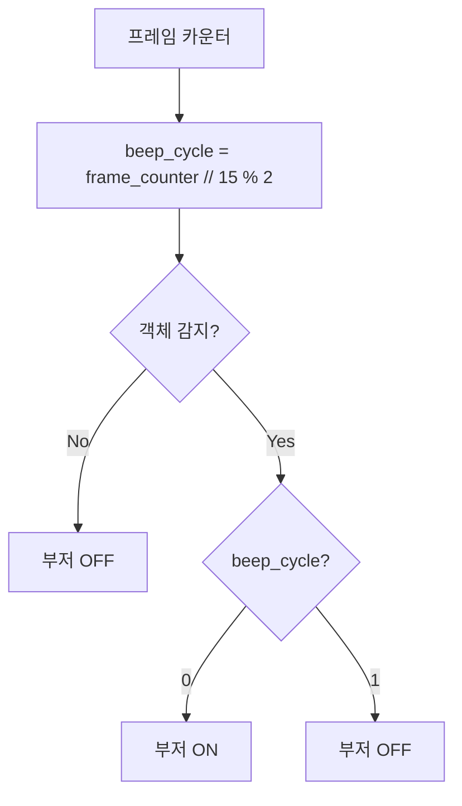

**소스 코드**:
```python
def control_buzzer_beep(car, detected_count, frame_counter):
    if detected_count > 0:
        # 15프레임마다 부저 토글 (삐익삐익 효과)
        beep_cycle = (frame_counter // 15) % 2
        if beep_cycle == 0:
            car.Ctrl_Buzzer(1)
        else:
            car.Ctrl_Buzzer(0)
    else:
        car.Ctrl_Buzzer(0)
```

---

## 🚀 사용법

### 실행 순서

```bash
# 1단계: 기본 카메라 테스트
python 0_camera_color_rect.py

# 2단계: 가중치 그레이스케일 테스트
python 1_camera_weight.py

# 3단계: 객체 감지 실행
python 2_object_camera_haarcascade.py
```

### 키보드 조작

| 키 | 기능 |
|----|------|
| `ESC` | 프로그램 종료 |
| `SPACE` | 현재 프레임 저장 |

### 트랙바 조작 가이드

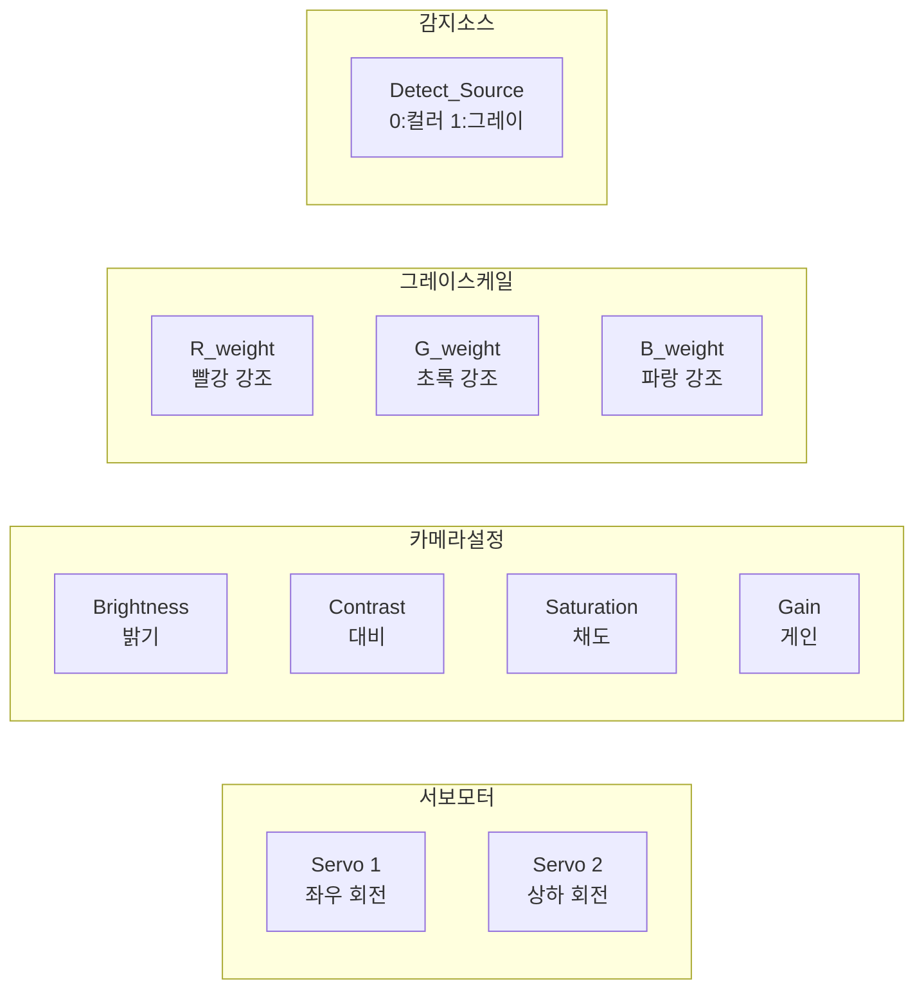

### 저장 경로

| 프로그램 | 저장 경로 |
|----------|-----------|
| 0단계 | `./positive/rect/` |
| 1단계 | `./rectagle/rect/` |
| 2단계 | `./save_images/detected_objects/` |

---

## 🔧 트러블슈팅

### 자주 발생하는 오류

| 오류 메시지 | 원인 | 해결 방법 |
|-------------|------|-----------|
| `Cannot open camera` | 카메라 연결 안됨 | USB 연결 확인, 다른 프로그램 종료 |
| `Cascade file not found` | XML 파일 없음 | `cascade.xml` 파일 경로 확인 |
| `Raspbot initialization failed` | 하드웨어 연결 안됨 | GPIO 연결 확인, 권한 확인 |

### 성능 최적화 팁

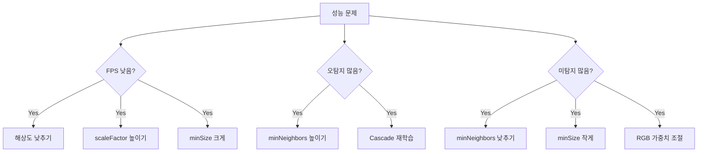

---

## 📚 참고 자료

### OpenCV 함수 참조

| 함수 | 설명 |
|------|------|
| `cv2.VideoCapture()` | 카메라 캡처 객체 생성 |
| `cv2.cvtColor()` | 색공간 변환 |
| `cv2.CascadeClassifier()` | Haar Cascade 분류기 |
| `detectMultiScale()` | 다중 스케일 객체 감지 |
| `cv2.addWeighted()` | 이미지 가중 합성 |
| `cv2.createTrackbar()` | 트랙바 생성 |

### 상수 기본값 정리

| 상수명 | 0단계 | 1단계 | 2단계 |
|--------|-------|-------|-------|
| CAMERA_WIDTH | 320 | 320 | 640 |
| CAMERA_HEIGHT | 240 | 240 | 480 |
| SERVO_1_INITIAL | 90 | 90 | 90 |
| SERVO_2_INITIAL | 35 | 35 | 35 |
| BRIGHTNESS_INITIAL | 70 | 70 | 70 |
| CONTRAST_INITIAL | 70 | 70 | 70 |
| SATURATION_INITIAL | 70 | 70 | 70 |
| GAIN_INITIAL | 80 | 80 | 80 |
| R_WEIGHT_INITIAL | - | 33 | 33 |
| G_WEIGHT_INITIAL | - | 33 | 33 |
| B_WEIGHT_INITIAL | - | 33 | 33 |

---

## 🎓 학습 로드맵

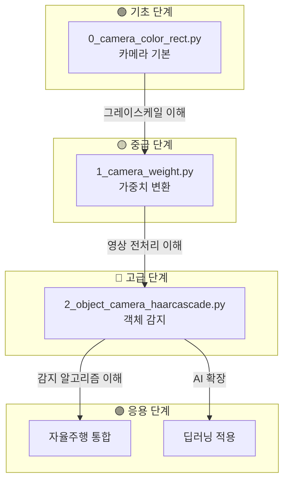

---

> 📝 **문서 버전**: v1.0  
> 📅 **최종 수정**: 2025-12-08  
> 👤 **작성**: Raspbot 개발팀

