# 🚗 Raspbot v2 자율주행 + Haar Cascade 표지판 감지 가이드

> `3_object_autoplot___rgb_filter.py` v1.6 코드 분석 및 사용법  
> RGB 필터링 + Haar Cascade 객체 감지 + 상태 기반 제어  
> **최종 업데이트**: 2025-12-09 (v1.6 - 표지판 지속 감지)

---

## 📑 목차

1. [개요](#-개요)
2. [⭐ v1.6 주요 변경사항](#-v16-주요-변경사항)
3. [시스템 아키텍처](#-시스템-아키텍처)
4. [프로그램 실행 흐름](#-프로그램-실행-흐름)
5. [핵심 알고리즘](#-핵심-알고리즘)
6. [트랙바 설정 가이드](#-트랙바-설정-가이드)
7. [주요 함수 설명](#-주요-함수-설명)
8. [감지 프레임 소스 선택](#-감지-프레임-소스-선택)
9. [반응 모드 상세](#-반응-모드-상세)
10. [소스 코드 핵심 부분](#-소스-코드-핵심-부분)
11. [트러블슈팅](#-트러블슈팅)

---

## 📋 개요

이 프로그램은 **자율주행**과 **표지판 감지**를 결합한 통합 시스템입니다.

### 주요 특징

| 기능 | 설명 | v1.6 개선 |
|------|------|----------|
| **라인 트레이싱** | 빨간색/회색 도로선 기반 자율주행 | - |
| **RGB 필터링** | 빛 반사 제거를 위한 가중치 기반 그레이스케일 | - |
| **Haar Cascade 감지** | Stop/No Drive 표지판 실시간 감지 | ✅ 매 프레임 체크 |
| **⭐ 상태 기반 제어** | 표지판이 사라질 때까지 계속 정지 | ✅ NEW! |
| **⭐ 부저 1회만** | 표지판 처음 감지 시에만 부저 울림 | ✅ NEW! |
| **다중 프레임 소스** | 원본/변환/그레이 중 감지 소스 선택 | - |
| **다양한 반응 모드** | 정지/후진/회피/무시 선택 가능 | - |
| **Early If 패턴** | 표지판 먼저 확인 → 없으면 자율주행 | ✅ 개선 |

---

## ⭐ v1.6 주요 변경사항

**업데이트 날짜**: 2025-12-09  
**변경 사유**: 사용자 피드백 - "Stop sign이 사라질 때까지 정지해야 함, 부저는 1회만"

### 변경 내용 요약

| 항목 | Before (v1.5) | After (v1.6) | 개선 효과 |
|:----:|:------------:|:------------:|:--------:|
| **감지 방식** | 쿨다운 (2.5초) | 상태 기반 (매 프레임) | ✅ 안전성 향상 |
| **모터 정지** | 0.1초만 | 표지판 사라질 때까지 | ✅ 안전 정지 |
| **부저** | 2.5초마다 반복 | 처음 1회만 (0.1초) | ✅ 소음 최소화 |
| **Frame 처리** | 계속 진행 | 계속 진행 | ✅ 유지 |
| **자율주행 복귀** | 즉시 (위험) | 표지판 사라진 후 | ✅ 안전 |

### 핵심 개선 사항

#### 1️⃣ **쿨다운 시스템 제거** ❌
```python
# v1.5 (제거됨)
SIGN_COOLDOWN_TIME = 2.5
last_stop_detection_time = 0

# 문제: 표지판이 아직 있어도 2.5초 후 무시
```

#### 2️⃣ **상태 변수 추가** ✅
```python
# v1.6 (새로 추가)
stop_sign_active = False       # 현재 표지판 감지 중인지
stop_beep_played = False       # 부저 울렸는지
no_drive_sign_active = False
no_drive_beep_played = False
```

#### 3️⃣ **작동 방식 변경**

**Before (v1.5) - 쿨다운**:
```
표지판 감지 → 0.1초 정지 → 부저 → 
2.5초 대기 → 자율주행 (표지판 아직 있음!) → 
2.5초 후 다시 감지 → 부저 반복...
```

**After (v1.6) - 상태 기반**:
```
표지판 감지 (처음) → stop_sign_active = True → 부저 1회 →
표지판 계속 감지 → 모터 정지 유지 (부저 없음) →
표지판 사라짐 → stop_sign_active = False → 
즉시 자율주행 재개
```

### 코드 비교

**Before (v1.5)**:
```python
# 쿨다운 체크
if stop_detected:
    if current_time - last_stop_detection_time < SIGN_COOLDOWN_TIME:
        stop_detected = False  # 무시
```

**After (v1.6)**:
```python
# 상태 기반 체크
if stop_detected:
    if not stop_sign_active:
        # 처음 감지
        stop_sign_active = True
        부저 울림 (1회)
    # 계속 감지 → 모터 정지만
    car_stop()
else:
    if stop_sign_active:
        # 사라짐 → 자율주행 재개
        stop_sign_active = False
```

---

## 🏗️ 시스템 아키텍처

### 전체 구조

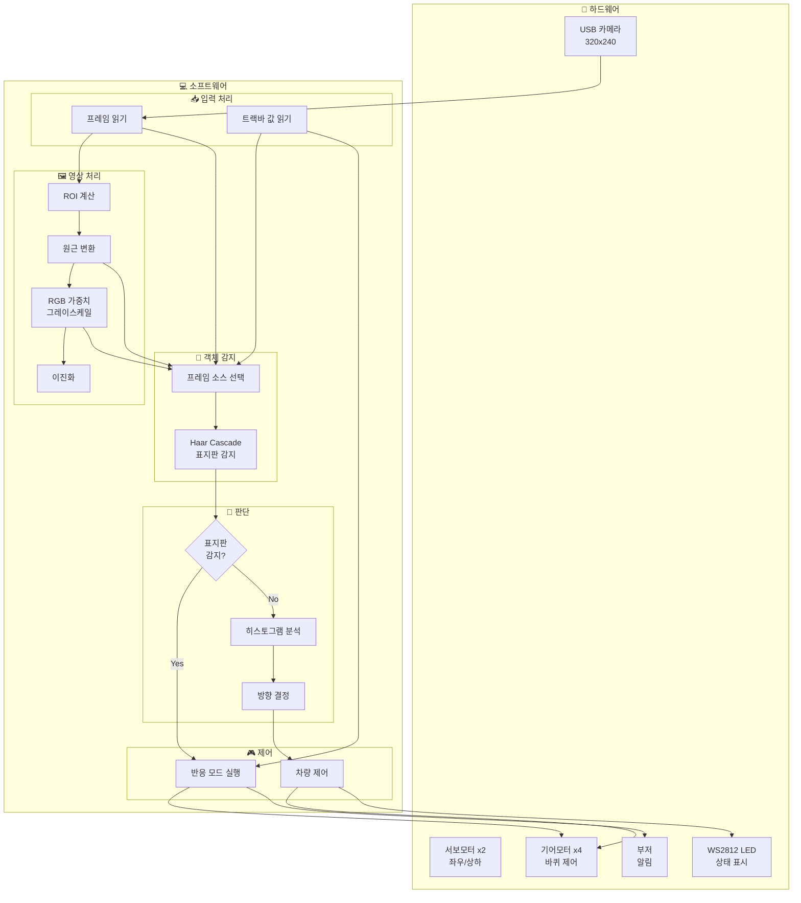

### 모듈 구조

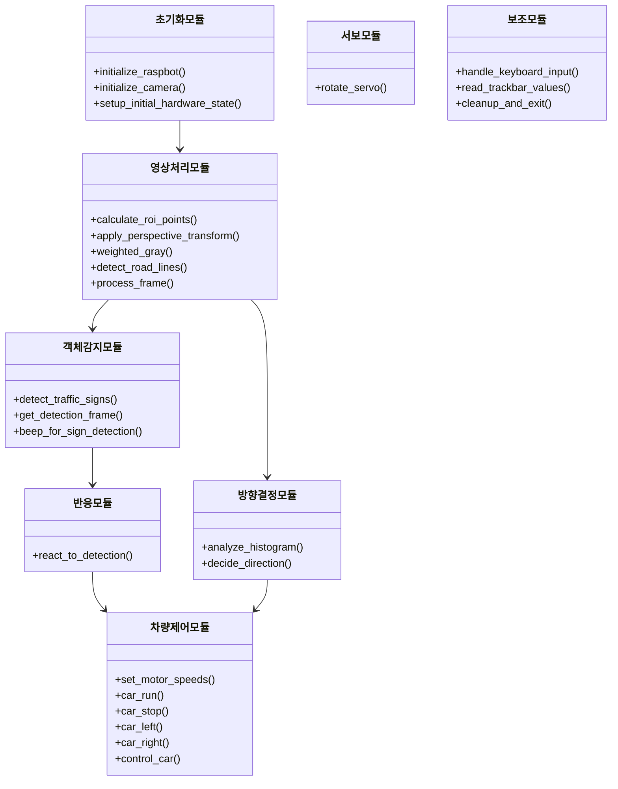

---

## 📊 프로그램 실행 흐름

### 전체 순서도

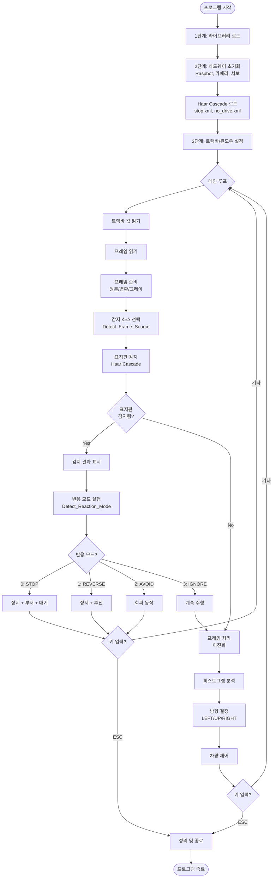

### Early If 패턴 상세 (v1.6 - 상태 기반)

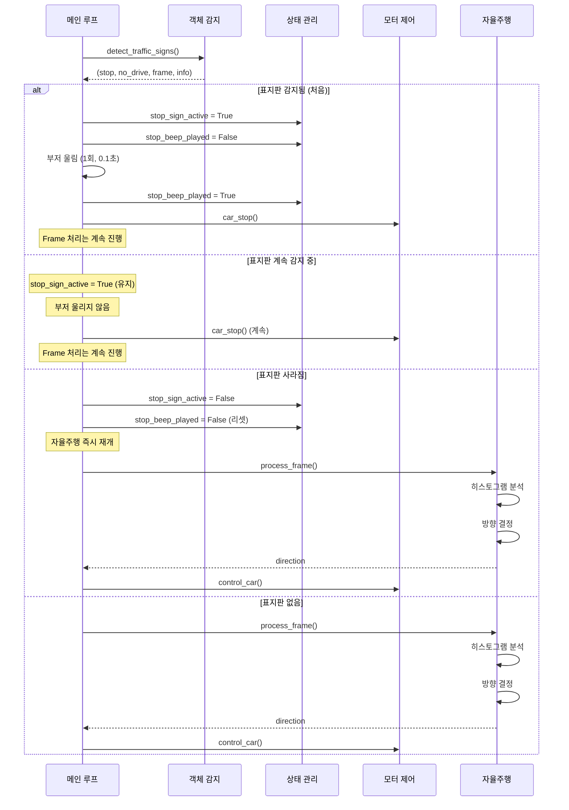

---

## 🔬 핵심 알고리즘

### 1. RGB 가중치 그레이스케일 변환

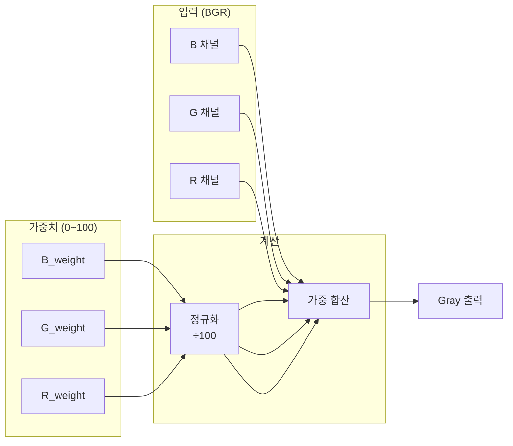

**공식**:
```
Gray = (R × R_weight + G × G_weight + B × B_weight) / 100
```

**권장 설정**:

| 환경 | R | G | B | 효과 |
|------|---|---|---|------|
| 밝은 환경 (빛 반사) | 30 | 40 | 60~80 | B 강조로 반사 감소 |
| 어두운 환경 | 60 | 40 | 30 | R 강조로 명암 증가 |
| 기본값 | 30 | 40 | 60 | 균형 |

### 2. Haar Cascade 객체 감지 알고리즘

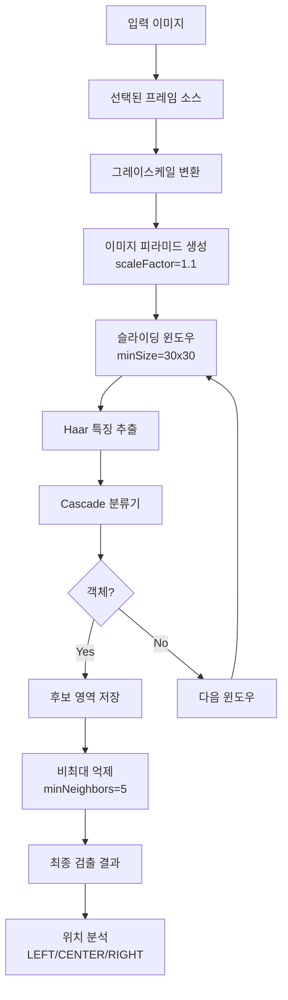

### 3. 히스토그램 3등분 분석

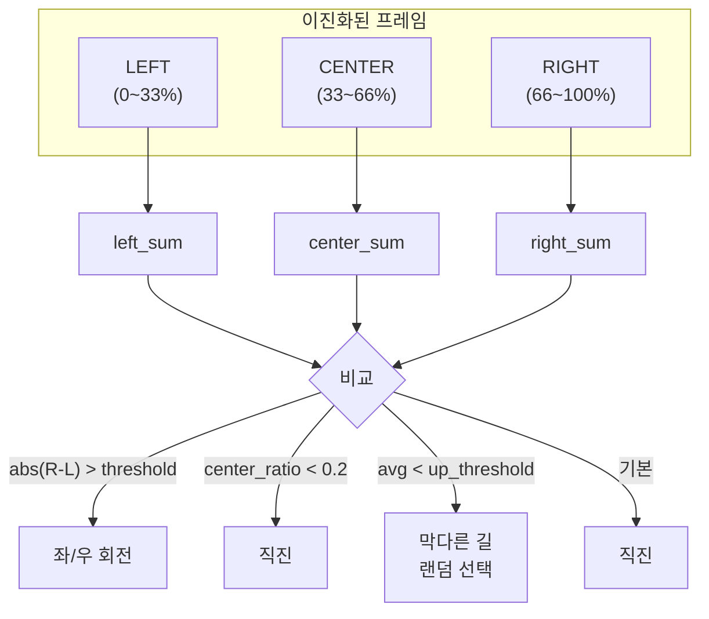

### 4. 상태 기반 제어 알고리즘 (v1.6)

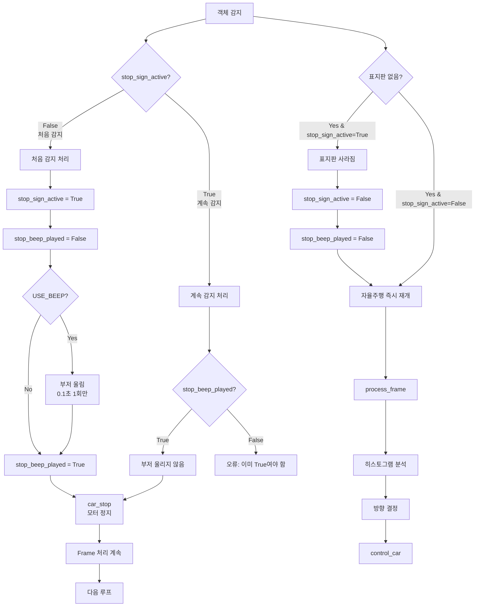

### 5. 반응 모드 (IGNORE 모드)

v1.6에서는 기본적으로 **상태 기반 제어**로 작동하며, `Detect_Reaction_Mode` 트랙바가 **3 (IGNORE)**일 때만 표지판을 무시하고 계속 주행합니다.

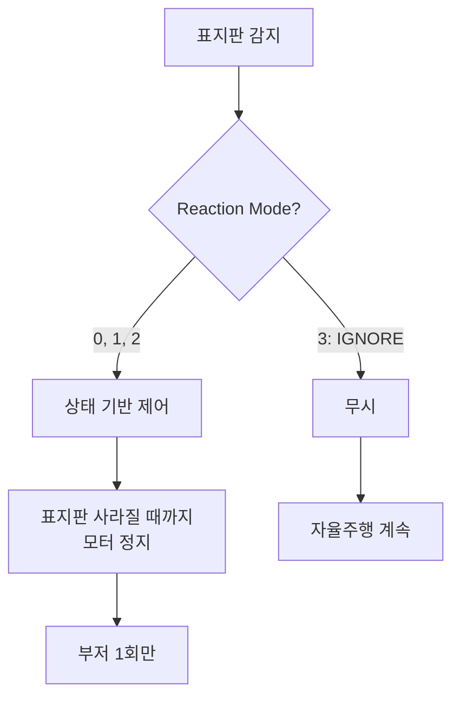

---

## 🎛️ 트랙바 설정 가이드

### 전체 트랙바 목록

| 카테고리 | 트랙바명 | 범위 | 기본값 | 설명 |
|----------|----------|------|--------|------|
| **서보** | Servo_1_Angle | 0~180 | 95 | 카메라 좌우 |
| | Servo_2_Angle | 0~110 | 0 | 카메라 상하 |
| **ROI** | ROI_Top_Y | 0~1000 | 695 | ROI 상단 (‰) |
| | ROI_Bottom_Y | 0~1000 | 812 | ROI 하단 (‰) |
| **카메라** | Brightness | 0~100 | 32 | 밝기 |
| | Contrast | 0~100 | 0 | 대비 |
| | Saturation | 0~100 | 0 | 채도 |
| | Gain | 0~100 | 0 | 게인 |
| **모터** | Motor_Up_Speed | 0~255 | 15 | 전진 속도 |
| | Motor_Down_Speed | 0~255 | 8 | 회전 속도 |
| **임계값** | Detect_Value | 0~150 | 120 | 이진화 임계값 |
| | Direction_Threshold | 0~500000 | 35000 | 방향 임계값 |
| | Up_Threshold | 0~500000 | 220000 | 막다른 길 임계값 |
| **RGB** | R_weight | 0~100 | 30 | Red 가중치 |
| | G_weight | 0~100 | 40 | Green 가중치 |
| | B_weight | 0~100 | 60 | Blue 가중치 |
| **⭐감지** | Detect_Frame_Source | 0~2 | 0 | 감지 프레임 소스 |
| | Detect_Reaction_Mode | 0~3 | 0 | 반응 모드 |
| | Reaction_Duration | 1~30 | 10 | 반응 시간 (×0.1초) |

---

## 🎯 감지 프레임 소스 선택

### Detect_Frame_Source 트랙바

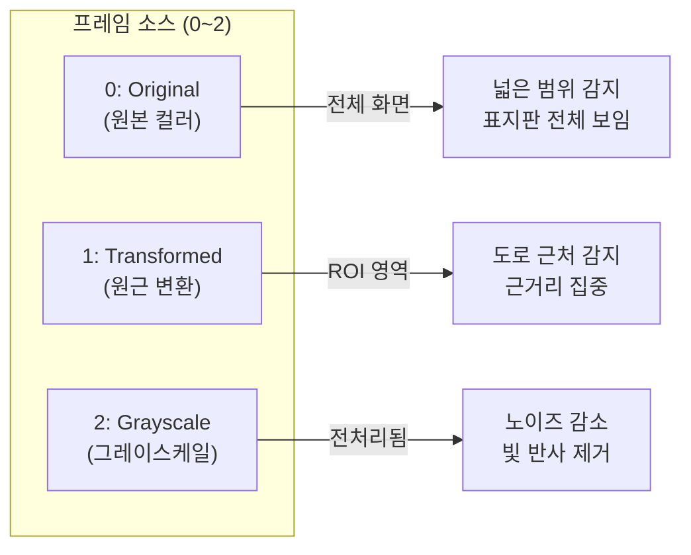

### 소스별 특징 비교

| 소스 | 장점 | 단점 | 권장 상황 |
|------|------|------|----------|
| **0: Original** | 전체 화면 감지, 원거리 표지판 | 처리 부하 높음 | 표지판이 화면 전체에 나타날 때 |
| **1: Transformed** | ROI 집중, 근거리 정확 | 좁은 범위 | 도로 근처 표지판 |
| **2: Grayscale** | 노이즈 감소, 빛 반사 제거 | 색상 정보 손실 | 빛 반사가 심한 환경 |

### 소스 코드

```python
def get_detection_frame(frame, frame_transformed, gray_frame, frame_source):
    """트랙바로 선택된 프레임 소스 반환"""
    if frame_source == 0:
        return frame              # 원본 (컬러)
    elif frame_source == 1:
        return frame_transformed  # 원근 변환
    elif frame_source == 2:
        return gray_frame         # 그레이스케일
    else:
        return frame  # 기본값
```

---

## ⚡ 반응 모드 상세

### Detect_Reaction_Mode 트랙바

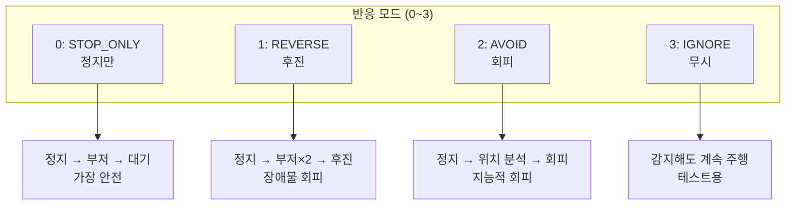

### 모드별 동작 비교 (v1.6)

| 모드 | 동작 | 부저 | 정지 방식 | 사용 상황 |
|------|------|------|-----------|----------|
| **0: STOP_ONLY** | 표지판 사라질 때까지 정지 | 처음 1회 (0.1초) | 계속 정지 | 정지 표지판 ⭐ |
| **1: REVERSE** | *(미사용)* | - | - | - |
| **2: AVOID** | *(미사용)* | - | - | - |
| **3: IGNORE** | 무시하고 계속 주행 | 없음 | 정지 안함 | 테스트/감지 확인용 |

**⚠️ 중요**: v1.6에서는 모드 0과 3만 실질적으로 사용됩니다.
- **모드 0 (기본)**: 표지판이 사라질 때까지 안전하게 정지
- **모드 3**: 표지판을 감지하지만 무시하고 계속 주행 (테스트용)

모드 1, 2는 레거시 코드로 남아있지만, v1.6의 상태 기반 제어에서는 모드 0과 동일하게 작동합니다.

### v1.6 주의사항

⚠️ **중요**: v1.6에서는 `react_to_detection()` 함수가 더 이상 메인 로직에서 호출되지 않습니다.  
대신 **상태 기반 제어**가 메인 루프에서 직접 처리됩니다.

`react_to_detection()` 함수는 레거시 코드로 남아있지만, v1.6의 실제 동작은 다음과 같습니다:

### v1.6 실제 동작 방식

```python
# === 모드 0, 1, 2: 상태 기반 제어 ===
if stop_detected:
    if not stop_sign_active:
        # 처음 감지 → 부저 1회
        stop_sign_active = True
        부저 울림 (0.1초)
        stop_beep_played = True
    
    # 계속 감지 → 모터만 정지
    car_stop()
    
else:
    if stop_sign_active:
        # 사라짐 → 자율주행 재개
        stop_sign_active = False

# 표지판 활성화 중이면 자율주행 건너뛰기
if stop_sign_active and reaction_mode != 3:
    continue

# === 모드 3: IGNORE ===
# 표지판을 감지하지만 무시하고 계속 주행
```

### react_to_detection() 함수 (레거시)

**⚠️ 참고**: 이 함수는 v1.6에서 더 이상 사용되지 않습니다.

<details>
<summary>레거시 코드 보기 (v1.5 이전)</summary>

```python
def react_to_detection(detection_info, reaction_mode, duration, up_speed, down_speed):
    """객체 감지 시 반응 동작 함수 (v1.5 이전)"""
    reaction_time = duration / 10.0
    reaction_time = max(0.1, min(reaction_time, 0.5))
    object_position = detection_info.get("object_position", "NONE")
    
    if reaction_mode == 3:
        return "IGNORE"
    
    if reaction_mode == 0:
        car_stop()
        if USE_BEEP:
            bot.Ctrl_BEEP_Switch(1)
            time.sleep(0.1)
            bot.Ctrl_BEEP_Switch(0)
        time.sleep(0.1)
        return "STOP_ONLY"
    
    # 모드 1, 2는 v1.6에서 0과 동일하게 작동
    # ...
```

</details>

---

## 📝 주요 함수 설명

### 함수 호출 관계

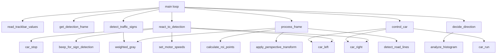

### 핵심 함수 요약

| 함수명 | 역할 | 입력 | 출력 |
|--------|------|------|------|
| `detect_traffic_signs()` | 표지판 감지 | 프레임, RGB 가중치 | 감지 여부, 위치 정보 |
| `get_detection_frame()` | 감지 소스 선택 | 3종 프레임, 소스 번호 | 선택된 프레임 |
| `react_to_detection()` | 감지 반응 | 감지 정보, 모드 | 수행된 동작 |
| `weighted_gray()` | RGB 그레이스케일 | 이미지, 가중치 | 그레이 이미지 |
| `decide_direction()` | 방향 결정 | 히스토그램 | 방향 (LEFT/UP/RIGHT) |
| `control_car()` | 차량 제어 | 방향, 속도 | - |

---

## 💻 소스 코드 핵심 부분 (v1.6)

### 1. 상태 변수 선언

```python
# ⭐⭐ 표지판 상태 관리 (v1.6에서 추가)
stop_sign_active = False       # 현재 Stop sign이 감지되고 있는지 여부
no_drive_sign_active = False   # 현재 No Drive sign이 감지되고 있는지 여부
stop_beep_played = False       # Stop sign 부저 울렸는지 여부
no_drive_beep_played = False   # No Drive sign 부저 울렸는지 여부
```

### 2. 메인 루프 - 상태 기반 제어 (v1.6)

```python
# 프레임 준비
frame_transformed = apply_perspective_transform(frame, pts_src)
gray_frame = weighted_gray(frame, r_weight, g_weight, b_weight)

# 감지 소스 선택
detect_frame = get_detection_frame(
    frame, frame_transformed, gray_frame, 
    params["detect_frame_source"]
)

# 표지판 감지 (매 프레임 체크)
stop_detected, no_drive_detected, sign_frame, detection_info = detect_traffic_signs(
    detect_frame, frame, r_weight, g_weight, b_weight, frame_source
)

# 표지판 감지 화면 항상 표시
cv2.imshow("5_Sign_Detection", sign_frame)

# ⭐⭐⭐ 상태 기반 제어 (v1.6)
reaction_mode = params["detect_reaction_mode"]

# === Stop Sign 처리 ===
if stop_detected:
    # 처음 감지된 경우
    if not stop_sign_active:
        stop_sign_active = True
        stop_beep_played = False  # 부저 플래그 초기화
        
        if DEBUG_MODE:
            print(f"\n{'='*50}")
            print(f"🛑 STOP sign DETECTED! Position: {detection_info['object_position']}")
            print(f"{'='*50}")
    
    # 부저는 최초 1회만
    if USE_BEEP and not stop_beep_played:
        bot.Ctrl_BEEP_Switch(1)
        time.sleep(0.1)
        bot.Ctrl_BEEP_Switch(0)
        stop_beep_played = True
        if DEBUG_MODE:
            print("🔊 Beep played (1 time only)")
    
    # 모터 정지 (표지판이 있는 동안 계속 정지)
    car_stop()
    
    if DEBUG_MODE and frame_count % 30 == 0:
        print("⏸️  Motor STOPPED (waiting for sign to disappear)")

else:
    # Stop sign이 사라진 경우
    if stop_sign_active:
        stop_sign_active = False
        stop_beep_played = False
        if DEBUG_MODE:
            print(f"\n{'='*50}")
            print("✅ STOP sign DISAPPEARED - Resuming auto drive")
            print(f"{'='*50}\n")

# === No Drive Sign 처리 (Stop sign과 동일) ===
if no_drive_detected:
    if not no_drive_sign_active:
        no_drive_sign_active = True
        no_drive_beep_played = False
        if DEBUG_MODE:
            print(f"\n{'='*50}")
            print(f"🚫 NO DRIVE sign DETECTED! Position: {detection_info['object_position']}")
            print(f"{'='*50}")
    
    if USE_BEEP and not no_drive_beep_played:
        bot.Ctrl_BEEP_Switch(1)
        time.sleep(0.1)
        bot.Ctrl_BEEP_Switch(0)
        no_drive_beep_played = True
    
    car_stop()
    
    if DEBUG_MODE and frame_count % 30 == 0:
        print("⏸️  Motor STOPPED (waiting for sign to disappear)")

else:
    if no_drive_sign_active:
        no_drive_sign_active = False
        no_drive_beep_played = False
        if DEBUG_MODE:
            print(f"\n{'='*50}")
            print("✅ NO DRIVE sign DISAPPEARED - Resuming auto drive")
            print(f"{'='*50}\n")

# ⭐⭐⭐ 표지판이 활성화되어 있으면 자율주행 건너뛰기 (IGNORE 모드 제외)
if (stop_sign_active or no_drive_sign_active) and reaction_mode != 3:
    # 다음 프레임으로 (자율주행 건너뛰기)
    continue

# 표지판 없을 경우: 정상 자율주행
# (이하 라인 트레이싱 코드...)
```

### 2. 표지판 감지 함수

```python
def detect_traffic_signs(detect_frame, display_frame, r_weight, g_weight, b_weight, frame_source=0):
    # 그레이스케일 변환
    if len(detect_frame.shape) == 2:
        gray_frame = detect_frame
    else:
        gray_frame = weighted_gray(detect_frame, r_weight, g_weight, b_weight)
    
    # Haar Cascade 감지
    stop_signs = stop_cascade.detectMultiScale(
        gray_frame, scaleFactor=1.1, minNeighbors=5, minSize=(30, 30)
    )
    no_drive_signs = no_drive_cascade.detectMultiScale(
        gray_frame, scaleFactor=1.1, minNeighbors=5, minSize=(30, 30)
    )
    
    # 위치 분석 (LEFT/CENTER/RIGHT)
    # ...
    
    return stop_detected, no_drive_detected, annotated_frame, detection_info
```

---

## 🔧 트러블슈팅 (v1.6)

### 자주 발생하는 문제

| 문제 | 원인 | 해결 방법 |
|------|------|----------|
| 표지판 미감지 | minNeighbors 높음 | 값 낮추기 (3~5) |
| 오탐지 많음 | minNeighbors 낮음 | 값 높이기 (7~10) |
| 빛 반사로 오감지 | B_weight 낮음 | B_weight 높이기 (60~80) |
| 표지판 앞에서 멈춤 | 정상 동작 (v1.6) | 표지판 치우기 |
| 부저가 계속 울림 | 구버전 (v1.5 이전) | v1.6으로 업데이트 |
| Frame 처리 느림 | minSize 작음 | minSize 40~50으로 증가 |

### v1.6 특정 문제

| 문제 | 원인 | 해결 방법 |
|------|------|----------|
| 표지판이 사라져도 안 움직임 | stop_sign_active가 True 유지 | 코드 확인: `else:` 블록 실행 확인 |
| 부저가 안 울림 | `USE_BEEP = False` | `USE_BEEP = True`로 변경 |
| 부저가 여러 번 울림 | 구버전 코드 | 최신 v1.6 코드 확인 |

### 디버그 모드 활용 (v1.6)

```python
DEBUG_MODE = True  # 상세 로그 출력

# 출력 예시 (처음 감지):
# ==================================================
# 🛑 STOP sign DETECTED! Position: CENTER
# ==================================================
# 🔊 Beep played (1 time only)

# 출력 예시 (계속 감지 중, 30프레임마다):
# ⏸️  Motor STOPPED (waiting for sign to disappear)

# 출력 예시 (표지판 사라짐):
# ==================================================
# ✅ STOP sign DISAPPEARED - Resuming auto drive
# ==================================================
```

### 상태 확인 방법

표지판 상태를 확인하려면 디버그 메시지를 추가하세요:

```python
# 메인 루프에 추가
if DEBUG_MODE and frame_count % 30 == 0:
    print(f"stop_sign_active: {stop_sign_active}")
    print(f"stop_beep_played: {stop_beep_played}")
    print(f"no_drive_sign_active: {no_drive_sign_active}")
    print(f"no_drive_beep_played: {no_drive_beep_played}")
```

### 성능 최적화

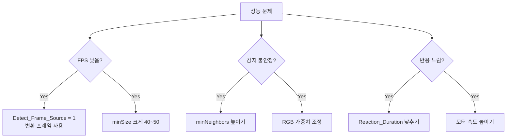

---

## 🎓 실습 과제

### 과제 1: 최적 설정 찾기
- 다양한 조명 환경에서 RGB 가중치 최적화
- 각 환경별 설정값 기록

### 과제 2: 새로운 반응 모드 추가
- 모드 4: 추적 (객체 방향으로 이동)
- react_to_detection() 함수 확장

### 과제 3: 다중 Cascade 적용
- 새로운 표지판 XML 학습
- detect_traffic_signs() 함수에 추가

---

## 📚 참고 자료

### OpenCV 함수

| 함수 | 설명 |
|------|------|
| `cv2.CascadeClassifier()` | Haar Cascade 분류기 |
| `detectMultiScale()` | 다중 스케일 감지 |
| `cv2.addWeighted()` | 가중 합성 |
| `cv2.warpPerspective()` | 원근 변환 |

### 키보드 단축키

| 키 | 기능 |
|----|------|
| `ESC` | 프로그램 종료 |
| `SPACE` | 모터 ON/OFF 토글 |
| `l` | LED ON/OFF 토글 |
| `b` | 부저 ON/OFF 토글 |

---

## 📝 버전 히스토리

| 버전 | 날짜 | 변경 사항 |
|:----:|:----:|-----------|
| **v1.6** | 2025-12-09 | ⭐ 상태 기반 제어 시스템 추가<br/>⭐ 표지판 지속 감지 (사라질 때까지 정지)<br/>⭐ 부저 1회만 울림 (소음 최소화)<br/>✅ 쿨다운 시스템 제거<br/>✅ 안전성 대폭 향상 |
| v1.5 | 2025-12-09 | 쿨다운 시스템 (2.5초)<br/>Frame 처리 속도 개선<br/>부저 최적화 |
| v1.4 | 2025-12-02 | RGB 가중치 필터링 추가<br/>빛 반사 제거 기능 |
| v1.0 | 2025-11-XX | 초기 버전 |

---

## 🎯 권장 사용 설정 (v1.6)

### 정지 표지판 테스트

```python
# 권장 설정
Detect_Frame_Source = 0        # 원본 프레임
Detect_Reaction_Mode = 0       # STOP_ONLY (기본)
USE_BEEP = True                # 부저 사용
DEBUG_MODE = True              # 디버그 메시지 확인
```

**작동 확인**:
1. 정지 표지판을 카메라 앞에 보여주기
2. 부저가 1회만 "삐!" 울리는지 확인
3. 모터가 정지하는지 확인
4. 표지판을 치우기
5. 자율주행이 즉시 재개되는지 확인

### 테스트 모드

```python
# 표지판 감지만 확인 (정지 안 함)
Detect_Reaction_Mode = 3       # IGNORE
```

이 모드에서는 표지판을 감지하지만 모터를 정지하지 않습니다. 감지가 잘 되는지 확인할 때 사용하세요.

---

> 📝 **문서 버전**: v1.6  
> 📅 **최종 수정**: 2025-12-09  
> 👤 **작성**: Raspbot 개발팀  
> 🔗 **관련 문서**: `CHANGELOG_v1.6_표지판_지속감지.md`


