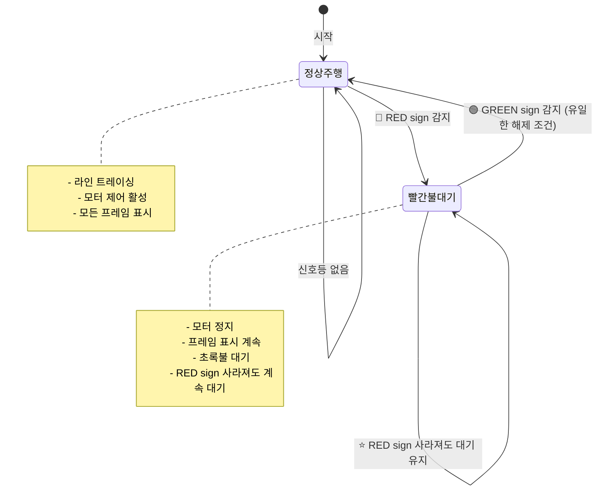
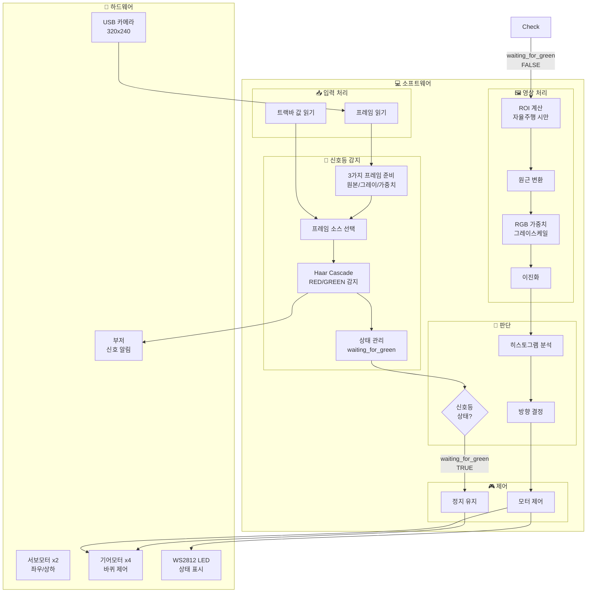
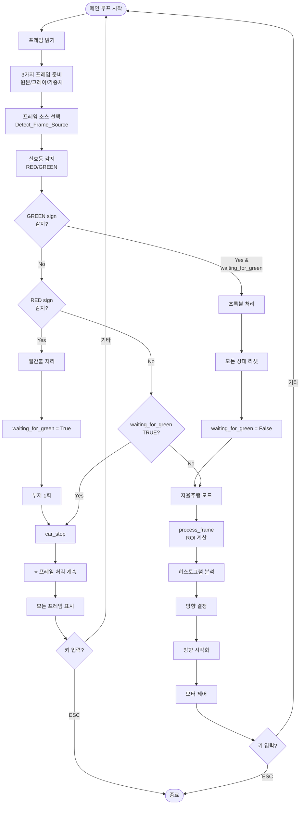
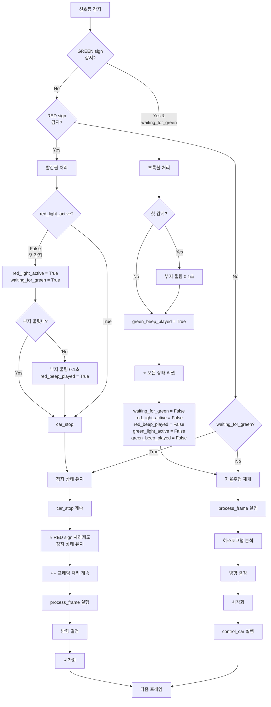
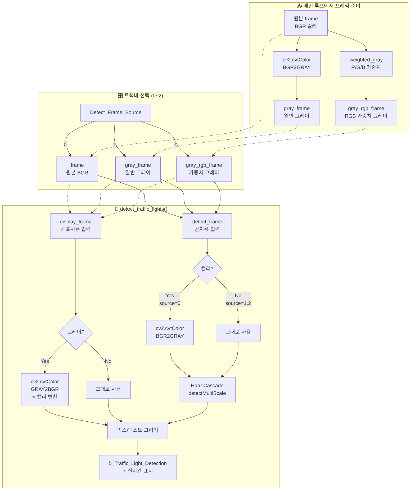
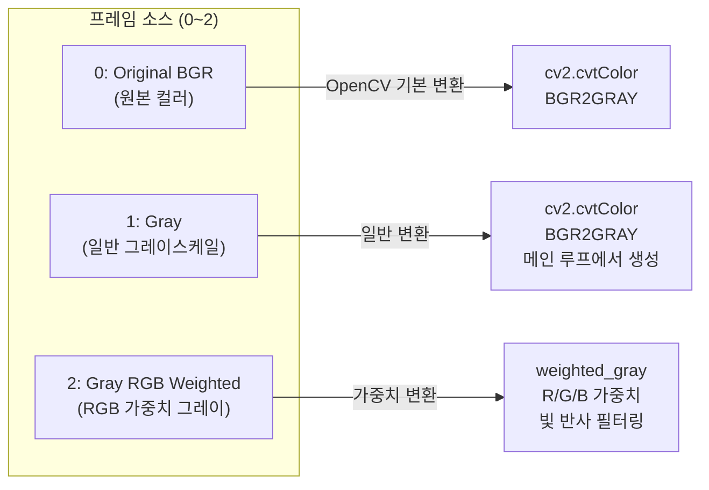
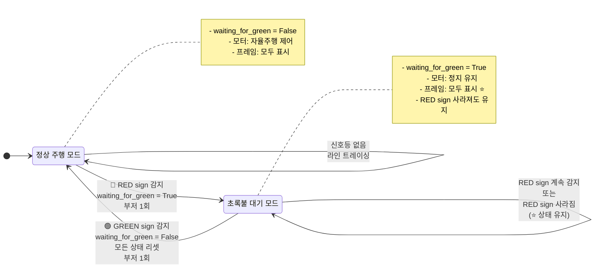
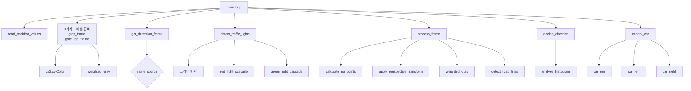

# 🚦 Raspbot v2 신호등 제어 시스템 가이드

> `4_traffic_light_control.py` 코드 분석 및 사용법  
> RGB 필터링 + Haar Cascade 신호등 감지 + 상태 기반 제어  
> **최종 업데이트**: 2025-12-15 (v1.7 - 프레임 소스 최적화)

---

## 📑 목차

1. [개요](#-개요)
2. [⭐ v1.7 주요 변경사항](#-v17-주요-변경사항)
3. [신호등 제어 로직](#-신호등-제어-로직)
4. [시스템 아키텍처](#-시스템-아키텍처)
5. [프로그램 실행 흐름](#-프로그램-실행-흐름)
6. [핵심 알고리즘](#-핵심-알고리즘)
7. [트랙바 설정 가이드](#-트랙바-설정-가이드)
8. [감지 프레임 소스 선택](#-감지-프레임-소스-선택)
9. [신호등 상태 전환](#-신호등-상태-전환)
10. [주요 함수 설명](#-주요-함수-설명)
11. [트러블슈팅](#-트러블슈팅)
12. [실습 과제](#-실습-과제)

---

## 📋 개요

이 프로그램은 **자율주행**과 **신호등 감지**를 결합한 교통 제어 시스템입니다.

### 주요 특징

| 기능 | 설명 | v1.7 개선 |
|------|------|----------|
| **라인 트레이싱** | 빨간색/회색 도로선 기반 자율주행 | - |
| **RGB 필터링** | 빛 반사 제거를 위한 가중치 기반 그레이스케일 | - |
| **⭐ 신호등 감지** | Red Light/Green Light 실시간 감지 | ✅ 프레임 소스 재설계 + 실시간 표시 |
| **빨간불 제어** | 모터 정지, 초록불 대기 | ✅ 프레임 표시 계속 |
| **초록불 제어** | 신호 해제, 자율주행 재개 | - |
| **⭐ 상태 유지** | RED sign 사라져도 정지 상태 유지 | - |
| **⭐⭐ 프레임 표시** | 신호등 대기 중에도 모든 프레임 표시 | ✅ NEW! |

---

## ⭐ v1.7 주요 변경사항

**업데이트 날짜**: 2025-12-15  
**변경 사유**: 프레임 소스 재설계 + ROI 최적화 + 사용자 경험 개선 + 실시간 표시 개선

### 변경 내용 요약

| 항목 | Before (v1.0) | After (v1.7) | 개선 효과 |
|:----:|:------------:|:------------:|:--------:|
| **프레임 소스** | 원본/ROI변환/그레이 | 원본BGR/일반그레이/RGB가중치그레이 | ✅ 명확성 향상 |
| **ROI 처리** | 매 프레임 수행 | 자율주행 시만 수행 | ✅ 성능 향상 |
| **카메라 표시** | 신호등 대기 시 멈춤 ❌ | 계속 표시 ✅ | ✅ 사용자 경험 개선 |
| **감지 창 표시** | 원본만 표시 ❌ | 선택된 소스 실시간 표시 ✅ | ✅ 선택 확인 가능 |
| **디버깅** | 불가능 ❌ | 가능 ✅ | ✅ 개발 효율 향상 |

### 핵심 개선 사항

#### 1️⃣ **프레임 소스 재설계** ✅

**Before (v1.0)**:
```python
# 혼동됨: ROI 영역과 전체 화면이 섞임
0: frame (원본 전체 화면)
1: frame_transformed (ROI 원근 변환) ← 좁은 범위
2: gray_frame (그레이스케일)
```

**After (v1.7)**:
```python
# 명확: 모두 전체 화면, 그레이 변환 방식만 다름
0: frame (원본 BGR) → OpenCV 기본 GRAY 변환
1: gray_frame (일반 그레이) → cv2.cvtColor()
2: gray_rgb_frame (RGB 가중치 그레이) → weighted_gray()
```

#### 2️⃣ **ROI 처리 최적화** ⚡

```python
# Before: 매 프레임마다 ROI 계산 (비효율)
frame_transformed = apply_perspective_transform(...)  # 매번 실행

# After: 자율주행 시에만 ROI 계산 (효율)
if not waiting_for_green:  # 신호등 대기 중이 아닐 때만
    binary_frame = process_frame(...)  # ROI 계산 포함
```

#### 3️⃣ **프레임 표시 계속** 🎥

**Before (v1.0) - 문제**:
```python
if waiting_for_green:
    car_stop()
    continue  # ← 모든 것 건너뛰기
# process_frame() 실행 안됨 → 검은 화면
```

**After (v1.7) - 개선**:
```python
# 프레임 처리는 항상 실행
binary_frame = process_frame(...)  # ← 항상 실행
direction = decide_direction(...)
visualize_direction_on_frame(...)  # ← 계속 표시

# 모터만 조건부
if waiting_for_green:
    # 모터 제어만 건너뛰기 (프레임은 표시됨)
    pass
else:
    control_car(...)
```

#### 4️⃣ **감지 창 실시간 표시** 🎯

**Before (v1.0) - 제한**:
```python
# 항상 원본 프레임만 표시
detect_traffic_lights(
    detect_frame,  # 감지용 (트랙바로 선택)
    frame,         # 표시용 (항상 원본)
    ...
)
# 5_Traffic_Light_Detection 창 → 항상 원본만
```

**After (v1.7) - 개선**:
```python
# 선택된 소스를 감지와 표시 모두에 사용
detect_traffic_lights(
    detect_frame,  # 감지용 (트랙바로 선택)
    detect_frame,  # 표시용 (선택된 소스) ⭐
    ...
)
# 5_Traffic_Light_Detection 창 → 트랙바 변경 시 실시간 변경 ✅

# 그레이스케일 자동 변환 (컬러 박스 표시용)
if len(display_frame.shape) == 2:
    annotated_frame = cv2.cvtColor(display_frame, cv2.COLOR_GRAY2BGR)
```

**개선 효과**:
- ✅ 트랙바로 프레임 소스 변경 시 즉시 확인 가능
- ✅ 0=원본컬러, 1=일반그레이, 2=RGB가중치그레이 모두 표시
- ✅ 그레이스케일도 컬러 박스와 텍스트 표시 가능
- ✅ 사용자 피드백 대폭 향상

---

## 🚦 신호등 제어 로직

### 신호등 상태 전환도



### 상태 변수

```python
# 신호등 상태 관리
red_light_active = False       # 현재 빨간불이 감지되고 있는지
green_light_active = False     # 현재 초록불이 감지되고 있는지
red_beep_played = False        # 빨간불 부저 울렸는지
green_beep_played = False      # 초록불 부저 울렸는지
waiting_for_green = False      # 빨간불 후 초록불 대기 중인지 ⭐
```

### 제어 로직 상세

#### 1. 빨간불 감지 (RED Light)

```python
if red_detected:
    # 처음 감지된 경우
    if not red_light_active:
        red_light_active = True
        waiting_for_green = True  # ⭐ 초록불 대기 상태 진입
        
        if DEBUG_MODE:
            print("🔴 RED LIGHT DETECTED!")
            print("   ⏸️  Motor STOPPED")
            print("   ⏳ Waiting for GREEN light...")
            print("   ⭐ This state persists even if RED sign disappears")
    
    # 부저는 최초 1회만
    if USE_BEEP and not red_beep_played:
        bot.Ctrl_BEEP_Switch(1)
        time.sleep(0.1)
        bot.Ctrl_BEEP_Switch(0)
        red_beep_played = True
```

**핵심 포인트**:
- ⭐ `waiting_for_green = True` 상태는 **GREEN sign 감지 전까지 계속 유지**
- RED sign이 사라져도 정지 상태 계속
- 부저는 최초 1회만 울림

#### 2. 초록불 감지 (GREEN Light)

```python
# ⭐ GREEN sign만이 정지 상태를 해제할 수 있음
if green_detected and waiting_for_green:
    # 처음 감지된 경우에만 부저
    if not green_beep_played:
        if USE_BEEP:
            bot.Ctrl_BEEP_Switch(1)
            time.sleep(0.1)
            bot.Ctrl_BEEP_Switch(0)
            green_beep_played = True
        
        if DEBUG_MODE:
            print("🟢 GREEN LIGHT DETECTED!")
            print("   ▶️  Releasing STOP state")
            print("   ▶️  Resuming AUTO DRIVING")
    
    # ⭐ 모든 상태 완전 리셋 (정지 상태 해제)
    waiting_for_green = False
    red_light_active = False
    red_beep_played = False
    green_light_active = False
    green_beep_played = False
```

**핵심 포인트**:
- ⭐ **오직 GREEN sign만** 정지 상태 해제 가능
- 모든 신호등 상태 리셋
- 자율주행 모드 즉시 재개

#### 3. 정지 상태 유지

```python
# RED sign이 사라져도 정지 상태 계속 유지
if waiting_for_green:
    # 모터 정지 유지
    car_stop()
    
    if DEBUG_MODE and frame_count % 30 == 0:
        if red_detected:
            print("⏸️  Motor STOPPED (RED sign visible)")
        else:
            print("⏸️  Motor STOPPED (waiting for GREEN sign)")
            print("   ⭐ RED sign disappeared, but STOP state persists")
```

---

## 🏗️ 시스템 아키텍처

### 전체 구조



---

## 📊 프로그램 실행 흐름

### 메인 루프 순서도



---

## 🔬 핵심 알고리즘

### 1. 신호등 상태 기반 제어 알고리즘



### 2. 프레임 소스 선택 알고리즘 (v1.7)



---

## 🎛️ 트랙바 설정 가이드

### 전체 트랙바 목록

| 카테고리 | 트랙바명 | 범위 | 기본값 | 설명 |
|----------|----------|------|--------|------|
| **서보** | Servo_1_Angle | 0~180 | 95 | 카메라 좌우 |
| | Servo_2_Angle | 0~110 | 0 | 카메라 상하 |
| **ROI** | ROI_Top_Y | 0~1000 | 695 | ROI 상단 (‰) |
| | ROI_Bottom_Y | 0~1000 | 812 | ROI 하단 (‰) |
| **카메라** | Brightness | 0~100 | 32 | 밝기 |
| | Contrast | 0~100 | 0 | 대비 |
| | Saturation | 0~100 | 0 | 채도 |
| | Gain | 0~100 | 0 | 게인 |
| **모터** | Motor_Up_Speed | 0~255 | 15 | 전진 속도 |
| | Motor_Down_Speed | 0~255 | 8 | 회전 속도 |
| **임계값** | Detect_Value | 0~150 | 120 | 이진화 임계값 |
| | Direction_Threshold | 0~500000 | 35000 | 방향 임계값 |
| | Up_Threshold | 0~500000 | 220000 | 막다른 길 임계값 |
| **RGB** | R_weight | 0~100 | 30 | Red 가중치 |
| | G_weight | 0~100 | 40 | Green 가중치 |
| | B_weight | 0~100 | 60 | Blue 가중치 |
| **⭐감지** | Detect_Frame_Source | 0~2 | 0 | 감지 프레임 소스 (v1.7 재설계) |

---

## 🎯 감지 프레임 소스 선택

### Detect_Frame_Source 트랙바 (v1.7)

⚠️ **v1.7 업데이트**: 프레임 소스가 **Haar Cascade 성능 비교 테스트**를 위해 재설계되었습니다.



### 소스별 특징 비교

| 소스 | 그레이 변환 방식 | 특징 | 표시 방법 (v1.7) | 권장 상황 |
|------|-----------------|------|-----------------|----------|
| **0: Original BGR** | detect_traffic_lights() 내부에서<br/>OpenCV 기본 변환 | 기준 성능 측정용 | ⭐ 원본 컬러 표시 | 표준 성능 비교 |
| **1: Gray (일반)** | 메인 루프에서<br/>cv2.cvtColor() | 일반 그레이스케일 | ⭐ 그레이 표시<br/>(자동 컬러 변환) | 일반 환경 |
| **2: Gray (RGB 가중치)** | 메인 루프에서<br/>weighted_gray() | 빛 반사 필터링<br/>R/G/B 가중치 조정 | ⭐ 가중치 그레이 표시<br/>(자동 컬러 변환) | 빛 반사 심한 환경 |

### 코드 예시 (v1.7)

```python
# 📥 메인 루프에서 3가지 프레임 생성
gray_frame = cv2.cvtColor(frame, cv2.COLOR_BGR2GRAY)           # 일반 그레이
gray_rgb_frame = weighted_gray(frame, R, G, B)                 # RGB 가중치 그레이

# 🎛️ 트랙바로 선택
detect_frame = get_detection_frame(
    frame,           # 0: 원본 BGR → 감지 함수 내부에서 그레이 변환
    gray_frame,      # 1: 일반 그레이 → 그대로 사용
    gray_rgb_frame,  # 2: RGB 가중치 그레이 → 그대로 사용
    frame_source
)

# 🚦 신호등 감지 (v1.7 - 표시 프레임도 선택된 소스 사용)
red_detected, green_detected, traffic_frame, detection_info = detect_traffic_lights(
    detect_frame,  # 감지용 프레임
    detect_frame,  # ⭐ 표시용 프레임 (v1.7: 선택된 소스 실시간 반영)
    params["r_weight"],
    params["g_weight"],
    params["b_weight"],
    params["detect_frame_source"]
)

# 📺 5_Traffic_Light_Detection 창에 표시
# → 트랙바 변경 시 배경 이미지가 실시간으로 바뀜 ✅
cv2.imshow("5_Traffic_Light_Detection", traffic_frame)
```

**v1.7 개선 효과**:
```python
# detect_traffic_lights() 내부
if len(display_frame.shape) == 2:
    # 그레이스케일 → BGR 컬러 자동 변환 (박스/텍스트 표시용)
    annotated_frame = cv2.cvtColor(display_frame, cv2.COLOR_GRAY2BGR)
else:
    # 이미 컬러 프레임
    annotated_frame = display_frame.copy()

# → RED/GREEN 박스와 텍스트를 컬러로 표시 가능 ✅
```

---

## 🔄 신호등 상태 전환

### 상태 다이어그램



### 상태 전환 조건

| 현재 상태 | 이벤트 | 다음 상태 | 동작 |
|-----------|--------|-----------|------|
| 정상 주행 | 🔴 RED sign 감지 | 초록불 대기 | waiting_for_green = True<br/>red_light_active = True<br/>부저 1회<br/>모터 정지 |
| 초록불 대기 | RED sign 계속 | 초록불 대기 | 상태 유지<br/>모터 정지 유지 |
| 초록불 대기 | RED sign 사라짐 | 초록불 대기 | ⭐ 상태 유지<br/>모터 정지 유지 |
| 초록불 대기 | 🟢 GREEN sign 감지 | 정상 주행 | 모든 상태 리셋<br/>부저 1회<br/>자율주행 재개 |
| 정상 주행 | 신호등 없음 | 정상 주행 | 라인 트레이싱 계속 |

---

## 📝 주요 함수 설명

### 함수 호출 관계



### 핵심 함수 요약

| 함수명 | 역할 | 입력 | 출력 |
|--------|------|------|------|
| `detect_traffic_lights()` | 신호등 감지 | 프레임, RGB 가중치 | RED/GREEN 감지 여부, 위치 정보 |
| `get_detection_frame()` | 감지 소스 선택 | 3종 프레임, 소스 번호 | 선택된 프레임 |
| `process_frame()` | 프레임 처리 (자율주행용) | 프레임, 파라미터 | 이진화 프레임 |
| `weighted_gray()` | RGB 그레이스케일 | 이미지, 가중치 | 그레이 이미지 |
| `decide_direction()` | 방향 결정 | 히스토그램 | 방향 (LEFT/UP/RIGHT) |
| `control_car()` | 차량 제어 | 방향, 속도 | - |

---

## 🔧 트러블슈팅

### 자주 발생하는 문제

| 문제 | 원인 | 해결 방법 |
|------|------|----------|
| 신호등 미감지 | minNeighbors 높음 | 값 낮추기 (3~5) |
| 오탐지 많음 | minNeighbors 낮음 | 값 높이기 (7~10) |
| 빛 반사로 오감지 | B_weight 낮음 | B_weight 높이기 (60~80) |
| 빨간불 앞에서 멈춤 | 정상 동작 (v1.0) | 초록불 제시하기 |
| 빨간불 사라져도 안 움직임 | 정상 동작 (설계) | 초록불 필요 ⭐ |
| Frame 처리 느림 | minSize 작음 | minSize 40~50으로 증가 |
| 카메라 검게 멈춤 | 구버전 (v1.0) | v1.7으로 업데이트 ✅ |

### v1.7 특정 문제

| 문제 | 원인 | 해결 방법 |
|------|------|----------|
| 프레임이 계속 안 보임 | 코드 버전 확인 | v1.7 코드 확인 |
| GREEN sign이 작동 안함 | XML 파일 없음 | 실제 green_light.xml 필요 |
| RED sign 해제 안됨 | 정상 (설계) | GREEN sign 제시 필요 |
| 감지 창이 바뀌지 않음 | v1.7 미적용 | display_frame도 detect_frame으로 변경 ✅ |
| 그레이에 박스 안 보임 | 자동 변환 누락 | GRAY2BGR 변환 코드 확인 ✅ |

### 디버그 모드 활용

```python
DEBUG_MODE = True  # 상세 로그 출력

# 출력 예시 (빨간불 첫 감지):
# ==================================================
# 🔴 RED LIGHT DETECTED!
#    ⏸️  Motor STOPPED
#    ⏳ Waiting for GREEN light...
#    ⭐ This state persists even if RED sign disappears
# ==================================================
# 🔊 Beep played for RED light (1 time only)

# 출력 예시 (정지 상태 유지 중, 30프레임마다):
# ⏸️  Motor STOPPED (RED sign visible)
# 또는
# ⏸️  Motor STOPPED (waiting for GREEN sign)
#    ⭐ RED sign disappeared, but STOP state persists

# 출력 예시 (초록불 감지):
# ==================================================
# 🟢 GREEN LIGHT DETECTED!
#    ▶️  Releasing STOP state
#    ▶️  Resuming AUTO DRIVING
# ==================================================
# ✅ All traffic light states RESET
# ✅ AUTO DRIVING mode resumed
```

### 상태 확인 방법

프레임마다 신호등 상태 확인:

```python
# 10프레임마다 출력
if frame_count % 10 == 0:
    if waiting_for_green:
        if red_detected:
            print("🔴 Traffic Light: RED sign detected - MOTOR STOPPED")
        else:
            print("⏳ Traffic Light: Waiting for GREEN sign (RED disappeared)")
    else:
        print("✅ Traffic Light: Normal - AUTO DRIVING")
```

---

## 🎓 실습 과제

### 과제 1: 신호등 시스템 테스트

**목표**: RED/GREEN sign의 상태 전환 확인

**실험 방법**:
1. RED sign을 카메라에 보여주기
2. 차량이 정지하는지 확인
3. RED sign을 치우기
4. 차량이 계속 정지하는지 확인 (⭐ 중요)
5. GREEN sign을 보여주기
6. 차량이 움직이는지 확인

**측정 항목**:
- RED sign 감지 여부
- 모터 정지 여부
- 부저 울림 (1회만)
- RED sign 제거 후에도 정지 유지 여부 ⭐
- GREEN sign 감지 후 자율주행 재개 여부

### 과제 2: 프레임 소스 비교 테스트

**목표**: 3가지 프레임 소스의 신호등 감지 성능 비교

**실험 방법**:
1. 동일한 RED/GREEN sign으로 테스트
2. Detect_Frame_Source 트랙바를 0, 1, 2로 변경
3. 각 모드별 감지 성공률 기록

**결과 기록표**:
| 소스 | RED 감지율 | GREEN 감지율 | 오탐률 | 비고 |
|------|-----------|-------------|--------|------|
| 0 (BGR) | | | | |
| 1 (Gray) | | | | |
| 2 (RGB) | | | | |

### 과제 3: 대기 시간 측정

**목표**: RED sign부터 GREEN sign까지 대기 시간 측정

**실험 방법**:
1. RED sign 제시 → 타이머 시작
2. RED sign 제거 (정지 상태 유지 확인)
3. GREEN sign 제시 → 타이머 정지
4. 대기 시간 기록

**측정 결과**:
- 평균 대기 시간
- 모터 정지 유지 여부
- 프레임 표시 계속 여부 ⭐

### 과제 4: 신호등 XML 학습

**목표**: 실제 RED/GREEN light Haar Cascade XML 생성

**단계**:
1. 빨간불/초록불 이미지 수집 (각 100장 이상)
2. Negative 이미지 수집
3. Cascade Trainer GUI로 학습
4. XML 파일 생성 및 테스트

---

## 📚 참고 자료

### Haar Cascade 파일

| 파일 | 경로 | 용도 |
|------|------|------|
| `red_light.xml` | `./xml/stop.xml` (임시) | 빨간불 감지 |
| `green_light.xml` | `./xml/no_drive.xml` (임시) | 초록불 감지 |

⚠️ **주의**: 현재는 Stop/No Drive XML을 임시로 사용 중입니다. 실제 신호등 XML 파일이 필요합니다.

### 키보드 단축키

| 키 | 기능 |
|----|------|
| `ESC` | 프로그램 종료 |
| `SPACE` | 모터 ON/OFF 토글 |
| `l` | LED ON/OFF 토글 |
| `b` | 부저 ON/OFF 토글 |

### 관련 문서

- `3_2_AUTOPLOT_HAARCASCADE_가이드.md` - 표지판 감지 시스템
- `CHANGELOG_v1.0_신호등_제어.md` - v1.0 변경 사항
- `4_TRAFFIC_LIGHT_가이드.md` - 신호등 제어 가이드 (본 문서)

---

## 📝 버전 히스토리

| 버전 | 날짜 | 변경 사항 |
|:----:|:----:|-----------|
| **v1.7** | 2025-12-15 | ⭐ 프레임 소스 재설계 (성능 비교 테스트)<br/>⭐ ROI 처리 최적화 (자율주행 시에만 수행)<br/>⭐⭐ 프레임 표시 계속 (신호등 대기 중에도 표시)<br/>⭐⭐⭐ 감지 창 실시간 변경 (트랙바 선택 즉시 반영)<br/>✅ 0=원본BGR, 1=일반그레이, 2=RGB가중치그레이<br/>✅ 그레이스케일 자동 컬러 변환 (박스/텍스트 표시)<br/>✅ 사용자 경험 대폭 개선 |
| **v1.0** | 2025-12-09 | 초기 버전<br/>신호등 제어 시스템 구현<br/>RED/GREEN light 감지<br/>상태 기반 제어 |

---

## 🎯 권장 사용 설정

### 신호등 테스트 (v1.7)

```python
# 권장 설정
Detect_Frame_Source = 0        # 원본 BGR (기준 성능)
USE_BEEP = True                # 부저 사용
DEBUG_MODE = True              # 디버그 메시지 확인
```

**작동 확인**:
1. 빨간불 표지판을 카메라 앞에 보여주기
2. 부저가 1회 울리는지 확인
3. 모터가 정지하는지 확인
4. 빨간불을 치우기
5. ⭐ 모터가 계속 정지 상태인지 확인 (중요!)
6. 초록불 표지판을 보여주기
7. 부저가 1회 울리는지 확인
8. 자율주행이 즉시 재개되는지 확인

### 성능 비교 테스트

```python
# Mode 0: 기준 성능
Detect_Frame_Source = 0        # OpenCV 기본 그레이 변환

# Mode 1: 일반 그레이
Detect_Frame_Source = 1        # 일반 그레이스케일

# Mode 2: RGB 가중치 (빛 반사 환경)
Detect_Frame_Source = 2        # RGB 가중치 그레이
R_weight = 30                  # 실험적으로 조정
G_weight = 40
B_weight = 60-80               # 빛 반사 필터링
```

---

## 🚦 주요 차이점: 표지판 vs 신호등

| 항목 | 표지판 시스템<br/>(3_object_autoplot) | 신호등 시스템<br/>(4_traffic_light_control) |
|------|--------------------------------------|-------------------------------------------|
| **감지 대상** | STOP sign, NO DRIVE sign | RED light, GREEN light |
| **정지 해제** | 표지판 사라지면 해제 | ⭐ GREEN light만 해제 가능 |
| **상태 유지** | 표지판이 있을 때만 | RED sign 사라져도 유지 ⭐ |
| **용도** | 일시 정지 (표지판 통과) | 신호 대기 (교차로) |
| **로직** | 단순 (감지 → 정지 → 해제) | 복잡 (상태 유지 → GREEN 대기) |

---

> 📝 **문서 버전**: v1.7  
> 📅 **최종 수정**: 2025-12-15  
> 👤 **작성**: Raspbot 개발팀  
> 🔗 **관련 코드**: `4_traffic_light_control.py`

