# 🎓 Haar Cascade 기반 자율주행 교육 가이드

**Raspbot v2 자율주행 로봇 카 - 단계별 학습 프로그램**

---

## 📋 목차

1. [개요](#-개요)
2. [왜 Haar Cascade인가?](#-왜-haar-cascade인가)
3. [학습 로드맵](#-학습-로드맵)
4. [단계별 실습 가이드](#-단계별-실습-가이드)
5. [Haar Cascade XML 제작](#-haar-cascade-xml-제작)
6. [고급 기능: 멀티스레드](#-고급-기능-멀티스레드)
7. [최종 미션](#-최종-미션)
8. [문제 해결 가이드](#-문제-해결-가이드)

---

## 🎯 개요

본 교육 과정은 **Haar Cascade 기반 객체 인식**을 활용하여 자율주행 로봇 카를 단계적으로 학습하는 프로그램입니다.

### 학습 목표

| 단계 | 학습 내용 | 결과물 |
|------|----------|--------|
| **1단계** | 카메라 설정 및 서보 제어 | 실시간 카메라 파라미터 조정 |
| **2단계** | RGB 가중치 기반 그레이스케일 변환 | 빛 반사 필터링 기술 습득 |
| **3단계** | Haar Cascade 객체 감지 | 표지판/신호등 인식 |
| **4단계** | 자율주행 + 표지판 감지 통합 | Early If 패턴 적용 |
| **5단계** | 멀티스레드 최적화 | 실시간 처리 성능 향상 |

---

## 🤔 왜 Haar Cascade인가?

### YOLO vs Haar Cascade 비교

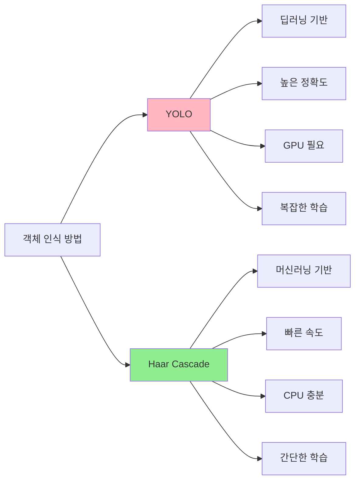

### Raspberry Pi 환경에서 Haar Cascade를 선택하는 이유

| 항목 | YOLO | Haar Cascade | ✅ 선택 |
|------|------|--------------|---------|
| **하드웨어 요구사항** | GPU 필요, 높은 메모리 | CPU만으로 충분, 낮은 메모리 | ✅ Haar |
| **처리 속도** | 30-60ms (GPU), 200-500ms (CPU) | 10-30ms (CPU) | ✅ Haar |
| **학습 난이도** | 높음 (수천 장의 이미지 필요) | 중간 (수백 장의 이미지) | ✅ Haar |
| **정확도** | 매우 높음 (95%+) | 중간-높음 (80-90%) | 🔸 YOLO |
| **실시간 처리** | Raspberry Pi에서 어려움 | 원활함 | ✅ Haar |
| **교육 목적** | 복잡함 | 적합함 | ✅ Haar |

### 결론: Haar Cascade가 교육용으로 최적인 이유

1. **🚀 속도**: Raspberry Pi 3/4에서 실시간 처리 가능 (30 FPS)
2. **💻 리소스**: CPU만으로 충분, 추가 하드웨어 불필요
3. **📚 학습 용이성**: XML 파일 하나로 커스텀 객체 학습 가능
4. **🎓 교육 효과**: 머신러닝 기초 개념 이해에 적합
5. **💰 비용**: 무료, 오픈소스 (OpenCV 내장)

---

## 🗺️ 학습 로드맵

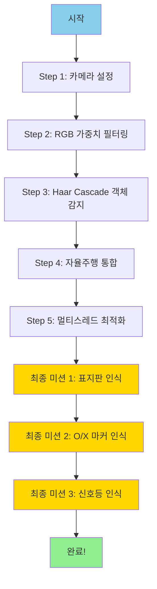

### 예상 학습 시간

| 단계 | 예상 시간 | 난이도 |
|------|-----------|--------|
| Step 1 | 1시간 | ⭐ |
| Step 2 | 1.5시간 | ⭐⭐ |
| Step 3 | 2시간 | ⭐⭐⭐ |
| Step 4 | 2.5시간 | ⭐⭐⭐⭐ |
| Step 5 | 2시간 | ⭐⭐⭐⭐⭐ |
| **총계** | **9시간** | - |

---

## 📖 단계별 실습 가이드

### Step 1: 카메라 설정 및 서보 제어

**파일**: `0_camera_color_rect.py`

#### 학습 목표
- 카메라 초기화 및 설정
- 서보 모터 제어 (카메라 각도 조절)
- OpenCV 트랙바를 통한 실시간 파라미터 조정
- 이미지 캡처 및 저장

#### 시스템 구성도

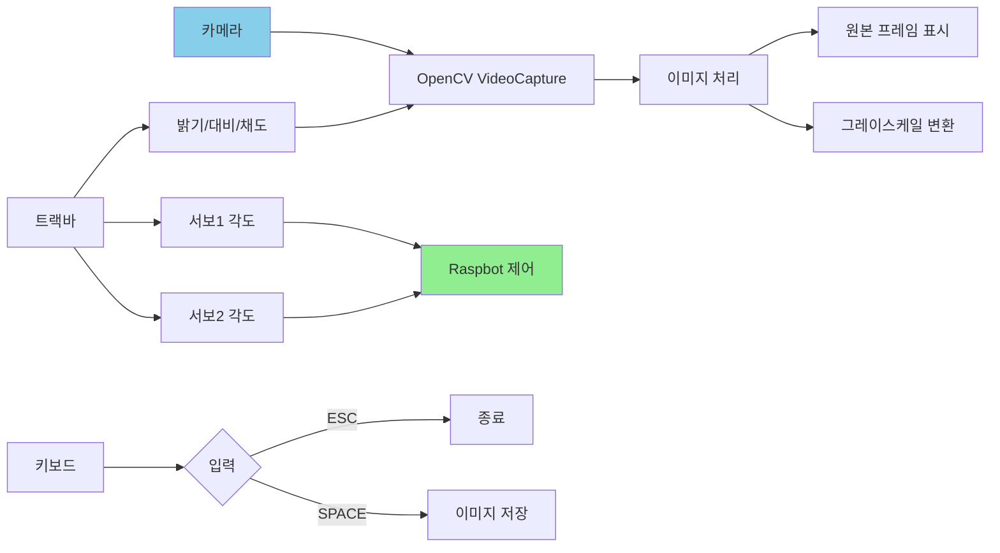

#### 핵심 코드 분석

```python
# 서보 모터 제어 함수
def control_servo_motor(car, servo_id, angle):
    """
    서보 모터를 지정된 각도로 회전시킵니다.
    
    Args:
        car (Raspbot): Raspbot 객체
        servo_id (int): 서보 모터 ID (1=좌우, 2=상하)
        angle (int): 회전 각도 (0-180)
    """
    # Early if: 각도 범위 검증
    if not (0 <= angle <= 180):
        print(f"경고: 서보 각도가 범위를 벗어났습니다: {angle}")
        return
    
    # Early if: 서보 ID 검증
    if servo_id not in [1, 2]:
        print(f"경고: 잘못된 서보 ID입니다: {servo_id}")
        return
    
    # 실제 제어
    car.Ctrl_Servo(servo_id, angle)
```

#### 실습 과제

1. ✅ **기본**: 프로그램 실행 후 서보 모터 각도 조절
2. ✅ **중급**: 최적의 카메라 각도 찾기 (라인 트레이싱용)
3. ✅ **고급**: 자동으로 좌우를 스캔하는 기능 추가

#### 실행 방법

```bash
cd ~/project_demo/04_cascade
python3 0_camera_color_rect.py

# 조작법:
# - ESC: 종료
# - SPACE: 이미지 캡처
# - 트랙바: 서보 각도 및 카메라 설정 조정
```

---

### Step 2: RGB 가중치 기반 그레이스케일 변환

**파일**: `1_camera_weight.py`

#### 학습 목표
- RGB 채널별 가중치 조정 기법 이해
- 빛 반사 필터링 원리 학습
- 환경 조명에 강건한 이미지 처리

#### 빛 반사 문제와 해결 방법

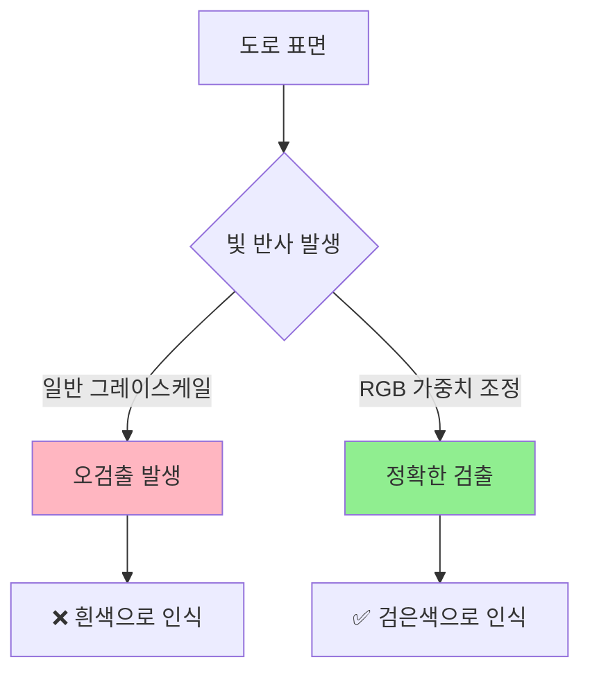

#### RGB 가중치 원리

| 채널 | 빛 반사 민감도 | 권장 가중치 (밝은 환경) | 권장 가중치 (어두운 환경) |
|------|----------------|------------------------|--------------------------|
| **Red (R)** | 높음 ⬆️ | 낮게 (20-30) | 높게 (50-60) |
| **Green (G)** | 중간 ↔️ | 중간 (30-40) | 중간 (30-40) |
| **Blue (B)** | 낮음 ⬇️ | 높게 (50-70) | 낮게 (20-30) |

#### 가중치 변환 알고리즘

```python
def weighted_grayscale_conversion(image, r_weight, g_weight, b_weight):
    """
    RGB 가중치를 사용하여 그레이스케일 이미지로 변환합니다.
    
    목적: 빛 반사 영역을 어둡게 처리하여 오검출 방지
    
    원리:
    - Blue 채널(B): 빛 반사에 덜 민감 → 가중치 ↑
    - Red 채널(R): 빛 반사에 민감 → 가중치 ↓
    """
    sum_weight = r_weight + g_weight + b_weight
    
    # 가중치 합이 0이면 기본값 사용
    if sum_weight == 0:
        return cv2.cvtColor(image, cv2.COLOR_BGR2GRAY)
    
    # 가중치를 0-1 범위로 정규화
    r_norm = r_weight / sum_weight
    g_norm = g_weight / sum_weight
    b_norm = b_weight / sum_weight
    
    # BGR 순서로 가중치 적용
    weighted_rg = cv2.addWeighted(image[:, :, 2], r_norm, image[:, :, 1], g_norm, 0)
    weighted_result = cv2.addWeighted(weighted_rg, 1.0, image[:, :, 0], b_norm, 0)
    
    return weighted_result
```

#### 실습 과제

1. ✅ **기본**: 다양한 조명 환경에서 최적 가중치 찾기
2. ✅ **중급**: 밝은 환경 vs 어두운 환경 비교 실험
3. ✅ **고급**: 자동 가중치 조정 알고리즘 구현

---

### Step 3: Haar Cascade 객체 감지

**파일**: `2_object_camera_haarcascade.py`

#### 학습 목표
- Haar Cascade 분류기 사용법
- 객체 감지 파라미터 튜닝
- 부저 및 LED 알림 시스템 구현

#### Haar Cascade 동작 원리

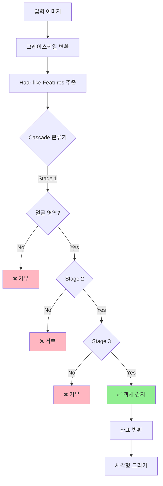

#### Cascade 파라미터 설명

| 파라미터 | 설명 | 권장값 | 효과 |
|---------|------|--------|------|
| **scaleFactor** | 이미지 축소 비율 | 1.1 - 1.3 | 낮을수록 정확, 느림 |
| **minNeighbors** | 최소 이웃 개수 | 3 - 7 | 높을수록 정확, 오검출 감소 |
| **minSize** | 최소 객체 크기 | (30, 30) | 작을수록 작은 객체 감지 |
| **maxSize** | 최대 객체 크기 | None | 큰 객체만 감지 시 설정 |

#### 객체 감지 코드

```python
def detect_objects(cascade, gray_image):
    """
    Haar Cascade를 사용하여 객체를 감지합니다.
    
    Returns:
        numpy.ndarray: 감지된 객체의 좌표 배열 [(x, y, w, h), ...]
    """
    objects = cascade.detectMultiScale(
        gray_image,
        scaleFactor=1.1,      # 이미지 축소 비율
        minNeighbors=5,       # 최소 이웃 개수 (오검출 방지)
        minSize=(30, 30)      # 최소 객체 크기
    )
    return objects
```

#### 실습 과제

1. ✅ **기본**: 제공된 cascade.xml로 객체 감지 테스트
2. ✅ **중급**: 파라미터 튜닝으로 정확도 향상
3. ✅ **고급**: 여러 객체 동시 감지 및 추적

---

### Step 4: 자율주행 + 표지판 감지 통합

**파일**: `3_object_autoplot___rgb_filter.py`

#### 학습 목표
- Early If 패턴 적용
- 표지판 감지 우선 처리
- 자율주행 로직 통합

#### Early If 패턴 실행 흐름

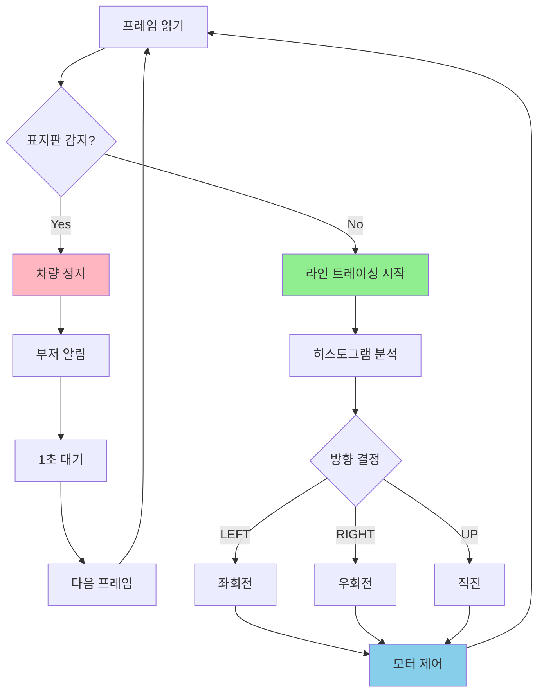

#### Early If 패턴의 장점

| 항목 | 일반 패턴 | Early If 패턴 | 개선 효과 |
|------|----------|--------------|----------|
| **코드 가독성** | 중첩 if문 많음 | 명확한 흐름 | ⬆️⬆️⬆️ |
| **성능** | 모든 조건 검사 | 조기 종료 | ⬆️⬆️ |
| **유지보수** | 복잡함 | 간단함 | ⬆️⬆️⬆️ |
| **버그 발생률** | 높음 | 낮음 | ⬇️⬇️⬇️ |

#### 핵심 코드: Early If 패턴

```python
# 메인 루프 내부
while True:
    # 1. 프레임 읽기
    ret, frame = cap.read()
    if not ret:
        print("프레임 읽기 실패")
        continue
    
    # 2. ⭐ Early If: 표지판 감지 먼저 체크
    stop_detected, no_drive_detected, sign_frame = detect_traffic_signs(
        frame, r_weight, g_weight, b_weight
    )
    
    # 3. 표지판이 있으면: 정지 → 부저 → 대기 → 다음 루프
    if stop_detected or no_drive_detected:
        cv2.imshow("Sign_Detection", sign_frame)
        
        # 차량 즉시 정지
        car_stop()
        
        # 부저 울리기
        if USE_BEEP:
            beep_for_sign_detection()
        
        # 디버그 메시지
        if stop_detected:
            print("🛑 STOP 표지판 감지! 1초 정지...")
        if no_drive_detected:
            print("🚫 통행금지 표지판 감지! 1초 정지...")
        
        # 1초 대기
        time.sleep(1)
        
        # ⭐ 다음 루프로 (자율주행 건너뛰기)
        continue
    
    # 4. ⭐ 표지판 없을 경우: 정상 자율주행
    # RGB 가중치 적용하여 프레임 처리
    processed_frame = process_frame(
        frame, detect_value, roi_top_y, roi_bottom_y,
        r_weight, g_weight, b_weight
    )
    
    # 히스토그램 분석
    histogram = np.sum(processed_frame, axis=0)
    
    # 방향 결정
    direction, hist_left, hist_center, hist_right = decide_direction(
        histogram, direction_threshold, up_threshold,
        detect_value, roi_top_y, roi_bottom_y
    )
    
    # 차량 제어
    control_car(direction, motor_up_speed, motor_down_speed)
```

#### 히스토그램 3등분 분석

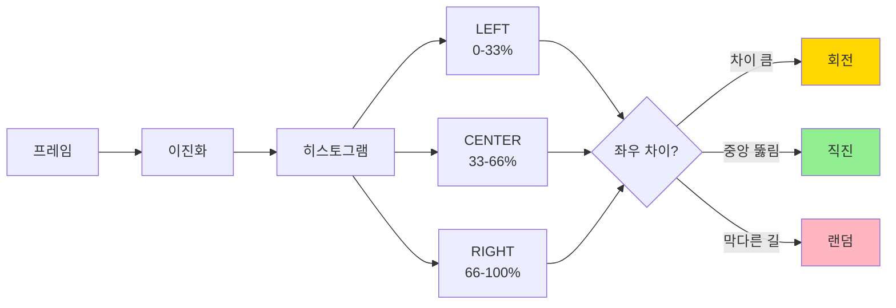

#### 실습 과제

1. ✅ **기본**: 표지판 감지 시 정지 동작 확인
2. ✅ **중급**: 여러 표지판 동시 처리
3. ✅ **고급**: 표지판 거리에 따른 동작 변경

---

## 🛠️ Haar Cascade XML 제작

### 학습 데이터 준비

#### Step 1: 이미지 수집

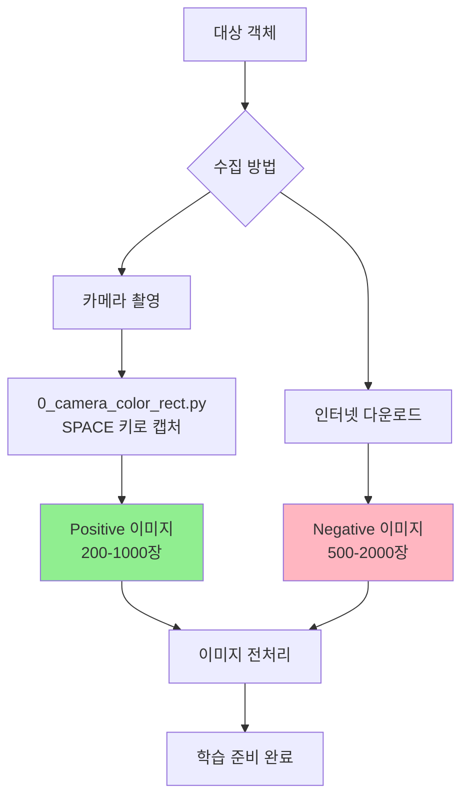

#### Positive vs Negative 이미지

| 구분 | 설명 | 예시 | 권장 수량 |
|------|------|------|----------|
| **Positive** | 감지하려는 객체가 **있는** 이미지 | 정지 표지판, 신호등 등 | 200-1000장 |
| **Negative** | 감지하려는 객체가 **없는** 이미지 | 도로, 벽, 하늘 등 | 500-2000장 |

#### Step 2: 이미지 전처리

```bash
# 1. Positive 이미지 저장 (0_camera_color_rect.py 사용)
cd ~/project_demo/04_cascade
python3 0_camera_color_rect.py

# SPACE 키를 눌러 이미지 캡처
# → ./positive/rect/ 폴더에 저장됨

# 2. 이미지 크기 조정 (권장: 50x50 ~ 100x100)
# 파이썬 스크립트로 일괄 처리
```

#### 이미지 수집 가이드라인

1. **✅ 다양한 각도**: 정면, 측면, 45도 등
2. **✅ 다양한 거리**: 가까이, 중간, 멀리
3. **✅ 다양한 조명**: 밝음, 어두움, 실내, 실외
4. **✅ 배경 다양화**: 여러 환경에서 촬영
5. **❌ 흐릿한 이미지**: 제외
6. **❌ 너무 작은 객체**: 최소 30x30 픽셀 이상

### OpenCV Cascade Trainer GUI 사용

#### 프로그램 다운로드

```bash
# Windows용 설치 파일 위치
# program/CascadeTrainerGUI_3.3.1_x64_Setup.exe (64비트)
# program/CascadeTrainerGUI_3.3.1_x86_Setup.exe (32비트)
```

#### 학습 프로세스

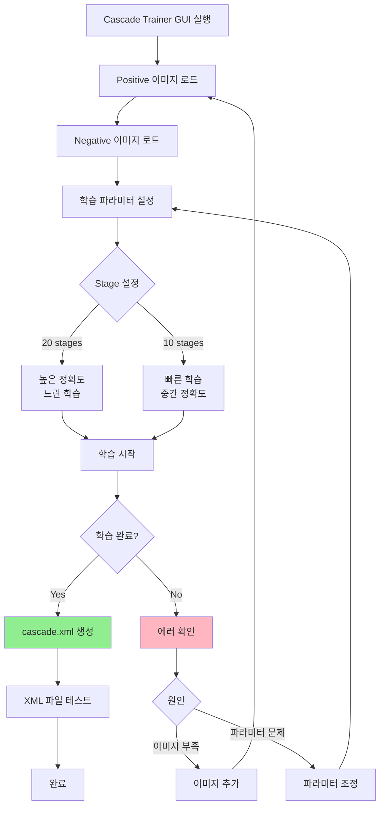

#### 학습 파라미터 설정

| 파라미터 | 설명 | 권장값 (초보자) | 권장값 (고급) |
|---------|------|----------------|--------------|
| **numStages** | 학습 단계 수 | 10 | 20 |
| **numPos** | Positive 샘플 수 | 200 | 1000 |
| **numNeg** | Negative 샘플 수 | 500 | 2000 |
| **width** | 샘플 너비 | 24 | 48 |
| **height** | 샘플 높이 | 24 | 48 |
| **minHitRate** | 최소 적중률 | 0.995 | 0.999 |
| **maxFalseAlarm** | 최대 오경보율 | 0.5 | 0.4 |

#### 예상 학습 시간

| 샘플 수 | Stages | 예상 시간 |
|---------|--------|----------|
| 200 / 500 | 10 | 30분 - 1시간 |
| 500 / 1000 | 15 | 2시간 - 4시간 |
| 1000 / 2000 | 20 | 6시간 - 12시간 |

### XML 파일 테스트

```python
# cascade.xml 테스트 코드
import cv2

# XML 파일 로드
cascade = cv2.CascadeClassifier('cascade.xml')

# 로드 확인
if cascade.empty():
    print("❌ XML 파일 로드 실패!")
else:
    print("✅ XML 파일 로드 성공!")
    
    # 테스트 이미지로 검증
    test_image = cv2.imread('test.jpg')
    gray = cv2.cvtColor(test_image, cv2.COLOR_BGR2GRAY)
    
    # 객체 감지
    objects = cascade.detectMultiScale(
        gray,
        scaleFactor=1.1,
        minNeighbors=5,
        minSize=(30, 30)
    )
    
    print(f"감지된 객체 수: {len(objects)}")
    
    # 결과 표시
    for (x, y, w, h) in objects:
        cv2.rectangle(test_image, (x, y), (x+w, y+h), (0, 255, 0), 2)
    
    cv2.imshow('Result', test_image)
    cv2.waitKey(0)
```

---

## ⚡ 고급 기능: 멀티스레드

### 왜 멀티스레드가 필요한가?

#### 단일 스레드의 문제점

```mermaid
gantt
    title 단일 스레드 처리 (순차 실행)
    dateFormat X
    axisFormat %L ms
    
    section Frame 1
    프레임 읽기: 0, 10
    표지판 감지: 10, 40
    라인 처리: 40, 70
    차량 제어: 70, 80
    
    section Frame 2
    프레임 읽기: 80, 90
    표지판 감지: 90, 120
    라인 처리: 120, 150
    차량 제어: 150, 160
```

**총 처리 시간**: 160ms → **FPS: 6.25**

#### 멀티스레드의 장점

```mermaid
gantt
    title 멀티스레드 처리 (병렬 실행)
    dateFormat X
    axisFormat %L ms
    
    section 메인
    프레임 읽기: 0, 10
    차량 제어: 10, 20
    프레임 읽기: 20, 30
    차량 제어: 30, 40
    
    section 스레드1
    표지판 감지: 0, 30
    표지판 감지: 30, 60
    
    section 스레드2
    라인 처리: 0, 30
    라인 처리: 30, 60
```

**총 처리 시간**: 60ms → **FPS: 16.67**

### 성능 비교표

| 항목 | 단일 스레드 | 멀티스레드 | 개선율 |
|------|------------|-----------|--------|
| **FPS** | 6-10 | 15-25 | **⬆️ 150-250%** |
| **CPU 사용률** | 25-40% | 60-80% | ⬆️ |
| **응답 속도** | 느림 | 빠름 | **⬆️⬆️⬆️** |
| **복잡도** | 낮음 | 높음 | ⬇️ |

### 멀티스레드 구현 방법

#### 방법 1: threading 모듈 사용

```python
import threading
import queue

# 결과 저장용 큐
sign_queue = queue.Queue(maxsize=1)
line_queue = queue.Queue(maxsize=1)

# 표지판 감지 스레드
def sign_detection_thread(frame_queue):
    while True:
        if not frame_queue.empty():
            frame = frame_queue.get()
            
            # 표지판 감지 (시간 소요 작업)
            result = detect_traffic_signs(frame)
            
            # 결과 저장 (최신 결과만 유지)
            if sign_queue.full():
                try:
                    sign_queue.get_nowait()
                except queue.Empty:
                    pass
            sign_queue.put(result)

# 라인 트레이싱 스레드
def line_tracing_thread(frame_queue):
    while True:
        if not frame_queue.empty():
            frame = frame_queue.get()
            
            # 라인 처리 (시간 소요 작업)
            result = process_line_tracing(frame)
            
            # 결과 저장
            if line_queue.full():
                try:
                    line_queue.get_nowait()
                except queue.Empty:
                    pass
            line_queue.put(result)

# 메인 루프
frame_queue = queue.Queue(maxsize=2)

# 스레드 시작
sign_thread = threading.Thread(target=sign_detection_thread, args=(frame_queue,), daemon=True)
line_thread = threading.Thread(target=line_tracing_thread, args=(frame_queue,), daemon=True)

sign_thread.start()
line_thread.start()

while True:
    # 프레임 읽기 (빠름)
    ret, frame = cap.read()
    
    # 프레임을 양쪽 스레드에 전달
    if not frame_queue.full():
        frame_queue.put(frame)
    
    # 최신 결과 가져오기
    if not sign_queue.empty():
        sign_result = sign_queue.get()
    
    if not line_queue.empty():
        line_result = line_queue.get()
    
    # 차량 제어 (빠름)
    control_car(sign_result, line_result)
```

#### 방법 2: multiprocessing 모듈 사용

```python
from multiprocessing import Process, Queue, Event

# 더 강력한 병렬 처리 (GIL 제약 없음)
# CPU 코어를 완전히 활용 가능
```

### 동기화 및 이벤트 처리

#### 이벤트 기반 제어

```python
import threading

# 이벤트 정의
stop_event = threading.Event()
sign_detected_event = threading.Event()

# 표지판 감지 스레드
def sign_detection_thread():
    while not stop_event.is_set():
        # 표지판 감지
        if detect_sign():
            # 이벤트 발생
            sign_detected_event.set()
        else:
            # 이벤트 해제
            sign_detected_event.clear()
        
        time.sleep(0.05)

# 메인 루프
while True:
    # 표지판 감지 이벤트 확인
    if sign_detected_event.is_set():
        # 차량 정지
        car_stop()
        print("표지판 감지 - 정지")
    else:
        # 정상 주행
        control_car_normal()
    
    # ESC 키 누르면 모든 스레드 종료
    if cv2.waitKey(30) == 27:
        stop_event.set()
        break
```

#### 멀티스레드 아키텍처

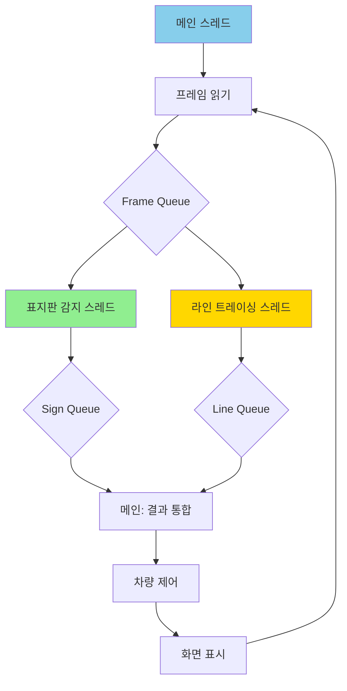

---

## 🎮 최종 미션

### 미션 1: 표지판 인식 자율주행

#### 미션 목표
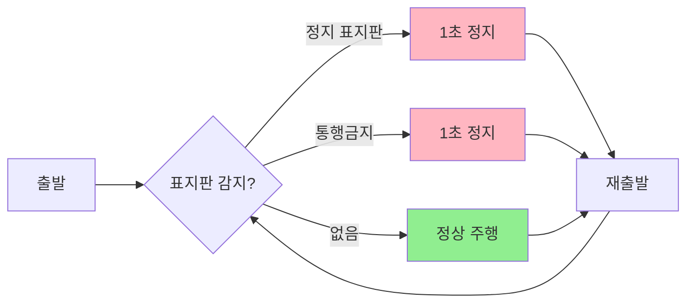

#### 구현 요구사항

| 항목 | 요구사항 | 배점 |
|------|---------|------|
| **표지판 감지** | Stop, No Drive 2종류 | 30점 |
| **정지 동작** | 감지 시 즉시 정지 | 20점 |
| **부저 알림** | 감지 시 부저 울림 | 10점 |
| **재출발** | 1초 후 자동 재출발 | 20점 |
| **정상 주행** | 표지판 없을 때 라인 트레이싱 | 20점 |
| **총점** | - | **100점** |

#### 제공 파일
- `xml/stop.xml` - 정지 표지판 분류기
- `xml/no_drive.xml` - 통행금지 표지판 분류기

---

### 미션 2: O/X 마커 인식

#### 미션 목표
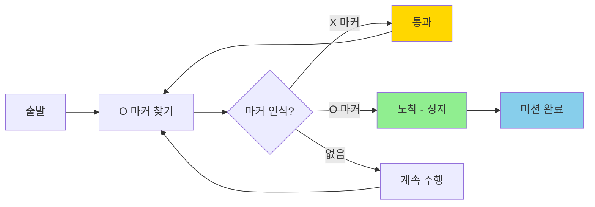

#### 구현 과제

1. **XML 제작**: O/X 마커용 Haar Cascade 학습
   - O 마커 (원형): 200장 이상
   - X 마커 (X자형): 200장 이상

2. **감지 로직**:
   ```python
   def detect_markers(frame):
       # O 마커 감지
       o_markers = o_cascade.detectMultiScale(gray)
       
       # X 마커 감지
       x_markers = x_cascade.detectMultiScale(gray)
       
       # Early If 패턴
       if len(o_markers) > 0:
           # O 마커 발견: 미션 완료
           return "FINISH"
       
       if len(x_markers) > 0:
           # X 마커 발견: 통과
           return "PASS"
       
       # 마커 없음: 계속 주행
       return "CONTINUE"
   ```

3. **채점 기준**:

| 항목 | 요구사항 | 배점 |
|------|---------|------|
| **O 마커 XML** | 정확도 80% 이상 | 25점 |
| **X 마커 XML** | 정확도 80% 이상 | 25점 |
| **O 마커 도착** | 정확히 정지 | 25점 |
| **X 마커 통과** | 멈추지 않고 통과 | 15점 |
| **주행 안정성** | 라인 이탈 없이 주행 | 10점 |
| **총점** | - | **100점** |

---

### 미션 3: 신호등 인식

#### 미션 목표
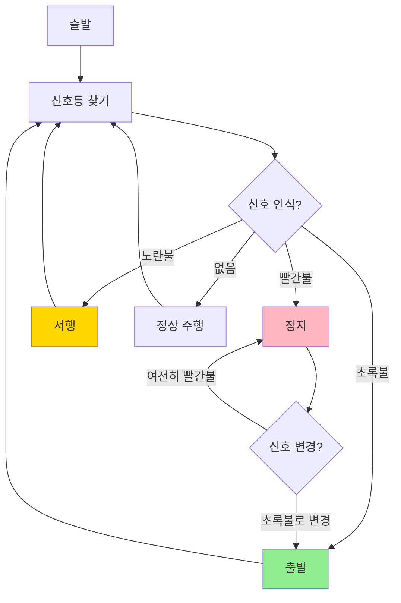

#### 신호등 색상 인식 방법

##### 방법 1: HSV 색상 범위 감지

```python
def detect_traffic_light_color(roi):
    """
    신호등 ROI 영역에서 색상 감지
    
    Args:
        roi: 신호등이 감지된 영역 (x, y, w, h)
    
    Returns:
        str: "RED", "YELLOW", "GREEN", "NONE"
    """
    # HSV 변환
    hsv = cv2.cvtColor(roi, cv2.COLOR_BGR2HSV)
    
    # 빨간색 범위 (HSV)
    lower_red1 = np.array([0, 100, 100])
    upper_red1 = np.array([10, 255, 255])
    lower_red2 = np.array([160, 100, 100])
    upper_red2 = np.array([180, 255, 255])
    
    mask_red1 = cv2.inRange(hsv, lower_red1, upper_red1)
    mask_red2 = cv2.inRange(hsv, lower_red2, upper_red2)
    mask_red = cv2.bitwise_or(mask_red1, mask_red2)
    
    # 초록색 범위
    lower_green = np.array([40, 100, 100])
    upper_green = np.array([80, 255, 255])
    mask_green = cv2.inRange(hsv, lower_green, upper_green)
    
    # 노란색 범위
    lower_yellow = np.array([20, 100, 100])
    upper_yellow = np.array([30, 255, 255])
    mask_yellow = cv2.inRange(hsv, lower_yellow, upper_yellow)
    
    # 픽셀 개수 계산
    red_pixels = cv2.countNonZero(mask_red)
    green_pixels = cv2.countNonZero(mask_green)
    yellow_pixels = cv2.countNonZero(mask_yellow)
    
    # 가장 많은 색상 반환
    max_pixels = max(red_pixels, green_pixels, yellow_pixels)
    
    if max_pixels < 100:  # 임계값 이하면 신호 없음
        return "NONE"
    
    if red_pixels == max_pixels:
        return "RED"
    elif green_pixels == max_pixels:
        return "GREEN"
    else:
        return "YELLOW"
```

##### 방법 2: 3개 영역 분할 감지

```python
def detect_traffic_light_position(roi):
    """
    신호등을 3등분하여 위치별 색상 감지
    (위: 빨강, 중간: 노랑, 아래: 초록)
    """
    h, w = roi.shape[:2]
    
    # 3등분
    top_roi = roi[0:h//3, :]
    mid_roi = roi[h//3:2*h//3, :]
    bottom_roi = roi[2*h//3:h, :]
    
    # 각 영역의 밝기 계산
    top_brightness = np.mean(cv2.cvtColor(top_roi, cv2.COLOR_BGR2GRAY))
    mid_brightness = np.mean(cv2.cvtColor(mid_roi, cv2.COLOR_BGR2GRAY))
    bottom_brightness = np.mean(cv2.cvtColor(bottom_roi, cv2.COLOR_BGR2GRAY))
    
    # 가장 밝은 영역 찾기
    max_brightness = max(top_brightness, mid_brightness, bottom_brightness)
    
    # 임계값 이상이면 신호 켜짐
    if max_brightness < 150:
        return "NONE"
    
    if top_brightness == max_brightness:
        return "RED"
    elif mid_brightness == max_brightness:
        return "YELLOW"
    else:
        return "GREEN"
```

#### 구현 과제

1. **XML 제작**: 신호등용 Haar Cascade 학습
   - 신호등 전체 모양 (원형 3개)
   - 다양한 조명 조건에서 촬영

2. **색상 감지 구현**: HSV 또는 위치 기반

3. **제어 로직**:

```python
while True:
    # 신호등 감지
    lights = light_cascade.detectMultiScale(gray)
    
    if len(lights) > 0:
        # 첫 번째 신호등 사용
        x, y, w, h = lights[0]
        roi = frame[y:y+h, x:x+w]
        
        # 색상 감지
        color = detect_traffic_light_color(roi)
        
        # Early If 패턴
        if color == "RED":
            car_stop()
            print("🔴 빨간불 - 정지")
            continue
        
        if color == "YELLOW":
            car_run(speed//2, speed//2)  # 서행
            print("🟡 노란불 - 서행")
            continue
        
        if color == "GREEN":
            car_run(speed, speed)
            print("🟢 초록불 - 출발")
    
    # 정상 주행
    line_tracing()
```

4. **채점 기준**:

| 항목 | 요구사항 | 배점 |
|------|---------|------|
| **신호등 감지** | 다양한 거리/각도에서 감지 | 20점 |
| **색상 인식** | 빨강/노랑/초록 정확히 구분 | 30점 |
| **빨간불 정지** | 완전히 정지 | 20점 |
| **초록불 출발** | 즉시 출발 | 15점 |
| **노란불 서행** | 속도 50% 감소 | 10점 |
| **오검출 없음** | 잘못된 신호 인식 없음 | 5점 |
| **총점** | - | **100점** |

---

## 🚀 실전 통합 미션

### 최종 코스 시나리오

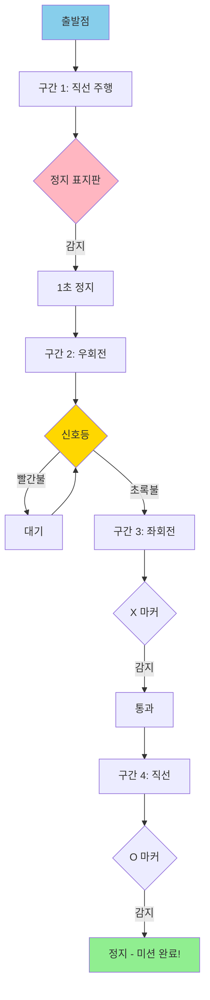

### 통합 시스템 아키텍처

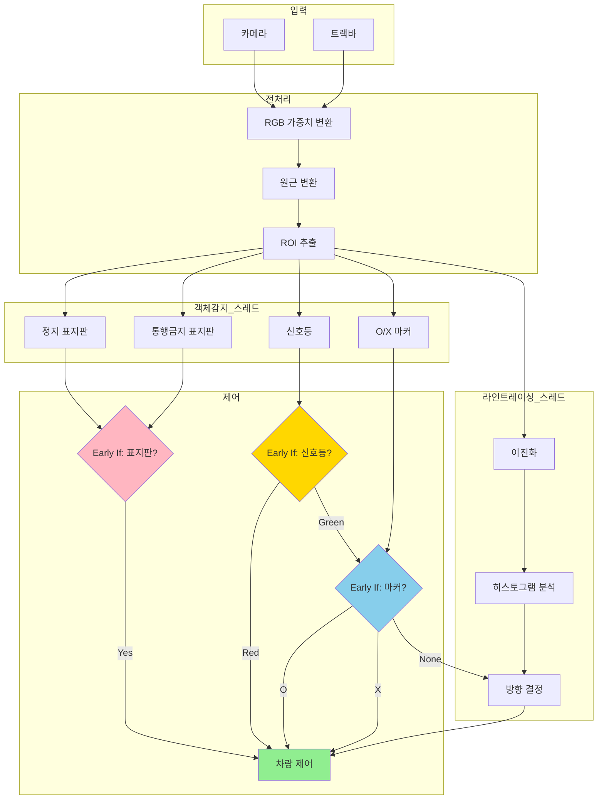

### 최종 코드 구조

```python
import threading
import queue

# ============================================
# 전역 변수 및 큐
# ============================================
sign_queue = queue.Queue(maxsize=1)
light_queue = queue.Queue(maxsize=1)
marker_queue = queue.Queue(maxsize=1)
line_queue = queue.Queue(maxsize=1)

stop_event = threading.Event()

# ============================================
# 스레드 1: 표지판 감지
# ============================================
def sign_detection_thread(frame_queue):
    while not stop_event.is_set():
        if not frame_queue.empty():
            frame = frame_queue.get()
            
            # 표지판 감지
            stop_detected, no_drive_detected = detect_traffic_signs(frame)
            
            result = {
                'stop': stop_detected,
                'no_drive': no_drive_detected
            }
            
            # 큐에 저장
            if sign_queue.full():
                sign_queue.get_nowait()
            sign_queue.put(result)

# ============================================
# 스레드 2: 신호등 감지
# ============================================
def traffic_light_thread(frame_queue):
    while not stop_event.is_set():
        if not frame_queue.empty():
            frame = frame_queue.get()
            
            # 신호등 색상 감지
            color = detect_traffic_light(frame)
            
            result = {'color': color}  # "RED", "YELLOW", "GREEN", "NONE"
            
            # 큐에 저장
            if light_queue.full():
                light_queue.get_nowait()
            light_queue.put(result)

# ============================================
# 스레드 3: O/X 마커 감지
# ============================================
def marker_detection_thread(frame_queue):
    while not stop_event.is_set():
        if not frame_queue.empty():
            frame = frame_queue.get()
            
            # 마커 감지
            marker_type = detect_markers(frame)  # "O", "X", "NONE"
            
            result = {'marker': marker_type}
            
            # 큐에 저장
            if marker_queue.full():
                marker_queue.get_nowait()
            marker_queue.put(result)

# ============================================
# 스레드 4: 라인 트레이싱
# ============================================
def line_tracing_thread(frame_queue):
    while not stop_event.is_set():
        if not frame_queue.empty():
            frame = frame_queue.get()
            
            # 라인 처리
            direction = process_line_tracing(frame)  # "LEFT", "RIGHT", "UP"
            
            result = {'direction': direction}
            
            # 큐에 저장
            if line_queue.full():
                line_queue.get_nowait()
            line_queue.put(result)

# ============================================
# 메인 루프
# ============================================
def main():
    # 프레임 큐 (각 스레드로 프레임 전달)
    frame_queues = [queue.Queue(maxsize=2) for _ in range(4)]
    
    # 스레드 시작
    threads = [
        threading.Thread(target=sign_detection_thread, args=(frame_queues[0],), daemon=True),
        threading.Thread(target=traffic_light_thread, args=(frame_queues[1],), daemon=True),
        threading.Thread(target=marker_detection_thread, args=(frame_queues[2],), daemon=True),
        threading.Thread(target=line_tracing_thread, args=(frame_queues[3],), daemon=True)
    ]
    
    for t in threads:
        t.start()
    
    # 초기값
    sign_result = {'stop': False, 'no_drive': False}
    light_result = {'color': 'NONE'}
    marker_result = {'marker': 'NONE'}
    line_result = {'direction': 'UP'}
    
    mission_complete = False
    
    while not mission_complete:
        # 프레임 읽기
        ret, frame = cap.read()
        if not ret:
            break
        
        # 모든 스레드에 프레임 전달
        for q in frame_queues:
            if not q.full():
                q.put(frame.copy())
        
        # 최신 결과 가져오기
        if not sign_queue.empty():
            sign_result = sign_queue.get()
        
        if not light_queue.empty():
            light_result = light_queue.get()
        
        if not marker_queue.empty():
            marker_result = marker_queue.get()
        
        if not line_queue.empty():
            line_result = line_queue.get()
        
        # ============================================
        # Early If 패턴: 우선순위 기반 제어
        # ============================================
        
        # 1. 최우선: O 마커 → 미션 완료
        if marker_result['marker'] == 'O':
            car_stop()
            print("🎯 O 마커 도착 - 미션 완료!")
            mission_complete = True
            continue
        
        # 2. 표지판 감지 → 1초 정지
        if sign_result['stop'] or sign_result['no_drive']:
            car_stop()
            if sign_result['stop']:
                print("🛑 정지 표지판 - 1초 정지")
            else:
                print("🚫 통행금지 표지판 - 1초 정지")
            
            beep_for_sign()
            time.sleep(1)
            continue
        
        # 3. 신호등 빨간불 → 정지
        if light_result['color'] == 'RED':
            car_stop()
            print("🔴 빨간불 - 대기 중...")
            continue
        
        # 4. X 마커 → 통과 (로그만 출력)
        if marker_result['marker'] == 'X':
            print("❌ X 마커 통과")
        
        # 5. 신호등 노란불 → 서행
        if light_result['color'] == 'YELLOW':
            car_run(speed//2, speed//2)
            print("🟡 노란불 - 서행")
            continue
        
        # 6. 기본: 라인 트레이싱
        direction = line_result['direction']
        
        if direction == 'UP':
            car_run(speed, speed)
        elif direction == 'LEFT':
            car_left(speed_down, speed_up)
        elif direction == 'RIGHT':
            car_right(speed_up, speed_down)
        
        # 키 입력 처리
        key = cv2.waitKey(30) & 0xFF
        if key == 27:  # ESC
            stop_event.set()
            break
    
    # 정리
    stop_event.set()
    for t in threads:
        t.join(timeout=1.0)
    
    cleanup()

if __name__ == "__main__":
    main()
```

---

## 🔧 문제 해결 가이드

### 자주 발생하는 문제

| 문제 | 원인 | 해결 방법 |
|------|------|----------|
| **표지판이 감지되지 않음** | XML 파일 경로 오류 | 절대 경로 사용 확인 |
| **오검출이 많음** | minNeighbors 값이 낮음 | 5 → 7로 증가 |
| **FPS가 낮음** | 단일 스레드 처리 | 멀티스레드 적용 |
| **서보 모터가 안 움직임** | 각도 범위 초과 | 0-180도 확인 |
| **카메라가 안 켜짐** | 다른 프로그램에서 사용 중 | 프로세스 종료 후 재시도 |

### 디버깅 팁

```python
# 1. 감지 결과 시각화
def debug_detection(frame, objects, label):
    for (x, y, w, h) in objects:
        cv2.rectangle(frame, (x, y), (x+w, y+h), (0, 255, 0), 2)
        cv2.putText(frame, label, (x, y-10), 
                    cv2.FONT_HERSHEY_SIMPLEX, 0.5, (0, 255, 0), 2)
    return frame

# 2. FPS 측정
start_time = time.time()
frame_count = 0

while True:
    frame_count += 1
    
    if frame_count % 30 == 0:
        elapsed = time.time() - start_time
        fps = 30 / elapsed
        print(f"FPS: {fps:.2f}")
        start_time = time.time()

# 3. 큐 상태 모니터링
print(f"Sign Queue: {sign_queue.qsize()}")
print(f"Light Queue: {light_queue.qsize()}")
print(f"Marker Queue: {marker_queue.qsize()}")
```

---

## 📚 참고 자료

### OpenCV 공식 문서
- [Cascade Classifier Tutorial](https://docs.opencv.org/master/db/d28/tutorial_cascade_classifier.html)
- [Object Detection](https://docs.opencv.org/master/d5/d54/group__objdetect.html)

### Haar Cascade 학습 도구
- [Cascade Trainer GUI](https://amin-ahmadi.com/cascade-trainer-gui/)
- [opencv_traincascade 명령어](https://docs.opencv.org/3.4/dc/d88/tutorial_traincascade.html)

### Python 멀티스레딩
- [Threading 모듈](https://docs.python.org/3/library/threading.html)
- [Queue 모듈](https://docs.python.org/3/library/queue.html)

---

## ✅ 체크리스트

### 학습 완료 체크리스트

- [ ] Step 1: 카메라 설정 및 서보 제어 완료
- [ ] Step 2: RGB 가중치 필터링 이해 및 적용
- [ ] Step 3: Haar Cascade 객체 감지 성공
- [ ] Step 4: 자율주행 + 표지판 통합 완료
- [ ] Step 5: 멀티스레드 구현 및 FPS 향상
- [ ] 미션 1: 표지판 인식 자율주행 성공
- [ ] 미션 2: O/X 마커 인식 완료
- [ ] 미션 3: 신호등 인식 및 제어 완료
- [ ] 최종 통합 미션 성공

### 파일 제출 체크리스트

- [ ] `cascade_stop.xml` - 정지 표지판 분류기
- [ ] `cascade_no_drive.xml` - 통행금지 분류기
- [ ] `cascade_traffic_light.xml` - 신호등 분류기
- [ ] `cascade_marker_o.xml` - O 마커 분류기
- [ ] `cascade_marker_x.xml` - X 마커 분류기
- [ ] `final_autoplot.py` - 최종 통합 코드
- [ ] `report.md` - 학습 보고서

---

## 🎓 학습 후기 작성

학습을 완료한 후, 다음 질문에 답변해주세요:

1. **가장 어려웠던 부분은?**
2. **Haar Cascade의 장단점은?**
3. **멀티스레드 적용 전후 FPS 비교**
4. **실전 미션에서 발생한 문제와 해결 방법**
5. **추가로 구현하고 싶은 기능**

---

**작성일**: 2025-12-02  
**버전**: v1.0  
**작성자**: Raspbot v2 교육팀

---

**🚗 Happy Learning & Driving! 🎓**

