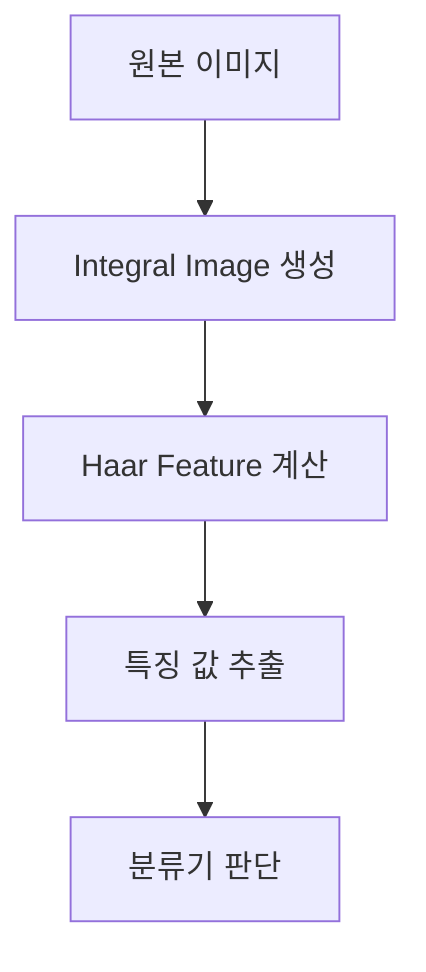
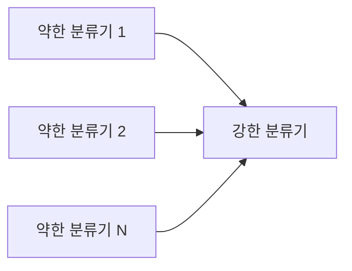
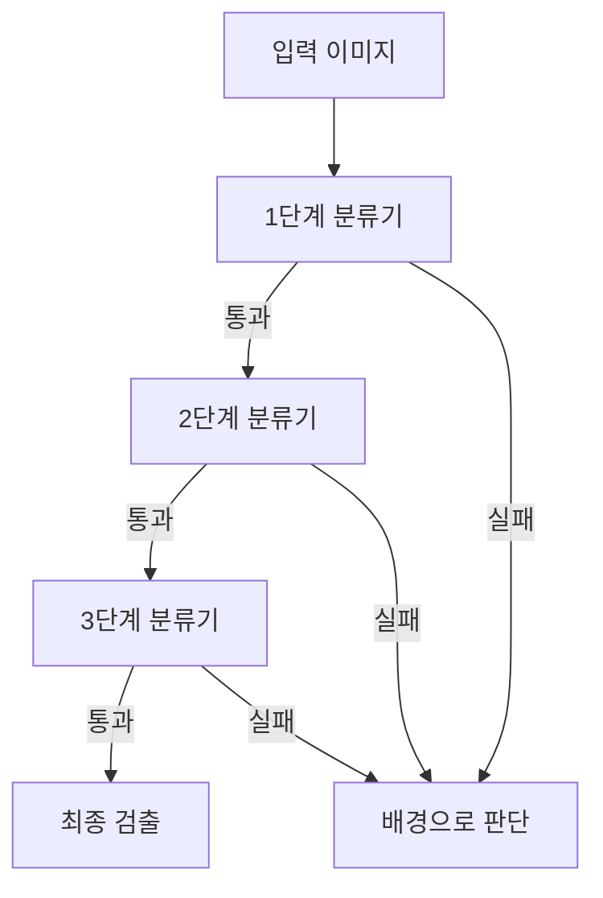
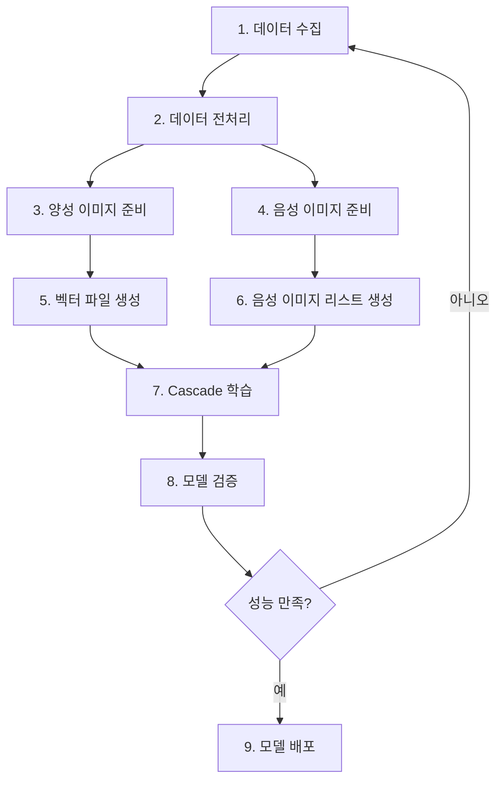
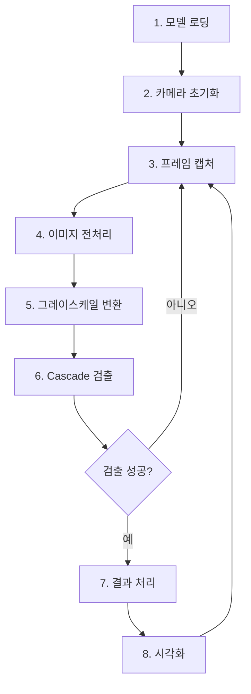
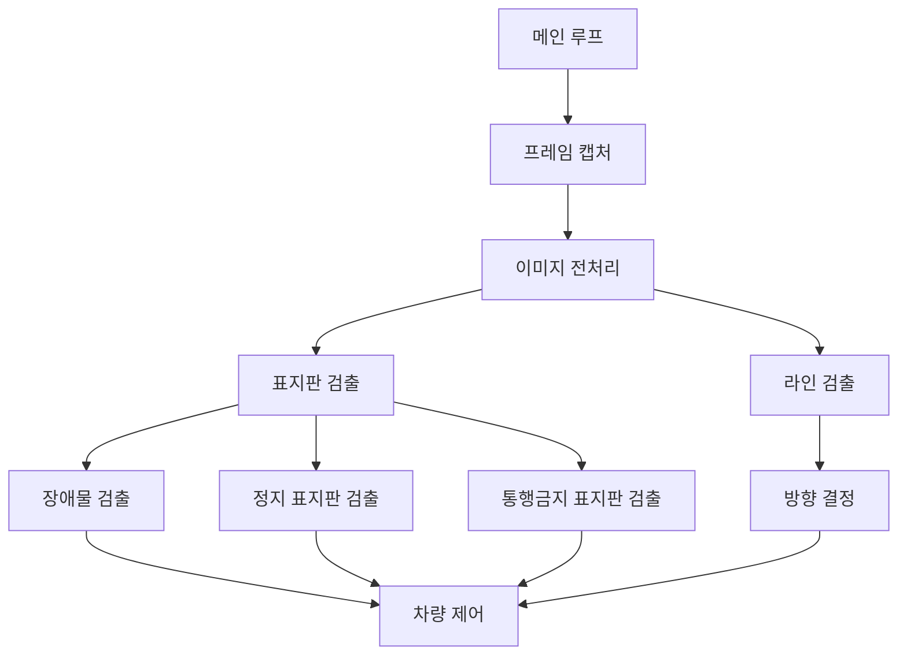
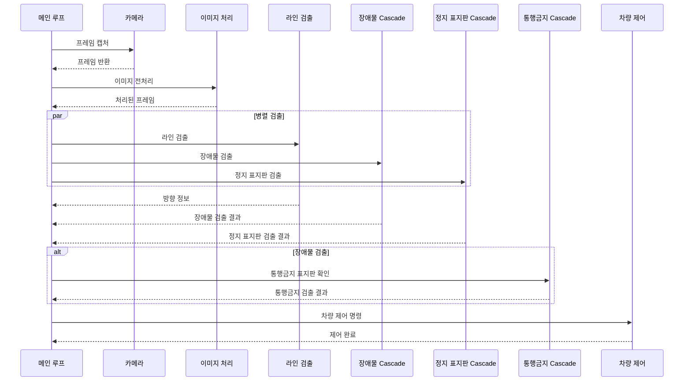
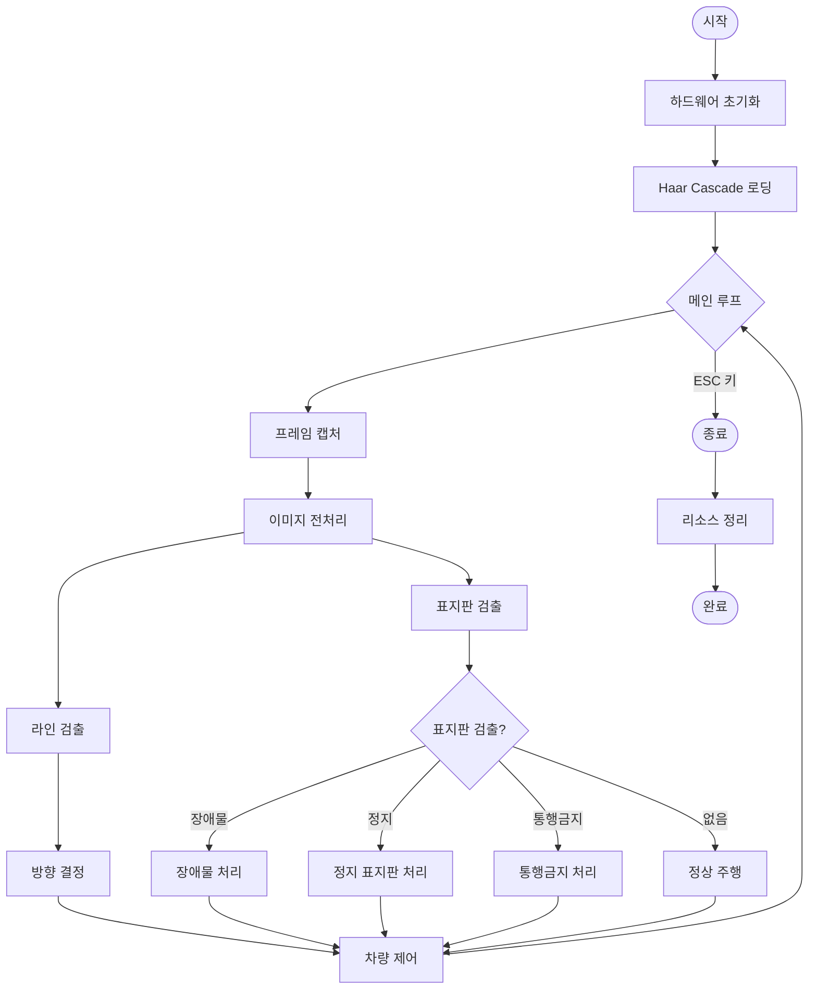
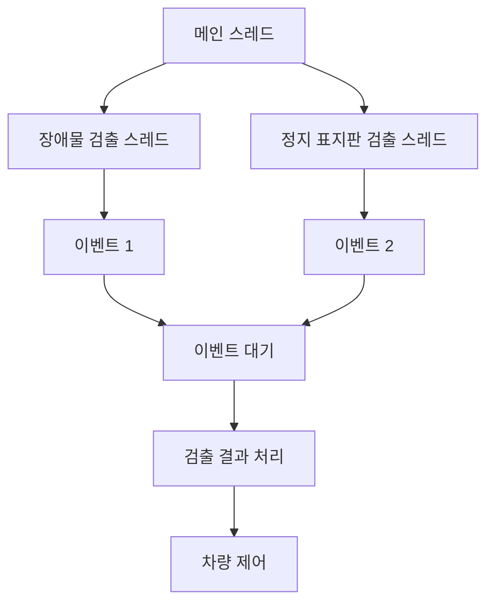

# Haar Cascade 기반 객체 검출 가이드

## 📋 목차

1. [Haar Cascade란?](#haar-cascade란)
2. [왜 Haar Cascade를 사용하는가?](#왜-haar-cascade를-사용하는가)
3. [Haar Cascade의 장단점](#haar-cascade의-장단점)
4. [제한적인 테스트 환경에서의 장점](#제한적인-테스트-환경에서의-장점)
5. [Haar Cascade 물체 감지 원리](#haar-cascade-물체-감지-원리)
6. [모델 생성 시 주의할 점](#모델-생성-시-주의할-점)
7. [모델 생성 과정](#모델-생성-과정)
8. [모델 적용 과정](#모델-적용-과정)
9. [소스 코드 분석](#소스-코드-분석)
10. [시스템 동작 흐름](#시스템-동작-흐름)

---

## Haar Cascade란?

**Haar Cascade**는 Paul Viola와 Michael Jones가 2001년에 제안한 객체 검출 알고리즘입니다. OpenCV에서 제공하는 강력한 머신러닝 기반 객체 검출 방법으로, 특히 얼굴, 표지판, 장애물 등 특정 패턴을 가진 객체를 실시간으로 검출하는 데 효과적입니다.

### 핵심 개념
- **Haar Feature**: 이미지의 밝기 차이를 이용한 특징 추출
- **Cascade Classifier**: 여러 단계의 약한 분류기(Weak Classifier)를 결합한 강한 분류기(Strong Classifier)
- **Integral Image**: 빠른 특징 계산을 위한 전처리 기법

---

## 왜 Haar Cascade를 사용하는가?

### 1. 실시간 처리 성능
- **빠른 검출 속도**: 딥러닝 모델 대비 매우 빠른 처리 속도
- **낮은 계산 자원**: CPU만으로도 실시간 검출 가능
- **경량 모델**: XML 파일 형태로 저장되어 메모리 사용량이 적음

### 2. 제한된 하드웨어 환경에 적합
- **Raspberry Pi 같은 임베디드 시스템**에서도 실시간 동작 가능
- **GPU 없이도** 충분한 성능 제공
- **배터리 효율**: 낮은 전력 소비

### 3. 간단한 구현 및 유지보수
- **OpenCV 기본 제공**: 추가 라이브러리 설치 불필요
- **명확한 파라미터**: `scaleFactor`, `minNeighbors` 등 직관적인 조정 가능
- **디버깅 용이**: 중간 단계 확인이 쉬움

---

## Haar Cascade의 장단점

### ✅ 장점

1. **속도**
   - 실시간 검출 가능 (30+ FPS)
   - 딥러닝 모델 대비 10~100배 빠름

2. **경량성**
   - 모델 파일 크기가 작음 (수 KB ~ 수 MB)
   - 메모리 사용량이 적음

3. **실용성**
   - 제한된 환경에서도 동작
   - 여러 개의 Cascade를 동시에 사용 가능

4. **안정성**
   - 검증된 알고리즘 (20년 이상 사용)
   - 다양한 환경에서 테스트됨

### ❌ 단점

1. **정확도**
   - 딥러닝 모델 대비 정확도가 낮음
   - 복잡한 객체나 다양한 각도에서 성능 저하

2. **학습 데이터 의존성**
   - 좋은 학습 데이터가 필요함
   - 다양한 환경에서의 일반화가 어려움

3. **조명 및 환경 민감도**
   - 조명 변화에 민감
   - 배경과의 대비가 중요

4. **회전 및 스케일**
   - 회전된 객체 검출이 어려움
   - 스케일 변화에 대한 대응이 제한적

---

## 제한적인 테스트 환경에서의 장점

본 프로젝트의 경우, **제한적인 테스트 환경**에서 Haar Cascade를 사용하는 것이 매우 적합합니다:

### 1. 작은 프로세스로 물체 인지
- **경량 처리**: Raspberry Pi 같은 제한된 하드웨어에서도 부드러운 동작
- **빠른 반응**: 실시간 자율주행에 필요한 즉각적인 반응 속도

### 2. 속도 면에서의 우위
- **낮은 지연시간**: 딥러닝 모델의 추론 시간(수백 ms) 대비 매우 빠름(수십 ms)
- **높은 FPS**: 안정적인 프레임 레이트 유지

### 3. 여러 개의 Haar Cascade 동시 사용 가능
- **병렬 처리**: 여러 표지판(정지, 통행금지, 장애물)을 동시에 검출
- **스레드 활용**: 멀티스레드로 성능 저하 없이 여러 검출기 동시 실행
- **모듈화**: 각 표지판별로 독립적인 Cascade 사용

### 4. 제한된 환경에서의 실용성
- **일정한 조명 조건**: 테스트 환경의 조명이 일정하면 성능이 안정적
- **명확한 표지판**: 테스트용 표지판이 명확하면 검출률이 높음
- **빠른 프로토타이핑**: 모델 학습 및 적용이 상대적으로 빠름

---

## Haar Cascade 물체 감지 원리

### 1. Haar Feature (하르 특징)

Haar Feature는 이미지의 특정 영역에서 밝기 차이를 계산하는 기본 단위입니다.



#### 주요 Haar Feature 유형

1. **Edge Features**: 수직/수평 엣지 검출
2. **Line Features**: 선 형태 검출
3. **Center-surround Features**: 중심-주변 대비 검출

### 2. Integral Image (적분 이미지)

빠른 특징 계산을 위한 전처리 기법입니다.

```
Integral Image(x,y) = Σ I(i,j)  (i≤x, j≤y)
```

- **목적**: 임의의 사각형 영역의 픽셀 합을 O(1) 시간에 계산
- **효과**: 특징 계산 속도 대폭 향상

### 3. AdaBoost 알고리즘

여러 약한 분류기를 결합하여 강한 분류기를 만듭니다.



### 4. Cascade 구조

단계적으로 검출을 수행하여 빠른 속도를 달성합니다.



- **Early Rejection**: 초기 단계에서 배경을 빠르게 제거
- **계단식 검증**: 객체일 가능성이 높은 영역만 상세 검증

### 5. Sliding Window 기법

이미지 전체를 스캔하여 객체를 검출합니다.

- **다중 스케일**: 다양한 크기의 윈도우로 검색
- **Overlap**: 겹치는 영역을 검색하여 누락 방지

---

## 모델 생성 시 주의할 점

### 1. 학습 데이터 준비

#### ✅ 양성 이미지 (Positive Images)
- **품질**: 고해상도, 선명한 이미지
- **다양성**: 다양한 각도, 조명, 배경
- **수량**: 최소 1000개 이상 권장
- **일관성**: 검출할 객체가 이미지 중앙에 위치
- **크기**: 모든 이미지가 동일한 크기 (권장: 24x24 또는 50x50)

#### ✅ 음성 이미지 (Negative Images)
- **다양성**: 검출할 객체가 없는 다양한 배경
- **수량**: 양성 이미지의 2~3배 권장
- **품질**: 실제 사용 환경과 유사한 이미지

### 2. 이미지 전처리

- **그레이스케일 변환**: 컬러 정보가 불필요한 경우
- **정규화**: 밝기 및 대비 조정
- **노이즈 제거**: 불필요한 노이즈 제거
- **크기 통일**: 모든 이미지 크기 통일

### 3. 파라미터 설정

#### `opencv_createsamples` 파라미터
- **-w, -h**: 검출 윈도우 크기 (24x24 권장)
- **-num**: 생성할 샘플 수
- **-vec**: 출력 벡터 파일명

#### `opencv_traincascade` 파라미터
- **-numPos**: 양성 샘플 수
- **-numNeg**: 음성 샘플 수
- **-numStages**: Cascade 단계 수 (10~20 권장)
- **-minHitRate**: 각 단계의 최소 적중률 (0.995 권장)
- **-maxFalseAlarmRate**: 최대 오탐률 (0.5 권장)
- **-w, -h**: 검출 윈도우 크기

### 4. 학습 시간 및 리소스

- **학습 시간**: 수 시간 ~ 수십 시간 소요 가능
- **메모리**: 충분한 RAM 필요 (8GB 이상 권장)
- **CPU**: 멀티코어 활용 가능

### 5. 검증 및 테스트

- **검증 세트**: 학습에 사용하지 않은 이미지로 테스트
- **다양한 조건**: 다양한 조명, 각도, 배경에서 테스트
- **성능 측정**: 정확도, 재현율, F1 스코어 측정

---

## 모델 생성 과정

### 단계별 모델 생성 프로세스



### 1단계: 데이터 수집

```bash
# 카메라로 표지판 이미지 촬영
# 다양한 각도, 조명 조건에서 촬영
# 최소 1000장 이상 수집 권장
```

### 2단계: 데이터 전처리

```python
import cv2
import os

def preprocess_images(input_dir, output_dir, target_size=(50, 50)):
    """
    이미지 전처리 함수
    - 크기 조정
    - 그레이스케일 변환
    - 정규화
    """
    os.makedirs(output_dir, exist_ok=True)
    
    for filename in os.listdir(input_dir):
        img_path = os.path.join(input_dir, filename)
        img = cv2.imread(img_path)
        
        # 그레이스케일 변환
        gray = cv2.cvtColor(img, cv2.COLOR_BGR2GRAY)
        
        # 크기 조정
        resized = cv2.resize(gray, target_size)
        
        # 저장
        output_path = os.path.join(output_dir, filename)
        cv2.imwrite(output_path, resized)
```

### 3단계: 양성 이미지 준비

```
positive_images/
├── stop_sign_001.jpg
├── stop_sign_002.jpg
├── stop_sign_003.jpg
└── ...
```

**요구사항:**
- 검출할 객체가 이미지 중앙에 위치
- 모든 이미지가 동일한 크기
- 배경이 최소화된 이미지

### 4단계: 음성 이미지 준비

```
negative_images/
├── background_001.jpg
├── background_002.jpg
├── background_003.jpg
└── ...
```

**요구사항:**
- 검출할 객체가 없는 이미지
- 다양한 배경 이미지
- 양성 이미지의 2~3배 수량

### 5단계: 벡터 파일 생성

```bash
# opencv_createsamples 사용
opencv_createsamples \
    -info positive_images/info.txt \
    -vec positive_samples.vec \
    -w 50 \
    -h 50 \
    -num 1000
```

**info.txt 형식:**
```
positive_images/stop_sign_001.jpg 1 0 0 50 50
positive_images/stop_sign_002.jpg 1 0 0 50 50
...
```

### 6단계: 음성 이미지 리스트 생성

```bash
# negative_images.txt 생성
find negative_images -name "*.jpg" > negative_images.txt
```

### 7단계: Cascade 학습

```bash
opencv_traincascade \
    -data cascade_model \
    -vec positive_samples.vec \
    -bg negative_images.txt \
    -numPos 800 \
    -numNeg 2000 \
    -w 50 \
    -h 50 \
    -numStages 15 \
    -minHitRate 0.995 \
    -maxFalseAlarmRate 0.5 \
    -weightTrimRate 0.95 \
    -maxDepth 1 \
    -maxWeakCount 100
```

**주요 파라미터 설명:**
- `-numPos`: 실제 사용할 양성 샘플 수 (전체의 80% 권장)
- `-numNeg`: 음성 샘플 수
- `-numStages`: Cascade 단계 수 (10~20 권장)
- `-minHitRate`: 각 단계의 최소 적중률
- `-maxFalseAlarmRate`: 최대 오탐률

### 8단계: 모델 검증

```python
import cv2

def test_cascade(cascade_path, test_images):
    """
    학습된 Cascade 모델 테스트
    """
    cascade = cv2.CascadeClassifier(cascade_path)
    
    if cascade.empty():
        print("모델 로딩 실패!")
        return
    
    correct = 0
    total = len(test_images)
    
    for img_path in test_images:
        img = cv2.imread(img_path)
        gray = cv2.cvtColor(img, cv2.COLOR_BGR2GRAY)
        
        detections = cascade.detectMultiScale(
            gray,
            scaleFactor=1.1,
            minNeighbors=5,
            minSize=(30, 30)
        )
        
        if len(detections) > 0:
            correct += 1
    
    accuracy = correct / total * 100
    print(f"정확도: {accuracy:.2f}%")
```

### 9단계: 모델 배포

```bash
# 생성된 모델 파일 확인
ls cascade_model/

# XML 파일을 프로젝트에 복사
cp cascade_model/cascade.xml ./xml/stop.xml
```

---

## 모델 적용 과정

### 단계별 모델 적용 프로세스



### 1단계: 모델 로딩

```python
import cv2

# Haar Cascade 모델 로드
cascade_path = "./xml/stop.xml"
cascade = cv2.CascadeClassifier(cascade_path)

# 모델 로딩 확인
if cascade.empty():
    print("⚠️  모델 로딩 실패!")
    sys.exit(1)
else:
    print("✅ 모델 로딩 완료")
```

### 2단계: 카메라 초기화

```python
# 카메라 초기화
cap = cv2.VideoCapture(0)

# 해상도 설정
cap.set(cv2.CAP_PROP_FRAME_WIDTH, 320)
cap.set(cv2.CAP_PROP_FRAME_HEIGHT, 240)

# 카메라 속성 설정
cap.set(cv2.CAP_PROP_BRIGHTNESS, 0)
cap.set(cv2.CAP_PROP_CONTRAST, 40)
```

### 3단계: 프레임 캡처

```python
ret, frame = cap.read()
if not ret:
    print("❌ 프레임 읽기 실패")
    break
```

### 4단계: 이미지 전처리

```python
def weighted_gray(image, r_weight, g_weight, b_weight):
    """
    가중 그레이스케일 변환
    RGB 채널에 가중치를 적용하여 그레이스케일 생성
    """
    r_weight /= 100.0
    g_weight /= 100.0
    b_weight /= 100.0
    
    return cv2.addWeighted(
        cv2.addWeighted(image[:, :, 2], r_weight, image[:, :, 1], g_weight, 0),
        1.0,
        image[:, :, 0],
        b_weight,
        0,
    )
```

### 5단계: 그레이스케일 변환

```python
# 가중 그레이스케일 변환 (RGB 가중치 적용)
gray = weighted_gray(frame, r_weight=30, g_weight=40, b_weight=60)

# 또는 일반 그레이스케일 변환
# gray = cv2.cvtColor(frame, cv2.COLOR_BGR2GRAY)
```

### 6단계: Cascade 검출

```python
def detect_objects(cascade, gray_frame):
    """
    Haar Cascade를 사용한 객체 검출
    """
    detections = cascade.detectMultiScale(
        gray_frame,
        scaleFactor=1.1,      # 이미지 스케일 축소 비율
        minNeighbors=5,        # 최소 이웃 수 (높을수록 정확하지만 검출률 감소)
        minSize=(30, 30),      # 최소 검출 크기
        maxSize=(300, 300)     # 최대 검출 크기 (선택사항)
    )
    return detections

# 검출 실행
objects = detect_objects(cascade, gray)
```

**주요 파라미터 설명:**

- **scaleFactor (1.1~1.3)**: 
  - 이미지를 축소하는 비율
  - 작을수록 정확하지만 느림
  - 1.1 권장

- **minNeighbors (3~6)**:
  - 검출된 영역 주변의 최소 이웃 수
  - 높을수록 오탐 감소, 검출률 감소
  - 5 권장

- **minSize**:
  - 검출할 객체의 최소 크기
  - 작은 객체는 무시하여 성능 향상

### 7단계: 결과 처리

```python
if len(objects) > 0:
    print(f"✅ {len(objects)}개의 객체 검출됨")
    
    for (x, y, w, h) in objects:
        # 검출된 객체의 좌표 및 크기
        center_x = x + w // 2
        center_y = y + h // 2
        
        # 차량 제어 로직
        if w * h > threshold:
            # 큰 객체는 정지
            car_stop()
```

### 8단계: 시각화

```python
def draw_detections(frame, detections, label="Object"):
    """
    검출된 객체에 사각형 및 텍스트 그리기
    """
    for (x, y, w, h) in detections:
        # 사각형 그리기
        cv2.rectangle(frame, (x, y), (x + w, y + h), (0, 255, 0), 3)
        
        # 텍스트 표시
        cv2.putText(
            frame,
            f"{label} ({w}x{h})",
            (x - 30, y - 10),
            cv2.FONT_HERSHEY_SIMPLEX,
            0.6,
            (255, 255, 0),
            2
        )
    
    return frame

# 시각화
frame_with_detections = draw_detections(frame, objects, "Stop Sign")
cv2.imshow("Detection Result", frame_with_detections)
```

---

## 소스 코드 분석

### 전체 시스템 구조



### 핵심 함수 분석

#### 1. Haar Cascade 로딩 (3단계)

```168:185:04_cascade/4_autoplot_harr_cascade.py
# Haar Cascade models 경로 설정
obstacle_cascade_path = "./xml/obstacle.xml"
stop_cascade_path = "./xml/stop.xml"
no_drive_cascade_path = "./xml/no_drive.xml"

# Haar Cascade models 로드
obstacle_cascade = cv2.CascadeClassifier(obstacle_cascade_path)
stop_cascade = cv2.CascadeClassifier(stop_cascade_path)
no_drive_cascade = cv2.CascadeClassifier(no_drive_cascade_path)

if obstacle_cascade.empty():
    print("⚠️  경고: obstacle.xml을 찾을 수 없습니다.")
if stop_cascade.empty():
    print("⚠️  경고: stop.xml을 찾을 수 없습니다.")
if no_drive_cascade.empty():
    print("⚠️  경고: no_drive.xml을 찾을 수 없습니다.")

print("✅ Haar Cascade 분류기 로딩 완료\n")
```

**동작 방식:**
- 3개의 독립적인 Cascade 모델을 로드
- 각 모델은 특정 표지판/장애물을 검출
- 모델 로딩 실패 시 경고 메시지 출력

#### 2. 가중 그레이스케일 변환 (5단계)

```252:263:04_cascade/4_autoplot_harr_cascade.py
def weighted_gray(image, r_weight, g_weight, b_weight):
    """가중 그레이스케일 변환"""
    r_weight /= 100.0
    g_weight /= 100.0
    b_weight /= 100.0
    return cv2.addWeighted(
        cv2.addWeighted(image[:, :, 2], r_weight, image[:, :, 1], g_weight, 0),
        1.0,
        image[:, :, 0],
        b_weight,
        0,
    )
```

**동작 방식:**
- RGB 채널에 가중치를 적용하여 그레이스케일 생성
- 환경에 따라 RGB 가중치를 조정하여 검출 성능 향상
- 기본값: R=30%, G=40%, B=60%

#### 3. 장애물 검출 함수 (9단계)

```511:544:04_cascade/4_autoplot_harr_cascade.py
def detect_obstacle(frame, control_signals, event, r_weight, g_weight, b_weight):
    """
    장애물 검출 함수

    처리 단계:
    1. 그레이스케일 변환
    2. Haar Cascade로 장애물 검출
    3. 검출 결과를 control_signals에 저장
    4. 장애물 검출 시 서보 모터 회전하여 통행금지 표지판 확인
    5. 이벤트 신호 전송
    """
    if obstacle_cascade.empty():
        print("⚠️  장애물 분류기 로딩 실패")
        event.set()
        return

    gray = weighted_gray(frame, r_weight, g_weight, b_weight)
    obstacles = obstacle_cascade.detectMultiScale(gray, scaleFactor=1.1, minNeighbors=5)

    for x, y, w, h in obstacles:
        cv2.rectangle(frame, (x, y), (x + w, y + h), (0, 255, 0), 2)

    control_signals["obstacle"] = len(obstacles) > 0
    if control_signals["obstacle"]:
        draw_rectangles_and_text(frame, obstacles, "obstacles")
        # 서보 모터 2를 85도로 회전하여 카메라 각도 조절
        rotate_servo(2, 85)
        time.sleep(1)
        # 카메라로부터 새로운 프레임을 받아옴
        ret, new_frame = cap.read()
        if ret:
            no_drive_sign(new_frame, control_signals, r_weight, g_weight, b_weight)

    event.set()
```

**동작 방식:**
1. 그레이스케일 변환
2. `detectMultiScale`로 장애물 검출
3. 검출 결과를 `control_signals` 딕셔너리에 저장
4. 장애물 검출 시 서보 모터를 회전시켜 통행금지 표지판 확인
5. 스레드 완료 신호 전송

#### 4. 정지 표지판 검출 함수 (9단계)

```569:590:04_cascade/4_autoplot_harr_cascade.py
def stop_sign(frame, control_signals, event, r_weight, g_weight, b_weight):
    """
    정지 표지판 검출 함수

    처리 단계:
    1. 그레이스케일 변환
    2. Haar Cascade로 정지 표지판 검출
    3. 검출 결과를 control_signals에 저장
    4. 이벤트 신호 전송
    """
    if stop_cascade.empty():
        print("⚠️  정지 표지판 분류기 로딩 실패")
        event.set()
        return

    gray = weighted_gray(frame, r_weight, g_weight, b_weight)
    stop_signs = stop_cascade.detectMultiScale(gray, scaleFactor=1.1, minNeighbors=5)
    control_signals["stop"] = len(stop_signs) > 0
    if control_signals["stop"]:
        draw_rectangles_and_text(frame, stop_signs, "stop_signs")

    event.set()
```

**동작 방식:**
- 독립적인 스레드에서 실행
- 정지 표지판 검출 시 `control_signals["stop"] = True` 설정
- 메인 루프에서 이 신호를 확인하여 차량 정지

#### 5. 메인 루프에서의 표지판 검출 (10단계)

```688:729:04_cascade/4_autoplot_harr_cascade.py
        # 표지판 검출 (스레드 사용)
        obstacle_event = threading.Event()
        stop_sign_event = threading.Event()

        detect_obstacle_thread = threading.Thread(
            target=detect_obstacle,
            args=(frame, control_signals, obstacle_event, r_weight, g_weight, b_weight),
        )
        stop_sign_thread = threading.Thread(
            target=stop_sign,
            args=(
                frame,
                control_signals,
                stop_sign_event,
                r_weight,
                g_weight,
                b_weight,
            ),
        )

        detect_obstacle_thread.start()
        stop_sign_thread.start()

        # 스레드 완료 대기
        obstacle_event.wait()
        stop_sign_event.wait()

        # 표지판에 따른 제어
        if control_signals["obstacle"]:
            if DEBUG_MODE:
                print("🚧 장애물 검출! 회피 중...")
        elif control_signals["no_drive"]:
            if DEBUG_MODE:
                print("🚫 통행금지 표지판 검출! 정지 중...")
            rotate_servo(2, 75)
            time.sleep(0.8)
            beep_sound()
            car_stop()
        elif control_signals["stop"]:
            if DEBUG_MODE:
                print("🛑 정지 표지판 검출! 정지 중...")
            car_stop()
```

**동작 방식:**
1. **병렬 검출**: 장애물과 정지 표지판을 동시에 검출
2. **이벤트 기반 동기화**: 각 스레드가 완료되면 이벤트 신호 전송
3. **우선순위 처리**: 통행금지 > 정지 표지판 > 장애물 순서로 처리
4. **차량 제어**: 검출 결과에 따라 차량 정지 또는 회피

---

## 시스템 동작 흐름

### 전체 시스템 동작 다이어그램



### 프레임별 처리 흐름



### 멀티스레드 검출 흐름



### 성능 최적화 전략

1. **멀티스레드 활용**
   - 여러 Cascade를 병렬로 검출
   - 메인 루프 블로킹 최소화

2. **ROI (Region of Interest) 설정**
   - 관심 영역만 검출하여 성능 향상
   - 불필요한 영역 제외

3. **스케일 파라미터 조정**
   - `scaleFactor` 조정으로 속도/정확도 균형
   - 환경에 맞는 최적값 찾기

4. **프레임 스킵**
   - 모든 프레임이 아닌 일정 간격으로 검출
   - CPU 부하 감소

---

## 실전 활용 팁

### 1. 파라미터 튜닝

```python
# 빠른 검출 (낮은 정확도)
detections = cascade.detectMultiScale(
    gray,
    scaleFactor=1.3,      # 큰 스케일 (빠름)
    minNeighbors=3,      # 낮은 이웃 수 (빠름)
    minSize=(20, 20)      # 작은 최소 크기
)

# 정확한 검출 (느린 속도)
detections = cascade.detectMultiScale(
    gray,
    scaleFactor=1.05,    # 작은 스케일 (정확)
    minNeighbors=7,      # 높은 이웃 수 (정확)
    minSize=(50, 50)      # 큰 최소 크기
)
```

### 2. 다중 Cascade 조합

```python
# 여러 표지판 동시 검출
obstacles = obstacle_cascade.detectMultiScale(gray)
stop_signs = stop_cascade.detectMultiScale(gray)
no_drive = no_drive_cascade.detectMultiScale(gray)

# 우선순위 처리
if len(no_drive) > 0:
    car_stop()  # 최우선
elif len(stop_signs) > 0:
    car_stop()
elif len(obstacles) > 0:
    avoid_obstacle()  # 회피
```

### 3. 환경별 최적화

```python
# 밝은 환경
r_weight, g_weight, b_weight = 30, 40, 60

# 어두운 환경
r_weight, g_weight, b_weight = 20, 30, 50

# 조명 변화 대응
if average_brightness < threshold:
    # 어두운 환경 파라미터 사용
    adjust_parameters_for_dark()
```

---

## 결론

Haar Cascade는 **제한적인 테스트 환경**에서 자율주행 로봇의 객체 검출에 매우 적합한 방법입니다:

1. ✅ **빠른 속도**: 실시간 검출 가능
2. ✅ **경량 처리**: 작은 프로세스로 동작
3. ✅ **다중 검출**: 여러 Cascade 동시 사용 가능
4. ✅ **안정성**: 검증된 알고리즘
5. ✅ **실용성**: 빠른 프로토타이핑 및 배포

본 프로젝트에서는 이러한 장점을 최대한 활용하여 **장애물, 정지 표지판, 통행금지 표지판**을 실시간으로 검출하고, 멀티스레드를 활용하여 성능 저하 없이 여러 객체를 동시에 검출하는 시스템을 구현했습니다.

---

## 참고 자료

- [OpenCV Cascade Classifier Documentation](https://docs.opencv.org/4.x/db/d28/tutorial_cascade_classifier.html)
- [Haar Cascade Training Guide](https://docs.opencv.org/4.x/dc/d88/tutorial_traincascade.html)
- Viola, P., & Jones, M. (2001). Rapid object detection using a boosted cascade of simple features. CVPR.

---

**작성일**: 2025-11-28  
**프로젝트**: Raspbot v2 Self-Driving Car  
**파일**: `04_cascade/4_autoplot_harr_cascade.py`

