# Haar Cascade 기반 객체 검출 가이드

## 📋 목차

1. [Haar Cascade란?](#haar-cascade란)
2. [왜 Haar Cascade를 사용하는가?](#왜-haar-cascade를-사용하는가)
3. [Haar Cascade의 장단점](#haar-cascade의-장단점)
4. [제한적인 테스트 환경에서의 장점](#제한적인-테스트-환경에서의-장점)
5. [Haar Cascade 물체 감지 원리](#haar-cascade-물체-감지-원리)
6. [모델 생성 시 주의할 점](#모델-생성-시-주의할-점)
7. [모델 생성 과정](#모델-생성-과정)
8. [모델 적용 과정](#모델-적용-과정)
9. [소스 코드 분석](#소스-코드-분석)
10. [시스템 동작 흐름](#시스템-동작-흐름)

---

## Haar Cascade란?

**Haar Cascade**는 Paul Viola와 Michael Jones가 2001년에 제안한 객체 검출 알고리즘입니다. OpenCV에서 제공하는 강력한 머신러닝 기반 객체 검출 방법으로, 특히 얼굴, 표지판, 장애물 등 특정 패턴을 가진 객체를 실시간으로 검출하는 데 효과적입니다.

### 핵심 개념
- **Haar Feature**: 이미지의 밝기 차이를 이용한 특징 추출
- **Cascade Classifier**: 여러 단계의 약한 분류기(Weak Classifier)를 결합한 강한 분류기(Strong Classifier)
- **Integral Image**: 빠른 특징 계산을 위한 전처리 기법

---

## 왜 Haar Cascade를 사용하는가?

### 1. 실시간 처리 성능
- **빠른 검출 속도**: 딥러닝 모델 대비 매우 빠른 처리 속도
- **낮은 계산 자원**: CPU만으로도 실시간 검출 가능
- **경량 모델**: XML 파일 형태로 저장되어 메모리 사용량이 적음

### 2. 제한된 하드웨어 환경에 적합
- **Raspberry Pi 같은 임베디드 시스템**에서도 실시간 동작 가능
- **GPU 없이도** 충분한 성능 제공
- **배터리 효율**: 낮은 전력 소비

### 3. 간단한 구현 및 유지보수
- **OpenCV 기본 제공**: 추가 라이브러리 설치 불필요
- **명확한 파라미터**: `scaleFactor`, `minNeighbors` 등 직관적인 조정 가능
- **디버깅 용이**: 중간 단계 확인이 쉬움

---

## Haar Cascade의 장단점

### ✅ 장점

1. **속도**
   - 실시간 검출 가능 (30+ FPS)
   - 딥러닝 모델 대비 10~100배 빠름

2. **경량성**
   - 모델 파일 크기가 작음 (수 KB ~ 수 MB)
   - 메모리 사용량이 적음

3. **실용성**
   - 제한된 환경에서도 동작
   - 여러 개의 Cascade를 동시에 사용 가능

4. **안정성**
   - 검증된 알고리즘 (20년 이상 사용)
   - 다양한 환경에서 테스트됨

### ❌ 단점

1. **정확도**
   - 딥러닝 모델 대비 정확도가 낮음
   - 복잡한 객체나 다양한 각도에서 성능 저하

2. **학습 데이터 의존성**
   - 좋은 학습 데이터가 필요함
   - 다양한 환경에서의 일반화가 어려움

3. **조명 및 환경 민감도**
   - 조명 변화에 민감
   - 배경과의 대비가 중요

4. **회전 및 스케일**
   - 회전된 객체 검출이 어려움
   - 스케일 변화에 대한 대응이 제한적

---

## 제한적인 테스트 환경에서의 장점

본 프로젝트의 경우, **제한적인 테스트 환경**에서 Haar Cascade를 사용하는 것이 매우 적합합니다:

### 1. 작은 프로세스로 물체 인지
- **경량 처리**: Raspberry Pi 같은 제한된 하드웨어에서도 부드러운 동작
- **빠른 반응**: 실시간 자율주행에 필요한 즉각적인 반응 속도

### 2. 속도 면에서의 우위
- **낮은 지연시간**: 딥러닝 모델의 추론 시간(수백 ms) 대비 매우 빠름(수십 ms)
- **높은 FPS**: 안정적인 프레임 레이트 유지

### 3. 여러 개의 Haar Cascade 동시 사용 가능
- **병렬 처리**: 여러 표지판(정지, 통행금지, 장애물)을 동시에 검출
- **스레드 활용**: 멀티스레드로 성능 저하 없이 여러 검출기 동시 실행
- **모듈화**: 각 표지판별로 독립적인 Cascade 사용

### 4. 제한된 환경에서의 실용성
- **일정한 조명 조건**: 테스트 환경의 조명이 일정하면 성능이 안정적
- **명확한 표지판**: 테스트용 표지판이 명확하면 검출률이 높음
- **빠른 프로토타이핑**: 모델 학습 및 적용이 상대적으로 빠름

---

## Haar Cascade 물체 감지 원리

### 1. Haar Feature (하르 특징)

Haar Feature는 이미지의 특정 영역에서 밝기 차이를 계산하는 기본 단위입니다.

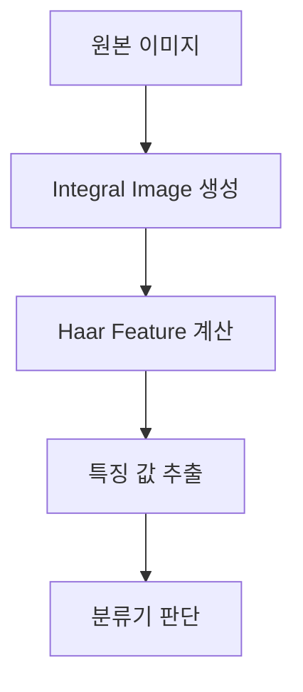
```mermaid
graph TD
    A[원본 이미지] --> B[Integral Image 생성]
    B --> C[Haar Feature 계산]
    C --> D[특징 값 추출]
    D --> E[분류기 판단]
```

#### 주요 Haar Feature 유형

1. **Edge Features**: 수직/수평 엣지 검출
2. **Line Features**: 선 형태 검출
3. **Center-surround Features**: 중심-주변 대비 검출

### 2. Integral Image (적분 이미지)

빠른 특징 계산을 위한 전처리 기법입니다.

```
Integral Image(x,y) = Σ I(i,j)  (i≤x, j≤y)
```

- **목적**: 임의의 사각형 영역의 픽셀 합을 O(1) 시간에 계산
- **효과**: 특징 계산 속도 대폭 향상

### 3. AdaBoost 알고리즘

여러 약한 분류기를 결합하여 강한 분류기를 만듭니다.

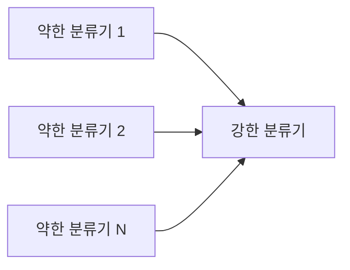
```mermaid
graph LR
    A[약한 분류기 1] --> D[강한 분류기]
    B[약한 분류기 2] --> D
    C[약한 분류기 N] --> D
```

### 4. Cascade 구조

단계적으로 검출을 수행하여 빠른 속도를 달성합니다.

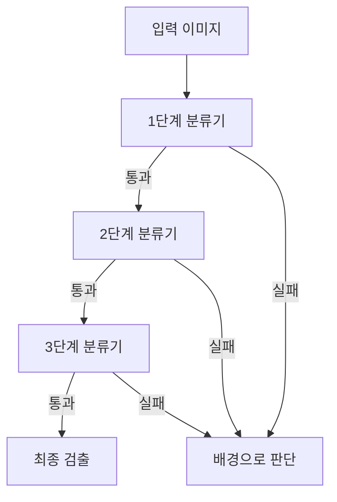
```mermaid
graph TD
    A[입력 이미지] --> B[1단계 분류기]
    B -->|통과| C[2단계 분류기]
    B -->|실패| Z[배경으로 판단]
    C -->|통과| D[3단계 분류기]
    C -->|실패| Z
    D -->|통과| E[최종 검출]
    D -->|실패| Z
```

- **Early Rejection**: 초기 단계에서 배경을 빠르게 제거
- **계단식 검증**: 객체일 가능성이 높은 영역만 상세 검증

### 5. Sliding Window 기법

이미지 전체를 스캔하여 객체를 검출합니다.

- **다중 스케일**: 다양한 크기의 윈도우로 검색
- **Overlap**: 겹치는 영역을 검색하여 누락 방지

---

## 모델 생성 시 주의할 점

### 1. 학습 데이터 준비

#### ✅ 양성 이미지 (Positive Images)
- **품질**: 고해상도, 선명한 이미지
- **다양성**: 다양한 각도, 조명, 배경
- **수량**: 최소 1000개 이상 권장
- **일관성**: 검출할 객체가 이미지 중앙에 위치
- **크기**: 모든 이미지가 동일한 크기 (권장: 24x24 또는 50x50)

#### ✅ 음성 이미지 (Negative Images)
- **다양성**: 검출할 객체가 없는 다양한 배경
- **수량**: 양성 이미지의 2~3배 권장
- **품질**: 실제 사용 환경과 유사한 이미지

### 2. 이미지 전처리

- **그레이스케일 변환**: 컬러 정보가 불필요한 경우
- **정규화**: 밝기 및 대비 조정
- **노이즈 제거**: 불필요한 노이즈 제거
- **크기 통일**: 모든 이미지 크기 통일

### 3. 파라미터 설정

#### `opencv_createsamples` 파라미터
- **-w, -h**: 검출 윈도우 크기 (24x24 권장)
- **-num**: 생성할 샘플 수
- **-vec**: 출력 벡터 파일명

#### `opencv_traincascade` 파라미터
- **-numPos**: 양성 샘플 수
- **-numNeg**: 음성 샘플 수
- **-numStages**: Cascade 단계 수 (10~20 권장)
- **-minHitRate**: 각 단계의 최소 적중률 (0.995 권장)
- **-maxFalseAlarmRate**: 최대 오탐률 (0.5 권장)
- **-w, -h**: 검출 윈도우 크기

### 4. 학습 시간 및 리소스

- **학습 시간**: 수 시간 ~ 수십 시간 소요 가능
- **메모리**: 충분한 RAM 필요 (8GB 이상 권장)
- **CPU**: 멀티코어 활용 가능

### 5. 검증 및 테스트

- **검증 세트**: 학습에 사용하지 않은 이미지로 테스트
- **다양한 조건**: 다양한 조명, 각도, 배경에서 테스트
- **성능 측정**: 정확도, 재현율, F1 스코어 측정

---

## 모델 생성 과정

### 단계별 모델 생성 프로세스

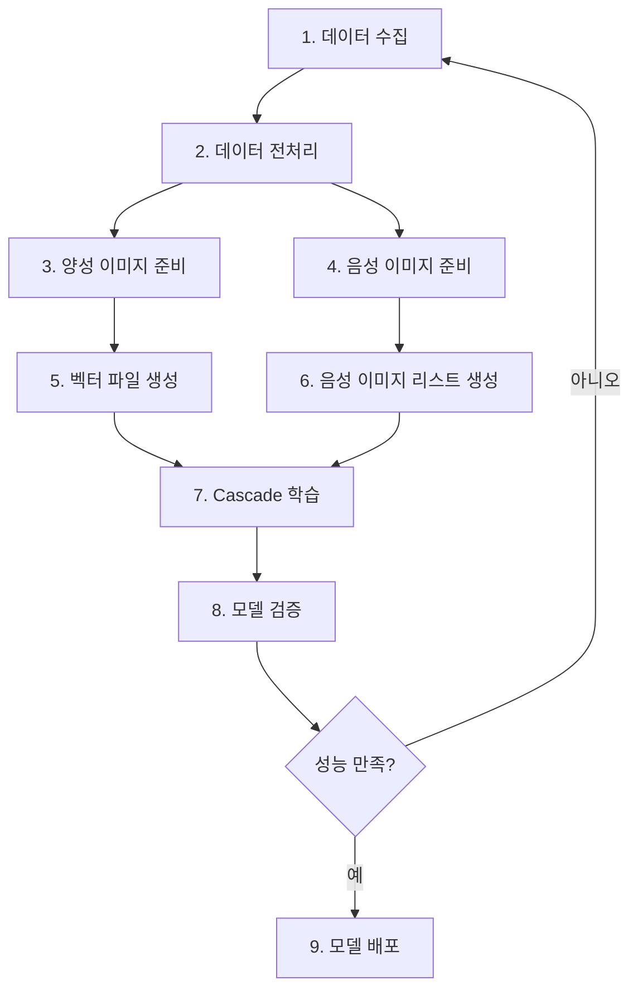
```mermaid
graph TD
    A[1. 데이터 수집] --> B[2. 데이터 전처리]
    B --> C[3. 양성 이미지 준비]
    B --> D[4. 음성 이미지 준비]
    C --> E[5. 벡터 파일 생성]
    D --> F[6. 음성 이미지 리스트 생성]
    E --> G[7. Cascade 학습]
    F --> G
    G --> H[8. 모델 검증]
    H --> I{성능 만족?}
    I -->|아니오| A
    I -->|예| J[9. 모델 배포]
```

### 1단계: 데이터 수집

```bash
# 카메라로 표지판 이미지 촬영
# 다양한 각도, 조명 조건에서 촬영
# 최소 1000장 이상 수집 권장
```

### 2단계: 데이터 전처리

```python
import cv2
import os

def preprocess_images(input_dir, output_dir, target_size=(50, 50)):
    """
    이미지 전처리 함수
    - 크기 조정
    - 그레이스케일 변환
    - 정규화
    """
    os.makedirs(output_dir, exist_ok=True)
    
    for filename in os.listdir(input_dir):
        img_path = os.path.join(input_dir, filename)
        img = cv2.imread(img_path)
        
        # 그레이스케일 변환
        gray = cv2.cvtColor(img, cv2.COLOR_BGR2GRAY)
        
        # 크기 조정
        resized = cv2.resize(gray, target_size)
        
        # 저장
        output_path = os.path.join(output_dir, filename)
        cv2.imwrite(output_path, resized)
```

### 3단계: 양성 이미지 준비

```
positive_images/
├── stop_sign_001.jpg
├── stop_sign_002.jpg
├── stop_sign_003.jpg
└── ...
```

**요구사항:**
- 검출할 객체가 이미지 중앙에 위치
- 모든 이미지가 동일한 크기
- 배경이 최소화된 이미지

### 4단계: 음성 이미지 준비

```
negative_images/
├── background_001.jpg
├── background_002.jpg
├── background_003.jpg
└── ...
```

**요구사항:**
- 검출할 객체가 없는 이미지
- 다양한 배경 이미지
- 양성 이미지의 2~3배 수량

### 5단계: 벡터 파일 생성

```bash
# opencv_createsamples 사용
opencv_createsamples \
    -info positive_images/info.txt \
    -vec positive_samples.vec \
    -w 50 \
    -h 50 \
    -num 1000
```

**info.txt 형식:**
```
positive_images/stop_sign_001.jpg 1 0 0 50 50
positive_images/stop_sign_002.jpg 1 0 0 50 50
...
```

### 6단계: 음성 이미지 리스트 생성

```bash
# negative_images.txt 생성
find negative_images -name "*.jpg" > negative_images.txt
```

### 7단계: Cascade 학습

```bash
opencv_traincascade \
    -data cascade_model \
    -vec positive_samples.vec \
    -bg negative_images.txt \
    -numPos 800 \
    -numNeg 2000 \
    -w 50 \
    -h 50 \
    -numStages 15 \
    -minHitRate 0.995 \
    -maxFalseAlarmRate 0.5 \
    -weightTrimRate 0.95 \
    -maxDepth 1 \
    -maxWeakCount 100
```

**주요 파라미터 설명:**
- `-numPos`: 실제 사용할 양성 샘플 수 (전체의 80% 권장)
- `-numNeg`: 음성 샘플 수
- `-numStages`: Cascade 단계 수 (10~20 권장)
- `-minHitRate`: 각 단계의 최소 적중률
- `-maxFalseAlarmRate`: 최대 오탐률

### 8단계: 모델 검증

```python
import cv2

def test_cascade(cascade_path, test_images):
    """
    학습된 Cascade 모델 테스트
    """
    cascade = cv2.CascadeClassifier(cascade_path)
    
    if cascade.empty():
        print("모델 로딩 실패!")
        return
    
    correct = 0
    total = len(test_images)
    
    for img_path in test_images:
        img = cv2.imread(img_path)
        gray = cv2.cvtColor(img, cv2.COLOR_BGR2GRAY)
        
        detections = cascade.detectMultiScale(
            gray,
            scaleFactor=1.1,
            minNeighbors=5,
            minSize=(30, 30)
        )
        
        if len(detections) > 0:
            correct += 1
    
    accuracy = correct / total * 100
    print(f"정확도: {accuracy:.2f}%")
```

### 9단계: 모델 배포

```bash
# 생성된 모델 파일 확인
ls cascade_model/

# XML 파일을 프로젝트에 복사
cp cascade_model/cascade.xml ./xml/stop.xml
```

---

## 모델 적용 과정

### 단계별 모델 적용 프로세스

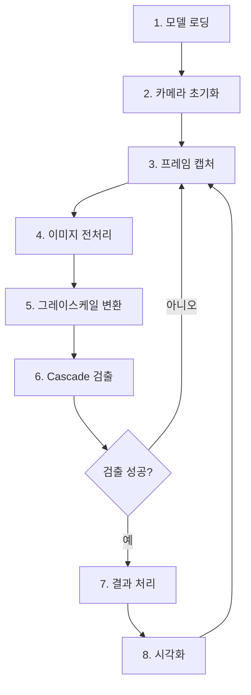
```mermaid
graph TD
    A[1. 모델 로딩] --> B[2. 카메라 초기화]
    B --> C[3. 프레임 캡처]
    C --> D[4. 이미지 전처리]
    D --> E[5. 그레이스케일 변환]
    E --> F[6. Cascade 검출]
    F --> G{검출 성공?}
    G -->|예| H[7. 결과 처리]
    G -->|아니오| C
    H --> I[8. 시각화]
    I --> C
```

### 상세 적용 순서도 (함수 호출 레벨)

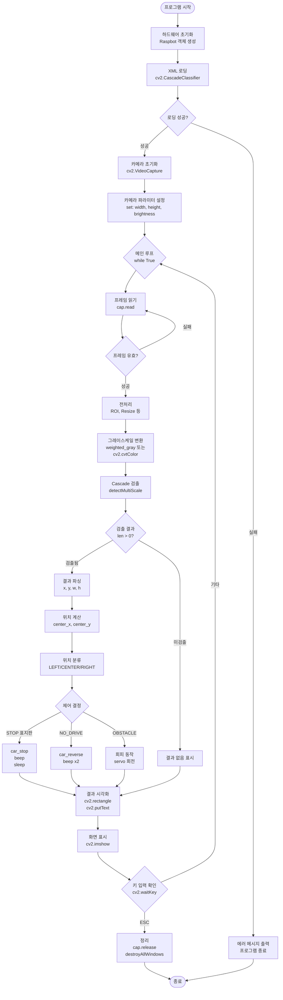
```mermaid
flowchart TB
    START([프로그램 시작]) --> INIT_HW[하드웨어 초기화<br/>Raspbot 객체 생성]
    INIT_HW --> LOAD_CASCADE[XML 로딩<br/>cv2.CascadeClassifier]
    
    LOAD_CASCADE --> CHECK_LOAD{로딩 성공?}
    CHECK_LOAD -->|실패| ERROR1[에러 메시지 출력<br/>프로그램 종료]
    CHECK_LOAD -->|성공| INIT_CAM[카메라 초기화<br/>cv2.VideoCapture]
    
    INIT_CAM --> SET_PARAM[카메라 파라미터 설정<br/>set: width, height, brightness]
    SET_PARAM --> MAIN_LOOP{메인 루프<br/>while True}
    
    MAIN_LOOP --> READ_FRAME[프레임 읽기<br/>cap.read]
    READ_FRAME --> CHECK_FRAME{프레임 유효?}
    CHECK_FRAME -->|실패| READ_FRAME
    CHECK_FRAME -->|성공| PREPROCESS[전처리<br/>ROI, Resize 등]
    
    PREPROCESS --> GRAY_CONV[그레이스케일 변환<br/>weighted_gray 또는<br/>cv2.cvtColor]
    
    GRAY_CONV --> DETECT[Cascade 검출<br/>detectMultiScale]
    
    DETECT --> CHECK_RESULT{검출 결과<br/>len > 0?}
    
    CHECK_RESULT -->|미검출| DISPLAY_NONE[결과 없음 표시]
    CHECK_RESULT -->|검출됨| PARSE_RESULT[결과 파싱<br/>x, y, w, h]
    
    PARSE_RESULT --> CALC_POS[위치 계산<br/>center_x, center_y]
    CALC_POS --> CLASSIFY_POS[위치 분류<br/>LEFT/CENTER/RIGHT]
    
    CLASSIFY_POS --> CONTROL{제어 결정}
    CONTROL -->|STOP 표지판| ACT_STOP[car_stop<br/>beep<br/>sleep]
    CONTROL -->|NO_DRIVE| ACT_REVERSE[car_reverse<br/>beep x2]
    CONTROL -->|OBSTACLE| ACT_AVOID[회피 동작<br/>servo 회전]
    
    ACT_STOP --> VISUALIZE
    ACT_REVERSE --> VISUALIZE
    ACT_AVOID --> VISUALIZE
    DISPLAY_NONE --> VISUALIZE
    
    VISUALIZE[결과 시각화<br/>cv2.rectangle<br/>cv2.putText] --> SHOW[화면 표시<br/>cv2.imshow]
    
    SHOW --> KEY_CHECK{키 입력 확인<br/>cv2.waitKey}
    KEY_CHECK -->|ESC| CLEANUP[정리<br/>cap.release<br/>destroyAllWindows]
    KEY_CHECK -->|기타| MAIN_LOOP
    
    CLEANUP --> END([종료])
    ERROR1 --> END
```

### 1단계: 모델 로딩

#### 함수: `cv2.CascadeClassifier(filename)`

**목적**: XML 파일에서 학습된 Haar Cascade 모델을 메모리에 로드

**매개변수:**
| 매개변수 | 타입 | 설명 | 필수 여부 |
|:---|:---|:---|:---:|
| `filename` | str | XML 파일 경로 (절대 또는 상대) | ✅ 필수 |

**반환값:**
- `CascadeClassifier` 객체 (성공 시)
- 빈 객체 (실패 시, `empty()` 메서드로 확인)

**에러 처리:**

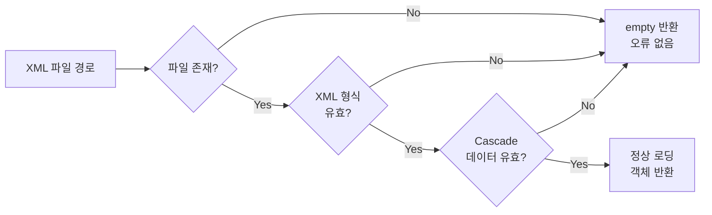
```mermaid
flowchart LR
    A[XML 파일 경로] --> B{파일 존재?}
    B -->|No| C[empty 반환<br/>오류 없음]
    B -->|Yes| D{XML 형식<br/>유효?}
    D -->|No| C
    D -->|Yes| E{Cascade<br/>데이터 유효?}
    E -->|No| C
    E -->|Yes| F[정상 로딩<br/>객체 반환]
```

**예제 코드:**

```python
import cv2
import sys

# ========================================
# 방법 1: 기본 로딩
# ========================================
cascade_path = "./xml/stop.xml"
cascade = cv2.CascadeClassifier(cascade_path)

# 모델 로딩 확인
if cascade.empty():
    print("⚠️  모델 로딩 실패!")
    sys.exit(1)
else:
    print("✅ 모델 로딩 완료")


# ========================================
# 방법 2: 예외 처리 포함
# ========================================
def load_cascade_safe(xml_path, cascade_name="Cascade"):
    """
    안전한 Cascade 로딩 함수
    
    Args:
        xml_path: XML 파일 경로
        cascade_name: 모델 이름 (로그용)
    
    Returns:
        CascadeClassifier 객체 또는 None
    """
    import os
    
    # 1단계: 파일 존재 확인
    if not os.path.exists(xml_path):
        print(f"❌ {cascade_name}: 파일을 찾을 수 없습니다 - {xml_path}")
        return None
    
    # 2단계: 모델 로딩 시도
    try:
        cascade = cv2.CascadeClassifier(xml_path)
        
        # 3단계: 로딩 검증
        if cascade.empty():
            print(f"❌ {cascade_name}: XML 파일이 손상되었거나 유효하지 않습니다")
            return None
        
        print(f"✅ {cascade_name}: 로딩 완료 ({xml_path})")
        return cascade
    
    except Exception as e:
        print(f"❌ {cascade_name}: 로딩 중 예외 발생 - {e}")
        return None


# 사용 예시
stop_cascade = load_cascade_safe("./xml/stop.xml", "STOP 표지판")
no_drive_cascade = load_cascade_safe("./xml/no_drive.xml", "통행금지")
obstacle_cascade = load_cascade_safe("./xml/obstacle.xml", "장애물")

# None 체크
if not stop_cascade or not no_drive_cascade:
    print("⚠️  필수 모델 로딩 실패, 프로그램 종료")
    sys.exit(1)


# ========================================
# 방법 3: 다중 모델 로딩 (딕셔너리)
# ========================================
def load_multiple_cascades(cascade_configs):
    """
    여러 Cascade 모델을 한 번에 로딩
    
    Args:
        cascade_configs: dict {name: xml_path}
    
    Returns:
        dict {name: CascadeClassifier}
    """
    cascades = {}
    failed = []
    
    for name, xml_path in cascade_configs.items():
        cascade = load_cascade_safe(xml_path, name)
        
        if cascade:
            cascades[name] = cascade
        else:
            failed.append(name)
    
    if failed:
        print(f"\n⚠️  로딩 실패한 모델: {', '.join(failed)}")
    
    return cascades


# 사용 예시
configs = {
    "stop": "./xml/stop.xml",
    "no_drive": "./xml/no_drive.xml",
    "obstacle": "./xml/obstacle.xml",
    "parking": "./xml/parking.xml"
}

cascades = load_multiple_cascades(configs)

# 사용
if "stop" in cascades:
    detections = cascades["stop"].detectMultiScale(gray_frame)
```

**로딩 시 주의사항:**

| 주의사항 | 설명 | 해결 방법 |
|:---|:---|:---|
| **경로 오류** | 상대 경로 사용 시 작업 디렉토리 주의 | 절대 경로 사용 권장 |
| **파일 권한** | XML 파일 읽기 권한 없음 | `chmod 644 *.xml` |
| **XML 손상** | 학습 중 비정상 종료 시 | 재학습 또는 백업 파일 사용 |
| **버전 호환** | OpenCV 버전 불일치 | 학습 시 사용한 OpenCV 버전 확인 |

### 2단계: 카메라 초기화

```python
# 카메라 초기화
cap = cv2.VideoCapture(0)

# 해상도 설정
cap.set(cv2.CAP_PROP_FRAME_WIDTH, 320)
cap.set(cv2.CAP_PROP_FRAME_HEIGHT, 240)

# 카메라 속성 설정
cap.set(cv2.CAP_PROP_BRIGHTNESS, 0)
cap.set(cv2.CAP_PROP_CONTRAST, 40)
```

### 3단계: 프레임 캡처

```python
ret, frame = cap.read()
if not ret:
    print("❌ 프레임 읽기 실패")
    break
```

### 4단계: 이미지 전처리

```python
def weighted_gray(image, r_weight, g_weight, b_weight):
    """
    가중 그레이스케일 변환
    RGB 채널에 가중치를 적용하여 그레이스케일 생성
    """
    r_weight /= 100.0
    g_weight /= 100.0
    b_weight /= 100.0
    
    return cv2.addWeighted(
        cv2.addWeighted(image[:, :, 2], r_weight, image[:, :, 1], g_weight, 0),
        1.0,
        image[:, :, 0],
        b_weight,
        0,
    )
```

### 5단계: 그레이스케일 변환

```python
# 가중 그레이스케일 변환 (RGB 가중치 적용)
gray = weighted_gray(frame, r_weight=30, g_weight=40, b_weight=60)

# 또는 일반 그레이스케일 변환
# gray = cv2.cvtColor(frame, cv2.COLOR_BGR2GRAY)
```

### 6단계: Cascade 검출

#### 함수: `detectMultiScale(image, scaleFactor, minNeighbors, flags, minSize, maxSize)`

**목적**: 다중 스케일에서 객체를 검출하는 핵심 함수

**알고리즘 순서도:**

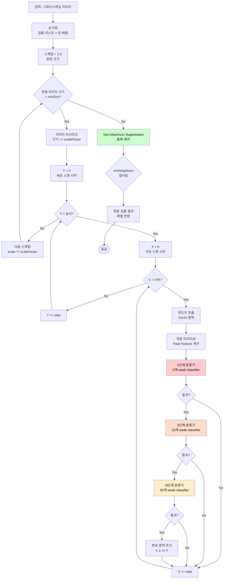
```mermaid
flowchart TB
    START[입력: 그레이스케일 이미지] --> INIT[초기화<br/>검출 리스트 = 빈 배열]
    INIT --> SCALE1[스케일 = 1.0<br/>원본 크기]
    
    SCALE1 --> LOOP{현재 이미지 크기<br/>> minSize?}
    LOOP -->|No| NMS[Non-Maximum Suppression<br/>중복 제거]
    LOOP -->|Yes| RESIZE[이미지 리사이즈<br/>크기 ÷= scaleFactor]
    
    RESIZE --> SLIDE_Y[Y = 0<br/>세로 스캔 시작]
    SLIDE_Y --> CHECK_Y{Y < 높이?}
    CHECK_Y -->|No| NEXT_SCALE[다음 스케일<br/>scale *= scaleFactor]
    CHECK_Y -->|Yes| SLIDE_X[X = 0<br/>가로 스캔 시작]
    
    SLIDE_X --> CHECK_X{X < 너비?}
    CHECK_X -->|No| INC_Y[Y += step]
    CHECK_X -->|Yes| EXTRACT[윈도우 추출<br/>24x24 영역]
    
    EXTRACT --> INTEGRAL[적분 이미지로<br/>Haar Feature 계산]
    
    INTEGRAL --> CASCADE_1[1단계 분류기<br/>5개 weak classifier]
    CASCADE_1 --> PASS_1{통과?}
    PASS_1 -->|No| INC_X[X += step]
    PASS_1 -->|Yes| CASCADE_2[2단계 분류기<br/>10개 weak classifier]
    
    CASCADE_2 --> PASS_2{통과?}
    PASS_2 -->|No| INC_X
    PASS_2 -->|Yes| CASCADE_N[N단계 분류기<br/>50개 weak classifier]
    
    CASCADE_N --> PASS_N{통과?}
    PASS_N -->|No| INC_X
    PASS_N -->|Yes| ADD[후보 영역 추가<br/>x, y, w, h]
    
    ADD --> INC_X
    INC_X --> CHECK_X
    INC_Y --> CHECK_Y
    NEXT_SCALE --> LOOP
    
    NMS --> CHECK_MIN{minNeighbors<br/>필터링}
    CHECK_MIN --> RESULT[최종 검출 결과<br/>배열 반환]
    RESULT --> END([종료])
    
    style CASCADE_1 fill:#ffcccc,color:#111
    style CASCADE_2 fill:#ffddcc,color:#111
    style CASCADE_N fill:#ffeecc,color:#111
    style NMS fill:#ccffcc,color:#111
```

**매개변수 상세 비교표:**

| 매개변수 | 타입 | 기본값 | 범위 | 목적 | 영향 | 권장값 |
|:---|:---:|:---:|:---:|:---|:---|:---:|
| **image** | Mat | - | Gray | 입력 이미지 | 필수, 그레이스케일 | - |
| **scaleFactor** | float | 1.1 | 1.01~2.0 | 이미지 축소 비율 | ↓: 정확↑ 속도↓<br/>↑: 속도↑ 정확↓ | **1.1** |
| **minNeighbors** | int | 3 | 0~20 | 최소 이웃 검출 수 | ↓: 오탐↑ 검출↑<br/>↑: 오탐↓ 미탐↑ | **5** |
| **flags** | int | 0 | 0, 1, 2 | 구식 파라미터 | 사용 안 함 | **0** |
| **minSize** | tuple | (0, 0) | (10, 10)~(500, 500) | 최소 객체 크기 | ↓: 작은 객체 검출<br/>↑: 성능 향상 | **(30, 30)** |
| **maxSize** | tuple | (0, 0) | (50, 50)~(1000, 1000) | 최대 객체 크기 | ↓: 큰 객체 필터<br/>↑: 전체 검출 | **(300, 300)** |

**파라미터별 성능 영향 그래프:**

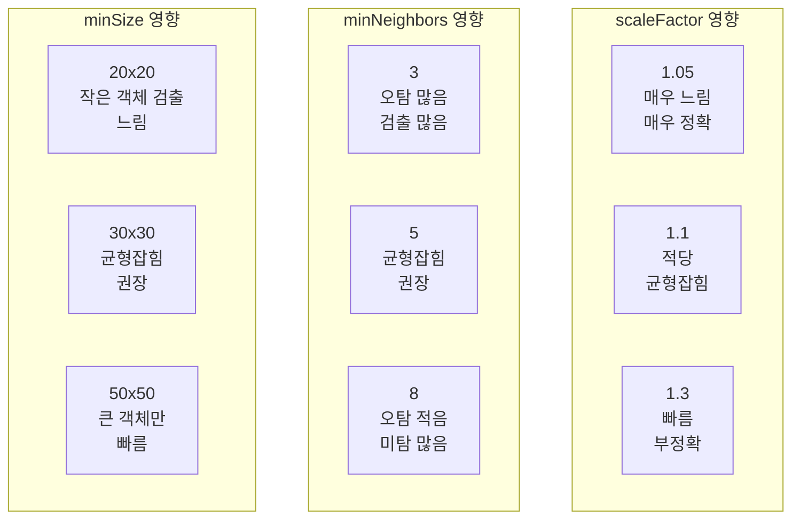
```mermaid
graph TB
    subgraph "scaleFactor 영향"
        SF1["1.05<br/>매우 느림<br/>매우 정확"]
        SF2["1.1<br/>적당<br/>균형잡힘"]
        SF3["1.3<br/>빠름<br/>부정확"]
    end
    
    subgraph "minNeighbors 영향"
        MN1["3<br/>오탐 많음<br/>검출 많음"]
        MN2["5<br/>균형잡힘<br/>권장"]
        MN3["8<br/>오탐 적음<br/>미탐 많음"]
    end
    
    subgraph "minSize 영향"
        MS1["20x20<br/>작은 객체 검출<br/>느림"]
        MS2["30x30<br/>균형잡힘<br/>권장"]
        MS3["50x50<br/>큰 객체만<br/>빠름"]
    end
```

**예제 코드 (단계별):**

```python
import cv2
import numpy as np

# ========================================
# 방법 1: 기본 검출
# ========================================
def detect_objects_basic(cascade, gray_frame):
    """
    기본 Cascade 검출
    """
    detections = cascade.detectMultiScale(
        gray_frame,
        scaleFactor=1.1,
        minNeighbors=5,
        minSize=(30, 30),
        maxSize=(300, 300)
    )
    return detections

# 사용
gray = cv2.cvtColor(frame, cv2.COLOR_BGR2GRAY)
objects = detect_objects_basic(cascade, gray)
print(f"검출된 객체 수: {len(objects)}")


# ========================================
# 방법 2: 파라미터 조정 가능
# ========================================
def detect_objects_adjustable(cascade, gray_frame, params):
    """
    파라미터 조정 가능한 검출 함수
    
    Args:
        cascade: CascadeClassifier 객체
        gray_frame: 그레이스케일 이미지
        params: 파라미터 딕셔너리
    
    Returns:
        detections: 검출 결과 배열
    """
    # 기본값 설정
    default_params = {
        'scaleFactor': 1.1,
        'minNeighbors': 5,
        'minSize': (30, 30),
        'maxSize': (300, 300)
    }
    
    # 사용자 파라미터 병합
    default_params.update(params)
    
    # 검출 실행
    detections = cascade.detectMultiScale(
        gray_frame,
        scaleFactor=default_params['scaleFactor'],
        minNeighbors=default_params['minNeighbors'],
        minSize=default_params['minSize'],
        maxSize=default_params['maxSize']
    )
    
    return detections

# 사용 예시 1: 빠른 검출 (속도 우선)
fast_params = {
    'scaleFactor': 1.2,
    'minNeighbors': 3,
    'minSize': (40, 40)
}
objects = detect_objects_adjustable(cascade, gray, fast_params)

# 사용 예시 2: 정확한 검출 (정확도 우선)
accurate_params = {
    'scaleFactor': 1.05,
    'minNeighbors': 7,
    'minSize': (20, 20),
    'maxSize': (400, 400)
}
objects = detect_objects_adjustable(cascade, gray, accurate_params)


# ========================================
# 방법 3: 거리 센서 연동 (적응형)
# ========================================
def detect_with_distance_info(cascade, gray_frame, distance_cm):
    """
    초음파 센서 거리 정보를 활용한 적응형 검출
    
    Args:
        cascade: CascadeClassifier
        gray_frame: 그레이스케일 이미지
        distance_cm: 초음파 센서로 측정한 거리 (cm)
    
    Returns:
        detections: 검출 결과
    """
    # 거리에 따른 동적 파라미터 설정
    if distance_cm < 30:  # 매우 가까움 (0~30cm)
        params = {
            'scaleFactor': 1.15,
            'minNeighbors': 4,
            'minSize': (100, 100),  # 큰 객체 예상
            'maxSize': (400, 400)
        }
    elif distance_cm < 80:  # 가까움 (30~80cm)
        params = {
            'scaleFactor': 1.1,
            'minNeighbors': 5,
            'minSize': (60, 60),
            'maxSize': (300, 300)
        }
    elif distance_cm < 150:  # 중간 (80~150cm)
        params = {
            'scaleFactor': 1.1,
            'minNeighbors': 5,
            'minSize': (40, 40),
            'maxSize': (200, 200)
        }
    else:  # 멀리 (150cm 이상)
        params = {
            'scaleFactor': 1.15,
            'minNeighbors': 4,
            'minSize': (20, 20),  # 작은 객체 예상
            'maxSize': (100, 100)
        }
    
    detections = cascade.detectMultiScale(
        gray_frame,
        scaleFactor=params['scaleFactor'],
        minNeighbors=params['minNeighbors'],
        minSize=params['minSize'],
        maxSize=params['maxSize']
    )
    
    return detections


# ========================================
# 방법 4: 성능 측정 포함
# ========================================
import time

def detect_with_performance(cascade, gray_frame):
    """
    성능 측정 포함 검출 함수
    """
    start_time = time.time()
    
    detections = cascade.detectMultiScale(
        gray_frame,
        scaleFactor=1.1,
        minNeighbors=5,
        minSize=(30, 30)
    )
    
    elapsed_time = (time.time() - start_time) * 1000  # ms
    fps = 1000 / elapsed_time if elapsed_time > 0 else 0
    
    print(f"검출 시간: {elapsed_time:.2f}ms, FPS: {fps:.1f}")
    print(f"검출된 객체: {len(detections)}개")
    
    return detections


# ========================================
# 방법 5: ROI 기반 검출 (성능 최적화)
# ========================================
def detect_in_roi(cascade, gray_frame, roi_rect=None):
    """
    관심 영역(ROI)만 검출하여 성능 향상
    
    Args:
        cascade: CascadeClassifier
        gray_frame: 전체 이미지
        roi_rect: (x, y, w, h) ROI 영역, None이면 전체
    
    Returns:
        detections: 원본 이미지 좌표계 기준 검출 결과
    """
    if roi_rect is None:
        # ROI 없으면 전체 이미지
        roi = gray_frame
        offset_x, offset_y = 0, 0
    else:
        # ROI 추출
        x, y, w, h = roi_rect
        roi = gray_frame[y:y+h, x:x+w]
        offset_x, offset_y = x, y
    
    # ROI 내에서 검출
    detections = cascade.detectMultiScale(
        roi,
        scaleFactor=1.1,
        minNeighbors=5,
        minSize=(30, 30)
    )
    
    # 원본 이미지 좌표로 변환
    adjusted_detections = []
    for (x, y, w, h) in detections:
        adjusted_detections.append((
            x + offset_x,
            y + offset_y,
            w,
            h
        ))
    
    return np.array(adjusted_detections)

# 사용 예시: 하단 50%만 검출
h, w = gray.shape
roi = (0, h//2, w, h//2)  # 하단 절반
objects = detect_in_roi(cascade, gray, roi)
```

**검출 결과 형식:**

```python
# 반환값: numpy 배열 (N, 4)
# N: 검출된 객체 수
# 4: [x, y, width, height]

detections = cascade.detectMultiScale(gray)
print(detections)
# 출력 예시:
# [[120, 80, 50, 50],    # 객체 1: x=120, y=80, 크기=50x50
#  [250, 150, 45, 45]]   # 객체 2: x=250, y=150, 크기=45x45

# 검출된 객체 순회
for (x, y, w, h) in detections:
    center_x = x + w // 2
    center_y = y + h // 2
    area = w * h
    print(f"위치: ({center_x}, {center_y}), 면적: {area}")
```

### 7단계: 결과 처리

#### 검출 결과 분석 알고리즘

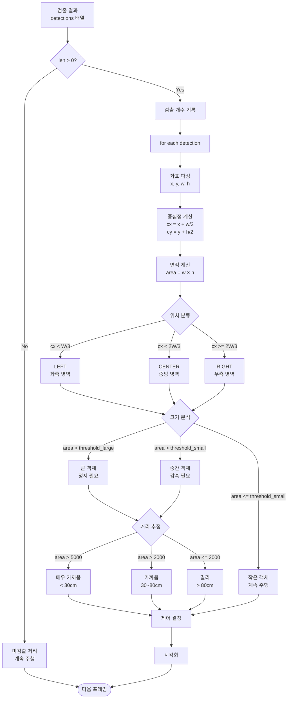
```mermaid
flowchart TB
    START[검출 결과<br/>detections 배열] --> CHECK{len > 0?}
    
    CHECK -->|No| NO_DETECT[미검출 처리<br/>계속 주행]
    CHECK -->|Yes| COUNT[검출 개수 기록]
    
    COUNT --> LOOP[for each detection]
    LOOP --> PARSE[좌표 파싱<br/>x, y, w, h]
    
    PARSE --> CALC_CENTER[중심점 계산<br/>cx = x + w/2<br/>cy = y + h/2]
    
    CALC_CENTER --> CALC_AREA[면적 계산<br/>area = w × h]
    
    CALC_AREA --> CLASSIFY_POS{위치 분류}
    
    CLASSIFY_POS -->|cx < W/3| POS_LEFT[LEFT<br/>좌측 영역]
    CLASSIFY_POS -->|cx < 2W/3| POS_CENTER[CENTER<br/>중앙 영역]
    CLASSIFY_POS -->|cx >= 2W/3| POS_RIGHT[RIGHT<br/>우측 영역]
    
    POS_LEFT --> SIZE_CHECK{크기 분석}
    POS_CENTER --> SIZE_CHECK
    POS_RIGHT --> SIZE_CHECK
    
    SIZE_CHECK -->|area > threshold_large| ACTION_STOP[큰 객체<br/>정지 필요]
    SIZE_CHECK -->|area > threshold_small| ACTION_SLOW[중간 객체<br/>감속 필요]
    SIZE_CHECK -->|area <= threshold_small| ACTION_CONTINUE[작은 객체<br/>계속 주행]
    
    ACTION_STOP --> DISTANCE{거리 추정}
    ACTION_SLOW --> DISTANCE
    
    DISTANCE -->|area > 5000| DIST_CLOSE[매우 가까움<br/>< 30cm]
    DISTANCE -->|area > 2000| DIST_MEDIUM[가까움<br/>30~80cm]
    DISTANCE -->|area <= 2000| DIST_FAR[멀리<br/>> 80cm]
    
    DIST_CLOSE --> CONTROL[제어 결정]
    DIST_MEDIUM --> CONTROL
    DIST_FAR --> CONTROL
    ACTION_CONTINUE --> CONTROL
    
    CONTROL --> VISUALIZE[시각화]
    NO_DETECT --> END([다음 프레임])
    VISUALIZE --> END
```

**결과 분석 함수 모음:**

```python
import cv2
import numpy as np

# ========================================
# 1. 기본 결과 처리
# ========================================
def process_detections_basic(detections, frame_width, frame_height):
    """
    검출 결과 기본 분석
    
    Returns:
        results: 분석 결과 리스트
    """
    results = []
    
    for (x, y, w, h) in detections:
        # 중심점 계산
        center_x = x + w // 2
        center_y = y + h // 2
        
        # 면적 계산
        area = w * h
        
        # 위치 분류
        if center_x < frame_width // 3:
            position = "LEFT"
        elif center_x < 2 * frame_width // 3:
            position = "CENTER"
        else:
            position = "RIGHT"
        
        # 크기 분류
        if area > 5000:
            size_class = "LARGE"
            distance_estimate = "VERY_CLOSE"
        elif area > 2000:
            size_class = "MEDIUM"
            distance_estimate = "CLOSE"
        else:
            size_class = "SMALL"
            distance_estimate = "FAR"
        
        result = {
            'bbox': (x, y, w, h),
            'center': (center_x, center_y),
            'area': area,
            'position': position,
            'size_class': size_class,
            'distance_estimate': distance_estimate
        }
        
        results.append(result)
    
    return results


# ========================================
# 2. 우선순위 기반 처리
# ========================================
def find_priority_detection(detections, frame_width, frame_height):
    """
    가장 중요한 검출 결과 선택
    
    우선순위:
    1. 가장 큰 객체
    2. 중앙에 가까운 객체
    3. 가장 낮은 위치 (가까운 객체)
    
    Returns:
        priority_detection: 가장 중요한 검출 결과
    """
    if len(detections) == 0:
        return None
    
    # 각 검출에 대한 점수 계산
    scored_detections = []
    
    for (x, y, w, h) in detections:
        center_x = x + w // 2
        center_y = y + h // 2
        area = w * h
        
        # 점수 계산 (높을수록 중요)
        # 1. 크기 점수 (0~100)
        size_score = min(area / 100, 100)
        
        # 2. 중앙도 점수 (0~100)
        center_deviation = abs(center_x - frame_width / 2)
        centrality_score = 100 - (center_deviation / (frame_width / 2) * 100)
        
        # 3. 근접도 점수 (0~100)
        proximity_score = (center_y / frame_height) * 100
        
        # 가중 합산
        total_score = (
            size_score * 0.5 +
            centrality_score * 0.3 +
            proximity_score * 0.2
        )
        
        scored_detections.append({
            'bbox': (x, y, w, h),
            'score': total_score,
            'size': area,
            'center': (center_x, center_y)
        })
    
    # 가장 높은 점수의 검출 반환
    priority = max(scored_detections, key=lambda d: d['score'])
    return priority


# ========================================
# 3. 다중 검출 그룹화
# ========================================
def group_detections_by_position(detections, frame_width):
    """
    검출 결과를 위치별로 그룹화
    
    Returns:
        groups: {LEFT: [...], CENTER: [...], RIGHT: [...]}
    """
    groups = {
        'LEFT': [],
        'CENTER': [],
        'RIGHT': []
    }
    
    for (x, y, w, h) in detections:
        center_x = x + w // 2
        
        if center_x < frame_width // 3:
            groups['LEFT'].append((x, y, w, h))
        elif center_x < 2 * frame_width // 3:
            groups['CENTER'].append((x, y, w, h))
        else:
            groups['RIGHT'].append((x, y, w, h))
    
    return groups


# ========================================
# 4. 거리 추정
# ========================================
def estimate_distance(bbox, known_width=10.0, focal_length=500.0):
    """
    객체 크기로 거리 추정
    
    공식: Distance = (Known_Width × Focal_Length) / Pixel_Width
    
    Args:
        bbox: (x, y, w, h)
        known_width: 실제 객체 너비 (cm)
        focal_length: 카메라 초점 거리 (pixels)
    
    Returns:
        distance: 추정 거리 (cm)
    """
    x, y, w, h = bbox
    
    if w == 0:
        return float('inf')
    
    distance = (known_width * focal_length) / w
    return distance


# ========================================
# 5. 충돌 위험 판단
# ========================================
def assess_collision_risk(detections, frame_width, frame_height):
    """
    충돌 위험 평가
    
    Returns:
        risk_level: "SAFE", "CAUTION", "WARNING", "DANGER"
    """
    if len(detections) == 0:
        return "SAFE"
    
    # 가장 위험한 검출 찾기
    max_risk_score = 0
    
    for (x, y, w, h) in detections:
        center_x = x + w // 2
        center_y = y + h // 2
        area = w * h
        
        # 위험 점수 계산
        # 1. 크기 (클수록 위험)
        size_risk = area / (frame_width * frame_height) * 100
        
        # 2. 중앙 정렬 (중앙에 있을수록 위험)
        center_deviation = abs(center_x - frame_width / 2) / (frame_width / 2)
        alignment_risk = (1 - center_deviation) * 100
        
        # 3. 하단 위치 (아래쪽일수록 가까움)
        position_risk = (center_y / frame_height) * 100
        
        # 종합 위험 점수
        risk_score = (
            size_risk * 0.4 +
            alignment_risk * 0.4 +
            position_risk * 0.2
        )
        
        max_risk_score = max(max_risk_score, risk_score)
    
    # 위험 레벨 판단
    if max_risk_score > 75:
        return "DANGER"
    elif max_risk_score > 50:
        return "WARNING"
    elif max_risk_score > 25:
        return "CAUTION"
    else:
        return "SAFE"


# ========================================
# 6. 통합 분석 함수
# ========================================
def analyze_detections_complete(detections, frame_width, frame_height):
    """
    완전한 검출 결과 분석
    
    Returns:
        analysis: 전체 분석 결과 딕셔너리
    """
    analysis = {
        'count': len(detections),
        'detections': [],
        'priority': None,
        'groups': None,
        'risk_level': "SAFE"
    }
    
    if len(detections) == 0:
        return analysis
    
    # 1. 각 검출 분석
    analysis['detections'] = process_detections_basic(
        detections, frame_width, frame_height
    )
    
    # 2. 우선순위 검출
    analysis['priority'] = find_priority_detection(
        detections, frame_width, frame_height
    )
    
    # 3. 위치별 그룹화
    analysis['groups'] = group_detections_by_position(
        detections, frame_width
    )
    
    # 4. 충돌 위험 평가
    analysis['risk_level'] = assess_collision_risk(
        detections, frame_width, frame_height
    )
    
    return analysis


# ========================================
# 사용 예시
# ========================================
# 검출 실행
gray = cv2.cvtColor(frame, cv2.COLOR_BGR2GRAY)
detections = cascade.detectMultiScale(gray, 1.1, 5, minSize=(30, 30))

# 분석
h, w = frame.shape[:2]
analysis = analyze_detections_complete(detections, w, h)

# 결과 출력
print(f"검출 개수: {analysis['count']}")
print(f"위험 레벨: {analysis['risk_level']}")

if analysis['priority']:
    print(f"우선순위 객체:")
    print(f"  - 위치: {analysis['priority']['center']}")
    print(f"  - 크기: {analysis['priority']['size']}")
    print(f"  - 점수: {analysis['priority']['score']:.2f}")

# 위치별 통계
for position, dets in analysis['groups'].items():
    print(f"{position}: {len(dets)}개")
```

**제어 결정 로직:**

```python
# ========================================
# 검출 결과 기반 차량 제어
# ========================================
def control_decision(analysis, bot):
    """
    분석 결과 기반 차량 제어 결정
    
    Args:
        analysis: analyze_detections_complete() 결과
        bot: Raspbot 객체
    """
    risk_level = analysis['risk_level']
    priority = analysis['priority']
    
    if risk_level == "DANGER":
        # 긴급 정지
        bot.car_stop()
        bot.Ctrl_BEEP_Switch(1)
        print("🚨 위험! 긴급 정지")
        
    elif risk_level == "WARNING":
        # 감속 + 회피 준비
        if priority:
            pos = priority['center'][0]
            frame_width = 320  # 예시
            
            if pos < frame_width // 3:
                # 좌측 객체 → 우회전
                bot.car_right(speed=10)
                print("⚠️  경고! 우회전")
            elif pos > 2 * frame_width // 3:
                # 우측 객체 → 좌회전
                bot.car_left(speed=10)
                print("⚠️  경고! 좌회전")
            else:
                # 중앙 객체 → 정지
                bot.car_stop()
                print("⚠️  경고! 정지")
    
    elif risk_level == "CAUTION":
        # 감속만
        bot.car_run(speed=15)  # 낮은 속도
        print("🟨 주의! 감속")
    
    else:
        # 정상 주행
        bot.car_run(speed=25)  # 정상 속도
        print("✅ 안전! 정상 주행")
```

### 8단계: 시각화

#### 시각화 처리 흐름

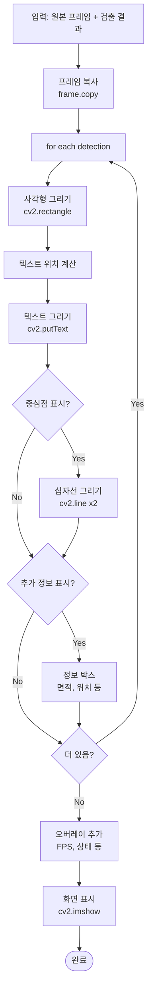
```mermaid
flowchart TB
    START[입력: 원본 프레임 + 검출 결과] --> COPY[프레임 복사<br/>frame.copy]
    
    COPY --> LOOP[for each detection]
    LOOP --> DRAW_RECT[사각형 그리기<br/>cv2.rectangle]
    
    DRAW_RECT --> CALC_TEXT[텍스트 위치 계산]
    CALC_TEXT --> DRAW_TEXT[텍스트 그리기<br/>cv2.putText]
    
    DRAW_TEXT --> DRAW_CENTER{중심점 표시?}
    DRAW_CENTER -->|Yes| MARK_CENTER[십자선 그리기<br/>cv2.line x2]
    DRAW_CENTER -->|No| DRAW_INFO
    
    MARK_CENTER --> DRAW_INFO{추가 정보 표시?}
    DRAW_INFO -->|Yes| INFO_BOX[정보 박스<br/>면적, 위치 등]
    DRAW_INFO -->|No| CHECK_MORE
    
    INFO_BOX --> CHECK_MORE{더 있음?}
    CHECK_MORE -->|Yes| LOOP
    CHECK_MORE -->|No| OVERLAY
    
    OVERLAY[오버레이 추가<br/>FPS, 상태 등] --> SHOW[화면 표시<br/>cv2.imshow]
    SHOW --> END([완료])
```

**시각화 함수 모음:**

```python
import cv2
import numpy as np

# ========================================
# 1. 기본 시각화
# ========================================
def draw_detections_basic(frame, detections, label="Object", color=(0, 255, 0)):
    """
    기본 사각형 + 텍스트 그리기
    
    Args:
        frame: 원본 이미지
        detections: 검출 결과 배열
        label: 표시할 라벨
        color: BGR 색상 (기본: 녹색)
    
    Returns:
        annotated_frame: 표시가 추가된 이미지
    """
    annotated = frame.copy()
    
    for (x, y, w, h) in detections:
        # 사각형 그리기
        cv2.rectangle(annotated, (x, y), (x + w, y + h), color, 2)
        
        # 텍스트 표시
        text = f"{label} ({w}x{h})"
        cv2.putText(
            annotated,
            text,
            (x, y - 10),
            cv2.FONT_HERSHEY_SIMPLEX,
            0.6,
            color,
            2
        )
    
    return annotated


# ========================================
# 2. 고급 시각화 (중심점, 거리 표시)
# ========================================
def draw_detections_advanced(frame, detections, label="Object"):
    """
    상세 정보가 포함된 시각화
    """
    annotated = frame.copy()
    h, w = frame.shape[:2]
    
    for idx, (x, y, bbox_w, bbox_h) in enumerate(detections):
        # 중심점 계산
        center_x = x + bbox_w // 2
        center_y = y + bbox_h // 2
        area = bbox_w * bbox_h
        
        # 위치 분류
        if center_x < w // 3:
            position = "LEFT"
            color = (0, 255, 255)  # 노란색
        elif center_x < 2 * w // 3:
            position = "CENTER"
            color = (0, 0, 255)    # 빨간색
        else:
            position = "RIGHT"
            color = (255, 0, 255)  # 보라색
        
        # 1. 사각형 (두께 3)
        cv2.rectangle(
            annotated,
            (x, y),
            (x + bbox_w, y + bbox_h),
            color,
            3
        )
        
        # 2. 중심점 십자선
        cross_size = 10
        cv2.line(
            annotated,
            (center_x - cross_size, center_y),
            (center_x + cross_size, center_y),
            color,
            2
        )
        cv2.line(
            annotated,
            (center_x, center_y - cross_size),
            (center_x, center_y + cross_size),
            color,
            2
        )
        
        # 3. 번호 표시 (원 안에)
        cv2.circle(annotated, (x + 15, y + 15), 12, color, -1)
        cv2.putText(
            annotated,
            str(idx + 1),
            (x + 9, y + 20),
            cv2.FONT_HERSHEY_SIMPLEX,
            0.5,
            (255, 255, 255),
            2
        )
        
        # 4. 정보 박스
        info_lines = [
            f"{label} #{idx+1}",
            f"Size: {bbox_w}x{bbox_h}",
            f"Area: {area}px",
            f"Pos: {position}",
            f"Center: ({center_x},{center_y})"
        ]
        
        # 배경 박스
        box_height = len(info_lines) * 20 + 10
        cv2.rectangle(
            annotated,
            (x, y - box_height - 10),
            (x + 200, y - 10),
            (0, 0, 0),
            -1
        )
        cv2.rectangle(
            annotated,
            (x, y - box_height - 10),
            (x + 200, y - 10),
            color,
            2
        )
        
        # 정보 텍스트
        for i, line in enumerate(info_lines):
            cv2.putText(
                annotated,
                line,
                (x + 5, y - box_height + 15 + i * 20),
                cv2.FONT_HERSHEY_SIMPLEX,
                0.4,
                (255, 255, 255),
                1
            )
    
    return annotated


# ========================================
# 3. 위험 레벨 시각화
# ========================================
def draw_with_risk_level(frame, detections, risk_level):
    """
    위험 레벨에 따른 색상 코딩 시각화
    
    Args:
        risk_level: "SAFE", "CAUTION", "WARNING", "DANGER"
    """
    annotated = frame.copy()
    
    # 위험 레벨별 색상
    risk_colors = {
        "SAFE": (0, 255, 0),      # 녹색
        "CAUTION": (0, 255, 255), # 노란색
        "WARNING": (0, 165, 255), # 주황색
        "DANGER": (0, 0, 255)     # 빨간색
    }
    
    color = risk_colors.get(risk_level, (128, 128, 128))
    
    # 화면 테두리 (위험 표시)
    thickness = 5 if risk_level in ["WARNING", "DANGER"] else 2
    cv2.rectangle(
        annotated,
        (0, 0),
        (frame.shape[1]-1, frame.shape[0]-1),
        color,
        thickness
    )
    
    # 위험 레벨 텍스트 (상단 중앙)
    text = f"RISK: {risk_level}"
    font_scale = 1.5 if risk_level == "DANGER" else 1.0
    
    # 텍스트 크기 측정
    (text_w, text_h), baseline = cv2.getTextSize(
        text,
        cv2.FONT_HERSHEY_BOLD,
        font_scale,
        2
    )
    
    # 배경 박스
    cv2.rectangle(
        annotated,
        (frame.shape[1]//2 - text_w//2 - 10, 10),
        (frame.shape[1]//2 + text_w//2 + 10, 10 + text_h + 20),
        (0, 0, 0),
        -1
    )
    
    # 텍스트
    cv2.putText(
        annotated,
        text,
        (frame.shape[1]//2 - text_w//2, 30 + text_h),
        cv2.FONT_HERSHEY_BOLD,
        font_scale,
        color,
        2
    )
    
    # 각 검출 표시
    for (x, y, w, h) in detections:
        cv2.rectangle(annotated, (x, y), (x+w, y+h), color, 3)
    
    return annotated


# ========================================
# 4. FPS 및 상태 오버레이
# ========================================
def draw_status_overlay(frame, fps, detection_count, status_text=""):
    """
    FPS, 검출 개수, 상태 텍스트 오버레이
    """
    annotated = frame.copy()
    h, w = frame.shape[:2]
    
    # 반투명 배경
    overlay = annotated.copy()
    cv2.rectangle(overlay, (0, 0), (250, 100), (0, 0, 0), -1)
    cv2.addWeighted(overlay, 0.6, annotated, 0.4, 0, annotated)
    
    # FPS
    cv2.putText(
        annotated,
        f"FPS: {fps:.1f}",
        (10, 25),
        cv2.FONT_HERSHEY_SIMPLEX,
        0.7,
        (0, 255, 0),
        2
    )
    
    # 검출 개수
    cv2.putText(
        annotated,
        f"Detections: {detection_count}",
        (10, 55),
        cv2.FONT_HERSHEY_SIMPLEX,
        0.7,
        (0, 255, 255),
        2
    )
    
    # 상태 텍스트
    if status_text:
        cv2.putText(
            annotated,
            status_text,
            (10, 85),
            cv2.FONT_HERSHEY_SIMPLEX,
            0.6,
            (255, 255, 255),
            2
        )
    
    return annotated


# ========================================
# 5. 통합 시각화 함수
# ========================================
def visualize_complete(frame, analysis, fps=0, cascade_name="Object"):
    """
    모든 정보를 포함한 완전한 시각화
    
    Args:
        frame: 원본 프레임
        analysis: analyze_detections_complete() 결과
        fps: 현재 FPS
        cascade_name: 검출 객체 이름
    
    Returns:
        annotated: 완전히 표시된 프레임
    """
    annotated = frame.copy()
    
    # 1. 검출 결과 그리기
    if analysis['count'] > 0:
        # 위험 레벨 기반 시각화
        annotated = draw_with_risk_level(
            annotated,
            [d['bbox'] for d in analysis['detections']],
            analysis['risk_level']
        )
        
        # 우선순위 객체 강조
        if analysis['priority']:
            px, py, pw, ph = analysis['priority']['bbox']
            # 두꺼운 테두리
            cv2.rectangle(
                annotated,
                (px-2, py-2),
                (px+pw+2, py+ph+2),
                (255, 255, 0),
                4
            )
            # "PRIORITY" 텍스트
            cv2.putText(
                annotated,
                "PRIORITY",
                (px, py-10),
                cv2.FONT_HERSHEY_BOLD,
                0.7,
                (255, 255, 0),
                2
            )
    
    # 2. 상태 오버레이
    status_text = f"Risk: {analysis['risk_level']}"
    annotated = draw_status_overlay(
        annotated,
        fps,
        analysis['count'],
        status_text
    )
    
    # 3. 위치별 통계 (우측 하단)
    h, w = frame.shape[:2]
    y_offset = h - 100
    
    overlay = annotated.copy()
    cv2.rectangle(overlay, (w-150, y_offset), (w, h), (0, 0, 0), -1)
    cv2.addWeighted(overlay, 0.6, annotated, 0.4, 0, annotated)
    
    for idx, (pos, dets) in enumerate(analysis['groups'].items()):
        cv2.putText(
            annotated,
            f"{pos}: {len(dets)}",
            (w-140, y_offset + 25 + idx*25),
            cv2.FONT_HERSHEY_SIMPLEX,
            0.5,
            (255, 255, 255),
            1
        )
    
    return annotated


# ========================================
# 6. 동영상 저장 시각화
# ========================================
class VideoVisualizer:
    """
    검출 결과를 동영상으로 저장하는 클래스
    """
    def __init__(self, output_path, fps=30, frame_size=(640, 480)):
        self.writer = cv2.VideoWriter(
            output_path,
            cv2.VideoWriter_fourcc(*'mp4v'),
            fps,
            frame_size
        )
    
    def add_frame(self, frame, detections, label="Object"):
        """프레임 추가"""
        annotated = draw_detections_advanced(frame, detections, label)
        self.writer.write(annotated)
    
    def release(self):
        """저장 완료"""
        self.writer.release()
        print("✅ 동영상 저장 완료")


# ========================================
# 사용 예시
# ========================================
# 방법 1: 기본 시각화
annotated = draw_detections_basic(frame, detections, "Stop Sign", (0, 0, 255))
cv2.imshow("Basic", annotated)

# 방법 2: 고급 시각화
annotated = draw_detections_advanced(frame, detections, "Stop Sign")
cv2.imshow("Advanced", annotated)

# 방법 3: 위험 레벨 시각화
annotated = draw_with_risk_level(frame, detections, "WARNING")
cv2.imshow("Risk Level", annotated)

# 방법 4: 완전한 시각화
h, w = frame.shape[:2]
analysis = analyze_detections_complete(detections, w, h)
annotated = visualize_complete(frame, analysis, fps=30, cascade_name="Stop Sign")
cv2.imshow("Complete", annotated)

# 방법 5: 동영상 저장
visualizer = VideoVisualizer("output.mp4", fps=30, frame_size=(640, 480))
# 메인 루프에서
visualizer.add_frame(frame, detections, "Object")
# 종료 시
visualizer.release()
```

**시각화 색상 팔레트:**

| 상태 | BGR 값 | 용도 |
|:---|:---|:---|
| **안전 (녹색)** | (0, 255, 0) | SAFE 상태 |
| **주의 (노란색)** | (0, 255, 255) | CAUTION, 좌측 객체 |
| **경고 (주황색)** | (0, 165, 255) | WARNING 상태 |
| **위험 (빨간색)** | (0, 0, 255) | DANGER, 중앙 객체 |
| **우선순위 (청록)** | (255, 255, 0) | 우선순위 객체 |
| **보라색** | (255, 0, 255) | 우측 객체 |
| **흰색** | (255, 255, 255) | 텍스트 |
| **검정** | (0, 0, 0) | 배경 박스 |

---

## 📦 전체 통합 예제

### 완전한 자율주행 객체 검출 시스템

```python
#!/usr/bin/env python3
# -*- coding: utf-8 -*-
"""
Haar Cascade 기반 자율주행 객체 검출 시스템
완전 통합 예제
"""

import cv2
import numpy as np
import time
import sys
import os

# ════════════════════════════════════════════════
# 1단계: 클래스 정의
# ════════════════════════════════════════════════

class CascadeDetectionSystem:
    """
    Haar Cascade 기반 객체 검출 시스템
    """
    
    def __init__(self, cascade_configs, camera_id=0):
        """
        초기화
        
        Args:
            cascade_configs: {name: xml_path} 딕셔너리
            camera_id: 카메라 장치 ID
        """
        self.cascades = {}
        self.cap = None
        self.fps = 0
        self.frame_count = 0
        self.start_time = time.time()
        
        # Cascade 로딩
        self._load_cascades(cascade_configs)
        
        # 카메라 초기화
        self._initialize_camera(camera_id)
    
    def _load_cascades(self, configs):
        """Cascade 모델 로딩"""
        print("=" * 50)
        print("Cascade 모델 로딩 중...")
        print("=" * 50)
        
        for name, xml_path in configs.items():
            if not os.path.exists(xml_path):
                print(f"❌ {name}: 파일 없음 - {xml_path}")
                continue
            
            cascade = cv2.CascadeClassifier(xml_path)
            
            if cascade.empty():
                print(f"❌ {name}: 로딩 실패")
                continue
            
            self.cascades[name] = cascade
            print(f"✅ {name}: 로딩 완료")
        
        if not self.cascades:
            print("\n⚠️  로딩된 Cascade가 없습니다!")
            sys.exit(1)
        
        print("=" * 50 + "\n")
    
    def _initialize_camera(self, camera_id):
        """카메라 초기화"""
        print("카메라 초기화 중...")
        
        self.cap = cv2.VideoCapture(camera_id)
        
        if not self.cap.isOpened():
            print("❌ 카메라 열기 실패!")
            sys.exit(1)
        
        # 해상도 설정
        self.cap.set(cv2.CAP_PROP_FRAME_WIDTH, 640)
        self.cap.set(cv2.CAP_PROP_FRAME_HEIGHT, 480)
        
        # 카메라 속성 설정
        self.cap.set(cv2.CAP_PROP_BRIGHTNESS, 0)
        self.cap.set(cv2.CAP_PROP_CONTRAST, 40)
        
        print("✅ 카메라 초기화 완료\n")
    
    def detect_objects(self, frame, cascade_name, params=None):
        """
        객체 검출 실행
        
        Args:
            frame: 입력 프레임
            cascade_name: 사용할 Cascade 이름
            params: 검출 파라미터
        
        Returns:
            detections: 검출 결과
        """
        # Early Return: Cascade 확인
        if cascade_name not in self.cascades:
            return np.array([])
        
        cascade = self.cascades[cascade_name]
        
        # 기본 파라미터
        default_params = {
            'scaleFactor': 1.1,
            'minNeighbors': 5,
            'minSize': (30, 30),
            'maxSize': (300, 300)
        }
        
        if params:
            default_params.update(params)
        
        # 그레이스케일 변환
        if len(frame.shape) == 3:
            gray = cv2.cvtColor(frame, cv2.COLOR_BGR2GRAY)
        else:
            gray = frame
        
        # 검출 실행
        detections = cascade.detectMultiScale(
            gray,
            scaleFactor=default_params['scaleFactor'],
            minNeighbors=default_params['minNeighbors'],
            minSize=default_params['minSize'],
            maxSize=default_params['maxSize']
        )
        
        return detections
    
    def analyze_detections(self, detections, frame_shape):
        """
        검출 결과 분석
        
        Returns:
            analysis: 분석 결과 딕셔너리
        """
        h, w = frame_shape[:2]
        
        analysis = {
            'count': len(detections),
            'detections': [],
            'priority': None,
            'risk_level': "SAFE"
        }
        
        if len(detections) == 0:
            return analysis
        
        # 각 검출 분석
        for (x, y, bbox_w, bbox_h) in detections:
            center_x = x + bbox_w // 2
            center_y = y + bbox_h // 2
            area = bbox_w * bbox_h
            
            # 위치 분류
            if center_x < w // 3:
                position = "LEFT"
            elif center_x < 2 * w // 3:
                position = "CENTER"
            else:
                position = "RIGHT"
            
            # 크기 분류
            if area > 5000:
                size_class = "LARGE"
            elif area > 2000:
                size_class = "MEDIUM"
            else:
                size_class = "SMALL"
            
            analysis['detections'].append({
                'bbox': (x, y, bbox_w, bbox_h),
                'center': (center_x, center_y),
                'area': area,
                'position': position,
                'size_class': size_class
            })
        
        # 우선순위 객체 찾기 (가장 큰 것)
        if analysis['detections']:
            analysis['priority'] = max(
                analysis['detections'],
                key=lambda d: d['area']
            )
        
        # 위험 레벨 평가
        max_area = max(d['area'] for d in analysis['detections'])
        if max_area > 8000:
            analysis['risk_level'] = "DANGER"
        elif max_area > 5000:
            analysis['risk_level'] = "WARNING"
        elif max_area > 2000:
            analysis['risk_level'] = "CAUTION"
        
        return analysis
    
    def visualize(self, frame, analysis, cascade_name):
        """
        결과 시각화
        """
        annotated = frame.copy()
        
        # 위험 레벨별 색상
        risk_colors = {
            "SAFE": (0, 255, 0),
            "CAUTION": (0, 255, 255),
            "WARNING": (0, 165, 255),
            "DANGER": (0, 0, 255)
        }
        
        color = risk_colors[analysis['risk_level']]
        
        # 검출 결과 그리기
        for det in analysis['detections']:
            x, y, w, h = det['bbox']
            
            # 사각형
            cv2.rectangle(annotated, (x, y), (x+w, y+h), color, 3)
            
            # 정보 텍스트
            text = f"{cascade_name} ({w}x{h})"
            cv2.putText(
                annotated,
                text,
                (x, y-10),
                cv2.FONT_HERSHEY_SIMPLEX,
                0.6,
                color,
                2
            )
        
        # 상태 오버레이
        # FPS
        cv2.putText(
            annotated,
            f"FPS: {self.fps:.1f}",
            (10, 30),
            cv2.FONT_HERSHEY_SIMPLEX,
            0.7,
            (0, 255, 0),
            2
        )
        
        # 검출 개수
        cv2.putText(
            annotated,
            f"Count: {analysis['count']}",
            (10, 60),
            cv2.FONT_HERSHEY_SIMPLEX,
            0.7,
            color,
            2
        )
        
        # 위험 레벨
        cv2.putText(
            annotated,
            f"Risk: {analysis['risk_level']}",
            (10, 90),
            cv2.FONT_HERSHEY_SIMPLEX,
            0.7,
            color,
            2
        )
        
        return annotated
    
    def update_fps(self):
        """FPS 계산"""
        self.frame_count += 1
        elapsed = time.time() - self.start_time
        
        if elapsed >= 1.0:
            self.fps = self.frame_count / elapsed
            self.frame_count = 0
            self.start_time = time.time()
    
    def run(self, cascade_name="stop"):
        """
        메인 검출 루프 실행
        
        Args:
            cascade_name: 검출할 Cascade 이름
        """
        print("=" * 50)
        print(f"검출 시작: {cascade_name}")
        print("ESC 키: 종료")
        print("=" * 50 + "\n")
        
        while True:
            # 프레임 읽기
            ret, frame = self.cap.read()
            
            if not ret:
                print("⚠️  프레임 읽기 실패")
                break
            
            # 검출 실행
            detections = self.detect_objects(frame, cascade_name)
            
            # 분석
            analysis = self.analyze_detections(detections, frame.shape)
            
            # 시각화
            annotated = self.visualize(frame, analysis, cascade_name)
            
            # FPS 업데이트
            self.update_fps()
            
            # 화면 표시
            cv2.imshow(f"Cascade Detection - {cascade_name}", annotated)
            
            # 키 입력 처리
            key = cv2.waitKey(1) & 0xFF
            
            if key == 27:  # ESC
                print("\n사용자 종료")
                break
            elif key == ord('s'):  # 's': 스크린샷
                filename = f"screenshot_{int(time.time())}.jpg"
                cv2.imwrite(filename, annotated)
                print(f"📸 스크린샷 저장: {filename}")
        
        # 정리
        self.cleanup()
    
    def cleanup(self):
        """리소스 정리"""
        if self.cap:
            self.cap.release()
        cv2.destroyAllWindows()
        print("✅ 시스템 종료 완료")


# ════════════════════════════════════════════════
# 2단계: 메인 실행 코드
# ════════════════════════════════════════════════

def main():
    """메인 함수"""
    
    # Cascade 설정
    cascade_configs = {
        "stop": "./xml/stop.xml",
        "no_drive": "./xml/no_drive.xml",
        "obstacle": "./xml/obstacle.xml"
    }
    
    # 시스템 생성
    system = CascadeDetectionSystem(cascade_configs, camera_id=0)
    
    # 실행 (STOP 표지판 검출)
    system.run(cascade_name="stop")


if __name__ == "__main__":
    main()
```

### 사용 방법

#### 1. 기본 실행
```bash
python complete_detection_system.py
```

#### 2. 다중 Cascade 동시 검출
```python
# ════════════════════════════════════════════════
# 다중 검출 예제
# ════════════════════════════════════════════════

def multi_cascade_detection():
    """여러 Cascade 동시 검출"""
    
    cascade_configs = {
        "stop": "./xml/stop.xml",
        "no_drive": "./xml/no_drive.xml",
        "obstacle": "./xml/obstacle.xml"
    }
    
    system = CascadeDetectionSystem(cascade_configs)
    
    while True:
        ret, frame = system.cap.read()
        if not ret:
            break
        
        # 각 Cascade별로 검출
        all_results = {}
        
        for name in system.cascades.keys():
            detections = system.detect_objects(frame, name)
            analysis = system.analyze_detections(detections, frame.shape)
            all_results[name] = analysis
        
        # 통합 시각화
        annotated = frame.copy()
        
        colors = {
            "stop": (0, 0, 255),      # 빨강
            "no_drive": (255, 0, 0),  # 파랑
            "obstacle": (0, 255, 255) # 노란색
        }
        
        for name, analysis in all_results.items():
            color = colors.get(name, (0, 255, 0))
            
            for det in analysis['detections']:
                x, y, w, h = det['bbox']
                cv2.rectangle(annotated, (x, y), (x+w, y+h), color, 2)
                cv2.putText(
                    annotated,
                    name,
                    (x, y-5),
                    cv2.FONT_HERSHEY_SIMPLEX,
                    0.5,
                    color,
                    2
                )
        
        cv2.imshow("Multi Cascade Detection", annotated)
        
        if cv2.waitKey(1) == 27:
            break
    
    system.cleanup()
```

#### 3. 자율주행 로봇 통합
```python
# ════════════════════════════════════════════════
# Raspbot 통합 예제
# ════════════════════════════════════════════════

from Raspbot_Lib import Raspbot

def autonomous_driving_with_detection():
    """자율주행 + 객체 검출 통합"""
    
    # Raspbot 초기화
    bot = Raspbot()
    
    # 검출 시스템 초기화
    cascade_configs = {"stop": "./xml/stop.xml"}
    system = CascadeDetectionSystem(cascade_configs)
    
    print("자율주행 시작!")
    
    try:
        while True:
            # 프레임 읽기
            ret, frame = system.cap.read()
            if not ret:
                continue
            
            # STOP 표지판 검출
            detections = system.detect_objects(frame, "stop")
            analysis = system.analyze_detections(detections, frame.shape)
            
            # ═══════════════════════════════════
            # 제어 로직
            # ═══════════════════════════════════
            
            if analysis['risk_level'] == "DANGER":
                # 긴급 정지
                bot.car_stop()
                bot.Ctrl_BEEP_Switch(1)
                time.sleep(0.3)
                bot.Ctrl_BEEP_Switch(0)
                
                print("🛑 STOP 표지판 검출! 정지")
                time.sleep(3)  # 3초 대기
                
            elif analysis['risk_level'] == "WARNING":
                # 감속
                bot.car_run(speed=10)
                print("⚠️  표지판 접근 중, 감속")
                
            else:
                # 정상 주행
                bot.car_run(speed=20)
            
            # 시각화
            annotated = system.visualize(frame, analysis, "stop")
            cv2.imshow("Autonomous Driving", annotated)
            
            # 종료 조건
            if cv2.waitKey(1) == 27:
                break
    
    finally:
        bot.car_stop()
        system.cleanup()
        print("자율주행 종료")
```

---

## 소스 코드 분석

### 전체 시스템 구조

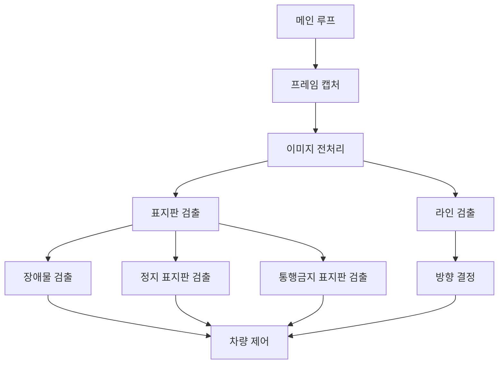
```mermaid
graph TB
    A[메인 루프] --> B[프레임 캡처]
    B --> C[이미지 전처리]
    C --> D[라인 검출]
    C --> E[표지판 검출]
    E --> F[장애물 검출]
    E --> G[정지 표지판 검출]
    E --> H[통행금지 표지판 검출]
    D --> I[방향 결정]
    F --> J[차량 제어]
    G --> J
    H --> J
    I --> J
```

### 핵심 함수 분석

#### 1. Haar Cascade 로딩 (3단계)

```168:185:04_cascade/4_autoplot_harr_cascade.py
# Haar Cascade models 경로 설정
obstacle_cascade_path = "./xml/obstacle.xml"
stop_cascade_path = "./xml/stop.xml"
no_drive_cascade_path = "./xml/no_drive.xml"

# Haar Cascade models 로드
obstacle_cascade = cv2.CascadeClassifier(obstacle_cascade_path)
stop_cascade = cv2.CascadeClassifier(stop_cascade_path)
no_drive_cascade = cv2.CascadeClassifier(no_drive_cascade_path)

if obstacle_cascade.empty():
    print("⚠️  경고: obstacle.xml을 찾을 수 없습니다.")
if stop_cascade.empty():
    print("⚠️  경고: stop.xml을 찾을 수 없습니다.")
if no_drive_cascade.empty():
    print("⚠️  경고: no_drive.xml을 찾을 수 없습니다.")

print("✅ Haar Cascade 분류기 로딩 완료\n")
```

**동작 방식:**
- 3개의 독립적인 Cascade 모델을 로드
- 각 모델은 특정 표지판/장애물을 검출
- 모델 로딩 실패 시 경고 메시지 출력

#### 2. 가중 그레이스케일 변환 (5단계)

```252:263:04_cascade/4_autoplot_harr_cascade.py
def weighted_gray(image, r_weight, g_weight, b_weight):
    """가중 그레이스케일 변환"""
    r_weight /= 100.0
    g_weight /= 100.0
    b_weight /= 100.0
    return cv2.addWeighted(
        cv2.addWeighted(image[:, :, 2], r_weight, image[:, :, 1], g_weight, 0),
        1.0,
        image[:, :, 0],
        b_weight,
        0,
    )
```

**동작 방식:**
- RGB 채널에 가중치를 적용하여 그레이스케일 생성
- 환경에 따라 RGB 가중치를 조정하여 검출 성능 향상
- 기본값: R=30%, G=40%, B=60%

#### 3. 장애물 검출 함수 (9단계)

```511:544:04_cascade/4_autoplot_harr_cascade.py
def detect_obstacle(frame, control_signals, event, r_weight, g_weight, b_weight):
    """
    장애물 검출 함수

    처리 단계:
    1. 그레이스케일 변환
    2. Haar Cascade로 장애물 검출
    3. 검출 결과를 control_signals에 저장
    4. 장애물 검출 시 서보 모터 회전하여 통행금지 표지판 확인
    5. 이벤트 신호 전송
    """
    if obstacle_cascade.empty():
        print("⚠️  장애물 분류기 로딩 실패")
        event.set()
        return

    gray = weighted_gray(frame, r_weight, g_weight, b_weight)
    obstacles = obstacle_cascade.detectMultiScale(gray, scaleFactor=1.1, minNeighbors=5)

    for x, y, w, h in obstacles:
        cv2.rectangle(frame, (x, y), (x + w, y + h), (0, 255, 0), 2)

    control_signals["obstacle"] = len(obstacles) > 0
    if control_signals["obstacle"]:
        draw_rectangles_and_text(frame, obstacles, "obstacles")
        # 서보 모터 2를 85도로 회전하여 카메라 각도 조절
        rotate_servo(2, 85)
        time.sleep(1)
        # 카메라로부터 새로운 프레임을 받아옴
        ret, new_frame = cap.read()
        if ret:
            no_drive_sign(new_frame, control_signals, r_weight, g_weight, b_weight)

    event.set()
```

**동작 방식:**
1. 그레이스케일 변환
2. `detectMultiScale`로 장애물 검출
3. 검출 결과를 `control_signals` 딕셔너리에 저장
4. 장애물 검출 시 서보 모터를 회전시켜 통행금지 표지판 확인
5. 스레드 완료 신호 전송

#### 4. 정지 표지판 검출 함수 (9단계)

```569:590:04_cascade/4_autoplot_harr_cascade.py
def stop_sign(frame, control_signals, event, r_weight, g_weight, b_weight):
    """
    정지 표지판 검출 함수

    처리 단계:
    1. 그레이스케일 변환
    2. Haar Cascade로 정지 표지판 검출
    3. 검출 결과를 control_signals에 저장
    4. 이벤트 신호 전송
    """
    if stop_cascade.empty():
        print("⚠️  정지 표지판 분류기 로딩 실패")
        event.set()
        return

    gray = weighted_gray(frame, r_weight, g_weight, b_weight)
    stop_signs = stop_cascade.detectMultiScale(gray, scaleFactor=1.1, minNeighbors=5)
    control_signals["stop"] = len(stop_signs) > 0
    if control_signals["stop"]:
        draw_rectangles_and_text(frame, stop_signs, "stop_signs")

    event.set()
```

**동작 방식:**
- 독립적인 스레드에서 실행
- 정지 표지판 검출 시 `control_signals["stop"] = True` 설정
- 메인 루프에서 이 신호를 확인하여 차량 정지

#### 5. 메인 루프에서의 표지판 검출 (10단계)

```python
        # 표지판 검출 (스레드 사용)
        obstacle_event = threading.Event()
        stop_sign_event = threading.Event()

        detect_obstacle_thread = threading.Thread(
            target=detect_obstacle,
            args=(frame, control_signals, obstacle_event, r_weight, g_weight, b_weight),
        )
        stop_sign_thread = threading.Thread(
            target=stop_sign,
            args=(
                frame,
                control_signals,
                stop_sign_event,
                r_weight,
                g_weight,
                b_weight,
            ),
        )

        detect_obstacle_thread.start()
        stop_sign_thread.start()

        # 스레드 완료 대기
        obstacle_event.wait()
        stop_sign_event.wait()

        # 표지판에 따른 제어
        if control_signals["obstacle"]:
            if DEBUG_MODE:
                print("🚧 장애물 검출! 회피 중...")
        elif control_signals["no_drive"]:
            if DEBUG_MODE:
                print("🚫 통행금지 표지판 검출! 정지 중...")
            rotate_servo(2, 75)
            time.sleep(0.8)
            beep_sound()
            car_stop()
        elif control_signals["stop"]:
            if DEBUG_MODE:
                print("🛑 정지 표지판 검출! 정지 중...")
            car_stop()
```

**동작 방식:**
1. **병렬 검출**: 장애물과 정지 표지판을 동시에 검출
2. **이벤트 기반 동기화**: 각 스레드가 완료되면 이벤트 신호 전송
3. **우선순위 처리**: 통행금지 > 정지 표지판 > 장애물 순서로 처리
4. **차량 제어**: 검출 결과에 따라 차량 정지 또는 회피

---

## 시스템 동작 흐름

### 전체 시스템 동작 다이어그램

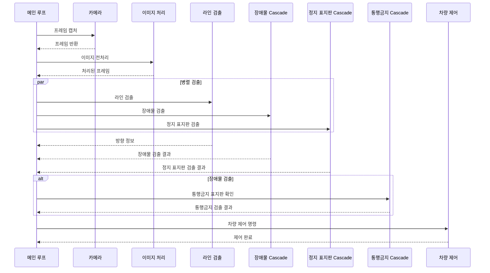
```mermaid
sequenceDiagram
    participant Main as 메인 루프
    participant Camera as 카메라
    participant Process as 이미지 처리
    participant Line as 라인 검출
    participant Cascade1 as 장애물 Cascade
    participant Cascade2 as 정지 표지판 Cascade
    participant Cascade3 as 통행금지 Cascade
    participant Control as 차량 제어

    Main->>Camera: 프레임 캡처
    Camera-->>Main: 프레임 반환
    Main->>Process: 이미지 전처리
    Process-->>Main: 처리된 프레임
    
    par 병렬 검출
        Main->>Line: 라인 검출
        Main->>Cascade1: 장애물 검출
        Main->>Cascade2: 정지 표지판 검출
    end
    
    Line-->>Main: 방향 정보
    Cascade1-->>Main: 장애물 검출 결과
    Cascade2-->>Main: 정지 표지판 검출 결과
    
    alt 장애물 검출
        Main->>Cascade3: 통행금지 표지판 확인
        Cascade3-->>Main: 통행금지 검출 결과
    end
    
    Main->>Control: 차량 제어 명령
    Control-->>Main: 제어 완료
```

### 프레임별 처리 흐름

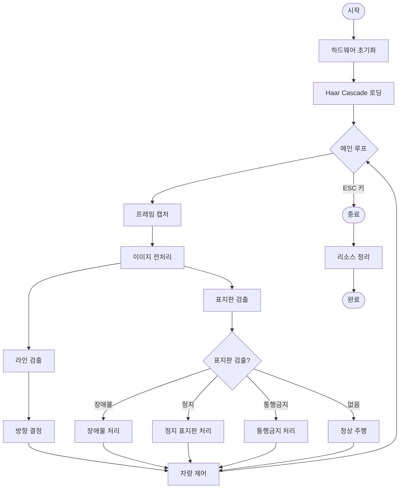
```mermaid
flowchart TD
    Start([시작]) --> Init[하드웨어 초기화]
    Init --> Load[Haar Cascade 로딩]
    Load --> Loop{메인 루프}
    
    Loop --> Capture[프레임 캡처]
    Capture --> Preprocess[이미지 전처리]
    Preprocess --> LineDetect[라인 검출]
    Preprocess --> SignDetect[표지판 검출]
    
    LineDetect --> Direction[방향 결정]
    SignDetect --> Check{표지판 검출?}
    
    Check -->|장애물| Obstacle[장애물 처리]
    Check -->|정지| Stop[정지 표지판 처리]
    Check -->|통행금지| NoDrive[통행금지 처리]
    Check -->|없음| Normal[정상 주행]
    
    Obstacle --> Control[차량 제어]
    Stop --> Control
    NoDrive --> Control
    Normal --> Control
    Direction --> Control
    
    Control --> Loop
    
    Loop -->|ESC 키| End([종료])
    End --> Cleanup[리소스 정리]
    Cleanup --> Finish([완료])
```

### 멀티스레드 검출 흐름

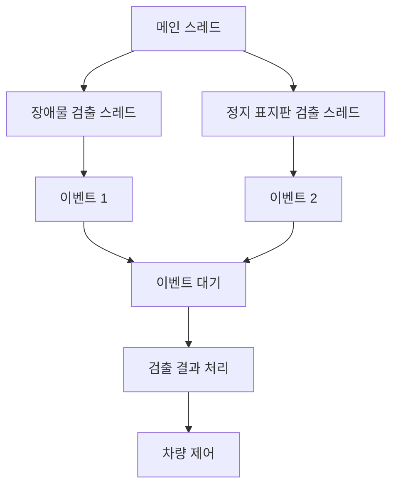
```mermaid
graph TB
    Main[메인 스레드] --> T1[장애물 검출 스레드]
    Main --> T2[정지 표지판 검출 스레드]
    
    T1 --> E1[이벤트 1]
    T2 --> E2[이벤트 2]
    
    E1 --> Wait[이벤트 대기]
    E2 --> Wait
    
    Wait --> Process[검출 결과 처리]
    Process --> Control[차량 제어]
```

### 성능 최적화 전략

1. **멀티스레드 활용**
   - 여러 Cascade를 병렬로 검출
   - 메인 루프 블로킹 최소화

2. **ROI (Region of Interest) 설정**
   - 관심 영역만 검출하여 성능 향상
   - 불필요한 영역 제외

3. **스케일 파라미터 조정**
   - `scaleFactor` 조정으로 속도/정확도 균형
   - 환경에 맞는 최적값 찾기

4. **프레임 스킵**
   - 모든 프레임이 아닌 일정 간격으로 검출
   - CPU 부하 감소

---

## 실전 활용 팁

### 1. 파라미터 튜닝

```python
# 빠른 검출 (낮은 정확도)
detections = cascade.detectMultiScale(
    gray,
    scaleFactor=1.3,      # 큰 스케일 (빠름)
    minNeighbors=3,      # 낮은 이웃 수 (빠름)
    minSize=(20, 20)      # 작은 최소 크기
)

# 정확한 검출 (느린 속도)
detections = cascade.detectMultiScale(
    gray,
    scaleFactor=1.05,    # 작은 스케일 (정확)
    minNeighbors=7,      # 높은 이웃 수 (정확)
    minSize=(50, 50)      # 큰 최소 크기
)
```

### 2. 다중 Cascade 조합

```python
# 여러 표지판 동시 검출
obstacles = obstacle_cascade.detectMultiScale(gray)
stop_signs = stop_cascade.detectMultiScale(gray)
no_drive = no_drive_cascade.detectMultiScale(gray)

# 우선순위 처리
if len(no_drive) > 0:
    car_stop()  # 최우선
elif len(stop_signs) > 0:
    car_stop()
elif len(obstacles) > 0:
    avoid_obstacle()  # 회피
```

### 3. 환경별 최적화

```python
# 밝은 환경
r_weight, g_weight, b_weight = 30, 40, 60

# 어두운 환경
r_weight, g_weight, b_weight = 20, 30, 50

# 조명 변화 대응
if average_brightness < threshold:
    # 어두운 환경 파라미터 사용
    adjust_parameters_for_dark()
```

---

## 실전 예시: 파라미터 상세 가이드 (Python OpenCV)

### 1. detectMultiScale() 파라미터 완전 분석

```python
import cv2
import numpy as np

# Haar Cascade 로드
cascade = cv2.CascadeClassifier('cascade.xml')

# 기본 사용법
detections = cascade.detectMultiScale(
    image,                    # 입력 이미지 (그레이스케일)
    scaleFactor=1.1,         # 이미지 피라미드 스케일 비율
    minNeighbors=5,          # 최소 이웃 사각형 개수
    flags=0,                 # 구식 파라미터 (보통 0 사용)
    minSize=(30, 30),        # 검출할 최소 객체 크기
    maxSize=(300, 300)       # 검출할 최대 객체 크기
)
```

### 2. scaleFactor 파라미터 실전 가이드

**정의**: 각 이미지 스케일에서 이미지 크기를 축소하는 비율

```python
# ========================================
# scaleFactor 값에 따른 성능 비교
# ========================================

def test_scale_factors(image_path):
    """
    다양한 scaleFactor 값 테스트
    """
    cascade = cv2.CascadeClassifier('stop.xml')
    img = cv2.imread(image_path)
    gray = cv2.cvtColor(img, cv2.COLOR_BGR2GRAY)
    
    scale_factors = [1.01, 1.05, 1.1, 1.2, 1.3, 1.5]
    results = []
    
    for scale in scale_factors:
        import time
        start_time = time.time()
        
        detections = cascade.detectMultiScale(
            gray,
            scaleFactor=scale,
            minNeighbors=5,
            minSize=(30, 30)
        )
        
        elapsed_time = (time.time() - start_time) * 1000  # ms
        results.append({
            'scaleFactor': scale,
            'detections': len(detections),
            'time_ms': elapsed_time
        })
        
        print(f"scaleFactor={scale:.2f}: {len(detections)}개 검출, {elapsed_time:.2f}ms")
    
    return results

# 실행 예시
# scaleFactor=1.01: 5개 검출, 850ms  (매우 정확, 매우 느림)
# scaleFactor=1.05: 5개 검출, 320ms  (정확, 느림)
# scaleFactor=1.10: 4개 검출, 120ms  (균형있음) ⭐ 권장
# scaleFactor=1.20: 3개 검출, 65ms   (빠름, 일부 누락)
# scaleFactor=1.30: 2개 검출, 45ms   (매우 빠름, 많이 누락)
# scaleFactor=1.50: 1개 검출, 28ms   (초고속, 대부분 누락)
```

**권장 설정:**
- **실시간 처리 필요 (Raspberry Pi)**: `1.1 ~ 1.2`
- **고정확도 필요 (데스크톱)**: `1.05 ~ 1.1`
- **초고속 처리 필요**: `1.3 ~ 1.5`

### 3. minNeighbors 파라미터 실전 가이드

**정의**: 검출된 영역을 최종 검출로 판단하기 위한 최소 이웃 사각형 개수

```python
# ========================================
# minNeighbors 값에 따른 오탐/미탐 분석
# ========================================

def test_min_neighbors(image_path):
    """
    다양한 minNeighbors 값 테스트
    오탐(False Positive)과 미탐(False Negative) 분석
    """
    cascade = cv2.CascadeClassifier('stop.xml')
    img = cv2.imread(image_path)
    gray = cv2.cvtColor(img, cv2.COLOR_BGR2GRAY)
    
    min_neighbors_values = [1, 2, 3, 4, 5, 6, 7, 8, 10]
    
    for min_n in min_neighbors_values:
        detections = cascade.detectMultiScale(
            gray,
            scaleFactor=1.1,
            minNeighbors=min_n,
            minSize=(30, 30)
        )
        
        # 시각화
        result_img = img.copy()
        for (x, y, w, h) in detections:
            cv2.rectangle(result_img, (x, y), (x+w, y+h), (0, 255, 0), 2)
        
        print(f"minNeighbors={min_n}: {len(detections)}개 검출")
        cv2.imshow(f'minNeighbors={min_n}', result_img)
        cv2.waitKey(0)

# 실행 예시
# minNeighbors=1: 25개 검출  (오탐 많음 ❌)
# minNeighbors=2: 18개 검출  (오탐 많음 ❌)
# minNeighbors=3: 12개 검출  (오탐 있음 ⚠️)
# minNeighbors=4: 7개 검출   (균형있음 ⭐)
# minNeighbors=5: 5개 검출   (균형있음 ⭐) - 권장
# minNeighbors=6: 4개 검출   (안정적 ✅)
# minNeighbors=7: 3개 검출   (매우 안정적 ✅)
# minNeighbors=8: 2개 검출   (미탐 가능성 ⚠️)
# minNeighbors=10: 1개 검출  (미탐 많음 ❌)
```

**권장 설정:**
- **오탐 방지 우선 (정밀도 중요)**: `6 ~ 8`
- **균형있는 검출**: `4 ~ 5` ⭐ 권장
- **검출률 우선 (재현율 중요)**: `2 ~ 3`

### 4. minSize / maxSize 파라미터 실전 가이드

**정의**: 검출할 객체의 최소/최대 크기

```python
# ========================================
# minSize/maxSize 최적화 전략
# ========================================

def optimize_size_parameters(image_path, expected_object_distance):
    """
    카메라와 객체 간 거리에 따른 크기 파라미터 최적화
    
    Args:
        image_path: 테스트 이미지 경로
        expected_object_distance: 예상 객체 거리 (cm)
    """
    cascade = cv2.CascadeClassifier('stop.xml')
    img = cv2.imread(image_path)
    gray = cv2.cvtColor(img, cv2.COLOR_BGR2GRAY)
    
    # 거리별 최적 크기 설정
    distance_configs = {
        'very_close': {  # 0~50cm
            'minSize': (100, 100),
            'maxSize': (400, 400),
            'description': '매우 가까운 거리 (0~50cm)'
        },
        'close': {  # 50~100cm
            'minSize': (60, 60),
            'maxSize': (250, 250),
            'description': '가까운 거리 (50~100cm)'
        },
        'medium': {  # 100~200cm
            'minSize': (40, 40),
            'maxSize': (150, 150),
            'description': '중간 거리 (100~200cm)'
        },
        'far': {  # 200~400cm
            'minSize': (20, 20),
            'maxSize': (80, 80),
            'description': '먼 거리 (200~400cm)'
        },
        'all_range': {  # 전체 범위
            'minSize': (20, 20),
            'maxSize': (400, 400),
            'description': '전체 범위 (느림)'
        }
    }
    
    # 각 설정별 테스트
    for config_name, config in distance_configs.items():
        detections = cascade.detectMultiScale(
            gray,
            scaleFactor=1.1,
            minNeighbors=5,
            minSize=config['minSize'],
            maxSize=config['maxSize']
        )
        
        print(f"\n{config['description']}")
        print(f"minSize={config['minSize']}, maxSize={config['maxSize']}")
        print(f"검출 개수: {len(detections)}개")
        
        # 검출된 객체 크기 출력
        for i, (x, y, w, h) in enumerate(detections):
            print(f"  객체 {i+1}: {w}x{h} pixels")

# ========================================
# 실전 예시: 자율주행 로봇에서 사용
# ========================================

class AdaptiveSizeDetector:
    """
    거리 센서를 활용한 적응형 크기 검출기
    """
    def __init__(self, cascade_path):
        self.cascade = cv2.CascadeClassifier(cascade_path)
    
    def detect_with_distance(self, image, distance_cm):
        """
        거리 정보를 활용한 최적화된 검출
        
        Args:
            image: 입력 이미지
            distance_cm: 초음파 센서로 측정한 거리 (cm)
        
        Returns:
            detections: 검출된 객체 리스트
        """
        gray = cv2.cvtColor(image, cv2.COLOR_BGR2GRAY)
        
        # 거리에 따른 동적 크기 설정
        if distance_cm < 50:
            min_size, max_size = (100, 100), (400, 400)
        elif distance_cm < 100:
            min_size, max_size = (60, 60), (250, 250)
        elif distance_cm < 200:
            min_size, max_size = (40, 40), (150, 150)
        else:
            min_size, max_size = (20, 20), (80, 80)
        
        detections = self.cascade.detectMultiScale(
            gray,
            scaleFactor=1.1,
            minNeighbors=5,
            minSize=min_size,
            maxSize=max_size
        )
        
        return detections

# 사용 예시
detector = AdaptiveSizeDetector('stop.xml')
distance = get_ultrasonic_distance()  # 초음파 센서로 거리 측정
detections = detector.detect_with_distance(frame, distance)
```

**권장 설정:**
- **자율주행 로봇 (전체 범위)**: `minSize=(30, 30), maxSize=(300, 300)`
- **실내 근거리 검출**: `minSize=(80, 80), maxSize=(400, 400)`
- **실외 원거리 검출**: `minSize=(20, 20), maxSize=(100, 100)`

### 5. 환경별 최적 파라미터 조합

```python
# ========================================
# 환경별 최적 파라미터 프리셋
# ========================================

class EnvironmentPresets:
    """
    다양한 환경에 최적화된 파라미터 프리셋
    """
    
    @staticmethod
    def get_preset(environment_type):
        """
        환경 타입별 최적 파라미터 반환
        """
        presets = {
            # 라즈베리파이 실시간 처리
            'raspberry_pi_realtime': {
                'scaleFactor': 1.15,
                'minNeighbors': 4,
                'minSize': (30, 30),
                'maxSize': (200, 200),
                'description': 'Raspberry Pi 실시간 처리 (30 FPS 목표)'
            },
            
            # 고정확도 데스크톱 처리
            'desktop_high_accuracy': {
                'scaleFactor': 1.05,
                'minNeighbors': 6,
                'minSize': (20, 20),
                'maxSize': (400, 400),
                'description': '데스크톱 고정확도 처리'
            },
            
            # 밝은 실내 환경
            'bright_indoor': {
                'scaleFactor': 1.1,
                'minNeighbors': 5,
                'minSize': (30, 30),
                'maxSize': (250, 250),
                'description': '밝은 실내 환경'
            },
            
            # 어두운 실내 환경
            'dark_indoor': {
                'scaleFactor': 1.2,
                'minNeighbors': 4,
                'minSize': (40, 40),
                'maxSize': (200, 200),
                'description': '어두운 실내 환경'
            },
            
            # 실외 햇빛 환경
            'outdoor_sunny': {
                'scaleFactor': 1.15,
                'minNeighbors': 6,
                'minSize': (25, 25),
                'maxSize': (300, 300),
                'description': '실외 햇빛 환경 (그림자 많음)'
            },
            
            # 빠른 움직임 환경
            'fast_movement': {
                'scaleFactor': 1.2,
                'minNeighbors': 3,
                'minSize': (40, 40),
                'maxSize': (250, 250),
                'description': '빠른 움직임 환경 (속도 우선)'
            }
        }
        
        return presets.get(environment_type, presets['raspberry_pi_realtime'])
    
    @staticmethod
    def detect_with_preset(cascade, image, preset_name):
        """
        프리셋을 사용한 검출
        """
        preset = EnvironmentPresets.get_preset(preset_name)
        print(f"사용 중인 프리셋: {preset['description']}")
        
        gray = cv2.cvtColor(image, cv2.COLOR_BGR2GRAY)
        
        detections = cascade.detectMultiScale(
            gray,
            scaleFactor=preset['scaleFactor'],
            minNeighbors=preset['minNeighbors'],
            minSize=preset['minSize'],
            maxSize=preset['maxSize']
        )
        
        return detections

# 사용 예시
cascade = cv2.CascadeClassifier('stop.xml')
detections = EnvironmentPresets.detect_with_preset(
    cascade, 
    frame, 
    'raspberry_pi_realtime'
)
```

### 6. 실시간 파라미터 튜닝 GUI 도구

```python
# ========================================
# 대화형 파라미터 튜닝 도구
# ========================================

import cv2
import numpy as np

class HaarCascadeTuner:
    """
    실시간 파라미터 조정 및 결과 확인 도구
    """
    def __init__(self, cascade_path, video_source=0):
        self.cascade = cv2.CascadeClassifier(cascade_path)
        self.cap = cv2.VideoCapture(video_source)
        
        # 초기 파라미터
        self.scale_factor = 11  # 1.1 (10배)
        self.min_neighbors = 5
        self.min_size = 30
        self.max_size = 300
        
        self.setup_trackbars()
    
    def setup_trackbars(self):
        """
        트랙바 설정
        """
        cv2.namedWindow('Haar Cascade Tuner')
        
        # scaleFactor 트랙바 (1.01 ~ 2.0)
        cv2.createTrackbar(
            'scaleFactor x10',
            'Haar Cascade Tuner',
            self.scale_factor,
            30,  # 최대값 3.0
            self.on_scale_change
        )
        
        # minNeighbors 트랙바 (0 ~ 15)
        cv2.createTrackbar(
            'minNeighbors',
            'Haar Cascade Tuner',
            self.min_neighbors,
            15,
            self.on_neighbors_change
        )
        
        # minSize 트랙바 (10 ~ 200)
        cv2.createTrackbar(
            'minSize',
            'Haar Cascade Tuner',
            self.min_size,
            200,
            self.on_min_size_change
        )
        
        # maxSize 트랙바 (50 ~ 500)
        cv2.createTrackbar(
            'maxSize',
            'Haar Cascade Tuner',
            self.max_size,
            500,
            self.on_max_size_change
        )
    
    def on_scale_change(self, value):
        self.scale_factor = max(10, value)  # 최소 1.0
    
    def on_neighbors_change(self, value):
        self.min_neighbors = max(1, value)
    
    def on_min_size_change(self, value):
        self.min_size = max(10, value)
    
    def on_max_size_change(self, value):
        self.max_size = max(self.min_size + 10, value)
    
    def run(self):
        """
        실시간 튜닝 실행
        """
        while True:
            ret, frame = self.cap.read()
            if not ret:
                break
            
            gray = cv2.cvtColor(frame, cv2.COLOR_BGR2GRAY)
            
            # 현재 파라미터로 검출
            scale_factor_value = self.scale_factor / 10.0
            
            import time
            start_time = time.time()
            
            detections = self.cascade.detectMultiScale(
                gray,
                scaleFactor=scale_factor_value,
                minNeighbors=self.min_neighbors,
                minSize=(self.min_size, self.min_size),
                maxSize=(self.max_size, self.max_size)
            )
            
            elapsed_time = (time.time() - start_time) * 1000
            
            # 결과 시각화
            result_frame = frame.copy()
            for (x, y, w, h) in detections:
                cv2.rectangle(result_frame, (x, y), (x+w, y+h), (0, 255, 0), 2)
                cv2.putText(
                    result_frame,
                    f'{w}x{h}',
                    (x, y-5),
                    cv2.FONT_HERSHEY_SIMPLEX,
                    0.5,
                    (0, 255, 0),
                    1
                )
            
            # 정보 표시
            info_text = [
                f'scaleFactor: {scale_factor_value:.2f}',
                f'minNeighbors: {self.min_neighbors}',
                f'minSize: {self.min_size}x{self.min_size}',
                f'maxSize: {self.max_size}x{self.max_size}',
                f'Detections: {len(detections)}',
                f'Time: {elapsed_time:.2f}ms',
                f'FPS: {1000/elapsed_time:.1f}'
            ]
            
            for i, text in enumerate(info_text):
                cv2.putText(
                    result_frame,
                    text,
                    (10, 30 + i*25),
                    cv2.FONT_HERSHEY_SIMPLEX,
                    0.6,
                    (0, 255, 255),
                    2
                )
            
            cv2.imshow('Haar Cascade Tuner', result_frame)
            
            key = cv2.waitKey(1) & 0xFF
            if key == 27:  # ESC
                break
            elif key == ord('p'):  # 현재 설정 출력
                print("\n" + "="*50)
                print("현재 최적 파라미터:")
                print(f"  scaleFactor={scale_factor_value:.2f}")
                print(f"  minNeighbors={self.min_neighbors}")
                print(f"  minSize=({self.min_size}, {self.min_size})")
                print(f"  maxSize=({self.max_size}, {self.max_size})")
                print(f"  검출 개수: {len(detections)}")
                print(f"  처리 시간: {elapsed_time:.2f}ms")
                print("="*50 + "\n")
        
        self.cap.release()
        cv2.destroyAllWindows()

# 사용 방법
if __name__ == '__main__':
    tuner = HaarCascadeTuner('stop.xml', video_source=0)
    print("트랙바를 조정하여 최적 파라미터를 찾으세요.")
    print("'p' 키: 현재 설정 출력")
    print("'ESC' 키: 종료")
    tuner.run()
```

---

## 구체적인 알고리즘 동작 원리

### 1. Haar Feature 계산 과정

```python
# ========================================
# Haar Feature 계산 예시
# ========================================

import numpy as np
import cv2

def calculate_haar_feature(integral_image, x, y, w, h, feature_type='edge_horizontal'):
    """
    Haar Feature 값 계산
    
    Args:
        integral_image: 적분 이미지
        x, y: 시작 좌표
        w, h: 특징 영역 크기
        feature_type: 특징 유형
    
    Returns:
        feature_value: Haar Feature 값
    """
    
    def sum_region(img, x1, y1, x2, y2):
        """
        적분 이미지를 사용한 영역 합 계산 (O(1) 시간)
        """
        # 안전성 검사
        if x1 < 0: x1 = 0
        if y1 < 0: y1 = 0
        
        # 적분 이미지 공식: S = D - B - C + A
        A = img[y1-1, x1-1] if y1 > 0 and x1 > 0 else 0
        B = img[y1-1, x2] if y1 > 0 else 0
        C = img[y2, x1-1] if x1 > 0 else 0
        D = img[y2, x2]
        
        return D - B - C + A
    
    if feature_type == 'edge_horizontal':
        # 수평 엣지 특징: 상단 밝음 - 하단 어두움
        half_h = h // 2
        white_region = sum_region(integral_image, x, y, x+w, y+half_h)
        black_region = sum_region(integral_image, x, y+half_h, x+w, y+h)
        return white_region - black_region
    
    elif feature_type == 'edge_vertical':
        # 수직 엣지 특징: 좌측 밝음 - 우측 어두움
        half_w = w // 2
        white_region = sum_region(integral_image, x, y, x+half_w, y+h)
        black_region = sum_region(integral_image, x+half_w, y, x+w, y+h)
        return white_region - black_region
    
    elif feature_type == 'line_horizontal':
        # 수평 선 특징: 중간 밝음 - 상하 어두움
        third_h = h // 3
        top_region = sum_region(integral_image, x, y, x+w, y+third_h)
        mid_region = sum_region(integral_image, x, y+third_h, x+w, y+2*third_h)
        bottom_region = sum_region(integral_image, x, y+2*third_h, x+w, y+h)
        return mid_region - (top_region + bottom_region)
    
    elif feature_type == 'center_surround':
        # 중심-주변 특징: 중앙 밝음 - 주변 어두움
        quarter_w = w // 4
        quarter_h = h // 4
        center = sum_region(
            integral_image,
            x+quarter_w, y+quarter_h,
            x+3*quarter_w, y+3*quarter_h
        )
        full = sum_region(integral_image, x, y, x+w, y+h)
        surround = full - center
        return center - surround
    
    return 0

# 실제 사용 예시
def extract_haar_features(image):
    """
    이미지에서 다양한 Haar Feature 추출
    """
    # 1. 적분 이미지 생성
    gray = cv2.cvtColor(image, cv2.COLOR_BGR2GRAY)
    integral = cv2.integral(gray)
    
    # 2. 다양한 위치와 크기에서 특징 추출
    features = []
    h, w = gray.shape
    
    # 여러 스케일로 특징 추출
    for scale in [20, 40, 60, 80]:
        for x in range(0, w - scale, 10):
            for y in range(0, h - scale, 10):
                # 4가지 타입의 특징 추출
                f1 = calculate_haar_feature(integral, x, y, scale, scale, 'edge_horizontal')
                f2 = calculate_haar_feature(integral, x, y, scale, scale, 'edge_vertical')
                f3 = calculate_haar_feature(integral, x, y, scale, scale, 'line_horizontal')
                f4 = calculate_haar_feature(integral, x, y, scale, scale, 'center_surround')
                
                features.extend([f1, f2, f3, f4])
    
    return features
```

### 2. AdaBoost 분류기 학습 과정

```python
# ========================================
# AdaBoost 알고리즘 개념적 구현
# ========================================

class WeakClassifier:
    """
    약한 분류기 (단일 Haar Feature 기반)
    """
    def __init__(self, feature_idx, threshold, polarity):
        self.feature_idx = feature_idx  # 사용할 특징 인덱스
        self.threshold = threshold       # 임계값
        self.polarity = polarity        # 극성 (1 또는 -1)
    
    def classify(self, feature_value):
        """
        특징 값을 기반으로 분류
        """
        if self.polarity * feature_value < self.polarity * self.threshold:
            return 1  # 객체
        else:
            return 0  # 배경

class AdaBoostTrainer:
    """
    AdaBoost 학습 알고리즘 (개념적 구현)
    """
    def __init__(self, num_weak_classifiers=100):
        self.num_weak_classifiers = num_weak_classifiers
        self.weak_classifiers = []
        self.classifier_weights = []
    
    def train(self, features, labels):
        """
        AdaBoost 학습
        
        Args:
            features: 특징 배열 (N x M), N=샘플수, M=특징수
            labels: 레이블 배열 (N,), 1=객체, 0=배경
        """
        n_samples, n_features = features.shape
        
        # 1. 샘플 가중치 초기화 (균등 분포)
        sample_weights = np.ones(n_samples) / n_samples
        
        for t in range(self.num_weak_classifiers):
            # 2. 현재 가중치로 최적의 약한 분류기 찾기
            best_weak_clf = self._find_best_weak_classifier(
                features, labels, sample_weights
            )
            
            # 3. 약한 분류기의 예측
            predictions = np.array([
                best_weak_clf.classify(features[i, best_weak_clf.feature_idx])
                for i in range(n_samples)
            ])
            
            # 4. 가중 오류율 계산
            errors = (predictions != labels).astype(int)
            weighted_error = np.sum(sample_weights * errors)
            
            # 5. 분류기 가중치 계산
            if weighted_error == 0:
                weighted_error = 1e-10
            if weighted_error >= 0.5:
                break
                
            classifier_weight = 0.5 * np.log((1 - weighted_error) / weighted_error)
            
            # 6. 샘플 가중치 업데이트
            sample_weights *= np.exp(-classifier_weight * labels * (2 * predictions - 1))
            sample_weights /= np.sum(sample_weights)  # 정규화
            
            # 7. 약한 분류기 저장
            self.weak_classifiers.append(best_weak_clf)
            self.classifier_weights.append(classifier_weight)
            
            print(f"라운드 {t+1}: 오류율={weighted_error:.4f}, 가중치={classifier_weight:.4f}")
    
    def _find_best_weak_classifier(self, features, labels, sample_weights):
        """
        현재 샘플 가중치에서 최적의 약한 분류기 찾기
        """
        n_samples, n_features = features.shape
        best_error = float('inf')
        best_clf = None
        
        # 모든 특징에 대해 탐색 (실제로는 일부만 샘플링)
        for feature_idx in range(min(n_features, 100)):  # 속도를 위해 제한
            feature_values = features[:, feature_idx]
            
            # 임계값 후보 (특징 값의 분위수)
            thresholds = np.percentile(feature_values, [25, 50, 75])
            
            for threshold in thresholds:
                for polarity in [1, -1]:
                    # 약한 분류기 생성
                    clf = WeakClassifier(feature_idx, threshold, polarity)
                    
                    # 예측 및 오류율 계산
                    predictions = np.array([
                        clf.classify(feature_values[i])
                        for i in range(n_samples)
                    ])
                    
                    errors = (predictions != labels).astype(int)
                    weighted_error = np.sum(sample_weights * errors)
                    
                    # 최적 분류기 업데이트
                    if weighted_error < best_error:
                        best_error = weighted_error
                        best_clf = clf
        
        return best_clf
    
    def predict(self, features):
        """
        강한 분류기로 예측
        """
        n_samples = features.shape[0]
        predictions = np.zeros(n_samples)
        
        # 모든 약한 분류기의 가중 투표
        for clf, weight in zip(self.weak_classifiers, self.classifier_weights):
            clf_predictions = np.array([
                clf.classify(features[i, clf.feature_idx])
                for i in range(n_samples)
            ])
            predictions += weight * (2 * clf_predictions - 1)
        
        # 최종 분류 (0 또는 1)
        return (predictions >= 0).astype(int)

# 사용 예시
# trainer = AdaBoostTrainer(num_weak_classifiers=100)
# trainer.train(training_features, training_labels)
# predictions = trainer.predict(test_features)
```

### 3. Cascade 구조 동작 원리

```python
# ========================================
# Cascade Classifier 단계별 동작
# ========================================

class CascadeStage:
    """
    Cascade의 단일 단계
    """
    def __init__(self, weak_classifiers, threshold):
        self.weak_classifiers = weak_classifiers  # 약한 분류기 리스트
        self.threshold = threshold                # 단계 통과 임계값
    
    def evaluate(self, features):
        """
        이 단계의 평가
        
        Returns:
            score: 분류 점수
            passed: 다음 단계로 진행 여부
        """
        score = sum(clf.classify(features) * clf.weight 
                   for clf in self.weak_classifiers)
        
        passed = score >= self.threshold
        return score, passed

class CascadeClassifier:
    """
    Cascade Classifier 전체 구조
    """
    def __init__(self):
        self.stages = []
    
    def add_stage(self, stage):
        """
        새로운 단계 추가
        """
        self.stages.append(stage)
    
    def classify_window(self, image_window):
        """
        이미지 윈도우 분류
        
        동작 방식:
        1. 1단계 분류기 적용
           - 통과 → 2단계로
           - 실패 → 즉시 배경으로 판단 (Early Rejection)
        2. 2단계 분류기 적용
           - 통과 → 3단계로
           - 실패 → 배경으로 판단
        3. ... 모든 단계 반복
        4. 마지막 단계 통과 → 최종 검출!
        """
        # 특징 추출
        features = extract_haar_features(image_window)
        
        # 각 단계별로 평가
        for stage_num, stage in enumerate(self.stages):
            score, passed = stage.evaluate(features)
            
            if not passed:
                # Early Rejection: 즉시 배경으로 판단
                return False, stage_num  # (검출 실패, 실패한 단계)
        
        # 모든 단계 통과 → 객체 검출!
        return True, len(self.stages)
    
    def detect_multiscale(self, image, scale_factor=1.1, min_size=(30, 30)):
        """
        다중 스케일 검출
        
        처리 과정:
        1. 원본 이미지에서 검출 (큰 객체)
        2. 이미지를 scale_factor로 축소
        3. 축소된 이미지에서 검출 (중간 객체)
        4. 반복... (작은 객체까지)
        """
        detections = []
        h, w = image.shape[:2]
        
        current_scale = 1.0
        min_w, min_h = min_size
        
        while True:
            # 현재 스케일의 이미지 크기
            scaled_w = int(w / current_scale)
            scaled_h = int(h / current_scale)
            
            # 최소 크기보다 작으면 중단
            if scaled_w < min_w or scaled_h < min_h:
                break
            
            # 이미지 리사이즈
            scaled_image = cv2.resize(image, (scaled_w, scaled_h))
            
            # Sliding Window로 검출
            window_size = 24  # 학습 시 사용한 윈도우 크기
            step_size = 2     # 윈도우 이동 간격
            
            for y in range(0, scaled_h - window_size, step_size):
                for x in range(0, scaled_w - window_size, step_size):
                    # 윈도우 추출
                    window = scaled_image[y:y+window_size, x:x+window_size]
                    
                    # Cascade 분류
                    is_object, passed_stages = self.classify_window(window)
                    
                    if is_object:
                        # 원본 이미지 좌표로 변환
                        orig_x = int(x * current_scale)
                        orig_y = int(y * current_scale)
                        orig_w = int(window_size * current_scale)
                        orig_h = int(window_size * current_scale)
                        
                        detections.append((orig_x, orig_y, orig_w, orig_h))
            
            # 다음 스케일로
            current_scale *= scale_factor
        
        # 중복 검출 제거 (Non-Maximum Suppression)
        detections = self._non_max_suppression(detections)
        
        return detections
    
    def _non_max_suppression(self, detections, overlap_thresh=0.3):
        """
        겹치는 검출 결과 제거
        """
        if len(detections) == 0:
            return []
        
        # 구현 생략 (OpenCV의 groupRectangles 사용)
        return detections

# 성능 분석
class CascadePerformanceAnalyzer:
    """
    Cascade 성능 분석 도구
    """
    @staticmethod
    def analyze_rejection_rate(cascade, test_images, test_labels):
        """
        각 단계별 배경 제거율 분석
        """
        stage_rejections = [0] * len(cascade.stages)
        total_backgrounds = sum(1 for label in test_labels if label == 0)
        
        for image, label in zip(test_images, test_labels):
            if label == 1:  # 객체는 스킵
                continue
            
            is_object, rejected_at_stage = cascade.classify_window(image)
            
            if not is_object:
                stage_rejections[rejected_at_stage] += 1
        
        # 결과 출력
        print("=" * 60)
        print("Cascade 단계별 배경 제거율 분석")
        print("=" * 60)
        
        cumulative_rejection = 0
        for stage_num, rejections in enumerate(stage_rejections):
            rejection_rate = (rejections / total_backgrounds) * 100
            cumulative_rejection += rejections
            cumulative_rate = (cumulative_rejection / total_backgrounds) * 100
            
            print(f"단계 {stage_num + 1}: "
                  f"{rejections:>5}개 제거 ({rejection_rate:>5.2f}%), "
                  f"누적 {cumulative_rate:>5.2f}%")
        
        print("=" * 60)
        
        # 전형적인 결과:
        # 단계  1:  5000개 제거 (50.00%), 누적 50.00%
        # 단계  2:  3000개 제거 (30.00%), 누적 80.00%
        # 단계  3:  1500개 제거 (15.00%), 누적 95.00%
        # 단계  4:   400개 제거 ( 4.00%), 누적 99.00%
        # 단계  5:    80개 제거 ( 0.80%), 누적 99.80%
        # ...
        # → 초기 단계에서 대부분의 배경 제거 (Early Rejection 효과)
```

---

## YOLO v11 vs Haar Cascade 상세 비교

### 비교표 1: 기본 특성

| 항목 | Haar Cascade | YOLO v11 |
|------|-------------|----------|
| **알고리즘 타입** | 머신러닝 (AdaBoost) | 딥러닝 (CNN) |
| **발표 연도** | 2001년 | 2024년 |
| **학습 방식** | Supervised Learning (Boosting) | Deep Learning (Neural Network) |
| **특징 추출** | Haar Features (수동 설계) | 자동 학습 (Convolutional Layers) |
| **분류 방식** | Cascade of Weak Classifiers | Single Shot Detection |
| **모델 구조** | 계단식 분류기 (20단계 내외) | YOLOv11 아키텍처 (CSPDarknet53) |

### 비교표 2: 성능 지표

| 항목 | Haar Cascade | YOLO v11 |
|------|-------------|----------|
| **정확도 (mAP@50)** | 60~75% | 90~95% |
| **재현율 (Recall)** | 70~80% | 85~95% |
| **정밀도 (Precision)** | 65~75% | 90~95% |
| **검출 속도 (Raspberry Pi 4)** | 30~50 FPS | 5~15 FPS |
| **검출 속도 (고성능 GPU)** | 100+ FPS | 100~300 FPS |
| **오탐률 (False Positive)** | 높음 (10~25%) | 낮음 (2~5%) |
| **미탐률 (False Negative)** | 중간 (15~30%) | 낮음 (5~15%) |

### 비교표 3: 하드웨어 요구사항

| 항목 | Haar Cascade | YOLO v11 |
|------|-------------|----------|
| **최소 RAM** | 512 MB | 4 GB |
| **권장 RAM** | 1 GB | 8 GB 이상 |
| **GPU 필요성** | 불필요 | 강력 권장 (10배 이상 빠름) |
| **CPU 처리 가능 여부** | ✅ 가능 (충분히 빠름) | ⚠️ 가능하지만 매우 느림 |
| **모델 크기** | 수 KB ~ 수 MB | 20~100 MB |
| **메모리 사용량 (추론 시)** | 50~200 MB | 1~4 GB |
| **Raspberry Pi 호환성** | ✅ 완벽 지원 | ⚠️ 제한적 (느림) |
| **전력 소비** | 낮음 (2~5W) | 높음 (15~300W) |

### 비교표 4: 학습 과정

| 항목 | Haar Cascade | YOLO v11 |
|------|-------------|----------|
| **학습 난이도** | 중간 | 높음 |
| **필요 데이터 수** | 1,000~5,000장 | 5,000~50,000장 |
| **학습 시간** | 수 시간 ~ 1일 | 수 일 ~ 수 주 |
| **학습 하드웨어** | CPU 가능 | 고성능 GPU 필수 |
| **데이터 레이블링** | Positive/Negative | Bounding Box + Class |
| **데이터 증강 필요성** | 중간 | 필수 (높음) |
| **전이 학습 가능** | ❌ 불가능 | ✅ 가능 (권장) |
| **학습 도구** | opencv_traincascade | PyTorch, Ultralytics |

### 비교표 5: 실시간 처리 성능

| 환경 | Haar Cascade | YOLO v11 |
|------|-------------|----------|
| **Raspberry Pi 3** | 25~30 FPS (320x240) | 1~3 FPS |
| **Raspberry Pi 4** | 35~45 FPS (640x480) | 5~10 FPS |
| **일반 노트북 (CPU)** | 50~80 FPS | 10~20 FPS |
| **데스크톱 (CPU i7)** | 100+ FPS | 15~30 FPS |
| **데스크톱 (GTX 1060)** | 120+ FPS | 80~120 FPS |
| **데스크톱 (RTX 3080)** | 150+ FPS | 200~300 FPS |
| **고성능 서버 (A100)** | 200+ FPS | 500+ FPS |

### 비교표 6: 검출 능력

| 항목 | Haar Cascade | YOLO v11 |
|------|-------------|----------|
| **다중 클래스 검출** | ❌ 어려움 (각 클래스별 모델 필요) | ✅ 가능 (80+ 클래스 동시) |
| **작은 객체 검출** | ⚠️ 제한적 | ✅ 우수 |
| **큰 객체 검출** | ✅ 양호 | ✅ 우수 |
| **회전된 객체** | ❌ 매우 어려움 | ✅ 가능 |
| **부분 가려진 객체** | ❌ 어려움 | ✅ 양호 |
| **다양한 각도** | ❌ 제한적 | ✅ 우수 |
| **조명 변화 대응** | ⚠️ 민감함 | ✅ 강인함 |
| **배경 복잡도 대응** | ⚠️ 민감함 | ✅ 우수 |

### 비교표 7: 개발 및 유지보수

| 항목 | Haar Cascade | YOLO v11 |
|------|-------------|----------|
| **구현 난이도** | 쉬움 | 중간~높음 |
| **코드 라인 수** | 50~100 줄 | 200~500 줄 |
| **필요 라이브러리** | OpenCV만 필요 | PyTorch, CUDA, cuDNN 등 |
| **디버깅 난이도** | 쉬움 | 어려움 |
| **파라미터 튜닝** | 직관적 (5개 내외) | 복잡 (50개 이상) |
| **모델 업데이트** | 재학습 필요 | 전이 학습 가능 |
| **배포 용이성** | ✅ 매우 쉬움 | ⚠️ 복잡 (환경 구성) |

### 비교표 8: 비용 분석

| 항목 | Haar Cascade | YOLO v11 |
|------|-------------|----------|
| **개발 비용** | 낮음 ($0~100) | 높음 ($1,000~10,000) |
| **학습 하드웨어 비용** | $0 (CPU 사용) | $500~5,000 (GPU 필요) |
| **학습 전력 비용** | $1~5 | $50~500 |
| **클라우드 학습 비용** | 불필요 | $100~1,000 |
| **유지보수 비용** | 낮음 | 중간~높음 |
| **인력 비용** | 낮음 (초급 개발자 가능) | 높음 (전문가 필요) |

### 비교표 9: 사용 사례별 적합성

| 사용 사례 | Haar Cascade | YOLO v11 | 추천 |
|----------|-------------|----------|------|
| **얼굴 검출** | ⭐⭐⭐⭐⭐ | ⭐⭐⭐⭐ | Haar Cascade |
| **자율주행 (프로토타입)** | ⭐⭐⭐⭐⭐ | ⭐⭐⭐ | Haar Cascade |
| **자율주행 (상용)** | ⭐⭐ | ⭐⭐⭐⭐⭐ | YOLO v11 |
| **교통 표지판 (실내 테스트)** | ⭐⭐⭐⭐⭐ | ⭐⭐⭐ | Haar Cascade |
| **교통 표지판 (실외 상용)** | ⭐⭐ | ⭐⭐⭐⭐⭐ | YOLO v11 |
| **보행자 검출** | ⭐⭐ | ⭐⭐⭐⭐⭐ | YOLO v11 |
| **장애물 회피 (로봇)** | ⭐⭐⭐⭐ | ⭐⭐⭐⭐ | Haar Cascade |
| **실시간 객체 추적** | ⭐⭐⭐ | ⭐⭐⭐⭐⭐ | YOLO v11 |
| **임베디드 시스템** | ⭐⭐⭐⭐⭐ | ⭐⭐ | Haar Cascade |
| **고정확도 필요** | ⭐⭐ | ⭐⭐⭐⭐⭐ | YOLO v11 |
| **빠른 프로토타이핑** | ⭐⭐⭐⭐⭐ | ⭐⭐ | Haar Cascade |
| **학습용 프로젝트** | ⭐⭐⭐⭐⭐ | ⭐⭐⭐ | Haar Cascade |

### 비교표 10: 실전 코드 비교

| 측면 | Haar Cascade | YOLO v11 |
|------|-------------|----------|
| **로딩 코드** | `cascade = cv2.CascadeClassifier('model.xml')` | `model = YOLO('yolo11n.pt')` |
| **검출 코드** | `detections = cascade.detectMultiScale(gray, 1.1, 5)` | `results = model(image)` |
| **결과 형식** | `[(x, y, w, h), ...]` | 클래스, 신뢰도, bbox 포함 |
| **전처리 필요** | 그레이스케일 변환 필수 | 자동 처리 |
| **후처리 필요** | 중복 제거 (groupRectangles) | NMS 자동 적용 |

---

## 알고리즘 상세 비교

### Haar Cascade 처리 흐름

```
입력 이미지
    ↓
그레이스케일 변환
    ↓
적분 이미지 생성 (O(N) 전처리)
    ↓
다중 스케일 이미지 생성 (Image Pyramid)
    ↓
Sliding Window (모든 위치 스캔)
    ↓
각 윈도우마다:
    → Haar Feature 계산 (O(1) per feature)
    → 1단계 Cascade 평가
       └─ 실패 → 배경 (50% 제거)
    → 2단계 Cascade 평가
       └─ 실패 → 배경 (80% 제거)
    → ...
    → N단계 Cascade 평가
       └─ 성공 → 검출!
    ↓
중복 검출 제거 (Non-Maximum Suppression)
    ↓
최종 검출 결과
```

**시간 복잡도**: `O(N * M * S * C)`
- N: 이미지 픽셀 수
- M: 스케일 개수
- S: Sliding Window 개수
- C: Cascade 단계 수 (하지만 Early Rejection으로 실제로는 매우 적음)

### YOLO v11 처리 흐름

```
입력 이미지 (RGB)
    ↓
전처리 (Resize, Normalize)
    ↓
Backbone Network (CSPDarknet53)
    → Conv Layer 1 (특징 추출)
    → Conv Layer 2
    → ...
    → Feature Maps 생성
    ↓
Neck (PAN - Path Aggregation Network)
    → 다중 스케일 특징 융합
    ↓
Head (Detection Head)
    → 그리드별 예측
       - Bounding Box (x, y, w, h)
       - 클래스 확률 (80개)
       - 신뢰도 점수
    ↓
후처리
    → 신뢰도 필터링 (threshold > 0.25)
    → NMS (Non-Maximum Suppression)
    ↓
최종 검출 결과
```

**시간 복잡도**: `O(N * D)`
- N: 입력 이미지 크기
- D: 네트워크 깊이 (고정)
- Single Shot: 한 번의 Forward Pass로 모든 검출 완료

---

## 실전 선택 가이드

### Haar Cascade를 선택해야 하는 경우

✅ **다음 조건을 3개 이상 만족하면 Haar Cascade 추천**

1. Raspberry Pi 같은 저사양 하드웨어 사용
2. GPU가 없음
3. 실시간 처리 필요 (30+ FPS)
4. 제한적이고 통제된 환경 (실내 테스트)
5. 단순한 객체 (표지판, 얼굴 등)
6. 빠른 프로토타이핑 필요
7. 낮은 개발 비용
8. 개발 인력이 초급~중급
9. 배터리 전력 제한
10. 70~80% 정확도로 충분

### YOLO v11을 선택해야 하는 경우

✅ **다음 조건을 3개 이상 만족하면 YOLO v11 추천**

1. 고성능 하드웨어 사용 가능 (GPU)
2. 90%+ 정확도 필요
3. 복잡한 환경 (실외, 조명 변화 많음)
4. 다양한 각도와 크기의 객체
5. 다중 클래스 검출 필요 (10개 이상)
6. 가려진 객체 검출 필요
7. 상용 제품 개발
8. 충분한 개발 리소스
9. 5,000장 이상의 학습 데이터 확보
10. 전이 학습 활용 가능

---

## 결론

Haar Cascade는 **제한적인 테스트 환경**에서 자율주행 로봇의 객체 검출에 매우 적합한 방법입니다:

1. ✅ **빠른 속도**: 실시간 검출 가능
2. ✅ **경량 처리**: 작은 프로세스로 동작
3. ✅ **다중 검출**: 여러 Cascade 동시 사용 가능
4. ✅ **안정성**: 검증된 알고리즘
5. ✅ **실용성**: 빠른 프로토타이핑 및 배포

본 프로젝트에서는 이러한 장점을 최대한 활용하여 **장애물, 정지 표지판, 통행금지 표지판**을 실시간으로 검출하고, 멀티스레드를 활용하여 성능 저하 없이 여러 객체를 동시에 검출하는 시스템을 구현했습니다.

**프로젝트 단계별 추천:**
- **프로토타입/학습 단계**: Haar Cascade (빠른 개발, 낮은 비용)
- **상용화 단계**: YOLO v11 (높은 정확도, 강인성)

---

## 참고 자료

- [OpenCV Cascade Classifier Documentation](https://docs.opencv.org/4.x/db/d28/tutorial_cascade_classifier.html)
- [Haar Cascade Training Guide](https://docs.opencv.org/4.x/dc/d88/tutorial_traincascade.html)
- [YOLO v11 Official Documentation](https://docs.ultralytics.com/)
- Viola, P., & Jones, M. (2001). Rapid object detection using a boosted cascade of simple features. CVPR.
- Redmon, J., et al. (2016). You Only Look Once: Unified, Real-Time Object Detection. CVPR.

---

---

## 🔥 성능 최적화 종합 가이드

### 최적화 전략 비교표

| 최적화 기법 | 성능 향상 | 구현 난이도 | 정확도 영향 | 권장도 |
|:---|:---:|:---:|:---:|:---:|
| **ROI 설정** | ⭐⭐⭐⭐⭐ | ⭐ | 없음 | ✅ 강력 권장 |
| **scaleFactor 증가** | ⭐⭐⭐⭐ | ⭐ | ↓ 약간 감소 | ✅ 권장 |
| **minSize 증가** | ⭐⭐⭐ | ⭐ | ↓ 작은 객체 누락 | ⚠️ 상황에 따라 |
| **프레임 스킵** | ⭐⭐⭐ | ⭐⭐ | ↓ 반응 느려짐 | ⚠️ 상황에 따라 |
| **이미지 다운샘플** | ⭐⭐⭐⭐ | ⭐ | ↓ 해상도 감소 | ✅ 권장 |
| **멀티스레드** | ⭐⭐⭐⭐⭐ | ⭐⭐⭐⭐ | 없음 | ✅ 강력 권장 |
| **GPU 가속** | ⭐⭐ | ⭐⭐⭐⭐⭐ | 없음 | ❌ 불필요 |

### 최적화 코드 예시

```python
# ════════════════════════════════════════════════
# 최적화 기법 1: ROI 설정
# ════════════════════════════════════════════════

def detect_with_roi(cascade, frame):
    """
    관심 영역만 검출하여 2~5배 속도 향상
    """
    h, w = frame.shape[:2]
    
    # 하단 60%만 검출 (도로 영역)
    roi_y_start = int(h * 0.4)
    roi = frame[roi_y_start:h, 0:w]
    
    # 그레이스케일
    gray_roi = cv2.cvtColor(roi, cv2.COLOR_BGR2GRAY)
    
    # 검출
    detections = cascade.detectMultiScale(gray_roi, 1.1, 5)
    
    # 원본 좌표로 변환
    adjusted = []
    for (x, y, w, h) in detections:
        adjusted.append((x, y + roi_y_start, w, h))
    
    return np.array(adjusted)


# ════════════════════════════════════════════════
# 최적화 기법 2: 이미지 다운샘플
# ════════════════════════════════════════════════

def detect_with_downsampling(cascade, frame, scale=0.5):
    """
    이미지를 축소하여 검출 속도 4배 향상
    """
    h, w = frame.shape[:2]
    
    # 이미지 축소
    small = cv2.resize(frame, (int(w*scale), int(h*scale)))
    gray = cv2.cvtColor(small, cv2.COLOR_BGR2GRAY)
    
    # 검출
    detections = cascade.detectMultiScale(gray, 1.1, 5)
    
    # 원본 크기로 좌표 변환
    scaled_detections = []
    for (x, y, w, h) in detections:
        scaled_detections.append((
            int(x / scale),
            int(y / scale),
            int(w / scale),
            int(h / scale)
        ))
    
    return np.array(scaled_detections)


# ════════════════════════════════════════════════
# 최적화 기법 3: 프레임 스킵
# ════════════════════════════════════════════════

class FrameSkipDetector:
    """
    N 프레임마다 한 번만 검출
    """
    def __init__(self, cascade, skip_frames=2):
        self.cascade = cascade
        self.skip_frames = skip_frames
        self.frame_count = 0
        self.last_detections = np.array([])
    
    def detect(self, frame):
        """검출 (스킵 포함)"""
        self.frame_count += 1
        
        # skip_frames마다 한 번만 검출
        if self.frame_count % self.skip_frames == 0:
            gray = cv2.cvtColor(frame, cv2.COLOR_BGR2GRAY)
            self.last_detections = self.cascade.detectMultiScale(
                gray, 1.1, 5
            )
        
        return self.last_detections


# ════════════════════════════════════════════════
# 최적화 기법 4: 멀티스레드
# ════════════════════════════════════════════════

import threading

class MultiThreadDetector:
    """
    여러 Cascade를 병렬로 검출
    """
    def __init__(self, cascades_dict):
        self.cascades = cascades_dict
        self.results = {}
        self.threads = []
    
    def detect_single(self, name, cascade, frame):
        """단일 Cascade 검출 (스레드)"""
        gray = cv2.cvtColor(frame, cv2.COLOR_BGR2GRAY)
        detections = cascade.detectMultiScale(gray, 1.1, 5)
        self.results[name] = detections
    
    def detect_all(self, frame):
        """모든 Cascade 병렬 검출"""
        self.results = {}
        self.threads = []
        
        # 스레드 생성 및 시작
        for name, cascade in self.cascades.items():
            thread = threading.Thread(
                target=self.detect_single,
                args=(name, cascade, frame)
            )
            thread.start()
            self.threads.append(thread)
        
        # 모든 스레드 종료 대기
        for thread in self.threads:
            thread.join()
        
        return self.results


# 사용 예시
cascades = {
    "stop": cv2.CascadeClassifier("xml/stop.xml"),
    "no_drive": cv2.CascadeClassifier("xml/no_drive.xml"),
    "obstacle": cv2.CascadeClassifier("xml/obstacle.xml")
}

detector = MultiThreadDetector(cascades)
results = detector.detect_all(frame)

print(f"STOP: {len(results['stop'])}개")
print(f"NO_DRIVE: {len(results['no_drive'])}개")
print(f"OBSTACLE: {len(results['obstacle'])}개")
```

### 성능 벤치마크 비교

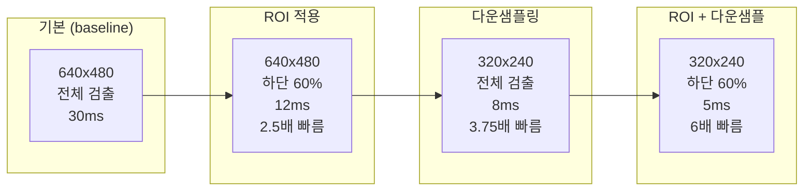
```mermaid
graph LR
    subgraph "기본 (baseline)"
        B1[640x480<br/>전체 검출<br/>30ms]
    end
    
    subgraph "ROI 적용"
        R1[640x480<br/>하단 60%<br/>12ms<br/>2.5배 빠름]
    end
    
    subgraph "다운샘플링"
        D1[320x240<br/>전체 검출<br/>8ms<br/>3.75배 빠름]
    end
    
    subgraph "ROI + 다운샘플"
        RD1[320x240<br/>하단 60%<br/>5ms<br/>6배 빠름]
    end
    
    B1 --> R1
    R1 --> D1
    D1 --> RD1
```

---

## 📊 함수별 파라미터 Quick Reference

### detectMultiScale 파라미터

```python
detections = cascade.detectMultiScale(
    image,              # 그레이스케일 이미지 (필수)
    scaleFactor=1.1,    # 1.01~2.0, 권장: 1.1
    minNeighbors=5,     # 0~20, 권장: 5
    flags=0,            # 사용 안 함 (구식)
    minSize=(30, 30),   # 최소 크기, 권장: (30, 30)
    maxSize=(300, 300)  # 최대 크기, 권장: (300, 300)
)
```

| 상황 | scaleFactor | minNeighbors | minSize | 설명 |
|:---|:---:|:---:|:---:|:---|
| **빠른 검출** | 1.2 | 3 | (40, 40) | 속도 우선 |
| **균형 잡힌 검출** | 1.1 | 5 | (30, 30) | 권장 설정 |
| **정확한 검출** | 1.05 | 7 | (20, 20) | 정확도 우선 |
| **원거리 검출** | 1.15 | 4 | (20, 20) | 작은 객체 |
| **근거리 검출** | 1.15 | 4 | (80, 80) | 큰 객체 |

### 환경별 최적 설정

```python
# Raspberry Pi (실시간 30 FPS 목표)
params_rpi = {
    'scaleFactor': 1.15,
    'minNeighbors': 4,
    'minSize': (30, 30),
    'maxSize': (200, 200)
}

# 데스크톱 (고정확도)
params_desktop = {
    'scaleFactor': 1.05,
    'minNeighbors': 6,
    'minSize': (20, 20),
    'maxSize': (400, 400)
}

# 밝은 실내
params_bright = {
    'scaleFactor': 1.1,
    'minNeighbors': 5,
    'minSize': (30, 30)
}

# 어두운 실내
params_dark = {
    'scaleFactor': 1.2,
    'minNeighbors': 4,
    'minSize': (40, 40)
}
```

---

## 🎓 학습 자료 및 참고 문헌

### 핵심 논문
1. **Viola, P., & Jones, M. (2001)**  
   *Rapid Object Detection using a Boosted Cascade of Simple Features*  
   CVPR 2001

2. **Lienhart, R., & Maydt, J. (2002)**  
   *An Extended Set of Haar-like Features for Rapid Object Detection*  
   ICIP 2002

### 온라인 리소스
- [OpenCV Cascade Classifier Tutorial](https://docs.opencv.org/4.x/db/d28/tutorial_cascade_classifier.html)
- [Cascade Training Guide](https://docs.opencv.org/4.x/dc/d88/tutorial_traincascade.html)
- [GitHub: opencv/opencv/data/haarcascades](https://github.com/opencv/opencv/tree/master/data/haarcascades)

### 추천 학습 경로
1. ✅ OpenCV 기초 (이미지 처리, 필터)
2. ✅ Haar Feature 이해
3. ✅ AdaBoost 알고리즘 이해
4. ✅ Cascade 구조 이해
5. ✅ 학습 데이터 수집 및 전처리
6. ✅ opencv_traincascade 사용법
7. ✅ 파라미터 튜닝 실습
8. ✅ 실전 프로젝트 적용

---

**작성일**: 2025-12-08  
**최종 업데이트**: 상세 알고리즘, 순서도, 함수별 가이드 추가  
**프로젝트**: Raspbot v2 Self-Driving Car  
**파일**: `04_cascade/HAAR_CASCADE_가이드.md`  
**버전**: v2.0 (완전 가이드)

