# 🚗 YOLO11 객체 검출 시스템
## Raspbot v2 자율주행 자동차

<div align="center">


**데이터 수집부터 Raspberry Pi 배포까지 완벽 가이드**

</div>

---

## 📊 전체 워크플로우

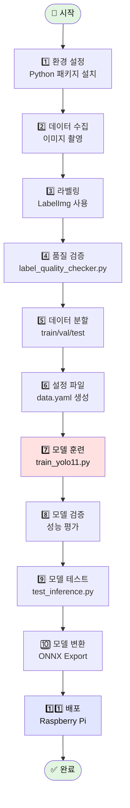
```mermaid
graph TB
    Start([🚀 시작]) --> Setup[1️⃣ 환경 설정<br/>Python 패키지 설치]
    Setup --> Collect[2️⃣ 데이터 수집<br/>이미지 촬영]
    Collect --> Label[3️⃣ 라벨링<br/>LabelImg 사용]
    Label --> Verify[4️⃣ 품질 검증<br/>label_quality_checker.py]
    Verify --> Split[5️⃣ 데이터 분할<br/>train/val/test]
    Split --> Config[6️⃣ 설정 파일<br/>data.yaml 생성]
    Config --> Train[7️⃣ 모델 훈련<br/>train_yolo11.py]
    Train --> Val[8️⃣ 모델 검증<br/>성능 평가]
    Val --> Test[9️⃣ 모델 테스트<br/>test_inference.py]
    Test --> Export[🔟 모델 변환<br/>ONNX Export]
    Export --> Deploy[1️⃣1️⃣ 배포<br/>Raspberry Pi]
    Deploy --> End([✅ 완료])

    style Start fill:#e1f5e1,color:#111
    style End fill:#e1f5e1,color:#111
    style Train fill:#ffe1e1,color:#111
    style Deploy fill:#e1e5ff,color:#111
```

---

## 📋 단계별 체크리스트

| 단계 | 작업 | 소요시간 | 산출물 | 필수도 | 상태 |
|:---:|------|:-------:|--------|:-----:|:----:|
| 1️⃣ | 환경 설정 | 10분 | 설치 완료 | 🔴 필수 | ⬜ |
| 2️⃣ | 데이터 수집 | 4-8시간 | 원본 이미지 | 🔴 필수 | ⬜ |
| 3️⃣ | 라벨링 | 2-4시간 | 라벨 파일 (.txt) | 🔴 필수 | ⬜ |
| 4️⃣ | 품질 검증 | 10분 | 검증 리포트 | 🟡 권장 | ⬜ |
| 5️⃣ | 데이터 분할 | 5분 | train/val/test | 🔴 필수 | ⬜ |
| 6️⃣ | 설정 파일 | 5분 | data.yaml | 🔴 필수 | ⬜ |
| 7️⃣ | 모델 훈련 | 2-6시간 | best.pt | 🔴 필수 | ⬜ |
| 8️⃣ | 모델 검증 | 10분 | 성능 지표 | 🟡 권장 | ⬜ |
| 9️⃣ | 모델 테스트 | 10분 | 테스트 결과 | 🟡 권장 | ⬜ |
| 🔟 | 모델 변환 | 5분 | best.onnx | 🟢 선택 | ⬜ |
| 1️⃣1️⃣ | 배포 | 30분 | 배포 완료 | 🔴 필수 | ⬜ |

**총 소요 시간**: 8-15시간 (데이터 수집 포함)

---

## 📁 프로젝트 구조

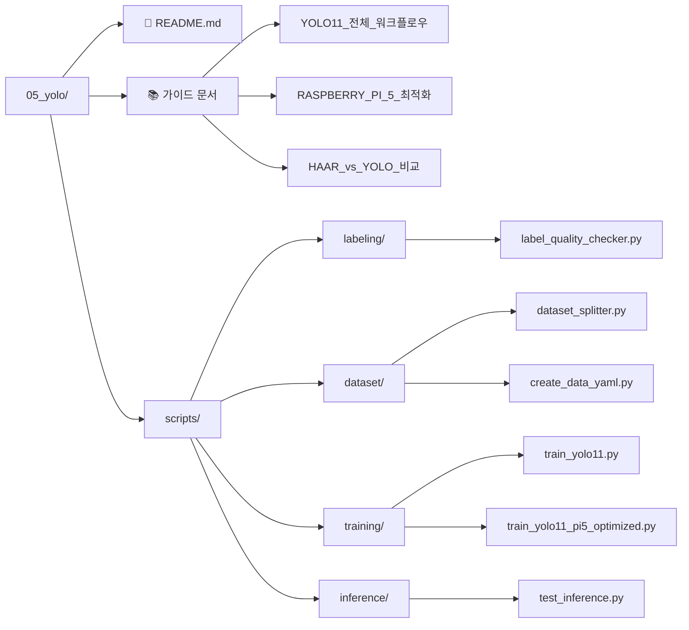
```mermaid
graph LR
    A[05_yolo/] --> B[📄 README.md]
    A --> C[📚 가이드 문서]
    A --> D[scripts/]
    
    C --> C1[YOLO11_전체_워크플로우]
    C --> C2[RASPBERRY_PI_5_최적화]
    C --> C3[HAAR_vs_YOLO_비교]
    
    D --> D1[labeling/]
    D --> D2[dataset/]
    D --> D3[training/]
    D --> D4[inference/]
    
    D1 --> D1A[label_quality_checker.py]
    D2 --> D2A[dataset_splitter.py]
    D2 --> D2B[create_data_yaml.py]
    D3 --> D3A[train_yolo11.py]
    D3 --> D3B[train_yolo11_pi5_optimized.py]
    D4 --> D4A[test_inference.py]
```

---

## 🚀 빠른 시작

### 1️⃣ 환경 설정 (10분)

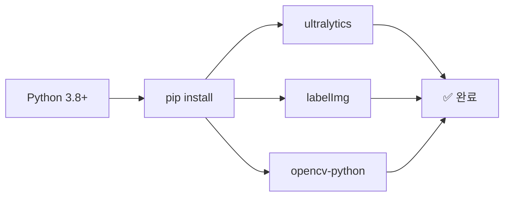
```mermaid
graph LR
    A[Python 3.8+] --> B[pip install]
    B --> C[ultralytics]
    B --> D[labelImg]
    B --> E[opencv-python]
    C --> F[✅ 완료]
    D --> F
    E --> F
```

#### 설치 명령어

```bash
# Python 버전 확인
python --version  # 3.8 이상 필요

# 필수 패키지 설치
pip install ultralytics>=8.0.0
pip install labelImg
pip install opencv-python
pip install pyyaml
pip install matplotlib
pip install pandas
pip install seaborn

# GPU 지원 (NVIDIA GPU 있는 경우)
pip install torch torchvision --index-url https://download.pytorch.org/whl/cu118
```

#### 시스템 요구사항

| 항목 | 최소 사양 | 권장 사양 | 설명 |
|------|----------|----------|------|
| **Python** | 3.8 | 3.10+ | 파이썬 버전 |
| **RAM** | 8GB | 16GB | 훈련 시 메모리 |
| **저장공간** | 10GB | 50GB | 데이터셋 + 모델 |
| **GPU** | - | NVIDIA GPU | 훈련 속도 10배 향상 |
| **OS** | Windows/Linux/macOS | Linux | 모든 OS 지원 |

---

### 2️⃣ 데이터 수집 (4-8시간)

#### 데이터 수집 계획

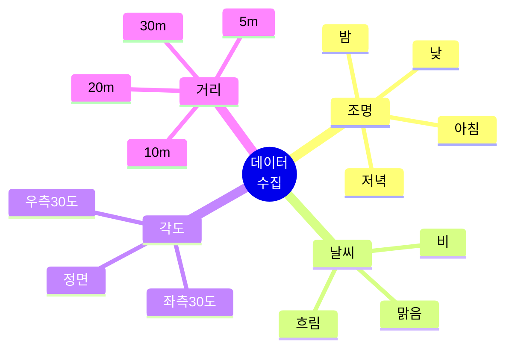
```mermaid
mindmap
  root((데이터<br/>수집))
    조명
      아침
      낮
      저녁
      밤
    날씨
      맑음
      흐림
      비
    각도
      정면
      좌측30도
      우측30도
    거리
      5m
      10m
      20m
      30m
```

#### 클래스별 수집 목표

| 클래스 | 최소 | 권장 | 우수 | 수집 조건 |
|--------|:---:|:---:|:---:|----------|
| **정지 신호** | 200장 | 300장 | 500장 | 다양한 거리, 각도, 조명 |
| **신호등** | 200장 | 400장 | 600장 | 빨강/노랑/초록 균등 |
| **보행자** | 300장 | 500장 | 1000장 | 다양한 연령, 자세 |
| **차선** | 200장 | 300장 | 500장 | 실선/점선, 다양한 상태 |
| **장애물** | 150장 | 200장 | 400장 | 다양한 종류 |

#### 품질 기준

| 항목 | 필수 | 권장 | 비고 |
|------|:---:|:---:|------|
| **해상도** | 640x640 | 1920x1080 | 높을수록 좋음 |
| **선명도** | Laplacian > 100 | Laplacian > 200 | 흐릿한 이미지 제외 |
| **조명** | 적절 | 다양 | 너무 밝거나 어둡지 않게 |
| **노이즈** | 적음 | 없음 | 고화질 촬영 |
| **다양성** | 3개 조건 | 5개 이상 | 조명/각도/거리/날씨 등 |

---

### 3️⃣ 라벨링 (2-4시간)

#### 라벨링 프로세스

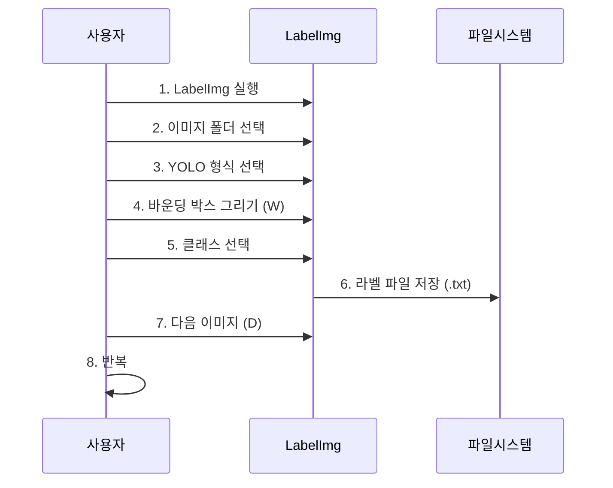
```mermaid
sequenceDiagram
    participant U as 사용자
    participant L as LabelImg
    participant F as 파일시스템
    
    U->>L: 1. LabelImg 실행
    U->>L: 2. 이미지 폴더 선택
    U->>L: 3. YOLO 형식 선택
    U->>L: 4. 바운딩 박스 그리기 (W)
    U->>L: 5. 클래스 선택
    L->>F: 6. 라벨 파일 저장 (.txt)
    U->>L: 7. 다음 이미지 (D)
    U->>U: 8. 반복
```

#### LabelImg 단축키

| 단축키 | 기능 | 빈도 | 비고 |
|--------|------|:---:|------|
| `W` | 박스 그리기 시작 | 매우 높음 | 가장 많이 사용 |
| `D` | 다음 이미지 | 매우 높음 | 빠른 진행 |
| `A` | 이전 이미지 | 높음 | 수정 시 사용 |
| `Ctrl+S` | 저장 | 높음 | 자동 저장 권장 |
| `Del` | 박스 삭제 | 보통 | 실수 수정 |
| `Ctrl+D` | 이전 박스 복사 | 보통 | 반복 작업 시 유용 |
| `Space` | 검증 표시 | 낮음 | 완료 표시 |

#### 라벨링 품질 체크리스트

- ✅ 객체 전체를 정확히 포함
- ✅ 박스가 너무 크거나 작지 않게
- ✅ 부분 가림된 객체도 라벨링
- ✅ 일관된 기준 유지
- ❌ 배경을 많이 포함 안 함
- ❌ 객체 일부만 포함 안 함

---

### 4️⃣ 품질 검증 (10분)

#### 검증 프로세스

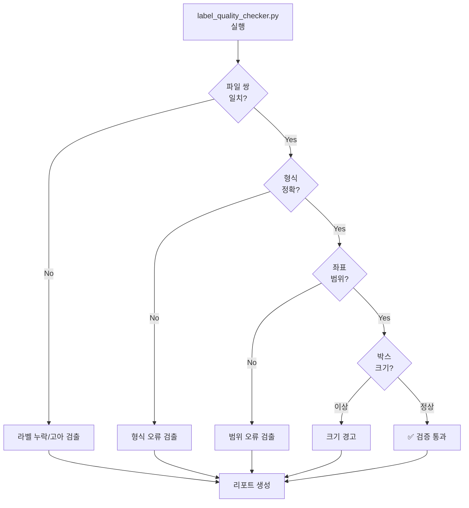
```mermaid
graph TD
    A[label_quality_checker.py<br/>실행] --> B{파일 쌍<br/>일치?}
    B -->|No| C[라벨 누락/고아 검출]
    B -->|Yes| D{형식<br/>정확?}
    D -->|No| E[형식 오류 검출]
    D -->|Yes| F{좌표<br/>범위?}
    F -->|No| G[범위 오류 검출]
    F -->|Yes| H{박스<br/>크기?}
    H -->|이상| I[크기 경고]
    H -->|정상| J[✅ 검증 통과]
    
    C --> K[리포트 생성]
    E --> K
    G --> K
    I --> K
    J --> K
```

#### 실행 명령어

```bash
python scripts/labeling/label_quality_checker.py \
  --images raw_dataset/images \
  --labels raw_dataset/labels
```

#### 검증 항목

| 항목 | 검증 내용 | 통과 기준 |
|------|----------|----------|
| **파일 쌍** | 이미지-라벨 일치 | 100% 일치 |
| **형식** | YOLO 형식 준수 | 오류 0개 |
| **좌표** | 0~1 범위 | 모두 범위 내 |
| **박스 크기** | 너무 작거나 큼 | 경고 0개 (권장) |

---

### 5️⃣ 데이터 분할 (5분)

#### 분할 전략

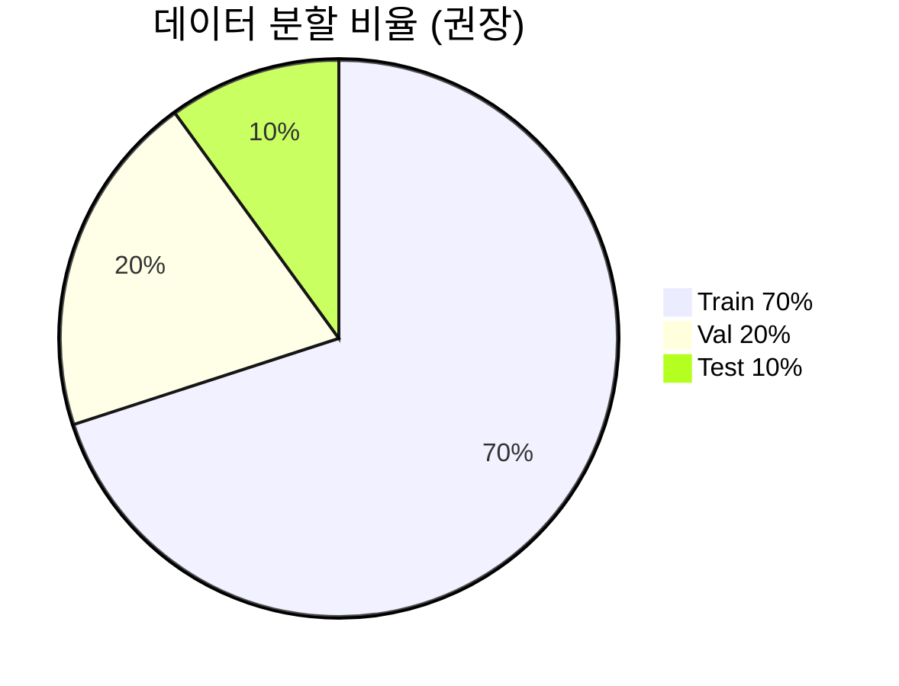
```mermaid
pie title 데이터 분할 비율 (권장)
    "Train 70%" : 70
    "Val 20%" : 20
    "Test 10%" : 10
```

#### 데이터셋 크기별 권장 비율

| 총 이미지 수 | Train | Val | Test | 이유 |
|:-----------:|:-----:|:---:|:----:|------|
| 100-500장 | 80% | 15% | 5% | Test 데이터 확보 최소화 |
| 500-2000장 | 70% | 20% | 10% | 균형잡힌 분할 (권장) |
| 2000+장 | 70% | 15% | 15% | 충분한 Test 데이터 |

#### 실행 명령어

```bash
python scripts/dataset/dataset_splitter.py \
  --images raw_dataset/images \
  --labels raw_dataset/labels \
  --output yolo_dataset \
  --train-ratio 0.7 \
  --val-ratio 0.2 \
  --test-ratio 0.1 \
  --seed 42  # 재현성 보장
```

#### 출력 구조

```
yolo_dataset/
├── train/
│   ├── images/  (70% - 훈련용)
│   └── labels/
├── val/
│   ├── images/  (20% - 검증용)
│   └── labels/
└── test/
    ├── images/  (10% - 최종 평가용)
    └── labels/
```

---

### 5️⃣  설정 파일 생성 (5분)

#### data.yaml 구조

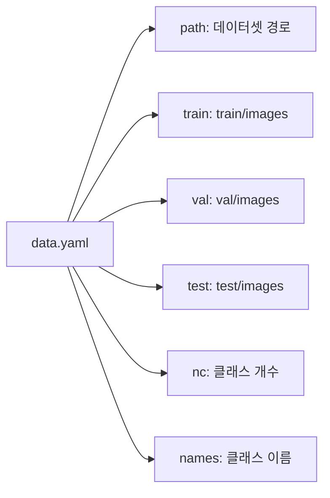
```mermaid
graph LR
    A[data.yaml] --> B[path: 데이터셋 경로]
    A --> C[train: train/images]
    A --> D[val: val/images]
    A --> E[test: test/images]
    A --> F[nc: 클래스 개수]
    A --> G[names: 클래스 이름]
```

#### 실행 명령어

```bash
# 방법 1: 직접 지정
python scripts/dataset/create_data_yaml.py \
  --dataset yolo_dataset \
  --classes stop_sign traffic_light pedestrian lane obstacle

# 방법 2: 파일에서 로드
python scripts/dataset/create_data_yaml.py \
  --dataset yolo_dataset \
  --classes-file classes.txt
```

#### classes.txt 형식

```
stop_sign
traffic_light
pedestrian
lane
obstacle
```

#### 생성된 data.yaml

```yaml
# 데이터셋 경로 (절대 경로)
path: /Users/kimjongphil/.../yolo_dataset

# 분할 데이터 경로 (상대 경로)
train: train/images
val: val/images
test: test/images

# 클래스 정보
nc: 5
names:
  0: stop_sign
  1: traffic_light
  2: pedestrian
  3: lane
  4: obstacle
```

---

### 7️⃣ 모델 훈련 (2-6시간)

#### 훈련 프로세스

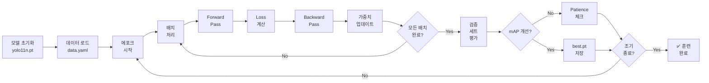
```mermaid
graph LR
    A[모델 초기화<br/>yolo11n.pt] --> B[데이터 로드<br/>data.yaml]
    B --> C[에포크 <br>시작]
    C --> D[배치 <br>처리]
    D --> E[Forward <br>Pass]
    E --> F[Loss <br>계산]
    F --> G[Backward <br>Pass]
    G --> H[가중치 <br>업데이트]
    H --> I{모든 배치<br/>완료?}
    I -->|No| D
    I -->|Yes| J[검증 <br>세트 <br>평가]
    J --> K{mAP 개선?}
    K -->|Yes| L[best.pt <br>저장]
    K -->|No| M[Patience <br>체크]
    M --> N{조기<br/>종료?}
    N -->|No| C
    N -->|Yes| O[✅ 훈련 <br>완료]
    L --> N
```

#### 모델 크기 비교

| 모델 | 파라미터 | 크기 | FPS (GPU) | FPS (Pi 4) | mAP50 | 권장 용도 |
|:----:|:-------:|:----:|:---------:|:----------:|:-----:|-----------|
| **n** | 2.6M | 2.6MB | ~650 | ~8 | 39.5% | 🍓 Raspberry Pi |
| **s** | 9.4M | 9.4MB | ~400 | ~3 | 47.0% | 모바일, 엣지 |
| **m** | 20.1M | 20.1MB | ~210 | ~1 | 51.5% | 일반 PC |
| **l** | 25.3M | 25.3MB | ~160 | <1 | 53.4% | 고성능 PC |
| **x** | 56.9M | 56.9MB | ~90 | <1 | 54.7% | 서버, 최고 정확도 |

#### Raspberry Pi 5 최적화 훈련 (권장)

```bash
python scripts/training/train_yolo11_pi5_optimized.py \
  --data yolo_dataset/data.yaml \
  --epochs 150 \
  --batch 32 \
  --project models/raspberrypi5_yolo11 \
  --name traffic_detection \
  --validate
```

**특징**:
- ✅ YOLOv11n 고정 (Pi 5 최적)
- ✅ 자율주행 특화 데이터 증강
- ✅ 자동 ONNX/TFLite 변환
- ✅ Pi 5 배포 가이드 자동 출력

#### 범용 훈련

```bash
python scripts/training/train_yolo11.py \
  --data yolo_dataset/data.yaml \
  --model n \
  --epochs 150 \
  --batch 32 \
  --imgsz 640 \
  --patience 50 \
  --optimizer AdamW \
  --lr0 0.01
```

#### 훈련 시간 예상

| 환경 | 100 에포크 (1000장) | 비고 |
|------|:-----------------:|------|
| RTX 3080 | 30분 - 1시간 | 권장 |
| RTX 2060 | 1-2시간 | 충분 |
| GTX 1660 | 2-3시간 | 가능 |
| i7 CPU | 10-20시간 | 느림 |
| Raspberry Pi 4 | 100+시간 | ❌ 비추천 |

#### 훈련 결과 파일

```
models/raspberrypi5_yolo11/traffic_detection/
├── weights/
│   ├── best.pt           ⭐ 최고 성능 (검증 mAP 기준)
│   └── last.pt          마지막 에포크
├── results.png          📊 훈련 그래프
├── confusion_matrix.png 📊 혼동 행렬
├── results.csv          📊 상세 결과
└── val_batch*.jpg       📊 검증 시각화
```

---

### 8️⃣ 모델 검증 (10분)

#### 검증 지표

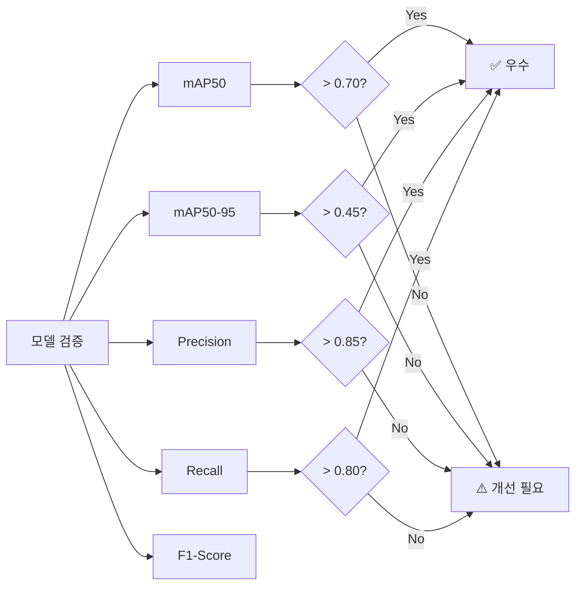
```mermaid
graph LR
    A[모델 검증] --> B[mAP50]
    A --> C[mAP50-95]
    A --> D[Precision]
    A --> E[Recall]
    A --> F[F1-Score]
    
    B --> G{> 0.70?}
    C --> H{> 0.45?}
    D --> I{> 0.85?}
    E --> J{> 0.80?}
    
    G -->|Yes| K[✅ 우수]
    H -->|Yes| K
    I -->|Yes| K
    J -->|Yes| K
    
    G -->|No| L[⚠️ 개선 필요]
    H -->|No| L
    I -->|No| L
    J -->|No| L
```

#### 성능 지표 설명

| 지표 | 설명 | 계산식 | 목표 | 중요도 |
|------|------|--------|:----:|:-----:|
| **Precision** | 정밀도 | TP/(TP+FP) | >0.85 | 🟡 높음 |
| **Recall** | 재현율 | TP/(TP+FN) | >0.80 | 🔴 매우 높음 |
| **mAP50** | 평균 정밀도 | @IoU=0.5 | >0.70 | 🔴 매우 높음 |
| **mAP50-95** | 엄격한 mAP | @IoU=0.5:0.95 | >0.45 | 🟢 보통 |
| **F1-Score** | 조화 평균 | 2×P×R/(P+R) | >0.75 | 🟡 높음 |

#### 자율주행 특화 목표

| 객체 | Precision | Recall | 중요도 | 이유 |
|------|:---------:|:------:|:-----:|------|
| **보행자** | >0.90 | >0.95 | 🔴 최고 | 안전 최우선 |
| **정지신호** | >0.95 | >0.90 | 🔴 최고 | 사고 방지 |
| **장애물** | >0.85 | >0.90 | 🔴 최고 | 충돌 방지 |
| **신호등** | >0.85 | >0.85 | 🟡 높음 | 교통 규칙 |
| **차선** | >0.80 | >0.80 | 🟡 높음 | 주행 안정성 |

#### 실행 명령어

```bash
# YOLO CLI 사용
yolo task=detect mode=val \
  model=models/raspberrypi5_yolo11/traffic_detection/weights/best.pt \
  data=yolo_dataset/data.yaml \
  imgsz=416 \
  batch=16
```

---

### 9️⃣ 모델 테스트 (10분)

#### 테스트 시나리오

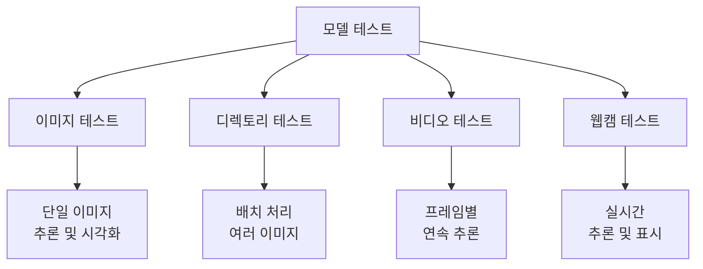
```mermaid
graph TB
    A[모델 테스트] --> B[이미지 테스트]
    A --> C[디렉토리 테스트]
    A --> D[비디오 테스트]
    A --> E[웹캠 테스트]
    
    B --> F[단일 이미지<br/>추론 및 시각화]
    C --> G[배치 처리<br/>여러 이미지]
    D --> H[프레임별<br/>연속 추론]
    E --> I[실시간<br/>추론 및 표시]
```

#### 실행 명령어

```bash
# 1. 단일 이미지
python scripts/inference/test_inference.py \
  --weights models/.../best.pt \
  --source test_image.jpg \
  --conf 0.35

# 2. 디렉토리
python scripts/inference/test_inference.py \
  --weights models/.../best.pt \
  --source test_images/ \
  --conf 0.35

# 3. 비디오
python scripts/inference/test_inference.py \
  --weights models/.../best.pt \
  --source test_video.mp4 \
  --conf 0.35

# 4. 웹캠 (실시간)
python scripts/inference/test_inference.py \
  --weights models/.../best.pt \
  --webcam \
  --conf 0.35
```

#### 신뢰도 임계값 가이드

| conf 값 | 민감도 | False Positive | False Negative | 권장 용도 |
|:-------:|:------:|:--------------:|:--------------:|-----------|
| 0.1-0.2 | 매우 높음 | 많음 | 적음 | 놓치면 안 되는 경우 |
| 0.25 | 높음 | 보통 | 보통 | 기본값 (균형) |
| 0.35 | 보통 | 적음 | 보통 | 정확도 중시 |
| 0.5+ | 낮음 | 매우 적음 | 많음 | 확실한 것만 |

---

### 🔟 모델 변환 (5분)

#### 변환 옵션 비교

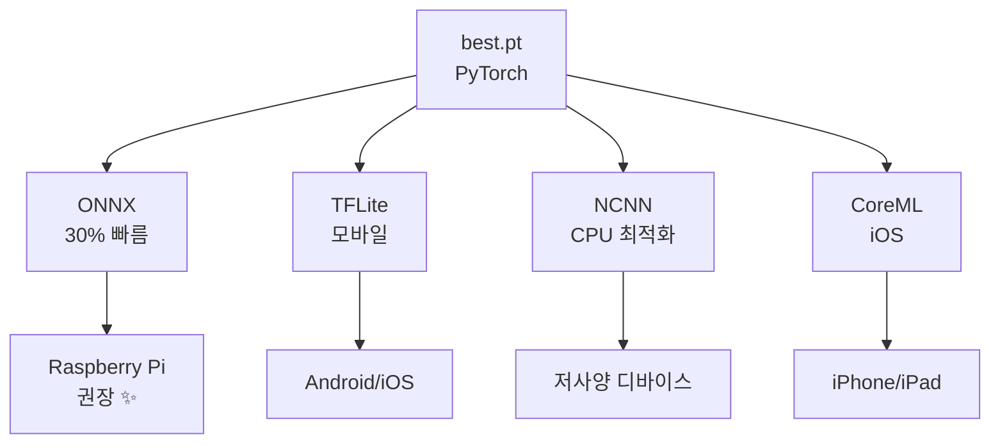
```mermaid
graph TD
    A[best.pt<br/>PyTorch] --> B[ONNX<br/>30% 빠름]
    A --> C[TFLite<br/>모바일]
    A --> D[NCNN<br/>CPU 최적화]
    A --> E[CoreML<br/>iOS]
    
    B --> F[Raspberry Pi<br/>권장 ✨]
    C --> G[Android/iOS]
    D --> H[저사양 디바이스]
    E --> I[iPhone/iPad]
```

#### 형식별 특징

| 형식 | 크기 | 속도 향상 | 플랫폼 | 권장 용도 |
|------|:----:|:--------:|--------|-----------|
| **PT** | 5.2MB | 기준 | PyTorch | 개발/테스트 |
| **ONNX** | 5.2MB | +30% | 범용 | 🍓 Raspberry Pi |
| **TFLite** | 1.3MB | +100% | 모바일 | Android/iOS |
| **NCNN** | 5.0MB | +50% | CPU | 저사양 PC |
| **CoreML** | 4.8MB | +40% | iOS | iPhone/iPad |
| **INT8** | 1.3MB | +200% | 모바일/엣지 | 초경량 필요 |

#### ONNX 변환 (Raspberry Pi 5용, 권장)

```bash
# 기본 변환
yolo export \
  model=models/raspberrypi5_yolo11/traffic_detection/weights/best.pt \
  format=onnx \
  simplify=True \
  opset=12 \
  dynamic=False \
  imgsz=416

# 결과
# ✅ best.onnx 생성 (5.2MB)
# 📊 추론 속도 30% 향상
```

#### 기타 변환

```bash
# TFLite (모바일용)
yolo export model=best.pt format=tflite int8=False

# TFLite INT8 (초경량)
yolo export model=best.pt format=tflite int8=True

# NCNN (CPU 최적화)
yolo export model=best.pt format=ncnn
```

---

### 1️⃣1️⃣ Raspberry Pi 배포 (30분)

#### 배포 프로세스

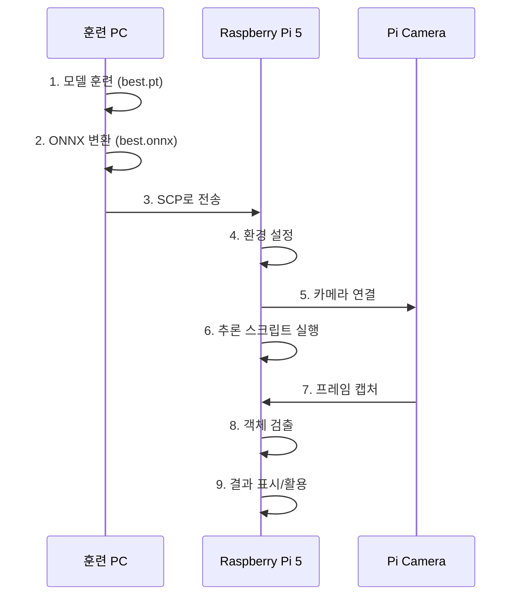
```mermaid
sequenceDiagram
    participant PC as 훈련 PC
    participant Pi as Raspberry Pi 5
    participant Cam as Pi Camera
    
    PC->>PC: 1. 모델 훈련 (best.pt)
    PC->>PC: 2. ONNX 변환 (best.onnx)
    PC->>Pi: 3. SCP로 전송
    Pi->>Pi: 4. 환경 설정
    Pi->>Cam: 5. 카메라 연결
    Pi->>Pi: 6. 추론 스크립트 실행
    Cam->>Pi: 7. 프레임 캡처
    Pi->>Pi: 8. 객체 검출
    Pi->>Pi: 9. 결과 표시/활용
```

#### 1. 모델 전송

```bash
# PC에서 실행
scp models/raspberrypi5_yolo11/traffic_detection/weights/best.onnx \
  pi@raspberrypi.local:~/models/

# 확인
ssh pi@raspberrypi.local "ls -lh ~/models/"
```

#### 2. Raspberry Pi 환경 설정

```bash
# Raspberry Pi에 SSH 접속
ssh pi@raspberrypi.local

# 패키지 설치
pip3 install ultralytics
pip3 install opencv-python
pip3 install picamera2

# 확인
python3 -c "from ultralytics import YOLO; print('✅ OK')"
```

#### 3. 실시간 추론 (자세한 코드는 단계별_실행_가이드.md 참조)

```bash
# Raspberry Pi에서 실행
python3 raspberry_pi_inference.py \
  --model ~/models/best.onnx \
  --conf 0.35 \
  --imgsz 416
```

#### Raspberry Pi 5 성능 목표

| 항목 | 목표 | 최적화 전 | 최적화 후 |
|------|:----:|:--------:|:--------:|
| **FPS** | >25 | 8-10 | 25-30 ✅ |
| **지연시간** | <50ms | 100-125ms | 33-40ms ✅ |
| **메모리** | <1GB | 800MB | 500MB ✅ |
| **정확도** | mAP>0.75 | 유지 | 유지 ✅ |

---

## 📊 성능 벤치마크

### Raspberry Pi 모델별 비교

| 모델 | CPU | GPU | FPS (YOLOv11n) | 추론 시간 | 권장 |
|------|-----|-----|:--------------:|:---------:|:----:|
| **Pi 5** | A76 2.4GHz | VideoCore VII | 25-30 | 33ms | ✅ 최고 |
| **Pi 4** | A72 1.8GHz | VideoCore VI | 8-10 | 100ms | ⚠️ 가능 |
| **Pi 3** | A53 1.4GHz | VideoCore IV | 2-3 | 400ms | ❌ 불가 |

### 이미지 크기별 성능 (Pi 5)

| 크기 | FPS | 정확도 | 메모리 | 권장 |
|:----:|:---:|:------:|:------:|:----:|
| 320 | 40-45 | 낮음 | 300MB | 초고속 필요 시 |
| 416 | 25-30 | 높음 | 500MB | ✅ 최적 균형 |
| 640 | 8-10 | 매우 높음 | 800MB | 정확도 최우선 |

### Haar Cascade vs YOLO11n (Pi 5)

| 항목 | Haar Cascade | YOLO11n | 승자 |
|------|:------------:|:-------:|:----:|
| FPS (416px) | 35 | 28 | Haar |
| 정확도 | 65% | 88% | **YOLO** |
| False Positive | 35% | 7% | **YOLO** |
| 다중 클래스 | ❌ | ✅ | **YOLO** |
| 야간 성능 | 30% | 75% | **YOLO** |
| 훈련 시간 | 수일 | 수시간 | **YOLO** |
| **종합** | | | **YOLO** 압승 |

---

## 🎯 하이퍼파라미터 튜닝

### 학습률 튜닝

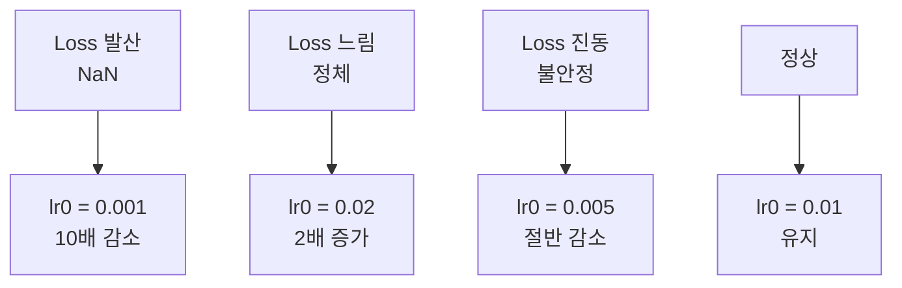
```mermaid
graph TD
    A[Loss 발산<br/>NaN] --> B[lr0 = 0.001<br/>10배 감소]
    C[Loss 느림<br/>정체] --> D[lr0 = 0.02<br/>2배 증가]
    E[Loss 진동<br/>불안정] --> F[lr0 = 0.005<br/>절반 감소]
    G[정상] --> H[lr0 = 0.01<br/>유지]
```

### 배치 크기별 권장 설정

| GPU 메모리 | 배치 | 학습률 | 이미지 크기 | 예상 FPS |
|:---------:|:----:|:------:|:----------:|:--------:|
| 4GB | 8 | 0.001 | 640 | ~200 |
| 6GB | 16 | 0.01 | 640 | ~400 |
| 8GB | 24 | 0.015 | 640 | ~550 |
| 11GB | 32 | 0.02 | 640 | ~650 |
| 24GB | 64 | 0.04 | 1280 | ~150 |

### 문제별 해결 가이드

| 문제 | 증상 | 원인 | 해결책 |
|------|------|------|--------|
| **과적합** | Train↑ Val↓ | 데이터 부족 | 데이터 증강 강화 |
| **학습 부족** | Train↓ Val↓ | 모델 부족 | 큰 모델 사용 |
| **느린 수렴** | Loss 천천히 감소 | 학습률 낮음 | 학습률 증가 |
| **발산** | Loss NaN | 학습률 높음 | 학습률 감소 |
| **불안정** | Loss 진동 | 배치 작음 | 배치 증가 |

---

## 💡 고급 기법

### 1. 클래스 불균형 처리

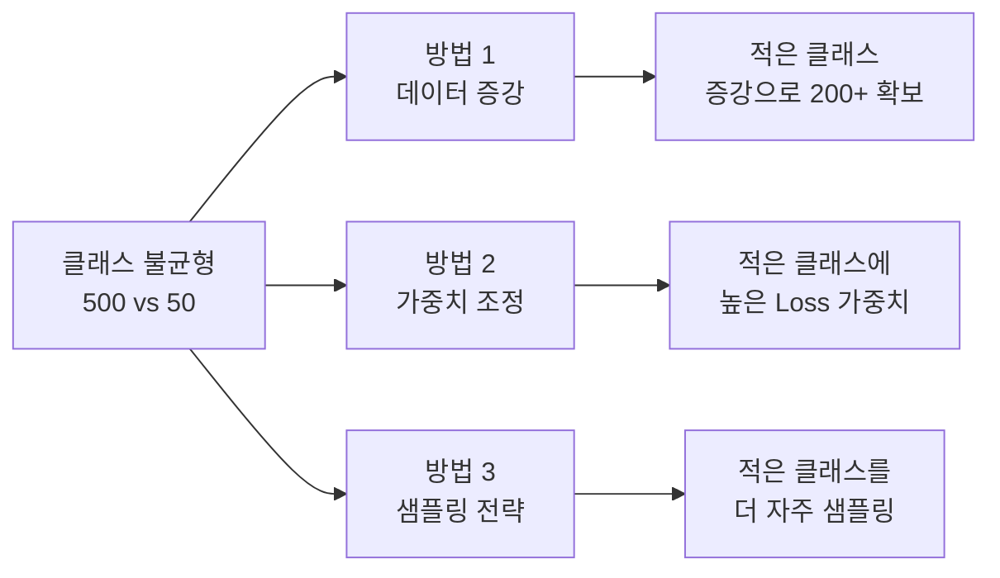
```mermaid
graph LR
    A[클래스 불균형<br/>500 vs 50] --> B[방법 1<br/>데이터 증강]
    A --> C[방법 2<br/>가중치 조정]
    A --> D[방법 3<br/>샘플링 전략]
    
    B --> E[적은 클래스<br/>증강으로 200+ 확보]
    C --> F[적은 클래스에<br/>높은 Loss 가중치]
    D --> G[적은 클래스를<br/>더 자주 샘플링]
```

### 2. 전이 학습 전략

| 데이터 양 | 전략 | 동결 레이어 | 학습률 | 에포크 |
|:--------:|------|:-----------:|:------:|:------:|
| <100장 | 레이어 동결 | 10개 | 0.001 | 50 |
| 100-500장 | 부분 동결 | 5개 | 0.005 | 100 |
| 500+장 | 전체 학습 | 0개 | 0.01 | 150 |

### 3. 앙상블 기법

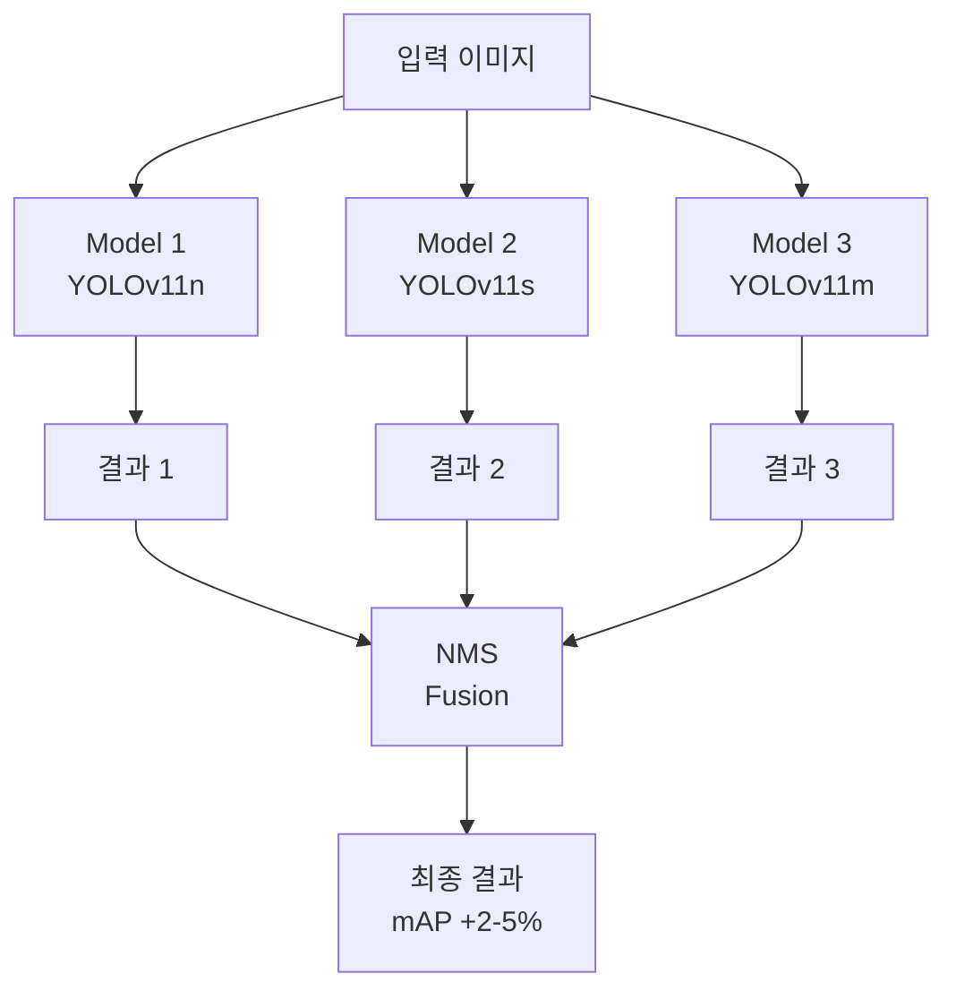
```mermaid
graph TB
    A[입력 이미지] --> B[Model 1<br/>YOLOv11n]
    A --> C[Model 2<br/>YOLOv11s]
    A --> D[Model 3<br/>YOLOv11m]
    
    B --> E[결과 1]
    C --> F[결과 2]
    D --> G[결과 3]
    
    E --> H[NMS<br/>Fusion]
    F --> H
    G --> H
    
    H --> I[최종 결과<br/>mAP +2-5%]
```

---

## ❓ FAQ

### 핵심 질문 요약

| 질문 | 간단 답변 | 상세 링크 |
|------|----------|----------|
| 데이터 얼마나? | 클래스당 200+ 장 | [FAQ Q1](#q1-데이터셋이-얼마나-필요한가요) |
| GPU 필수? | 아니오 (하지만 10배 빠름) | [FAQ Q2](#q2-gpu가-없으면-훈련이-불가능한가요) |
| Pi에서 훈련? | ❌ 불가능 (너무 느림) | [FAQ Q2](#q2-gpu가-없으면-훈련이-불가능한가요) |
| 과적합 방지? | 데이터 증강 + 조기 종료 | [FAQ Q3](#q3-과적합overfitting을-어떻게-방지하나요) |
| Pi에서 느림? | ONNX + 320px + 프레임 스킵 | [FAQ Q6](#q6-raspberry-pi에서-너무-느려요--5-fps) |
| 배포 방법? | ONNX 변환 → SCP 전송 | [FAQ Q7](#q7-모델을-어떻게-배포하나요) |

### Q1. 데이터셋이 얼마나 필요한가요?

| 정확도 목표 | 클래스당 이미지 | 총 훈련 시간 | 결과 |
|-----------|:--------------:|:----------:|------|
| 기본 (mAP50 > 0.6) | 100-200장 | 짧음 | 빠른 프로토타입 |
| 좋음 (mAP50 > 0.7) | 300-500장 | 보통 | 실전 사용 가능 |
| 우수 (mAP50 > 0.85) | 500-1000장 | 김 | 프로덕션 품질 |
| 최고 (mAP50 > 0.9) | 1000+장 | 매우 김 | 경쟁 수준 |

### Q2. GPU가 없으면 훈련이 불가능한가요?

| 환경 | 100 에포크 (1000장) | 가능 여부 |
|------|:-----------------:|:--------:|
| RTX 3080 | 30분 - 1시간 | ✅ 권장 |
| RTX 2060 | 1-2시간 | ✅ 충분 |
| i7 CPU | 10-20시간 | ⚠️ 가능 (밤새) |
| Pi 4 | 100+시간 | ❌ 비추천 |
| **대안** | **Google Colab** | ✅ 무료 GPU |

---

## 📚 참고 자료

### 문서 계층 구조

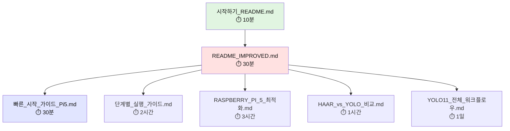
```mermaid
graph TD
    A[시작하기_README.md<br/>⏱️ 10분] --> B[README_IMPROVED.md<br/>⏱️ 30분]
    B --> C[빠른_시작_가이드_Pi5.md<br/>⏱️ 30분]
    B --> D[단계별_실행_가이드.md<br/>⏱️ 2시간]
    B --> E[RASPBERRY_PI_5_최적화.md<br/>⏱️ 3시간]
    B --> F[HAAR_vs_YOLO_비교.md<br/>⏱️ 1시간]
    B --> G[YOLO11_전체_워크플로우.md<br/>⏱️ 1일]
    
    style A fill:#e1f5e1,color:#111
    style B fill:#ffe1e1,color:#111
    style C fill:#e1e5ff,color:#111
```

### 추천 읽기 순서

| 단계 | 문서 | 대상 | 소요 시간 |
|:---:|------|------|:--------:|
| 1 | 시작하기_README.md | 모두 | 10분 |
| 2 | **README_IMPROVED.md** | 모두 | 30분 |
| 3 | 빠른_시작_가이드_Pi5.md | Pi 5 사용자 | 30분 |
| 4 | 단계별_실행_가이드.md | 실습자 | 2시간 |
| 5 | RASPBERRY_PI_5_최적화.md | 최적화 필요 | 3시간 |
| 6 | YOLO11_전체_워크플로우.md | 고급 | 1일 |

### 외부 리소스

| 리소스 | 링크 | 용도 |
|--------|------|------|
| Ultralytics Docs | [docs.ultralytics.com](https://docs.ultralytics.com/) | 공식 문서 |
| Google Colab | [colab.research.google.com](https://colab.research.google.com/) | 무료 GPU |
| Roboflow | [roboflow.com](https://roboflow.com/) | 데이터셋 관리 |
| Papers With Code | [paperswithcode.com](https://paperswithcode.com/) | 최신 연구 |

---

## 🎉 마무리

### 성공 체크리스트

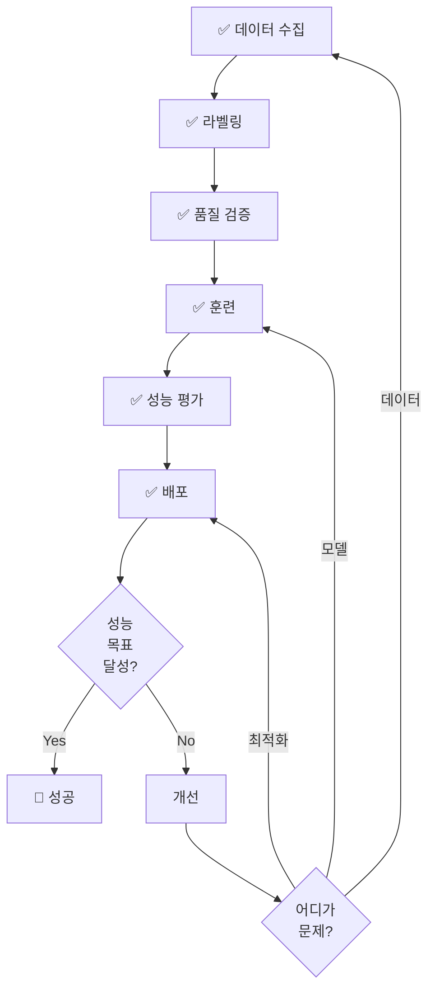
```mermaid
graph TB
    A[✅ 데이터 수집] --> B[✅ 라벨링]
    B --> C[✅ 품질 검증]
    C --> D[✅ 훈련]
    D --> E[✅ 성능 평가]
    E --> F[✅ 배포]
    
    F --> G{성능<br/>목표<br/>달성?}
    G -->|Yes| H[🎉 성공]
    G -->|No| I[개선]
    I --> J{어디가<br/>문제?}
    J -->|데이터| A
    J -->|모델| D
    J -->|최적화| F
```

### 최종 목표

| 지표 | 목표 | 현재 | 상태 |
|------|:----:|:----:|:----:|
| **mAP50** | >0.75 | ___ | ⬜ |
| **Precision** | >0.85 | ___ | ⬜ |
| **Recall** | >0.80 | ___ | ⬜ |
| **FPS (Pi 5)** | >25 | ___ | ⬜ |
| **지연시간** | <50ms | ___ | ⬜ |

---

**작성일**: 2025-12-09  
**버전**: 2.0 (개선판)  
**프로젝트**: Raspbot v2 자율주행 자동차  
**상태**: ✅ 완성

**🚗 행운을 빕니다! 💨**
