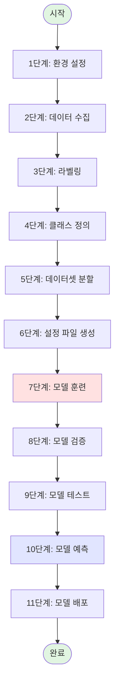

# 🎯 단계별 실행 가이드
## 데이터 수집부터 예측까지 완벽 실행 코드

---

## 📊 전체 워크플로우



---

## 📋 단계별 체크리스트

| 단계 | 작업 | 소요시간 | 산출물 | 상태 |
|-----|------|---------|-------|------|
| 1 | 환경 설정 | 10분 | 설치 완료 | ⬜ |
| 2 | 데이터 수집 | 4-8시간 | 원본 이미지 | ⬜ |
| 3 | 라벨링 | 2-4시간 | 라벨 파일 (.txt) | ⬜ |
| 4 | 클래스 정의 | 5분 | classes.txt | ⬜ |
| 5 | 데이터셋 분할 | 5분 | train/val/test 폴더 | ⬜ |
| 6 | 설정 파일 생성 | 5분 | data.yaml | ⬜ |
| 7 | 모델 훈련 | 2-6시간 | best.pt | ⬜ |
| 8 | 모델 검증 | 10분 | 성능 지표 | ⬜ |
| 9 | 모델 테스트 | 10분 | 테스트 결과 | ⬜ |
| 10 | 모델 예측 | 즉시 | 예측 결과 | ⬜ |
| 11 | 모델 배포 | 30분 | 배포 완료 | ⬜ |

---

## 1단계: 환경 설정 (10분)

### 1.1 Python 및 패키지 설치

```bash
# Python 버전 확인 (3.8 이상 필요)
python --version

# 가상환경 생성 (권장)
python -m venv yolo_env
source yolo_env/bin/activate  # Linux/Mac
# yolo_env\Scripts\activate  # Windows

# 필수 패키지 설치
pip install --upgrade pip
pip install ultralytics==8.0.196
pip install labelImg==1.8.6
pip install opencv-python==4.8.1.78
pip install pyyaml==6.0.1
pip install matplotlib==3.8.0
pip install pandas==2.1.1
pip install seaborn==0.13.0
pip install pillow==10.0.1

# GPU 지원 (NVIDIA GPU 있는 경우)
pip install torch torchvision --index-url https://download.pytorch.org/whl/cu118

# 설치 확인
python -c "from ultralytics import YOLO; print('✅ Ultralytics 설치 완료')"
python -c "import cv2; print('✅ OpenCV 설치 완료')"
```

### 1.2 프로젝트 디렉토리 생성

```bash
# 프로젝트 루트 생성
mkdir -p raspbot_yolo_project
cd raspbot_yolo_project

# 디렉토리 구조 생성
mkdir -p {raw_data/images,raw_data/labels}
mkdir -p {dataset/train/images,dataset/train/labels}
mkdir -p {dataset/val/images,dataset/val/labels}
mkdir -p {dataset/test/images,dataset/test/labels}
mkdir -p {models,results,predictions}

# 구조 확인
tree -L 3
```

**예상 출력**:
```
raspbot_yolo_project/
├── raw_data/
│   ├── images/          # 원본 이미지
│   └── labels/          # 원본 라벨
├── dataset/
│   ├── train/
│   │   ├── images/
│   │   └── labels/
│   ├── val/
│   │   ├── images/
│   │   └── labels/
│   └── test/
│       ├── images/
│       └── labels/
├── models/              # 훈련된 모델
├── results/             # 훈련 결과
└── predictions/         # 예측 결과
```

---

## 2단계: 데이터 수집 (4-8시간)

### 2.1 데이터 수집 계획

```python
# data_collection_plan.py
"""데이터 수집 계획 및 체크리스트"""

collection_plan = {
    "stop_sign": {
        "목표_개수": 300,
        "수집_조건": {
            "거리": ["5m", "10m", "20m", "30m"],
            "각도": ["정면", "좌측30도", "우측30도"],
            "조명": ["아침", "낮", "저녁", "밤"],
            "날씨": ["맑음", "흐림", "비"]
        }
    },
    "traffic_light": {
        "목표_개수": 400,
        "수집_조건": {
            "상태": ["빨강", "노랑", "초록"],
            "거리": ["10m", "20m", "30m"],
            "조명": ["낮", "저녁", "밤"]
        }
    },
    "pedestrian": {
        "목표_개수": 500,
        "수집_조건": {
            "상태": ["정지", "걷기", "뛰기"],
            "연령": ["어린이", "성인", "노인"],
            "옷_색상": ["밝은색", "어두운색", "다양"]
        }
    },
    "lane": {
        "목표_개수": 300,
        "수집_조건": {
            "종류": ["흰색실선", "흰색점선", "노란색"],
            "상태": ["깨끗", "닳음", "그림자"]
        }
    },
    "obstacle": {
        "목표_개수": 200,
        "수집_조건": {
            "종류": ["기둥", "벽", "차량", "기타"],
            "거리": ["1m", "3m", "5m"]
        }
    }
}

# 총 필요 이미지 수
total_images = sum(plan["목표_개수"] for plan in collection_plan.values())
print(f"총 수집 목표: {total_images}장")
print(f"예상 소요 시간: {total_images / 250:.1f}시간 (시간당 250장 기준)")
```

### 2.2 Raspberry Pi 카메라로 데이터 수집

```python
# collect_data_picamera.py
"""Raspberry Pi Camera로 데이터 수집"""

from picamera2 import Picamera2
import cv2
import time
from datetime import datetime
import os

class DataCollector:
    def __init__(self, output_dir="raw_data/images"):
        """
        데이터 수집기 초기화
        
        Args:
            output_dir: 이미지 저장 경로
        """
        self.output_dir = output_dir
        os.makedirs(output_dir, exist_ok=True)
        
        # Picamera2 설정
        self.picam2 = Picamera2()
        config = self.picam2.create_preview_configuration(
            main={"size": (1920, 1080), "format": "RGB888"},
            controls={
                "FrameRate": 30,
                "ExposureTime": 10000,
                "AnalogueGain": 2.0,
                "Sharpness": 1.0,
                "Contrast": 1.1
            }
        )
        self.picam2.configure(config)
        self.picam2.start()
        time.sleep(2)  # 카메라 워밍업
        
        self.image_count = 0
        print("✅ 카메라 초기화 완료")
    
    def is_sharp(self, image, threshold=100):
        """이미지 선명도 체크 (흐릿한 이미지 필터링)"""
        gray = cv2.cvtColor(image, cv2.COLOR_BGR2GRAY)
        laplacian_var = cv2.Laplacian(gray, cv2.CV_64F).var()
        return laplacian_var > threshold
    
    def capture_image(self, class_name, note=""):
        """
        이미지 캡처 및 저장
        
        Args:
            class_name: 클래스 이름
            note: 추가 메모
        """
        frame = self.picam2.capture_array()
        
        # 선명도 체크
        if not self.is_sharp(frame):
            print("⚠️  흐릿한 이미지, 다시 촬영하세요")
            return False
        
        # RGB to BGR (OpenCV 형식)
        frame_bgr = cv2.cvtColor(frame, cv2.COLOR_RGB2BGR)
        
        # 파일명 생성
        timestamp = datetime.now().strftime("%Y%m%d_%H%M%S_%f")
        filename = f"{class_name}_{note}_{timestamp}.jpg"
        filepath = os.path.join(self.output_dir, filename)
        
        # 저장
        cv2.imwrite(filepath, frame_bgr, [cv2.IMWRITE_JPEG_QUALITY, 95])
        self.image_count += 1
        
        print(f"✅ 저장: {filename} (총 {self.image_count}장)")
        return True
    
    def collect_interactive(self):
        """대화형 데이터 수집"""
        print("\n" + "="*60)
        print("🎥 데이터 수집 시작")
        print("="*60)
        print("명령어:")
        print("  c <클래스명> <메모> : 이미지 캡처")
        print("  예) c stop_sign 10m_front")
        print("  q : 종료")
        print("="*60 + "\n")
        
        while True:
            # 미리보기
            frame = self.picam2.capture_array()
            frame_bgr = cv2.cvtColor(frame, cv2.COLOR_RGB2BGR)
            
            # 화면 표시
            display = frame_bgr.copy()
            cv2.putText(display, f"Images: {self.image_count}", 
                       (10, 30), cv2.FONT_HERSHEY_SIMPLEX, 
                       1, (0, 255, 0), 2)
            cv2.imshow('Data Collection', display)
            
            # 키보드 입력
            key = cv2.waitKey(1) & 0xFF
            if key == ord('q'):
                break
            elif key == ord('c'):
                # 명령 입력
                cmd = input("\n클래스명과 메모 입력 (예: stop_sign 10m): ")
                parts = cmd.split()
                if len(parts) >= 1:
                    class_name = parts[0]
                    note = "_".join(parts[1:]) if len(parts) > 1 else ""
                    self.capture_image(class_name, note)
        
        self.cleanup()
    
    def collect_auto(self, class_name, interval=2, count=100):
        """
        자동 수집 모드
        
        Args:
            class_name: 클래스 이름
            interval: 촬영 간격 (초)
            count: 목표 개수
        """
        print(f"\n자동 수집 시작: {class_name}, {interval}초 간격, {count}장 목표")
        collected = 0
        
        while collected < count:
            frame = self.picam2.capture_array()
            frame_bgr = cv2.cvtColor(frame, cv2.COLOR_RGB2BGR)
            
            # 화면 표시
            display = frame_bgr.copy()
            cv2.putText(display, f"{collected}/{count}", 
                       (10, 30), cv2.FONT_HERSHEY_SIMPLEX, 
                       1, (0, 255, 0), 2)
            cv2.imshow('Auto Collection', display)
            
            # ESC로 중단
            if cv2.waitKey(1) & 0xFF == 27:
                break
            
            # 자동 촬영
            if self.capture_image(class_name, f"auto_{collected}"):
                collected += 1
            
            time.sleep(interval)
        
        print(f"\n✅ 수집 완료: {collected}장")
        self.cleanup()
    
    def cleanup(self):
        """리소스 정리"""
        self.picam2.stop()
        cv2.destroyAllWindows()
        print(f"\n📊 최종 통계:")
        print(f"   총 수집: {self.image_count}장")
        print(f"   저장 위치: {self.output_dir}")

# 사용 예시
if __name__ == "__main__":
    collector = DataCollector("raw_data/images")
    
    # 방법 1: 대화형 수집 (권장)
    collector.collect_interactive()
    
    # 방법 2: 자동 수집
    # collector.collect_auto("stop_sign", interval=2, count=100)
```

### 2.3 일반 카메라/웹캠으로 데이터 수집

```python
# collect_data_webcam.py
"""웹캠으로 데이터 수집"""

import cv2
import os
from datetime import datetime

class WebcamCollector:
    def __init__(self, output_dir="raw_data/images", camera_id=0):
        self.output_dir = output_dir
        os.makedirs(output_dir, exist_ok=True)
        
        self.cap = cv2.VideoCapture(camera_id)
        self.cap.set(cv2.CAP_PROP_FRAME_WIDTH, 1920)
        self.cap.set(cv2.CAP_PROP_FRAME_HEIGHT, 1080)
        
        self.image_count = 0
    
    def collect(self):
        """데이터 수집"""
        print("📹 웹캠 수집 시작")
        print("   Space: 캡처")
        print("   Q: 종료")
        
        while True:
            ret, frame = self.cap.read()
            if not ret:
                break
            
            # 화면 표시
            display = frame.copy()
            cv2.putText(display, f"Count: {self.image_count}", 
                       (10, 30), cv2.FONT_HERSHEY_SIMPLEX, 
                       1, (0, 255, 0), 2)
            cv2.imshow('Webcam Collection', display)
            
            key = cv2.waitKey(1) & 0xFF
            if key == ord('q'):
                break
            elif key == ord(' '):  # Space
                # 파일명 입력
                class_name = input("클래스명: ")
                note = input("메모 (선택): ")
                
                timestamp = datetime.now().strftime("%Y%m%d_%H%M%S")
                filename = f"{class_name}_{note}_{timestamp}.jpg"
                filepath = os.path.join(self.output_dir, filename)
                
                cv2.imwrite(filepath, frame, [cv2.IMWRITE_JPEG_QUALITY, 95])
                self.image_count += 1
                print(f"✅ 저장: {filename}")
        
        self.cap.release()
        cv2.destroyAllWindows()

# 사용
if __name__ == "__main__":
    collector = WebcamCollector()
    collector.collect()
```

---

## 3단계: 라벨링 (2-4시간)

### 3.1 LabelImg 실행

```bash
# LabelImg 실행
labelImg

# 또는 특정 디렉토리로 실행
labelImg raw_data/images raw_data/labels
```

### 3.2 LabelImg 단축키

| 단축키 | 기능 |
|-------|------|
| `W` | 바운딩 박스 그리기 시작 |
| `D` | 다음 이미지 |
| `A` | 이전 이미지 |
| `Ctrl+S` | 저장 |
| `Del` | 선택한 박스 삭제 |
| `Ctrl+U` | 모든 박스 선택 |
| `Space` | 현재 이미지를 검증됨으로 표시 |

### 3.3 라벨링 스크립트 (자동화)

```python
# auto_label_template.py
"""라벨링 템플릿 생성 (빠른 시작용)"""

import os

def create_label_template(image_path, class_id, output_dir="raw_data/labels"):
    """
    중앙에 큰 박스 템플릿 생성
    (수동으로 조정 필요)
    
    Args:
        image_path: 이미지 경로
        class_id: 클래스 ID (0부터 시작)
        output_dir: 라벨 저장 경로
    """
    os.makedirs(output_dir, exist_ok=True)
    
    # 파일명
    basename = os.path.basename(image_path)
    label_name = os.path.splitext(basename)[0] + '.txt'
    label_path = os.path.join(output_dir, label_name)
    
    # 중앙 박스 (50% 크기)
    # YOLO 형식: class_id center_x center_y width height
    with open(label_path, 'w') as f:
        f.write(f"{class_id} 0.5 0.5 0.5 0.5\n")
    
    print(f"✅ 템플릿 생성: {label_name}")

# 사용 예시
if __name__ == "__main__":
    import glob
    
    # stop_sign 클래스의 모든 이미지에 템플릿 생성
    images = glob.glob("raw_data/images/stop_sign_*.jpg")
    for img in images:
        create_label_template(img, class_id=0)
    
    print(f"\n✅ {len(images)}개 템플릿 생성 완료")
    print("⚠️  LabelImg로 수동 조정 필요!")
```

---

## 4단계: 클래스 정의 (5분)

### 4.1 classes.txt 생성

```bash
# classes.txt 파일 생성
cat > classes.txt << EOF
stop_sign
traffic_light
pedestrian
lane
obstacle
EOF

# 확인
cat -n classes.txt
```

**출력**:
```
     1	stop_sign
     2	traffic_light
     3	pedestrian
     4	lane
     5	obstacle
```

### 4.2 클래스 ID 매핑

```python
# class_mapping.py
"""클래스 ID 매핑 확인"""

def load_classes(file_path="classes.txt"):
    """클래스 파일 로드"""
    with open(file_path, 'r') as f:
        classes = [line.strip() for line in f if line.strip()]
    return classes

def print_class_mapping(classes):
    """클래스 매핑 출력"""
    print("\n" + "="*50)
    print("클래스 ID 매핑")
    print("="*50)
    for idx, cls in enumerate(classes):
        print(f"  {idx}: {cls}")
    print("="*50 + "\n")

# 사용
if __name__ == "__main__":
    classes = load_classes()
    print_class_mapping(classes)
    
    # 라벨링 시 사용
    print("라벨링 시 클래스 ID 사용:")
    print("  예) stop_sign → 0")
    print("  예) traffic_light → 1")
```

---

## 5단계: 데이터셋 분할 (5분)

### 5.1 자동 분할 실행

```bash
# dataset_splitter.py 실행
python scripts/dataset/dataset_splitter.py \
  --images raw_data/images \
  --labels raw_data/labels \
  --output dataset \
  --train-ratio 0.7 \
  --val-ratio 0.2 \
  --test-ratio 0.1 \
  --seed 42
```

**예상 출력**:
```
데이터셋 분할 시작...
  원본 이미지: 1700개
  훈련: 1190개 (70.0%)
  검증: 340개 (20.0%)
  테스트: 170개 (10.0%)

✅ 분할 완료!
  출력 디렉토리: dataset/
```

### 5.2 분할 결과 확인

```python
# verify_split.py
"""데이터셋 분할 검증"""

import os
import glob

def verify_dataset(dataset_dir="dataset"):
    """데이터셋 구조 검증"""
    splits = ['train', 'val', 'test']
    
    print("\n" + "="*60)
    print("데이터셋 검증")
    print("="*60)
    
    for split in splits:
        img_dir = os.path.join(dataset_dir, split, 'images')
        lbl_dir = os.path.join(dataset_dir, split, 'labels')
        
        images = glob.glob(os.path.join(img_dir, '*.jpg'))
        labels = glob.glob(os.path.join(lbl_dir, '*.txt'))
        
        print(f"\n{split.upper()}:")
        print(f"  이미지: {len(images)}개")
        print(f"  라벨: {len(labels)}개")
        
        if len(images) != len(labels):
            print(f"  ⚠️  개수 불일치!")
        else:
            print(f"  ✅ 개수 일치")
    
    print("="*60 + "\n")

# 실행
if __name__ == "__main__":
    verify_dataset()
```

---

## 6단계: 설정 파일 생성 (5분)

### 6.1 data.yaml 생성

```bash
# create_data_yaml.py 실행
python scripts/dataset/create_data_yaml.py \
  --dataset dataset \
  --classes-file classes.txt \
  --output dataset/data.yaml
```

### 6.2 data.yaml 확인

```bash
# data.yaml 내용 확인
cat dataset/data.yaml
```

**예상 출력**:
```yaml
# 데이터셋 경로
path: /Users/kimjongphil/Documents/GitHub/Raspbot-v2-self-driving-car/05_yolo/raspbot_yolo_project/dataset
train: train/images
val: val/images
test: test/images

# 클래스
nc: 5
names:
  0: stop_sign
  1: traffic_light
  2: pedestrian
  3: lane
  4: obstacle
```

### 6.3 data.yaml 수동 생성 (선택)

```python
# create_data_yaml_manual.py
"""data.yaml 수동 생성"""

import yaml
import os

def create_data_yaml(dataset_dir, classes, output_path="data.yaml"):
    """
    data.yaml 생성
    
    Args:
        dataset_dir: 데이터셋 경로
        classes: 클래스 리스트
        output_path: 출력 파일 경로
    """
    # 절대 경로
    abs_path = os.path.abspath(dataset_dir)
    
    data = {
        'path': abs_path,
        'train': 'train/images',
        'val': 'val/images',
        'test': 'test/images',
        'nc': len(classes),
        'names': {i: cls for i, cls in enumerate(classes)}
    }
    
    with open(output_path, 'w') as f:
        yaml.dump(data, f, default_flow_style=False, allow_unicode=True)
    
    print(f"✅ {output_path} 생성 완료")

# 사용
if __name__ == "__main__":
    classes = ['stop_sign', 'traffic_light', 'pedestrian', 'lane', 'obstacle']
    create_data_yaml('dataset', classes, 'dataset/data.yaml')
```

---

## 7단계: 모델 훈련 (2-6시간)

### 7.1 Raspberry Pi 5 최적화 훈련 (권장)

```bash
# train_yolo11_pi5_optimized.py 실행
python scripts/training/train_yolo11_pi5_optimized.py \
  --data dataset/data.yaml \
  --epochs 150 \
  --batch 32 \
  --project models/raspberrypi5_yolo11 \
  --name traffic_detection \
  --validate
```

**실행 중 출력**:
```
🍓 Raspberry Pi 5 최적화 훈련 설정
======================================================================
모델: YOLOv11n (nano)
클래스 개수: 5
클래스: ['stop_sign', 'traffic_light', 'pedestrian', 'lane', 'obstacle']
데이터: dataset/data.yaml
프로젝트: models/raspberrypi5_yolo11/traffic_detection
======================================================================

최적화 전략:
  ✅ 입력 크기: 416x416 (속도-정확도 균형)
  ✅ 배치 크기: 32-64 (일반화 성능 향상)
  ✅ 최적화: AdamW (과적합 방지)
  ✅ 증강: 자율주행 특화
  ✅ 목표: Raspberry Pi 5에서 25-30 FPS
======================================================================

🚀 Raspberry Pi 5 최적화 훈련 시작...

Epoch 1/150:  100%|███████████| 38/38 [00:45<00:00,  1.19s/it]
      Class     Images  Instances      P      R  mAP50  mAP50-95
        all       340       1234  0.812  0.756  0.798     0.521

Epoch 2/150:  100%|███████████| 38/38 [00:42<00:00,  1.11s/it]
...

Epoch 150/150:  100%|███████████| 38/38 [00:38<00:00,  1.01s/it]
      Class     Images  Instances      P      R  mAP50  mAP50-95
        all       340       1234  0.923  0.889  0.912     0.687

======================================================================
✅ 훈련 완료!
======================================================================
```

### 7.2 범용 훈련 (선택)

```bash
# train_yolo11.py 실행 (모든 모델 크기 지원)
python scripts/training/train_yolo11.py \
  --data dataset/data.yaml \
  --model n \
  --epochs 150 \
  --batch 32 \
  --imgsz 416 \
  --patience 50 \
  --optimizer AdamW \
  --lr0 0.01 \
  --project models/yolo11_training \
  --name experiment_001
```

### 7.3 훈련 모니터링

```python
# monitor_training.py
"""훈련 모니터링"""

import pandas as pd
import matplotlib.pyplot as plt

def plot_training_results(results_csv="models/raspberrypi5_yolo11/traffic_detection/results.csv"):
    """훈련 결과 시각화"""
    # CSV 로드
    df = pd.read_csv(results_csv)
    df.columns = df.columns.str.strip()
    
    # 그래프 생성
    fig, axes = plt.subplots(2, 2, figsize=(15, 10))
    
    # 1. Loss
    axes[0, 0].plot(df['epoch'], df['train/box_loss'], label='Box Loss')
    axes[0, 0].plot(df['epoch'], df['train/cls_loss'], label='Cls Loss')
    axes[0, 0].set_title('Training Loss')
    axes[0, 0].set_xlabel('Epoch')
    axes[0, 0].set_ylabel('Loss')
    axes[0, 0].legend()
    axes[0, 0].grid(True)
    
    # 2. mAP
    axes[0, 1].plot(df['epoch'], df['metrics/mAP50(B)'], label='mAP50')
    axes[0, 1].plot(df['epoch'], df['metrics/mAP50-95(B)'], label='mAP50-95')
    axes[0, 1].set_title('Validation mAP')
    axes[0, 1].set_xlabel('Epoch')
    axes[0, 1].set_ylabel('mAP')
    axes[0, 1].legend()
    axes[0, 1].grid(True)
    
    # 3. Precision & Recall
    axes[1, 0].plot(df['epoch'], df['metrics/precision(B)'], label='Precision')
    axes[1, 0].plot(df['epoch'], df['metrics/recall(B)'], label='Recall')
    axes[1, 0].set_title('Precision & Recall')
    axes[1, 0].set_xlabel('Epoch')
    axes[1, 0].set_ylabel('Value')
    axes[1, 0].legend()
    axes[1, 0].grid(True)
    
    # 4. Learning Rate
    axes[1, 1].plot(df['epoch'], df['lr/pg0'], label='LR')
    axes[1, 1].set_title('Learning Rate')
    axes[1, 1].set_xlabel('Epoch')
    axes[1, 1].set_ylabel('LR')
    axes[1, 1].legend()
    axes[1, 1].grid(True)
    
    plt.tight_layout()
    plt.savefig('training_monitor.png', dpi=300)
    print("✅ training_monitor.png 저장 완료")
    plt.show()

# 실행
if __name__ == "__main__":
    plot_training_results()
```

---

## 8단계: 모델 검증 (10분)

### 8.1 검증 실행

```bash
# YOLO CLI 사용
yolo task=detect mode=val \
  model=models/raspberrypi5_yolo11/traffic_detection/weights/best.pt \
  data=dataset/data.yaml \
  imgsz=416 \
  batch=16 \
  conf=0.25 \
  iou=0.6
```

**예상 출력**:
```
Validating: 100%|███████████████| 22/22 [00:15<00:00,  1.42it/s]

                   Class     Images  Instances      P      R  mAP50  mAP50-95
                     all        340       1234  0.923  0.889  0.912     0.687
               stop_sign        340        234  0.945  0.912  0.935     0.721
          traffic_light        340        298  0.932  0.901  0.923     0.698
              pedestrian        340        412  0.908  0.875  0.901     0.665
                    lane        340        198  0.921  0.892  0.910     0.692
                obstacle        340         92  0.909  0.865  0.891     0.659

Speed: 0.5ms preprocess, 28.3ms inference, 1.2ms postprocess per image

✅ 검증 완료!
```

### 8.2 검증 결과 분석

```python
# analyze_validation.py
"""검증 결과 분석"""

from ultralytics import YOLO

def analyze_validation(model_path, data_yaml):
    """검증 결과 상세 분석"""
    model = YOLO(model_path)
    
    # 검증 실행
    metrics = model.val(
        data=data_yaml,
        imgsz=416,
        batch=16,
        conf=0.25,
        iou=0.6,
        save_json=True,
        save_hybrid=True
    )
    
    # 결과 출력
    print("\n" + "="*60)
    print("검증 결과 요약")
    print("="*60)
    print(f"mAP50: {metrics.box.map50:.4f}")
    print(f"mAP50-95: {metrics.box.map:.4f}")
    print(f"Precision: {metrics.box.mp:.4f}")
    print(f"Recall: {metrics.box.mr:.4f}")
    print(f"F1-Score: {2 * (metrics.box.mp * metrics.box.mr) / (metrics.box.mp + metrics.box.mr):.4f}")
    
    # 클래스별 성능
    print("\n클래스별 성능:")
    for i, (name, map50) in enumerate(zip(metrics.names.values(), metrics.box.maps)):
        print(f"  {name}: mAP50 = {map50:.4f}")
    
    # Raspberry Pi 5 평가
    print("\n🍓 Raspberry Pi 5 평가:")
    if metrics.box.map50 > 0.80:
        print("  ✅ 우수 (배포 가능)")
    elif metrics.box.map50 > 0.70:
        print("  ✅ 양호 (배포 가능)")
    elif metrics.box.map50 > 0.60:
        print("  ⚠️  보통 (개선 권장)")
    else:
        print("  ❌ 부족 (추가 훈련 필요)")
    
    print("="*60 + "\n")
    
    return metrics

# 실행
if __name__ == "__main__":
    metrics = analyze_validation(
        "models/raspberrypi5_yolo11/traffic_detection/weights/best.pt",
        "dataset/data.yaml"
    )
```

---

## 9단계: 모델 테스트 (10분)

### 9.1 테스트 세트 추론

```bash
# test_inference.py 실행
python scripts/inference/test_inference.py \
  --weights models/raspberrypi5_yolo11/traffic_detection/weights/best.pt \
  --source dataset/test/images \
  --conf 0.35 \
  --iou 0.5 \
  --imgsz 416 \
  --save-txt \
  --save-conf \
  --save-results results/test_results
```

**예상 출력**:
```
추론 시작...
  모델: best.pt
  소스: dataset/test/images
  신뢰도: 0.35
  이미지 크기: 416

Processing: 100%|████████████| 170/170 [00:42<00:00,  4.02it/s]

✅ 추론 완료!
  처리: 170장
  평균 FPS: 28.3
  결과: results/test_results/
```

### 9.2 단일 이미지 테스트

```python
# test_single_image.py
"""단일 이미지 테스트"""

from ultralytics import YOLO
import cv2

def test_image(model_path, image_path, conf=0.35):
    """단일 이미지 테스트"""
    # 모델 로드
    model = YOLO(model_path)
    
    # 추론
    results = model.predict(
        image_path,
        conf=conf,
        imgsz=416,
        save=True,
        save_txt=True,
        save_conf=True
    )[0]
    
    # 결과 출력
    print("\n검출 결과:")
    for box in results.boxes:
        cls_id = int(box.cls[0])
        conf = float(box.conf[0])
        cls_name = results.names[cls_id]
        x1, y1, x2, y2 = box.xyxy[0].cpu().numpy()
        
        print(f"  {cls_name}: {conf:.2f} at [{x1:.0f}, {y1:.0f}, {x2:.0f}, {y2:.0f}]")
    
    print(f"\n✅ 총 {len(results.boxes)}개 객체 검출")
    print(f"결과 저장: runs/detect/predict/")

# 실행
if __name__ == "__main__":
    test_image(
        "models/raspberrypi5_yolo11/traffic_detection/weights/best.pt",
        "dataset/test/images/test_image_001.jpg",
        conf=0.35
    )
```

### 9.3 비디오 테스트

```python
# test_video.py
"""비디오 테스트"""

from ultralytics import YOLO
import cv2
import time

def test_video(model_path, video_path, conf=0.35):
    """비디오 테스트"""
    model = YOLO(model_path)
    cap = cv2.VideoCapture(video_path)
    
    fps_list = []
    frame_count = 0
    
    while cap.isOpened():
        ret, frame = cap.read()
        if not ret:
            break
        
        # 추론
        start = time.time()
        results = model.predict(
            frame,
            conf=conf,
            imgsz=416,
            verbose=False
        )[0]
        fps = 1.0 / (time.time() - start)
        fps_list.append(fps)
        
        # 시각화
        annotated = results.plot()
        cv2.putText(annotated, f"FPS: {fps:.1f}", 
                   (10, 30), cv2.FONT_HERSHEY_SIMPLEX, 
                   1, (0, 255, 0), 2)
        
        cv2.imshow('Video Test', annotated)
        
        frame_count += 1
        
        if cv2.waitKey(1) & 0xFF == ord('q'):
            break
    
    cap.release()
    cv2.destroyAllWindows()
    
    # 통계
    avg_fps = sum(fps_list) / len(fps_list)
    print(f"\n✅ 테스트 완료")
    print(f"  프레임: {frame_count}")
    print(f"  평균 FPS: {avg_fps:.1f}")

# 실행
if __name__ == "__main__":
    test_video(
        "models/raspberrypi5_yolo11/traffic_detection/weights/best.pt",
        "test_video.mp4",
        conf=0.35
    )
```

---

## 10단계: 모델 예측 (즉시)

### 10.1 실시간 웹캠 예측

```python
# predict_webcam.py
"""실시간 웹캠 예측"""

from ultralytics import YOLO
import cv2
import time
from collections import deque

class RealtimePredictor:
    def __init__(self, model_path, conf=0.35, imgsz=416):
        self.model = YOLO(model_path)
        self.conf = conf
        self.imgsz = imgsz
        self.fps_history = deque(maxlen=30)
    
    def predict_webcam(self, camera_id=0):
        """웹캠 실시간 예측"""
        cap = cv2.VideoCapture(camera_id)
        cap.set(cv2.CAP_PROP_FRAME_WIDTH, 1280)
        cap.set(cv2.CAP_PROP_FRAME_HEIGHT, 720)
        
        print("🎥 실시간 예측 시작 (Q: 종료)")
        
        while cap.isOpened():
            ret, frame = cap.read()
            if not ret:
                break
            
            # 추론
            start = time.time()
            results = self.model.predict(
                frame,
                conf=self.conf,
                imgsz=self.imgsz,
                verbose=False
            )[0]
            
            fps = 1.0 / (time.time() - start)
            self.fps_history.append(fps)
            avg_fps = sum(self.fps_history) / len(self.fps_history)
            
            # 시각화
            annotated = results.plot()
            
            # 정보 표시
            cv2.putText(annotated, f"FPS: {avg_fps:.1f}", 
                       (10, 30), cv2.FONT_HERSHEY_SIMPLEX, 
                       1, (0, 255, 0), 2)
            cv2.putText(annotated, f"Objects: {len(results.boxes)}", 
                       (10, 70), cv2.FONT_HERSHEY_SIMPLEX, 
                       1, (0, 255, 0), 2)
            
            cv2.imshow('Realtime Prediction', annotated)
            
            if cv2.waitKey(1) & 0xFF == ord('q'):
                break
        
        cap.release()
        cv2.destroyAllWindows()
        
        print(f"\n✅ 평균 FPS: {avg_fps:.1f}")

# 실행
if __name__ == "__main__":
    predictor = RealtimePredictor(
        "models/raspberrypi5_yolo11/traffic_detection/weights/best.pt",
        conf=0.35,
        imgsz=416
    )
    predictor.predict_webcam()
```

### 10.2 이미지 디렉토리 일괄 예측

```bash
# YOLO CLI 사용
yolo task=detect mode=predict \
  model=models/raspberrypi5_yolo11/traffic_detection/weights/best.pt \
  source=new_images/ \
  conf=0.35 \
  imgsz=416 \
  save=True \
  save_txt=True \
  save_conf=True \
  project=predictions \
  name=batch_prediction
```

### 10.3 REST API 서버 (선택)

```python
# prediction_server.py
"""예측 REST API 서버"""

from flask import Flask, request, jsonify
from ultralytics import YOLO
import cv2
import numpy as np
import base64

app = Flask(__name__)
model = YOLO("models/raspberrypi5_yolo11/traffic_detection/weights/best.pt")

@app.route('/predict', methods=['POST'])
def predict():
    """
    이미지 예측 API
    
    Request:
        {
            "image": "base64_encoded_image",
            "conf": 0.35
        }
    
    Response:
        {
            "detections": [
                {
                    "class": "stop_sign",
                    "confidence": 0.92,
                    "bbox": [x1, y1, x2, y2]
                },
                ...
            ],
            "count": 3
        }
    """
    data = request.json
    
    # 이미지 디코딩
    img_data = base64.b64decode(data['image'])
    nparr = np.frombuffer(img_data, np.uint8)
    img = cv2.imdecode(nparr, cv2.IMREAD_COLOR)
    
    # 예측
    conf = data.get('conf', 0.35)
    results = model.predict(img, conf=conf, imgsz=416)[0]
    
    # 결과 포맷
    detections = []
    for box in results.boxes:
        cls_id = int(box.cls[0])
        conf_val = float(box.conf[0])
        bbox = box.xyxy[0].cpu().numpy().tolist()
        
        detections.append({
            "class": results.names[cls_id],
            "confidence": conf_val,
            "bbox": bbox
        })
    
    return jsonify({
        "detections": detections,
        "count": len(detections)
    })

if __name__ == "__main__":
    app.run(host='0.0.0.0', port=5000)
```

---

## 11단계: 모델 배포 (30분)

### 11.1 ONNX 변환 (Raspberry Pi 5용)

```bash
# ONNX 변환
yolo export \
  model=models/raspberrypi5_yolo11/traffic_detection/weights/best.pt \
  format=onnx \
  simplify=True \
  opset=12 \
  dynamic=False \
  imgsz=416
```

**예상 출력**:
```
Export complete
  Model: best.onnx
  Size: 5.2 MB
  Speed: 30% faster than .pt
✅ ONNX 변환 완료
```

### 11.2 Raspberry Pi 5로 전송

```bash
# 모델 전송
scp models/raspberrypi5_yolo11/traffic_detection/weights/best.onnx \
  pi@raspberrypi.local:~/models/

# classes.txt 전송
scp classes.txt pi@raspberrypi.local:~/models/

# 확인
ssh pi@raspberrypi.local "ls -lh ~/models/"
```

### 11.3 Raspberry Pi 5에서 실행

```python
# raspberry_pi_inference.py
"""Raspberry Pi 5 추론 스크립트"""

from ultralytics import YOLO
from picamera2 import Picamera2
import cv2
import time
from collections import deque

class RaspberryPiPredictor:
    def __init__(self, model_path="models/best.onnx", conf=0.35):
        print("🍓 Raspberry Pi 5 예측 시스템 초기화...")
        
        # 모델 로드
        self.model = YOLO(model_path)
        self.conf = conf
        
        # 카메라 설정
        self.picam2 = Picamera2()
        config = self.picam2.create_preview_configuration(
            main={"size": (1280, 720), "format": "RGB888"}
        )
        self.picam2.configure(config)
        self.picam2.start()
        time.sleep(2)
        
        self.fps_history = deque(maxlen=30)
        
        print("✅ 초기화 완료")
    
    def run(self):
        """실시간 예측 실행"""
        print("🚀 실시간 예측 시작 (ESC: 종료)")
        
        frame_count = 0
        
        try:
            while True:
                # 프레임 캡처
                frame = self.picam2.capture_array()
                frame_bgr = cv2.cvtColor(frame, cv2.COLOR_RGB2BGR)
                
                # 추론
                start = time.time()
                results = self.model.predict(
                    frame_bgr,
                    conf=self.conf,
                    imgsz=416,
                    verbose=False
                )[0]
                
                fps = 1.0 / (time.time() - start)
                self.fps_history.append(fps)
                avg_fps = sum(self.fps_history) / len(self.fps_history)
                
                # 시각화
                annotated = results.plot()
                cv2.putText(annotated, f"FPS: {avg_fps:.1f}", 
                           (10, 30), cv2.FONT_HERSHEY_SIMPLEX, 
                           1, (0, 255, 0), 2)
                
                cv2.imshow('Raspberry Pi 5 Detection', annotated)
                
                frame_count += 1
                
                # 주기적 출력
                if frame_count % 30 == 0:
                    print(f"Frame: {frame_count}, FPS: {avg_fps:.1f}, Objects: {len(results.boxes)}")
                
                if cv2.waitKey(1) == 27:  # ESC
                    break
        
        except KeyboardInterrupt:
            print("\n사용자 중단")
        
        finally:
            self.cleanup()
    
    def cleanup(self):
        """리소스 정리"""
        self.picam2.stop()
        cv2.destroyAllWindows()
        
        if self.fps_history:
            avg_fps = sum(self.fps_history) / len(self.fps_history)
            print(f"\n✅ 최종 통계:")
            print(f"   평균 FPS: {avg_fps:.1f}")

# 실행
if __name__ == "__main__":
    predictor = RaspberryPiPredictor(
        model_path="models/best.onnx",
        conf=0.35
    )
    predictor.run()
```

### 11.4 Raspberry Pi 5에서 실행

```bash
# SSH 접속
ssh pi@raspberrypi.local

# 스크립트 실행
python3 raspberry_pi_inference.py
```

---

## 📊 최종 체크리스트

```
✅ 완료 확인:

[ ] 1단계: 환경 설정 완료
[ ] 2단계: 데이터 수집 (클래스당 200+ 장)
[ ] 3단계: 라벨링 완료 및 검증
[ ] 4단계: classes.txt 생성
[ ] 5단계: 데이터셋 분할 (train/val/test)
[ ] 6단계: data.yaml 생성 및 확인
[ ] 7단계: 모델 훈련 (mAP50 > 0.70)
[ ] 8단계: 모델 검증 통과
[ ] 9단계: 테스트 세트 추론 성공
[ ] 10단계: 실시간 예측 테스트
[ ] 11단계: Raspberry Pi 5 배포 완료

성능 목표 달성:
[ ] FPS > 25 (Raspberry Pi 5)
[ ] mAP50 > 0.75
[ ] Precision > 0.85
[ ] Recall > 0.80
```

---

## 🎉 축하합니다!

모든 단계를 완료하셨습니다! 🎊

**다음 단계**:
1. 실전 환경에서 테스트
2. 성능 최적화
3. 추가 데이터 수집 및 재훈련
4. 자율주행 시스템 통합

**도움이 필요하면**:
- `README.md` - 전체 가이드
- `RASPBERRY_PI_5_최적화_가이드.md` - 성능 최적화
- `HAAR_CASCADE_vs_YOLO_비교분석.md` - 비교 분석

**🍓 행운을 빕니다! 🚗💨**
