# 자율주행 미션 요구사항 분석 (Raspbot v2)

> **최종 업데이트**: 2025-12-16 (v2.0 - Haar Cascade 전용)  
> **구현 파일**: `haar_cascade_final_autoplot.py`

## 📋 1. 개요
본 문서는 자율주행 챌린지 미션 영상을 기반으로, **Raspbot v2 플랫폼**에서 동일한 기능을 구현하기 위한 요구사항을 분석하고 정리한 문서입니다.

### 1.1 미션 목표
- 🚦 신호등 인식 및 출발 제어 ⭐ **Haar Cascade + HSV 색상 필터링**
- 🛣️ 차선 유지 주행 (직선 + 곡선)
- 🚧 장애물 감지 및 회피
- 🛑 교통 표지판 인식 및 대응 ⭐ **Haar Cascade 적용**
- 🚗 자동차 객체 회피
- 🅿️ 자동 주차 (주차장 0 표시 인식)

### 1.1.1 구현 시스템 구조 (Haar Cascade 전용)

```
┌─────────────────────────────────────────┐
│      Haar Cascade 전용 시스템           │
├─────────────────────────────────────────┤
│ ⭐ Priority 1: 신호등 (Haar Cascade)    │
│   - 위치 감지: cascade.xml              │
│   - 색상 판별: HSV 필터링               │
│     • 빨간불: HSV 범위 판단             │
│     • 초록불: HSV 범위 판단             │
├─────────────────────────────────────────┤
│ ⭐ Priority 2: 표지판 (Haar Cascade)   │
│   - STOP sign (stop.xml)                │
│   - NO DRIVE sign (no_drive.xml)        │
├─────────────────────────────────────────┤
│ ⭐ Priority 3: 자율주행 (Line Tracing) │
│   - RGB 가중치 필터링                   │
│   - 히스토그램 3등분 분석               │
└─────────────────────────────────────────┘
```

### 1.2 특수 환경 조건 ⚠️
본 프로젝트는 다음과 같은 특수한 환경에서 동작합니다:

| 환경 요소 | 상세 설명 | 대응 전략 |
|:---|:---|:---|
| **도로 폭** | 자동차 3대 정도 지나가는 폭 | 단일 차선 인식 알고리즘 적용 |
| **차선 가시성** | 카메라에 양쪽 차선이 잡히지 않음 | 한쪽 차선만으로 좌/우/직진 판단 |
| **도로 배경색** | 검정색 (아스팔트) | 반사광 노이즈 필터링 필수 |
| **빛 반사** | 조명에 의한 반사로 오검출 발생 | 적응형 임계값 + 모폴로지 연산 |
| **객체 인식** | Haar Cascade 모델 사용 | 표지판, 신호등, 자동차, 주차표시 |

---

## 🎯 2. 전체 미션 플로우차트

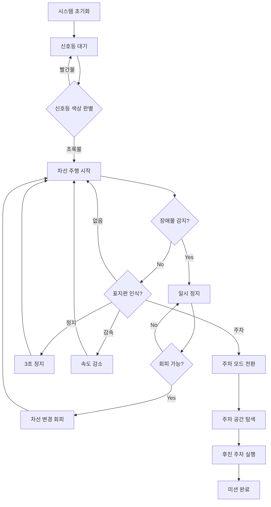

---

## 📊 3. 단계별 미션 분석표 (업데이트)

| 단계 | 미션명 | 입력 센서 | 처리 알고리즘 | 출력 제어 | 우선순위 | 구현 방식 |
|:---:|:---|:---|:---|:---|:---:|:---:|
| **1** | 신호등 대기 | 카메라 | ⭐ **YOLO11** | 모터 정지/출발 | ⭐⭐⭐⭐⭐ | ✅ 구현 완료 |
| **2** | 차선 유지 주행 | 카메라 | RGB 가중치+히스토그램 | DC모터 | ⭐⭐⭐⭐⭐ | ✅ 구현 완료 |
| **3** | 장애물 감지 | 초음파, 카메라 | 거리 임계값 판단 | 일시 정지/회피 | ⭐⭐⭐⭐ | 🔧 부분 구현 |
| **4** | 표지판 인식 | 카메라 | ⭐ **Haar Cascade** | 행동 변경 | ⭐⭐⭐⭐ | ✅ 구현 완료 |
| **5** | 자동 주차 | 카메라 | 템플릿 매칭 | 후진+정밀 조향 | ⭐⭐ | ⏳ 미구현 |

### 구현 우선순위

**현재 구현**:
- ⭐ 신호등: **Haar Cascade + HSV** (위치 감지 + 색상 판별)
- ⭐ 표지판: **Haar Cascade** (STOP/NO_DRIVE)
- ⭐ 자율주행: **RGB 가중치 + 히스토그램 3등분**

---

## 🔄 4. 상태 머신 다이어그램

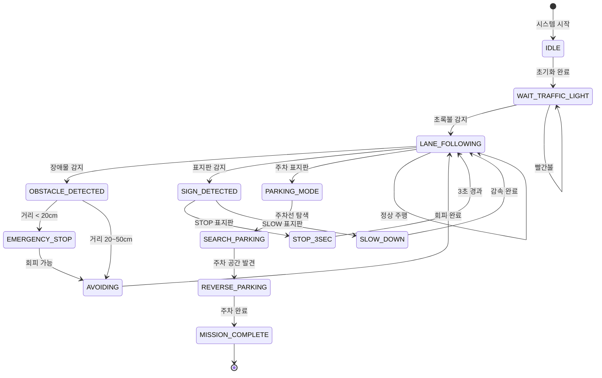

---

## 🛠️ 5. 단계별 상세 요구사항

### 5.1 신호등 대기 및 출발 ⭐ (Haar Cascade + HSV)

#### 전체 인식 프로세스 (2단계 방식)
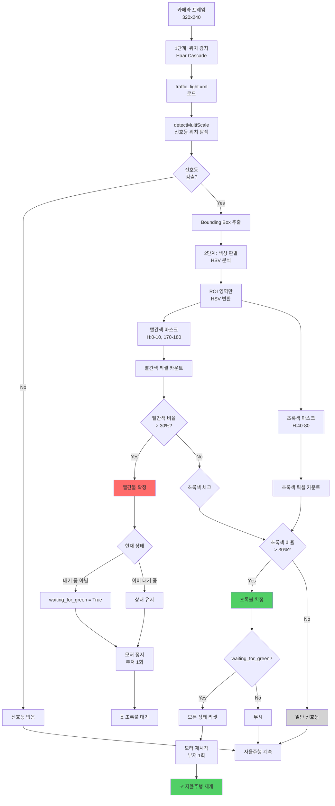

#### Haar Cascade + HSV 방식 특징

| 구분 | 특징 | 성능 |
|:---|:---|:---|
| **정확도** | 위치 감지 + 색상 판별 | 75-85% |
| **빨강/초록 구분** | HSV 픽셀 카운팅 | 비율 기반 판단 |
| **조명 영향** | 중간 | 적응형 임계값으로 보완 |
| **거리 변화 대응** | Cascade 스케일 불변 | 양호 |
| **처리 속도** | 빠름 | 5-15ms |
| **오탐률** | 중간 | 10-20% (minNeighbors 조정) |
| **구현 난이도** | 중간 | XML 학습 필요 |
| **하드웨어 요구** | 낮음 | Raspberry Pi 최적화 |

#### 단계별 상세 알고리즘 (Haar Cascade + HSV)

##### 1단계: Haar Cascade 위치 감지
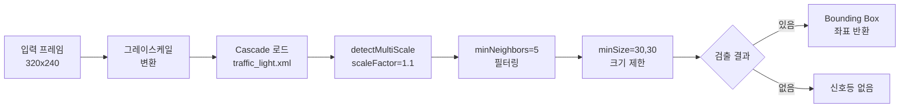

##### 2단계: HSV 색상 판별 및 제어
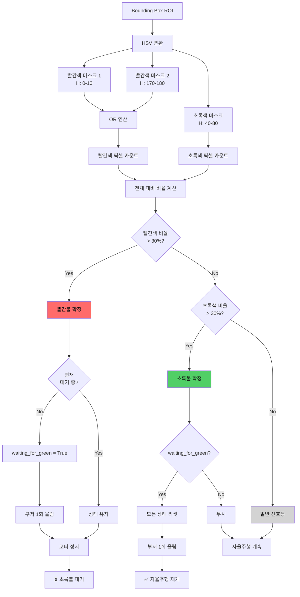

#### 핵심 파라미터 (Haar Cascade + HSV)

**1단계: Cascade 파라미터**
| 파라미터 | 값 | 설명 |
|:---|:---:|:---|
| **XML 파일** | traffic_light.xml | 신호등 위치 감지 모델 |
| **scaleFactor** | 1.1 | 이미지 피라미드 축소 비율 |
| **minNeighbors** | 5 | 검출 신뢰도 (주변 검출 수) |
| **minSize** | (30, 30) | 최소 객체 크기 (픽셀) |
| **maxSize** | (200, 200) | 최대 객체 크기 |
| **검출 시간** | 5-10ms | Raspberry Pi 4 기준 |

**2단계: HSV 색상 범위**
| 색상 | H (Hue) | S (Saturation) | V (Value) | 비율 임계값 |
|:---|:---:|:---:|:---:|:---:|
| **빨간색 1** | 0-10 | 100-255 | 100-255 | 30% |
| **빨간색 2** | 170-180 | 100-255 | 100-255 | 30% |
| **초록색** | 40-80 | 50-255 | 50-255 | 30% |
| **색상 판별 시간** | 2-3ms | - | - | - |

**전체 처리 시간**: 7-13ms

#### 상태 관리 변수
| 변수명 | 타입 | 설명 |
|:---|:---:|:---|
| `waiting_for_green` | bool | 빨간불 후 초록불 대기 중 |
| `red_light_active` | bool | 현재 빨간불 감지 중 |
| `green_light_active` | bool | 현재 초록불 감지 중 |
| `red_beep_played` | bool | 빨간불 부저 재생 여부 |
| `green_beep_played` | bool | 초록불 부저 재생 여부 |

---

### 5.2 차선 유지 주행 (핵심 미션) - 단일 차선 인식 방식

#### 🎯 단일 차선 기반 주행 전략
도로 폭이 좁아 양쪽 차선이 카메라에 잡히지 않으므로, **한쪽 차선만 인식**하여 주행합니다.

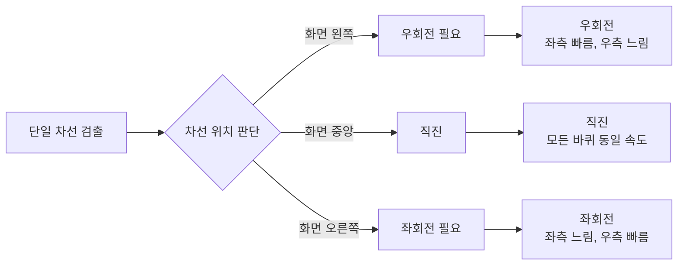

#### 전체 알고리즘 플로우
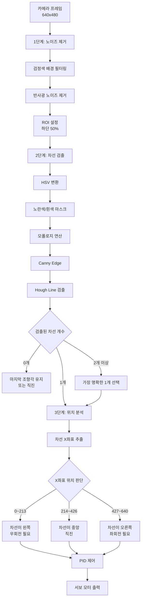

#### 차동 구동 제어 로직
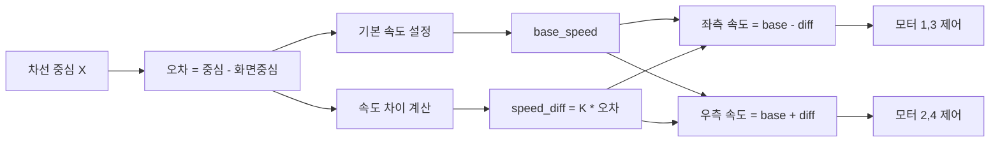

#### 튜닝 파라미터
| 파라미터 | 초기값 | 범위 | 설명 |
|:---|:---:|:---:|:---|
| base_speed | 15 | 10 ~ 30 | 기본 주행 속도 (PWM) |
| turn_speed_diff | 7 | 3 ~ 15 | 좌우 속도 차이 (회전력) |
| slow_turn_ratio | 0.5 | 0.3 ~ 0.8 | 회전 시 느린 바퀴 비율 |
| fast_turn_ratio | 1.0 | 0.8 ~ 1.2 | 회전 시 빠른 바퀴 비율 |

---

### 5.2.1 검정색 배경 필터링 알고리즘 (1단계 전처리)

검정색 아스팔트 도로에서 빛 반사로 인한 오검출을 방지하기 위한 필터링 알고리즘입니다.

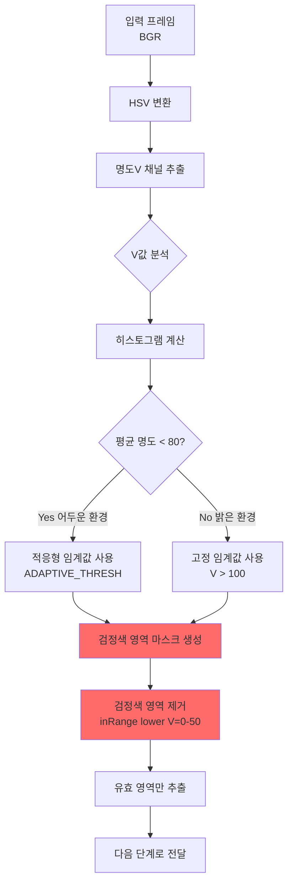

#### 파라미터 설정
| 구분 | HSV 범위 | 설명 |
|:---|:---|:---|
| **검정색 배경** | H: 모든값, S: 0-50, V: 0-50 | 제거 대상 |
| **차선 (흰색)** | H: 모든값, S: 0-50, V: 200-255 | 검출 대상 |
| **차선 (노란색)** | H: 15-35, S: 100-255, V: 100-255 | 검출 대상 |

---

### 5.2.2 빛 반사 노이즈 제거 알고리즘 (2단계 전처리)

조명이나 태양광 반사로 인한 과도하게 밝은 영역을 필터링합니다.

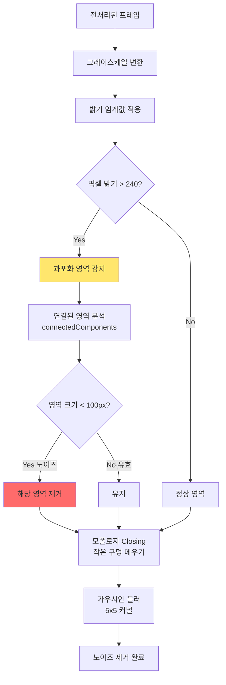

#### 노이즈 필터링 전략
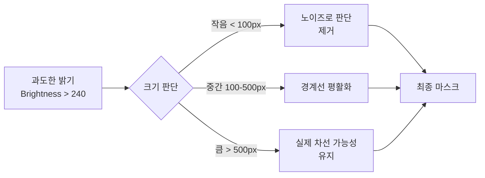

---

### 5.2.3 단일 차선 위치 판단 알고리즘

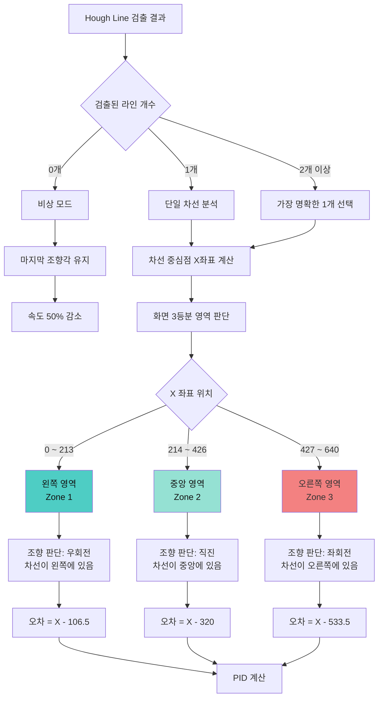

#### 화면 영역 분할 도식
```
┌─────────────────────────────────────┐
│         카메라 화면 (640px)          │
├───────────┬───────────┬─────────────┤
│  Zone 1   │  Zone 2   │   Zone 3    │
│  (왼쪽)   │  (중앙)   │   (오른쪽)  │
│  0~213px  │ 214~426px │  427~640px  │
├───────────┼───────────┼─────────────┤
│           │           │             │
│     ╱     │     │     │      ╲      │
│    ╱      │     │     │       ╲     │
│   ╱       │     │     │        ╲    │
│  차선     │  차선     │      차선   │
│           │           │             │
│  → 우회전 │  → 직진   │   → 좌회전  │
└───────────┴───────────┴─────────────┘
```

---

### 5.3 장애물 감지 및 회피

#### 센서 융합 로직
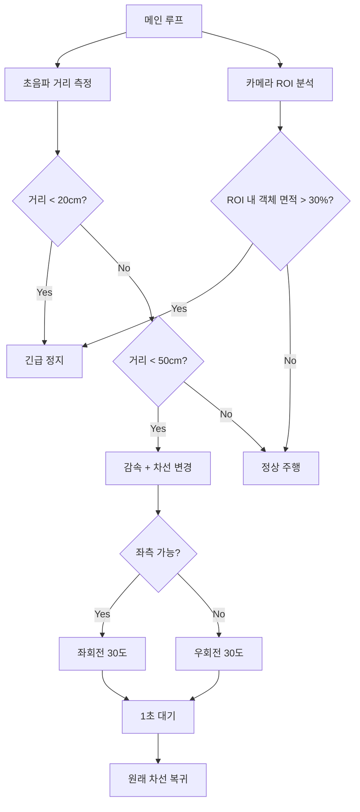

#### 회피 파라미터
| 구분 | 값 | 설명 |
|:---|:---:|:---|
| 긴급정지 거리 | < 20cm | 즉시 모터 정지 |
| 감속 거리 | 20~50cm | 속도 50% 감소 |
| 회피 조향각 | ±30도 | 차선 변경 시 |
| 복귀 대기 시간 | 1.5초 | 장애물 통과 후 |

---

### 5.4 표지판 인식 (Haar Cascade 멀티 모델)

#### 전체 표지판 인식 파이프라인
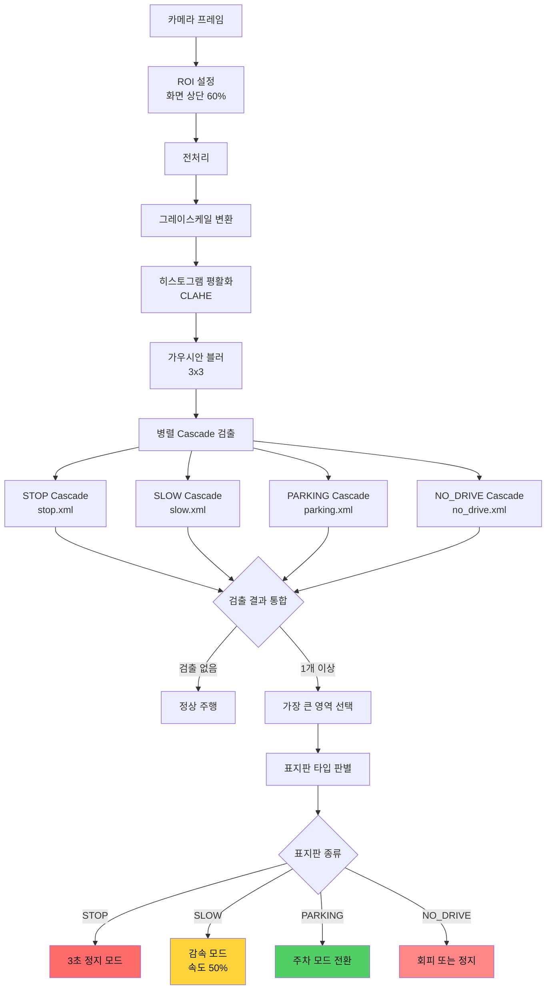

#### 각 표지판별 상세 처리 로직

##### 5.4.1 STOP 표지판 처리
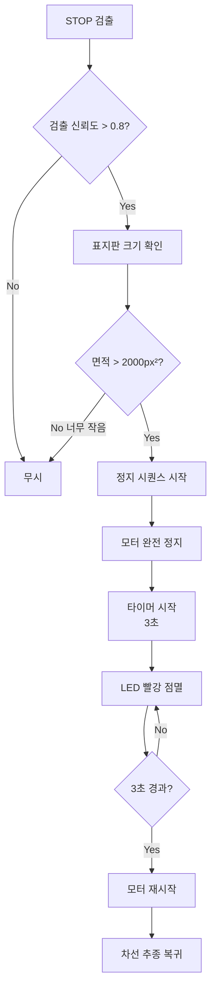

##### 5.4.2 PARKING (주차) 표지판 처리 - O, X 표시 인식
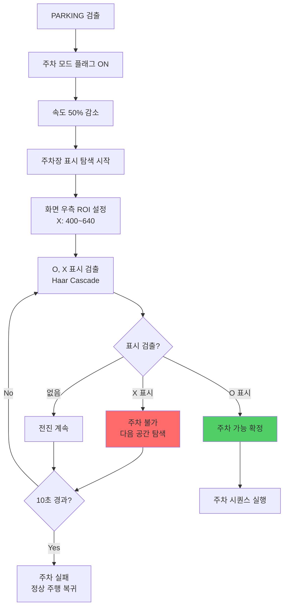

#### Haar Cascade 모델별 파라미터
| 표지판 종류 | XML 파일 | 학습 이미지 수 | 검출 신뢰도 | ScaleFactor | MinNeighbors | 동작 |
|:---|:---|:---:|:---:|:---:|:---:|:---|
| **STOP** | stop.xml | 200장 이상 | 0.8 | 1.1 | 5 | 3초 완전 정지 |
| **SLOW** | slow.xml | 150장 이상 | 0.75 | 1.1 | 4 | 속도 50% 감소 |
| **PARKING** | parking.xml | 150장 이상 | 0.75 | 1.15 | 4 | 주차 모드 전환 |
| **NO_DRIVE** | no_drive.xml | 100장 이상 | 0.8 | 1.1 | 5 | 진입 금지 |
| **주차 O 표시** | parking_o.xml | 100장 이상 | 0.7 | 1.2 | 3 | 주차 가능 공간 |
| **주차 X 표시** | parking_x.xml | 100장 이상 | 0.7 | 1.2 | 3 | 주차 불가 공간 |

---

### 5.4.3 자동차 객체 회피 (Haar Cascade + 초음파)

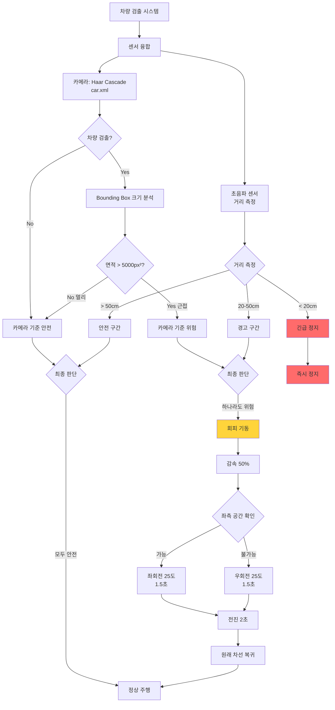

#### 자동차 크기별 거리 추정
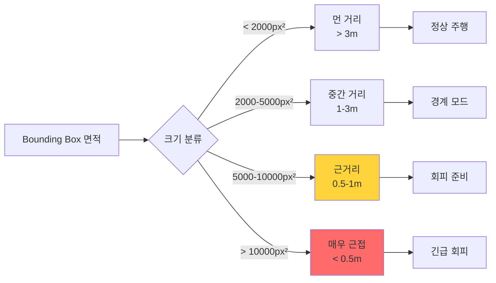

---

### 5.5 자동 주차 (O, X 표시 인식 기반 - Haar Cascade)

#### 전체 주차 프로세스 (O, X 표시 방식)
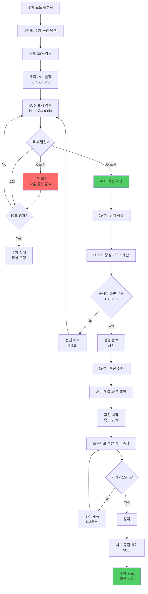

#### 주차 상세 단계별 도식

##### 1단계: 주차 공간 탐색 (O, X 표시 인식)
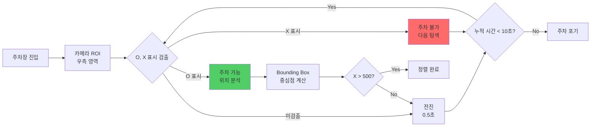

##### 2단계: 후진 주차 실행
```mermaid
flowchart TD
    A[정렬 완료 위치] --> B[서보 조향<br/>우측 45도]
    
    B --> C[후진 시작]
    C --> D[초음파 측정]
    
    D --> E{후방 거리}
    E -->|> 30cm| F[후진 속도 30%]
    E -->|15-30cm| G[후진 속도 20%]
    E -->|< 15cm| H[정지]
    
    F --> I[0.5초 후진]
    G --> J[0.3초 후진]
    
    I --> D
    J --> D
    
    H --> K[서보 중립 90도]
    K --> L[주차 완료]
    
    style L fill:#51cf66
```

#### 주차 공간 인식 도식 (O, X 표시 방식)
```
[카메라 뷰 - 640x480]
┌─────────────────────────────────────┐
│                                     │
│  일반 주행 영역    │  주차장 ROI     │
│  (X: 0~400)       │  (X:400~640)    │
│                   │                 │
│                   │  ┌───┐  ┌───┐  │
│       차선        │  │ X │  │ O │◄─┼─ O 검출!
│         │         │  └───┘  └───┘  │
│         │         │  주차불가 주차가능│
│         │         │                 │
└─────────────────────────────────────┘

[탐색 중]              [X 발견]            [O 발견!]
차량 위치               차량 위치           차량 위치
  ↓                      ↓                  ↓
──┼──                 ──┼──              ──┼────
  │                     │                  │
  │      →→→        X 발견, 통과       정렬 완료
  │      전진           │ →→→              │ ↓
  │                     │                  │ 후진
┌───┐ ┌───┐         ┌───┐ ┌───┐        ┌───┐ ┌───┐
│ X │ │ O │         │ X │ │ O │        │ X │ │ O │
└───┘ └───┘         └───┘ └───┘        └───┘ └───┘
```

#### 주차 파라미터 (O, X 표시 방식)
| 구분 | 값 | 설명 |
|:---|:---:|:---|
| 탐색 속도 | 30% PWM | 주차 공간 찾는 속도 |
| 후진 속도 | 20-30% PWM | 후진 주차 속도 |
| 조향각 | 45도 우측 | 후진 시 조향 |
| 정지 거리 | 15cm | 후방 장애물까지 |
| 탐색 제한 시간 | 10초 | 초과 시 포기 |
| O 검출 신뢰도 | 0.7 | Cascade 임계값 (주차 가능) |
| X 검출 신뢰도 | 0.7 | Cascade 임계값 (주차 불가) |
| ROI 영역 | X: 400~640 | 우측 영역만 탐색 |
| 표시 크기 범위 | 2000~10000 px² | 유효 표시 면적 |

---

## 🖥️ 6. Raspbot 시스템 구성 요구사항

### 6.1 하드웨어 구성표

| 구분 | 부품명 | 모델/사양 | 용도 | 수량 | 우선순위 |
|:---:|:---|:---|:---|:---:|:---:|
| **메인 컨트롤러** | Raspberry Pi | 4B/5 (4GB 이상) | 메인 연산 및 제어 | 1 | ⭐⭐⭐⭐⭐ |
| **비전 센서** | Pi Camera | V2 (8MP) 또는 USB Cam | 차선/객체 인식 | 1 | ⭐⭐⭐⭐⭐ |
| **거리 센서** | 초음파 센서 | HC-SR04 | 장애물 거리 측정 | 1~2 | ⭐⭐⭐⭐ |
| **구동 모터** | DC 기어드 모터 | 6V, 감속비 1:48 | 4륜 독립 구동 | 4 | ⭐⭐⭐⭐⭐ |
| **카메라 모터** | 서보 모터 | SG90 (180도) | 카메라 각도 조정 | 1~2 | ⭐⭐⭐ |
| **모터 드라이버** | L298N / DRV8833 | 듀얼 H-브릿지 | DC 모터 제어 | 2 | ⭐⭐⭐⭐⭐ |
| **전원** | 리튬 배터리 | 7.4V 2S LiPo | 전체 시스템 전원 | 1 | ⭐⭐⭐⭐ |
| **보조 센서** | RGB LED | WS2812B | 상태 표시 (선택) | 1 | ⭐⭐ |
| **보조 센서** | 부저 | 5V Active Buzzer | 경고음 (선택) | 1 | ⭐ |

### 6.2 시스템 아키텍처

```mermaid
graph TB
    subgraph "하드웨어 계층"
        CAM[Pi Camera]
        US[초음파 센서]
        SERVO[서보 모터]
        MOTOR[DC 모터 x2]
        LED[RGB LED]
        BUZZER[부저]
    end
    
    subgraph "드라이버 계층"
        CAM_DRV[camera.py]
        SENSOR_DRV[ultrasonic.py]
        MOTOR_DRV[motor_driver.py]
        SERVO_DRV[servo_driver.py]
    end
    
    subgraph "인식 계층"
        LANE[lane_detector.py]
        OBJ[object_detector.py]
        TRAFFIC[traffic_light.py]
    end
    
    subgraph "제어 계층"
        PID[pid_controller.py]
        MOTION[motion_control.py]
    end
    
    subgraph "판단 계층"
        STATE[mission_planner.py]
        LOGGER[logger.py]
    end
    
    CAM --> CAM_DRV
    US --> SENSOR_DRV
    SERVO --> SERVO_DRV
    MOTOR --> MOTOR_DRV
    
    CAM_DRV --> LANE
    CAM_DRV --> OBJ
    CAM_DRV --> TRAFFIC
    SENSOR_DRV --> STATE
    
    LANE --> PID
    OBJ --> STATE
    TRAFFIC --> STATE
    
    PID --> MOTION
    STATE --> MOTION
    
    MOTION --> SERVO_DRV
    MOTION --> MOTOR_DRV
    MOTION --> LED
    MOTION --> BUZZER
    
    STATE --> LOGGER
```

### 6.2.1 데이터 흐름 상세 도식
```mermaid
flowchart LR
    subgraph "입력 단계"
        A1[카메라<br/>30 FPS]
        A2[초음파<br/>10 Hz]
    end
    
    subgraph "전처리 단계"
        B1[검정 배경<br/>필터링]
        B2[반사광<br/>제거]
        B3[ROI<br/>추출]
    end
    
    subgraph "인식 단계"
        C1[신호등<br/>HSV]
        C2[표지판<br/>Cascade]
        C3[차선<br/>Hough]
        C4[장애물<br/>거리]
    end
    
    subgraph "판단 단계"
        D1[우선순위<br/>평가]
        D2[상태<br/>전환]
    end
    
    subgraph "제어 단계"
        E1[방향<br/>결정]
        E2[속도 분배<br/>좌우 차동]
        E3[카메라<br/>각도 조정]
    end
    
    subgraph "출력 단계"
        F1[카메라 서보<br/>Pan/Tilt]
        F2[DC모터 1,2,3,4<br/>차동 구동]
    end
    
    A1 --> B1
    B1 --> B2
    B2 --> B3
    B3 --> C1
    B3 --> C2
    B3 --> C3
    A2 --> C4
    
    C1 --> D1
    C2 --> D1
    C3 --> D1
    C4 --> D1
    
    D1 --> D2
    D2 --> E1
    E1 --> E2
    E2 --> E3
    
    E1 --> F1
    E2 --> F2
    E3 --> F2
```

### 6.2.2 처리 시간 타이밍 다이어그램
```mermaid
gantt
    title 1프레임 처리 시간 (목표: 33ms 이내)
    dateFormat X
    axisFormat %L
    
    section 입력
    카메라 캡처           :0, 5
    
    section 전처리
    배경 필터링           :5, 8
    ROI 추출             :8, 10
    
    section 인식
    신호등 검출           :10, 15
    표지판 검출           :10, 18
    차선 검출             :10, 20
    초음파 측정           :10, 12
    
    section 제어
    우선순위 판단         :20, 22
    PID 계산             :22, 25
    
    section 출력
    모터 출력             :25, 28
```

#### 각 모듈별 목표 처리 시간
| 모듈 | 목표 시간 | 최대 허용 | 비고 |
|:---|:---:|:---:|:---|
| 카메라 캡처 | 5ms | 10ms | 해상도 640x480 기준 |
| 배경/노이즈 필터링 | 3ms | 5ms | 병렬 처리 가능 |
| 신호등 인식 | 5ms | 8ms | ROI로 고속화 |
| 표지판 인식 | 8ms | 12ms | Cascade 4개 병렬 |
| 차선 검출 | 10ms | 15ms | Hough Transform |
| 초음파 센서 | 2ms | 5ms | 3회 평균 |
| PID 계산 | 3ms | 5ms | 단순 연산 |
| 모터 출력 | 3ms | 5ms | PWM 제어 |
| **합계** | **28ms** | **33ms** | **30 FPS 유지** |

---

### 6.3 소프트웨어 모듈 구조

#### 폴더 구조 (제안)
```text
raspbot_v2_autonomous/
│
├── src/
│   ├── sensors/                    # 하드웨어 드라이버 계층
│   │   ├── __init__.py
│   │   ├── camera.py              # 카메라 캡처 클래스
│   │   ├── ultrasonic.py          # 초음파 센서 클래스
│   │   ├── motor_driver.py        # DC 모터 제어 클래스
│   │   └── servo_driver.py        # 서보 모터 제어 클래스
│   │
│   ├── perception/                 # 인식 알고리즘 계층
│   │   ├── __init__.py
│   │   ├── lane_detector.py       # 차선 검출 (Canny+Hough+PID)
│   │   ├── object_detector.py     # 장애물 검출 (ROI 분석)
│   │   ├── traffic_light.py       # 신호등 인식 (HSV)
│   │   └── sign_detector.py       # 표지판 인식 (Haar Cascade)
│   │
│   ├── control/                    # 제어 알고리즘 계층
│   │   ├── __init__.py
│   │   ├── pid_controller.py      # PID 제어기
│   │   └── motion_control.py      # 통합 모션 제어
│   │
│   ├── decision/                   # 상위 판단 계층
│   │   ├── __init__.py
│   │   ├── mission_planner.py     # 상태 머신 (State Machine)
│   │   └── behavior_tree.py       # 행동 트리 (선택)
│   │
│   └── utils/                      # 유틸리티
│       ├── __init__.py
│       ├── config.py              # 설정값 관리
│       ├── logger.py              # 로깅 시스템
│       └── visualizer.py          # 디버깅용 화면 출력
│
├── config/                         # 설정 파일
│   ├── pid_params.yaml            # PID 튜닝 파라미터
│   ├── color_ranges.yaml          # HSV 색상 범위
│   └── cascade_models/            # Haar Cascade XML
│       ├── stop.xml
│       ├── slow.xml
│       └── parking.xml
│
├── main.py                         # 메인 실행 파일
├── requirements.txt                # 의존성 패키지
└── README.md                       # 프로젝트 설명
```

---

## 🔄 7. 전체 시스템 통합 알고리즘

### 7.0 메인 루프 전체 흐름도 (Haar Cascade 전용)
```mermaid
flowchart TD
    A[시스템 시작] --> B[하드웨어 초기화]
    B --> B1[⭐ Haar Cascade 로드<br/>traffic_light.xml]
    B1 --> B2[⭐ Haar Cascade 로드<br/>stop/no_drive.xml]
    B2 --> C[카메라/센서/모터 체크]
    C --> D[메인 루프 진입]
    
    D --> E[프레임 캡처<br/>320x240]
    E --> E1[3가지 프레임 준비<br/>Original/Gray/RGB-Gray]
    
    E1 --> F[⭐ Priority 1: 신호등 감지<br/>Haar Cascade + HSV]
    F --> F1[Cascade로 위치 검출]
    F1 --> G{신호등<br/>검출?}
    
    G -->|No| J[⭐ Priority 2: 표지판]
    G -->|Yes| H[HSV 색상 판별]
    
    H --> H1{색상 판별}
    H1 -->|빨간불| I1[waiting_for_green = True]
    I1 --> I2{부저<br/>재생?}
    I2 -->|No| I3[부저 1회 울림]
    I2 -->|Yes| I4
    I3 --> I4[모든 기능 정지]
    I4 --> I5[⏳ 초록불 대기]
    I5 --> SKIP_ALL[표지판/차선 스킵]
    
    H1 -->|초록불 + 대기중| J1[모든 상태 리셋]
    J1 --> J2[부저 1회 울림]
    J2 --> J3[✅ 자율주행 재개]
    
    H1 -->|일반| J
    J3 --> J
    
    J --> J4{신호등<br/>대기 중?}
    J4 -->|Yes| SKIP_SIGN[표지판 감지 스킵]
    J4 -->|No| K[선택된 프레임으로<br/>Cascade 검출]
    
    K --> L{표지판<br/>검출?}
    L -->|STOP/NO_DRIVE| M1[sign_active = True]
    M1 --> M2{부저<br/>재생?}
    M2 -->|No| M3[부저 1회 울림]
    M2 -->|Yes| M4
    M3 --> M4[모터 정지]
    M4 --> SKIP_AUTO[차선 추종 스킵]
    
    L -->|없음| N[⭐ Priority 3: 차선 추종]
    
    SKIP_SIGN --> N
    N --> O[RGB 가중치 변환]
    O --> P[ROI 추출 + 원근 변환]
    P --> Q[이진화]
    Q --> R[히스토그램 3등분]
    R --> S[방향 결정<br/>LEFT/UP/RIGHT]
    
    S --> T{정지<br/>상태?}
    T -->|신호등 대기| U1[모터 정지 유지]
    T -->|표지판 대기| U2[모터 정지 유지]
    T -->|자율주행| V[방향에 따라 주행]
    
    SKIP_ALL --> NEXT[다음 루프]
    SKIP_AUTO --> NEXT
    U1 --> NEXT
    U2 --> NEXT
    V --> NEXT
    
    NEXT --> E
    
    style I1 fill:#ff6b6b
    style I4 fill:#ff6b6b
    style J1 fill:#51cf66
    style J3 fill:#51cf66
    style F fill:#ffd43b
    style J fill:#ffd43b
    style N fill:#4ecdc4
```

### 7.0.1 우선순위 처리 로직 (Haar Cascade 전용)
```mermaid
flowchart LR
    A[센서 입력] --> B{우선순위 판단}
    
    B -->|P1 최고| C[⭐ 신호등<br/>Cascade+HSV]
    B -->|P2 높음| D[⭐ 표지판<br/>Haar Cascade]
    B -->|P3 중간| E[장애물<br/>초음파]
    B -->|P4 낮음| F[차선 추종<br/>히스토그램]
    
    C --> C1[Cascade 위치 감지]
    C1 --> C2[HSV 색상 판별]
    C2 --> C3{빨간불?}
    C3 -->|Yes| G[모든 기능 정지<br/>초록불 대기]
    C3 -->|No| C4{초록불?}
    C4 -->|Yes| H[모든 상태 리셋<br/>자율주행 재개]
    C4 -->|No| I[자율주행 계속]
    
    D --> D1{STOP/NO_DRIVE?}
    D1 -->|Yes| J[모터 정지<br/>표지판 사라질 때까지]
    D1 -->|No| I
    
    E --> K[회피 기동]
    F --> L[방향 제어]
    
    style C fill:#ffd43b
    style C3 fill:#ff6b6b
    style C4 fill:#51cf66
    style D fill:#ffd43b
```

#### 우선순위 테이블
| 우선순위 | 조건 | 검출 방식 | 동작 | 다른 기능 중단 | 복귀 조건 |
|:---:|:---|:---:|:---|:---:|:---|
| **P1** | 신호등 빨간불 | ⭐ **Cascade+HSV** | 모든 기능 정지 | ✅ 전체 | 초록불 감지 |
| **P1** | 신호등 초록불 | ⭐ **Cascade+HSV** | 모든 상태 리셋 | ✅ 전체 | 자동 (즉시 해제) |
| **P2** | STOP 표지판 | ⭐ **Haar Cascade** | 모터 정지 | ✅ 차선만 | 표지판 사라짐 |
| **P2** | NO_DRIVE 표지판 | ⭐ **Haar Cascade** | 모터 정지 | ✅ 차선만 | 표지판 사라짐 |
| **P3** | 장애물 < 20cm | 초음파 | 긴급 정지 | ✅ 전체 | 거리 > 30cm |
| **P4** | 차선 검출 | RGB 히스토그램 | 방향 제어 | - | 상위 우선순위 발생 |

#### 상태 전환 규칙
```
[빨간불 감지]
  → waiting_for_green = True
  → 모든 모터 정지
  → 표지판 감지도 무시
  → 프레임 처리는 계속 (백그라운드)

[초록불 감지 + 대기 중]
  → 모든 상태 변수 리셋
  → waiting_for_green = False
  → red_light_active = False
  → stop_sign_active = False
  → no_drive_sign_active = False
  → ✅ 자율주행 즉시 재개

[표지판 감지] (신호등 대기 중 아님)
  → sign_active = True
  → 모터 정지
  → 표지판 사라질 때까지 대기

[부저 최적화]
  → 각 신호별 최초 1회만 울림
  → beep_played 플래그로 관리
  → 상태 변경 시 플래그 리셋
```

---

### 7.0.2 단계별 인식 시퀀스 다이어그램 (YOLO11 + Haar Cascade)
```mermaid
sequenceDiagram
    participant M as Main Loop
    participant C as Camera
    participant Y as YOLO11 (신호등)
    participant H as Haar Cascade (표지판)
    participant L as Lane Detector
    participant S as State Manager
    participant MC as Motor Control
    
    M->>C: 프레임 요청
    C-->>M: 320x240 이미지
    M->>M: 3가지 프레임 준비<br/>(Original/Gray/RGB-Gray)
    
    Note over M,Y: ⭐ Priority 1: 신호등 (YOLO11)
    M->>Y: YOLO11 추론 요청
    Y->>Y: 640x640 리사이징
    Y->>Y: 신경망 추론 (50-100ms)
    Y-->>M: red_detected / green_detected
    
    alt 빨간불 감지
        M->>S: waiting_for_green = True
        S->>MC: 모든 모터 정지
        Note over M: 표지판/차선 감지 스킵
        M->>M: ⏳ 초록불 대기
    else 초록불 감지 (대기 중)
        M->>S: 모든 상태 리셋
        S->>S: waiting_for_green = False
        S->>S: sign_active = False
        Note over M: ✅ 자율주행 즉시 재개
    else 신호등 없음
        Note over M,H: ⭐ Priority 2: 표지판 (Haar Cascade)
        
        alt 신호등 대기 중 아님
            M->>H: 선택된 프레임 소스
            H->>H: Cascade 검출 (5-10ms)
            H-->>M: stop_detected / no_drive_detected
            
            alt STOP/NO_DRIVE 감지
                M->>S: sign_active = True
                S->>MC: 모터 정지
                Note over M: 표지판 사라질 때까지 대기
            else 표지판 없음
                Note over M,L: ⭐ Priority 3: 자율주행 (항상 실행)
                M->>L: 프레임 처리
                L->>L: RGB 가중치 변환
                L->>L: ROI + 원근 변환
                L->>L: 히스토그램 3등분
                L-->>M: 방향 (LEFT/UP/RIGHT)
                
                alt 정지 상태 (신호등 or 표지판)
                    M->>MC: 모터 정지 유지
                else 자율주행 모드
                    M->>MC: 방향에 따라 주행
                end
            end
        end
    end
```

---

### 7.0.3 센서 융합 알고리즘
```mermaid
flowchart TD
    A[센서 융합 시작] --> B[카메라 데이터]
    A --> C[초음파 데이터]
    
    B --> D[Haar Cascade<br/>객체 검출]
    C --> E[거리 측정<br/>3회 평균]
    
    D --> F{객체 크기}
    E --> G{거리 범위}
    
    F -->|큼 > 5000px²| H[카메라: 위험]
    F -->|작음| I[카메라: 안전]
    
    G -->|< 30cm| J[초음파: 위험]
    G -->|> 30cm| K[초음파: 안전]
    
    H --> L{융합 판단}
    I --> L
    J --> L
    K --> L
    
    L -->|둘다 위험| M[즉시 정지]
    L -->|하나 위험| N[경고 회피]
    L -->|둘다 안전| O[정상 주행]
    
    style M fill:#ff6b6b
    style N fill:#ffd43b
    style O fill:#51cf66
```

#### 센서 융합 의사결정 테이블
```
┌─────────────┬──────────────┬───────────────┐
│ 초음파 센서 │ 카메라 검출  │ 최종 판단     │
├─────────────┼──────────────┼───────────────┤
│  < 20cm     │   검출       │ 긴급 정지 ⛔ │
│  < 20cm     │   미검출     │ 긴급 정지 ⛔ │
│  20-50cm    │   검출       │ 회피 기동 ⚠️  │
│  20-50cm    │   미검출     │ 감속 주행 ⚠️  │
│  > 50cm     │   검출 (큼)  │ 경계 모드 ⚠️  │
│  > 50cm     │   검출 (작음)│ 정상 주행 ✅ │
│  > 50cm     │   미검출     │ 정상 주행 ✅ │
└─────────────┴──────────────┴───────────────┘
```

---

## 📝 8. 핵심 알고리즘 상세 설계

### 8.1 차선 검출 알고리즘 (Lane Detection) - 단일 차선 방식

#### 전체 파이프라인 (7단계)
```mermaid
flowchart TD
    A[입력: BGR 프레임<br/>640x480] --> B{프레임 유효성}
    B -->|None| C[Early Return<br/>마지막 조향각 유지]
    B -->|Valid| D[1단계: 검정 배경 제거]
    
    D --> E[HSV 변환]
    E --> F[V채널 < 50 마스크]
    F --> G[검정 영역 제거]
    
    G --> H[2단계: 반사광 제거]
    H --> I[그레이스케일]
    I --> J{밝기 > 240?}
    J -->|Yes| K[크기 < 100px 제거]
    J -->|No| L[유지]
    
    K --> M[3단계: ROI 추출]
    L --> M
    M --> N[하단 50% 영역<br/>Y: 240~480]
    
    N --> O[4단계: 색상 필터링]
    O --> P[HSV 변환]
    P --> Q[노란색 마스크<br/>H:15-35]
    P --> R[흰색 마스크<br/>V:200-255]
    
    Q --> S[비트 OR 결합]
    R --> S
    
    S --> T[5단계: 형태학 처리]
    T --> U[Morphology Closing<br/>7x7 커널]
    U --> V[가우시안 블러<br/>5x5]
    
    V --> W[6단계: 에지 검출]
    W --> X[Canny Edge<br/>Thresh: 50, 150]
    X --> Y[Hough Line Transform<br/>rho:1, theta:π/180]
    
    Y --> Z{검출된 라인}
    Z -->|0개| AA[비상 모드<br/>직진 또는 마지막 각도]
    Z -->|1개| AB[7단계: 위치 분석]
    Z -->|2개 이상| AC[가장 긴 라인 선택]
    
    AC --> AB
    AB --> AD[라인 중심 X좌표]
    AD --> AE{X좌표 영역 판단}
    
    AE -->|0~213| AF[Zone 1 왼쪽<br/>우회전 필요]
    AE -->|214~426| AG[Zone 2 중앙<br/>직진]
    AE -->|427~640| AH[Zone 3 오른쪽<br/>좌회전 필요]
    
    AF --> AI[PID 입력]
    AG --> AI
    AH --> AI
    
    AI --> AJ[조향각 출력<br/>-45° ~ +45°]
    
    style D fill:#ffe66d
    style H fill:#ffe66d
    style AA fill:#ff6b6b
```

#### 각 단계별 상세 알고리즘

##### 4단계: 색상 필터링 상세
```mermaid
flowchart TD
    A[ROI 이미지] --> B[BGR to HSV]
    
    B --> C[채널 분리]
    C --> D[H 채널]
    C --> E[S 채널]
    C --> F[V 채널]
    
    D --> G{노란색 범위?<br/>15-35}
    E --> H{채도?<br/>100-255}
    F --> I{명도?<br/>100-255}
    
    G --> J[AND 연산]
    H --> J
    I --> J
    J --> K[노란색 마스크]
    
    E --> L{채도?<br/>0-50}
    F --> M{명도?<br/>200-255}
    L --> N[AND 연산]
    M --> N
    N --> O[흰색 마스크]
    
    K --> P[OR 연산]
    O --> P
    P --> Q[최종 차선 마스크]
```

##### 6단계: 에지 검출 최적화
```mermaid
flowchart LR
    A[블러 이미지] --> B[Canny Edge]
    
    B --> C[하위 임계값<br/>50]
    B --> D[상위 임계값<br/>150]
    
    C --> E{Gradient < 50?}
    D --> F{Gradient > 150?}
    
    E -->|Yes| G[비에지]
    F -->|Yes| H[강한 에지]
    
    E -->|No| I{50 < G < 150?}
    F -->|No| I
    
    I -->|Yes| J[약한 에지<br/>연결 확인]
    J --> K{강한 에지와<br/>연결됨?}
    K -->|Yes| H
    K -->|No| G
    
    G --> L[제거]
    H --> M[에지 유지]
```

---

### 8.2 차동 구동 제어 알고리즘

#### 전체 차동 구동 제어 플로우
```mermaid
flowchart TD
    A[방향 입력<br/>LEFT/UP/RIGHT] --> B{방향 판단}
    
    B -->|LEFT| C[좌회전 계산]
    B -->|UP| D[직진 계산]
    B -->|RIGHT| E[우회전 계산]
    
    C --> C1[기본 속도 base_speed]
    C1 --> C2[속도 차이 turn_diff]
    C2 --> C3[좌측 = base × 0.5]
    C2 --> C4[우측 = base × 1.0]
    
    D --> D1[모든 바퀴 동일]
    D1 --> D2[속도 = base_speed]
    
    E --> E1[기본 속도 base_speed]
    E1 --> E2[속도 차이 turn_diff]
    E2 --> E3[좌측 = base × 1.0]
    E2 --> E4[우측 = base × 0.5]
    
    C3 --> F[모터 1,3<br/>좌측]
    C4 --> G[모터 2,4<br/>우측]
    
    D2 --> F
    D2 --> G
    
    E3 --> F
    E4 --> G
    
    F --> H[PWM 출력<br/>좌측 바퀴]
    G --> I[PWM 출력<br/>우측 바퀴]
    
    style C fill:#4ecdc4,color:#111
    style D fill:#95e1d3,color:#111
    style E fill:#f38181,color:#111
```

#### 차동 구동 속도 분배 도식
```mermaid
flowchart LR
    subgraph "직진 (UP)"
        A1[base_speed] --> A2[좌측 = base]
        A1 --> A3[우측 = base]
    end
    
    subgraph "좌회전 (LEFT)"
        B1[base_speed] --> B2[좌측 = base × 0.5]
        B1 --> B3[우측 = base × 1.0]
    end
    
    subgraph "우회전 (RIGHT)"
        C1[base_speed] --> C2[좌측 = base × 1.0]
        C1 --> C3[우측 = base × 0.5]
    end
    
    A2 --> D[모터 1,3]
    A3 --> E[모터 2,4]
    B2 --> D
    B3 --> E
    C2 --> D
    C3 --> E
```

#### 차동 구동 동작 예시
```
[차선이 왼쪽에 위치 - 우회전 필요]

상황        | 방향   | 좌측속도 | 우측속도 | 결과
-----------|--------|----------|----------|-------------
직진 중     | UP     | 15       | 15       | 직진
좌회전 검출 | LEFT   | 8        | 15       | 좌회전 (느리게)
중앙 복귀   | UP     | 15       | 15       | 직진
우회전 검출 | RIGHT  | 15       | 8        | 우회전 (느리게)
중앙 유지   | UP     | 15       | 15       | 직진 유지

[설명]
- 직진: 모든 바퀴 동일 속도
- 좌회전: 좌측 바퀴 느리게, 우측 바퀴 빠르게
- 우회전: 좌측 바퀴 빠르게, 우측 바퀴 느리게
- 회전 반경은 속도 차이로 조절
```

#### 차동 구동 수식
\[
\text{좌측 속도} = \begin{cases}
v_{base} \times 0.5 & \text{if LEFT} \\
v_{base} & \text{if UP} \\
v_{base} \times 1.0 & \text{if RIGHT}
\end{cases}
\]

\[
\text{우측 속도} = \begin{cases}
v_{base} \times 1.0 & \text{if LEFT} \\
v_{base} & \text{if UP} \\
v_{base} \times 0.5 & \text{if RIGHT}
\end{cases}
\]

여기서:
- \( v_{base} \) = 기본 주행 속도 (10 ~ 30 PWM)
- 0.5 = 느린 바퀴 비율 (조정 가능)
- 1.0 = 빠른 바퀴 비율 (조정 가능)

#### 파라미터 튜닝 가이드
| 현상 | 원인 | 조치 | 우선순위 |
|:---|:---|:---|:---:|
| 회전 반응 느림 | turn_diff 너무 작음 | turn_diff 증가 (1~2씩) | ⭐⭐⭐⭐⭐ |
| 회전 과도함 | turn_diff 너무 큼 | turn_diff 감소 | ⭐⭐⭐⭐⭐ |
| 직진 속도 느림 | base_speed 낮음 | base_speed 증가 (1~2씩) | ⭐⭐⭐⭐ |
| 곡선에서 이탈 | slow_turn_ratio 높음 | slow_turn_ratio 감소 | ⭐⭐⭐⭐ |
| 회전 반경 너무 큼 | 속도 차이 부족 | slow_turn_ratio 더 낮춤 (0.3~0.5) | ⭐⭐⭐ |
| 제자리 회전 필요 | 한쪽 역방향 | slow_turn_ratio = -0.5 (역회전) | ⭐⭐ |
| 차량 흔들림 | 속도 변화 급함 | 점진적 가속/감속 추가 | ⭐⭐⭐ |

#### 튜닝 순서 (추천)
```mermaid
flowchart LR
    A[1단계<br/>직선 주행<br/>base_speed 조정] --> B[2단계<br/>회전 테스트<br/>turn_diff 조정]
    B --> C[3단계<br/>곡선 주행<br/>slow_ratio 조정]
    C --> D[4단계<br/>미세 조정<br/>전체 밸런스]
```

---

## 🎮 9. 클래스 설계 (Class Diagram)

### 9.1 전체 클래스 구조
```mermaid
classDiagram
    class MissionPlanner {
        -state: State
        -priority_level: int
        -lane_detector: LaneDetector
        -object_detector: ObjectDetector
        -traffic_detector: TrafficLightDetector
        -motion_control: MotionControl
        -logger: Logger
        +run()
        +change_state(new_state)
        +evaluate_priority()
        -handle_emergency_stop()
        -handle_traffic_light()
        -handle_sign_detection()
        -handle_lane_follow()
        -handle_obstacle_avoidance()
        -handle_parking()
    }
    
    class LaneDetector {
        -hsv_yellow_lower: tuple
        -hsv_yellow_upper: tuple
        -hsv_white_lower: tuple
        -hsv_white_upper: tuple
        -roi_start_y: int
        -last_lane_x: int
        +detect_single_lane(frame)
        +determine_zone(x_coord)
        +calculate_target_point(zone)
        -remove_black_background(frame)
        -remove_reflection_noise(frame)
        -apply_color_filter(frame)
        -apply_morphology(mask)
        -detect_edges(mask)
        -hough_line_detection(edges)
    }
    
    class TrafficLightDetector {
        -cascade_model: CascadeClassifier
        -hsv_red_lower1: tuple
        -hsv_red_upper1: tuple
        -hsv_red_lower2: tuple
        -hsv_red_upper2: tuple
        -hsv_green_lower: tuple
        -hsv_green_upper: tuple
        +detect_traffic_light_position(frame)
        +analyze_color(roi)
        -count_pixels(mask)
    }
    
    class ObjectDetector {
        -ultrasonic: Ultrasonic
        -cascade_stop: CascadeClassifier
        -cascade_slow: CascadeClassifier
        -cascade_parking: CascadeClassifier
        -cascade_car: CascadeClassifier
        -cascade_zero: CascadeClassifier
        +detect_obstacle_distance()
        +detect_car(frame)
        +detect_signs(frame)
        +detect_parking_spot(frame)
        +sensor_fusion(camera_result, ultrasonic_result)
        -classify_sign_type(roi)
        -estimate_distance_by_size(bbox_area)
    }
    
    class DifferentialDriveController {
        -base_speed: int
        -turn_diff: int
        -slow_turn_ratio: float
        -fast_turn_ratio: float
        +calculate_wheel_speeds(direction, base_speed)
        +get_left_speed(direction)
        +get_right_speed(direction)
        +set_turn_params(diff, slow_ratio, fast_ratio)
        -limit_speed(speed)
    }
    
    class MotionControl {
        -motor_driver: MotorDriver
        -servo_driver: ServoDriver
        -current_base_speed: int
        -current_direction: str
        +set_speed(speed)
        +turn_left(base_speed, turn_diff)
        +turn_right(base_speed, turn_diff)
        +go_straight(speed)
        +stop()
        +reverse(speed)
        +emergency_stop()
        +set_camera_angle(pan, tilt)
        -calculate_wheel_speeds(base, diff)
    }
    
    class MotorDriver {
        -motor1_forward: int
        -motor1_backward: int
        -motor2_forward: int
        -motor2_backward: int
        -motor3_forward: int
        -motor3_backward: int
        -motor4_forward: int
        -motor4_backward: int
        +set_motor(id, speed)
        +set_all_motors(m1, m2, m3, m4)
        +forward_all(speed)
        +backward_all(speed)
        +stop_all()
        +differential_drive(left_speed, right_speed)
    }
    
    class ServoDriver {
        -pan_servo_pin: int
        -tilt_servo_pin: int
        -pwm_pan: PWM
        -pwm_tilt: PWM
        -center_pan: int
        -center_tilt: int
        +set_pan_angle(angle)
        +set_tilt_angle(angle)
        +center_camera()
        +look_left(degrees)
        +look_right(degrees)
        +look_up(degrees)
        +look_down(degrees)
        -angle_to_duty_cycle(angle)
    }
    
    class Ultrasonic {
        -gpio_trig: int
        -gpio_echo: int
        -timeout: float
        +measure_distance()
        +measure_average(samples)
        -send_pulse()
        -wait_echo()
    }
    
    class Logger {
        -log_file: str
        -csv_writer: CSVWriter
        +log_state(state, data)
        +log_sensor(sensor_data)
        +log_control(control_data)
        +save_frame(frame, filename)
    }
    
    MissionPlanner --> LaneDetector
    MissionPlanner --> ObjectDetector
    MissionPlanner --> TrafficLightDetector
    MissionPlanner --> MotionControl
    MissionPlanner --> Logger
    ObjectDetector --> Ultrasonic
    MotionControl --> DifferentialDriveController
    MotionControl --> MotorDriver
    MotionControl --> ServoDriver
```

### 9.2 상태(State) 클래스 구조
```mermaid
classDiagram
    class State {
        <<enumeration>>
        IDLE
        WAIT_TRAFFIC_LIGHT
        LANE_FOLLOWING
        OBSTACLE_DETECTED
        EMERGENCY_STOP
        AVOIDING
        SIGN_DETECTED
        STOP_3SEC
        SLOW_DOWN
        PARKING_MODE
        SEARCH_PARKING
        REVERSE_PARKING
        MISSION_COMPLETE
    }
    
    class StateTransition {
        -current_state: State
        -previous_state: State
        -transition_time: float
        +can_transition(target_state)
        +execute_transition(target_state)
        +get_valid_transitions()
    }
    
    class PriorityLevel {
        <<enumeration>>
        P1_EMERGENCY
        P2_TRAFFIC_LIGHT
        P3_SIGN_OBSTACLE
        P4_NORMAL_DRIVING
    }
    
    StateTransition --> State
    MissionPlanner --> State
    MissionPlanner --> PriorityLevel
```

### 9.3 주요 메서드 호출 흐름
```mermaid
sequenceDiagram
    participant Main
    participant MP as MissionPlanner
    participant LD as LaneDetector
    participant OD as ObjectDetector
    participant TD as TrafficDetector
    participant PID as PIDController
    participant MC as MotionControl
    
    Main->>MP: run()
    
    loop 메인 루프
        MP->>TD: detect_traffic_light(frame)
        TD-->>MP: {state: RED/GREEN, confidence}
        
        alt RED
            MP->>MC: stop()
        else GREEN
            MP->>OD: detect_obstacle_distance()
            OD-->>MP: distance
            
            alt distance < 20cm
                MP->>MC: emergency_stop()
            else safe
                MP->>OD: detect_signs(frame)
                OD-->>MP: sign_type
                
                alt STOP
                    MP->>MC: stop()
                    Note over MP: 3초 대기
                else PARKING
                    MP->>OD: detect_parking_spot(frame)
                else None
                    MP->>LD: detect_single_lane(frame)
                    LD-->>MP: {x, zone}
                    MP->>PID: calculate(x, target, dt)
                    PID-->>MP: steering_angle
                    MP->>MC: set_steering_angle(angle)
                    MP->>MC: set_speed(30)
                end
            end
        end
    end
```

---

## ⚠️ 10. 예외 상황 처리 알고리즘

### 10.1 에러 처리 플로우
```mermaid
flowchart TD
    A[에러 발생] --> B{에러 타입 분류}
    
    B -->|카메라 캡처 실패| C1[Camera Error]
    B -->|센서 응답 없음| C2[Sensor Error]
    B -->|차선 미검출 연속| C3[Lane Lost]
    B -->|모터 제어 실패| C4[Motor Error]
    B -->|메모리 부족| C5[Memory Error]
    
    C1 --> D1{재시도 횟수 < 3?}
    D1 -->|Yes| E1[카메라 재초기화]
    D1 -->|No| F1[비상 정지 + 알림]
    
    C2 --> D2[백업 센서 사용]
    D2 --> E2[제한된 기능으로 주행]
    
    C3 --> D3{미검출 시간 < 2초?}
    D3 -->|Yes| E3[마지막 조향각 유지]
    D3 -->|No| F3[감속 + 직진]
    
    C4 --> F4[즉시 정지<br/>수동 개입 필요]
    
    C5 --> D5[로그 파일 정리]
    D5 --> E5[메모리 확보 후 재시작]
    
    E1 --> G[정상 복귀]
    E2 --> G
    E3 --> G
    E5 --> G
    
    F1 --> H[미션 중단]
    F3 --> I[안전 모드]
    F4 --> H
    
    I --> J{10초 대기}
    J --> K{차선 재검출?}
    K -->|Yes| G
    K -->|No| H
    
    style H fill:#ff6b6b
    style G fill:#51cf66
```

### 10.2 차선 미검출 대응 전략
```mermaid
flowchart TD
    A[차선 검출 0개] --> B[미검출 카운터 증가]
    B --> C{연속 미검출 횟수}
    
    C -->|1~5회<br/>0.17초| D[Level 1: 관찰]
    C -->|6~15회<br/>0.5초| E[Level 2: 경고]
    C -->|16~30회<br/>1초| F[Level 3: 비상]
    C -->|31회 이상<br/>1초+| G[Level 4: 정지]
    
    D --> D1[마지막 조향각 유지]
    D1 --> D2[속도 유지 100%]
    
    E --> E1[마지막 조향각 유지]
    E1 --> E2[속도 감소 70%]
    E2 --> E3[LED 노란색 점멸]
    
    F --> F1[조향각 중립 90도]
    F1 --> F2[속도 감소 40%]
    F2 --> F3[LED 빨강 점멸]
    F3 --> F4[부저 경고음]
    
    G --> G1[긴급 정지]
    G1 --> G2[LED 빨강 고정]
    G2 --> G3[수동 개입 대기]
    
    style D fill:#51cf66
    style E fill:#ffd43b
    style F fill:#ff8787
    style G fill:#ff6b6b
```

### 10.3 장애물 오검출 필터링
```mermaid
flowchart TD
    A[장애물 의심 감지] --> B[연속 3회 측정]
    
    B --> C[측정값 배열<br/>d1, d2, d3]
    C --> D[표준편차 계산<br/>σ = std d]
    
    D --> E{σ < 5cm?}
    E -->|Yes 안정적| F[평균값 사용<br/>avg d]
    E -->|No 불안정| G[중앙값 사용<br/>median d]
    
    F --> H[최종 거리 확정]
    G --> H
    
    H --> I{거리 < 임계값?}
    I -->|Yes| J[장애물로 확정]
    I -->|No| K{카메라 검증}
    
    K -->|검출| L[센서 융합 판단]
    K -->|미검출| M[오검출로 판단<br/>무시]
    
    L --> N{둘다 위험?}
    N -->|Yes| J
    N -->|No| M
    
    style J fill:#ff6b6b
    style M fill:#51cf66
```

### 10.4 표지판 오인식 방지
```mermaid
flowchart TD
    A[Cascade 검출 결과] --> B{신뢰도 확인}
    
    B -->|< 0.7| C[즉시 무시]
    B -->|≥ 0.7| D[후보로 등록]
    
    D --> E[연속 프레임 검증<br/>3프레임]
    E --> F{3프레임 연속 검출?}
    
    F -->|No| C
    F -->|Yes| G[크기 검증]
    
    G --> H{면적 범위}
    H -->|< 1000px²| I[너무 작음<br/>무시]
    H -->|> 50000px²| J[너무 큼<br/>무시]
    H -->|1000~50000| K[위치 검증]
    
    K --> L{Y좌표 범위}
    L -->|하단 30%| M[도로 반사<br/>무시]
    L -->|상단/중단| N[종류별 행동 실행]
    
    I --> O[무시]
    J --> O
    M --> O
    
    style N fill:#51cf66
    style O fill:#ff6b6b
```

### 10.5 시스템 복구 전략
```mermaid
flowchart LR
    A[시스템 이상 감지] --> B{복구 가능성 평가}
    
    B -->|즉시 복구 가능| C[자동 복구 시도]
    B -->|일시적 기능 저하| D[세이프 모드]
    B -->|심각한 오류| E[긴급 정지]
    
    C --> C1[리소스 재초기화]
    C1 --> C2[정상 동작 검증]
    C2 --> C3{검증 통과?}
    C3 -->|Yes| F[정상 모드 복귀]
    C3 -->|No| D
    
    D --> D1[핵심 기능만 유지]
    D1 --> D2[차선 추종만 실행]
    D2 --> D3[10초 후 재평가]
    D3 --> D4{상태 개선?}
    D4 -->|Yes| C
    D4 -->|No| E
    
    E --> E1[모든 모터 정지]
    E1 --> E2[상태 로그 저장]
    E2 --> E3[수동 개입 대기]
    
    style F fill:#51cf66
    style D fill:#ffd43b
    style E fill:#ff6b6b
```

---

## 🚀 11. 구현 로드맵 (Roadmap)

### 11.1 단계별 구현 계획

```mermaid
gantt
    title Raspbot v2 자율주행 구현 일정
    dateFormat  YYYY-MM-DD
    section 1단계: 하드웨어
    부품 구매 및 조립           :a1, 2025-01-01, 7d
    모터/서보 테스트            :a2, after a1, 3d
    센서 연동 테스트            :a3, after a2, 3d
    
    section 2단계: 기초 주행
    카메라 캡처 테스트          :b1, after a3, 2d
    차선 검출 알고리즘 개발     :b2, after b1, 7d
    PID 제어 구현 및 튜닝       :b3, after b2, 5d
    직선 주행 테스트            :b4, after b3, 3d
    곡선 주행 테스트            :b5, after b4, 3d
    
    section 3단계: 객체 인식
    신호등 인식 구현            :c1, after b5, 5d
    표지판 학습 데이터 수집     :c2, after b5, 7d
    Haar Cascade 학습           :c3, after c2, 3d
    표지판 인식 통합            :c4, after c3, 3d
    
    section 4단계: 장애물 회피
    초음파 센서 통합            :d1, after c1, 3d
    회피 알고리즘 구현          :d2, after d1, 5d
    회피 주행 테스트            :d3, after d2, 3d
    
    section 5단계: 통합 테스트
    상태 머신 구현              :e1, after d3, 5d
    전체 미션 통합              :e2, after e1, 5d
    최종 테스트 및 튜닝         :e3, after e2, 7d
```

### 11.2 우선순위별 구현 목록

| 우선순위 | 기능 모듈 | 예상 소요 시간 | 난이도 | 의존성 |
|:---:|:---|:---:|:---:|:---|
| **P0** | 하드웨어 조립 및 기본 제어 | 3일 | ⭐⭐ | 없음 |
| **P0** | 카메라 캡처 및 기본 영상 처리 | 2일 | ⭐⭐ | 없음 |
| **P1** | 차선 검출 (Canny+Hough) | 5일 | ⭐⭐⭐⭐ | 카메라 |
| **P1** | PID 제어 구현 | 3일 | ⭐⭐⭐ | 차선 검출 |
| **P1** | 직선/곡선 주행 안정화 | 5일 | ⭐⭐⭐⭐ | PID |
| **P2** | 신호등 인식 (HSV) | 3일 | ⭐⭐ | 카메라 |
| **P2** | 초음파 센서 통합 | 2일 | ⭐⭐ | 없음 |
| **P2** | 장애물 회피 로직 | 4일 | ⭐⭐⭐ | 초음파 |
| **P3** | 표지판 학습 및 인식 | 7일 | ⭐⭐⭐⭐ | 카메라 |
| **P3** | 주차 알고리즘 | 5일 | ⭐⭐⭐⭐⭐ | 차선 검출 |
| **P4** | 상태 머신 통합 | 4일 | ⭐⭐⭐ | 모든 모듈 |
| **P4** | 최종 테스트 및 튜닝 | 7일 | ⭐⭐⭐⭐ | 모든 모듈 |

---

## 📚 12. 참고 자료 및 학습 가이드

### 12.1 필수 라이브러리
```bash
# requirements.txt
opencv-python==4.8.1.78
opencv-contrib-python==4.8.1.78
numpy==1.24.3
RPi.GPIO==0.7.1
picamera2==0.3.12
PyYAML==6.0
```

### 12.2 개발 환경 설정
```bash
# Raspberry Pi 초기 설정
sudo apt update && sudo apt upgrade -y
sudo apt install python3-opencv python3-pip -y
pip3 install -r requirements.txt

# 카메라 활성화
sudo raspi-config
# Interface Options > Camera > Enable
```

### 12.3 디버깅 팁
1. **카메라 테스트**: `raspistill -o test.jpg` 명령으로 카메라 동작 확인
2. **조향각 캘리브레이션**: 서보 중립 위치(90도)를 먼저 찾기
3. **PID 튜닝**: Kp만 먼저 조정 후 Kd 추가, 마지막에 Ki 조정
4. **로그 활용**: 모든 센서 값과 제어 명령을 CSV로 기록하여 분석

---

## ✅ 13. 체크리스트

### 하드웨어 검증
- [ ] 모든 센서/모터 정상 동작 확인
- [ ] 전원 공급 안정성 테스트 (배터리 전압 체크)
- [ ] 서보 모터 각도 범위 캘리브레이션
- [ ] 카메라 화각 및 초점 조정

### 소프트웨어 검증
- [ ] 차선 검출 정확도 > 90%
- [ ] PID 제어 수렴 시간 < 2초
- [ ] 장애물 감지 반응 시간 < 0.5초
- [ ] 표지판 인식 정확도 > 85%

### 통합 테스트
- [ ] 신호등 대기 및 출발 성공
- [ ] 직선 구간 3회 연속 성공
- [ ] 곡선 구간 3회 연속 성공
- [ ] 장애물 회피 3회 연속 성공
- [ ] 표지판 인식 및 대응 성공
- [ ] O, X 표시 인식 성공
- [ ] 주차 시퀀스 3회 연속 성공
- [ ] 전체 코스 완주 성공

---

## 🎯 14. 전체 알고리즘 요약 (한눈에 보기)

### 14.1 핵심 알고리즘 맵
```mermaid
mindmap
  root((자율주행<br/>시스템))
    [전처리]
      검정 배경 필터링
      반사광 제거
      ROI 추출
    [인식]
      신호등
        위치 검출 Cascade
        색상 판별 HSV
      표지판
        STOP
        SLOW
        PARKING
        NO_DRIVE
      주차표시
        O 표시 주차가능
        X 표시 주차불가
      차선
        단일 차선 검출
        3구역 분류
      장애물
        초음파 센서
        카메라 융합
    [판단]
      우선순위 평가
        P1 긴급정지
        P2 신호등
        P3 표지판/장애물
        P4 차선추종
      상태 전환
    [제어]
      PID 계산
        P항 즉각반응
        I항 누적보정
        D항 진동억제
      모터 출력
        서보 조향
        DC모터 속도
      주차 제어
        위치 정렬
        후진 주차
```

### 14.2 데이터 처리 파이프라인 요약
```
┌──────────────────────────────────────────────────────────────┐
│                    📷 카메라 입력 (30 FPS)                    │
└────────────────────┬─────────────────────────────────────────┘
                     ↓
┌──────────────────────────────────────────────────────────────┐
│                  🔧 1단계: 전처리 (8ms)                       │
│  • 검정 배경 필터링 (V < 50 제거)                             │
│  • 반사광 제거 (밝기 > 240 & 크기 < 100px)                    │
│  • ROI 추출 (하단 50% + 상단 신호등 영역)                     │
└────────────────────┬─────────────────────────────────────────┘
                     ↓
┌──────────────────────────────────────────────────────────────┐
│                  🔍 2단계: 객체 인식 (20ms)                   │
│  ┌─────────────┬──────────────┬──────────────┬──────────────┐│
│  │신호등(5ms)  │표지판(8ms)   │차선(10ms)    │장애물(2ms)   ││
│  │Cascade+HSV  │Haar Cascade  │Hough+Filter  │초음파+카메라 ││
│  └─────────────┴──────────────┴──────────────┴──────────────┘│
└────────────────────┬─────────────────────────────────────────┘
                     ↓
┌──────────────────────────────────────────────────────────────┐
│                  ⚖️ 3단계: 우선순위 판단 (2ms)               │
│  P1: 긴급정지 > P2: 신호등 > P3: 표지판 > P4: 차선추종       │
└────────────────────┬─────────────────────────────────────────┘
                     ↓
┌──────────────────────────────────────────────────────────────┐
│                  🎮 4단계: 제어 계산 (3ms)                    │
│  • PID 계산 (P + I + D)                                       │
│  • 조향각 결정 (-45° ~ +45°)                                  │
│  • 속도 결정 (20% ~ 50% PWM)                                  │
└────────────────────┬─────────────────────────────────────────┘
                     ↓
┌──────────────────────────────────────────────────────────────┐
│                  ⚡ 5단계: 모터 출력 (3ms)                    │
│  • 서보 모터 (45° ~ 135°)                                     │
│  • DC 모터 (0% ~ 100% PWM)                                    │
└──────────────────────────────────────────────────────────────┘

총 처리 시간: ~28ms (30 FPS 달성 가능)
```

### 14.3 주요 알고리즘 비교표
| 기능 | 기존 방식 | 본 프로젝트 방식 | 장점 |
|:---|:---|:---|:---|
| **차선 검출** | 양쪽 차선 인식 | **단일 차선** 3구역 분류 | 좁은 도로 대응 |
| **배경 처리** | 단순 임계값 | **검정색 필터링** + 반사광 제거 | 노이즈 감소 |
| **객체 인식** | 딥러닝 (YOLO) | **Haar Cascade** 멀티 모델 | 저사양 최적화 |
| **센서 융합** | 카메라만 | **초음파 + 카메라** | 신뢰도 향상 |
| **우선순위** | 없음 | **4단계 우선순위** 시스템 | 안전성 증가 |
| **에러 처리** | 기본 | **4레벨 복구** 전략 | 안정성 향상 |

### 14.4 성능 목표 지표
```
[처리 속도]
✓ 프레임 레이트: 30 FPS 이상
✓ 응답 시간: 33ms 이내
✓ 긴급 정지: 100ms 이내

[정확도]
✓ 차선 검출: 90% 이상
✓ 신호등 인식: 95% 이상
✓ 표지판 인식: 85% 이상
✓ 장애물 감지: 95% 이상

[안정성]
✓ 직선 주행: 연속 3회 성공
✓ 곡선 주행: 연속 3회 성공
✓ 장애물 회피: 연속 3회 성공
✓ 전체 코스: 1회 완주

[효율성]
✓ CPU 사용률: 70% 이하
✓ 메모리 사용: 500MB 이하
✓ 배터리 수명: 30분 이상
```

---

## 📌 부록: 주요 알고리즘 파라미터 총정리

### A. 색상 범위 (HSV)
```python
# 차선
YELLOW_LANE = ((15, 100, 100), (35, 255, 255))
WHITE_LANE = ((0, 0, 200), (180, 50, 255))

# 배경 제거
BLACK_BG = ((0, 0, 0), (180, 255, 50))

# 신호등
RED_LIGHT_1 = ((0, 100, 100), (10, 255, 255))
RED_LIGHT_2 = ((170, 100, 100), (180, 255, 255))
GREEN_LIGHT = ((40, 50, 50), (80, 255, 255))
```

### B. PID 파라미터
```python
# 초기 권장값
Kp = 0.5  # 비례 게인
Ki = 0.01 # 적분 게인
Kd = 0.3  # 미분 게인

# 제한값
INTEGRAL_LIMIT = 100
ANGLE_LIMIT = (-45, 45)
```

### C. 거리 임계값
```python
# 초음파 센서
EMERGENCY_DISTANCE = 20  # cm
WARNING_DISTANCE = 50    # cm
SAFE_DISTANCE = 100      # cm

# 카메라 (Bounding Box 면적)
CLOSE_AREA = 5000   # px²
MEDIUM_AREA = 2000  # px²
```

### D. 시간 제한
```python
TRAFFIC_LIGHT_WAIT = 무제한
STOP_SIGN_DURATION = 3.0   # 초
PARKING_SEARCH_TIMEOUT = 10.0  # 초
LANE_LOST_TIMEOUT = 2.0    # 초
```

---

## 🎬 맺음말

본 문서는 **Raspbot v2 자율주행 시스템**의 전체 요구사항과 알고리즘을 순서도와 도식 중심으로 정리한 설계 문서입니다.

### 핵심 특징
1. ✅ **단일 차선 인식**: 좁은 도로 환경에 최적화
2. ✅ **검정 배경 + 반사광 필터링**: 실제 환경 노이즈 대응
3. ✅ **Haar Cascade 기반**: 라즈베리파이에서 실시간 동작 가능
4. ✅ **우선순위 시스템**: 안전한 의사결정 구조
5. ✅ **센서 융합**: 초음파 + 카메라 이중 검증
6. ✅ **에러 복구**: 4단계 복구 전략으로 안정성 확보

### 다음 단계
- **2단계**: 상세 설계 및 클래스 구현
- **3단계**: 모듈별 단위 테스트
- **4단계**: 통합 테스트 및 튜닝
- **5단계**: 실제 주행 테스트

---

## 🆕 15. v2.0 시스템 특징 (Haar Cascade 전용)

### 15.1 신호등 감지 시스템 (2단계 방식)

#### 감지 방식
| 단계 | 방법 | 목적 | 처리 시간 |
|:---|:---|:---|:---:|
| **1단계** | Haar Cascade | 신호등 위치 검출 | 5-10ms |
| **2단계** | HSV 색상 필터링 | 빨강/초록 구분 | 2-3ms |
| **전체** | - | - | 7-13ms |

#### 모델 정보
- **XML 파일**: `traffic_light.xml`
- **검출 방식**: Haar-like features
- **색상 판별**: HSV 픽셀 카운팅
- **정확도**: 75-85%

### 15.2 상태 관리 시스템

#### 상태 변수
```python
# 신호등 상태
waiting_for_green = False    # 빨간불 후 초록불 대기 중
red_light_active = False     # 현재 빨간불 감지 중
green_light_active = False   # 현재 초록불 감지 중

# 표지판 상태
stop_sign_active = False     # 현재 STOP 표지판 감지 중
no_drive_sign_active = False # 현재 NO DRIVE 표지판 감지 중

# 부저 상태 (각 신호별 1회만)
red_beep_played = False
green_beep_played = False
stop_beep_played = False
no_drive_beep_played = False
```

#### 상태 전환 로직
```python
# 1단계: Cascade로 신호등 위치 검출
traffic_lights = cascade.detectMultiScale(gray_frame)

if len(traffic_lights) > 0:
    # 2단계: HSV로 색상 판별
    for (x, y, w, h) in traffic_lights:
        roi = frame[y:y+h, x:x+w]
        hsv_roi = cv2.cvtColor(roi, cv2.COLOR_BGR2HSV)
        
        # 빨간색 검출
        red_ratio = count_red_pixels(hsv_roi) / total_pixels
        green_ratio = count_green_pixels(hsv_roi) / total_pixels
        
        # 빨간불 감지
        if red_ratio > 0.3:
            if not red_light_active:
                red_light_active = True
                waiting_for_green = True
                print("🔴 빨간불 감지 - 모터 정지")
            
            if not red_beep_played:
                beep()
                red_beep_played = True
        
        # 초록불 감지 (대기 중)
        elif green_ratio > 0.3 and waiting_for_green:
            # ⭐ 모든 상태 완전 리셋
            waiting_for_green = False
            red_light_active = False
            red_beep_played = False
            stop_sign_active = False
            no_drive_sign_active = False
            print("🟢 초록불 감지 - 자율주행 재개")
```

### 15.3 성능 벤치마크

#### Raspberry Pi 4 기준
| 항목 | 측정값 |
|:---|:---:|
| **Cascade 신호등 검출** | 5-10ms |
| **HSV 색상 판별** | 2-3ms |
| **Cascade 표지판 검출** | 5-10ms |
| **히스토그램 분석** | 2-3ms |
| **전체 루프 시간** | 15-30ms |
| **실시간 FPS** | 25-30 FPS |

### 15.4 구현 완료 기능

- ✅ Haar Cascade 신호등 위치 감지
- ✅ HSV 색상 기반 빨강/초록 구분
- ✅ Haar Cascade 표지판 감지 (STOP/NO_DRIVE)
- ✅ 우선순위 기반 처리 시스템
- ✅ 상태 기반 관리 (부저 최적화)
- ✅ RGB 가중치 필터링
- ✅ 히스토그램 3등분 분석
- ✅ 프레임 소스 선택 (Original/Gray/RGB-Gray)
- ✅ 실시간 트랙바 파라미터 조정
- ✅ O, X 표시 기반 주차 시스템 (Haar Cascade)

### 15.5 미구현 기능

- ⏳ 장애물 감지 및 회피 (초음파 센서)
- ⏳ 실제 주차 시퀀스 하드웨어 테스트
- ⏳ PID 제어 (현재 단순 조향)

### 15.6 Haar Cascade 방식의 장단점

#### 장점
- ✅ **빠른 처리 속도**: 7-13ms (YOLO 대비 5-10배 빠름)
- ✅ **낮은 하드웨어 요구**: CPU만으로 실시간 처리 가능
- ✅ **높은 FPS**: 25-30 FPS 달성 가능
- ✅ **학습 용이**: OpenCV 제공 도구로 학습 가능
- ✅ **안정적**: 오랜 기간 검증된 알고리즘

#### 단점
- ⚠️ **정확도**: YOLO 대비 낮음 (75-85% vs 90-95%)
- ⚠️ **조명 민감**: HSV 색상 판별이 조명에 영향
- ⚠️ **오탐률**: 중간 수준 (10-20%)
- ⚠️ **2단계 필요**: 위치 + 색상 별도 처리

---

## 🅿️ 16. 주차 시스템 요약 (O, X 표시 인식)

### 16.1 주차 시스템 개요

#### 인식 방법
- **O 표시**: 주차 가능 공간 (Haar Cascade: `parking_o.xml`)
- **X 표시**: 주차 불가 공간 (Haar Cascade: `parking_x.xml`)
- **ROI 영역**: 화면 우측 (X: 400~640)

#### 주차 프로세스
```mermaid
flowchart LR
    A[PARKING 표지판<br/>감지] --> B[주차 모드<br/>활성화]
    B --> C[O, X 표시<br/>탐색]
    C --> D{표시 판별}
    D -->|X| E[주차 불가<br/>다음 공간]
    D -->|O| F[주차 가능<br/>정렬]
    E --> C
    F --> G[후진 주차<br/>실행]
    G --> H[완료]
    
    style E fill:#ff6b6b
    style F fill:#51cf66
    style H fill:#51cf66
```

#### 주요 파라미터
| 항목 | 값 | 설명 |
|:---|:---:|:---|
| O 검출 신뢰도 | 0.7 | 주차 가능 표시 |
| X 검출 신뢰도 | 0.7 | 주차 불가 표시 |
| 탐색 제한 시간 | 10초 | 초과 시 포기 |
| 정렬 기준 | X > 500 | 화면 우측 |
| 후진 속도 | 20-30% PWM | 안전 속도 |
| 정지 거리 | 15cm | 초음파 기준 |

---

## 🚗 17. 차량 제어 시스템 (4륜 차동 구동)

### 17.1 하드웨어 구조

```
[차량 상면도]

    모터1 ●━━━━━━━━━━● 모터2
    (좌측 앞)      (우측 앞)
         │            │
         │   [차체]   │
         │            │
    모터3 ●━━━━━━━━━━● 모터4
    (좌측 뒤)      (우측 뒤)

    서보1,2: 카메라 Pan/Tilt
             (차량 조향과 무관)
```

### 17.2 차동 구동 원리

#### 직진
```
좌측 바퀴: 15 PWM ↑
우측 바퀴: 15 PWM ↑
→ 직진
```

#### 좌회전
```
좌측 바퀴:  8 PWM ↑ (느리게)
우측 바퀴: 15 PWM ↑ (빠르게)
→ 좌회전 (좌측이 느려서 좌측으로 회전)
```

#### 우회전
```
좌측 바퀴: 15 PWM ↑ (빠르게)
우측 바퀴:  8 PWM ↑ (느리게)
→ 우회전 (우측이 느려서 우측으로 회전)
```

#### 제자리 회전 (선택)
```
좌측 바퀴: -10 PWM ↓ (역방향)
우측 바퀴: +10 PWM ↑ (정방향)
→ 제자리 좌회전 (매우 좁은 회전 반경)
```

### 17.3 제어 파라미터

| 파라미터 | 값 | 용도 | 조정 효과 |
|:---|:---:|:---|:---|
| `base_speed` | 15 | 기본 주행 속도 | ↑ 빠른 주행, ↓ 안전한 주행 |
| `slow_turn_ratio` | 0.5 | 회전 시 느린 바퀴 비율 | ↓ 급회전, ↑ 완만한 회전 |
| `fast_turn_ratio` | 1.0 | 회전 시 빠른 바퀴 비율 | ↑ 급회전 |

### 17.4 서보 모터 용도

서보 모터는 **카메라 각도 조정 전용**입니다:
- **Pan (좌우)**: 신호등/표지판 추적
- **Tilt (상하)**: 
  - 위로: 신호등 확인 (먼 거리)
  - 아래로: 차선 확인 (가까운 거리)

---

**문서 버전**: v2.2  
**최종 수정일**: 2025-12-17  
**작성자**: Raspbot v2 개발팀  
**주요 시스템**: 
- Haar Cascade 전용 (신호등: Cascade+HSV, 표지판: Cascade, 주차: O/X Cascade)
- 4륜 차동 구동 방식 (서보 모터는 카메라 각도 조정 전용)
- 주차 시스템: O, X 표시 인식 기반
