# 🚗 Raspbot v2 자율주행 알고리즘 및 구현 가이드

> **2단계: 핵심 알고리즘 상세 분석 및 모듈별 구현 가이드**  
> ⭐ Haar Cascade 전용 시스템  
> 신호등 감지(Cascade+HSV) + 표지판 감지(Cascade) + RGB 필터링 + 라인 트레이싱 통합

> **최종 업데이트**: 2025-12-16 (v2.0 - Haar Cascade 전용)  
> **구현 파일**: `haar_cascade_final_autoplot.py`

---

## 📑 목차

1. [테스트 환경 규칙 및 설정](#-1-테스트-환경-규칙-및-설정)
2. [시스템 아키텍처](#-2-시스템-아키텍처)
3. [모듈별 상세 구현](#-3-모듈별-상세-구현)
4. [핵심 알고리즘 분석](#-4-핵심-알고리즘-분석)
5. [소스 코드 구현 예제](#-5-소스-코드-구현-예제)
6. [XML 파일 학습 및 적용](#-6-xml-파일-학습-및-적용)
7. [디버깅 및 튜닝](#-7-디버깅-및-튜닝)

---

## 🏁 1. 테스트 환경 규칙 및 설정

### 1.1 트랙 규격 및 규칙

#### 표준 자율주행 트랙 규격

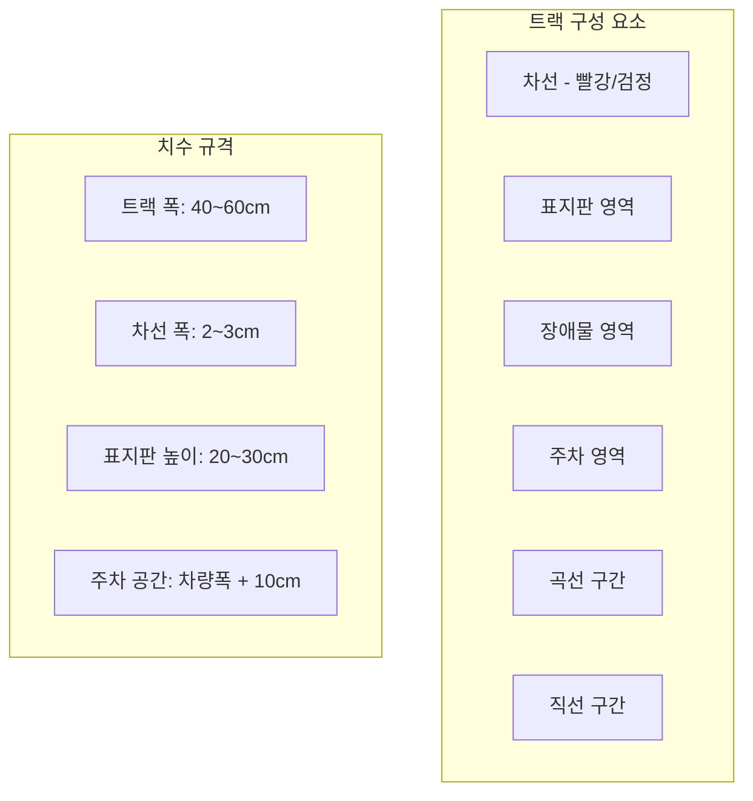

#### 트랙 규칙 상세표

| 구분 | 규격 | 색상 | 용도 | 필수 여부 |
|:---:|:---|:---|:---|:---:|
| **차선 (Lane)** | 폭 2~3cm | 빨강 또는 검정 | 주행 경로 안내 | ⭐⭐⭐⭐⭐ |
| **도로 (Road)** | 폭 40~60cm | 흰색 또는 회색 | 주행 가능 영역 | ⭐⭐⭐⭐⭐ |
| **표지판 (Signs)** | 높이 20~30cm | 컬러 (빨강/파랑) | 미션 트리거 | ⭐⭐⭐⭐ |
| **정지선 (Stop Line)** | 폭 5cm | 노란색 | 정지 위치 표시 | ⭐⭐⭐ |
| **장애물 (Obstacles)** | 높이 10~15cm | 다양 | 회피 미션 | ⭐⭐⭐ |
| **주차 영역 (Parking)** | 차량폭 + 10cm | 파란색 라인 | 주차 미션 | ⭐⭐ |

### 1.2 조명 및 환경 조건

#### 권장 환경 설정

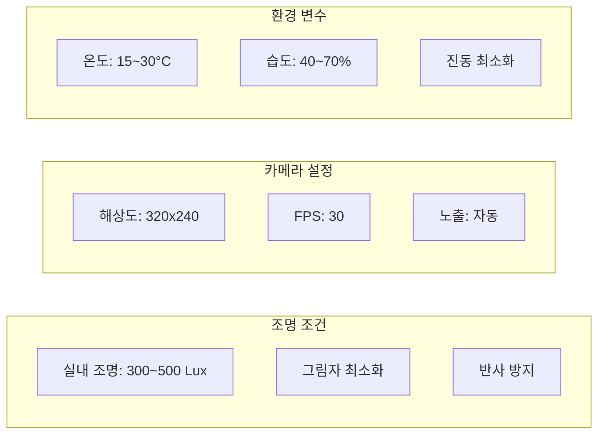

#### 조명 조건별 RGB 가중치 권장값

| 환경 조건 | R_weight | G_weight | B_weight | 설명 |
|:---|:---:|:---:|:---:|:---|
| **밝은 실내 (반사 많음)** | 30 | 40 | 70~80 | Blue 채널 강조로 반사 제거 |
| **일반 실내** | 30 | 40 | 60 | 균형잡힌 기본값 |
| **어두운 실내** | 60 | 40 | 30 | Red 채널 강조로 명암 증가 |
| **야외 (그림자 많음)** | 40 | 50 | 50 | Green 채널 보강 |
| **형광등 아래** | 20 | 30 | 80 | Blue 최대 강조 |

### 1.3 트랙 배치도 예시

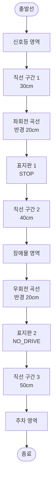

---

## 🏗️ 2. 시스템 아키텍처

### 2.1 Haar Cascade 전용 검출 시스템

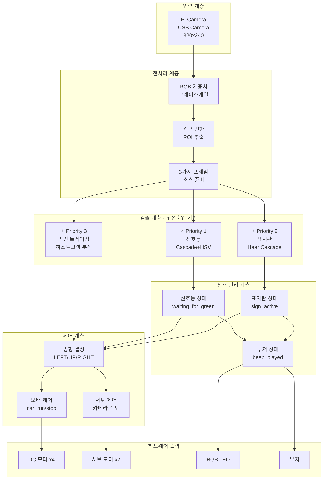

### 2.2 데이터 플로우 (우선순위 기반 처리)

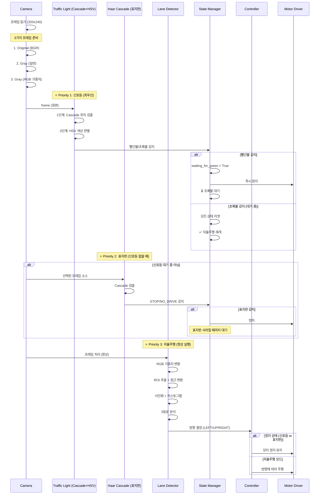

---

## 🔧 3. 모듈별 상세 구현

### 3.1 모듈 1: 카메라 입력 및 전처리

#### 3.1.1 모듈 구조

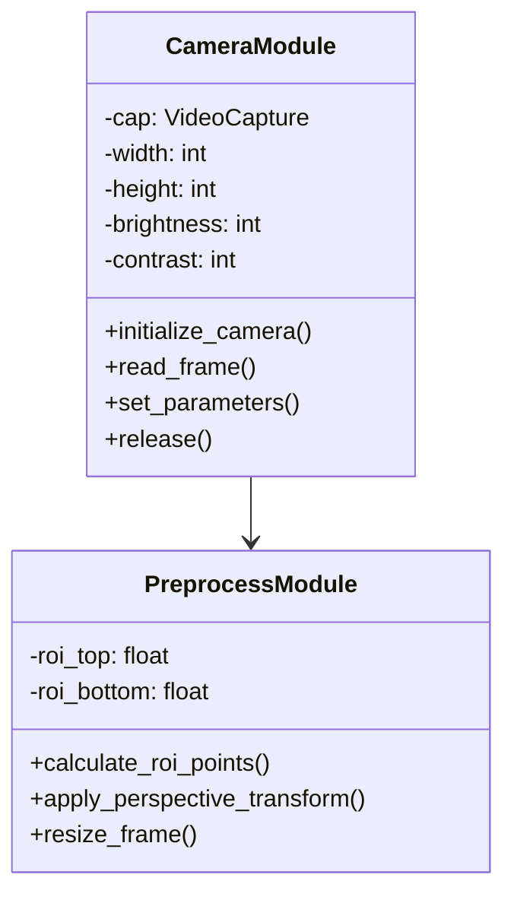

#### 3.1.2 알고리즘 순서도

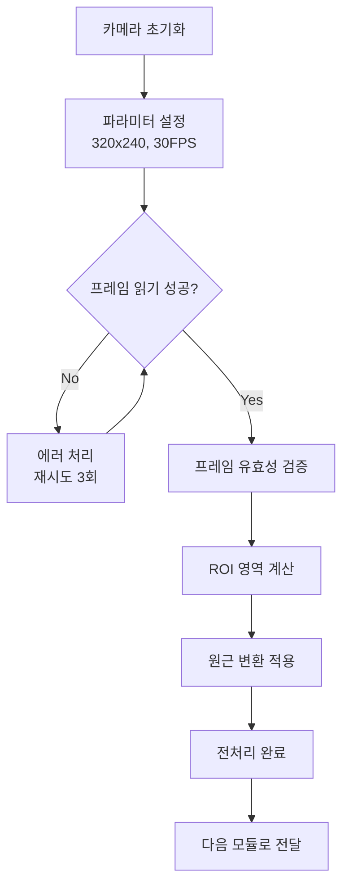

#### 3.1.3 소스 코드 구현

```python
# ========================================
# 모듈 1: 카메라 입력 및 전처리
# ========================================

import cv2
import numpy as np

class CameraModule:
    """카메라 초기화 및 프레임 읽기"""
    
    def __init__(self, width=320, height=240, fps=30):
        """
        초기화
        Args:
            width: 프레임 가로 해상도
            height: 프레임 세로 해상도
            fps: 초당 프레임 수
        """
        self.width = width
        self.height = height
        self.fps = fps
        self.cap = None
        
    def initialize_camera(self, camera_index=0):
        """
        카메라 초기화
        Returns:
            bool: 성공 여부
        """
        try:
            self.cap = cv2.VideoCapture(camera_index)
            
            # 해상도 설정
            self.cap.set(cv2.CAP_PROP_FRAME_WIDTH, self.width)
            self.cap.set(cv2.CAP_PROP_FRAME_HEIGHT, self.height)
            self.cap.set(cv2.CAP_PROP_FPS, self.fps)
            
            # 초기 프레임 읽기 테스트
            ret, frame = self.cap.read()
            if not ret:
                raise Exception("카메라 프레임 읽기 실패")
            
            print(f"✅ 카메라 초기화 성공: {self.width}x{self.height}@{self.fps}fps")
            return True
            
        except Exception as e:
            print(f"❌ 카메라 초기화 실패: {e}")
            return False
    
    def read_frame(self):
        """
        프레임 읽기 (Early Return 패턴)
        Returns:
            frame: 읽은 프레임 또는 None
        """
        # Early Return: 카메라 미초기화
        if self.cap is None:
            print("⚠️ 카메라가 초기화되지 않았습니다")
            return None
        
        ret, frame = self.cap.read()
        
        # Early Return: 프레임 읽기 실패
        if not ret:
            print("⚠️ 프레임 읽기 실패")
            return None
        
        # Early Return: 프레임 유효성 검증
        if frame is None or frame.size == 0:
            print("⚠️ 유효하지 않은 프레임")
            return None
        
        return frame
    
    def set_brightness(self, value):
        """밝기 설정 (0~100)"""
        if self.cap:
            self.cap.set(cv2.CAP_PROP_BRIGHTNESS, value)
    
    def set_contrast(self, value):
        """대비 설정 (0~100)"""
        if self.cap:
            self.cap.set(cv2.CAP_PROP_CONTRAST, value)
    
    def release(self):
        """카메라 해제"""
        if self.cap:
            self.cap.release()
            print("✅ 카메라 해제 완료")


class PreprocessModule:
    """프레임 전처리 (ROI, 원근 변환)"""
    
    def __init__(self, frame_width=320, frame_height=240):
        """
        초기화
        Args:
            frame_width: 프레임 가로 크기
            frame_height: 프레임 세로 크기
        """
        self.frame_width = frame_width
        self.frame_height = frame_height
    
    def calculate_roi_points(self, top_ratio=0.695, bottom_ratio=0.812):
        """
        ROI 좌표 계산
        Args:
            top_ratio: 상단 Y 비율 (0.0 ~ 1.0, ‰ 단위로 695/1000)
            bottom_ratio: 하단 Y 비율
        Returns:
            pts_src: 원본 좌표 (4점)
        """
        width = self.frame_width
        height = self.frame_height
        
        # ROI 4개 모서리 좌표
        pts_src = np.float32([
            [0, height * top_ratio],                # 좌상단
            [width, height * top_ratio],            # 우상단
            [width, height * bottom_ratio],         # 우하단
            [0, height * bottom_ratio]              # 좌하단
        ])
        
        return pts_src
    
    def apply_perspective_transform(self, frame, pts_src):
        """
        원근 변환 적용
        Args:
            frame: 입력 프레임
            pts_src: 원본 4점 좌표
        Returns:
            transformed: 변환된 프레임
        """
        # Early Return: 프레임 검증
        if frame is None:
            return None
        
        width = self.frame_width
        height = self.frame_height
        
        # 목표 좌표 (직사각형)
        pts_dst = np.float32([
            [0, 0],
            [width, 0],
            [width, height],
            [0, height]
        ])
        
        # 변환 행렬 계산
        matrix = cv2.getPerspectiveTransform(pts_src, pts_dst)
        
        # 원근 변환 적용
        transformed = cv2.warpPerspective(
            frame, matrix, (width, height),
            flags=cv2.INTER_LINEAR
        )
        
        return transformed
```

---

### 3.2 모듈 2: RGB 가중치 그레이스케일 변환

#### 3.2.1 알고리즘 원리

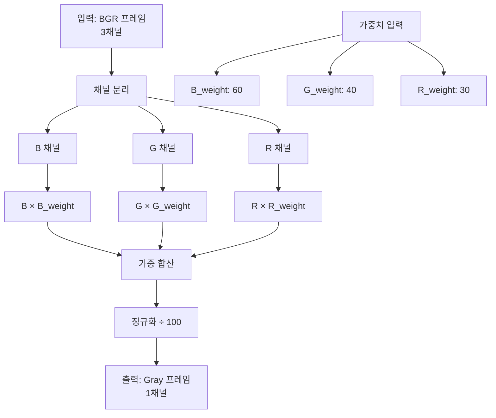

#### 3.2.2 수학적 수식

\[
\text{Gray}(x, y) = \frac{R(x,y) \times W_R + G(x,y) \times W_G + B(x,y) \times W_B}{100}
\]

여기서:
- \( R(x,y), G(x,y), B(x,y) \): 픽셀 \((x, y)\)의 RGB 값 (0~255)
- \( W_R, W_G, W_B \): 가중치 (0~100)
- 제약 조건: \( W_R + W_G + W_B = 100 \) (권장, 필수 아님)

#### 3.2.3 소스 코드 구현

```python
# ========================================
# 모듈 2: RGB 가중치 그레이스케일 변환
# ========================================

def weighted_gray(image, r_weight=30, g_weight=40, b_weight=60):
    """
    RGB 가중치 기반 그레이스케일 변환
    
    목적:
        - 도로 검정색 표면의 빛 반사로 인한 오검출 방지
        - RGB 채널별 가중치를 조정하여 최적의 도로선 감지
        - 환경 조명 변화에 강건한 라인 트레이싱
    
    Args:
        image: 입력 이미지 (BGR, 3채널)
        r_weight: Red 채널 가중치 (0~100)
        g_weight: Green 채널 가중치 (0~100)
        b_weight: Blue 채널 가중치 (0~100)
    
    Returns:
        gray: 그레이스케일 이미지 (1채널, uint8)
    
    권장 설정:
        - 밝은 환경 (빛 반사): R↓(30), G=중간(40), B↑(60-80)
        - 어두운 환경: R↑(60), G=중간(40), B↓(30)
        - 일반 환경: R=30, G=40, B=60
    """
    # Early Return: 입력 검증
    if image is None or image.size == 0:
        print("⚠️ weighted_gray: 유효하지 않은 이미지")
        return None
    
    # Early Return: 채널 수 검증
    if len(image.shape) != 3 or image.shape[2] != 3:
        print(f"⚠️ weighted_gray: 3채널 이미지 필요 (현재: {image.shape})")
        return None
    
    # BGR 채널 분리
    b_channel, g_channel, r_channel = cv2.split(image)
    
    # 정규화된 가중치 계산
    total_weight = r_weight + g_weight + b_weight
    if total_weight == 0:
        total_weight = 100  # 0 방지
    
    # 가중 합산 (float32로 계산하여 overflow 방지)
    gray = (
        r_channel.astype(np.float32) * (r_weight / 100.0) +
        g_channel.astype(np.float32) * (g_weight / 100.0) +
        b_channel.astype(np.float32) * (b_weight / 100.0)
    )
    
    # uint8로 변환 (0~255 범위 클리핑)
    gray = np.clip(gray, 0, 255).astype(np.uint8)
    
    return gray


def test_weighted_gray_effects():
    """가중치별 효과 테스트 함수"""
    test_configs = [
        {"name": "밝은 환경", "r": 30, "g": 40, "b": 70},
        {"name": "일반 환경", "r": 30, "g": 40, "b": 60},
        {"name": "어두운 환경", "r": 60, "g": 40, "b": 30},
    ]
    
    # 테스트 이미지 생성 (도로 반사 시뮬레이션)
    test_image = np.zeros((240, 320, 3), dtype=np.uint8)
    # 도로 (어두움)
    test_image[100:200, :] = [40, 40, 40]
    # 빛 반사 (밝음)
    test_image[120:140, 100:150] = [200, 200, 255]
    
    for config in test_configs:
        gray = weighted_gray(
            test_image,
            r_weight=config["r"],
            g_weight=config["g"],
            b_weight=config["b"]
        )
        print(f"✅ {config['name']}: R={config['r']}, G={config['g']}, B={config['b']}")
        # 반사 영역의 평균 밝기 출력
        reflection_brightness = np.mean(gray[120:140, 100:150])
        print(f"   → 반사 영역 밝기: {reflection_brightness:.1f}")
```

---

### 3.3 모듈 3: 신호등 감지 (Haar Cascade + HSV 2단계)

#### 3.3.1 2단계 신호등 감지 원리

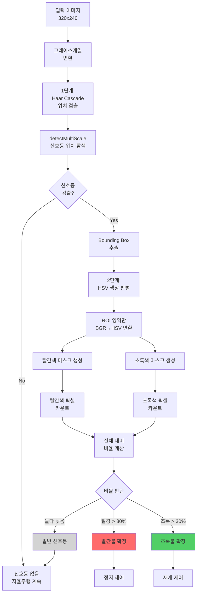

#### 3.3.2 Cascade 파라미터 영향

| 파라미터 | 값 | 효과 | 트레이드오프 |
|:---|:---:|:---|:---|
| **scaleFactor** | 1.1 (권장) | 이미지 피라미드 축소 비율 | ↓ 1.05: 정확하지만 느림<br/>↑ 1.3: 빠르지만 놓칠 수 있음 |
| **minNeighbors** | 5 (권장) | 검출 신뢰도 | ↓ 3: 오탐 증가<br/>↑ 7: 미검출 증가 |
| **minSize** | (30, 30) | 최소 객체 크기 | 작을수록 멀리 감지 |
| **maxSize** | (200, 200) | 최대 객체 크기 | 클수록 근거리 감지 |

#### 3.3.3 HSV 색상 범위 파라미터

| 색상 | H (Hue) | S (Saturation) | V (Value) | 비율 임계값 |
|:---|:---:|:---:|:---:|:---:|
| **빨간색 1** | 0-10 | 100-255 | 100-255 | 30% |
| **빨간색 2** | 170-180 | 100-255 | 100-255 | 30% |
| **초록색** | 40-80 | 50-255 | 50-255 | 30% |

#### 3.3.4 소스 코드 구현

```python
# ========================================
# 모듈 3: 신호등 감지 (Haar Cascade + HSV)
# ========================================

import cv2
import numpy as np

# Cascade 모델 로드 (전역)
traffic_light_cascade = cv2.CascadeClassifier("./xml/traffic_light.xml")

# HSV 색상 범위 정의
HSV_RED_LOWER_1 = np.array([0, 100, 100])      # 빨간색 범위 1
HSV_RED_UPPER_1 = np.array([10, 255, 255])
HSV_RED_LOWER_2 = np.array([170, 100, 100])    # 빨간색 범위 2
HSV_RED_UPPER_2 = np.array([180, 255, 255])
HSV_GREEN_LOWER = np.array([40, 50, 50])       # 초록색 범위
HSV_GREEN_UPPER = np.array([80, 255, 255])

def detect_traffic_lights_cascade_hsv(frame, 
                                      scaleFactor=1.1,
                                      minNeighbors=5,
                                      minSize=(30, 30),
                                      maxSize=(200, 200),
                                      color_ratio_threshold=0.3):
    """
    Haar Cascade + HSV로 신호등 감지 (2단계 방식)
    
    목적:
        1단계: Cascade로 신호등 위치 검출
        2단계: HSV로 빨간불/초록불 색상 판별
    
    Args:
        frame: 입력 프레임 (BGR, 320x240)
        scaleFactor: Cascade 이미지 피라미드 축소 비율
        minNeighbors: Cascade 검출 신뢰도
        minSize: 최소 객체 크기 (픽셀)
        maxSize: 최대 객체 크기 (픽셀)
        color_ratio_threshold: 색상 판별 비율 임계값 (0~1)
    
    Returns:
        red_detected: 빨간불 감지 여부 (bool)
        green_detected: 초록불 감지 여부 (bool)
        annotated_frame: 결과 표시 프레임
        detection_info: 감지 상세 정보 (dict)
    
    권장 설정:
        - scaleFactor: 1.1 (균형), 1.05 (정확), 1.3 (빠름)
        - minNeighbors: 5 (균형), 3 (민감), 7 (엄격)
        - color_ratio_threshold: 0.3 (30%)
    """
    # Early Return: 프레임 검증
    if frame is None or frame.size == 0:
        empty_info = {
            "traffic_light_count": 0,
            "red_count": 0,
            "green_count": 0,
            "positions": [],
        }
        return False, False, frame, empty_info
    
    # 검출 결과 초기화
    red_detected = False
    green_detected = False
    annotated_frame = frame.copy()
    h, w = annotated_frame.shape[:2]
    
    detection_info = {
        "traffic_light_count": 0,
        "red_count": 0,
        "green_count": 0,
        "positions": [],
    }
    
    try:
        # ━━━━━━━━━━━━━━━━━━━━━━━━━━━━━━━━
        # 1단계: Haar Cascade로 신호등 위치 검출
        # ━━━━━━━━━━━━━━━━━━━━━━━━━━━━━━━━
        gray_frame = cv2.cvtColor(frame, cv2.COLOR_BGR2GRAY)
        
        traffic_lights = traffic_light_cascade.detectMultiScale(
            gray_frame,
            scaleFactor=scaleFactor,
            minNeighbors=minNeighbors,
            minSize=minSize,
            maxSize=maxSize
        )
        
        detection_info["traffic_light_count"] = len(traffic_lights)
        
        # Early Return: 신호등 미검출
        if len(traffic_lights) == 0:
            cv2.putText(annotated_frame, "No Traffic Light", (10, 30),
                       cv2.FONT_HERSHEY_SIMPLEX, 0.7, (255, 255, 255), 2)
            return False, False, annotated_frame, detection_info
        
        # ━━━━━━━━━━━━━━━━━━━━━━━━━━━━━━━━
        # 2단계: HSV 색상 판별 (각 검출된 신호등마다)
        # ━━━━━━━━━━━━━━━━━━━━━━━━━━━━━━━━
        for (x, y, w, h) in traffic_lights:
            # ROI 추출
            roi = frame[y:y+h, x:x+w]
            
            # HSV 변환
            hsv_roi = cv2.cvtColor(roi, cv2.COLOR_BGR2HSV)
            total_pixels = w * h
            
            # 빨간색 픽셀 카운트 (2개 범위 OR)
            red_mask_1 = cv2.inRange(hsv_roi, HSV_RED_LOWER_1, HSV_RED_UPPER_1)
            red_mask_2 = cv2.inRange(hsv_roi, HSV_RED_LOWER_2, HSV_RED_UPPER_2)
            red_mask = cv2.bitwise_or(red_mask_1, red_mask_2)
            red_pixels = np.count_nonzero(red_mask)
            red_ratio = red_pixels / total_pixels
            
            # 초록색 픽셀 카운트
            green_mask = cv2.inRange(hsv_roi, HSV_GREEN_LOWER, HSV_GREEN_UPPER)
            green_pixels = np.count_nonzero(green_mask)
            green_ratio = green_pixels / total_pixels
            
            # 색상 판별 로직
            if red_ratio > color_ratio_threshold:
                # ⭐ 빨간불 확정
                red_detected = True
                detection_info["red_count"] += 1
                
                # 빨간색 박스
                cv2.rectangle(annotated_frame, (x, y), (x+w, y+h),
                            (0, 0, 255), 3)
                label = f"RED {red_ratio*100:.1f}%"
                cv2.putText(annotated_frame, label, (x, y - 10),
                          cv2.FONT_HERSHEY_SIMPLEX, 0.6, (0, 0, 255), 2)
                
                detection_info["positions"].append({
                    "x": x, "y": y, "w": w, "h": h,
                    "color": "RED",
                    "red_ratio": red_ratio,
                    "green_ratio": green_ratio
                })
            
            elif green_ratio > color_ratio_threshold:
                # ⭐ 초록불 확정
                green_detected = True
                detection_info["green_count"] += 1
                
                # 초록색 박스
                cv2.rectangle(annotated_frame, (x, y), (x+w, y+h),
                            (0, 255, 0), 3)
                label = f"GREEN {green_ratio*100:.1f}%"
                cv2.putText(annotated_frame, label, (x, y - 10),
                          cv2.FONT_HERSHEY_SIMPLEX, 0.6, (0, 255, 0), 2)
                
                detection_info["positions"].append({
                    "x": x, "y": y, "w": w, "h": h,
                    "color": "GREEN",
                    "red_ratio": red_ratio,
                    "green_ratio": green_ratio
                })
            
            else:
                # 일반 신호등 (색상 불명확)
                cv2.rectangle(annotated_frame, (x, y), (x+w, y+h),
                            (128, 128, 128), 2)
                label = "LIGHT"
                cv2.putText(annotated_frame, label, (x, y - 10),
                          cv2.FONT_HERSHEY_SIMPLEX, 0.5, (128, 128, 128), 2)
                
                detection_info["positions"].append({
                    "x": x, "y": y, "w": w, "h": h,
                    "color": "UNKNOWN",
                    "red_ratio": red_ratio,
                    "green_ratio": green_ratio
                })
    
    except Exception as e:
        print(f"Traffic light detection error: {e}")
    
    # 상태 텍스트 표시
    if red_detected:
        status_text = "TRAFFIC LIGHT: RED - STOP (Cascade+HSV)"
        status_color = (0, 0, 255)
    elif green_detected:
        status_text = "TRAFFIC LIGHT: GREEN - GO (Cascade+HSV)"
        status_color = (0, 255, 0)
    else:
        status_text = "TRAFFIC LIGHT: DETECTED (Cascade+HSV)"
        status_color = (128, 128, 128)
    
    cv2.putText(annotated_frame, status_text, (10, 30),
               cv2.FONT_HERSHEY_SIMPLEX, 0.7, status_color, 2)
    
    # 감지 개수 표시
    info_text = f"Lights: {detection_info['traffic_light_count']} | R={detection_info['red_count']} G={detection_info['green_count']}"
    cv2.putText(annotated_frame, info_text, (10, h - 10),
               cv2.FONT_HERSHEY_SIMPLEX, 0.5, (255, 255, 0), 1)
    
    return red_detected, green_detected, annotated_frame, detection_info


# ━━━━━━━━━━━━━━━━━━━━━━━━━━━━━━━━
# 헬퍼 함수: HSV 색상 범위 조정용
# ━━━━━━━━━━━━━━━━━━━━━━━━━━━━━━━━
def create_hsv_trackbar(window_name="HSV Tuning"):
    """
    HSV 색상 범위 조정용 트랙바 생성
    
    실시간으로 빨간색/초록색 범위를 조정하여
    최적의 파라미터를 찾을 수 있습니다.
    """
    cv2.namedWindow(window_name)
    
    # 빨간색 범위 1
    cv2.createTrackbar("Red1_H_Low", window_name, 0, 180, lambda x: None)
    cv2.createTrackbar("Red1_H_High", window_name, 10, 180, lambda x: None)
    
    # 빨간색 범위 2
    cv2.createTrackbar("Red2_H_Low", window_name, 170, 180, lambda x: None)
    cv2.createTrackbar("Red2_H_High", window_name, 180, 180, lambda x: None)
    
    # 초록색 범위
    cv2.createTrackbar("Green_H_Low", window_name, 40, 180, lambda x: None)
    cv2.createTrackbar("Green_H_High", window_name, 80, 180, lambda x: None)
    
    # 공통 S, V
    cv2.createTrackbar("S_Min", window_name, 50, 255, lambda x: None)
    cv2.createTrackbar("V_Min", window_name, 50, 255, lambda x: None)
    
    print("✅ HSV 조정 트랙바 생성 완료")
```

---

### 3.4 모듈 4: Haar Cascade 표지판 감지 (차순위)

#### 3.4.1 Cascade 동작 원리

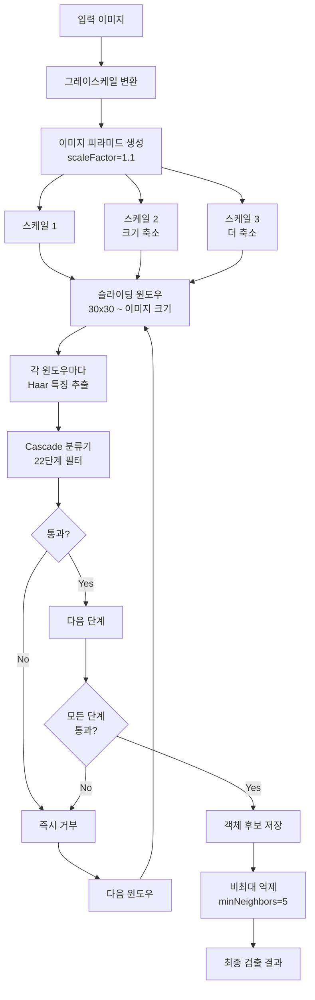

#### 3.4.2 검출 파라미터 영향

| 파라미터 | 값 | 효과 | 트레이드오프 |
|:---|:---:|:---|:---|
| **scaleFactor** | 1.1 (권장) | 이미지 피라미드 축소 비율 | ↓ 1.05: 정확하지만 느림<br/>↑ 1.3: 빠르지만 놓칠 수 있음 |
| **minNeighbors** | 5 (권장) | 검출 신뢰도 (주변 검출 수) | ↓ 3: 오탐 증가<br/>↑ 7: 미검출 증가 |
| **minSize** | (30, 30) | 최소 객체 크기 (픽셀) | ↓ (20, 20): 작은 표지판 감지<br/>↑ (50, 50): 큰 표지판만 |
| **maxSize** | (200, 200) | 최대 객체 크기 | 너무 크면 근거리 놓침 |

#### 3.4.3 소스 코드 구현

```python
# ========================================
# 모듈 4: Haar Cascade 표지판 감지
# ========================================

class SignDetectorModule:
    """Haar Cascade 기반 표지판 감지"""
    
    def __init__(self, stop_xml_path, no_drive_xml_path):
        """
        초기화
        Args:
            stop_xml_path: STOP 표지판 XML 경로
            no_drive_xml_path: NO_DRIVE 표지판 XML 경로
        """
        self.stop_cascade = None
        self.no_drive_cascade = None
        self.load_cascades(stop_xml_path, no_drive_xml_path)
    
    def load_cascades(self, stop_xml, no_drive_xml):
        """
        Cascade 분류기 로드
        """
        try:
            self.stop_cascade = cv2.CascadeClassifier(stop_xml)
            if self.stop_cascade.empty():
                raise Exception(f"STOP Cascade 로드 실패: {stop_xml}")
            print(f"✅ STOP Cascade 로드 성공: {stop_xml}")
            
            self.no_drive_cascade = cv2.CascadeClassifier(no_drive_xml)
            if self.no_drive_cascade.empty():
                raise Exception(f"NO_DRIVE Cascade 로드 실패: {no_drive_xml}")
            print(f"✅ NO_DRIVE Cascade 로드 성공: {no_drive_xml}")
            
        except Exception as e:
            print(f"❌ Cascade 로드 오류: {e}")
            raise
    
    def detect_signs(self, frame, gray_frame=None):
        """
        표지판 감지 (Early Return 패턴)
        
        Args:
            frame: 표시용 컬러 프레임
            gray_frame: 감지용 그레이 프레임 (None이면 자동 변환)
        
        Returns:
            stop_detected: STOP 감지 여부
            no_drive_detected: NO_DRIVE 감지 여부
            annotated_frame: 감지 결과 표시된 프레임
            detection_info: 감지 상세 정보 (dict)
        """
        # Early Return: 프레임 검증
        if frame is None:
            return False, False, None, {}
        
        # 그레이스케일 변환 (제공되지 않은 경우)
        if gray_frame is None:
            if len(frame.shape) == 2:
                gray_frame = frame
            else:
                gray_frame = cv2.cvtColor(frame, cv2.COLOR_BGR2GRAY)
        
        # 감지 결과 초기화
        stop_detected = False
        no_drive_detected = False
        detection_info = {
            "stop_count": 0,
            "no_drive_count": 0,
            "stop_positions": [],
            "no_drive_positions": [],
            "object_position": "NONE"
        }
        
        annotated_frame = frame.copy()
        frame_height, frame_width = frame.shape[:2]
        
        # ━━━━━━━━━━━━━━━━━━━━━━━━━━━━━━━━
        # STOP 표지판 감지
        # ━━━━━━━━━━━━━━━━━━━━━━━━━━━━━━━━
        stop_signs = self.stop_cascade.detectMultiScale(
            gray_frame,
            scaleFactor=1.1,
            minNeighbors=5,
            minSize=(30, 30),
            maxSize=(200, 200)
        )
        
        if len(stop_signs) > 0:
            stop_detected = True
            detection_info["stop_count"] = len(stop_signs)
            
            for (x, y, w, h) in stop_signs:
                # 바운딩 박스 그리기 (빨강)
                cv2.rectangle(
                    annotated_frame,
                    (x, y), (x + w, y + h),
                    (0, 0, 255),  # BGR: 빨강
                    2
                )
                
                # 텍스트 표시
                cv2.putText(
                    annotated_frame,
                    "STOP",
                    (x, y - 10),
                    cv2.FONT_HERSHEY_SIMPLEX,
                    0.7,
                    (0, 0, 255),
                    2
                )
                
                # 중심 좌표 저장
                center_x = x + w // 2
                center_y = y + h // 2
                detection_info["stop_positions"].append((center_x, center_y))
                
                # 위치 분석 (LEFT/CENTER/RIGHT)
                if center_x < frame_width // 3:
                    position = "LEFT"
                elif center_x < 2 * frame_width // 3:
                    position = "CENTER"
                else:
                    position = "RIGHT"
                
                detection_info["object_position"] = position
        
        # ━━━━━━━━━━━━━━━━━━━━━━━━━━━━━━━━
        # NO_DRIVE 표지판 감지
        # ━━━━━━━━━━━━━━━━━━━━━━━━━━━━━━━━
        no_drive_signs = self.no_drive_cascade.detectMultiScale(
            gray_frame,
            scaleFactor=1.1,
            minNeighbors=5,
            minSize=(30, 30),
            maxSize=(200, 200)
        )
        
        if len(no_drive_signs) > 0:
            no_drive_detected = True
            detection_info["no_drive_count"] = len(no_drive_signs)
            
            for (x, y, w, h) in no_drive_signs:
                # 바운딩 박스 그리기 (파랑)
                cv2.rectangle(
                    annotated_frame,
                    (x, y), (x + w, y + h),
                    (255, 0, 0),  # BGR: 파랑
                    2
                )
                
                # 텍스트 표시
                cv2.putText(
                    annotated_frame,
                    "NO_DRIVE",
                    (x, y - 10),
                    cv2.FONT_HERSHEY_SIMPLEX,
                    0.7,
                    (255, 0, 0),
                    2
                )
                
                # 중심 좌표 저장
                center_x = x + w // 2
                center_y = y + h // 2
                detection_info["no_drive_positions"].append((center_x, center_y))
                
                # 위치 분석
                if center_x < frame_width // 3:
                    position = "LEFT"
                elif center_x < 2 * frame_width // 3:
                    position = "CENTER"
                else:
                    position = "RIGHT"
                
                detection_info["object_position"] = position
        
        return stop_detected, no_drive_detected, annotated_frame, detection_info
```

---

### 3.5 모듈 5: 히스토그램 분석 및 방향 결정

#### 3.5.1 히스토그램 3등분 알고리즘

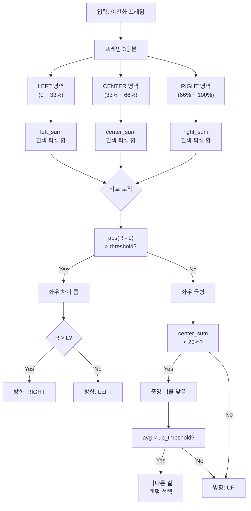

#### 3.5.2 소스 코드 구현

```python
# ========================================
# 모듈 5: 히스토그램 분석 및 방향 결정
# ========================================

class DirectionDeciderModule:
    """히스토그램 기반 방향 결정"""
    
    def __init__(self, frame_width=320):
        """
        초기화
        Args:
            frame_width: 프레임 가로 크기
        """
        self.frame_width = frame_width
        self.last_direction = "UP"  # 마지막 방향 저장
    
    def analyze_histogram(self, binary_frame):
        """
        히스토그램 3등분 분석
        
        Args:
            binary_frame: 이진화 이미지 (0 or 255)
        
        Returns:
            left_sum: 좌측 영역 흰색 픽셀 합
            center_sum: 중앙 영역 흰색 픽셀 합
            right_sum: 우측 영역 흰색 픽셀 합
            avg: 전체 평균
        """
        # Early Return: 프레임 검증
        if binary_frame is None or binary_frame.size == 0:
            return 0, 0, 0, 0
        
        height, width = binary_frame.shape
        
        # 3등분 경계
        left_boundary = width // 3
        right_boundary = 2 * width // 3
        
        # 각 영역 분리
        left_area = binary_frame[:, :left_boundary]
        center_area = binary_frame[:, left_boundary:right_boundary]
        right_area = binary_frame[:, right_boundary:]
        
        # 흰색 픽셀 합산 (255 픽셀)
        left_sum = np.sum(left_area == 255)
        center_sum = np.sum(center_area == 255)
        right_sum = np.sum(right_area == 255)
        
        # 전체 평균
        total_sum = left_sum + center_sum + right_sum
        avg = total_sum / 3.0
        
        return left_sum, center_sum, right_sum, avg
    
    def decide_direction(self, left_sum, center_sum, right_sum, avg,
                        direction_threshold=35000, up_threshold=220000):
        """
        방향 결정 알고리즘
        
        Args:
            left_sum: 좌측 영역 합
            center_sum: 중앙 영역 합
            right_sum: 우측 영역 합
            avg: 전체 평균
            direction_threshold: 좌우 판단 임계값
            up_threshold: 막다른 길 임계값
        
        Returns:
            direction: "LEFT", "UP", "RIGHT"
        """
        # ━━━━━━━━━━━━━━━━━━━━━━━━━━━━━━━━
        # 1단계: 좌우 차이 분석
        # ━━━━━━━━━━━━━━━━━━━━━━━━━━━━━━━━
        diff = abs(right_sum - left_sum)
        
        if diff > direction_threshold:
            # 좌우 차이가 크면 더 큰 쪽으로 회전
            if right_sum > left_sum:
                direction = "RIGHT"
            else:
                direction = "LEFT"
            
            self.last_direction = direction
            return direction
        
        # ━━━━━━━━━━━━━━━━━━━━━━━━━━━━━━━━
        # 2단계: 중앙 비율 분석
        # ━━━━━━━━━━━━━━━━━━━━━━━━━━━━━━━━
        total = left_sum + center_sum + right_sum
        if total > 0:
            center_ratio = center_sum / total
        else:
            center_ratio = 0
        
        # 중앙 비율이 낮으면 곡선 또는 막다른 길
        if center_ratio < 0.2:
            # 막다른 길 판단
            if avg < up_threshold:
                # 랜덤 방향 선택
                direction = random.choice(["LEFT", "RIGHT"])
                print(f"⚠️ 막다른 길 감지! 랜덤 선택: {direction}")
                self.last_direction = direction
                return direction
        
        # ━━━━━━━━━━━━━━━━━━━━━━━━━━━━━━━━
        # 3단계: 기본 직진
        # ━━━━━━━━━━━━━━━━━━━━━━━━━━━━━━━━
        direction = "UP"
        self.last_direction = direction
        return direction
```

---

### 3.6 모듈 6: 차량 제어 (4륜 차동 구동)

#### 3.6.1 차동 구동 제어 맵핑

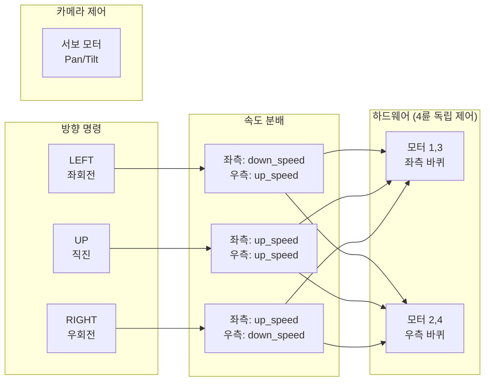

#### 3.6.2 소스 코드 구현

```python
# ========================================
# 모듈 6: 차량 제어 (4륜 차동 구동)
# ========================================

class DifferentialDriveController:
    """
    4륜 차동 구동 제어기
    
    차량 구조:
        - 모터 1,3: 좌측 바퀴
        - 모터 2,4: 우측 바퀴
        - 서보 모터: 카메라 Pan/Tilt (차량 조향 X)
    
    제어 방식:
        - 직진: 모든 바퀴 동일 속도
        - 좌회전: 좌측 느리게, 우측 빠르게
        - 우회전: 좌측 빠르게, 우측 느리게
    """
    
    def __init__(self, raspbot):
        """
        초기화
        Args:
            raspbot: Raspbot 객체
        """
        self.bot = raspbot
        self.motor_enabled = True
        
        # 차동 구동 파라미터
        self.base_speed = 15          # 기본 주행 속도
        self.slow_turn_ratio = 0.5    # 회전 시 느린 바퀴 비율
        self.fast_turn_ratio = 1.0    # 회전 시 빠른 바퀴 비율
    
    def set_motor_speeds(self, m1, m2, m3, m4):
        """
        4개 모터 속도 설정 (하드웨어 직접 제어)
        
        Args:
            m1: 모터1 속도 (좌측 앞) (-255 ~ 255)
            m2: 모터2 속도 (우측 앞) (-255 ~ 255)
            m3: 모터3 속도 (좌측 뒤) (-255 ~ 255)
            m4: 모터4 속도 (우측 뒤) (-255 ~ 255)
        
        Note:
            - 양수: 전진
            - 음수: 후진
            - 0: 정지
        """
        if not self.motor_enabled:
            return
        
        self.bot.Ctrl_Muto(1, m1)
        self.bot.Ctrl_Muto(2, m2)
        self.bot.Ctrl_Muto(3, m3)
        self.bot.Ctrl_Muto(4, m4)
    
    def differential_drive(self, left_speed, right_speed):
        """
        차동 구동 (좌우 속도 차이로 방향 제어)
        
        Args:
            left_speed: 좌측 바퀴 속도
            right_speed: 우측 바퀴 속도
        """
        self.set_motor_speeds(
            left_speed,   # 모터 1 (좌측 앞)
            right_speed,  # 모터 2 (우측 앞)
            left_speed,   # 모터 3 (좌측 뒤)
            right_speed   # 모터 4 (우측 뒤)
        )
    
    def car_stop(self):
        """정지"""
        self.differential_drive(0, 0)
    
    def car_forward(self, speed):
        """직진 (모든 바퀴 동일 속도)"""
        self.differential_drive(speed, speed)
    
    def car_left(self, base_speed):
        """
        좌회전 (차동 구동)
        좌측 바퀴 느리게, 우측 바퀴 빠르게
        """
        left_speed = int(base_speed * self.slow_turn_ratio)
        right_speed = int(base_speed * self.fast_turn_ratio)
        self.differential_drive(left_speed, right_speed)
    
    def car_right(self, base_speed):
        """
        우회전 (차동 구동)
        좌측 바퀴 빠르게, 우측 바퀴 느리게
        """
        left_speed = int(base_speed * self.fast_turn_ratio)
        right_speed = int(base_speed * self.slow_turn_ratio)
        self.differential_drive(left_speed, right_speed)
    
    def car_reverse(self, speed):
        """후진 (모든 바퀴 역방향)"""
        self.differential_drive(-speed, -speed)
    
    def control_car(self, direction, base_speed=15):
        """
        방향에 따른 차량 제어 (차동 구동 방식)
        
        Args:
            direction: "LEFT", "UP", "RIGHT"
            base_speed: 기본 주행 속도
        
        Example:
            - LEFT: 좌측 7.5, 우측 15 (좌회전)
            - UP: 좌측 15, 우측 15 (직진)
            - RIGHT: 좌측 15, 우측 7.5 (우회전)
        """
        if direction == "LEFT":
            self.car_left(base_speed)
        elif direction == "UP":
            self.car_forward(base_speed)
        elif direction == "RIGHT":
            self.car_right(base_speed)
        else:
            self.car_stop()
    
    def set_turn_params(self, slow_ratio=0.5, fast_ratio=1.0):
        """
        회전 파라미터 조정
        
        Args:
            slow_ratio: 느린 바퀴 비율 (0.0 ~ 1.0)
                      - 0.5: 반속도 회전
                      - 0.0: 제자리 회전 (정지)
                      - -0.5: 역방향 회전 (제자리 회전 강화)
            fast_ratio: 빠른 바퀴 비율 (0.8 ~ 1.2)
        """
        self.slow_turn_ratio = slow_ratio
        self.fast_turn_ratio = fast_ratio
        print(f"✅ 회전 파라미터 변경: slow={slow_ratio}, fast={fast_ratio}")
    
    def enable_motor(self, enabled=True):
        """모터 활성화/비활성화"""
        self.motor_enabled = enabled
        if not enabled:
            self.car_stop()


class CameraServoController:
    """
    카메라 서보 모터 제어 (차량 조향과 무관)
    """
    
    def __init__(self, raspbot):
        """
        초기화
        Args:
            raspbot: Raspbot 객체
        """
        self.bot = raspbot
        self.current_pan = 90   # 중앙
        self.current_tilt = 90  # 중앙
    
    def set_pan_angle(self, angle):
        """
        카메라 좌우 각도 조정 (Pan)
        
        Args:
            angle: 0~180도 (90=중앙, <90=좌측, >90=우측)
        """
        angle = max(0, min(180, angle))  # 0~180 제한
        self.bot.Ctrl_Servo(1, angle)    # 서보 1번: Pan
        self.current_pan = angle
    
    def set_tilt_angle(self, angle):
        """
        카메라 상하 각도 조정 (Tilt)
        
        Args:
            angle: 0~180도 (90=중앙, <90=아래, >90=위)
        """
        angle = max(0, min(180, angle))  # 0~180 제한
        self.bot.Ctrl_Servo(2, angle)    # 서보 2번: Tilt
        self.current_tilt = angle
    
    def center_camera(self):
        """카메라 중앙 위치로 복귀"""
        self.set_pan_angle(90)
        self.set_tilt_angle(90)
    
    def look_left(self, degrees=30):
        """카메라 좌측으로 회전"""
        new_pan = self.current_pan - degrees
        self.set_pan_angle(new_pan)
    
    def look_right(self, degrees=30):
        """카메라 우측으로 회전"""
        new_pan = self.current_pan + degrees
        self.set_pan_angle(new_pan)
    
    def look_down(self, degrees=20):
        """카메라 아래로 회전 (도로면 보기)"""
        new_tilt = self.current_tilt - degrees
        self.set_tilt_angle(new_tilt)
    
    def look_up(self, degrees=20):
        """카메라 위로 회전 (신호등 보기)"""
        new_tilt = self.current_tilt + degrees
        self.set_tilt_angle(new_tilt)
```

---

## 🔬 4. 핵심 알고리즘 분석

### 4.1 우선순위 기반 처리 (Haar Cascade 전용)

#### 4.1.1 알고리즘 설명

**3단계 우선순위 시스템**은 신호등(Cascade+HSV)을 **최우선**, 표지판(Cascade)을 **차순위**, 자율주행을 **기본**으로 처리하는 구조입니다.

**주요 특징**:
- ⭐ Priority 1: 신호등 (Cascade+HSV) - 빨간불 시 모든 동작 정지
- ⭐ Priority 2: 표지판 (Haar Cascade) - 신호등 없을 때 작동
- ⭐ Priority 3: 자율주행 (Line Tracing) - 프레임 처리는 항상 실행
- 상태 기반 관리: 각 신호별 부저 1회만 울림
- 초록불 감지 시 모든 정지 상태 즉시 해제

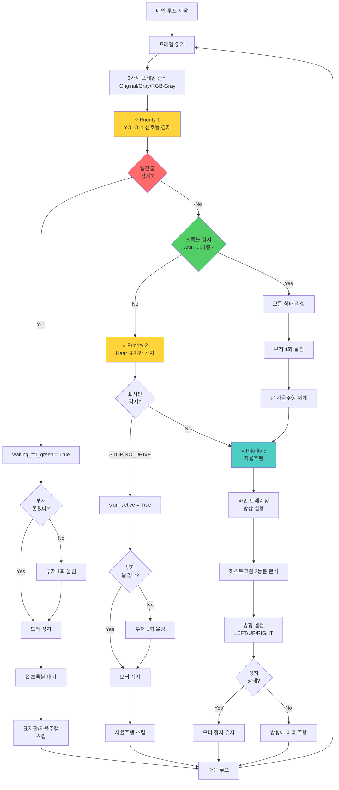

#### 4.1.2 의사 코드 (우선순위 기반)

```python
# 전역 상태 변수
waiting_for_green = False  # 빨간불 후 초록불 대기 중
red_light_active = False
green_light_active = False
stop_sign_active = False
no_drive_sign_active = False

# 부저 상태 (각 신호별 1회만)
red_beep_played = False
green_beep_played = False
stop_beep_played = False
no_drive_beep_played = False

while True:
    # 프레임 읽기
    frame = camera.read_frame()
    
    # 3가지 프레임 소스 준비
    gray_frame = cv2.cvtColor(frame, COLOR_BGR2GRAY)
    gray_rgb_frame = weighted_gray(frame, r_weight, g_weight, b_weight)
    
    # ═══════════════════════════════════════
    # ⭐ Priority 1: 신호등 감지 (Cascade+HSV - 최우선)
    # ═══════════════════════════════════════
    red_detected, green_detected, info = detect_traffic_lights_cascade_hsv(frame)
    
    # 초록불 감지 + 대기 중 → 모든 상태 리셋
    if green_detected and waiting_for_green:
        if not green_beep_played:
            beep()
            green_beep_played = True
        
        # ⭐ 모든 상태 완전 리셋
        waiting_for_green = False
        red_light_active = False
        red_beep_played = False
        stop_sign_active = False
        no_drive_sign_active = False
        print("✅ 초록불 감지 - 자율주행 재개")
    
    # 빨간불 감지 → 정지 상태 진입
    elif red_detected:
        if not red_light_active:
            red_light_active = True
            waiting_for_green = True
            print("🔴 빨간불 감지 - 정지")
        
        if not red_beep_played:
            beep()
            red_beep_played = True
    
    # ═══════════════════════════════════════
    # ⭐ Priority 2: 표지판 감지 (Haar Cascade)
    # ═══════════════════════════════════════
    # 신호등 대기 중이 아닐 때만 표지판 체크
    if not waiting_for_green:
        # 선택된 프레임 소스 사용
        detect_frame = get_detection_frame(frame, gray_frame, gray_rgb_frame, frame_source)
        stop_detected, no_drive_detected, info = detect_traffic_signs(detect_frame)
        
        if stop_detected:
            if not stop_sign_active:
                stop_sign_active = True
                print("🛑 STOP 표지판 감지")
            
            if not stop_beep_played:
                beep()
                stop_beep_played = True
            
            car_stop()
        else:
            if stop_sign_active:
                stop_sign_active = False
                stop_beep_played = False
                print("✅ STOP 표지판 사라짐")
        
        if no_drive_detected:
            if not no_drive_sign_active:
                no_drive_sign_active = True
                print("🚫 NO DRIVE 표지판 감지")
            
            if not no_drive_beep_played:
                beep()
                no_drive_beep_played = True
            
            car_stop()
        else:
            if no_drive_sign_active:
                no_drive_sign_active = False
                no_drive_beep_played = False
                print("✅ NO DRIVE 표지판 사라짐")
    
    # ═══════════════════════════════════════
    # ⭐ Priority 3: 자율주행 (항상 프레임 처리)
    # ═══════════════════════════════════════
    # 프레임 처리는 항상 실행 (정지 중에도)
    binary_frame = process_frame(frame)
    left, center, right, avg = analyze_histogram(binary_frame)
    direction = decide_direction(left, center, right, avg)
    
    # 차량 제어 (정지 상태면 모터 정지 유지)
    if waiting_for_green:
        car_stop()
        print("⏸️ 신호등 대기 중 - 모터 정지")
    elif stop_sign_active or no_drive_sign_active:
        car_stop()
        print("⏸️ 표지판 대기 중 - 모터 정지")
    else:
        control_car(direction, up_speed, down_speed)
```

---

### 4.2 반응 모드 알고리즘

#### 4.2.1 모드별 상태 다이어그램

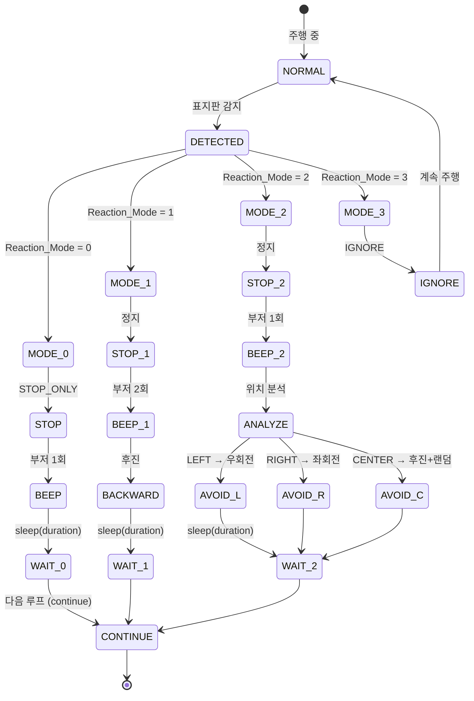

---

## 📝 5. 소스 코드 구현 예제

### 5.1 메인 루프 통합 코드 (Haar Cascade 전용)

```python
# ========================================
# 메인 실행 코드 (v2.0 - Haar Cascade 전용)
# ========================================

def main():
    """메인 실행 함수 - Haar Cascade 전용 시스템"""
    
    # ══════════════════════════════════════
    # 1단계: 초기화
    # ══════════════════════════════════════
    print("=" * 50)
    print("  Raspbot v2 자율주행 시스템 시작 (v2.0)")
    print("  Haar Cascade 전용 시스템")
    print("=" * 50)
    
    # Raspbot 초기화
    from Raspbot_Lib import Raspbot
    bot = Raspbot()
    
    # ⭐ 차동 구동 제어기 초기화
    motor_control = DifferentialDriveController(bot)
    motor_control.set_turn_params(slow_ratio=0.5, fast_ratio=1.0)
    print("✅ 차동 구동 제어기 초기화 완료")
    
    # ⭐ 카메라 서보 제어기 초기화
    camera_servo = CameraServoController(bot)
    camera_servo.center_camera()
    print("✅ 카메라 서보 제어기 초기화 완료")
    
    # ⭐ Haar Cascade 모델 로드 (신호등)
    traffic_light_cascade = cv2.CascadeClassifier("./xml/traffic_light.xml")
    if traffic_light_cascade.empty():
        raise Exception("신호등 Cascade 로드 실패")
    print("✅ Haar Cascade 신호등 모델 로드 완료")
    
    # ⭐ Haar Cascade 모델 로드 (표지판)
    stop_cascade = cv2.CascadeClassifier("./xml/stop_sign.xml")
    no_drive_cascade = cv2.CascadeClassifier("./xml/no_drive_sign.xml")
    print("✅ Haar Cascade 표지판 모델 로드 완료")
    
    # 카메라 초기화
    cap = initialize_camera(width=320, height=240)
    
    # 파라미터 설정
    params = {
        # RGB 가중치
        "r_weight": 30,
        "g_weight": 40,
        "b_weight": 60,
        # 라인 트레이싱
        "detect_value": 120,
        "direction_threshold": 35000,
        "up_threshold": 220000,
        # 차동 구동 제어
        "base_speed": 15,              # 기본 주행 속도
        "slow_turn_ratio": 0.5,        # 회전 시 느린 바퀴 비율
        "fast_turn_ratio": 1.0,        # 회전 시 빠른 바퀴 비율
        # Cascade 신호등 파라미터
        "traffic_scaleFactor": 1.1,
        "traffic_minNeighbors": 5,
        "traffic_minSize": (30, 30),
        "traffic_maxSize": (200, 200),
        # HSV 색상 임계값
        "color_ratio_threshold": 0.3,  # 30%
        "detect_frame_source": 0, # 0=Original, 1=Gray, 2=RGB-Gray
    }
    
    # ⭐ 상태 변수 초기화
    waiting_for_green = False
    red_light_active = False
    green_light_active = False
    stop_sign_active = False
    no_drive_sign_active = False
    
    red_beep_played = False
    green_beep_played = False
    stop_beep_played = False
    no_drive_beep_played = False
    
    print("✅ 모든 모듈 초기화 완료")
    print("⭐ Priority 1: Traffic Light (Cascade+HSV)")
    print("⭐ Priority 2: Traffic Sign (Haar Cascade)")
    print("⭐ Priority 3: Auto Driving (Line Tracing)\n")
    
    # ══════════════════════════════════════
    # 2단계: 메인 루프 (우선순위 기반 처리)
    # ══════════════════════════════════════
    try:
        while True:
            # ─────────────────────────────────
            # 프레임 읽기 및 전처리
            # ─────────────────────────────────
            ret, frame = cap.read()
            if not ret:
                print("⚠️ 프레임 읽기 실패")
                continue
            
            # 3가지 프레임 소스 준비
            gray_frame = cv2.cvtColor(frame, cv2.COLOR_BGR2GRAY)
            gray_rgb_frame = weighted_gray(
                frame,
                params["r_weight"],
                params["g_weight"],
                params["b_weight"]
            )
            
            # ═════════════════════════════════════════════════
            # ⭐ Priority 1: 신호등 감지 (Cascade+HSV - 최우선)
            # ═════════════════════════════════════════════════
            red_detected, green_detected, traffic_frame, traffic_info = \
                detect_traffic_lights_cascade_hsv(
                    frame,
                    params["traffic_scaleFactor"],
                    params["traffic_minNeighbors"],
                    params["traffic_minSize"],
                    params["traffic_maxSize"],
                    params["color_ratio_threshold"]
                )
            
            cv2.imshow("5_Traffic_Light_Cascade_HSV", traffic_frame)
            
            # === 초록불 처리: 모든 상태 리셋 ===
            if green_detected and waiting_for_green:
                if not green_beep_played:
                    bot.Ctrl_BEEP_Switch(1)
                    time.sleep(0.1)
                    bot.Ctrl_BEEP_Switch(0)
                    green_beep_played = True
                    print("🟢 초록불 감지 - 자율주행 재개")
                
                # ⭐ 모든 상태 완전 리셋
                waiting_for_green = False
                red_light_active = False
                red_beep_played = False
                stop_sign_active = False
                no_drive_sign_active = False
            
            # === 빨간불 처리: 정지 상태 진입 ===
            elif red_detected:
                if not red_light_active:
                    red_light_active = True
                    waiting_for_green = True
                    print("🔴 빨간불 감지 - 모터 정지")
                
                if not red_beep_played:
                    bot.Ctrl_BEEP_Switch(1)
                    time.sleep(0.1)
                    bot.Ctrl_BEEP_Switch(0)
                    red_beep_played = True
            
            # ═════════════════════════════════════════════════
            # ⭐ Priority 2: 표지판 감지 (Haar - 신호등 없을 때)
            # ═════════════════════════════════════════════════
            if not waiting_for_green:
                # 선택된 프레임 소스 사용
                detect_frame = get_detection_frame(
                    frame, gray_frame, gray_rgb_frame,
                    params["detect_frame_source"]
                )
                
                stop_detected, no_drive_detected, sign_frame, sign_info = \
                    detect_traffic_signs(
                        detect_frame, detect_frame,
                        params["r_weight"],
                        params["g_weight"],
                        params["b_weight"],
                        params["detect_frame_source"]
                    )
                
                cv2.imshow("6_Sign_Detection", sign_frame)
                
                # === STOP 표지판 처리 ===
                if stop_detected:
                    if not stop_sign_active:
                        stop_sign_active = True
                        print(f"🛑 STOP 표지판 감지! 위치: {sign_info['object_position']}")
                    
                    if not stop_beep_played:
                        bot.Ctrl_BEEP_Switch(1)
                        time.sleep(0.1)
                        bot.Ctrl_BEEP_Switch(0)
                        stop_beep_played = True
                    
                    car_stop()
                else:
                    if stop_sign_active:
                        stop_sign_active = False
                        stop_beep_played = False
                        print("✅ STOP 표지판 사라짐")
                
                # === NO DRIVE 표지판 처리 ===
                if no_drive_detected:
                    if not no_drive_sign_active:
                        no_drive_sign_active = True
                        print(f"🚫 NO DRIVE 표지판 감지! 위치: {sign_info['object_position']}")
                    
                    if not no_drive_beep_played:
                        bot.Ctrl_BEEP_Switch(1)
                        time.sleep(0.1)
                        bot.Ctrl_BEEP_Switch(0)
                        no_drive_beep_played = True
                    
                    car_stop()
                else:
                    if no_drive_sign_active:
                        no_drive_sign_active = False
                        no_drive_beep_played = False
                        print("✅ NO DRIVE 표지판 사라짐")
            
            # ═════════════════════════════════════════════════
            # ⭐ Priority 3: 자율주행 (항상 프레임 처리)
            # ═════════════════════════════════════════════════
            binary_frame = process_frame(
                frame,
                params["detect_value"],
                params["roi_top_y"],
                params["roi_bottom_y"],
                params["r_weight"],
                params["g_weight"],
                params["b_weight"]
            )
            
            histogram = np.sum(binary_frame, axis=0)
            direction, hist_left, hist_center, hist_right = decide_direction(
                histogram,
                params["direction_threshold"],
                params["up_threshold"],
                params["detect_value"],
                params["roi_top_y"],
                params["roi_bottom_y"]
            )
            
            # 차량 제어 (정지 상태 체크)
            if waiting_for_green:
                motor_control.car_stop()
                print("⏸️ 신호등 대기 중")
            elif stop_sign_active or no_drive_sign_active:
                motor_control.car_stop()
                print("⏸️ 표지판 대기 중")
            else:
                # 차동 구동 제어
                motor_control.control_car(direction, params["base_speed"])
            
            # 화면 표시
            processed_frame_visual = visualize_direction_on_frame(
                binary_frame, direction,
                hist_left, hist_center, hist_right,
                (params["r_weight"], params["g_weight"], params["b_weight"]),
                traffic_light_stop=waiting_for_green,
                sign_stop=(stop_sign_active or no_drive_sign_active)
            )
            cv2.imshow("4_Processed Frame", processed_frame_visual)
            
            # 키 입력 처리
            key = cv2.waitKey(1)
            if key == 27:  # ESC
                break
            elif key == ord(' '):  # SPACE: 모터 토글
                motor_enabled = not motor_enabled
                print(f"모터: {'ON' if motor_enabled else 'OFF'}")
    
    except KeyboardInterrupt:
        print("\n⚠️ 사용자 중단")
    
    finally:
        # ══════════════════════════════════════
        # 3단계: 정리
        # ══════════════════════════════════════
        print("\n정리 중...")
        motor_control.car_stop()
        camera.release()
        cv2.destroyAllWindows()
        print("✅ 프로그램 종료")


def react_to_detection(detection_info, reaction_mode, duration,
                      up_speed, down_speed, motor_control, bot):
    """
    표지판 감지 시 반응 함수
    
    Args:
        detection_info: 감지 정보 dict
        reaction_mode: 반응 모드 (0~3)
        duration: 반응 시간 (× 0.1초)
        up_speed: 전진 속도
        down_speed: 회전 속도
        motor_control: MotorControlModule 객체
        bot: Raspbot 객체
    
    Returns:
        action: 수행한 동작 문자열
    """
    reaction_time = duration / 10.0
    object_position = detection_info.get("object_position", "NONE")
    
    # ━━━━━━━━━━━━━━━━━━━━━━━━━━━━━━━━
    # 모드 0: STOP_ONLY (정지만)
    # ━━━━━━━━━━━━━━━━━━━━━━━━━━━━━━━━
    if reaction_mode == 0:
        motor_control.car_stop()
        
        # 부저 1회
        bot.Ctrl_BEEP_Switch(1)
        time.sleep(0.3)
        bot.Ctrl_BEEP_Switch(0)
        
        # 대기
        time.sleep(reaction_time)
        return "STOP_ONLY"
    
    # ━━━━━━━━━━━━━━━━━━━━━━━━━━━━━━━━
    # 모드 1: REVERSE (후진)
    # ━━━━━━━━━━━━━━━━━━━━━━━━━━━━━━━━
    elif reaction_mode == 1:
        motor_control.car_stop()
        
        # 부저 2회
        for _ in range(2):
            bot.Ctrl_BEEP_Switch(1)
            time.sleep(0.15)
            bot.Ctrl_BEEP_Switch(0)
            time.sleep(0.1)
        
        # 후진
        motor_control.car_reverse(down_speed)
        time.sleep(reaction_time)
        motor_control.car_stop()
        return "REVERSE"
    
    # ━━━━━━━━━━━━━━━━━━━━━━━━━━━━━━━━
    # 모드 2: AVOID (회피)
    # ━━━━━━━━━━━━━━━━━━━━━━━━━━━━━━━━
    elif reaction_mode == 2:
        motor_control.car_stop()
        
        # 부저 1회
        bot.Ctrl_BEEP_Switch(1)
        time.sleep(0.3)
        bot.Ctrl_BEEP_Switch(0)
        
        # 위치 기반 회피
        if object_position == "LEFT":
            motor_control.car_right(up_speed, down_speed)
            print("   → 우회전 회피")
        elif object_position == "RIGHT":
            motor_control.car_left(down_speed, up_speed)
            print("   → 좌회전 회피")
        elif object_position == "CENTER":
            # 후진 후 랜덤
            motor_control.car_reverse(down_speed)
            time.sleep(reaction_time / 2)
            if random.choice([True, False]):
                motor_control.car_left(down_speed, up_speed)
                print("   → 후진 + 좌회전")
            else:
                motor_control.car_right(up_speed, down_speed)
                print("   → 후진 + 우회전")
        
        time.sleep(reaction_time)
        motor_control.car_stop()
        return "AVOID"
    
    # ━━━━━━━━━━━━━━━━━━━━━━━━━━━━━━━━
    # 모드 3: IGNORE (무시)
    # ━━━━━━━━━━━━━━━━━━━━━━━━━━━━━━━━
    elif reaction_mode == 3:
        return "IGNORE"
    
    return "UNKNOWN"


if __name__ == "__main__":
    main()
```

---

## 🎓 6. XML 파일 학습 및 적용

### 6.1 Haar Cascade 학습 프로세스

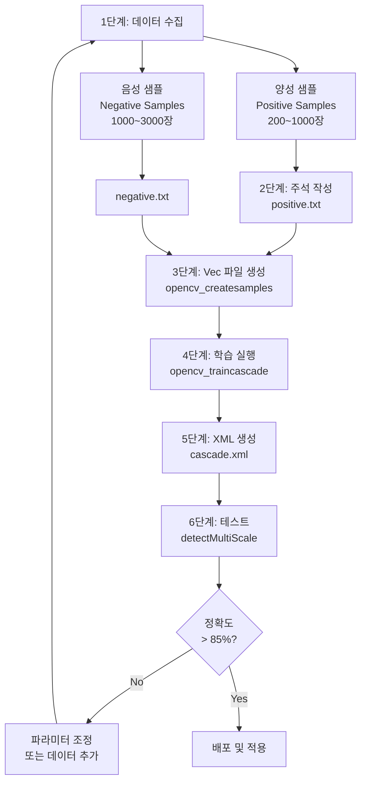

### 6.2 양성 샘플 수집 가이드

#### 수집 규칙

| 항목 | 규칙 | 이유 |
|:---|:---|:---|
| **최소 개수** | 200장 이상 | 학습 안정성 확보 |
| **권장 개수** | 500~1000장 | 일반화 성능 향상 |
| **크기** | 24x24 ~ 100x100 | Cascade 입력 크기 고려 |
| **배경** | 다양한 배경 | Overfitting 방지 |
| **각도** | ±30도 회전 | 실제 환경 시뮬레이션 |
| **조명** | 밝음/보통/어두움 | 조명 강건성 |
| **거리** | 근거리~원거리 | 스케일 불변성 |

#### 예시 디렉토리 구조

```
cascade_training/
├── positive/                    # 양성 샘플
│   ├── stop_001.jpg
│   ├── stop_002.jpg
│   └── ... (200~1000장)
├── negative/                    # 음성 샘플
│   ├── road_001.jpg
│   ├── road_002.jpg
│   └── ... (1000~3000장)
├── positive.txt                 # 양성 목록
├── negative.txt                 # 음성 목록
└── data/                        # 학습 결과
    ├── cascade.xml              # 최종 모델
    └── stage*.xml               # 중간 단계
```

### 6.3 학습 명령어

```bash
# 1단계: Vec 파일 생성
opencv_createsamples \
    -info positive.txt \
    -vec samples.vec \
    -num 500 \
    -w 24 \
    -h 24

# 2단계: Cascade 학습
opencv_traincascade \
    -data data/ \
    -vec samples.vec \
    -bg negative.txt \
    -numPos 400 \
    -numNeg 2000 \
    -numStages 20 \
    -w 24 \
    -h 24 \
    -featureType HAAR \
    -mode ALL
```

### 6.4 학습 파라미터 설정

| 파라미터 | 권장값 | 설명 | 영향 |
|:---|:---:|:---|:---|
| `-numPos` | 샘플의 80% | 학습에 사용할 양성 샘플 수 | ↑ 정확도 ↑ 시간 |
| `-numNeg` | Pos의 2~5배 | 학습에 사용할 음성 샘플 수 | ↑ 오탐 감소 |
| `-numStages` | 15~25 | Cascade 단계 수 | ↑ 정확도 ↑ 시간 |
| `-minHitRate` | 0.995 | 각 단계 최소 검출률 | ↑ 미검출 감소 |
| `-maxFalseAlarmRate` | 0.5 | 각 단계 최대 오탐률 | ↓ 오탐 감소 |
| `-w`, `-h` | 24 x 24 | 샘플 크기 | ↑ 상세도 ↑ 시간 |

---

## 🐛 7. 디버깅 및 튜닝

### 7.1 문제 해결 플로우차트

```mermaid
flowchart TD
    START([문제 발생]) --> TYPE{문제 유형?}
    
    TYPE -->|표지판 미검출| P1[1. 표지판 감지 문제]
    TYPE -->|오탐 많음| P2[2. 오탐지 문제]
    TYPE -->|차선 이탈| P3[3. 주행 문제]
    TYPE -->|느린 속도| P4[4. 성능 문제]
    
    P1 --> P1_1{조명 확인}
    P1_1 -->|어두움| P1_A[B_weight 감소<br/>R_weight 증가]
    P1_1 -->|밝음| P1_B[B_weight 증가<br/>70~80]
    P1_1 -->|정상| P1_C{minNeighbors}
    P1_C -->|너무 높음| P1_D[minNeighbors 감소<br/>3~5로 설정]
    
    P2 --> P2_1{minNeighbors 확인}
    P2_1 -->|너무 낮음| P2_A[minNeighbors 증가<br/>7~10으로 설정]
    P2_1 -->|정상| P2_B{XML 품질}
    P2_B -->|불량| P2_C[재학습<br/>더 많은 데이터]
    
    P3 --> P3_1{방향 임계값}
    P3_1 -->|부적절| P3_A[direction_threshold 조정<br/>30000~40000]
    P3_1 -->|정상| P3_B{모터 속도}
    P3_B -->|너무 빠름| P3_C[up_speed 감소<br/>10~15]
    
    P4 --> P4_1[Detect_Frame_Source 변경]
    P4_1 --> P4_2[0 → 1 (Transformed)]
    P4_2 --> P4_3[minSize 증가<br/>40~50]
```

### 7.2 트러블슈팅 표

| 증상 | 원인 | 해결 방법 | 우선순위 |
|:---|:---|:---|:---:|
| **표지판 전혀 미검출** | XML 파일 경로 오류 | 경로 확인, 절대 경로 사용 | ⭐⭐⭐⭐⭐ |
| 밝은 곳에서 미검출 | RGB 가중치 부적절 | B_weight ↑ (70~80) | ⭐⭐⭐⭐ |
| 어두운 곳에서 미검출 | RGB 가중치 부적절 | R_weight ↑ (60), B ↓ (30) | ⭐⭐⭐⭐ |
| 표지판 있는데 미검출 | minNeighbors 너무 높음 | 5 → 3으로 감소 | ⭐⭐⭐⭐ |
| 없는데 오탐지 | minNeighbors 너무 낮음 | 3 → 7로 증가 | ⭐⭐⭐⭐ |
| 차선 이탈 반복 | 방향 임계값 부적절 | direction_threshold 조정 | ⭐⭐⭐ |
| 곡선에서 이탈 | up_threshold 너무 높음 | 220000 → 180000 | ⭐⭐⭐ |
| 속도 너무 느림 | FPS 낮음 | minSize 증가, scaleFactor 증가 | ⭐⭐ |
| 부저 안울림 | GPIO 연결 오류 | 하드웨어 확인 | ⭐⭐ |
| LED 안켜짐 | WS2812 초기화 오류 | 드라이버 재초기화 | ⭐ |

### 7.3 성능 최적화 체크리스트

#### 감지 성능 최적화

- [ ] **프레임 소스 최적화**
  - Detect_Frame_Source = 1 (Transformed) 사용
  - 전체 프레임 대신 ROI만 처리
  
- [ ] **Cascade 파라미터 조정**
  - scaleFactor: 1.1 → 1.15 (속도 ↑, 정확도 ↓)
  - minSize: (30, 30) → (40, 40) (속도 ↑)
  
- [ ] **RGB 가중치 고정**
  - 환경 확정 후 트랙바 대신 상수 사용
  
#### 주행 성능 최적화

- [ ] **모터 속도 튜닝**
  - up_speed: 직선 구간에서 테스트하여 최적값 찾기
  - down_speed: 곡선 구간에서 조정
  
- [ ] **방향 임계값 조정**
  - direction_threshold: 좌우 균형 맞추기
  - up_threshold: 막다른 길 감도 조정
  
- [ ] **PID 제어 도입 (고급)**
  - 현재: On/Off 제어
  - 개선: PID 제어로 부드러운 주행

---

## ✅ 8. 구현 체크리스트

### 8.1 필수 구현 항목

#### 하드웨어

- [ ] 라즈베리 파이 정상 동작
- [ ] 카메라 연결 및 테스트 (`raspistill -o test.jpg`)
- [ ] **4개 모터** 드라이버 연결 및 방향 확인
  - [ ] 모터 1 (좌측 앞) 정방향 테스트
  - [ ] 모터 2 (우측 앞) 정방향 테스트
  - [ ] 모터 3 (좌측 뒤) 정방향 테스트
  - [ ] 모터 4 (우측 뒤) 정방향 테스트
- [ ] **차동 구동 테스트**
  - [ ] 직진: 모든 바퀴 동일 속도
  - [ ] 좌회전: 좌측 느림, 우측 빠름
  - [ ] 우회전: 좌측 빠름, 우측 느림
- [ ] 서보 모터 카메라 Pan/Tilt 동작 확인
- [ ] 부저 동작 확인
- [ ] LED 동작 확인 (선택)

#### 소프트웨어

- [ ] OpenCV 설치 (`pip3 install opencv-python`)
- [ ] Raspbot 라이브러리 경로 설정
- [ ] XML 파일 준비 (stop.xml, no_drive.xml)
- [ ] 트랙바 윈도우 생성 및 초기값 설정
- [ ] 카메라 해상도 설정 (320x240)

#### 알고리즘

- [ ] RGB 가중치 그레이스케일 구현
- [ ] Haar Cascade 로드 및 감지 테스트
- [ ] Early If 패턴 적용
- [ ] 히스토그램 3등분 분석
- [ ] 방향 결정 로직
- [ ] 반응 모드 4가지 구현

### 8.2 테스트 시나리오

#### 기능 테스트

1. **표지판 감지 테스트**
   - [ ] STOP 표지판 10회 감지 성공
   - [ ] NO_DRIVE 표지판 10회 감지 성공
   - [ ] 오탐지율 < 15%
   
2. **반응 모드 테스트**
   - [ ] 모드 0: 정지 후 3초 대기
   - [ ] 모드 1: 정지 후 후진
   - [ ] 모드 2: 위치 기반 회피
   - [ ] 모드 3: 무시하고 주행
   
3. **주행 테스트**
   - [ ] 직선 구간 3회 연속 성공
   - [ ] 좌회전 곡선 3회 연속 성공
   - [ ] 우회전 곡선 3회 연속 성공
   - [ ] 전체 코스 1회 완주

#### 환경별 테스트

- [ ] 밝은 조명 (RGB: 30, 40, 70)
- [ ] 일반 조명 (RGB: 30, 40, 60)
- [ ] 어두운 조명 (RGB: 60, 40, 30)

---

## 📝 9. 주차 시스템 구현 (O, X 표시 인식)

### 9.1 주차 표시 감지 모듈 (Haar Cascade)

#### 9.1.1 알고리즘 순서도

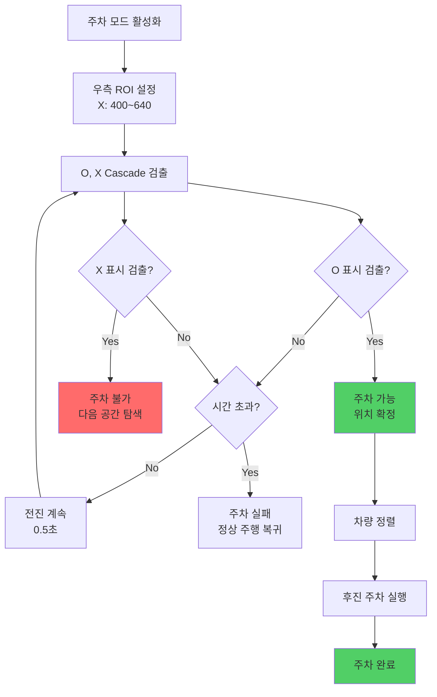

#### 9.1.2 소스 코드 구현

```python
# ========================================
# 모듈 7: 주차 표시 감지 (O, X Cascade)
# ========================================

import cv2
import numpy as np
import time

# Cascade 모델 로드
parking_o_cascade = cv2.CascadeClassifier("./xml/parking_o.xml")
parking_x_cascade = cv2.CascadeClassifier("./xml/parking_x.xml")

class ParkingSpotDetector:
    """
    O, X 표시 기반 주차 공간 감지기
    
    목적:
        - O 표시: 주차 가능 공간 인식
        - X 표시: 주차 불가 공간 인식
        - Haar Cascade로 실시간 검출
    """
    
    def __init__(self, o_xml_path, x_xml_path):
        """
        초기화
        Args:
            o_xml_path: O 표시 Cascade XML 경로
            x_xml_path: X 표시 Cascade XML 경로
        """
        self.o_cascade = cv2.CascadeClassifier(o_xml_path)
        self.x_cascade = cv2.CascadeClassifier(x_xml_path)
        
        # 검증
        if self.o_cascade.empty():
            raise Exception(f"O Cascade 로드 실패: {o_xml_path}")
        if self.x_cascade.empty():
            raise Exception(f"X Cascade 로드 실패: {x_xml_path}")
        
        print("✅ 주차 표시 Cascade 로드 완료")
        
        # 주차 상태 변수
        self.parking_mode_active = False
        self.parking_spot_found = False
        self.search_start_time = None
        self.search_timeout = 10.0  # 10초
    
    def detect_parking_signs(self, frame, roi_x_start=400):
        """
        O, X 표시 감지
        
        Args:
            frame: 입력 프레임 (BGR, 320x240)
            roi_x_start: ROI 시작 X 좌표 (우측 영역)
        
        Returns:
            o_detected: O 표시 감지 여부 (bool)
            x_detected: X 표시 감지 여부 (bool)
            o_position: O 표시 위치 (x, y, w, h) 또는 None
            x_position: X 표시 위치 (x, y, w, h) 또는 None
            annotated_frame: 결과 표시 프레임
        """
        # Early Return: 프레임 검증
        if frame is None or frame.size == 0:
            return False, False, None, None, frame
        
        h, w = frame.shape[:2]
        annotated_frame = frame.copy()
        
        # ROI 추출 (우측 영역)
        roi = frame[:, roi_x_start:]
        gray_roi = cv2.cvtColor(roi, cv2.COLOR_BGR2GRAY)
        
        # ━━━━━━━━━━━━━━━━━━━━━━━━━━━━━━━━
        # O 표시 검출 (주차 가능)
        # ━━━━━━━━━━━━━━━━━━━━━━━━━━━━━━━━
        o_signs = self.o_cascade.detectMultiScale(
            gray_roi,
            scaleFactor=1.2,
            minNeighbors=3,
            minSize=(40, 40),
            maxSize=(150, 150)
        )
        
        o_detected = False
        o_position = None
        
        if len(o_signs) > 0:
            # 가장 큰 O 표시 선택
            areas = [w * h for (x, y, w, h) in o_signs]
            max_idx = np.argmax(areas)
            x, y, w_sign, h_sign = o_signs[max_idx]
            
            # 크기 필터링 (2000~10000 px²)
            area = w_sign * h_sign
            if 2000 < area < 10000:
                o_detected = True
                # ROI 좌표를 전체 프레임 좌표로 변환
                x_global = x + roi_x_start
                o_position = (x_global, y, w_sign, h_sign)
                
                # 초록색 박스
                cv2.rectangle(
                    annotated_frame,
                    (x_global, y),
                    (x_global + w_sign, y + h_sign),
                    (0, 255, 0),  # 초록색
                    3
                )
                cv2.putText(
                    annotated_frame,
                    "O - PARK OK",
                    (x_global, y - 10),
                    cv2.FONT_HERSHEY_SIMPLEX,
                    0.7,
                    (0, 255, 0),
                    2
                )
        
        # ━━━━━━━━━━━━━━━━━━━━━━━━━━━━━━━━
        # X 표시 검출 (주차 불가)
        # ━━━━━━━━━━━━━━━━━━━━━━━━━━━━━━━━
        x_signs = self.x_cascade.detectMultiScale(
            gray_roi,
            scaleFactor=1.2,
            minNeighbors=3,
            minSize=(40, 40),
            maxSize=(150, 150)
        )
        
        x_detected = False
        x_position = None
        
        if len(x_signs) > 0:
            # 가장 큰 X 표시 선택
            areas = [w * h for (x, y, w, h) in x_signs]
            max_idx = np.argmax(areas)
            x, y, w_sign, h_sign = x_signs[max_idx]
            
            # 크기 필터링
            area = w_sign * h_sign
            if 2000 < area < 10000:
                x_detected = True
                # ROI 좌표를 전체 프레임 좌표로 변환
                x_global = x + roi_x_start
                x_position = (x_global, y, w_sign, h_sign)
                
                # 빨간색 박스
                cv2.rectangle(
                    annotated_frame,
                    (x_global, y),
                    (x_global + w_sign, y + h_sign),
                    (0, 0, 255),  # 빨간색
                    3
                )
                cv2.putText(
                    annotated_frame,
                    "X - NO PARK",
                    (x_global, y - 10),
                    cv2.FONT_HERSHEY_SIMPLEX,
                    0.7,
                    (0, 0, 255),
                    2
                )
        
        # ROI 영역 표시
        cv2.rectangle(
            annotated_frame,
            (roi_x_start, 0),
            (w, h),
            (255, 255, 0),  # 노란색
            2
        )
        cv2.putText(
            annotated_frame,
            "Parking ROI",
            (roi_x_start + 10, 30),
            cv2.FONT_HERSHEY_SIMPLEX,
            0.5,
            (255, 255, 0),
            1
        )
        
        return o_detected, x_detected, o_position, x_position, annotated_frame
    
    def activate_parking_mode(self):
        """주차 모드 활성화"""
        self.parking_mode_active = True
        self.search_start_time = time.time()
        print("🅿️ 주차 모드 활성화")
    
    def is_search_timeout(self):
        """탐색 시간 초과 확인"""
        if self.search_start_time is None:
            return False
        elapsed = time.time() - self.search_start_time
        return elapsed > self.search_timeout
    
    def reset_parking_mode(self):
        """주차 모드 리셋"""
        self.parking_mode_active = False
        self.parking_spot_found = False
        self.search_start_time = None
        print("✅ 주차 모드 종료")


def execute_parking_sequence(bot, motor_control, ultrasonic, parking_position):
    """
    주차 시퀀스 실행
    
    Args:
        bot: Raspbot 객체
        motor_control: DifferentialDriveController 객체
        ultrasonic: 초음파 센서 객체
        parking_position: O 표시 위치 (x, y, w, h)
    
    Returns:
        success: 주차 성공 여부
    """
    print("🚗 주차 시퀀스 시작")
    
    # ━━━━━━━━━━━━━━━━━━━━━━━━━━━━━━━━
    # 1단계: 위치 정렬
    # ━━━━━━━━━━━━━━━━━━━━━━━━━━━━━━━━
    x, y, w, h = parking_position
    center_x = x + w // 2
    
    # 중심이 화면 우측 (X > 500)에 올 때까지 전진
    if center_x < 500:
        print("   → 전진 중... (정렬)")
        motor_control.car_forward(10)
        time.sleep(1.0)
    
    motor_control.car_stop()
    print("✅ 위치 정렬 완료")
    time.sleep(0.5)
    
    # ━━━━━━━━━━━━━━━━━━━━━━━━━━━━━━━━
    # 2단계: 후진 주차 (서보 우측 45도)
    # ━━━━━━━━━━━━━━━━━━━━━━━━━━━━━━━━
    print("   → 후진 주차 시작")
    
    # 서보 우측 45도 회전 (Pan 서보)
    bot.Ctrl_Servo(1, 135)  # 90 + 45 = 135도
    time.sleep(0.5)
    
    # 후진 (초음파로 거리 체크)
    while True:
        distance = ultrasonic.measure_average(samples=3)
        
        if distance < 15:
            # 정지
            motor_control.car_stop()
            print(f"✅ 후방 거리 {distance:.1f}cm - 정지")
            break
        
        # 후진 계속
        motor_control.car_reverse(10)
        time.sleep(0.3)
    
    # ━━━━━━━━━━━━━━━━━━━━━━━━━━━━━━━━
    # 3단계: 서보 중립 복귀
    # ━━━━━━━━━━━━━━━━━━━━━━━━━━━━━━━━
    bot.Ctrl_Servo(1, 90)  # 중립
    time.sleep(0.5)
    
    print("🎉 주차 완료!")
    
    # 부저 3회 울림
    for _ in range(3):
        bot.Ctrl_BEEP_Switch(1)
        time.sleep(0.1)
        bot.Ctrl_BEEP_Switch(0)
        time.sleep(0.1)
    
    return True
```

---

## 📚 10. 참고 자료

### 10.1 주요 함수 레퍼런스

| 함수 | 설명 | 파라미터 | 용도 |
|:---|:---|:---|:---|
| `cv2.CascadeClassifier()` | Cascade 분류기 로드 | xml_path | 신호등/표지판/주차표시 감지 |
| `detectMultiScale()` | 다중 스케일 객체 감지 | image, scaleFactor, minNeighbors | Cascade 검출 |
| `cv2.warpPerspective()` | 원근 변환 | src, M, dsize | ROI 추출 |
| `bot.Ctrl_Muto()` | 모터 개별 제어 | motor_id(1~4), speed(-255~255) | 4륜 독립 제어 |
| `bot.Ctrl_Servo()` | 서보 제어 | servo_id(1=Pan,2=Tilt), angle(0~180) | 카메라 각도 조정 |
| `bot.Ctrl_BEEP_Switch()` | 부저 제어 | 0/1 | 경고음 |

#### 차동 구동 제어 함수

| 함수 | 설명 | 파라미터 | 예시 |
|:---|:---|:---|:---|
| `differential_drive()` | 좌우 바퀴 속도 설정 | left_speed, right_speed | (15, 15) = 직진 |
| `car_forward()` | 직진 | speed | 15 |
| `car_left()` | 좌회전 (차동 구동) | base_speed | 15 → 좌:7.5, 우:15 |
| `car_right()` | 우회전 (차동 구동) | base_speed | 15 → 좌:15, 우:7.5 |
| `set_turn_params()` | 회전 파라미터 조정 | slow_ratio, fast_ratio | (0.5, 1.0) |

#### 주차 시스템 함수

| 함수 | 설명 | 파라미터 | 반환값 |
|:---|:---|:---|:---|
| `detect_parking_signs()` | O, X 표시 감지 | frame, roi_x_start | o_detected, x_detected, positions |
| `activate_parking_mode()` | 주차 모드 활성화 | - | - |
| `is_search_timeout()` | 탐색 시간 초과 확인 | - | bool |
| `execute_parking_sequence()` | 주차 시퀀스 실행 | bot, motor, ultrasonic, position | success |

### 10.2 메인 루프 주차 모드 통합 예제

```python
# ━━━━━━━━━━━━━━━━━━━━━━━━━━━━━━━━
# 메인 루프에 주차 모드 통합
# ━━━━━━━━━━━━━━━━━━━━━━━━━━━━━━━━

def main_with_parking():
    """주차 모드가 통합된 메인 루프"""
    
    # 초기화
    bot = Raspbot()
    motor_control = DifferentialDriveController(bot)
    parking_detector = ParkingSpotDetector("./xml/parking_o.xml", "./xml/parking_x.xml")
    camera = CameraModule(320, 240)
    camera.initialize_camera()
    
    # 상태 변수
    parking_mode_triggered = False
    
    while True:
        frame = camera.read_frame()
        if frame is None:
            continue
        
        # ━━━━━━━━━━━━━━━━━━━━━━━━━━━━━━━━
        # 표지판 감지 (PARKING 표지판)
        # ━━━━━━━━━━━━━━━━━━━━━━━━━━━━━━━━
        parking_sign_detected = detect_parking_sign(frame)
        
        if parking_sign_detected and not parking_mode_triggered:
            parking_detector.activate_parking_mode()
            parking_mode_triggered = True
        
        # ━━━━━━━━━━━━━━━━━━━━━━━━━━━━━━━━
        # 주차 모드 실행
        # ━━━━━━━━━━━━━━━━━━━━━━━━━━━━━━━━
        if parking_detector.parking_mode_active:
            # O, X 표시 감지
            o_detected, x_detected, o_pos, x_pos, result_frame = \
                parking_detector.detect_parking_signs(frame, roi_x_start=400)
            
            cv2.imshow("Parking Detection", result_frame)
            
            # O 표시 발견 (주차 가능)
            if o_detected:
                print("🟢 O 표시 발견 - 주차 가능!")
                
                # 위치 확인 (X > 500)
                x_center = o_pos[0] + o_pos[2] // 2
                if x_center > 500:
                    # 정렬 완료, 주차 시작
                    success = execute_parking_sequence(
                        bot, motor_control, ultrasonic, o_pos
                    )
                    
                    if success:
                        parking_detector.reset_parking_mode()
                        print("✅ 주차 완료 - 미션 종료")
                        break
                else:
                    # 전진 계속
                    motor_control.car_forward(10)
                    time.sleep(0.5)
            
            # X 표시 발견 (주차 불가)
            elif x_detected:
                print("🔴 X 표시 발견 - 주차 불가, 다음 공간 탐색")
                motor_control.car_forward(10)
                time.sleep(0.5)
            
            # 표시 없음
            else:
                motor_control.car_forward(10)
                time.sleep(0.5)
            
            # 시간 초과 확인
            if parking_detector.is_search_timeout():
                print("⏰ 주차 공간 탐색 시간 초과")
                parking_detector.reset_parking_mode()
                parking_mode_triggered = False
        
        # ━━━━━━━━━━━━━━━━━━━━━━━━━━━━━━━━
        # 일반 자율주행 모드
        # ━━━━━━━━━━━━━━━━━━━━━━━━━━━━━━━━
        else:
            # 라인 트레이싱 등 일반 주행
            pass
        
        # 키 입력
        key = cv2.waitKey(1)
        if key == 27:  # ESC
            break
    
    # 정리
    motor_control.car_stop()
    camera.release()
    cv2.destroyAllWindows()


if __name__ == "__main__":
    main_with_parking()
```

### 10.3 유용한 링크

- [OpenCV Haar Cascade 학습 가이드](https://docs.opencv.org/4.x/dc/d88/tutorial_traincascade.html)
- [Raspberry Pi 카메라 설정](https://www.raspberrypi.com/documentation/accessories/camera.html)

---

> 📝 **문서 버전**: v2.2  
> 📅 **최종 수정**: 2025-12-17  
> 👤 **작성자**: Raspbot 개발팀  
> 🔧 **시스템**: 
> - Haar Cascade 전용 (신호등: Cascade+HSV, 표지판: Cascade, 주차: O/X Cascade)
> - 4륜 차동 구동 방식 (모터 1,3=좌측, 모터 2,4=우측)
> - 서보 모터: 카메라 Pan/Tilt 조정 전용
> - 주차 시스템: O, X 표시 인식 기반
