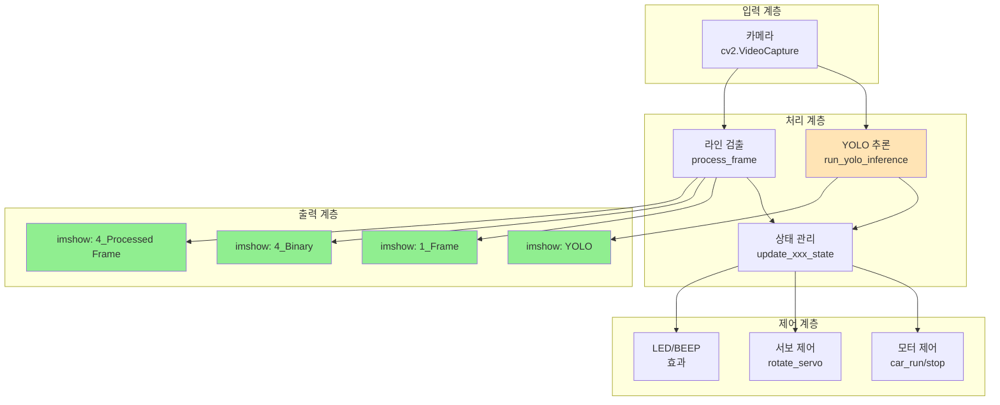
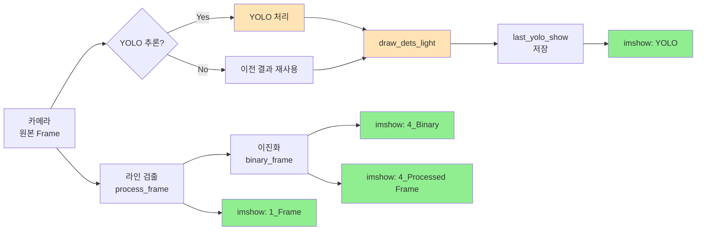
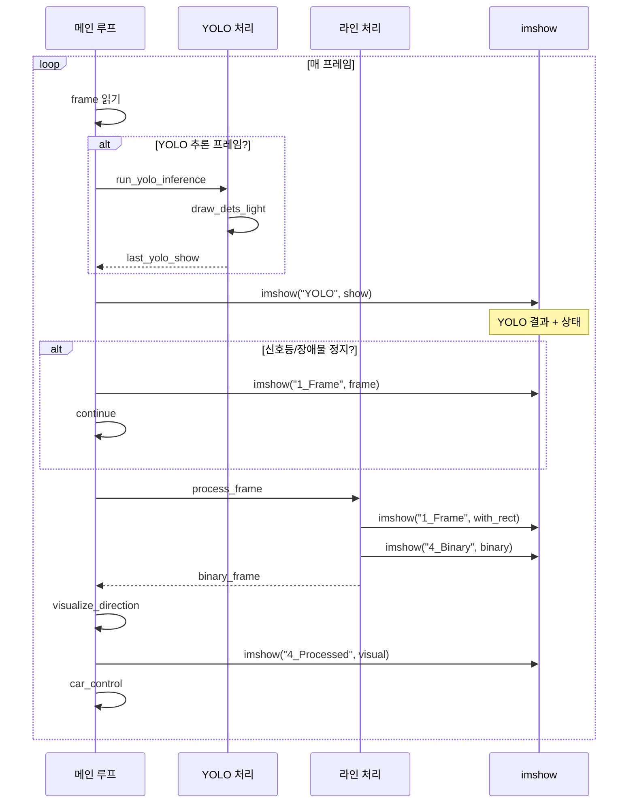

# 📊 final_08_autoplot.py YOLO & imshow & Frame 흐름 분석

> **자율주행 자동차 코드의 YOLO 추론과 화면 표시 관계 완벽 분석**

---

## 📋 목차

1. [전체 구조 개요](#1️⃣-전체-구조-개요)
2. [UI 제어 시스템](#2️⃣-ui-제어-시스템)
3. [YOLO 추론 흐름](#3️⃣-yolo-추론-흐름)
4. [Frame 처리 파이프라인](#4️⃣-frame-처리-파이프라인)
5. [imshow 호출 분석](#5️⃣-imshow-호출-분석)
6. [메인 루프 타임라인](#6️⃣-메인-루프-타임라인)
7. [문제점 및 개선 방안](#7️⃣-문제점-및-개선-방안)

---

## 1️⃣ 전체 구조 개요

### 🎯 코드의 핵심 목적

```
자율주행 자동차 제어 프로그램
├─ 라인 트레이싱 (기본 주행)
├─ YOLO 객체 인식 (신호등, 장애물, 주차 표지판)
├─ FSM 기반 상태 관리 (신호등 대기, 장애물 회피, 주차)
└─ 실시간 UI 표시 (디버깅 및 모니터링)
```

---

### 📊 시스템 다이어그램



---

## 2️⃣ UI 제어 시스템

### 🎛️ UI 스위치 설계 (19-30번째 줄)

```python
# =========================
# UI / OUTPUT SWITCH
# =========================
UI_ENABLED   = True   # ← 전체 UI 활성화 여부
IMSHOW_ON    = True   # ← imshow() 출력 여부

def imshow(name, img):
    """안전한 imshow 래퍼"""
    if UI_ENABLED and IMSHOW_ON:
        cv2.imshow(name, img)

def wait_key(delay=1):
    """안전한 waitKey 래퍼"""
    if UI_ENABLED:
        return cv2.waitKey(delay) & 0xFF
    time.sleep(delay / 1000.0)  # Headless 모드에서는 sleep
    return 255
```

---

### 💡 설계 의도

**이중 스위치 구조:**
```
UI_ENABLED = True  → Trackbar, Window 생성
IMSHOW_ON = True   → 실제 imshow() 호출

조합 시나리오:
┌─────────────┬───────────┬──────────────────┐
│ UI_ENABLED  │ IMSHOW_ON │ 동작             │
├─────────────┼───────────┼──────────────────┤
│ True        │ True      │ 완전 GUI 모드    │
│ True        │ False     │ Trackbar만       │
│ False       │ N/A       │ Headless 모드    │
└─────────────┴───────────┴──────────────────┘
```

---

### ✅ 장점

```python
# 1. Headless 환경 대응
if not UI_ENABLED:
    # imshow() 호출 안 함 → 멈춤 방지 ✅
    pass

# 2. 디버깅 편의성
IMSHOW_ON = False  # 빠른 테스트 시 화면 출력 끄기

# 3. 조건부 컴파일 효과
imshow("YOLO", frame)  # UI_ENABLED=False면 자동 스킵
```

---

### 🔍 Trackbar 설정 (782-809번째 줄)

```python
if UI_ENABLED:
    # 윈도우 생성
    cv2.namedWindow("Camera Settings", cv2.WINDOW_NORMAL)
    cv2.namedWindow("YOLO", cv2.WINDOW_NORMAL)
    cv2.namedWindow("1_Frame", cv2.WINDOW_NORMAL)
    cv2.namedWindow("4_Processed Frame", cv2.WINDOW_NORMAL)
    cv2.namedWindow("4_Binary", cv2.WINDOW_NORMAL)
    
    # Trackbar 생성 (실시간 파라미터 조정)
    cv2.createTrackbar("Motor_Up_Speed", "Camera Settings", 
                       DEFAULT_SPEED_UP, 255, nothing)
    cv2.createTrackbar("Detect_Value", "Camera Settings", 
                       DEFAULT_DETECT_VALUE, 150, nothing)
    # ... (더 많은 Trackbar)
```

**의미:**
- `UI_ENABLED=False`면 Trackbar도 생성 안 함
- Headless 환경에서도 안전하게 동작

---

## 3️⃣ YOLO 추론 흐름

### 🔍 YOLO 초기화 (287-294번째 줄)

```python
# YOLO 모델 로드
try:
    yolo_model = YOLO(YOLO_MODEL_PATH)
except Exception:
    yolo_model = None
    YOLO_ENABLED = False
```

**특징:**
- 모델 로드 실패해도 프로그램은 계속 실행
- `YOLO_ENABLED=False`로 YOLO 없이 라인 트레이싱만 가능

---

### 🚀 YOLO 추론 함수 (299-320번째 줄)

```python
def run_yolo_inference(frame, model, imgsz=320, conf=0.35):
    """
    YOLO 추론 실행
    
    Args:
        frame: BGR 이미지 (원본)
        model: YOLO 모델
        imgsz: 입력 크기 (320x320)
        conf: 신뢰도 임계값
        
    Returns:
        dets: 감지 결과 리스트
        frame_in: 추론에 사용된 프레임
    """
    if model is None:
        return [], None
    
    # ✅ 선택: 그레이스케일 변환
    if YOLO_USE_GRAY:
        g = cv2.cvtColor(frame, cv2.COLOR_BGR2GRAY)
        frame_in = cv2.cvtColor(g, cv2.COLOR_GRAY2BGR)
    else:
        frame_in = frame
    
    # ✅ YOLO 추론 (verbose=False → non-blocking)
    results = model.predict(frame_in, imgsz=imgsz, conf=conf, verbose=False)
    r = results[0]
    
    # ✅ 결과 파싱
    dets = []
    if r.boxes is not None and len(r.boxes) > 0:
        for b in r.boxes:
            cls = int(b.cls[0].item())
            c = float(b.conf[0].item())
            x1, y1, x2, y2 = b.xyxy[0].tolist()
            dets.append({
                "cls": cls,      # 클래스 ID
                "conf": c,       # 신뢰도
                "xyxy": (x1, y1, x2, y2)  # bbox 좌표
            })
    
    return dets, frame_in
```

---

### 📊 추론 결과 시각화 (322-332번째 줄)

```python
def draw_dets_light(frame, dets):
    """
    감지 결과를 프레임에 그리기 (가볍게)
    """
    out = frame.copy()
    for d in dets:
        cls = int(d["cls"])
        conf = float(d["conf"])
        x1, y1, x2, y2 = map(int, d["xyxy"])
        name = CLASS_ID_TO_NAME.get(cls, str(cls))
        
        # bbox 그리기
        cv2.rectangle(out, (x1, y1), (x2, y2), (0, 255, 255), 2)
        
        # 클래스명 + 신뢰도 표시
        cv2.putText(out, f"{name}:{conf:.2f}", 
                    (x1, max(15, y1 - 5)),
                    cv2.FONT_HERSHEY_SIMPLEX, 0.5, 
                    (0, 255, 255), 1)
    return out
```

---

### ⚡ 추론 주기 제어 (1158-1188번째 줄)

```python
# YOLO 추론 (매 N 프레임마다)
if YOLO_ENABLED and (yolo_model is not None):
    # ✅ 주차 모드면 매 프레임, 아니면 3프레임마다
    infer_N = 1 if park_mode else YOLO_EVERY_N_FRAMES
    
    if (frame_count % infer_N) == 0:
        # 1. YOLO 추론 실행
        dets_new, base_frame = run_yolo_inference(
            frame, yolo_model, 
            imgsz=YOLO_IMGSZ,  # 256
            conf=YOLO_CONF      # 0.25
        )
        
        # 2. 주차 상태 업데이트
        park_c = update_parking_state(dets_new, 
                                      frame.shape[1], 
                                      frame.shape[0])
        
        # 3. O 우선순위 적용 (O 보이면 X 무시)
        dets_new = apply_mark_priority(dets_new)
        
        # 4. 결과 저장
        last_dets = dets_new
        did_infer = True
        
        # 5. 시각화 이미지 생성
        last_yolo_show = draw_dets_light(base_frame, last_dets)
        
        # 6. 각종 상태 업데이트
        tl_state_now, red_c, green_c = update_traffic_light_state(last_dets)
        ob_c = update_obstacle_state(last_dets, ...)
        x_c = update_mark_x_state(last_dets, ...)
```

---

### 📈 추론 빈도 다이어그램

```mermaid
gantt
    title YOLO 추론 주기
    dateFormat X
    axisFormat %L ms
    
    section 일반 주행 (YOLO_EVERY_N_FRAMES=3)
    프레임 1 (추론 O)    :0, 100
    프레임 2 (추론 X)    :100, 100
    프레임 3 (추론 X)    :200, 100
    프레임 4 (추론 O)    :300, 100
    프레임 5 (추론 X)    :400, 100
    
    section 주차 모드 (infer_N=1)
    프레임 1 (추론 O)    :0, 100
    프레임 2 (추론 O)    :100, 100
    프레임 3 (추론 O)    :200, 100
    프레임 4 (추론 O)    :300, 100
```



**의도:**
- 일반 주행: 3프레임마다 → CPU 절약
- 주차 모드: 매 프레임 → 정밀 제어

---

## 4️⃣ Frame 처리 파이프라인

### 🎬 전체 Frame 흐름



---

### 📸 Frame 1: 카메라 원본 (1144-1146번째 줄)

```python
# 카메라에서 프레임 읽기
ret, frame = cap.read()
if not ret:
    break

# frame: BGR 형식, 320x240 (초기화 시 설정)
```

---

### 🔍 Frame 2: YOLO 입력 프레임

```python
# run_yolo_inference 내부
if YOLO_USE_GRAY:
    # 그레이스케일 변환 (선택적)
    g = cv2.cvtColor(frame, cv2.COLOR_BGR2GRAY)
    frame_in = cv2.cvtColor(g, cv2.COLOR_GRAY2BGR)
else:
    # 원본 BGR 그대로
    frame_in = frame

# YOLO 추론
results = model.predict(frame_in, imgsz=imgsz, ...)
```

**분기:**
- `YOLO_USE_GRAY=False` (기본): 컬러 이미지로 추론
- `YOLO_USE_GRAY=True`: 그레이 변환 후 추론

---

### 🎨 Frame 3: YOLO 시각화 (1170번째 줄)

```python
# 감지 결과를 프레임에 그리기
last_yolo_show = draw_dets_light(base_frame, last_dets)

# last_yolo_show 구조:
# - base_frame을 복사
# - 각 detection의 bbox 그리기 (노란색)
# - 클래스명 + 신뢰도 텍스트 추가
```

---

### 🖼️ Frame 4: YOLO 디스플레이 (1198-1215번째 줄)

```python
# 표시할 베이스 선택
base = last_yolo_show if last_yolo_show is not None else frame
show = base.copy()

# 그레이 모드면 변환
if YOLO_USE_GRAY and (last_yolo_show is None):
    g = cv2.cvtColor(frame, cv2.COLOR_BGR2GRAY)
    show = cv2.cvtColor(g, cv2.COLOR_GRAY2BGR)

# ✅ 상태 정보 오버레이
cv2.putText(
    show,
    f"TL={tl_state_now} r={red_c:.2f} g={green_c:.2f} | "
    f"ob={ob_c:.2f} x={x_c:.2f} park={park_c:.2f} "
    f"mode={'PARK' if park_mode else 'RUN'} fsm={park_fsm}",
    (10, 25),
    cv2.FONT_HERSHEY_SIMPLEX,
    0.55,
    (0, 255, 255),
    2,
)

# ✅ YOLO 윈도우에 표시
imshow("YOLO", show)
```

**표시 내용:**
- YOLO 감지 bbox + 클래스명
- 신호등 상태 (TL=GO/STOP)
- 각 클래스별 신뢰도 (red, green, obstacle, etc.)
- 주차 모드 상태

---

### 🛣️ Frame 5: 라인 검출 (934-960번째 줄)

```python
def process_frame(frame, detect_value, roi_top_y, roi_bottom_y, 
                  r_weight, g_weight, b_weight):
    """
    라인 검출 처리
    
    Returns:
        binary_frame: 이진화 결과
        top_y, bottom_y: ROI 영역
    """
    # 1. 노이즈 제거
    blurred = cv2.medianBlur(frame, 3)
    
    # 2. ROI 계산 및 시각화
    pts_src, top_y, bottom_y = calculate_roi_points(...)
    frame_with_rect = apply_roi_visualization(blurred, pts_src, ...)
    imshow("1_Frame", frame_with_rect)  # ← Frame 출력 1
    
    # 3. ROI 영역만 자르기
    roi = blurred[top_y:bottom_y, :]
    
    # 4. 가중치 그레이스케일 변환
    gray_frame = weighted_gray(roi, r_weight, g_weight, b_weight)
    
    # 5. 라인 검출 (빨간선 + 밝은선)
    binary_frame = detect_road_lines(roi, gray_frame, detect_value)
    
    # 6. ROI 마스킹
    mask = np.zeros_like(binary_frame)
    cv2.fillPoly(mask, [pts_roi], 255)
    binary_frame = cv2.bitwise_and(binary_frame, mask)
    
    # 7. 이진화 결과 출력
    imshow("4_Binary", binary_frame)  # ← Frame 출력 2
    
    return binary_frame, top_y, bottom_y
```

---

### 📊 Frame 6: 라인 시각화 (883-932번째 줄)

```python
def visualize_direction_on_frame(binary_frame, direction, 
                                 left_sum, center_sum, right_sum, 
                                 rgb_weights):
    """
    이진화 결과에 방향 정보 오버레이
    """
    # BGR로 변환
    frame_color = cv2.cvtColor(binary_frame, cv2.COLOR_GRAY2BGR)
    
    # 반투명 검은색 배경
    overlay = frame_color.copy()
    cv2.rectangle(overlay, (0, 0), (w, 110), (0, 0, 0), -1)
    cv2.addWeighted(overlay, 0.7, frame_color, 0.3, 0, frame_color)
    
    # 방향 텍스트
    direction_text = f"DIR: {direction}"
    direction_color = (0, 255, 0) if direction == "UP" else (0, 255, 255)
    cv2.putText(frame_color, direction_text, (10, 30), ...)
    
    # 히스토그램 합계
    hist_text = f"L:{left_sum:7d} C:{center_sum:7d} R:{right_sum:7d}"
    cv2.putText(frame_color, hist_text, (10, 60), ...)
    
    # 비율 (선이 얼마나 많은지)
    ratio_text = f"Ratio - L:{left_ratio:.2f} C:{center_ratio:.2f} R:{right_ratio:.2f}"
    cv2.putText(frame_color, ratio_text, (10, 80), ...)
    
    # RGB 가중치
    rgb_text = f"RGB Filter: R:{r_w} G:{g_w} B:{b_w}"
    cv2.putText(frame_color, rgb_text, (10, 100), ...)
    
    # 3분할 선 그리기
    cv2.line(frame_color, (w//3, 0), (w//3, h), (255, 0, 0), 2)
    cv2.line(frame_color, (2*w//3, 0), (2*w//3, h), (255, 0, 0), 2)
    
    return frame_color
```

---

### 🎯 Frame 처리 요약

| Frame | 이름 | 용도 | imshow 창 |
|-------|------|------|-----------|
| **1** | `frame` | 카메라 원본 | - |
| **2** | `frame_in` | YOLO 입력 | - |
| **3** | `last_yolo_show` | YOLO 결과 그림 | - |
| **4** | `show` | YOLO + 상태정보 | ✅ `YOLO` |
| **5** | `frame_with_rect` | ROI 표시 | ✅ `1_Frame` |
| **6** | `binary_frame` | 이진화 결과 | ✅ `4_Binary` |
| **7** | `processed_frame_visual` | 이진화 + 정보 | ✅ `4_Processed Frame` |

---

## 5️⃣ imshow 호출 분석

### 📍 imshow 호출 위치 (총 5곳)

#### 1️⃣ YOLO 윈도우 (1215번째 줄)

```python
imshow("YOLO", show)
```

**내용:**
- YOLO 감지 결과 (bbox + 클래스명)
- 상태 정보 (신호등, 장애물, 주차 상태)

**업데이트 빈도:**
- 매 프레임 (1 FPS ~ 30 FPS)

---

#### 2️⃣ 원본 Frame (941번째 줄)

```python
# process_frame 내부
frame_with_rect = apply_roi_visualization(blurred, pts_src, ...)
imshow("1_Frame", frame_with_rect)
```

**내용:**
- 카메라 원본 + ROI 영역 표시 (녹색 사각형)

**업데이트 빈도:**
- 매 프레임

---

#### 3️⃣ 이진화 결과 (959번째 줄)

```python
# process_frame 내부
imshow("4_Binary", binary_frame)
```

**내용:**
- 라인 검출 결과 (흰색: 라인, 검은색: 배경)

**업데이트 빈도:**
- 매 프레임

---

#### 4️⃣ 처리된 프레임 (1389번째 줄)

```python
processed_frame_visual = visualize_direction_on_frame(
    processed_frame, direction, hist_left, hist_center, hist_right, rgb_weights
)
imshow("4_Processed Frame", processed_frame_visual)
```

**내용:**
- 이진화 결과 + 방향 정보 + 히스토그램 + RGB 가중치

**업데이트 빈도:**
- 매 프레임

---

#### 5️⃣ 정지 상태일 때 (1233번째 줄)

```python
# 신호등/장애물로 정지 중
if stop_by_tl or stop_by_ob:
    car_stop()
    imshow("1_Frame", frame)  # 원본만 표시
    if handle_keyboard_input() == "EXIT":
        break
    continue
```

**의미:**
- 정지 중에는 원본 프레임만 표시
- 라인 처리 생략 (CPU 절약)

---

### 🔄 imshow 업데이트 흐름도



---

## 6️⃣ 메인 루프 타임라인

### ⏱️ 한 프레임의 처리 시간

```
총 처리 시간 = 약 100~150ms (6-10 FPS)

타임라인:
┌─────────────────────────────────────────────────────────┐
│ 시간(ms) │ 0   20  40  60  80  100 120 140            │
├─────────────────────────────────────────────────────────┤
│ 프레임 읽기      ▓                                      │
│ YOLO 추론        ░░░░░░░░░░░░░░░░  (3프레임마다)       │
│ 라인 처리            ▓▓▓▓                               │
│ 방향 결정                ▓                              │
│ 모터 제어                 ▓                             │
│ imshow(4개)              ░░░░                           │
│ waitKey(1)                   ▓                          │
└─────────────────────────────────────────────────────────┘

▓ = 필수 처리
░ = 선택적 처리
```

---

### 📊 프레임별 처리 패턴

```python
# 프레임 1 (YOLO 추론 O)
frame_count = 1 (1 % 3 == 1)
├─ frame 읽기 (10ms)
├─ YOLO 추론 (60-80ms) ← 여기가 병목!
├─ draw_dets_light (5ms)
├─ imshow("YOLO") (1ms)
├─ process_frame (20ms)
│  ├─ imshow("1_Frame")
│  └─ imshow("4_Binary")
├─ imshow("4_Processed") (1ms)
├─ car_control (1ms)
└─ waitKey(1) (1ms)
총: 약 100ms → 10 FPS

# 프레임 2 (YOLO 추론 X)
frame_count = 2 (2 % 3 != 0)
├─ frame 읽기 (10ms)
├─ YOLO 추론 생략 ✅
├─ 이전 결과 재사용 (0ms)
├─ imshow("YOLO") (1ms)
├─ process_frame (20ms)
├─ imshow("4_Processed") (1ms)
├─ car_control (1ms)
└─ waitKey(1) (1ms)
총: 약 35ms → 28 FPS ⚡

# 프레임 3 (YOLO 추론 X)
(프레임 2와 동일)

# 프레임 4 (YOLO 추론 O)
(프레임 1과 동일)
```

**평균 FPS:**
```
(2 × 28 + 1 × 10) / 3 = 약 22 FPS
```

---

### 🎯 주차 모드의 차이

```python
# 주차 모드 (infer_N = 1)
매 프레임마다 YOLO 추론
├─ 프레임 1: 100ms (YOLO O)
├─ 프레임 2: 100ms (YOLO O)
├─ 프레임 3: 100ms (YOLO O)
└─ 평균 FPS: 10 FPS

이유:
- O 표지판 정밀 추종 필요
- 실시간 위치 업데이트 필수
```

---

## 7️⃣ 문제점 및 개선 방안

### 🔴 문제 1: Headless 환경에서 멈춤

#### 증상
```python
# SSH로 라즈베리파이 접속 시
$ python final_08_autoplot.py

# UI_ENABLED=True, IMSHOW_ON=True면
cv2.namedWindow(...)  # ← 여기서 멈춤!
# DISPLAY 환경 변수 없음
```

#### 해결 ✅

```python
# 방법 1: UI 완전히 끄기
UI_ENABLED = False
IMSHOW_ON = False

# 방법 2: 환경 자동 감지
import os

def has_display():
    return os.environ.get('DISPLAY') is not None

UI_ENABLED = has_display()
IMSHOW_ON = has_display()
```

---

### 🟡 문제 2: YOLO 추론이 너무 느림

#### 현재 상황
```
YOLO_IMGSZ = 256  # 256x256 입력
추론 시간: 60-80ms
→ 전체 FPS를 10까지 떨어뜨림
```

#### 개선 방안

```python
# 방법 1: 입력 크기 줄이기
YOLO_IMGSZ = 192  # 256 → 192
# 추론 시간: 40-50ms로 감소 (30% 빠름)
# 정확도: 약간 감소 (허용 가능)

# 방법 2: 추론 주기 늘리기
YOLO_EVERY_N_FRAMES = 5  # 3 → 5
# 평균 FPS: 22 → 26

# 방법 3: TensorRT 최적화
# (고급) YOLO 모델을 TensorRT로 변환
# 추론 시간: 15-20ms (4배 빠름!)
```

---

### 🟢 문제 3: imshow 창이 너무 많음

#### 현재
```
창 5개:
- Camera Settings (Trackbar)
- YOLO
- 1_Frame
- 4_Binary
- 4_Processed Frame

→ 화면이 복잡함
→ CPU 부담
```

#### 개선 방안

```python
# 방법 1: 필수 창만 표시
SHOW_DEBUG_WINDOWS = False  # 추가

if SHOW_DEBUG_WINDOWS:
    imshow("1_Frame", frame_with_rect)
    imshow("4_Binary", binary_frame)
    imshow("4_Processed Frame", processed_visual)
else:
    # YOLO 창만 표시
    imshow("YOLO", show)

# 방법 2: 창 합치기
combined = np.hstack([
    cv2.resize(show, (320, 240)),
    cv2.resize(processed_visual, (320, 240))
])
imshow("Combined View", combined)
```

---

### 🔵 문제 4: waitKey(1) 호출이 너무 많음

#### 현재
```python
# handle_keyboard_input 내부
key = wait_key(1)  # ← 매 프레임 호출

# 주차 모드에서도
if handle_keyboard_input() == "EXIT":
    break  # ← continue 하기 전에 호출
```

#### 문제
- `waitKey(1)`은 OpenCV 이벤트 루프를 돌림
- 너무 자주 호출하면 오버헤드 발생

#### 개선 ✅

```python
# 메인 루프 끝에 한 번만 호출
while True:
    # ... 모든 처리 ...
    
    # 마지막에 한 번만
    if handle_keyboard_input() == "EXIT":
        break
```

**현재 코드는 이미 잘 되어 있음!** (1443번째 줄)

---

### 🟣 문제 5: 프레임 재사용 로직이 복잡함

#### 현재
```python
last_dets = []
last_yolo_show = None

# YOLO 추론 프레임
if (frame_count % infer_N) == 0:
    dets_new, base_frame = run_yolo_inference(...)
    last_dets = dets_new
    last_yolo_show = draw_dets_light(base_frame, last_dets)
else:
    dets = last_dets  # 재사용

# 나중에 표시
base = last_yolo_show if last_yolo_show is not None else frame
```

#### 개선 방안

```python
# 클래스로 캡슐화
class YOLOCache:
    def __init__(self):
        self.dets = []
        self.visual = None
        self.last_frame_count = -1
    
    def update(self, dets, visual, frame_count):
        self.dets = dets
        self.visual = visual
        self.last_frame_count = frame_count
    
    def get_visual(self, default_frame):
        return self.visual if self.visual is not None else default_frame
    
    def is_fresh(self, frame_count, max_age=5):
        return (frame_count - self.last_frame_count) <= max_age

# 사용
yolo_cache = YOLOCache()

if should_infer:
    dets, base = run_yolo_inference(...)
    visual = draw_dets_light(base, dets)
    yolo_cache.update(dets, visual, frame_count)

show = yolo_cache.get_visual(frame)
```

---

## 📊 최종 요약

### 🎯 핵심 구조

```
카메라 → YOLO → FSM → 모터
          ↓      ↓      ↓
         UI   상태  제어
```

### ✅ 잘된 점

1. **UI 스위치 설계**
   - `UI_ENABLED`, `IMSHOW_ON`으로 유연한 제어
   - Headless 대응 가능

2. **YOLO 추론 최적화**
   - `verbose=False` 사용 (non-blocking)
   - N 프레임마다 추론 (CPU 절약)
   - 주차 시 실시간 모드

3. **프레임 재사용**
   - `last_dets`, `last_yolo_show`로 캐싱
   - 추론 안 하는 프레임도 결과 표시

4. **Non-blocking 키 입력**
   - `waitKey(1)` 사용
   - 실시간 반응 가능

---

### ⚠️ 개선 필요

1. **Headless 자동 감지**
   ```python
   UI_ENABLED = os.environ.get('DISPLAY') is not None
   ```

2. **디버그 창 토글**
   ```python
   SHOW_DEBUG_WINDOWS = False  # 필요 시만
   ```

3. **YOLO 속도 개선**
   - TensorRT 변환
   - 입력 크기 줄이기 (256 → 192)

4. **코드 구조화**
   - YOLOCache 클래스
   - FrameProcessor 클래스

---

### 📈 성능 분석

| 항목 | 현재 | 개선 후 |
|------|------|---------|
| **평균 FPS** | 22 | 28-30 |
| **YOLO 추론** | 60-80ms | 40-50ms (TensorRT: 15-20ms) |
| **Headless 지원** | 수동 | 자동 감지 |
| **UI 복잡도** | 높음 | 중간 (토글 가능) |
| **코드 가독성** | 중간 | 높음 (클래스화) |

---

### 🚀 추천 개선 순서

1. **즉시 적용 (5분)**
   ```python
   UI_ENABLED = os.environ.get('DISPLAY') is not None
   ```

2. **단기 개선 (30분)**
   - 디버그 창 토글 기능
   - YOLO_IMGSZ = 192 테스트

3. **중기 개선 (2시간)**
   - YOLOCache 클래스 구현
   - FrameProcessor 클래스

4. **장기 개선 (하루)**
   - TensorRT 변환
   - 멀티스레딩 (YOLO를 별도 스레드에서)

---

## 🎓 학습 포인트

### 💡 배울 점

1. **Non-blocking 실전 적용**
   - `verbose=False`로 로그 끄기
   - `waitKey(1)`로 이벤트 루프
   - N 프레임마다 추론

2. **Headless 대응**
   - `UI_ENABLED` 플래그
   - `DISPLAY` 환경 변수 체크
   - 래퍼 함수 (`imshow`, `wait_key`)

3. **프레임 관리**
   - 캐싱으로 재사용
   - 여러 윈도우에 표시
   - 오버레이로 정보 추가

4. **YOLO 최적화**
   - 입력 크기 조정
   - 추론 주기 제어
   - 상황별 빈도 조절

---

**작성일:** 2024년 12월  
**분석 대상:** final_08_autoplot.py (1450줄)  
**난이도:** ⭐⭐⭐⭐☆ (중급-고급)  
**소요 시간:** 30분 분석

