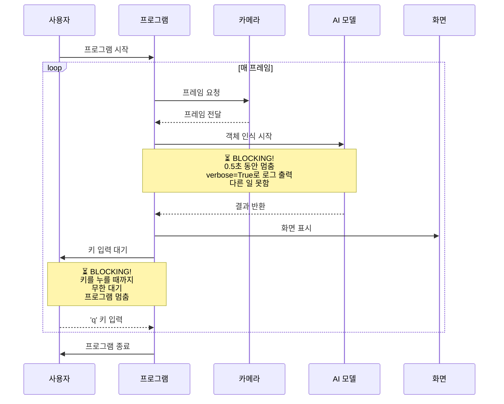
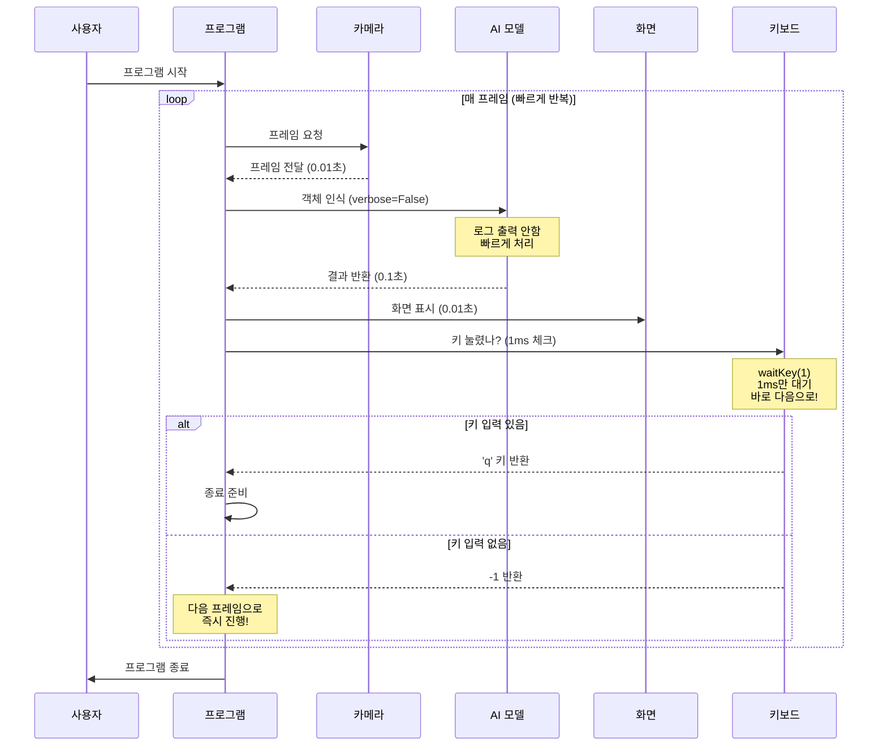
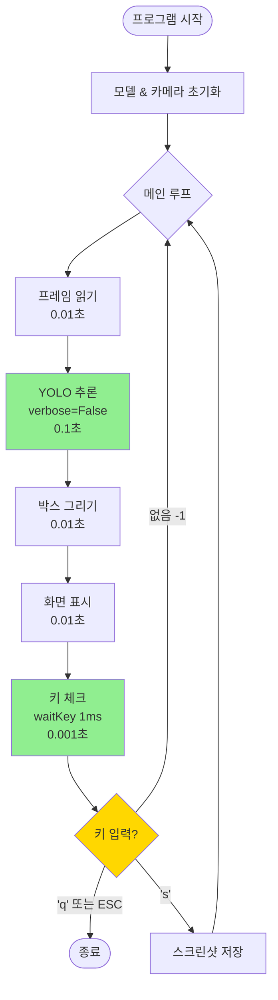

# 🎓 Non-blocking 완벽 이해 가이드

> **고등학생도 이해할 수 있는 Non-blocking 개념 완벽 정리**  
> 실전 예시 코드와 다이어그램으로 배우는 비차단 프로그래밍

---

## 📋 목차

1. [일상 생활 비유로 이해하기](#1️⃣-일상-생활-비유로-이해하기)
2. [왜 Non-blocking이 필요한가?](#2️⃣-왜-non-blocking이-필요한가)
3. [Mermaid 다이어그램으로 보는 차이점](#3️⃣-mermaid-다이어그램으로-보는-차이점)
4. [실전 코드 비교](#4️⃣-실전-코드-비교)
5. [simple_yolo_cv.py에서의 적용](#5️⃣-simple_yolo_cvpy에서의-적용)
6. [문제 상황과 해결책](#6️⃣-문제-상황과-해결책)

---

## 1️⃣ 일상 생활 비유로 이해하기

### 🍕 피자 배달 비유

#### **Blocking (차단형)** - 비효율적인 방식
```
당신: "피자 주문할게요"
     ↓
전화기 붙잡고 대기... ⏳⏳⏳ (30분)
     ↓
아무것도 못함 (게임 X, 숙제 X, TV X) 😫
     ↓
피자 도착: "네, 받았습니다"
     ↓
전화 끊고 다음 일 시작
```

**결과:** 30분 동안 다른 일을 전혀 못함

---

#### **Non-blocking (비차단형)** - 효율적인 방식
```
당신: "피자 주문할게요"
     ↓
주문만 하고 바로 전화 끊음 📞 (10초)
     ↓
다른 일 진행 (게임, 숙제, TV) 😊
     │
     ├─ 1분 후: 문 앞 확인 (없음) → 다시 게임
     ├─ 2분 후: 문 앞 확인 (없음) → 다시 게임
     ├─ ...
     └─ 30분 후: 문 앞 확인 (있음!) → 피자 받음 🍕
     ↓
계속해서 다른 일 진행
```

**결과:** 30분 동안 생산적으로 활용!

---

### 🚦 신호등 비유

#### **Blocking 방식**
```
빨간불 →  차가 완전히 멈춤 🚗🛑
          엔진도 꺼짐
          운전자도 꼼짝 못함
          ↓
          (5분 대기...)
          ↓
초록불 →  다시 시동 걸고 출발
```

#### **Non-blocking 방식**
```
빨간불 →  차는 멈추지만 🚗⏸️
          엔진은 켜져 있음
          라디오 들음, 핸드폰 확인 등
          ↓
          신호 계속 체크 (1초마다)
          ↓
초록불 →  바로 출발! 🚗💨
```

---

## 2️⃣ 왜 Non-blocking이 필요한가?

### 🎮 실시간 게임 프로그램을 생각해보세요

```python
while True:
    # 게임 화면 그리기
    draw_game()
    
    # 사용자 입력 대기
    key = wait_for_input()  # ❌ 여기서 멈춤!
    
    # 캐릭터 이동
    move_character(key)
```

**문제점:**
- `wait_for_input()`에서 키 입력을 기다리는 동안 화면이 얼어붙음
- 적 캐릭터가 움직이지 않음
- 배경 음악이 멈춤
- **게임이 끊김 현상** 발생!

---

### ✅ Non-blocking 해결책

```python
while True:
    # 게임 화면 그리기
    draw_game()
    
    # 키가 눌렸는지 1ms만 체크
    key = check_input_quick()  # ✅ 바로 진행!
    
    if key != None:
        move_character(key)
    
    # 적 캐릭터 이동
    move_enemy()
    
    # 배경 음악 재생
    play_music()
```

**결과:**
- 화면이 부드럽게 업데이트
- 모든 요소가 동시에 작동하는 것처럼 보임
- **실시간 반응**이 가능!

---

## 3️⃣ Mermaid 다이어그램으로 보는 차이점

### 📊 Blocking 방식의 흐름



**타임라인 분석:**
```
시간 →
0초     [프레임 읽기] → 0.01초
0.01초  [AI 분석 시작] ⏳⏳⏳⏳⏳ (멈춤) → 0.51초
0.51초  [화면 표시] → 0.52초
0.52초  [키 대기] ⏳⏳⏳⏳⏳⏳⏳⏳... (멈춤) → ???
???     사용자가 키를 눌러야 다음 프레임!

총 소요 시간: 1프레임당 최소 0.5초 이상
→ FPS(초당 프레임 수) = 2 FPS 이하 😱
→ 화면이 끊김!
```

---

### 📊 Non-blocking 방식의 흐름



**타임라인 분석:**
```
시간 →
0.000초 [프레임 읽기] → 0.010초
0.010초 [AI 분석] 빠르게! → 0.110초
0.110초 [화면 표시] → 0.120초
0.120초 [키 체크 1ms] → 0.121초
0.121초 다음 프레임 시작!

총 소요 시간: 1프레임당 약 0.12초
→ FPS = 약 8-10 FPS 😊
→ 화면이 부드러움!
```

---

### 📊 병렬 처리 비교 다이어그램

```mermaid
gantt
    title Blocking vs Non-blocking 시간 비교
    dateFormat X
    axisFormat %L ms
    
    section Blocking 방식
    프레임 읽기      :0, 10
    AI 처리 (멈춤)   :10, 510
    화면 표시        :510, 520
    키 대기 (멈춤)   :520, 5520
    다음 프레임      :5520, 5530
    
    section Non-blocking 방식
    프레임 읽기      :0, 10
    AI 처리          :10, 110
    화면 표시        :110, 120
    키 체크 (1ms)    :120, 121
    다음 프레임      :121, 131
```



**결과 비교:**
- **Blocking**: 1프레임 처리에 5초 이상 소요 → 0.2 FPS
- **Non-blocking**: 1프레임 처리에 0.12초 소요 → 8 FPS
- **속도 차이**: **약 40배 빠름!** 🚀

---

## 4️⃣ 실전 코드 비교

### 📝 예제 1: 간단한 카메라 프로그램

#### ❌ Blocking 방식 (blocking_camera.py)

```python
import cv2

cap = cv2.VideoCapture(0)

while True:
    ret, frame = cap.read()
    
    # 화면에 표시
    cv2.imshow('Camera', frame)
    
    # ❌ 키를 누를 때까지 무한 대기 (BLOCKING)
    key = cv2.waitKey(0)  # 0 = 무한 대기
    
    if key == ord('q'):
        break

cap.release()
cv2.destroyAllWindows()
```

**문제점:**
1. `waitKey(0)`에서 프로그램이 멈춤
2. 키를 누르지 않으면 다음 프레임을 못 읽음
3. **결과**: 화면이 정지 상태처럼 보임
4. **FPS**: 사용자가 키를 누르는 속도에 의존 (1초에 1-2번?)

---

#### ✅ Non-blocking 방식 (nonblocking_camera.py)

```python
import cv2

cap = cv2.VideoCapture(0)

while True:
    ret, frame = cap.read()
    
    # 화면에 표시
    cv2.imshow('Camera', frame)
    
    # ✅ 1ms만 대기하고 바로 진행 (NON-BLOCKING)
    key = cv2.waitKey(1)  # 1 = 1밀리초만 대기
    
    if key == ord('q'):
        break
    # key가 -1이면 (키 입력 없음) 다음 프레임으로!

cap.release()
cv2.destroyAllWindows()
```

**장점:**
1. 1ms만 대기하고 바로 다음 프레임
2. 키 입력이 없어도 계속 진행
3. **결과**: 실시간 동영상처럼 부드러움
4. **FPS**: 카메라 성능에 따라 15-30 FPS

---

### 📝 예제 2: YOLO AI 처리

#### ❌ Blocking 방식

```python
from ultralytics import YOLO
import cv2

model = YOLO('best.pt')
cap = cv2.VideoCapture(0)

while True:
    ret, frame = cap.read()
    
    # ❌ verbose=True: 화면에 로그 출력 (느림)
    results = model(frame, verbose=True)
    
    # 결과 그리기
    annotated = results[0].plot()
    cv2.imshow('YOLO', annotated)
    
    # ❌ 키 무한 대기
    key = cv2.waitKey(0)
    if key == ord('q'):
        break
```

**출력 예시:**
```
Found 3 objects: person, car, dog
Inference time: 0.523s
Postprocessing time: 0.012s
... (많은 로그가 출력됨)
```

**문제:**
- 로그 출력하느라 0.1-0.2초 추가 소요
- 키 대기로 프레임 멈춤
- **총 소요 시간**: 1프레임당 1초 이상

---

#### ✅ Non-blocking 방식

```python
from ultralytics import YOLO
import cv2

model = YOLO('best.pt')
cap = cv2.VideoCapture(0)

while True:
    ret, frame = cap.read()
    
    # ✅ verbose=False: 로그 출력 안 함 (빠름)
    results = model(frame, verbose=False)
    
    # 결과 그리기
    annotated = results[0].plot()
    cv2.imshow('YOLO', annotated)
    
    # ✅ 1ms만 체크
    key = cv2.waitKey(1)
    if key == ord('q'):
        break
```

**출력:** (조용함, 로그 없음)

**장점:**
- 로그 출력 시간 절약
- 즉시 다음 프레임 처리
- **총 소요 시간**: 1프레임당 0.1-0.2초
- **약 5-10배 빠름!**

---

## 5️⃣ simple_yolo_cv.py에서의 적용

### 📍 Non-blocking 포인트 1: YOLO 추론

```python
# simple_yolo_cv.py의 99-104번째 줄

# YOLO 추론 (non-blocking을 위해 verbose=False)
results = model(
    frame,           # BGR numpy 배열 그대로 사용
    imgsz=320,       # 입력 크기 320x320
    conf=0.5,        # 신뢰도 임계값 50%
    verbose=False    # ✅ 로그 출력 끄기 (시간 절약)
)
```

**효과:**
```
verbose=True일 때:
  AI 분석: 0.3초
  로그 출력: 0.2초
  총 시간: 0.5초

verbose=False일 때:
  AI 분석: 0.3초
  로그 출력: 0초
  총 시간: 0.3초
  
시간 절약: 40% 단축!
```

---

### 📍 Non-blocking 포인트 2: 키 입력 처리

```python
# simple_yolo_cv.py의 198번째 줄

# 키 입력 처리 (non-blocking)
key = cv2.waitKey(1) & 0xFF  # ✅ 1ms만 대기

if key == 27 or key == ord('q'):  # ESC 또는 'q'
    print("\n[INFO] 종료 키 입력.")
    break
elif key == ord('s'):  # 's' 키: 스크린샷 저장
    filename = f"screenshot_{frame_count}.jpg"
    cv2.imwrite(filename, frame)
    print(f"[INFO] 스크린샷 저장: {filename}")
# key가 -1이면 (입력 없음) 그냥 다음 프레임으로!
```

**동작 흐름:**
```
1ms 동안 키 체크:
  ├─ 키 입력 있음 (예: 'q')
  │   └─> key = 113 (q의 ASCII 코드)
  │       └─> 종료 처리
  │
  └─ 키 입력 없음
      └─> key = -1
          └─> 다음 프레임 계속 진행
```

---

### 📊 전체 루프 흐름도



**1프레임 처리 시간:**
- 프레임 읽기: 0.01초
- YOLO 추론: 0.10초
- 박스 그리기: 0.01초
- 화면 표시: 0.01초
- 키 체크: 0.001초
- **총합**: 0.131초 → **약 7-8 FPS**

---

## 6️⃣ 문제 상황과 해결책

### 🔴 문제 1: 화면이 끊김 (낮은 FPS)

#### **증상:**
```
화면이 1초에 1-2번만 업데이트됨
마치 슬라이드쇼처럼 보임
```

#### **원인:**
```python
# ❌ 잘못된 코드
key = cv2.waitKey(0)  # 키를 누를 때까지 멈춤
```

#### **해결:**
```python
# ✅ 올바른 코드
key = cv2.waitKey(1)  # 1ms만 대기
```

---

### 🔴 문제 2: 프로그램이 느림 (AI 처리 지연)

#### **증상:**
```
터미널에 로그가 계속 출력됨:
Inference time: 0.523s
Found 3 objects...
Processing...
(출력하느라 시간 지연)
```

#### **원인:**
```python
# ❌ 잘못된 코드
results = model(frame, verbose=True)  # 로그 출력
```

#### **해결:**
```python
# ✅ 올바른 코드
results = model(frame, verbose=False)  # 로그 끄기
```

---

### 🔴 문제 3: 키 입력이 즉시 반응 안 함

#### **증상:**
```
'q'를 눌렀는데 2-3초 후에 종료됨
```

#### **원인:**
```python
# ❌ 잘못된 코드
while True:
    # ... 무거운 처리 ...
    time.sleep(1)  # 1초 대기
    key = cv2.waitKey(0)  # 추가 대기
```

#### **해결:**
```python
# ✅ 올바른 코드
while True:
    # ... 처리 ...
    key = cv2.waitKey(1)  # 매 프레임마다 빠르게 체크
    if key == ord('q'):
        break  # 즉시 종료
```

---

### 🔴 문제 4: CPU 100% 사용 (너무 빠름)

#### **증상:**
```
프로그램이 너무 빠르게 돌아서 CPU 사용률 100%
노트북이 뜨거워짐
```

#### **원인:**
```python
# ❌ 잘못된 코드 (너무 빠름)
while True:
    ret, frame = cap.read()
    cv2.imshow('Camera', frame)
    # waitKey가 없음! 무한 루프!
```

#### **해결:**
```python
# ✅ 올바른 코드 (적절한 속도)
while True:
    ret, frame = cap.read()
    cv2.imshow('Camera', frame)
    cv2.waitKey(1)  # 1ms 쉬어가기 (CPU 부담 감소)
```

**설명:**
- `waitKey(1)`은 단순히 키 체크만 하는 게 아님
- OpenCV가 화면을 업데이트하고 이벤트를 처리하는 시간
- 1ms라도 있어야 CPU가 숨을 쉴 수 있음

---

## 📊 최종 비교표

| 구분 | Blocking | Non-blocking |
|------|----------|--------------|
| **waitKey** | `waitKey(0)` | `waitKey(1)` |
| **verbose** | `verbose=True` | `verbose=False` |
| **대기 시간** | 무한 대기 | 1ms만 대기 |
| **로그 출력** | 많음 | 없음 |
| **FPS** | 1-2 | 7-10 |
| **반응 속도** | 느림 (1초 이상) | 빠름 (0.1초) |
| **CPU 사용률** | 낮음 (대기 중) | 적절 (효율적) |
| **사용자 경험** | 끊김, 답답함 😫 | 부드러움, 쾌적함 😊 |

---

## 🎯 핵심 정리

### ✅ Non-blocking의 3대 원칙

1. **빠르게 체크, 빠르게 진행**
   - `waitKey(1)`: 1ms만 체크하고 다음으로
   
2. **불필요한 출력 제거**
   - `verbose=False`: 로그 출력으로 시간 낭비하지 않기

3. **루프를 멈추지 말 것**
   - 한 작업이 끝나면 즉시 다음 작업으로

---

### 📚 비유로 다시 정리

```
Non-blocking은 마치...

🏃 100m 달리기:
  - Blocking: 10m마다 멈춰서 쉬기
  - Non-blocking: 끝까지 달리고 결승선에서 쉬기

🍳 요리:
  - Blocking: 물 끓을 때까지 가만히 서서 기다리기
  - Non-blocking: 물 끓는 동안 야채 썰고 준비하기

📚 공부:
  - Blocking: 문제 하나 풀고 선생님이 검사할 때까지 대기
  - Non-blocking: 문제 풀고 바로 다음 문제로, 나중에 한꺼번에 검사
```

---

## 🔧 실습 파일

이 폴더에 포함된 실습 파일들:
- `blocking_example.py` - Blocking 방식 예제
- `nonblocking_example.py` - Non-blocking 방식 예제
- `comparison_test.py` - 두 방식 직접 비교

실행해보고 차이를 직접 느껴보세요!

---

## 📖 더 공부하기

### 관련 개념
- **동기(Synchronous) vs 비동기(Asynchronous)**
- **멀티스레딩(Multi-threading)**
- **이벤트 루프(Event Loop)**

### 다음 단계
1. `threading` 모듈로 진짜 병렬 처리 배우기
2. `asyncio`로 비동기 프로그래밍 배우기
3. GUI 프로그래밍에서 Non-blocking 활용하기

---

## ❓ FAQ

**Q1. waitKey(1)의 1은 정확히 1ms를 보장하나요?**
- A: 아니요. "최소 1ms"를 의미하고, 실제로는 시스템 상황에 따라 달라질 수 있습니다.

**Q2. waitKey(0)을 쓰는 경우는 없나요?**
- A: 있습니다! 이미지를 보여주고 사용자가 키를 누를 때까지 기다려야 할 때는 `waitKey(0)`을 씁니다.

**Q3. verbose=False로 하면 에러 메시지도 안 나오나요?**
- A: 아니요. 심각한 에러는 여전히 출력됩니다. 단지 일반적인 진행 상황 로그만 숨깁니다.

**Q4. Non-blocking이면 무조건 빠른가요?**
- A: 처리 속도 자체는 같습니다. 다만 "멈추는 시간"이 줄어들어 전체적으로 부드럽고 빠르게 느껴집니다.

---

**작성일:** 2024년  
**대상:** 고등학생 ~ 대학교 저학년  
**난이도:** ⭐⭐☆☆☆ (중급)

