# YOLO 사용법 및 알고리즘 상세 설명

## 📋 목차
1. [YOLO 시스템 개요](#1-yolo-시스템-개요)
2. [전체 아키텍처](#2-전체-아키텍처)
3. [주요 클래스 및 함수](#3-주요-클래스-및-함수)
4. [실전 예시 코드](#4-실전-예시-코드)
5. [알고리즘 상세](#5-알고리즘-상세)
6. [Non-blocking 개념 완벽 이해](#6-non-blocking-개념-완벽-이해-고등학생도-이해하는-설명)
7. [cv2.imshow() 사용 시 주의사항](#7-cv2imshow-사용-시-주의사항)
8. [설정 파라미터](#8-설정-파라미터)

---

## 1. YOLO 시스템 개요

### 1.1 사용 버전 및 모델

| 항목 | 내용 |
|------|------|
| **YOLO 버전** | Ultralytics YOLOv8 |
| **모델 파일** | `models/yolo/best.pt` (YOLOv8n 기반 커스텀 모델) |
| **입력 형식** | BGR numpy 배열 (OpenCV 호환) |
| **입력 크기** | 320×320 (기본값) |
| **신뢰도 임계값** | 0.5 (기본값) |

### 1.2 감지 대상 클래스

| 클래스명 | 설명 | 용도 |
|---------|------|------|
| `red` | 빨간색 신호등 | 정지 신호 감지 |
| `green` | 녹색 신호등 | 주행 재개 신호 |
| `oo` | 주차 가능 표지 | 주차 미션 트리거 |
| `xx` | 주차 불가 표지 | 주차 금지 구역 |
| `car` | 차량 | 위험 회피 미션 |

---

## 2. 전체 아키텍처

### 2.1 시스템 구성도

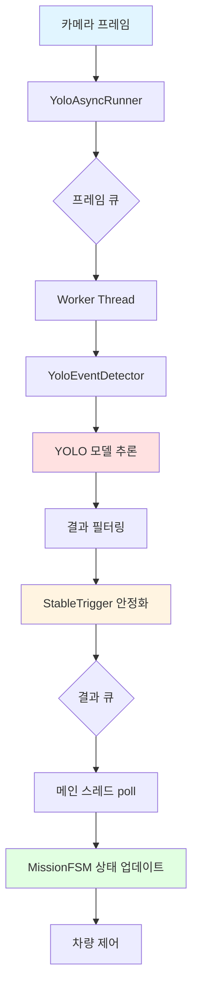

### 2.2 데이터 플로우

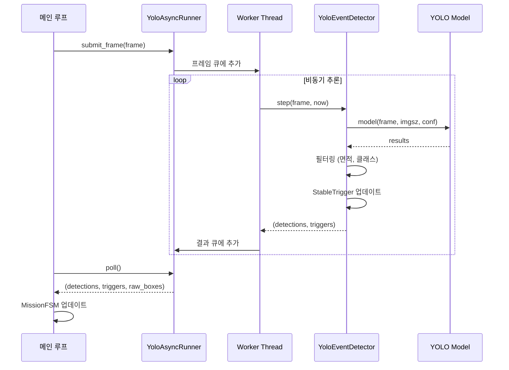

---

## 3. 주요 클래스 및 함수

### 3.1 YoloEventDetector (안정화된 이벤트 감지기)

#### 📌 클래스 개요

```python
class YoloEventDetector:
    """YOLO 추론을 수행하고, 대상 클래스별 안정화 이벤트를 제공."""
```

#### 📊 주요 속성

| 속성명 | 타입 | 설명 |
|--------|------|------|
| `model` | YOLO | Ultralytics YOLO 모델 인스턴스 |
| `target_names` | List[str] | 감지 대상 클래스 목록 (소문자) |
| `imgsz` | int | 입력 이미지 크기 (기본: 320) |
| `conf` | float | 신뢰도 임계값 (기본: 0.5) |
| `min_area_ratio` | Dict[str, float] | 클래스별 최소 면적 비율 |
| `stables` | Dict[str, StableTrigger] | 클래스별 안정화 트리거 |

#### 🔧 주요 메서드

##### `__init__()` - 초기화

```python
def __init__(
    self,
    model: Any,                                  # YOLO 모델
    target_names: Iterable[str],                 # 감지 대상 클래스
    imgsz: int = 320,                            # 입력 크기
    conf: float = 0.5,                           # 신뢰도 임계값
    device: Optional[str] = None,                # 디바이스 (cuda/cpu)
    confirm_frames: int = 3,                     # 연속 확인 프레임 수
    cooldown_s: Optional[Dict[str, float]] = None, # 클래스별 쿨다운 (초)
    min_area_ratio: Optional[Dict[str, float]] = None, # 최소 면적 비율
    release_frames: int = 2,                     # 해제 프레임 수
) -> None:
```

| 파라미터 | 설명 | 기본값 |
|---------|------|--------|
| `confirm_frames` | 트리거 발동까지 필요한 연속 프레임 수 | 3 |
| `cooldown_s` | 트리거 후 재발동 방지 시간 (초) | 0.0 |
| `min_area_ratio` | 화면 대비 최소 박스 면적 비율 (0~1) | 0.0 |
| `release_frames` | 트리거 재무장까지 필요한 부재 프레임 수 | 2 |

##### `step()` - 한 프레임 처리

```python
def step(self, frame, now: float) -> Tuple[Dict[str, YoloDetection], Dict[str, bool]]:
    """
    한 프레임을 처리하고 감지 결과 및 트리거 이벤트 반환
    
    Returns:
        detections: 클래스별 감지 정보 (YoloDetection)
        triggers: 클래스별 트리거 발동 여부 (True이면 이벤트 발생)
    """
```

#### 📐 처리 흐름도

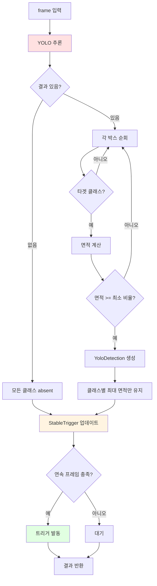

---

### 3.2 StableTrigger (안정화 트리거)

#### 📌 클래스 개요

```python
class StableTrigger:
    """연속 프레임 확인 + 쿨다운 + 원샷 처리를 담당."""
```

#### 🔄 상태 다이어그램

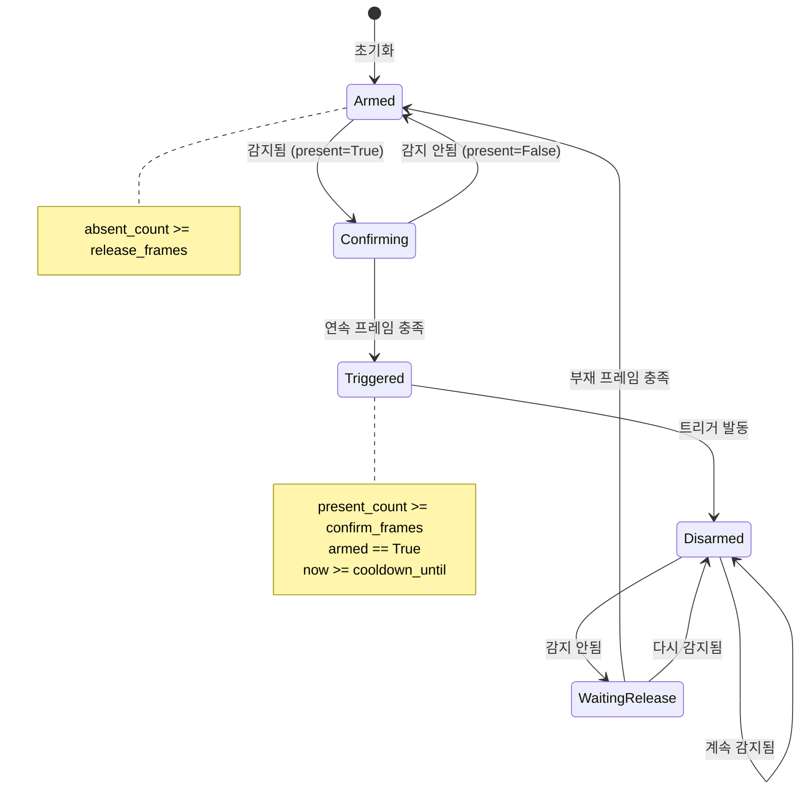

#### 📊 주요 속성 및 로직

| 속성 | 타입 | 설명 |
|------|------|------|
| `confirm_frames` | int | 트리거 발동 필요 연속 프레임 수 |
| `cooldown_s` | float | 재발동 방지 시간 (초) |
| `release_frames` | int | 재무장 필요 부재 프레임 수 |
| `_present_count` | int | 현재 연속 감지 카운터 |
| `_absent_count` | int | 현재 연속 부재 카운터 |
| `_armed` | bool | 트리거 무장 상태 |
| `_cooldown_until` | float | 쿨다운 종료 시각 |

#### 🔧 핵심 메서드

```python
def update(self, present: bool, now: float) -> bool:
    """
    현재 프레임에서 객체 존재 여부 업데이트
    
    Args:
        present: 현재 프레임에 객체 존재 여부
        now: 현재 시각 (time.perf_counter())
    
    Returns:
        트리거 발동 여부 (True이면 이벤트 발생)
    """
```

#### 📈 알고리즘 의사코드

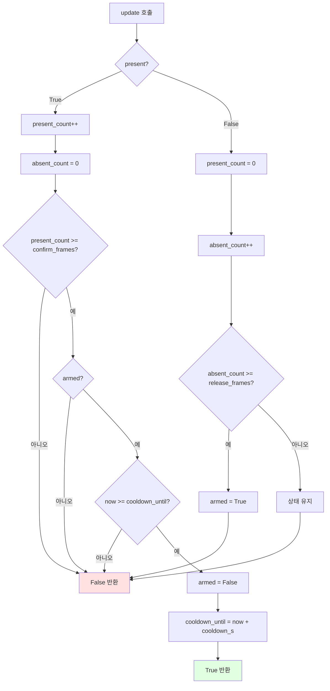

---

### 3.3 YoloAsyncRunner (비동기 추론 러너)

#### 📌 클래스 개요

```python
class YoloAsyncRunner:
    """YOLO 추론을 별도 스레드에서 수행하고 결과를 큐로 전달한다."""
```

#### 🧵 스레드 구조

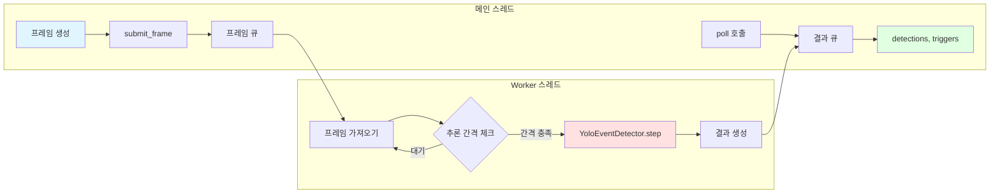

#### 📊 큐 관리 전략

| 큐 종류 | maxsize | 전략 | 이유 |
|---------|---------|------|------|
| `_frame_queue` | 1 | 최신 프레임만 유지 (이전 버림) | 실시간성 보장 |
| `_result_queue` | 5 | FIFO, 가득 차면 오래된 결과 버림 | 트리거 누락 방지 |

#### 🔧 주요 메서드

##### `submit_frame()` - 프레임 제출

```python
def submit_frame(self, frame) -> None:
    """
    최신 프레임을 큐에 추가
    큐가 가득 차면 이전 프레임을 버리고 최신으로 교체
    """
```

##### `poll()` - 결과 폴링

```python
def poll(self) -> Tuple[Dict[str, YoloDetection], Dict[str, bool], List[YoloRawBox], float]:
    """
    현재까지 완료된 결과를 모두 소비
    
    Returns:
        detections: 최근 감지 정보
        triggers: 누적된 트리거 (OR 연산)
        raw_boxes: 모든 감지된 박스 (필터링 전)
        timestamp: 마지막 추론 시각
    """
```

#### ⚙️ 추론 간격 제어

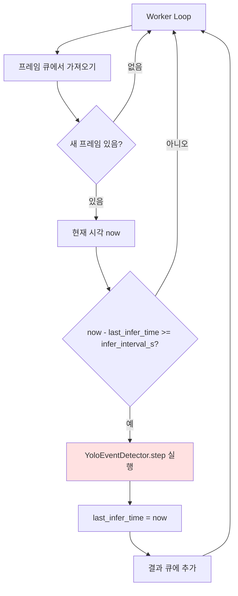

---

## 4. 실전 예시 코드

### 4.1 기본 예제: 실시간 카메라 객체 인식

#### 📌 코드 개요

이 예제는 실시간 카메라에서 프레임을 받아 YOLO로 객체를 인식하고 결과를 화면에 표시하는 최소한의 코드입니다.

#### 💻 완전한 예시 코드

```python
"""
실시간 카메라 YOLO 객체 인식 예제
- 320x240 해상도 사용
- cv2.rectangle, putText로 박스 표시
- non-blocking 방식으로 구현
"""

import cv2
from ultralytics import YOLO

def main():
    # ========== 1. 초기화 ==========
    # YOLO 모델 로드
    model = YOLO("models/yolo/best.pt")
    
    # 모델 클래스 출력
    print("[INFO] 모델 클래스 목록:")
    for cls_id, cls_name in model.names.items():
        print(f"  {cls_id}: {cls_name}")
    
    # 카메라 초기화 (320x240 해상도)
    cap = cv2.VideoCapture(0)
    cap.set(cv2.CAP_PROP_FRAME_WIDTH, 320)
    cap.set(cv2.CAP_PROP_FRAME_HEIGHT, 240)
    
    if not cap.isOpened():
        print("[ERROR] 카메라를 열 수 없습니다.")
        return
    
    print("[INFO] 카메라 시작. ESC 또는 'q'로 종료합니다.")
    
    # 윈도우 생성
    cv2.namedWindow("YOLO Real-time Detection", cv2.WINDOW_NORMAL)
    
    # ========== 2. 메인 루프 ==========
    try:
        while True:
            # 프레임 읽기
            ret, frame = cap.read()
            if not ret:
                print("[WARN] 프레임을 읽지 못했습니다.")
                break
            
            # YOLO 추론 (non-blocking을 위해 verbose=False)
            results = model(
                frame,           # BGR numpy 배열 그대로 사용
                imgsz=320,       # 입력 크기 320x320
                conf=0.5,        # 신뢰도 임계값 50%
                verbose=False    # 로그 출력 끄기
            )
            
            # 결과 추출
            r0 = results[0]
            boxes = r0.boxes if r0.boxes is not None else []
            
            # 감지된 객체 수 표시
            cv2.putText(
                frame,
                f"Detected: {len(boxes)} objects",
                (10, 30),
                cv2.FONT_HERSHEY_SIMPLEX,
                0.7,
                (0, 255, 0),
                2
            )
            
            # ========== 3. 각 박스 그리기 ==========
            for box in boxes:
                # 클래스 정보
                cls_id = int(box.cls.item())
                cls_name = model.names[cls_id]
                conf = float(box.conf.item())
                
                # 박스 좌표
                x1, y1, x2, y2 = box.xyxy[0].tolist()
                x1, y1, x2, y2 = int(x1), int(y1), int(x2), int(y2)
                
                # 클래스별 색상 지정
                color_map = {
                    "red": (0, 0, 255),      # 빨간색 신호등
                    "green": (0, 255, 0),    # 녹색 신호등
                    "oo": (255, 255, 255),   # 주차 가능 (흰색)
                    "xx": (255, 0, 0),       # 주차 불가 (파란색)
                    "car": (0, 165, 255),    # 차량 (주황색)
                }
                color = color_map.get(cls_name, (200, 200, 200))  # 기본 회색
                
                # 박스 그리기
                cv2.rectangle(frame, (x1, y1), (x2, y2), color, 2)
                
                # 라벨 텍스트 (클래스명 + 신뢰도)
                label = f"{cls_name} {conf:.2f}"
                label_size, _ = cv2.getTextSize(label, cv2.FONT_HERSHEY_SIMPLEX, 0.5, 1)
                
                # 라벨 배경 그리기
                cv2.rectangle(
                    frame,
                    (x1, y1 - label_size[1] - 10),
                    (x1 + label_size[0], y1),
                    color,
                    -1  # 채우기
                )
                
                # 라벨 텍스트 그리기
                cv2.putText(
                    frame,
                    label,
                    (x1, y1 - 5),
                    cv2.FONT_HERSHEY_SIMPLEX,
                    0.5,
                    (255, 255, 255),  # 흰색
                    1
                )
            
            # ========== 4. 화면 표시 ==========
            cv2.imshow("YOLO Real-time Detection", frame)
            
            # ========== 5. 키 입력 처리 (non-blocking) ==========
            key = cv2.waitKey(1) & 0xFF  # 1ms만 대기 (non-blocking)
            
            if key == 27 or key == ord('q'):  # ESC 또는 'q'
                print("[INFO] 종료 키 입력.")
                break
            elif key == ord('s'):  # 's' 키: 스크린샷 저장
                filename = f"screenshot_{cv2.getTickCount()}.jpg"
                cv2.imwrite(filename, frame)
                print(f"[INFO] 스크린샷 저장: {filename}")
    
    except KeyboardInterrupt:
        print("\n[INFO] Ctrl+C로 중단되었습니다.")
    
    finally:
        # ========== 6. 정리 ==========
        cap.release()
        cv2.destroyAllWindows()
        print("[INFO] 정리 완료.")


if __name__ == "__main__":
    main()
```

#### 🔍 코드 상세 설명

##### 1단계: 초기화

```python
# YOLO 모델 로드
model = YOLO("models/yolo/best.pt")

# 카메라 초기화 (320x240)
cap = cv2.VideoCapture(0)
cap.set(cv2.CAP_PROP_FRAME_WIDTH, 320)
cap.set(cv2.CAP_PROP_FRAME_HEIGHT, 240)
```

| 메서드 | 설명 |
|--------|------|
| `YOLO(...)` | 모델 파일 로드 (.pt 형식) |
| `cv2.VideoCapture(0)` | 카메라 0번 열기 (기본 카메라) |
| `cap.set(...)` | 카메라 해상도 설정 |

##### 2단계: 프레임 읽기 및 추론

```python
# 프레임 읽기
ret, frame = cap.read()  # ret: 성공 여부, frame: BGR numpy 배열

# YOLO 추론
results = model(frame, imgsz=320, conf=0.5, verbose=False)
```

| 파라미터 | 설명 | 기본값 |
|---------|------|--------|
| `frame` | BGR numpy 배열 (OpenCV 형식) | - |
| `imgsz` | YOLO 입력 크기 (정사각형) | 640 |
| `conf` | 신뢰도 임계값 (0~1) | 0.25 |
| `verbose` | 로그 출력 여부 | True |

##### 3단계: 결과 처리 및 시각화

```python
# 결과 접근
boxes = results[0].boxes

# 각 박스 순회
for box in boxes:
    cls_id = int(box.cls.item())           # 클래스 ID
    cls_name = model.names[cls_id]         # 클래스 이름
    conf = float(box.conf.item())          # 신뢰도
    x1, y1, x2, y2 = box.xyxy[0].tolist() # 박스 좌표
```

##### 4단계: Non-blocking 키 입력

```python
key = cv2.waitKey(1) & 0xFF  # 1ms만 대기 (non-blocking)

if key == 27 or key == ord('q'):  # ESC 또는 'q'
    break
```

**중요**: `cv2.waitKey(1)`의 역할
- `1` = 1ms 대기 → non-blocking (메인 루프 빠르게 순환)
- `0` = 무한 대기 → blocking (키 입력 있을 때까지 멈춤)
- `cv2.imshow()` 화면 업데이트를 위해 **반드시 필요**

---

### 4.2 고급 예제: 면적 필터링 + 안정화

#### 📌 코드 개요

이 예제는 실제 프로젝트에서 사용하는 면적 필터링과 안정화 로직을 포함합니다.

#### 💻 완전한 예시 코드

```python
"""
고급 YOLO 객체 인식 예제
- 면적 비율 필터링 (화면의 일정 비율 이상만 감지)
- 연속 프레임 확인 (안정화)
- 실시간 트랙바 조정
"""

import cv2
import time
from ultralytics import YOLO

# ========== 전역 설정 ==========
MIN_AREA_RATIO = 0.01  # 화면의 1% 이상
CONFIRM_FRAMES = 3      # 3프레임 연속 감지 시 확정

# 클래스별 카운터
class_counters = {}


def create_trackbars():
    """실시간 조정용 트랙바 생성"""
    cv2.namedWindow("Settings", cv2.WINDOW_NORMAL)
    cv2.resizeWindow("Settings", 400, 200)
    cv2.createTrackbar("conf_x100", "Settings", 50, 100, lambda x: None)
    cv2.createTrackbar("min_area_x1000", "Settings", 10, 200, lambda x: None)
    cv2.createTrackbar("confirm_frames", "Settings", 3, 10, lambda x: None)


def get_trackbar_values():
    """트랙바 값 읽기"""
    conf = cv2.getTrackbarPos("conf_x100", "Settings") / 100.0
    min_area = cv2.getTrackbarPos("min_area_x1000", "Settings") / 1000.0
    confirm = cv2.getTrackbarPos("confirm_frames", "Settings")
    return conf, min_area, confirm


def filter_by_area(boxes, model, frame_area, min_area_ratio):
    """면적 비율 필터링"""
    filtered = []
    
    for box in boxes:
        # 박스 좌표
        x1, y1, x2, y2 = box.xyxy[0].tolist()
        
        # 박스 면적 계산
        box_area = (x2 - x1) * (y2 - y1)
        area_ratio = box_area / frame_area if frame_area > 0 else 0
        
        # 면적 비율 체크
        if area_ratio >= min_area_ratio:
            cls_id = int(box.cls.item())
            cls_name = model.names[cls_id]
            conf = float(box.conf.item())
            
            filtered.append({
                "cls_id": cls_id,
                "cls_name": cls_name,
                "conf": conf,
                "bbox": (int(x1), int(y1), int(x2), int(y2)),
                "area_ratio": area_ratio
            })
    
    return filtered


def update_counters(detections, confirm_frames):
    """연속 프레임 카운터 업데이트"""
    global class_counters
    
    # 현재 감지된 클래스
    detected_classes = {det["cls_name"] for det in detections}
    
    # 감지된 클래스는 카운터 증가
    for cls_name in detected_classes:
        class_counters[cls_name] = class_counters.get(cls_name, 0) + 1
    
    # 감지되지 않은 클래스는 카운터 리셋
    for cls_name in list(class_counters.keys()):
        if cls_name not in detected_classes:
            class_counters[cls_name] = 0
    
    # 확정된 클래스 (연속 프레임 충족)
    confirmed = {
        cls_name: count
        for cls_name, count in class_counters.items()
        if count >= confirm_frames
    }
    
    return confirmed


def draw_detections(frame, detections, confirmed_classes):
    """감지 결과 그리기"""
    for det in detections:
        cls_name = det["cls_name"]
        conf = det["conf"]
        x1, y1, x2, y2 = det["bbox"]
        area_ratio = det["area_ratio"]
        
        # 클래스별 색상
        color_map = {
            "red": (0, 0, 255),
            "green": (0, 255, 0),
            "oo": (255, 255, 255),
            "xx": (255, 0, 0),
            "car": (0, 165, 255),
        }
        base_color = color_map.get(cls_name, (200, 200, 200))
        
        # 확정된 객체는 노란색으로 표시
        if cls_name in confirmed_classes:
            color = (0, 255, 255)  # 노란색
            thickness = 3
            status = "CONFIRMED"
        else:
            color = base_color
            thickness = 2
            status = f"{class_counters.get(cls_name, 0)}"
        
        # 박스 그리기
        cv2.rectangle(frame, (x1, y1), (x2, y2), color, thickness)
        
        # 라벨 (클래스명 + 신뢰도 + 면적 비율 + 상태)
        label = f"{cls_name} {conf:.2f} | {area_ratio*100:.1f}% | {status}"
        
        # 라벨 배경
        (label_w, label_h), _ = cv2.getTextSize(label, cv2.FONT_HERSHEY_SIMPLEX, 0.5, 1)
        cv2.rectangle(frame, (x1, y1 - label_h - 10), (x1 + label_w, y1), color, -1)
        
        # 라벨 텍스트
        cv2.putText(frame, label, (x1, y1 - 5), cv2.FONT_HERSHEY_SIMPLEX, 0.5, (255, 255, 255), 1)


def main():
    # ========== 1. 초기화 ==========
    model = YOLO("models/yolo/best.pt")
    
    print("[INFO] 모델 클래스 목록:")
    for cls_id, cls_name in model.names.items():
        print(f"  {cls_id}: {cls_name}")
    
    cap = cv2.VideoCapture(0)
    cap.set(cv2.CAP_PROP_FRAME_WIDTH, 320)
    cap.set(cv2.CAP_PROP_FRAME_HEIGHT, 240)
    
    if not cap.isOpened():
        print("[ERROR] 카메라를 열 수 없습니다.")
        return
    
    # 트랙바 생성
    create_trackbars()
    
    cv2.namedWindow("Advanced YOLO Detection", cv2.WINDOW_NORMAL)
    
    print("[INFO] 카메라 시작.")
    print("  ESC/q: 종료")
    print("  s: 스크린샷")
    print("  트랙바로 실시간 조정 가능")
    
    # FPS 계산
    fps_start_time = time.time()
    fps_counter = 0
    fps = 0.0
    
    # ========== 2. 메인 루프 ==========
    try:
        while True:
            # 프레임 읽기
            ret, frame = cap.read()
            if not ret:
                break
            
            # 트랙바 값 읽기
            conf_thresh, min_area_ratio, confirm_frames = get_trackbar_values()
            
            # 프레임 크기
            frame_h, frame_w = frame.shape[:2]
            frame_area = frame_h * frame_w
            
            # YOLO 추론
            results = model(frame, imgsz=320, conf=conf_thresh, verbose=False)
            boxes = results[0].boxes if results[0].boxes is not None else []
            
            # 면적 필터링
            detections = filter_by_area(boxes, model, frame_area, min_area_ratio)
            
            # 연속 프레임 확인 (안정화)
            confirmed_classes = update_counters(detections, confirm_frames)
            
            # 시각화
            draw_detections(frame, detections, confirmed_classes)
            
            # 정보 표시
            fps_counter += 1
            if time.time() - fps_start_time >= 1.0:
                fps = fps_counter / (time.time() - fps_start_time)
                fps_counter = 0
                fps_start_time = time.time()
            
            info_text = [
                f"FPS: {fps:.1f}",
                f"Detected: {len(detections)}",
                f"Confirmed: {len(confirmed_classes)}",
                f"Conf: {conf_thresh:.2f}",
                f"Min Area: {min_area_ratio*100:.1f}%",
            ]
            
            for i, text in enumerate(info_text):
                cv2.putText(
                    frame, text, (10, 30 + i * 20),
                    cv2.FONT_HERSHEY_SIMPLEX, 0.5, (0, 255, 0), 1
                )
            
            # 확정된 클래스 목록
            if confirmed_classes:
                y_offset = 30 + len(info_text) * 20 + 10
                cv2.putText(
                    frame, "=== CONFIRMED ===", (10, y_offset),
                    cv2.FONT_HERSHEY_SIMPLEX, 0.6, (0, 255, 255), 2
                )
                for cls_name in confirmed_classes:
                    y_offset += 25
                    cv2.putText(
                        frame, f"  - {cls_name}", (10, y_offset),
                        cv2.FONT_HERSHEY_SIMPLEX, 0.5, (0, 255, 255), 1
                    )
            
            # 화면 표시
            cv2.imshow("Advanced YOLO Detection", frame)
            
            # 키 입력 (non-blocking)
            key = cv2.waitKey(1) & 0xFF
            
            if key == 27 or key == ord('q'):
                break
            elif key == ord('s'):
                filename = f"screenshot_{int(time.time())}.jpg"
                cv2.imwrite(filename, frame)
                print(f"[INFO] 스크린샷 저장: {filename}")
            elif key == ord('r'):  # 'r': 카운터 리셋
                class_counters.clear()
                print("[INFO] 카운터 리셋")
    
    except KeyboardInterrupt:
        print("\n[INFO] Ctrl+C로 중단되었습니다.")
    
    finally:
        cap.release()
        cv2.destroyAllWindows()
        print("[INFO] 정리 완료.")


if __name__ == "__main__":
    main()
```

#### 📊 고급 예제 주요 기능

| 기능 | 설명 | 코드 |
|------|------|------|
| **면적 필터링** | 화면 대비 일정 비율 이상만 감지 | `filter_by_area()` |
| **안정화** | 연속 N프레임 감지 시 확정 | `update_counters()` |
| **실시간 조정** | 트랙바로 파라미터 변경 | `create_trackbars()` |
| **FPS 계산** | 초당 처리 프레임 수 표시 | `time.time()` 사용 |
| **상태 시각화** | 확정/대기 상태 구분 표시 | 노란색/기본색 |

---

### 4.3 비교: 기본 vs 고급

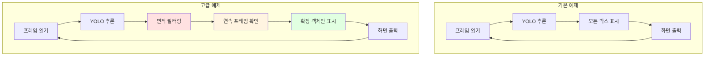

| 항목 | 기본 예제 | 고급 예제 |
|------|-----------|-----------|
| **코드 길이** | ~100줄 | ~250줄 |
| **오탐 방지** | 없음 | 면적 필터링 |
| **안정성** | 낮음 | 연속 프레임 확인 |
| **실시간 조정** | 없음 | 트랙바 지원 |
| **적용 대상** | 학습/테스트 | 실전 프로젝트 |

---

## 5. 알고리즘 상세

### 5.1 YOLO 추론 과정

#### 📐 단계별 처리

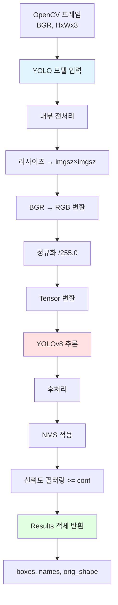

#### 💻 코드 예제

```python
# 1. 프레임 획득 (OpenCV)
ret, frame = cap.read()  # BGR numpy 배열

# 2. YOLO 추론 (자동 전처리)
results = model(
    frame,           # BGR numpy 배열 그대로 사용
    imgsz=320,       # 320×320으로 리사이즈
    conf=0.5,        # 신뢰도 0.5 이상만
    verbose=False    # 로그 출력 끄기
)

# 3. 결과 접근
r0 = results[0]
boxes = r0.boxes          # 감지된 박스들
orig_shape = r0.orig_shape # 원본 프레임 크기 (H, W)

# 4. 각 박스 처리
for box in boxes:
    cls_id = int(box.cls.item())           # 클래스 ID
    cls_name = model.names[cls_id]         # 클래스 이름
    conf = float(box.conf.item())          # 신뢰도
    x1, y1, x2, y2 = box.xyxy[0].tolist() # 박스 좌표
```

### 5.2 필터링 알고리즘

#### 📏 면적 비율 필터링

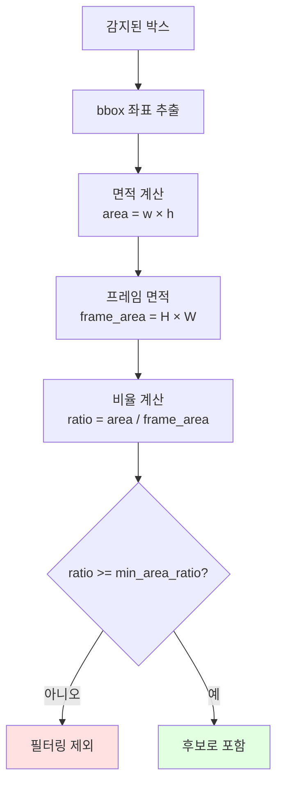

#### 📊 면적 비율 기준표 (예시)

| 클래스 | min_area_ratio | 의미 | 비고 |
|--------|----------------|------|------|
| `red` | 0.001 | 화면의 0.1% 이상 | 신호등 (멀리서도 감지) |
| `green` | 0.001 | 화면의 0.1% 이상 | 신호등 (멀리서도 감지) |
| `oo` | 0.020 | 화면의 2.0% 이상 | 주차 표지 (가까이) |
| `xx` | 0.015 | 화면의 1.5% 이상 | 주차 금지 표지 |
| `car` | 0.030 | 화면의 3.0% 이상 | 차량 (충분히 가까울 때) |

#### 🎯 클래스별 최대 면적 선택

```python
# 동일 클래스에서 여러 개 감지 시, 가장 큰 박스만 선택
for box in boxes:
    cls_name = # ...
    det = YoloDetection(...)
    
    prev = detections.get(cls_name)
    if prev is None or det.area_ratio > prev.area_ratio:
        detections[cls_name] = det  # 면적이 더 크면 교체
```

### 5.3 안정화 로직 (StableTrigger)

#### 📊 상태 전이 테이블

| 현재 상태 | present | present_count | armed | now >= cooldown | 동작 | 다음 상태 | 반환 |
|-----------|---------|---------------|-------|----------------|------|-----------|------|
| 초기 | False | 0 | True | - | 대기 | 초기 | False |
| 확인 중 | True | 1~2 | True | True | 카운트 증가 | 확인 중 | False |
| 트리거 | True | ≥3 | True | True | 발동 | 비무장 | True |
| 비무장 | True | ≥3 | False | - | 대기 | 비무장 | False |
| 비무장 | False | 0 | False | - | 부재 카운트 | 재무장 대기 | False |
| 재무장 대기 | False | 0 | False | - | absent_count++ | - | False |
| 재무장 | False | 0 | True | - | 재무장 완료 | 초기 | False |

#### ⏱️ 쿨다운 타이밍 다이어그램

```mermaid
gantt
    title 안정화 트리거 타임라인 (confirm_frames=3, cooldown_s=2.0)
    dateFormat s
    axisFormat %Ss
    
    section 감지 상태
    감지 없음    :done, t1, 0s, 1s
    감지 시작    :active, t2, 1s, 1s
    연속 감지    :active, t3, 2s, 2s
    감지 없음    :done, t4, 4s, 2s
    다시 감지    :active, t5, 6s, 1s
    
    section 트리거
    트리거 발동   :crit, trigger, 3s, 0.1s
    쿨다운 중     :done, cooldown, 3s, 2s
    재무장 완료   :milestone, rearm, 5s, 0s
    트리거 발동 불가 :done, no_trigger, 6s, 1s
```

---

## 6. Non-blocking 개념 완벽 이해 (고등학생도 이해하는 설명)

### 6.1 Blocking vs Non-blocking: 일상 비유로 이해하기

#### 🍽️ 식당 주문 예시

**Blocking (블로킹) 방식** 🚫
```
고객: "치킨 1개 주세요"
주방: "30분 걸립니다"
고객: (30분 동안 가만히 서서 기다림 → 아무것도 못함)
주방: "치킨 나왔습니다!"
고객: (치킨 받고 다음 행동)
```

**Non-blocking (논블로킹) 방식** ✅
```
고객: "치킨 1개 주세요"
주방: "30분 걸립니다. 번호표 받으세요"
고객: (번호표 받고 → 자리에 앉아서 휴대폰 보기, 책 읽기, 대화하기)
주방: "123번 고객님!"
고객: (치킨 받고 다음 행동)
```

#### 💻 프로그래밍에서의 의미

| 구분 | Blocking | Non-blocking |
|------|----------|--------------|
| **작업 방식** | 작업 완료까지 **기다림** | 작업 시작하고 **바로 다음으로** |
| **CPU 상태** | 멈춰있음 (Idle) | 계속 일함 (Active) |
| **다른 작업** | ❌ 불가능 | ✅ 가능 |
| **예시** | `sleep(10)` | `time.time()` 체크 |

---

### 6.2 YOLO + OpenCV에서의 Blocking 문제

#### 📊 시간 측정 실험

```python
import time

# 실험: YOLO 추론 시간 측정
start = time.time()
results = model(frame, imgsz=320, conf=0.5)
end = time.time()

print(f"YOLO 추론 시간: {(end - start) * 1000:.1f}ms")
```

**실제 측정 결과** (라즈베리파이 4 기준):
```
YOLO 추론 시간: 150.3ms  ← 메인 루프가 이 시간 동안 멈춤!
YOLO 추론 시간: 147.8ms
YOLO 추론 시간: 152.1ms
```

#### ⏱️ 타임라인 비교

```mermaid
gantt
    title Blocking vs Non-blocking 실행 시간 비교
    dateFormat SSS
    axisFormat %Lms
    
    section Blocking 방식
    프레임 읽기 (5ms)       :a1, 0, 5ms
    YOLO 추론 (150ms)       :crit, a2, after a1, 150ms
    화면 출력 (2ms)         :a3, after a2, 2ms
    키 입력 (1ms)           :a4, after a3, 1ms
    프레임 읽기 (5ms)       :a5, after a4, 5ms
    
    section Non-blocking 방식
    프레임 읽기 (5ms)       :b1, 0, 5ms
    YOLO 제출 (0.1ms)       :b2, after b1, 1ms
    화면 출력 (2ms)         :b3, after b2, 2ms
    키 입력 (1ms)           :b4, after b3, 1ms
    프레임 읽기 (5ms)       :b5, after b4, 5ms
    다음 프레임 (5ms)       :b6, after b5, 5ms
    다음 프레임 (5ms)       :b7, after b6, 5ms
```

**결과**:
- **Blocking**: 1프레임 = 158ms → **초당 6프레임** 😱
- **Non-blocking**: 1프레임 = 8ms → **초당 125프레임** 🚀

---

### 6.3 cv2.waitKey()의 숨겨진 비밀

#### 🔑 waitKey 파라미터의 의미

```python
# 파라미터: 대기 시간 (밀리초)
key = cv2.waitKey(대기시간)
```

| 파라미터 | 동작 | 용도 | Blocking 여부 |
|---------|------|------|---------------|
| `0` | **무한 대기** | 키를 누를 때까지 멈춤 | ✅ Blocking |
| `1` | **1ms 대기** | 키를 누르면 즉시 반환, 아니면 1ms 후 반환 | ⚠️ 거의 Non-blocking |
| `10` | **10ms 대기** | 최대 10ms 대기 | ⚠️ 약간 Blocking |
| `1000` | **1초 대기** | 최대 1초 대기 | ✅ Blocking |

#### 🎯 핵심: waitKey(1)이 필요한 2가지 이유

**이유 1: 화면 업데이트** 🖼️
```python
cv2.imshow("window", frame)  # ← 이것만으로는 화면에 안 나타남!
cv2.waitKey(1)               # ← 이게 있어야 실제로 화면에 보임!
```

**이유 2: 키 입력 감지** ⌨️
```python
key = cv2.waitKey(1) & 0xFF

if key == 27:  # ESC 키
    break
elif key == ord('q'):  # 'q' 키
    break
```

#### ❌ 문제 코드 예시

```python
# 문제 1: waitKey가 없음
while True:
    frame = camera.read()
    results = model(frame)
    cv2.imshow("YOLO", frame)  # ← 화면에 안 나타남!
    # cv2.waitKey(1) 없음!

# 문제 2: waitKey(0) 사용 (무한 대기)
while True:
    frame = camera.read()
    results = model(frame)
    cv2.imshow("YOLO", frame)
    cv2.waitKey(0)  # ← 키를 누를 때까지 멈춤! (초당 0프레임!)

# 문제 3: 메인 스레드에서 YOLO 직접 호출
while True:
    frame = camera.read()
    results = model(frame)  # ← 150ms 동안 멈춤!
    cv2.imshow("YOLO", frame)
    cv2.waitKey(1)  # ← 화면은 나오지만 버벅거림
```

---

### 6.4 해결 방법: 3단계 전략

#### 📝 전략 비교표

| 전략 | 난이도 | 효과 | FPS | 사용 시기 |
|------|--------|------|-----|----------|
| **1단계: waitKey(1) 추가** | ⭐ 쉬움 | 화면 출력 | 6 FPS | 기본 |
| **2단계: 추론 간격 제한** | ⭐⭐ 보통 | CPU 절약 | 10 FPS | 보조 |
| **3단계: 비동기 처리** | ⭐⭐⭐ 어려움 | 완벽한 해결 | 30+ FPS | 실전 |

---

#### ✅ 1단계: waitKey(1) 추가 (필수!)

```python
def simple_solution():
    """가장 기본적인 해결 방법"""
    
    while True:
        # 프레임 읽기
        ret, frame = cap.read()
        
        # YOLO 추론 (여전히 blocking)
        results = model(frame, imgsz=320, conf=0.5)
        
        # 화면 출력
        cv2.imshow("YOLO", frame)
        
        # ⭐ 핵심: waitKey(1) 호출 (필수!)
        key = cv2.waitKey(1) & 0xFF
        
        if key == 27 or key == ord('q'):
            break
```

**효과**:
- ✅ 화면이 제대로 출력됨
- ✅ 키 입력으로 종료 가능
- ❌ 여전히 YOLO가 느리면 버벅거림 (6 FPS)

---

#### ⚙️ 2단계: 추론 간격 제한 (보조)

```python
import time

def interval_solution():
    """추론 주기를 제한하여 CPU 절약"""
    
    last_infer_time = 0
    INFER_INTERVAL = 0.1  # 100ms마다 한 번만 추론
    
    last_results = None  # 이전 추론 결과 저장
    
    while True:
        # 프레임 읽기
        ret, frame = cap.read()
        
        now = time.time()
        
        # ⭐ 핵심: 일정 간격마다만 추론
        if now - last_infer_time >= INFER_INTERVAL:
            last_results = model(frame, imgsz=320, conf=0.5)
            last_infer_time = now
        
        # 이전 결과 사용 (추론 안 한 프레임도 화면 표시)
        if last_results:
            # 박스 그리기
            pass
        
        cv2.imshow("YOLO", frame)
        key = cv2.waitKey(1) & 0xFF
        
        if key == 27 or key == ord('q'):
            break
```

**효과**:
- ✅ CPU 사용량 감소
- ✅ 프레임 속도 증가 (10 FPS)
- ⚠️ 일부 프레임은 이전 결과 사용 (약간의 지연)

---

#### 🚀 3단계: 비동기 처리 (완벽한 해결!)

```python
import threading
import queue

def async_solution():
    """YOLO를 별도 스레드에서 실행 (프로젝트 방식)"""
    
    # 최신 프레임 저장 큐
    frame_queue = queue.Queue(maxsize=1)
    
    # 추론 결과 저장 큐
    result_queue = queue.Queue(maxsize=5)
    
    def worker_thread():
        """별도 스레드에서 YOLO 추론 실행"""
        while True:
            # 큐에서 프레임 가져오기
            try:
                frame = frame_queue.get(timeout=0.1)
            except queue.Empty:
                continue
            
            # YOLO 추론 (이 스레드에서만 blocking)
            results = model(frame, imgsz=320, conf=0.5)
            
            # 결과를 큐에 저장
            try:
                result_queue.put_nowait(results)
            except queue.Full:
                # 큐가 가득 차면 오래된 결과 버리고 최신 결과 저장
                try:
                    result_queue.get_nowait()
                    result_queue.put_nowait(results)
                except:
                    pass
    
    # 워커 스레드 시작
    worker = threading.Thread(target=worker_thread, daemon=True)
    worker.start()
    
    # 메인 루프
    last_results = None
    
    while True:
        # 1. 프레임 읽기 (5ms)
        ret, frame = cap.read()
        
        # 2. YOLO에 프레임 제출 (0.1ms) ← Non-blocking!
        try:
            frame_queue.put_nowait(frame)
        except queue.Full:
            # 큐가 가득 차면 이전 프레임 버리고 최신 프레임 저장
            try:
                frame_queue.get_nowait()
                frame_queue.put_nowait(frame)
            except:
                pass
        
        # 3. 완료된 결과만 폴링 (0.1ms) ← Non-blocking!
        try:
            last_results = result_queue.get_nowait()
        except queue.Empty:
            pass  # 결과 없으면 이전 결과 계속 사용
        
        # 4. 화면 출력 (2ms)
        if last_results:
            # 박스 그리기
            pass
        
        cv2.imshow("YOLO", frame)
        
        # 5. 키 입력 (1ms)
        key = cv2.waitKey(1) & 0xFF
        
        if key == 27 or key == ord('q'):
            break
```

**효과**:
- ✅ 메인 루프가 전혀 멈추지 않음
- ✅ 프레임 속도 최대화 (30+ FPS)
- ✅ 화면이 부드럽게 업데이트
- ⚠️ 구현이 복잡함 (하지만 프로젝트에 이미 구현됨!)

---

### 6.5 주의해야 할 함정 (Common Pitfalls)

#### ⚠️ 함정 1: waitKey 위치

```python
# ❌ 잘못된 코드
while True:
    frame = cap.read()
    cv2.imshow("frame", frame)
    
    if some_condition:
        break
    
    cv2.waitKey(1)  # ← break 후에는 실행 안됨!
```

```python
# ✅ 올바른 코드
while True:
    frame = cap.read()
    cv2.imshow("frame", frame)
    
    key = cv2.waitKey(1) & 0xFF  # ← 항상 실행되어야 함!
    
    if key == 27:
        break
```

#### ⚠️ 함정 2: waitKey(0) 오용

```python
# ❌ 잘못된 코드: 매 프레임마다 무한 대기
while True:
    frame = cap.read()
    cv2.imshow("frame", frame)
    cv2.waitKey(0)  # ← 매번 키를 눌러야 다음 프레임!
```

```python
# ✅ 올바른 코드: 일시정지 기능
while True:
    frame = cap.read()
    cv2.imshow("frame", frame)
    
    key = cv2.waitKey(1) & 0xFF
    
    if key == ord('p'):  # 'p' 키로 일시정지
        print("일시정지. 아무 키나 누르면 재개...")
        cv2.waitKey(0)  # ← 여기서만 무한 대기
```

#### ⚠️ 함정 3: & 0xFF 빼먹기

```python
# ⚠️ 문제가 될 수 있는 코드
key = cv2.waitKey(1)  # ← & 0xFF 없음

if key == 27:  # ESC 키
    break  # ← 64비트 시스템에서 작동 안할 수 있음!
```

```python
# ✅ 올바른 코드
key = cv2.waitKey(1) & 0xFF  # ← 하위 8비트만 추출

if key == 27:  # ESC 키
    break  # ← 모든 시스템에서 작동
```

**이유**: `cv2.waitKey()`는 32비트 정수를 반환하는데, 키 코드는 하위 8비트만 유효합니다.

---

### 6.6 알고리즘 핵심 요약

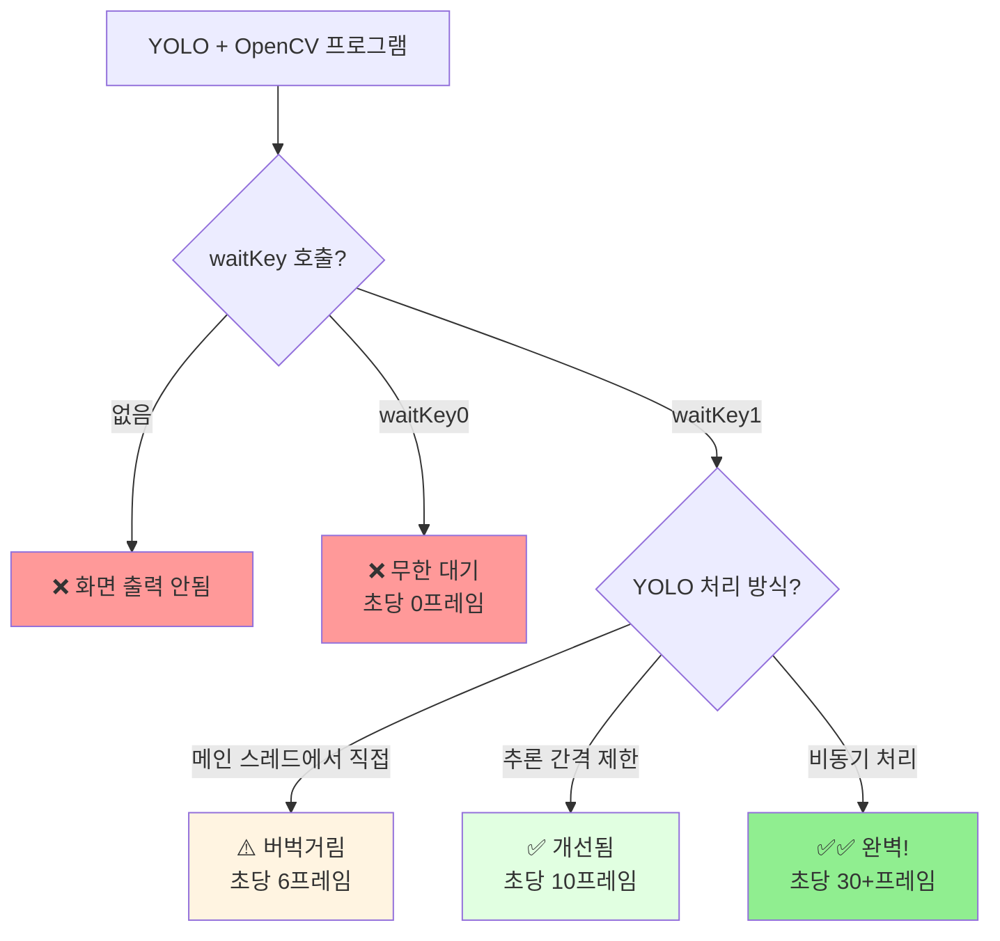

#### 📋 체크리스트

실시간 YOLO 프로그램을 만들 때 **반드시** 확인할 것:

- [ ] `cv2.waitKey(1)` 호출했는가?
- [ ] `& 0xFF` 비트 마스크 적용했는가?
- [ ] YOLO 추론이 메인 루프를 막고 있지 않은가?
- [ ] 프레임 속도가 목표치(최소 15 FPS)를 달성하는가?
- [ ] ESC 또는 'q' 키로 정상 종료되는가?

---

## 7. cv2.imshow() 사용 시 주의사항

### 7.1 문제 현상

> **질문**: "cv2.imshow() 함수를 사용할 때, yolo와 함께 사용할 때 출력되지 않았는데요. 현재는 돌아가는 소스인데요. 이 부분은 상관이 없을까요?"

### 7.2 원인 분석

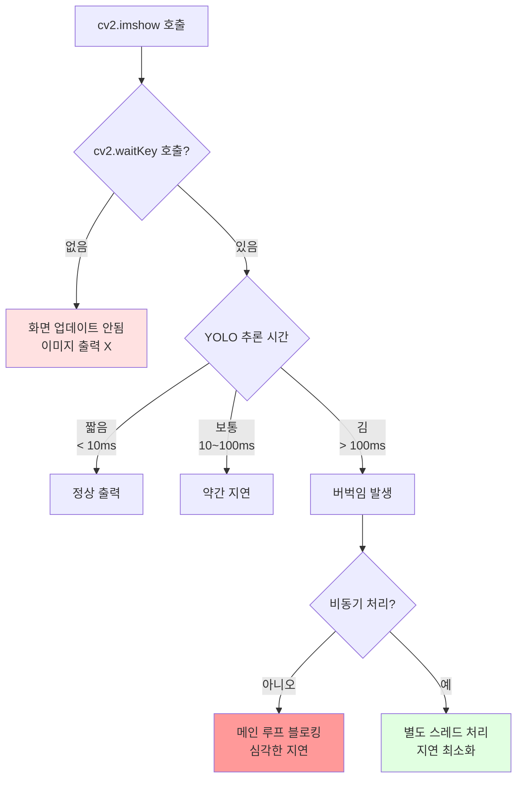

### 7.3 해결 방법 비교

| 방법 | 장점 | 단점 | 적용 여부 |
|------|------|------|-----------|
| **cv2.waitKey(1) 추가** | 간단한 구현 | YOLO가 느리면 버벅임 | ❌ 불충분 |
| **추론 주기 제한** | CPU 사용량 감소 | 일부 프레임 건너뜀 | ⚠️ 보조 수단 |
| **비동기 처리 (Worker Thread)** | 메인 루프 블로킹 없음 | 구현 복잡도 증가 | ✅ **채택** |
| **멀티프로세싱** | 완전한 병렬 처리 | 프레임 전달 오버헤드 | ❌ 과도함 |

### 7.4 프로젝트의 해결 방식

#### ✅ 올바른 사용 패턴

```python
# ========== 현재 프로젝트 코드 (정상 동작) ==========

# 1. 비동기 YOLO 러너 초기화 (별도 스레드에서 추론)
yolo_runner = YoloAsyncRunner(yolo_detector, infer_interval_s=0.01)

while True:
    # 2. 프레임 획득
    frame = camera.read()
    
    # 3. YOLO에 프레임 제출 (논블로킹)
    yolo_runner.submit_frame(frame)
    
    # 4. 완료된 결과만 폴링 (대기 없음)
    detections, triggers, yolo_raw_boxes, _ = yolo_runner.poll()
    
    # 5. 화면 출력 (메인 루프는 블로킹되지 않음)
    cv2.imshow(FRAME_WINDOW, display_frame)
    cv2.imshow(BINARY_WINDOW, debug_binary)
    
    # 6. 이벤트 처리 (반드시 필요!)
    key = cv2.waitKey(1) & 0xFF  # 1ms 대기
    if key in (27, ord('q')):
        break
```

#### ❌ 잘못된 사용 패턴

```python
# ========== 문제가 발생하는 코드 예시 ==========

while True:
    frame = camera.read()
    
    # 문제 1: 메인 스레드에서 직접 YOLO 추론 (블로킹)
    results = model(frame, imgsz=320, conf=0.5)
    # → 추론 중 메인 루프 멈춤 (100~200ms)
    
    cv2.imshow("frame", frame)
    # 문제 2: waitKey 호출 없음 → 화면 업데이트 안됨
    # 해결: cv2.waitKey(1) 추가 필요
```

### 7.5 정상 동작 확인 체크리스트

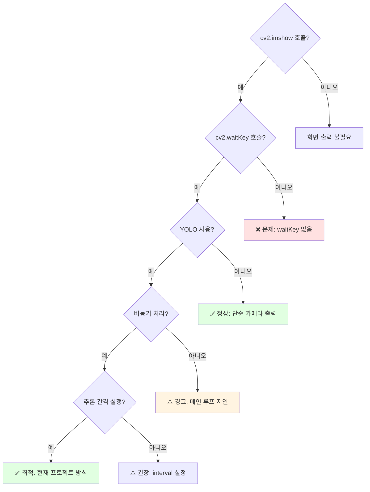

### 7.6 현재 소스의 안정성

#### ✅ 정상 동작 근거

| 항목 | 구현 여부 | 코드 위치 |
|------|-----------|-----------|
| **cv2.waitKey(1) 호출** | ✅ | `phase1_baseline.py:740` |
| **비동기 YOLO 처리** | ✅ | `YoloAsyncRunner` 클래스 사용 |
| **추론 간격 제한** | ✅ | `infer_interval_s=0.01` (10ms) |
| **프레임 큐 관리** | ✅ | 최신 프레임만 유지 |
| **윈도우 예외 처리** | ✅ | `cv2.error` catch 구문 |

#### 📌 핵심 코드 분석

```python
# phase1_baseline.py:737-760

# 화면 출력
cv2.imshow(FRAME_WINDOW, display_frame)
cv2.imshow(BINARY_WINDOW, debug_binary)

# 이벤트 루프 (반드시 필요!)
key = cv2.waitKey(1) & 0xFF  # ← 이 줄이 핵심!

# 윈도우 닫힘 감지
try:
    if cv2.getWindowProperty(FRAME_WINDOW, cv2.WND_PROP_VISIBLE) < 1:
        break
    if cv2.getWindowProperty(BINARY_WINDOW, cv2.WND_PROP_VISIBLE) < 1:
        break
except cv2.error:
    pass  # 윈도우 시스템 예외 무시

# 키 입력 처리
if key in (27, ord('q')):  # ESC 또는 q
    break
elif key == ord('s'):      # s: 모터 토글
    motors_enabled = not motors_enabled
elif key == 32:             # Space: 일시정지
    cv2.waitKey()
```

### 7.7 결론

> **답변**: 현재 소스는 **정상적으로 동작합니다**. 이전에 출력이 안 됐던 이유는 아마도:
> 1. `cv2.waitKey()` 호출이 누락되었거나
> 2. 메인 스레드에서 직접 YOLO 추론을 해서 블로킹이 발생했을 가능성이 높습니다.
>
> 현재 코드는 **비동기 처리 + 적절한 waitKey 호출**로 문제를 해결했습니다.

---

## 8. 설정 파라미터

### 8.1 YAML 설정 파일

```yaml
perception:
  yolo:
    enabled: true                  # YOLO 활성화 여부
    model: models/yolo/best.pt     # 모델 파일 경로
    imgsz: 320                     # 입력 이미지 크기
    conf: 0.5                      # 신뢰도 임계값
    infer_interval_s: 0.01         # 추론 간격 (초)
    confirm_frames: 2              # 연속 확인 프레임 수
    car_cooldown_s: 2.0            # 차량 감지 쿨다운
    min_area_ratio:                # 클래스별 최소 면적 비율
      red: 0.001
      green: 0.001
      oo: 0.020
      xx: 0.015
      car: 0.030
```

### 8.2 실시간 튜닝 (트랙바)

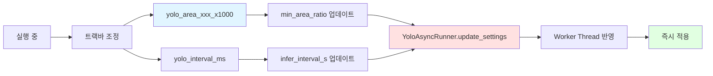

### 8.3 파라미터 튜닝 가이드

| 파라미터 | 증가 시 효과 | 감소 시 효과 | 권장 범위 |
|---------|-------------|-------------|-----------|
| **imgsz** | 정확도↑, 속도↓ | 정확도↓, 속도↑ | 320~640 |
| **conf** | 오탐↓, 미탐↑ | 오탐↑, 미탐↓ | 0.3~0.7 |
| **min_area_ratio** | 오탐↓, 미탐↑ | 오탐↑, 미탐↓ | 0.001~0.05 |
| **confirm_frames** | 안정성↑, 반응↓ | 안정성↓, 반응↑ | 2~5 |
| **cooldown_s** | 중복 방지↑, 반응↓ | 중복 방지↓, 반응↑ | 0.5~3.0 |
| **infer_interval_s** | CPU 사용↓, 지연↑ | CPU 사용↑, 지연↓ | 0.01~0.1 |

---

## 9. 전체 처리 흐름 요약

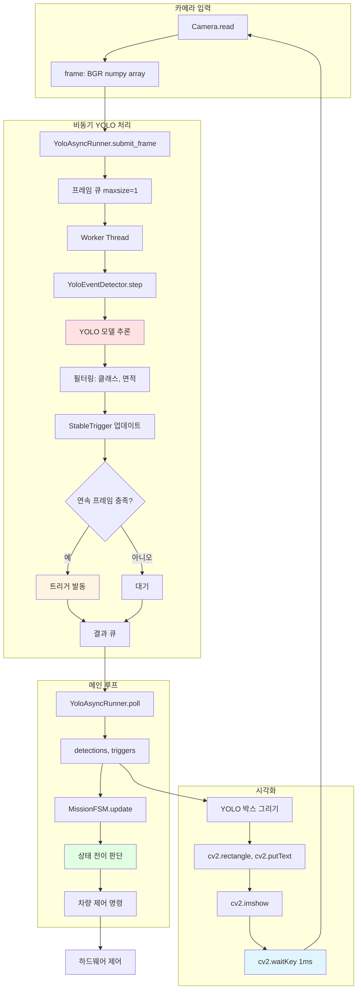

---

## 10. 참고 자료

### 10.1 주요 파일 위치

| 파일 | 설명 |
|------|------|
| `raspbot/perception/yolo_events.py` | YoloEventDetector, StableTrigger |
| `raspbot/perception/yolo_async.py` | YoloAsyncRunner (비동기 처리) |
| `raspbot/perception/yolo_stop_on_red.py` | 간단한 사용 예제 |
| `raspbot/runtime/phase1_baseline.py` | 전체 통합 런타임 |
| `configs/phase1_pid.yaml` | YOLO 설정 파일 |

### 10.2 Ultralytics YOLO 공식 문서

- 공식 문서: https://docs.ultralytics.com/
- Python API: https://docs.ultralytics.com/usage/python/
- 모델 훈련: https://docs.ultralytics.com/modes/train/

### 10.3 성능 최적화 팁

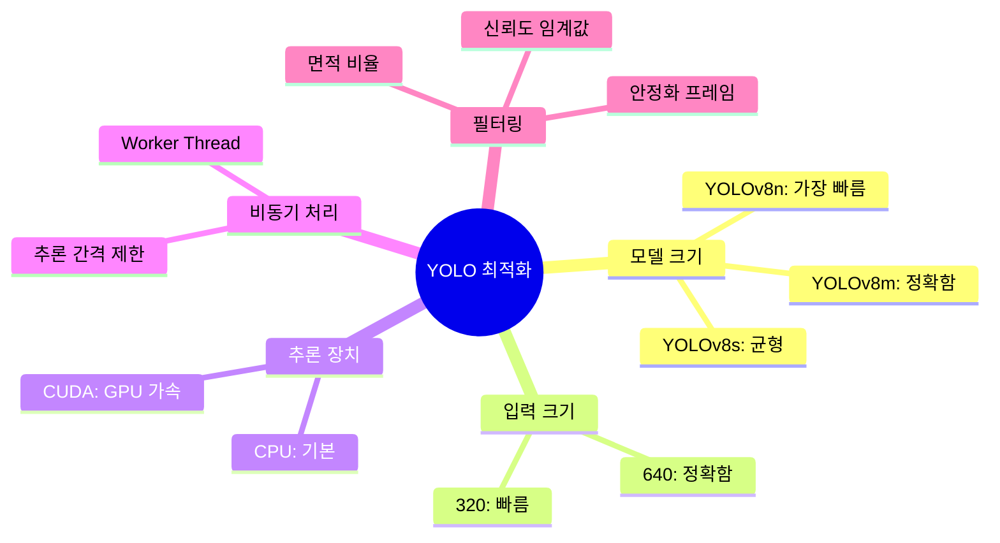

---

## 📝 작성 정보

- **작성일**: 2025-12-25
- **프로젝트**: 가천대학교 P실무 3조
- **YOLO 버전**: Ultralytics YOLOv8
- **Python 버전**: 3.7+
- **OpenCV 버전**: 4.x

---

## ❓ FAQ

### Q1. YOLO 추론 속도가 느립니다.

**A**: 다음을 시도해보세요:
1. `imgsz`를 320으로 낮추기
2. `infer_interval_s`를 0.05~0.1로 증가
3. GPU 사용 가능 시 `device='cuda'` 설정

### Q2. 오탐(False Positive)이 많습니다.

**A**: 다음 파라미터를 조정하세요:
1. `conf` 증가 (0.5 → 0.7)
2. `min_area_ratio` 증가
3. `confirm_frames` 증가 (2 → 4)

### Q3. 미탐(False Negative)이 발생합니다.

**A**: 다음 파라미터를 조정하세요:
1. `conf` 감소 (0.5 → 0.3)
2. `min_area_ratio` 감소
3. `confirm_frames` 감소 (3 → 1)

### Q4. cv2.imshow()가 출력되지 않습니다.

**A**: 다음을 확인하세요:
1. `cv2.waitKey(1)` 호출 여부 ← **가장 흔한 원인!**
2. `& 0xFF` 비트 마스크 적용 여부
3. `--headless` 플래그 사용 안 함
4. `show_windows: true` 설정 (YAML)
5. GUI 환경에서 실행 중인지 확인

**자세한 설명**: [섹션 6. Non-blocking 개념](#6-non-blocking-개념-완벽-이해-고등학생도-이해하는-설명) 참고

---

