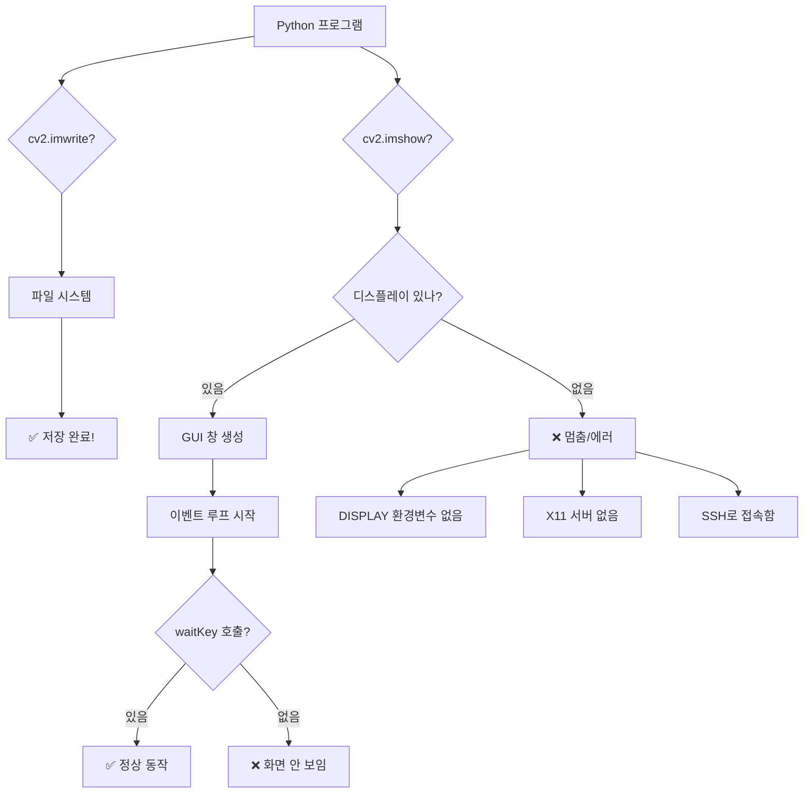
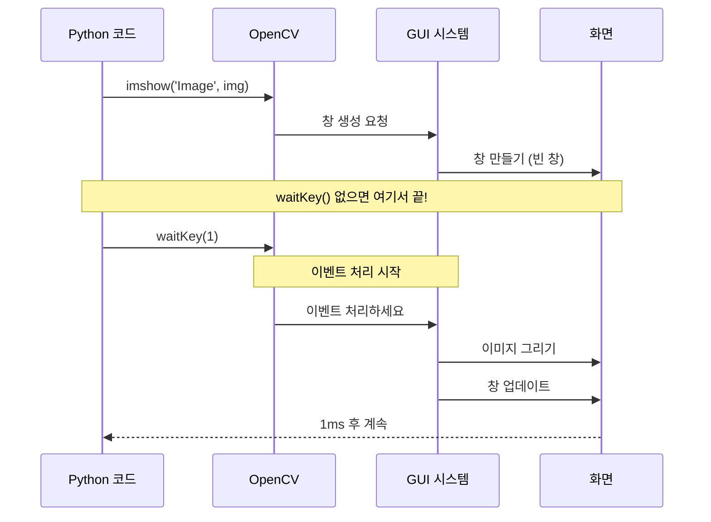

# 🚨 cv2.imshow() 무한 대기 문제 완벽 해결 가이드

> **왜 cv2.imwrite()는 되는데 cv2.imshow()는 멈출까?**

---

## 📋 목차

1. [문제 상황 정확히 이해하기](#1️⃣-문제-상황-정확히-이해하기)
2. [왜 이런 일이 발생하는가?](#2️⃣-왜-이런-일이-발생하는가)
3. [원인별 상세 분석](#3️⃣-원인별-상세-분석)
4. [해결 방법 (5가지)](#4️⃣-해결-방법-5가지)
5. [실전 코드 예시](#5️⃣-실전-코드-예시)
6. [환경별 체크리스트](#6️⃣-환경별-체크리스트)

---

## 1️⃣ 문제 상황 정확히 이해하기

### 🔍 증상

```python
import cv2
from ultralytics import YOLO

model = YOLO('best.pt')
image = cv2.imread('test.jpg')

# YOLO 추론
results = model(image)
annotated = results[0].plot()

# ✅ 이건 잘 됨!
cv2.imwrite('result.jpg', annotated)
print("저장 완료!")  # 이 메시지 출력됨

# ❌ 여기서 멈춤!
cv2.imshow('Result', annotated)
print("이 메시지는 출력 안 됨...")  # 실행 안 됨
cv2.waitKey(0)
```

**실행 결과:**
```bash
저장 완료!
(여기서 프로그램이 멈춤... 아무 반응 없음)
```

---

### 🤔 이상한 점

| 함수 | 동작 여부 | 의존성 |
|------|-----------|--------|
| `cv2.imwrite()` | ✅ **정상 동작** | 파일 시스템만 필요 |
| `cv2.imshow()` | ❌ **멈춤/에러** | GUI 디스플레이 필요 |

**핵심 차이:**
- `cv2.imwrite()`: 파일만 저장 (디스플레이 불필요)
- `cv2.imshow()`: 화면에 표시 (디스플레이 필수!)

---

## 2️⃣ 왜 이런 일이 발생하는가?

### 🎭 실생활 비유

#### 상황 1: 편지 쓰기 vs 전시하기

```
cv2.imwrite() = 편지를 봉투에 넣어서 우체통에 넣기
  ├─ 우체통만 있으면 됨 ✅
  └─ 사람이 볼 필요 없음

cv2.imshow() = 그림을 미술관에 전시하기
  ├─ 미술관이 있어야 함 ❌ (없으면 실패)
  ├─ 조명이 있어야 함 ❌
  └─ 관람객이 와야 의미 있음
```

---

### 🖥️ 컴퓨터 환경으로 이해하기



---

## 3️⃣ 원인별 상세 분석

### 🔴 원인 1: 디스플레이 환경이 없음 (가장 흔함!)

#### 상황
```
라즈베리파이에 SSH로 접속해서 실행
  ↓
모니터가 연결되어 있지 않음
  ↓
cv2.imshow()가 GUI 창을 만들려고 시도
  ↓
디스플레이를 찾을 수 없어서 멈춤 ❌
```

#### 확인 방법
```bash
# 터미널에서 확인
echo $DISPLAY

# 결과 1: 아무것도 안 나옴 → ❌ 디스플레이 없음!
# 결과 2: :0 또는 :1 → ✅ 디스플레이 있음

# Python에서 확인
import os
print("DISPLAY:", os.environ.get('DISPLAY'))
```

#### 상세 설명
```python
# imshow() 내부 동작 (의사 코드)
def imshow(window_name, image):
    # 1단계: 디스플레이 확인
    if not has_display():
        # ❌ 여기서 멈춤! (무한 대기 또는 에러)
        wait_forever()  # 또는 throw error
    
    # 2단계: GUI 창 생성 (여기까지 도달 못함)
    create_window(window_name)
    
    # 3단계: 이미지 표시
    show_image(image)
```

---

### 🟡 원인 2: waitKey()가 없음

#### 상황
```python
cv2.imshow('Image', img)
# waitKey()가 없음!
# 다음 줄로 바로 진행
print("다음 코드")  # 즉시 실행됨

# 문제: 창이 업데이트되지 않음
# 화면이 하얗게 보이거나 아무것도 안 보임
```

#### 왜 waitKey()가 필요한가?



**핵심:**
- `imshow()`는 창만 만듦 (내용은 안 그려짐)
- `waitKey()`가 호출되어야 이미지가 실제로 그려짐!
- `waitKey()`는 GUI 이벤트 루프를 돌림

---

### 🟠 원인 3: X11 포워딩 설정 안 됨

#### 상황
```bash
# 일반 SSH 접속 (X11 포워딩 없음)
ssh pi@192.168.1.100

# 프로그램 실행
python test.py
# → cv2.imshow()에서 멈춤 ❌
```

#### 해결 (X11 포워딩 활성화)
```bash
# -X 옵션으로 접속
ssh -X pi@192.168.1.100

# 또는 -Y 옵션 (더 안전하지 않지만 호환성 좋음)
ssh -Y pi@192.168.1.100

# 프로그램 실행
python test.py
# → cv2.imshow()가 로컬 컴퓨터에 표시됨 ✅
```

---

### 🔵 원인 4: OpenCV가 GUI 지원 없이 컴파일됨

#### 상황
```python
import cv2
print(cv2.getBuildInformation())

# 출력에서 GUI 관련 항목 확인:
# GTK:                         NO  ← ❌ GUI 지원 없음!
# QT:                          NO  ← ❌ GUI 지원 없음!
```

#### 확인 방법
```python
import cv2

# OpenCV 빌드 정보 확인
info = cv2.getBuildInformation()
print(info)

# GUI 백엔드 확인
if 'GTK' in info or 'QT' in info:
    print("✅ GUI 지원됨")
else:
    print("❌ GUI 지원 안 됨 - imshow() 사용 불가")
```

---

## 4️⃣ 해결 방법 (5가지)

### ✅ 방법 1: Headless 모드로 전환 (추천!)

**개념:** 화면 표시 대신 파일로 저장

```python
import cv2
from ultralytics import YOLO

model = YOLO('best.pt')
cap = cv2.VideoCapture(0)

while True:
    ret, frame = cap.read()
    if not ret:
        break
    
    # YOLO 추론
    results = model(frame, verbose=False)
    annotated = results[0].plot()
    
    # ❌ imshow() 사용 안 함!
    # cv2.imshow('Frame', annotated)
    
    # ✅ 파일로 저장
    cv2.imwrite('current_frame.jpg', annotated)
    
    # 또는 주기적으로 저장
    if frame_count % 30 == 0:  # 30프레임마다
        cv2.imwrite(f'frame_{frame_count}.jpg', annotated)
    
    # 종료 조건 (파일 체크 등)
    if os.path.exists('stop.txt'):
        break

cap.release()
```

**장점:**
- 디스플레이 없는 환경에서 작동 ✅
- SSH로 접속해도 사용 가능 ✅
- 안정적 ✅

**단점:**
- 실시간 확인 어려움
- 파일이 계속 쌓임

---

### ✅ 방법 2: 디스플레이 환경 체크 후 조건부 실행

```python
import cv2
import os

def has_display():
    """디스플레이가 있는지 확인"""
    return os.environ.get('DISPLAY') is not None

def safe_imshow(window_name, image):
    """안전한 imshow - 디스플레이 있을 때만 표시"""
    if has_display():
        cv2.imshow(window_name, image)
        return True
    else:
        print(f"[INFO] 디스플레이 없음. {window_name} 저장: temp.jpg")
        cv2.imwrite('temp.jpg', image)
        return False

# 사용 예시
cap = cv2.VideoCapture(0)

while True:
    ret, frame = cap.read()
    if not ret:
        break
    
    # YOLO 추론
    results = model(frame, verbose=False)
    annotated = results[0].plot()
    
    # 안전한 표시
    if safe_imshow('Frame', annotated):
        # 디스플레이 있음 - waitKey 사용
        key = cv2.waitKey(1)
        if key == ord('q'):
            break
    else:
        # 디스플레이 없음 - 다른 종료 조건
        if os.path.exists('stop.txt'):
            break
        time.sleep(0.1)  # CPU 부담 감소

cap.release()
if has_display():
    cv2.destroyAllWindows()
```

---

### ✅ 방법 3: Try-Except로 에러 처리

```python
import cv2

def show_or_save(window_name, image, save_path='result.jpg'):
    """
    imshow 시도, 실패하면 저장
    """
    try:
        cv2.imshow(window_name, image)
        key = cv2.waitKey(1)
        return key
    except cv2.error as e:
        print(f"[WARN] imshow 실패: {e}")
        print(f"[INFO] 대신 파일로 저장: {save_path}")
        cv2.imwrite(save_path, image)
        return -1

# 사용 예시
cap = cv2.VideoCapture(0)
frame_count = 0

while True:
    ret, frame = cap.read()
    if not ret:
        break
    
    frame_count += 1
    
    # 안전한 표시 또는 저장
    key = show_or_save('Frame', frame, f'frame_{frame_count}.jpg')
    
    if key == ord('q'):
        break
    
    # 다른 종료 조건
    if frame_count > 100:
        break

cap.release()
cv2.destroyAllWindows()
```

---

### ✅ 방법 4: 웹 스트리밍으로 전환 (고급)

```python
from flask import Flask, Response
import cv2

app = Flask(__name__)

def generate_frames():
    """프레임 생성기"""
    cap = cv2.VideoCapture(0)
    
    while True:
        ret, frame = cap.read()
        if not ret:
            break
        
        # YOLO 추론
        results = model(frame, verbose=False)
        annotated = results[0].plot()
        
        # JPEG로 인코딩
        ret, buffer = cv2.imencode('.jpg', annotated)
        frame_bytes = buffer.tobytes()
        
        # 스트리밍 형식으로 반환
        yield (b'--frame\r\n'
               b'Content-Type: image/jpeg\r\n\r\n' + frame_bytes + b'\r\n')
    
    cap.release()

@app.route('/video')
def video():
    """비디오 스트리밍 라우트"""
    return Response(
        generate_frames(),
        mimetype='multipart/x-mixed-replace; boundary=frame'
    )

@app.route('/')
def index():
    """메인 페이지"""
    return '''
    <html>
    <head><title>YOLO 실시간 스트리밍</title></head>
    <body>
        <h1>YOLO 객체 인식</h1>
        
    </body>
    </html>
    '''

if __name__ == '__main__':
    app.run(host='0.0.0.0', port=5000)
```

**사용 방법:**
```bash
# 라즈베리파이에서 실행
python stream_app.py

# 브라우저에서 접속
http://192.168.1.100:5000
```

**장점:**
- 어디서든 브라우저로 확인 가능 ✅
- 여러 사람이 동시에 볼 수 있음 ✅
- 전문적인 느낌 ✅

---

### ✅ 방법 5: VNC 또는 실제 모니터 연결

#### VNC 설정 (가상 디스플레이)

```bash
# 라즈베리파이에서 VNC 활성화
sudo raspi-config
# → Interfacing Options → VNC → Enable

# VNC 서버 시작
vncserver :1

# 환경 변수 설정
export DISPLAY=:1

# 이제 imshow() 사용 가능!
python test.py
```

#### 실제 모니터 연결
```
라즈베리파이에 HDMI 모니터 연결
  ↓
자동으로 DISPLAY=:0 설정됨
  ↓
imshow() 정상 작동 ✅
```

---

## 5️⃣ 실전 코드 예시

### 📝 예제 1: 자동 감지 및 전환

```python
"""
환경을 자동으로 감지하고 적절한 방법 선택
"""
import cv2
import os
import sys
from ultralytics import YOLO

class DisplayManager:
    """디스플레이 관리 클래스"""
    
    def __init__(self):
        self.has_display = self._check_display()
        self.mode = 'GUI' if self.has_display else 'Headless'
        print(f"[INFO] 실행 모드: {self.mode}")
    
    def _check_display(self):
        """디스플레이 확인"""
        # 방법 1: 환경 변수 확인
        if os.environ.get('DISPLAY') is None:
            return False
        
        # 방법 2: imshow 테스트
        try:
            test_img = cv2.imread('test.jpg')
            if test_img is None:
                # 테스트 이미지 생성
                import numpy as np
                test_img = np.zeros((100, 100, 3), dtype=np.uint8)
            
            cv2.imshow('test', test_img)
            cv2.waitKey(1)
            cv2.destroyWindow('test')
            return True
        except:
            return False
    
    def show(self, window_name, image, save_path=None):
        """
        환경에 맞게 표시 또는 저장
        
        Returns:
            key: 키 입력 (GUI 모드)
            -1: Headless 모드
        """
        if self.has_display:
            # GUI 모드
            cv2.imshow(window_name, image)
            return cv2.waitKey(1) & 0xFF
        else:
            # Headless 모드
            if save_path:
                cv2.imwrite(save_path, image)
            return -1
    
    def cleanup(self):
        """정리"""
        if self.has_display:
            cv2.destroyAllWindows()


def main():
    """메인 함수"""
    # 디스플레이 관리자 생성
    display = DisplayManager()
    
    # 모델 로드
    model = YOLO('best.pt')
    
    # 카메라 열기
    cap = cv2.VideoCapture(0)
    
    if not cap.isOpened():
        print("[ERROR] 카메라를 열 수 없습니다.")
        return
    
    print("[INFO] 카메라 작동 시작...")
    print("[INFO] 'q' 키를 누르거나 Ctrl+C로 종료")
    
    frame_count = 0
    
    try:
        while True:
            ret, frame = cap.read()
            if not ret:
                break
            
            frame_count += 1
            
            # YOLO 추론
            results = model(frame, verbose=False)
            annotated = results[0].plot()
            
            # 환경에 맞게 표시
            save_path = f'frame_{frame_count:04d}.jpg' if frame_count % 30 == 0 else None
            key = display.show('YOLO Detection', annotated, save_path)
            
            # 종료 조건
            if key == ord('q'):
                print("\n[INFO] 'q' 키 입력으로 종료")
                break
            
            # Headless 모드 종료 조건
            if not display.has_display:
                if os.path.exists('stop.txt'):
                    print("\n[INFO] stop.txt 파일 감지로 종료")
                    break
                if frame_count > 300:  # 300프레임 후 자동 종료
                    print("\n[INFO] 최대 프레임 도달로 종료")
                    break
    
    except KeyboardInterrupt:
        print("\n[INFO] Ctrl+C로 중단")
    
    finally:
        cap.release()
        display.cleanup()
        print(f"[INFO] 총 {frame_count} 프레임 처리 완료")


if __name__ == '__main__':
    main()
```

---

### 📝 예제 2: 간단한 Headless 버전

```python
"""
완전 Headless 버전 - imshow() 없이 작동
"""
import cv2
import time
from ultralytics import YOLO

def main():
    print("=" * 60)
    print("🤖 Headless YOLO Detection")
    print("=" * 60)
    print("\n[INFO] 디스플레이 없이 실행")
    print("[INFO] 결과는 파일로 저장됩니다")
    print("[INFO] 종료하려면 Ctrl+C 또는 'stop.txt' 파일 생성\n")
    
    # 모델 로드
    model = YOLO('best.pt')
    cap = cv2.VideoCapture(0)
    
    if not cap.isOpened():
        print("[ERROR] 카메라를 열 수 없습니다.")
        return
    
    frame_count = 0
    start_time = time.time()
    
    try:
        while True:
            ret, frame = cap.read()
            if not ret:
                break
            
            frame_count += 1
            
            # YOLO 추론
            results = model(frame, verbose=False)
            annotated = results[0].plot()
            
            # 현재 프레임 저장 (덮어쓰기)
            cv2.imwrite('current_frame.jpg', annotated)
            
            # 30프레임마다 별도 저장
            if frame_count % 30 == 0:
                timestamp = int(time.time())
                cv2.imwrite(f'detection_{timestamp}.jpg', annotated)
                
                # 통계 출력
                elapsed = time.time() - start_time
                fps = frame_count / elapsed
                print(f"[프레임 {frame_count:04d}] FPS: {fps:.2f} | 저장: detection_{timestamp}.jpg")
            
            # 종료 조건 체크
            if os.path.exists('stop.txt'):
                print("\n[INFO] stop.txt 감지 - 종료")
                break
            
            # CPU 부담 감소
            time.sleep(0.01)
    
    except KeyboardInterrupt:
        print("\n[INFO] Ctrl+C로 중단")
    
    finally:
        cap.release()
        elapsed = time.time() - start_time
        print(f"\n[완료] 총 {frame_count} 프레임, {elapsed:.2f}초, 평균 {frame_count/elapsed:.2f} FPS")


if __name__ == '__main__':
    import os
    # stop.txt 삭제 (이전 실행 종료 파일)
    if os.path.exists('stop.txt'):
        os.remove('stop.txt')
    
    main()
```

**종료 방법:**
```bash
# 다른 터미널에서
touch stop.txt

# 또는 Ctrl+C
```

---

## 6️⃣ 환경별 체크리스트

### 🖥️ 로컬 컴퓨터 (Windows/Mac/Linux with GUI)

```
✅ cv2.imshow() 사용 가능
✅ waitKey() 필수
✅ cv2.destroyAllWindows() 필수

확인 사항:
  □ 모니터 연결됨
  □ waitKey(1) 있음
  □ 예외 처리 있음
```

---

### 🔌 라즈베리파이 (모니터 연결)

```
✅ cv2.imshow() 사용 가능
✅ DISPLAY=:0 자동 설정

확인 사항:
  □ HDMI 모니터 연결
  □ 라즈베리파이 부팅 완료
  □ X11 실행 중
```

---

### 📡 라즈베리파이 (SSH 접속, 모니터 없음)

```
❌ cv2.imshow() 사용 불가
✅ Headless 모드 사용

권장 방법:
  □ 방법 1: 파일 저장 (cv2.imwrite)
  □ 방법 2: 웹 스트리밍 (Flask)
  □ 방법 3: VNC 사용
  
또는:
  □ ssh -X로 X11 포워딩 (느림)
```

---

### 🌐 원격 서버 (AWS/GCP 등)

```
❌ cv2.imshow() 사용 불가
✅ Headless 모드 필수

권장 방법:
  □ 파일 저장 후 다운로드
  □ S3/Cloud Storage 업로드
  □ 웹 스트리밍 서비스
```

---

## 📊 요약 비교표

| 환경 | imshow() 가능 | 권장 방법 | 대안 |
|------|---------------|-----------|------|
| **로컬 (GUI 있음)** | ✅ | imshow() + waitKey(1) | - |
| **라즈베리파이 + 모니터** | ✅ | imshow() + waitKey(1) | - |
| **라즈베리파이 + SSH** | ❌ | imwrite() | VNC, 웹 스트리밍 |
| **원격 서버** | ❌ | imwrite() | 웹 스트리밍, 클라우드 |
| **Docker 컨테이너** | ❌ | imwrite() | X11 포워딩 (복잡) |

---

## 💡 핵심 정리

### ❓ 왜 imwrite()는 되는데 imshow()는 안 되나?

```
imwrite() → 파일 시스템에 저장
  ├─ 디스플레이 필요 없음 ✅
  ├─ GUI 필요 없음 ✅
  └─ 어디서든 작동 ✅

imshow() → 화면에 표시
  ├─ 디스플레이 필요함 ❌
  ├─ GUI 시스템 필요함 ❌
  └─ DISPLAY 환경 변수 필요 ❌
```

### 🎯 해결 핵심

1. **환경 확인**
   ```python
   print("DISPLAY:", os.environ.get('DISPLAY'))
   ```

2. **조건부 사용**
   ```python
   if has_display():
       cv2.imshow('Image', img)
   else:
       cv2.imwrite('image.jpg', img)
   ```

3. **예외 처리**
   ```python
   try:
       cv2.imshow('Image', img)
   except:
       cv2.imwrite('image.jpg', img)
   ```

---

## 🔧 디버깅 스크립트

```python
"""
imshow() 문제 진단 스크립트
"""
import cv2
import os
import sys
import numpy as np

print("=" * 60)
print("🔍 cv2.imshow() 문제 진단")
print("=" * 60)

# 1. DISPLAY 환경 변수 확인
print("\n[1] DISPLAY 환경 변수 확인")
display = os.environ.get('DISPLAY')
print(f"   DISPLAY = {display if display else '❌ 없음'}")

# 2. OpenCV 버전
print("\n[2] OpenCV 버전")
print(f"   {cv2.__version__}")

# 3. GUI 백엔드 확인
print("\n[3] OpenCV 빌드 정보")
info = cv2.getBuildInformation()
for line in info.split('\n'):
    if 'GTK' in line or 'QT' in line or 'GUI' in line:
        print(f"   {line}")

# 4. imshow() 테스트
print("\n[4] imshow() 기능 테스트")
test_img = np.zeros((100, 100, 3), dtype=np.uint8)
test_img[:] = (0, 255, 0)  # 녹색

try:
    cv2.imshow('Test Window', test_img)
    print("   ✅ imshow() 호출 성공")
    
    cv2.waitKey(100)
    print("   ✅ waitKey() 성공")
    
    cv2.destroyAllWindows()
    print("   ✅ destroyAllWindows() 성공")
    
    print("\n결론: cv2.imshow()를 사용할 수 있습니다! ✅")
    
except Exception as e:
    print(f"   ❌ 에러 발생: {e}")
    print("\n결론: cv2.imshow()를 사용할 수 없습니다. ❌")
    print("      → Headless 모드를 사용하세요 (imwrite)")

# 5. 권장 사항
print("\n" + "=" * 60)
print("📝 권장 사항")
print("=" * 60)

if display:
    print("✅ GUI 환경 사용 가능")
    print("   → cv2.imshow() + cv2.waitKey(1) 사용")
else:
    print("❌ GUI 환경 없음 (Headless)")
    print("   → cv2.imwrite()로 파일 저장")
    print("   → 또는 웹 스트리밍 사용")

print("\n")
```

---

**작성일:** 2024년 12월  
**대상:** YOLO + OpenCV 사용자  
**난이도:** ⭐⭐⭐☆☆ (중급)

