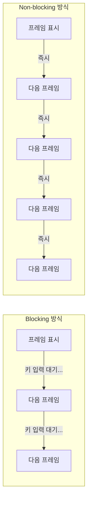

# 🎨 시각적 비교: Blocking vs Non-blocking

> 그림으로 쉽게 이해하는 Non-blocking 개념

---

## 📊 타임라인 비교

### ⏰ Blocking 방식의 시간 흐름

```
초 단위 타임라인:
┌─────────────────────────────────────────────────────────────┐
│ 시간(초) │    0    │    1    │    2    │    3    │    4    │
├─────────────────────────────────────────────────────────────┤
│          │         │         │         │         │         │
│ 프레임1  │ 읽기 ▓  │         │         │         │         │
│          │ AI ▓▓▓  │         │         │         │         │
│          │ 표시 ▓  │         │         │         │         │
│          │ 키대기  ⏸️⏸️⏸️⏸️⏸️⏸️⏸️⏸️⏸️⏸️⏸️⏸️⏸️⏸️⏸️⏸️⏸️⏸️⏸️⏸️│ (키 누를 때까지)
│          │         │         │         │         │         │
│ 프레임2  │         │         │         │    읽기▓│         │
│          │         │         │         │    AI▓▓▓│         │
│          │         │         │         │    표시▓│         │
│          │         │         │         │    키대기⏸️⏸️⏸️...│
└─────────────────────────────────────────────────────────────┘

총 프레임: 2개 (4초 동안)
평균 FPS: 0.5
```

**문제점:**
- ⏸️ 대부분의 시간을 "대기"하는 데 사용
- 사용자가 키를 누르지 않으면 아무 일도 안 일어남
- CPU는 놀고 있음 (자원 낭비)

---

### ⚡ Non-blocking 방식의 시간 흐름

```
초 단위 타임라인:
┌─────────────────────────────────────────────────────────────┐
│ 시간(초) │    0    │    1    │    2    │    3    │    4    │
├─────────────────────────────────────────────────────────────┤
│          │         │         │         │         │         │
│ 프레임1  │▓▓▓▓│    │         │         │         │         │
│ 프레임2  │    │▓▓▓▓│         │         │         │         │
│ 프레임3  │         │▓▓▓▓│    │         │         │         │
│ 프레임4  │         │    │▓▓▓▓│         │         │         │
│ 프레임5  │         │         │▓▓▓▓│    │         │         │
│ 프레임6  │         │         │    │▓▓▓▓│         │         │
│ 프레임7  │         │         │         │▓▓▓▓│    │         │
│ 프레임8  │         │         │         │    │▓▓▓▓│         │
│ 프레임9  │         │         │         │         │▓▓▓▓│    │
│ 프레임10 │         │         │         │         │    │▓▓▓▓│
│          │         │         │         │         │         │
│ 키체크   │✓│✓│✓│✓│✓│✓│✓│✓│✓│✓│✓│✓│✓│✓│✓│✓│✓│✓│✓│✓│  (1ms마다)
└─────────────────────────────────────────────────────────────┘

총 프레임: 약 40개 (4초 동안)
평균 FPS: 10
```

**장점:**
- 💨 계속해서 프레임 처리
- 키 체크는 1ms만 하고 바로 다음으로
- CPU를 효율적으로 사용
- **20배 더 많은 프레임 처리!**

---

## 🎭 상황별 비교

### 상황 1: 카메라 영상을 보면서 객체 찾기



**결과:**
- **Blocking**: 끊기고 답답함 😫
- **Non-blocking**: 부드럽고 쾌적함 😊

---

### 상황 2: 게임 개발

```
🎮 게임 루프:

Blocking 방식:
┌──────────────────────────────────────┐
│ 1. 적 이동                            │
│ 2. 사용자 입력 대기 ⏸️ (멈춤!)       │
│ 3. 화면 그리기 (대기 후)             │
│ 4. 충돌 체크 (대기 후)               │
└──────────────────────────────────────┘
결과: 적이 움직이다가 멈추는 현상

Non-blocking 방식:
┌──────────────────────────────────────┐
│ 1. 적 이동 (계속)                    │
│ 2. 사용자 입력 체크 (1ms) ✓         │
│ 3. 화면 그리기 (즉시)                │
│ 4. 충돌 체크 (즉시)                  │
│ 5. 다시 1번으로 (빠르게 반복)       │
└──────────────────────────────────────┘
결과: 모든 것이 부드럽게 동작
```

---

## 📈 성능 비교 그래프

### 프레임 처리량 비교

```
FPS (프레임/초)
     │
  30 ┤                                    ╔═══════════╗
     │                                    ║ Non-block ║
  25 ┤                              ╔═════╩═══════════╝
     │                              ║
  20 ┤                        ╔═════╝
     │                        ║
  15 ┤                  ╔═════╝
     │                  ║
  10 ┤            ╔═════╝
     │            ║
   5 ┤      ╔═════╝
     │      ║
   0 ┼──────╚────┬────┬────┬────┬────┬────> 시간(초)
     0      1    2    3    4    5    6
     
     ╔══════╗ Blocking: 평균 2 FPS
     ║      ║
     ╚══════╝
     
     Non-blocking: 평균 15-30 FPS
```

---

## 🔍 코드 구조 비교

### Blocking 코드 구조

```python
while True:
    ┌─────────────────────┐
    │ 1. 프레임 읽기      │  ← 빠름 (0.01초)
    └─────────────────────┘
             ↓
    ┌─────────────────────┐
    │ 2. AI 처리          │  ← 느림 (0.5초)
    │    verbose=True     │     로그 출력 때문에
    └─────────────────────┘
             ↓
    ┌─────────────────────┐
    │ 3. 화면 표시        │  ← 빠름 (0.01초)
    └─────────────────────┘
             ↓
    ┌─────────────────────┐
    │ 4. 키 대기          │  ← 💀 무한 대기!
    │    waitKey(0)       │     (프로그램 멈춤)
    └─────────────────────┘
             ↓
        (다시 1번으로)
        
총 소요: 0.52초 + 대기 시간
```

### Non-blocking 코드 구조

```python
while True:
    ┌─────────────────────┐
    │ 1. 프레임 읽기      │  ← 빠름 (0.01초)
    └─────────────────────┘
             ↓
    ┌─────────────────────┐
    │ 2. AI 처리          │  ← 빠름 (0.3초)
    │    verbose=False    │     로그 없음!
    └─────────────────────┘
             ↓
    ┌─────────────────────┐
    │ 3. 화면 표시        │  ← 빠름 (0.01초)
    └─────────────────────┘
             ↓
    ┌─────────────────────┐
    │ 4. 키 체크          │  ← ⚡ 1ms만!
    │    waitKey(1)       │     (바로 진행)
    └─────────────────────┘
             ↓
        (즉시 1번으로)
        
총 소요: 0.32초 (고정)
```

---

## 🎯 실전 예시: 자율주행 자동차

### Blocking 방식의 문제

```
자동차가 장애물을 향해 달리는 중...

카메라 → AI 분석 (0.5초) → 화면 표시 → 키 대기 (??초)
                                              ↓
                                         (차는 계속 전진!)
                                              ↓
                                         키를 누름
                                              ↓
                                    다음 프레임 처리 시작
                                              ↓
                                   이미 충돌했을 수도! 💥
```

**문제:** 대기 시간 동안 차는 계속 움직이는데 프로그램은 멈춰있음

---

### Non-blocking 방식의 해결

```
자동차가 장애물을 향해 달리는 중...

카메라 → AI 분석 (0.3초) → 화면 표시 → 키 체크 (0.001초)
   ↓                                          ↓
즉시 다음 프레임                          바로 다음으로
   ↓                                          ↓
장애물 감지!                              즉시 정지 명령
   ↓                                          ↓
0.3초 후 정지                            안전하게 멈춤 ✅
```

**해결:** 실시간으로 계속 감지하여 빠르게 반응

---

## 💡 핵심 개념 정리

### Blocking = 줄 서서 기다리기

```
은행 창구:
  
  당신 → 1번 창구 (업무 중) → 기다림 ⏳
                                  ↓
                            (다른 일 못함)
                                  ↓
                            업무 끝나면 다음
```

### Non-blocking = 번호표 받고 자유롭게

```
은행 번호표:
  
  당신 → 번호표 받음 → 자유롭게 활동 😊
           ↓              (쇼핑, 전화 등)
         123번              ↓
           ↓           가끔 확인 (1분마다)
         호출!             ↓
           ↓           내 번호면 가기
         창구로         ↓
                    효율적! ✨
```

---

## 🎓 단계별 이해

### Level 1: 기본 개념
- **Blocking**: 일이 끝날 때까지 기다림
- **Non-blocking**: 일 시작하고 다른 일 계속함

### Level 2: 코드 적용
- `waitKey(0)` → `waitKey(1)`
- `verbose=True` → `verbose=False`

### Level 3: 실전 활용
- 실시간 영상: Non-blocking 필수
- 게임 개발: Non-blocking 필수
- AI 로봇: Non-blocking 필수

### Level 4: 고급 개념
- 멀티스레딩 (Threading)
- 비동기 프로그래밍 (Asyncio)
- 이벤트 기반 프로그래밍

---

## 📊 요약 비교표

| 항목 | Blocking | Non-blocking |
|------|----------|--------------|
| **waitKey** | `0` (무한 대기) | `1` (1ms) |
| **verbose** | `True` (로그 출력) | `False` (조용함) |
| **프레임 업데이트** | 키 입력 시 | 계속 |
| **반응 속도** | 느림 (1초 이상) | 빠름 (0.001초) |
| **FPS** | 1-2 | 10-30 |
| **체감 속도** | 끊김 😫 | 부드러움 😊 |
| **CPU 활용** | 낮음 (대기) | 효율적 |
| **적합한 용도** | 정지 이미지 | 실시간 영상 |
| **사용자 경험** | 답답함 | 쾌적함 |
| **코드 복잡도** | 단순 | 단순 |

---

## 🚀 실습 추천

1. **blocking_example.py** 먼저 실행
   - 키를 눌러야 다음 프레임
   - 끊김 현상 체험

2. **nonblocking_example.py** 실행
   - 자동으로 부드러운 영상
   - 차이를 느껴보기

3. **comparison_test.py** 실행
   - 두 방식 직접 비교
   - 성능 차이 확인

---

**작성자:** AI 코딩 강사  
**난이도:** ⭐⭐☆☆☆ (초급-중급)  
**소요 시간:** 15분

