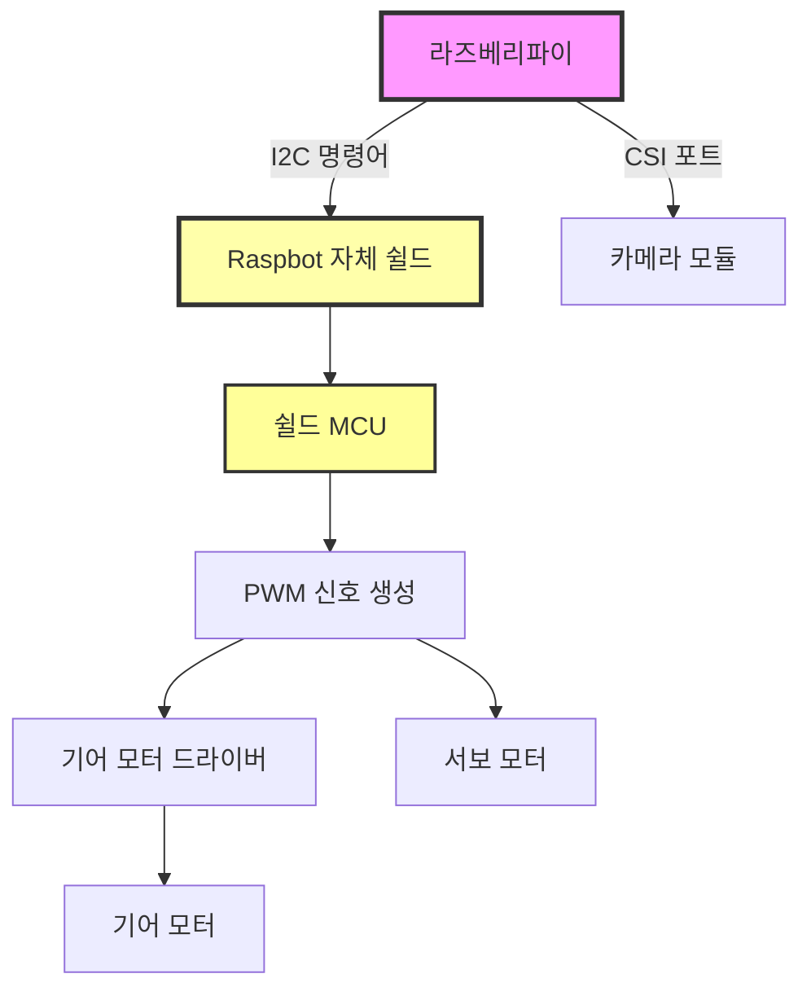
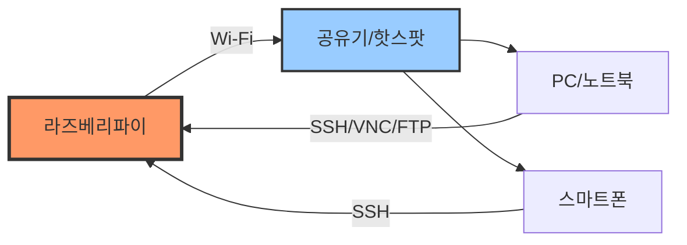
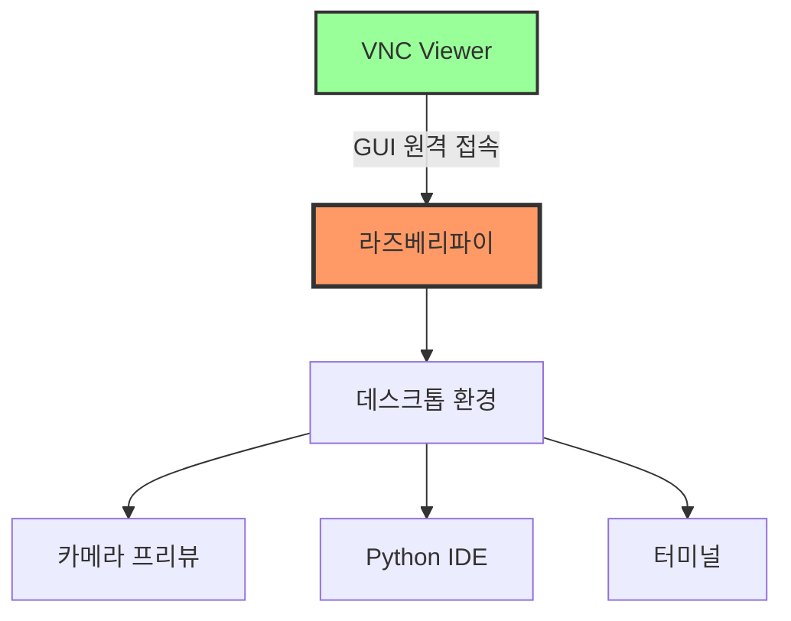
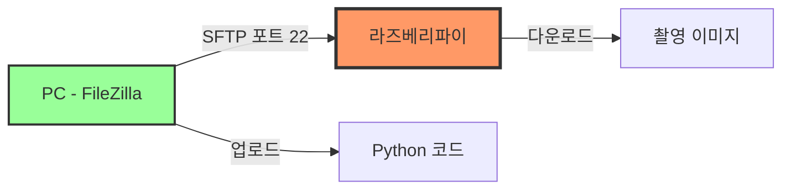
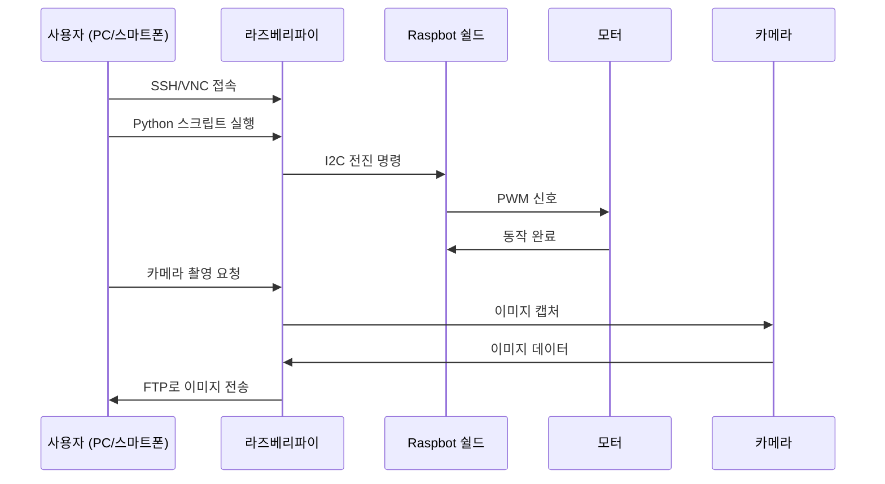
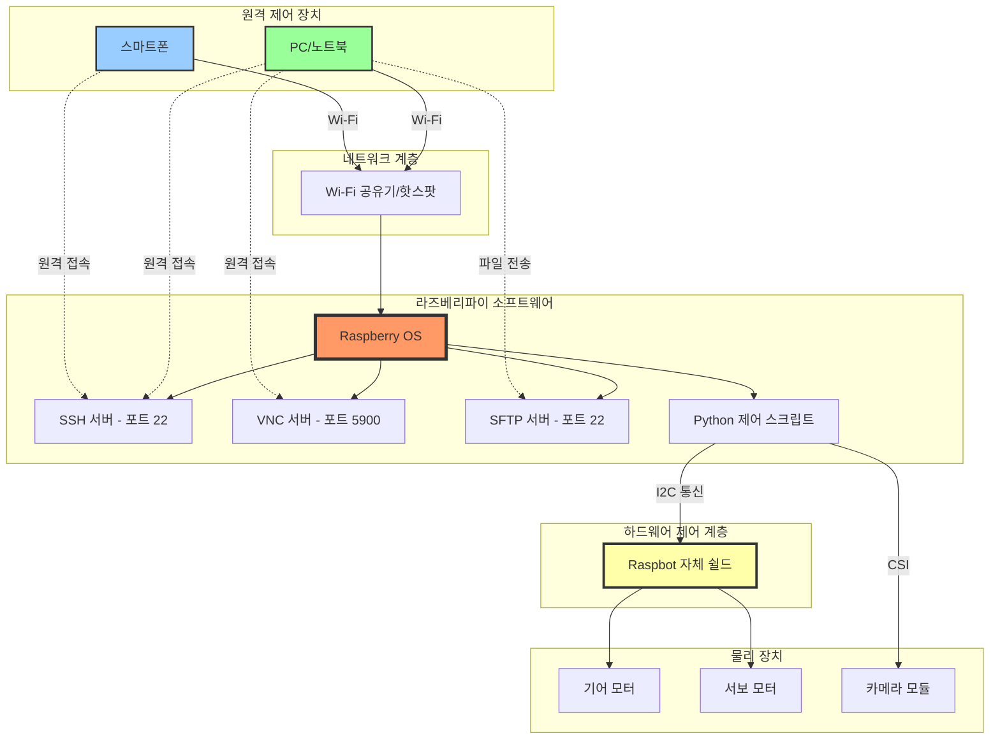

# 라즈베리파이 기반 자율주행 자동차 교육 결과 보고서

**교육 일시**: 2025년 12월 24일  
**교육 시간**: 4시간  
**교육 대상**: 라즈베리파이 기초 과정 수강생  
**교육 난이도**: 초급-중급

---

## 교육 개요

본 교육은 라즈베리파이를 활용한 자율 주행 자동차(Raspbot v2)의 조립과 원격 제어 환경 구축을 목표로 진행되었습니다. 하드웨어 조립부터 네트워크 설정, 원격 접속, 파일 전송까지 실무에 필요한 전반적인 IoT 개발 환경을 체험하는 실습 중심 교육으로 구성되었습니다.

---

## 1. 자율 주행 자동차 조립 (2시간)

### 목표
라즈봇 v2 하드웨어를 조립하고 I2C 통신 기반의 모터 제어 구조를 이해하여 자율 주행 자동차의 기본 플랫폼을 완성합니다.

### 주요 내용

#### 1.1 하드웨어 구성 요소 이해
- **라즈베리파이 본체**: 메인 컨트롤러로서 시스템 전체를 제어
- **Raspbot 자체 쉴드**: I2C 통신으로 모터를 제어하는 중간 계층
- **기어 모터 (x2)**: 좌우 바퀴 구동을 담당하며 전진, 후진, 회전 동작 수행
- **서보 모터**: 조향 장치로 각도 제어를 통한 방향 전환
- **카메라 모듈**: CSI 포트를 통해 영상 촬영 및 스트리밍
- **배터리 팩**: 시스템 전원 공급

#### 1.2 조립 과정 및 연결 방식
- 조립 매뉴얼에 따라 각 부품을 정확히 배치하고 나사로 고정
- Raspbot 자체 쉴드를 라즈베리파이 GPIO 핀에 장착
- 기어 모터와 서보 모터를 쉴드의 전용 커넥터에 연결
- 카메라 모듈을 CSI 포트에 장착
- 배터리 팩을 연결하고 전원 공급 테스트 수행

#### 1.3 I2C 통신 기반 제어 구조 이해
라즈베리파이는 GPIO를 통해 모터를 직접 제어하지 않고, I2C 통신으로 Raspbot 쉴드에 명령을 전달하는 구조입니다.



#### 1.4 I2C 통신의 특징
- **버스 통신 방식**: SDA(데이터)와 SCL(클럭) 2개의 선으로 여러 장치와 통신 가능
- **주소 기반 통신**: 각 장치는 고유한 I2C 주소를 가지며 선택적으로 통신
- **미리 정의된 명령어**: 전진, 후진, 좌회전, 우회전, 정지 등의 명령어를 간단히 전송
- **안정적인 제어**: GPIO 직접 제어보다 프로그래밍이 간편하고 안정적

### 교육 결과
- 수강생 전원이 라즈봇 v2 조립을 성공적으로 완료
- 각 부품의 역할과 연결 방식을 명확히 이해
- I2C 통신 기반 제어 구조의 장점과 동작 원리를 학습
- 전원 공급 후 하드웨어 정상 작동 확인 완료

---

## 2. 개발 환경 셋팅 (1시간 30분)

### 목표
원격 개발 환경을 구축하여 네트워크를 통한 라즈베리파이 제어, 파일 전송, GUI 접속 등 실무 개발에 필요한 환경을 완성합니다.

### 주요 내용

#### 2.1 네트워크 연결 설정 (20분)

**Wifi 및 핫스팟 연결**
- `raspi-config`를 통한 Wi-Fi 네트워크 설정
- 로컬 네트워크에 라즈베리파이 연결
- `hostname -I` 명령어로 IP 주소 확인
- SSH 및 I2C 인터페이스 활성화

**네트워크 구조**


#### 2.2 원격 제어 환경 구축 (30분)

**SSH 원격 접속**
- 스마트폰에 SSH 클라이언트 앱 설치 (Termius, JuiceSSH)
- 라즈베리파이 IP 주소로 SSH 접속
- 터미널 명령어를 통한 시스템 제어 확인

**I2C 장치 설정 및 모터 테스트**
```bash
# I2C 도구 설치
sudo apt install -y i2c-tools python3-smbus

# I2C 장치 스캔 (Raspbot 쉴드 주소 확인)
i2cdetect -y 1
```

**모터 및 카메라 동작 테스트**
- Python 스크립트를 통한 I2C 명령어 전송
- 기어 모터: 전진, 후진, 좌회전, 우회전 동작 확인
- 서보 모터: 각도 조정 (0도, 90도, 180도) 테스트
- 카메라: 사진 촬영 명령어 실행 및 이미지 저장 확인

```python
# I2C 기반 모터 제어 예시
from raspbot import RaspBot
bot = RaspBot()

bot.move_forward(speed=50)  # 전진
bot.turn_left(speed=40)      # 좌회전
bot.stop()                   # 정지
bot.set_servo_angle(90)      # 서보 각도 설정
```

#### 2.3 VNC 연결 - 카메라 GUI 테스트 (20분)

**VNC 서버 활성화**
- `raspi-config`에서 VNC 서버 활성화
- PC/스마트폰에 VNC Viewer 설치
- 라즈베리파이 IP 주소로 GUI 원격 접속

**카메라 실시간 모니터링**
- VNC를 통한 라즈베리파이 데스크톱 환경 접속
- 카메라 프리뷰를 실시간으로 확인
- 카메라 각도 및 해상도 설정 조정
- Python IDE(Thonny)를 통한 코드 실행 테스트



**VNC vs SSH 비교**
- **VNC**: GUI 기반, 시각적 작업에 적합, 카메라 확인 용이, 네트워크 부하 높음
- **SSH**: CLI 기반, 명령어 실행에 최적화, 빠르고 가벼움, 스크립트 제어에 적합

#### 2.4 FTP 연결 - FileZilla 파일 전송 (20분)

**SFTP 연결 설정**
FileZilla를 사용하여 라즈베리파이와 안전한 파일 전송 환경 구축
- 호스트: 라즈베리파이 IP 주소
- 프로토콜: SFTP
- 포트: 22
- 사용자명/비밀번호: 라즈베리파이 계정 정보

**파일 전송 실습**
- **업로드**: Python 제어 스크립트, 설정 파일, 라이브러리 파일
- **다운로드**: 카메라로 촬영한 이미지, 로그 파일, 데이터 파일
- 원격 디렉토리 구조 탐색 및 폴더 생성
- 업로드한 Python 스크립트에 실행 권한 부여 (`chmod +x`)



### 교육 결과
- 모든 수강생이 Wi-Fi 네트워크 연결 및 IP 주소 확인 완료
- SSH를 통한 원격 명령어 실행 및 모터 제어 성공
- VNC 연결을 통해 실시간 카메라 영상 확인 완료
- FileZilla를 이용한 양방향 파일 전송 실습 완료
- 원격 개발 환경 구축을 통한 실무 역량 향상

---

## 3. 통합 제어 실습 (30분)

### 목표
원격 환경에서 모터, 서보, 카메라를 통합 제어하여 실제 자율 주행 자동차의 기본 동작을 구현합니다.

### 주요 내용

#### 3.1 원격 통합 제어 시퀀스



#### 3.2 I2C 명령어 체계

| 동작 | 명령어 개념 | 설명 |
|------|-------------|------|
| 전진 | `MOVE_FORWARD` | 양쪽 모터 정방향 회전 |
| 후진 | `MOVE_BACKWARD` | 양쪽 모터 역방향 회전 |
| 좌회전 | `TURN_LEFT` | 좌측 모터 감속/우측 가속 |
| 우회전 | `TURN_RIGHT` | 우측 모터 감속/좌측 가속 |
| 정지 | `STOP` | 모든 모터 정지 |
| 서보 각도 | `SET_SERVO_ANGLE` | 0-180도 각도 설정 |

#### 3.3 실습 시나리오
1. SSH로 라즈베리파이 접속
2. I2C 장치 감지 확인 (`i2cdetect -y 1`)
3. Python 스크립트 실행하여 전진 → 좌회전 → 정지 동작
4. VNC로 카메라 실시간 확인
5. 촬영된 이미지를 FileZilla로 PC에 전송

### 교육 결과
- 원격 환경에서 모터, 서보, 카메라 통합 제어 성공
- I2C 통신 기반 명령어 체계 이해 및 활용
- 실제 자율 주행 자동차의 기본 동작 원리 체득

---

## 전체 시스템 아키텍처



---

## 교육 성과 및 평가

### 주요 성과
1. **하드웨어 이해도 향상**: 라즈봇 v2의 구조와 I2C 통신 기반 제어 방식 습득
2. **실무 개발 환경 구축**: SSH, VNC, FTP를 활용한 원격 개발 환경 완성
3. **통합 제어 능력**: 모터, 서보, 카메라를 통합적으로 제어하는 실습 완료
4. **문제 해결 능력**: 네트워크 설정, I2C 장치 인식 등 실습 중 발생한 문제 해결

### 핵심 학습 내용
- **I2C 통신**: 라즈베리파이와 모터 쉴드 간 효율적인 통신 방식 이해
- **원격 제어**: 네트워크를 통한 다양한 접속 방법 (SSH, VNC, SFTP) 활용
- **임베디드 시스템**: 라즈베리파이 기반 IoT 시스템의 전반적인 구조 파악
- **실습 중심 학습**: 이론보다 직접 조립하고 테스트하며 체득

### 활용 가능 분야
- 자율 주행 로봇 개발
- IoT 기반 원격 제어 시스템
- 컴퓨터 비전 및 영상 처리
- 임베디드 리눅스 시스템 개발

---

## 참고 자료

### 공식 문서
- Raspberry Pi 공식 문서: https://www.raspberrypi.org/documentation/
- I2C 통신 가이드: https://learn.sparkfun.com/tutorials/i2c
- GPIO 핀아웃: https://pinout.xyz/

### 원격 접속 도구
- VNC Viewer: https://www.realvnc.com/
- FileZilla: https://filezilla-project.org/
- Termius (모바일 SSH): https://termius.com/

### 주요 명령어 요약
```bash
# 네트워크 확인
hostname -I
ifconfig

# SSH/I2C/VNC 활성화
sudo raspi-config

# I2C 장치 스캔
i2cdetect -y 1

# 카메라 촬영
libcamera-still -o test.jpg
```

---

## 결론

본 4시간 교육을 통해 수강생들은 라즈베리파이 기반 자율 주행 자동차의 하드웨어 조립부터 원격 제어 환경 구축까지 실무에 필요한 전반적인 기술을 습득했습니다. 특히 I2C 통신 기반의 모터 제어 구조를 이해함으로써 복잡한 GPIO 제어 없이도 효율적으로 하드웨어를 다룰 수 있는 능력을 배양했습니다.

SSH, VNC, FTP 등 다양한 원격 접속 방법을 실습하며 실제 개발 환경에서 요구되는 원격 작업 능력을 갖추었고, 이는 향후 IoT 및 임베디드 시스템 개발에 있어 중요한 기초 역량이 될 것입니다.

실습 중심의 교육 방식을 통해 이론적 지식을 실제로 구현하고 검증하는 경험을 제공했으며, 발생한 문제들을 직접 해결하면서 실무 대응 능력도 함께 향상시켰습니다.

---

**작성일**: 2025년 12월 24일  
**교육 기관**: 가천대학교  
**보고서 작성자**: P-실무 과정

