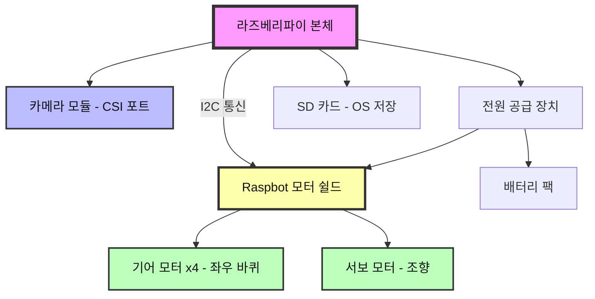
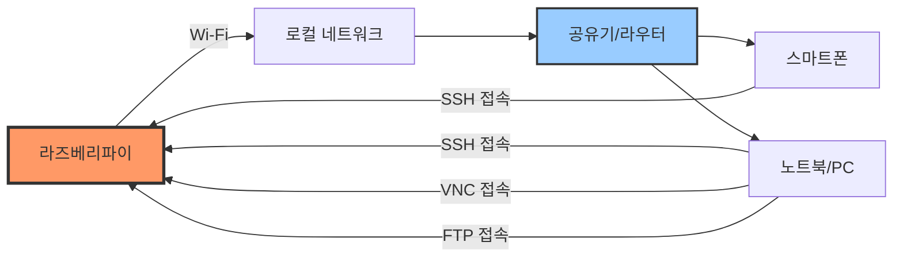
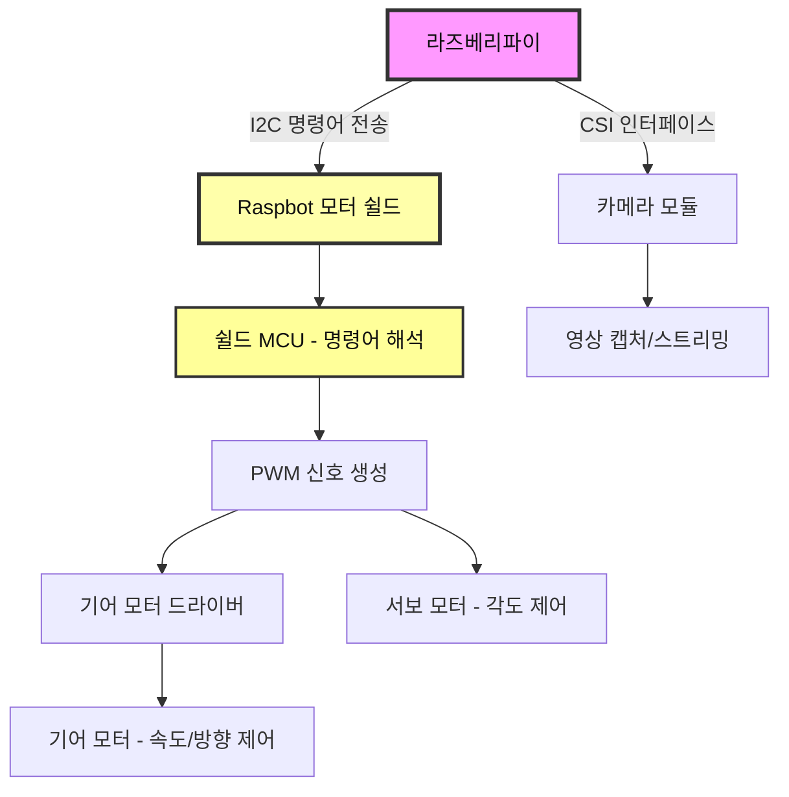
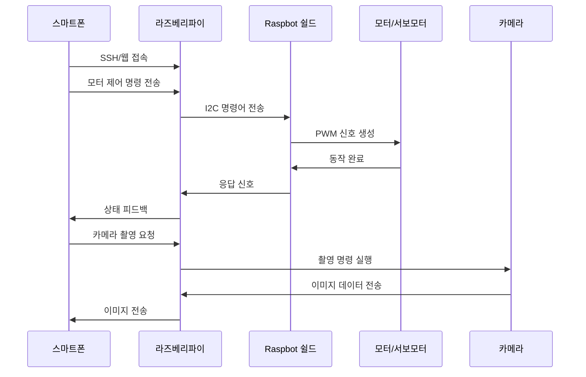
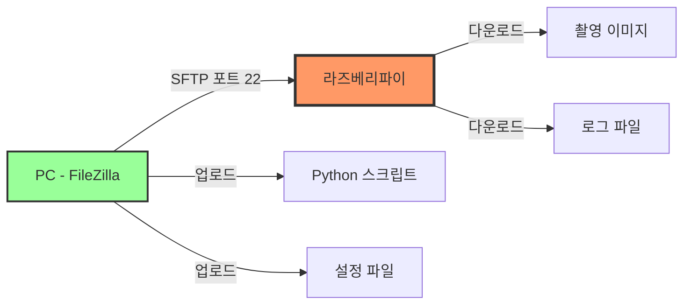
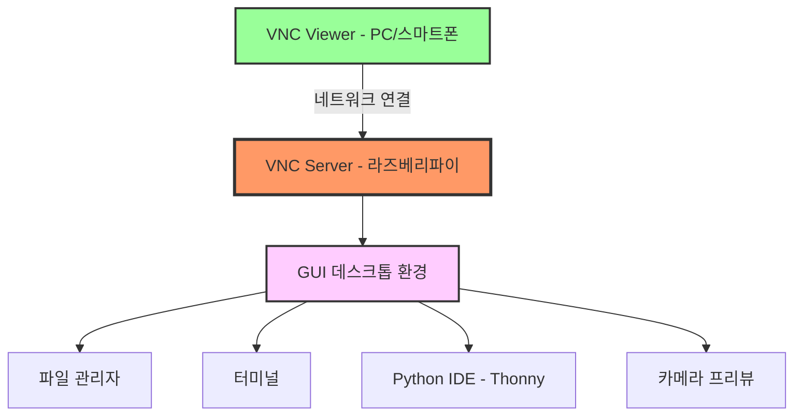
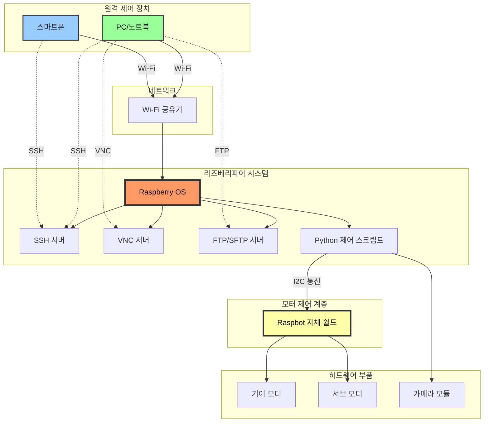

# 라즈베리파이 실습 정리 (4시간 수업)

## 1. 라즈봇 v2 조립하기

### 목표
라즈봇 v2 하드웨어를 정확히 조립하여 자율 주행 자동차의 기본 플랫폼을 완성하고, 각 부품의 연결 상태를 확인.

### 성과
- **하드웨어 구성 이해**: 라즈봇 v2의 주요 부품(라즈베리파이, 기어 모터, 서보 모터, 카메라 모듈, 배터리 팩 등)의 역할과 위치를 파악했습니다.
- **조립 과정 실습**: 각 부품을 조립 매뉴얼에 따라 정확히 연결하고, 전선 배선 및 나사 고정을 통해 안정적인 구조를 완성했습니다.
- **GPIO 핀 연결 확인**: 기어 모터와 서보 모터를 라즈봇 모터 쉴드 핀에 올바르게 연결하고, 카메라 모듈을 CSI 포트에 장착하여 하드웨어 연결 상태를 점검했습니다.
- **전원 공급 테스트**: 배터리 팩을 연결하고 전원이 정상적으로 공급되는지 확인하여 안전한 동작 환경을 구축했습니다.

### 하드웨어 구조도



---

## 2. Raspberry OS 네트워크 및 부품 작동 방식 이해하기

### 목표
Raspberry OS의 네트워크 설정을 완료하고, 연결된 부품들의 작동 원리를 이해하여 시스템 전체의 통신 구조를 파악.

### 성과
- **네트워크 설정 완료**: Wi-Fi 연결 설정을 통해 라즈베리파이를 로컬 네트워크에 연결하고, IP 주소를 확인하여 원격 접속 환경을 준비했습니다.
- **SSH 활성화**: `raspi-config` 명령어를 통해 SSH를 활성화하고, 터미널을 통한 원격 접속 기능을 테스트했습니다.
- **부품 작동 원리 학습**: 
  - **I2C 통신 이해**: 라즈베리파이와 Raspbot 모터 쉴드 간 I2C(Inter-Integrated Circuit) 통신 방식을 이해하고, 시리얼 통신을 통한 명령어 전송 구조를 학습했습니다.
  - **기어 모터 제어**: Raspbot 쉴드가 미리 정의한 명령어를 I2C로 전송하여 모터의 속도와 방향을 제어하는 방식을 익혔습니다.
  - **서보 모터 제어**: I2C 명령어를 통해 서보 모터의 각도를 조정하는 방식을 이해했습니다.
  - **카메라 모듈**: 영상 촬영 및 스트리밍 방식을 이해했습니다.
- **시스템 패키지 업데이트**: `sudo apt update && sudo apt upgrade` 명령어로 시스템을 최신 상태로 유지하는 방법을 실습했습니다.

### 네트워크 연결 구조도



### 부품 작동 방식 (I2C 통신 기반)



### I2C 통신 특징
- **버스 통신**: 2개의 선(SDA: 데이터, SCL: 클럭)만으로 여러 장치와 통신 가능
- **주소 기반**: 각 장치는 고유한 I2C 주소를 가지며, Raspbot 쉴드는 특정 주소로 설정됨
- **명령어 기반 제어**: 미리 정의된 명령어 코드를 전송하여 모터를 제어 (예: 전진, 후진, 회전 등)
- **간편한 연결**: GPIO 직접 제어보다 프로그래밍이 간단하고 안정적

---

## 3. 스마트폰으로 원격 조정하기

### 목표
스마트폰 앱을 활용하여 라즈봇의 모터, 서보모터, 카메라를 원격으로 제어하고, 실시간 동작을 확인.

### 성과
- **SSH 앱 연결**: 스마트폰에 SSH 클라이언트 앱(예: Termius, JuiceSSH)을 설치하고, 라즈베리파이에 원격 접속하여 명령어를 실행했습니다.
- **I2C 통신 설정**: `i2c-tools`를 설치하고 I2C 장치를 감지하여 Raspbot 쉴드와의 통신을 확인했습니다.
- **기어 모터 제어 테스트**: Python 스크립트를 통해 I2C 명령어로 기어 모터를 제어하고, 전진, 후진, 좌회전, 우회전 동작을 테스트했습니다.
  - Raspbot 라이브러리의 미리 정의된 함수(예: `move_forward()`, `turn_left()`)를 사용하여 모터를 제어하는 방법을 실습했습니다.
- **서보 모터 제어 테스트**: I2C 명령어를 통해 서보 모터의 각도를 조정하여 조향 기능을 확인했습니다.
- **카메라 동작 확인**: `raspistill` 또는 `libcamera-still` 명령어로 사진을 촬영하고, 스마트폰으로 파일을 확인하여 카메라의 정상 작동을 점검했습니다.
- **웹 기반 제어 인터페이스**: Flask 또는 간단한 웹 서버를 구동하여 스마트폰 브라우저를 통해 라즈봇을 제어하는 방법을 학습했습니다.

### 원격 제어 흐름도



### 제어 가능 항목

| 부품 | 제어 항목 | 사용 기술 |
|------|-----------|-----------|
| 기어 모터 | 속도, 방향 (전진/후진/회전) | I2C 통신 + 미리 정의된 명령어 |
| 서보 모터 | 각도 (0-180도) | I2C 통신 + 각도 명령어 |
| 카메라 | 사진 촬영, 동영상 녹화 | raspistill, libcamera |

### I2C 명령어 예시
| 동작 | 명령어 개념 | 설명 |
|------|-------------|------|
| 전진 | `MOVE_FORWARD` | 양쪽 모터 정방향 회전 |
| 후진 | `MOVE_BACKWARD` | 양쪽 모터 역방향 회전 |
| 좌회전 | `TURN_LEFT` | 좌측 모터 감속/우측 모터 가속 |
| 우회전 | `TURN_RIGHT` | 우측 모터 감속/좌측 모터 가속 |
| 정지 | `STOP` | 모든 모터 정지 |
| 서보 각도 | `SET_SERVO_ANGLE` | 서보 모터 각도 설정 (0-180) |

---

## 4. FTP 파일 전송 테스트 (파일질라)

### 목표
FileZilla FTP 클라이언트를 사용하여 라즈베리파이와 PC 간 파일을 안정적으로 전송하고, 파일 시스템 관리 능력을 향상.

### 성과
- **SFTP 서버 설정**: 라즈베리파이에서 SSH 서비스가 활성화되어 있으면 자동으로 SFTP를 사용할 수 있음을 확인했습니다.
- **FileZilla 연결 설정**: 
  - 호스트: 라즈베리파이 IP 주소
  - 사용자명: `pi` (기본 사용자)
  - 비밀번호: 설정한 비밀번호
  - 포트: 22 (SFTP)
- **파일 업로드/다운로드 테스트**: Python 스크립트, 이미지 파일, 설정 파일 등을 라즈베리파이로 전송하고, 촬영한 사진을 PC로 다운로드하여 파일 전송의 안정성을 확인했습니다.
- **디렉토리 관리**: 원격 파일 시스템의 디렉토리 구조를 파악하고, 필요한 폴더를 생성하여 프로젝트 파일을 체계적으로 관리하는 방법을 익혔습니다.
- **권한 설정**: 업로드한 Python 스크립트에 실행 권한(`chmod +x`)을 부여하여 직접 실행 가능하도록 설정했습니다.

### FTP 연결 구조



### 전송 가능 파일 유형
- **업로드**: Python 코드, 설정 파일, 라이브러리, 이미지 리소스
- **다운로드**: 촬영된 사진/영상, 로그 파일, 데이터 파일

---

## 5. VNC 연결하기 (원격 전송)

### 목표
VNC를 통해 라즈베리파이의 GUI 환경에 원격으로 접속하여 실시간으로 화면을 확인하고, 그래픽 기반 작업을 수행.

### 성과
- **VNC 서버 활성화**: `raspi-config`에서 VNC 서버를 활성화하고, 라즈베리파이가 VNC 연결을 수신할 수 있도록 설정했습니다.
- **VNC Viewer 설치 및 연결**: 
  - PC 또는 스마트폰에 VNC Viewer를 설치했습니다.
  - 라즈베리파이의 IP 주소를 입력하여 원격 데스크톱 연결을 수립했습니다.
- **GUI 환경 제어**: 원격으로 라즈베리파이의 데스크톱 환경에 접속하여 파일 탐색, 터미널 실행, 애플리케이션 실행 등을 수행했습니다.
- **실시간 카메라 모니터링**: VNC를 통해 카메라 프리뷰를 실시간으로 확인하고, 카메라 각도 및 설정을 조정했습니다.
- **코드 디버깅**: Python IDE(Thonny)를 원격으로 실행하여 코드를 작성하고 디버깅하는 방법을 실습했습니다.
- **네트워크 안정성 확인**: VNC 연결의 화질 설정을 조정하고, 네트워크 대역폭에 따른 최적의 설정을 찾았습니다.

### VNC 연결 구조



### VNC vs SSH 비교

| 구분 | VNC | SSH |
|------|-----|-----|
| 인터페이스 | GUI (그래픽) | CLI (명령줄) |
| 네트워크 부하 | 높음 | 낮음 |
| 사용 용도 | 시각적 작업, 카메라 확인 | 명령어 실행, 스크립트 제어 |
| 포트 | 5900 | 22 |
| 장점 | 직관적, 실시간 모니터링 | 빠름, 가벼움 |

---

## 전체 시스템 구조도



---

## 실습 체크리스트

### 하드웨어 조립
- [ ] 라즈봇 v2 조립 완료
- [ ] Raspbot 모터 쉴드 장착 확인
- [ ] 모터 쉴드에 기어/서보 모터 연결
- [ ] 전원 공급 테스트
- [ ] 각 부품 고정 상태 확인

### 네트워크 설정
- [ ] Wi-Fi 연결 완료
- [ ] IP 주소 확인
- [ ] SSH 활성화
- [ ] VNC 활성화
- [ ] I2C 인터페이스 활성화 (`raspi-config`)

### 원격 제어 테스트
- [ ] 스마트폰 SSH 접속 성공
- [ ] 기어 모터 제어 확인
- [ ] 서보 모터 제어 확인
- [ ] 카메라 촬영 확인

### 파일 전송
- [ ] FileZilla 연결 성공
- [ ] 파일 업로드 테스트
- [ ] 파일 다운로드 테스트
- [ ] 권한 설정 완료

### GUI 원격 접속
- [ ] VNC Viewer 설치
- [ ] VNC 연결 성공
- [ ] 카메라 프리뷰 확인
- [ ] GUI 환경 제어 확인

---

## 주요 명령어 정리

### 네트워크 설정
```bash
# IP 주소 확인
hostname -I

# Wi-Fi 설정 확인
iwconfig

# 네트워크 상태 확인
ifconfig
```

### 시스템 설정
```bash
# 라즈베리파이 설정 도구 (I2C 활성화 포함)
sudo raspi-config
# Interface Options -> I2C -> Enable

# 시스템 업데이트
sudo apt update && sudo apt upgrade -y

# SSH 상태 확인
sudo systemctl status ssh

# I2C 도구 설치
sudo apt install -y i2c-tools python3-smbus

# I2C 장치 스캔 (Raspbot 쉴드 주소 확인)
i2cdetect -y 1
```

### I2C 기반 모터 제어 (Python)
```python
# Raspbot 라이브러리를 사용한 I2C 제어 예시
import time
from raspbot import RaspBot  # Raspbot 전용 라이브러리

# Raspbot 객체 생성 (I2C 통신 자동 설정)
bot = RaspBot()

# 전진 (I2C 명령어 내부 전송)
bot.move_forward(speed=50)
time.sleep(2)

# 좌회전
bot.turn_left(speed=40)
time.sleep(1)

# 정지
bot.stop()

# 서보 모터 각도 제어
bot.set_servo_angle(90)  # 90도로 설정

# 정리
bot.cleanup()
```

### I2C 직접 제어 (저수준)
```python
import smbus
import time

# I2C 버스 초기화
bus = smbus.SMBus(1)  # 라즈베리파이의 I2C 버스 1번 사용

# Raspbot 쉴드 I2C 주소 (예시: 0x16)
RASPBOT_ADDRESS = 0x16

# 명령어 정의 (실제 값은 Raspbot 매뉴얼 참조)
CMD_FORWARD = 0x01
CMD_BACKWARD = 0x02
CMD_STOP = 0x00

# 전진 명령 전송
bus.write_byte_data(RASPBOT_ADDRESS, CMD_FORWARD, 50)  # 속도 50
time.sleep(2)

# 정지 명령 전송
bus.write_byte_data(RASPBOT_ADDRESS, CMD_STOP, 0)
```

### 카메라 촬영
```bash
# 사진 촬영 (레거시)
raspistill -o test.jpg

# 사진 촬영 (최신)
libcamera-still -o test.jpg

# 동영상 녹화
libcamera-vid -o test.h264 -t 10000
```

---

## 문제 해결 가이드

### 네트워크 연결 안 됨
1. Wi-Fi 설정 확인: `sudo raspi-config`
2. IP 주소 확인: `hostname -I`
3. 공유기와 동일한 네트워크 확인

### SSH 접속 실패
1. SSH 활성화 확인: `sudo raspi-config`
2. 방화벽 설정 확인
3. 올바른 IP 주소 및 포트(22) 사용 확인

### VNC 화면 안 보임
1. VNC 서버 활성화 확인: `sudo raspi-config`
2. 해상도 설정 조정
3. 네트워크 대역폭 확인

### 모터 작동 안 됨
1. I2C 활성화 확인: `sudo raspi-config` -> Interface Options -> I2C
2. I2C 장치 감지 확인: `i2cdetect -y 1` (Raspbot 쉴드 주소가 보여야 함)
3. 모터 쉴드 연결 상태 확인
4. 전원 공급 상태 확인 (배터리 충전 상태)
5. Python I2C 라이브러리 설치: `sudo apt install python3-smbus i2c-tools`
6. Raspbot 라이브러리 설치 확인

---

## 참고 자료

- Raspberry Pi 공식 문서: https://www.raspberrypi.org/documentation/
- GPIO 핀아웃: https://pinout.xyz/
- VNC 설정 가이드: https://www.realvnc.com/
- FileZilla 사용법: https://filezilla-project.org/

---

**작성일**: 2025년 12월 24일  
**수업 시간**: 4시간  
**실습 난이도**: 초급-중급

