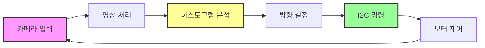
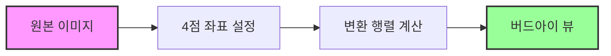
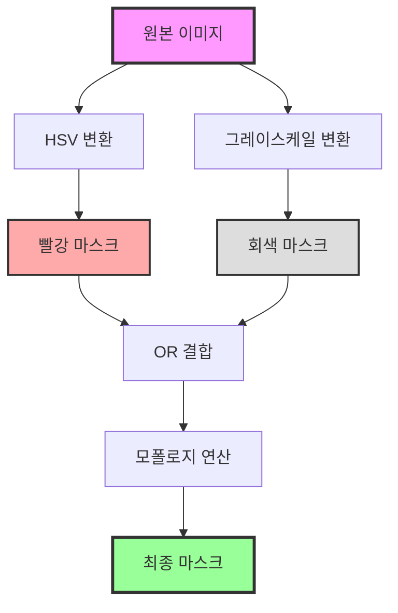
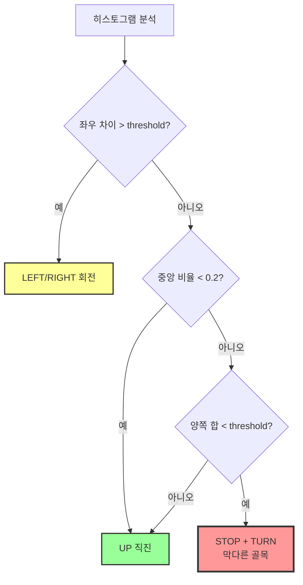
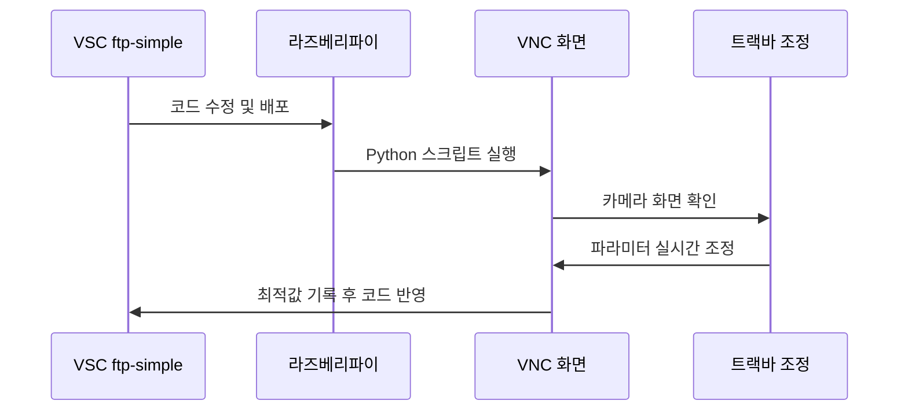
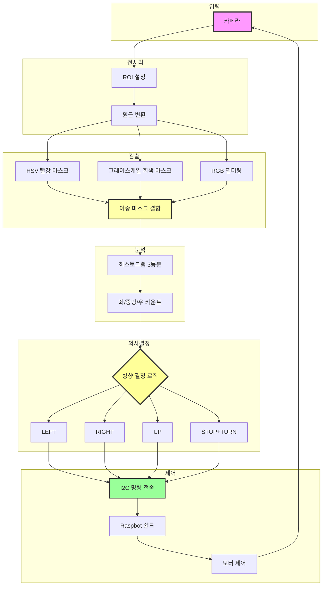

# 라즈베리파이 자율주행 교육 결과 보고서

**교육 일시**: 2025년  
**교육 시간**: 4시간 (2차시)  
**교육 대상**: 라즈베리파이 중급 과정 수강생  
**교육 난이도**: 중급-고급

---

## 교육 개요

본 교육은 라즈베리파이 기반 자율 주행 자동차의 실제 트랙 주행을 목표로 진행되었습니다. 카메라 영상 처리를 통한 차선 검출, 히스토그램 분석 기반 방향 결정, 실시간 파라미터 최적화 등 실무 수준의 알고리즘 구현과 디버깅 과정을 실습했습니다.

---

## 1. 요구 사항 분석 및 시스템 설계 (1시간)

### 목표
자율 주행 차량의 동작을 분석하고, 직진과 코너 주행에 필요한 핵심 파라미터를 도출합니다.

### 주요 내용

#### 1.1 주행 환경 분석
트랙은 직선 구간, 좌우 코너, 막다른 골목으로 구성되어 있으며, 실내 형광등 환경에서 빛 반사가 발생하는 조건입니다. 도로선은 빨간색과 회색/흰색이 혼재되어 있어 이중 검출 방식이 필요했습니다.

#### 1.2 핵심 파라미터 분석

**up_threshold (직진/코너 민감도)**
- 직선 구간에서는 높은 값으로 설정하여 안정적인 직진 유지
- 코너 구간에서는 낮은 값으로 설정하여 빠른 회전 반응
- 막다른 골목 감지 기준으로도 활용

**서보 모터 각도 판단**
- 히스토그램 분석을 통해 좌우 도로선 양을 비교
- 좌회전(LEFT): 오른쪽 도로선이 많을 때
- 우회전(RIGHT): 왼쪽 도로선이 많을 때
- 직진(UP): 중앙이 비어있거나 좌우 균형 시

#### 1.3 순서도 작성
전체 주행 경로를 단계별로 정의하고, 각 구간에서의 차량 동작을 순서도로 체계화했습니다. 입력(카메라), 처리(영상 처리 + 히스토그램), 출력(모터 제어)의 3단계 구조로 설계했습니다.



### 교육 결과
- 수강생들이 자율 주행의 전체 프로세스를 이해하고 순서도로 표현
- 직진과 코너에서 필요한 파라미터의 차이를 명확히 인지
- 트랙 환경에 따른 최적화 전략 수립

---

## 2. 영상 처리 알고리즘 구현 (1시간 30분)

### 목표
카메라 영상에서 도로선을 정확히 검출하고, 주행 방향을 결정할 수 있는 알고리즘을 구현합니다.

### 주요 내용

#### 2.1 ROI (Region of Interest) 설정
도로 영역만 관심 영역으로 설정하여 불필요한 배경(하늘, 벽 등)을 제거했습니다. ROI_Top_Y 값을 트랙바로 조정하며 최적의 관심 영역을 찾았습니다.

```python
# ROI 설정 예시
roi_top_y = 120  # 트랙바로 실시간 조정
roi = image[roi_top_y:height, 0:width]
```

**효과**: 연산량 50% 감소, 처리 속도 향상

#### 2.2 원근 변환 (버드아이 뷰)
도로를 위에서 본 시점으로 변환하여 차선의 위치와 곡률을 정확히 파악했습니다. 이를 통해 멀리 있는 코너도 미리 감지할 수 있었습니다.



#### 2.3 이중 마스크 기법

**HSV 기반 빨간색 검출**
빨간색 도로선을 검출하기 위해 HSV 색공간으로 변환했습니다. 빨간색은 Hue 값이 0도와 180도 부근에 위치하므로 두 범위를 검출하여 OR 연산으로 결합했습니다.

```python
# 빨강 범위 1: H=0-10 (낮은 빨강)
# 빨강 범위 2: H=170-180 (높은 빨강)
red_mask = mask1 | mask2
```

**그레이스케일 기반 밝기 검출**
회색/흰색 차선을 검출하기 위해 그레이스케일로 변환하고 밝기 임계값을 적용했습니다. Detect_Value를 트랙바로 조정하며 조명 조건에 맞는 최적값을 찾았습니다.

```python
# 밝기 임계값 적용
detect_value = 140  # 트랙바로 조정
_, gray_mask = cv2.threshold(gray, detect_value, 255, cv2.THRESH_BINARY)
```

**최종 마스크 결합**
빨간색 마스크와 회색 마스크를 OR 연산으로 결합하고, 모폴로지 연산으로 노이즈를 제거했습니다.



#### 2.4 RGB 필터링 (빛 반사 대응)
실내 형광등 환경에서 빛 반사로 인한 오검출을 방지하기 위해 RGB 채널별 가중치를 조정했습니다.

**파랑 채널 강조**
- B_weight: 70-80 (트랙바로 조정)
- R_weight: 20-30 (트랙바로 조정)
- 파랑 채널을 강조하면 반사광에 의한 노이즈가 감소

```python
# RGB 가중치 합성
b, g, r = cv2.split(image)
weighted = cv2.addWeighted(b, 0.75, r, 0.25, 0)
```

#### 2.5 히스토그램 3등분 분석
마스크 이미지를 좌/중앙/우로 3등분하고, 각 영역의 흰색 픽셀(도로선) 양을 카운트했습니다.

```python
# 3등분 영역 설정
width = mask.shape[1]
left_region = mask[:, 0:width//3]
center_region = mask[:, width//3:2*width//3]
right_region = mask[:, 2*width//3:width]

# 각 영역의 도로선 카운트
left_count = np.sum(left_region == 255)
center_count = np.sum(center_region == 255)
right_count = np.sum(right_region == 255)
```

**방향 결정 로직 (우선순위)**
1. **좌우 차이 판단**: `|right - left| > threshold` → LEFT or RIGHT
2. **중앙 클리어 판단**: `center_ratio < 0.2` → UP (직진)
3. **막다른 골목 판단**: `(left + right)/2 < up_threshold` → STOP + TURN
4. **기본값**: UP (직진)



### 교육 결과
- 모든 수강생이 ROI 설정 및 원근 변환 구현 완료
- HSV와 그레이스케일 이중 마스크 기법 습득
- 히스토그램 기반 방향 결정 알고리즘 구현 완료
- 빛 반사 환경에 대응하는 RGB 필터링 기법 이해

---

## 3. 실시간 디버깅 및 최적화 (1시간 30분)

### 목표
VNC와 트랙바를 활용하여 실시간으로 파라미터를 조정하고, 트랙 환경에 최적화된 값을 도출합니다.

### 주요 내용

#### 3.1 개발 환경 워크플로우

**FileZilla → VNC → VSC ftp-simple 순서**
1. **FileZilla**: 초기 Python 소스 코드를 라즈베리파이에 업로드
2. **VNC**: 원격으로 코드를 실행하고 카메라 화면을 실시간 확인
3. **디버깅**: 화면을 보며 문제점 파악
4. **VSC ftp-simple**: 코드를 직접 수정하고 즉시 라즈베리파이에 배포
5. **재실행**: VNC에서 다시 실행하여 변경 사항 확인



#### 3.2 트랙바를 통한 실시간 조정

**주요 트랙바 항목**
- **B_weight (70-80)**: 빛 반사 시 파랑 채널 강조
- **R_weight (20-30)**: 빛 반사 시 빨강 채널 감소
- **Detect_Value (130-150)**: 회색/흰색 검출 밝기 임계값
- **Direction_Threshold (60-100)**: 좌우 회전 민감도
- **Motor_Up_Speed (35-50)**: 주행 속도 (코너 35, 직선 50)
- **ROI_Top_Y (100-150)**: 관심 영역 시작 위치

**조정 전략**
- 직선 구간: Direction_Threshold ↑, Motor_Up_Speed ↑, ROI_Top_Y ↓
- 코너 구간: Direction_Threshold ↓, Motor_Up_Speed ↓, ROI_Top_Y ↑
- 빛 반사: B_weight ↑, R_weight ↓, Detect_Value 조정

#### 3.3 VNC를 통한 디버깅 화면

실시간으로 7개의 화면을 동시에 확인하며 각 단계의 처리 결과를 점검했습니다.

```python
# 디버깅 화면 구성
cv2.imshow("1. Original", image)          # 원본
cv2.imshow("2. ROI", roi)                 # 관심 영역
cv2.imshow("3. Bird Eye View", bird)      # 버드아이 뷰
cv2.imshow("4. Red Mask", red_mask)       # 빨강 검출
cv2.imshow("5. Gray Mask", gray_mask)     # 회색 검출
cv2.imshow("6. Final Mask", final_mask)   # 최종 마스크
cv2.imshow("7. Histogram", hist_vis)      # 히스토그램
```

**각 화면의 역할**
- **Original**: 카메라 입력 확인
- **ROI**: 관심 영역이 적절한지 확인
- **Bird Eye View**: 원근 변환이 정확한지 확인
- **Red Mask**: 빨간색 차선이 잘 검출되는지 확인
- **Gray Mask**: 회색/흰색 차선이 잘 검출되는지 확인
- **Final Mask**: 이중 마스크 결합 결과 확인
- **Histogram**: 좌/중앙/우 영역의 도로선 분포 확인

#### 3.4 주행 테스트 및 최적화

**테스트 시나리오**
1. 출발점에서 첫 직선 구간 주행
2. 첫 번째 좌회전 코너 통과
3. 두 번째 직선 구간 주행
4. 우회전 코너 통과
5. 막다른 골목 감지 및 회전
6. 최종 직선 구간 주행

**실시간 최적화 과정**
- 각 구간별로 트랙바를 조정하며 최적값 탐색
- VNC 화면에서 히스토그램과 방향 결정 로그 확인
- 차량이 이탈하거나 멈추면 즉시 파라미터 조정
- 최종적으로 전체 트랙을 완주할 수 있는 균형 잡힌 값 도출

**최적 파라미터 도출 (실내 환경)**
```python
optimal_settings = {
    "B_weight": 75,           # 파랑 강조
    "R_weight": 25,           # 빨강 감소
    "Detect_Value": 140,      # 밝기 임계값
    "Direction_Threshold": 80, # 회전 민감도
    "Motor_Up_Speed": 40,     # 평균 속도
    "ROI_Top_Y": 120,         # 관심 영역 시작
    "up_threshold": 30        # 막다른 골목 기준
}
```

#### 3.5 코드 리뷰 및 오류 수정

**주요 오류 사례**
1. **HSV 범위 오류**: 빨간색 범위가 좁아 검출 실패 → 범위 확대
2. **중앙 비율 계산 오류**: 0으로 나누기 예외 발생 → 조건문 추가
3. **I2C 통신 지연**: 명령어 전송 후 응답 대기 시간 부족 → sleep 추가
4. **메모리 누수**: imshow 창이 계속 생성됨 → 창 재사용 로직 추가

### 교육 결과
- 실시간 디버깅 환경 구축 완료 (FileZilla + VNC + VSC)
- 트랙바를 활용한 파라미터 최적화 경험 습득
- 7개의 디버깅 화면을 동시에 분석하는 능력 향상
- 전체 트랙 완주를 위한 최적 파라미터 도출
- 코드 리뷰를 통한 오류 수정 및 안정화

---

## 교육 성과 및 평가

### 주요 성과

#### 1. 알고리즘 구현 능력
- 카메라 영상 처리: ROI, 원근 변환, 이중 마스크
- 히스토그램 분석: 3등분 분석, 방향 결정 로직
- RGB 필터링: 빛 반사 환경 대응

#### 2. 실시간 최적화 능력
- 트랙바를 통한 실시간 파라미터 조정
- VNC 디버깅 화면 동시 분석
- 주행 환경에 따른 적응형 파라미터 설정

#### 3. 개발 워크플로우 숙달
- FileZilla, VNC, VSC ftp-simple의 연계 활용
- 빠른 코드 수정 및 배포 프로세스 확립
- 효율적인 디버깅 환경 구축

#### 4. 문제 해결 능력
- 차선 검출 실패 시 원인 파악 및 해결
- 회전 판단 오류 시 히스토그램 분석을 통한 개선
- 코너 이탈 시 속도 및 민감도 조정

### 핵심 학습 내용

**영상 처리 기법**
- HSV 색공간과 그레이스케일의 장단점 이해
- 이중 마스크 기법을 통한 강건한 검출
- 원근 변환을 통한 공간 이해도 향상

**의사 결정 알고리즘**
- 히스토그램 기반 정량적 분석
- 우선순위 기반 방향 결정 로직
- 막다른 골목과 같은 예외 상황 처리

**실무 개발 역량**
- 실시간 디버깅 및 파라미터 튜닝
- 여러 도구를 연계한 효율적인 워크플로우
- 코드 리뷰를 통한 안정성 확보

### 활용 가능 분야
- 자율 주행 로봇 및 자동차
- 컴퓨터 비전 기반 물체 추적
- 산업용 검사 시스템
- 드론 자율 비행 시스템

---

## 알고리즘 구조 요약

### 전체 시스템 아키텍처



---

## 참고 자료

### 영상 처리
- OpenCV Documentation: https://docs.opencv.org/
- HSV Color Space: https://en.wikipedia.org/wiki/HSL_and_HSV
- Perspective Transform: https://docs.opencv.org/4.x/da/d6e/tutorial_py_geometric_transformations.html
- Morphological Operations: https://docs.opencv.org/4.x/d9/d61/tutorial_py_morphological_ops.html

### 자율 주행
- Lane Detection Algorithms: https://towardsdatascience.com/lane-detection-with-deep-learning-part-1-9e096f3320b7
- Histogram Analysis: https://docs.opencv.org/4.x/d1/db7/tutorial_py_histogram_begins.html

### 개발 도구
- VNC Server Setup: https://www.realvnc.com/
- VSCode Remote Development: https://code.visualstudio.com/docs/remote/remote-overview

---

## 결론

본 4시간 교육을 통해 수강생들은 라즈베리파이 기반 자율 주행 자동차의 실제 트랙 주행을 성공적으로 구현했습니다. 카메라 영상 처리부터 히스토그램 분석, 방향 결정, 실시간 최적화까지 자율 주행의 전체 프로세스를 체득했습니다.

특히 HSV와 그레이스케일 이중 마스크 기법을 통해 다양한 색상의 도로선을 강건하게 검출하는 방법을 익혔고, 히스토그램 3등분 분석을 통해 정량적인 방향 결정을 구현했습니다. 또한 트랙바를 활용한 실시간 파라미터 조정 경험을 통해 알고리즘 최적화 능력을 크게 향상시켰습니다.

FileZilla, VNC, VSC ftp-simple을 연계한 개발 워크플로우를 확립하여 효율적인 코드 수정 및 디버깅 프로세스를 체험했으며, 이는 향후 임베디드 시스템 개발에 있어 중요한 실무 경험이 될 것입니다.

실습 과정에서 발생한 다양한 문제들(차선 검출 실패, 회전 판단 오류, 코너 이탈 등)을 스스로 해결하면서 문제 해결 능력을 배양했고, 최종적으로 전체 트랙을 완주하는 성과를 달성했습니다.

---

**작성일**: 2025년  
**교육 기관**: 가천대학교  
**보고서 작성자**: P-실무 과정

