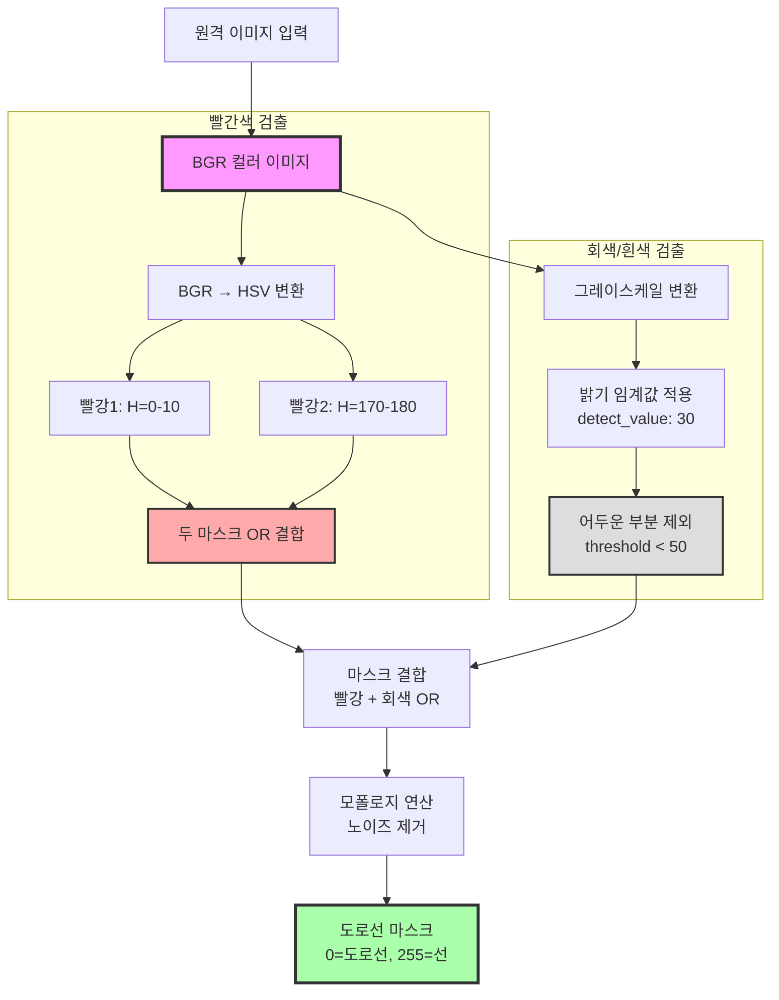
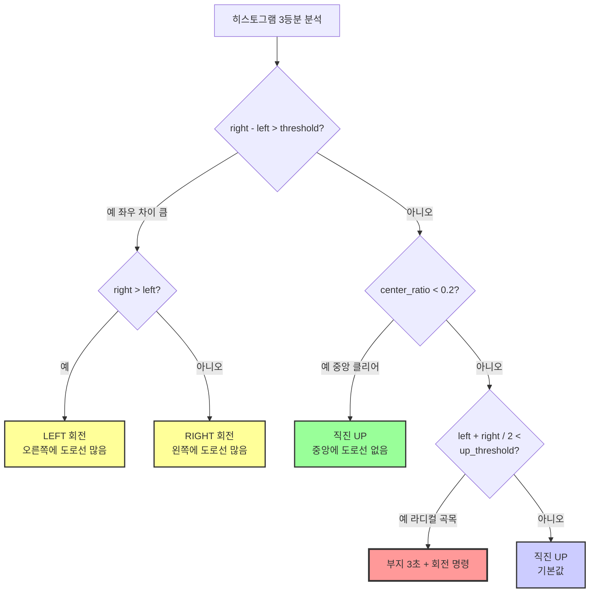
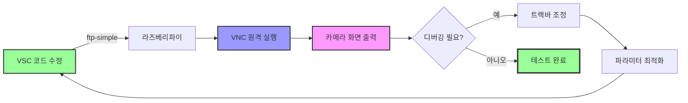
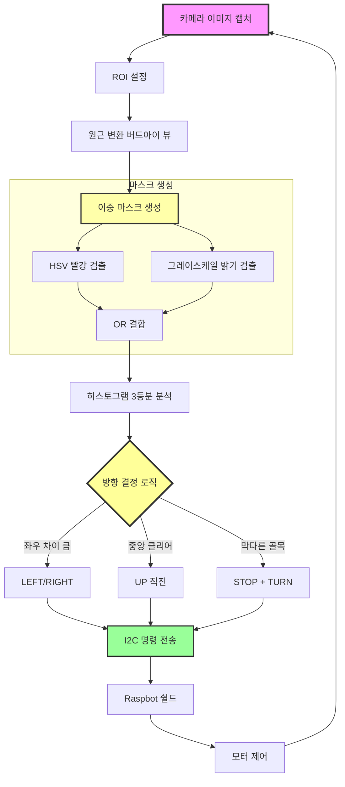

# 라즈베리파이 자율주행 실습 정리 (4시간 수업)

## 교육 개요

**교육 일시**: 2025년  
**교육 시간**: 4시간  
**교육 주제**: 트랙 기반 자율 주행 테스트 및 알고리즘 최적화  
**실습 난이도**: 중급-고급

---

## 1. 요구 사항 분석 및 시스템 설계

### 목표
자율 주행 차량의 전체 동작을 분석하고, 직진과 코너 주행에 필요한 최적의 파라미터를 도출합니다.

### 주요 내용

#### 1.1 주행 환경 분석
- **트랙 구성**: 직선 구간, 좌회전 코너, 우회전 코너, 막다른 골목
- **조명 조건**: 실내 형광등, 빛 반사가 발생하는 환경
- **도로선 종류**: 빨간색 차선, 회색/흰색 차선

#### 1.2 핵심 파라미터 분석
- **up_threshold**: 직진과 코너에서의 민감도 조정 값
  - 직진 구간: 높은 threshold (안정적 주행)
  - 코너 구간: 낮은 threshold (빠른 반응)
- **서보 모터 각도**: 좌회전, 직진, 우회전 판단 기준
  - LEFT: 좌측 차선 감지 시
  - RIGHT: 우측 차선 감지 시
  - UP (직진): 중앙 도로선 명확 시

#### 1.3 개발 환경 구성
- **FileZilla**: Python 소스 코드 업로드
- **VNC**: 실시간 카메라 화면 디버깅
- **VSC ftp-simple**: 코드 직접 수정 및 실시간 배포
- **트랙바**: OpenCV 창을 통한 실시간 파라미터 조정

---

## 2. 순서도 작성 및 알고리즘 설계

### 차선 검출 알고리즘



### 방향 결정 의사 결정 트리



---

## 3. 카메라 영상 처리 기법

### 3.1 ROI (Region of Interest) 설정

```python
# 관심 영역만 추출하여 연산량 감소
roi_top_y = 100  # 트랙바로 조정 가능
roi = image[roi_top_y:height, 0:width]
```

**목적**: 도로 영역만 분석하여 처리 속도 향상 및 불필요한 노이즈 제거

### 3.2 원근 변환 (버드아이 뷰)

```python
# 원근 변환으로 도로를 위에서 본 시점으로 변환
src_points = np.float32([[x1, y1], [x2, y2], [x3, y3], [x4, y4]])
dst_points = np.float32([[0, 0], [width, 0], [0, height], [width, height]])
matrix = cv2.getPerspectiveTransform(src_points, dst_points)
bird_eye_view = cv2.warpPerspective(roi, matrix, (width, height))
```

**목적**: 차선의 곡률과 위치를 정확히 파악하여 주행 방향 결정

### 3.3 이중 마스크 기법

#### HSV 기반 빨간색 검출
```python
# 빨간색은 HSV에서 0도와 180도 부근에 위치
hsv = cv2.cvtColor(image, cv2.COLOR_BGR2HSV)

# 빨강 범위 1: H=0-10
mask1 = cv2.inRange(hsv, (0, 50, 50), (10, 255, 255))

# 빨강 범위 2: H=170-180
mask2 = cv2.inRange(hsv, (170, 50, 50), (180, 255, 255))

# 두 마스크 결합
red_mask = cv2.bitwise_or(mask1, mask2)
```

#### 그레이스케일 기반 밝기 검출
```python
# 회색/흰색 차선 검출
gray = cv2.cvtColor(image, cv2.COLOR_BGR2GRAY)

# 밝기 임계값 적용
detect_value = 30  # 트랙바로 조정
_, gray_mask = cv2.threshold(gray, detect_value, 255, cv2.THRESH_BINARY)

# 너무 어두운 영역 제외
gray_mask[gray < 50] = 0
```

#### 최종 마스크 결합
```python
# 빨간색 + 회색 마스크 OR 연산
final_mask = cv2.bitwise_or(red_mask, gray_mask)

# 모폴로지 연산으로 노이즈 제거
kernel = np.ones((5, 5), np.uint8)
final_mask = cv2.morphologyEx(final_mask, cv2.MORPH_CLOSE, kernel)
```

### 3.4 RGB 필터링 (빛 반사 대응)

```python
# 빛 반사 환경에서 파랑 채널 강조
b, g, r = cv2.split(image)

# 가중치 적용 (트랙바로 조정)
b_weight = 70  # 파랑 강조 (70-80)
r_weight = 20  # 빨강 감소 (20-30)

# 가중치 합성
weighted = cv2.addWeighted(b, b_weight/100, r, r_weight/100, 0)
```

**목적**: 형광등이나 햇빛 반사로 인한 오검출 방지

---

## 4. 히스토그램 기반 방향 결정

### 4.1 히스토그램 3등분 분석

```python
# 이미지를 좌/중앙/우로 3등분
height, width = mask.shape
left_region = mask[:, 0:width//3]
center_region = mask[:, width//3:2*width//3]
right_region = mask[:, 2*width//3:width]

# 각 영역의 흰색 픽셀(도로선) 카운트
left_count = np.sum(left_region == 255)
center_count = np.sum(center_region == 255)
right_count = np.sum(right_region == 255)

# 중앙 비율 계산
total = left_count + center_count + right_count
center_ratio = center_count / total if total > 0 else 0
```

### 4.2 방향 결정 로직

```python
direction_threshold = 80  # 좌우 차이 판단 기준 (트랙바)

# 1순위: 좌우 차이가 크면 회전
if abs(right_count - left_count) > direction_threshold:
    if right_count > left_count:
        direction = "LEFT"  # 오른쪽에 차선이 많으면 왼쪽으로
    else:
        direction = "RIGHT"  # 왼쪽에 차선이 많으면 오른쪽으로

# 2순위: 중앙이 비어있으면 직진
elif center_ratio < 0.2:
    direction = "UP"  # 중앙 클리어

# 3순위: 막다른 골목 (양쪽 모두 적음)
elif (left_count + right_count) / 2 < up_threshold:
    direction = "STOP_AND_TURN"  # 3초 정지 후 회전
    
# 기본값: 직진
else:
    direction = "UP"
```

---

## 5. 실시간 파라미터 조정 (트랙바)

### 5.1 트랙바 구성

```python
import cv2

# OpenCV 윈도우 생성
cv2.namedWindow("Settings")

# 트랙바 생성
cv2.createTrackbar("B_weight", "Settings", 70, 100, callback)
cv2.createTrackbar("R_weight", "Settings", 20, 100, callback)
cv2.createTrackbar("Detect_Value", "Settings", 130, 255, callback)
cv2.createTrackbar("Direction_Threshold", "Settings", 80, 200, callback)
cv2.createTrackbar("Motor_Up_Speed", "Settings", 40, 100, callback)
cv2.createTrackbar("ROI_Top_Y", "Settings", 100, 200, callback)
```

### 5.2 주요 파라미터 설명

#### 빛 반사 상황 환경
- **B_weight (70-80)**: 파랑 채널 가중치, 빛 반사 시 증가
- **R_weight (20-30)**: 빨강 채널 가중치, 빛 반사 시 감소
- **Detect_Value (130-150)**: 회색/흰색 검출 밝기 임계값

#### 곡선 구간 (좌회전, 우회전)
- **Direction_Threshold ↓**: 민감도 증가, 빠른 회전 반응
- **Motor_Up_Speed ↓**: 속도 감소, 안정적 코너링
- **ROI_Top_Y ↑**: 관심 영역을 가까이, 가까운 차선 집중

#### 직선 구간
- **Direction_Threshold ↑**: 민감도 감소, 안정적 직진
- **Motor_Up_Speed ↑**: 속도 증가, 빠른 주행
- **ROI_Top_Y ↓**: 관심 영역을 멀리, 넓은 시야 확보

---

## 6. 개발 워크플로우

### 6.1 코드 수정 및 배포 프로세스



### 6.2 도구별 역할

| 도구 | 역할 | 사용 시점 |
|------|------|-----------|
| FileZilla | 초기 소스 코드 업로드 | 프로젝트 시작 시 |
| VSC ftp-simple | 실시간 코드 수정 및 배포 | 개발 및 디버깅 중 |
| VNC | 카메라 화면 실시간 확인 | 영상 처리 디버깅 시 |
| 트랙바 | 파라미터 실시간 조정 | 주행 테스트 중 |

### 6.3 디버깅 화면 구성

```python
# VNC에서 확인할 디버깅 화면
cv2.imshow("Original", image)           # 원본 이미지
cv2.imshow("ROI", roi)                  # 관심 영역
cv2.imshow("Bird Eye View", bird_view)  # 버드아이 뷰
cv2.imshow("Red Mask", red_mask)        # 빨간색 마스크
cv2.imshow("Gray Mask", gray_mask)      # 회색 마스크
cv2.imshow("Final Mask", final_mask)    # 최종 마스크
cv2.imshow("Histogram", hist_image)     # 히스토그램 시각화
```

---

## 7. 주행 테스트 및 최적화

### 7.1 테스트 시나리오

#### 직선 구간 테스트
```
1. 트랙바 설정: Direction_Threshold=100, Motor_Up_Speed=50
2. 차량 출발
3. 중앙 직진 유지 확인
4. 필요시 ROI_Top_Y 조정
```

#### 좌회전 코너 테스트
```
1. 트랙바 설정: Direction_Threshold=60, Motor_Up_Speed=35
2. 코너 진입
3. 히스토그램에서 right_count 증가 확인
4. LEFT 명령 발동 확인
5. 서보 모터 각도 조정 확인
```

#### 우회전 코너 테스트
```
1. 트랙바 설정: Direction_Threshold=60, Motor_Up_Speed=35
2. 코너 진입
3. 히스토그램에서 left_count 증가 확인
4. RIGHT 명령 발동 확인
5. 서보 모터 각도 조정 확인
```

#### 막다른 골목 테스트
```
1. up_threshold 설정 확인
2. 골목 진입
3. 양쪽 카운트 모두 감소 확인
4. STOP 명령 및 3초 대기 확인
5. 회전 명령 발동 확인
```

### 7.2 최적 파라미터 예시

```python
# 실내 형광등 환경 (빛 반사 있음)
optimal_params = {
    "B_weight": 75,
    "R_weight": 25,
    "Detect_Value": 140,
    "Direction_Threshold": 80,
    "Motor_Up_Speed_Straight": 50,
    "Motor_Up_Speed_Corner": 35,
    "ROI_Top_Y": 120,
    "up_threshold": 30
}
```

---

## 8. 알고리즘 흐름도 전체



---

## 실습 체크리스트

### 환경 설정
- [ ] FileZilla로 초기 소스 코드 업로드
- [ ] VSC ftp-simple 설정 완료
- [ ] VNC 연결 및 화면 출력 확인
- [ ] 트랙바 윈도우 생성 확인

### 알고리즘 구현
- [ ] ROI 설정 완료
- [ ] 원근 변환 구현
- [ ] HSV 빨강 검출 구현
- [ ] 그레이스케일 밝기 검출 구현
- [ ] 이중 마스크 결합
- [ ] 히스토그램 3등분 분석
- [ ] 방향 결정 로직 구현

### 주행 테스트
- [ ] 직선 구간 주행 성공
- [ ] 좌회전 코너 주행 성공
- [ ] 우회전 코너 주행 성공
- [ ] 막다른 골목 처리 성공
- [ ] 최적 파라미터 도출

### 디버깅
- [ ] 각 마스크 화면 출력 확인
- [ ] 히스토그램 시각화 확인
- [ ] 방향 결정 로그 확인
- [ ] 트랙바를 통한 실시간 조정 확인

---

## 문제 해결 가이드

### 차선 검출 안 됨
1. Detect_Value 조정 (밝기 임계값)
2. B_weight, R_weight 조정 (빛 반사 대응)
3. ROI 영역 확인 (도로 영역이 포함되었는지)
4. HSV 범위 확인 (빨간색 범위가 적절한지)

### 회전 판단 오류
1. Direction_Threshold 조정
2. 히스토그램 영역 비율 확인 (3등분이 적절한지)
3. center_ratio 기준값 조정
4. up_threshold 값 조정

### 코너에서 이탈
1. Motor_Up_Speed 감소 (속도 줄이기)
2. Direction_Threshold 감소 (민감도 증가)
3. ROI_Top_Y 증가 (가까운 차선에 집중)
4. 서보 모터 각도 범위 확인

### VNC 화면이 느림
1. 해상도 낮추기
2. 불필요한 imshow 창 닫기
3. 네트워크 대역폭 확인
4. VNC 화질 설정 조정

---

## 참고 자료

### OpenCV 영상 처리
- OpenCV 공식 문서: https://docs.opencv.org/
- HSV 색공간: https://en.wikipedia.org/wiki/HSL_and_HSV
- 원근 변환: https://docs.opencv.org/4.x/da/d6e/tutorial_py_geometric_transformations.html

### 히스토그램 분석
- Histogram Equalization: https://docs.opencv.org/4.x/d5/daf/tutorial_py_histogram_equalization.html

### 자율 주행 알고리즘
- Lane Detection: https://towardsdatascience.com/lane-detection-with-deep-learning-part-1-9e096f3320b7

---

**작성일**: 2025년  
**수업 시간**: 4시간  
**실습 난이도**: 중급-고급

