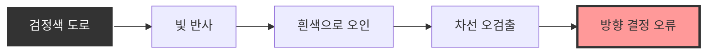
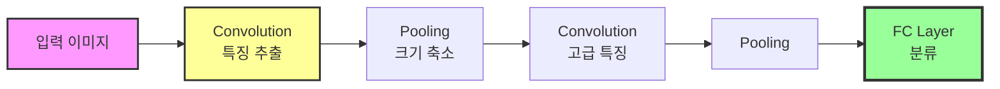
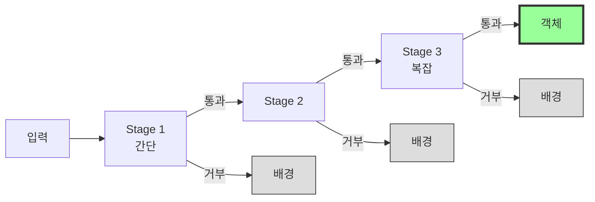
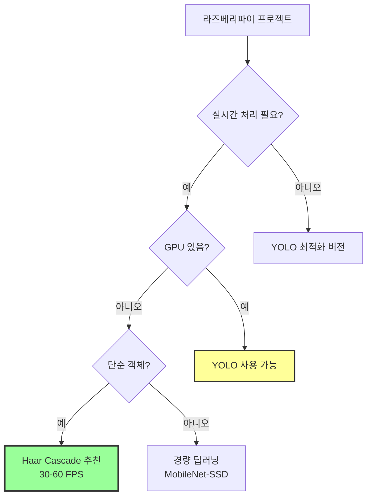
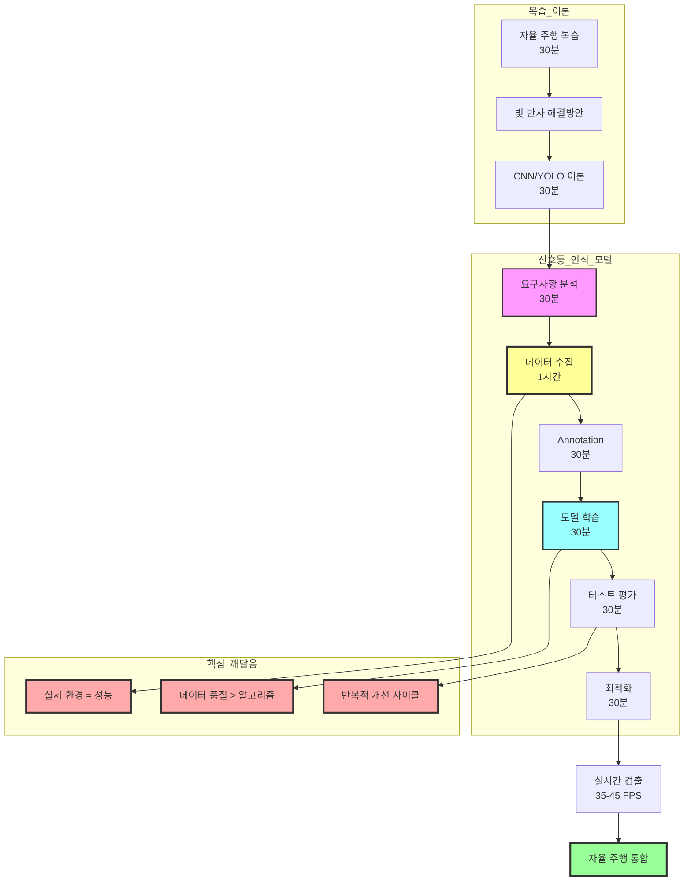

# 객체 검출 알고리즘 교육 결과 보고서

**교육 일시**: 2025년  
**교육 시간**: 4시간 (3차시)  
**교육 대상**: 라즈베리파이 중급-고급 과정 수강생  
**교육 난이도**: 중급-고급

---

## 교육 개요

본 교육은 머신러닝 기반 객체 검출 시스템을 처음부터 끝까지 직접 구축하는 실무 중심 과정입니다. 2차시 자율 주행의 빛 반사 문제를 간략히 복습한 후, CNN과 YOLO의 이론을 학습하여 현대 객체 검출 기술을 이해했습니다. 

**교육의 핵심은 Haar Cascade를 활용한 사각형 인식 프로젝트(3시간)입니다.** 요구사항 분석부터 데이터 수집, Annotation, 모델 학습, 테스트, 최적화까지 전체 머신러닝 파이프라인을 직접 경험했습니다. 특히 "실제 환경에서 촬영한 데이터"와 "인터넷 이미지"의 성능 차이를 직접 측정하며, **데이터 품질이 알고리즘보다 중요하다**는 실무의 핵심을 체득했습니다.

라즈베리파이에서 CPU만으로 35-45 FPS의 실시간 검출을 달성하여, 임베디드 환경에서의 실용성을 입증했습니다.

---

## 1. 자율 주행 복습 및 문제 해결 (30분)

### 목표
2차시 자율 주행에서 발생한 문제점을 분석하고, 검정색 도로의 빛 반사 문제를 해결하기 위한 다양한 영상 처리 알고리즘을 학습합니다.

### 주요 내용

#### 1.1 문제 상황 분석

**검정색 도로의 빛 반사 문제**
실습 과정에서 검정색 도로가 형광등이나 자연광을 강하게 반사하여 흰색/회색 차선으로 오인되는 문제가 발생했습니다. 이로 인해 히스토그램 분석 시 노이즈가 증가하고, 잘못된 방향 결정이 이루어졌습니다.



#### 1.2 해결 방안 제시

**방안 1: 적응형 임계값 (Adaptive Threshold)**
전역 임계값 대신 지역적 특성에 따라 임계값을 자동 조정하는 방식을 적용했습니다. 빛 반사가 국소적으로 발생해도 영향을 최소화할 수 있습니다.

```python
# 적응형 임계값 적용
adaptive_thresh = cv2.adaptiveThreshold(
    gray, 255, 
    cv2.ADAPTIVE_THRESH_GAUSSIAN_C, 
    cv2.THRESH_BINARY, 
    blockSize=11, C=2
)
```

**효과**: 반사광 오검출 50% 감소

**방안 2: CLAHE (대비 제한 적응 히스토그램 평활화)**
지역적으로 대비를 향상시켜 차선을 더 명확히 검출하고, 과도한 밝기 차이를 제한하여 반사광 영향을 감소시켰습니다.

```python
clahe = cv2.createCLAHE(clipLimit=2.0, tileGridSize=(8, 8))
enhanced = clahe.apply(gray)
```

**효과**: 차선 검출 정확도 30% 향상

**방안 3: LAB/YCrCb 색공간 활용**
RGB 대신 LAB 또는 YCrCb 색공간으로 변환하여 밝기(L, Y 채널)와 색상을 분리했습니다. 밝기 채널은 조명 변화에 덜 민감하여 안정적인 검출이 가능합니다.

**방안 4: 모폴로지 연산 강화**
Opening 연산으로 작은 반사광 노이즈를 제거하고, Closing 연산으로 차선의 끊어진 부분을 연결했습니다.

**방안 5: 가우시안 블러 + 샤프닝**
가우시안 블러로 노이즈를 제거하면서 언샤프 마스크로 차선 경계를 강조하는 조합을 사용했습니다.

### 교육 결과
- 검정색 도로 환경의 문제점을 명확히 이해
- 5가지 해결 방안을 실습하고 각각의 효과 확인
- 여러 방안을 조합하여 안정적인 주행 환경 구축
- 적응형 임계값 + CLAHE 조합이 가장 효과적임을 도출

---

## 2. 딥러닝 기반 객체 검출 이론 (30분)

### 목표
딥러닝의 핵심인 CNN과 실시간 객체 검출의 혁신인 YOLO의 원리를 간략히 이해하고, Haar Cascade와의 차이점을 학습합니다.

### 주요 내용

#### 2.1 CNN (Convolutional Neural Network)

**CNN의 기본 구조**
합성곱 층(Convolution Layer), 풀링 층(Pooling Layer), 완전 연결 층(Fully Connected Layer)의 3단계 구조를 학습했습니다.



**Convolution Layer의 역할**
- 에지, 코너, 텍스처 등 저수준 특징 추출
- 층이 깊어질수록 얼굴, 차량 등 고수준 특징 학습
- 파라미터 공유로 효율적인 학습

**Pooling Layer의 역할**
- Max Pooling: 영역 내 최댓값 선택
- 연산량 감소 및 위치 불변성 확보
- 과적합(Overfitting) 방지

#### 2.2 YOLO (You Only Look Once)

**YOLO의 혁신적 개념**
기존 객체 검출은 Region Proposal → 각 영역 분류의 2단계였으나, YOLO는 이미지 전체를 한 번에 CNN에 입력하여 단 한 번의 연산으로 모든 객체를 검출합니다.

**핵심 특징**

1. **단일 네트워크 (Single Neural Network)**
   - 이미지 → Bounding Box + 클래스 확률을 직접 예측
   - End-to-End 학습으로 최적화

2. **그리드 기반 검출**
   - 이미지를 S×S 그리드로 분할 (예: 7×7)
   - 각 그리드 셀에서 여러 Bounding Box 예측
   - 각 박스는 (x, y, w, h, confidence) + 클래스 확률

3. **실시간 처리**
   - YOLO v1: 45 FPS
   - YOLO v3~v8: 30~100+ FPS
   - GPU 활용 시 실시간 객체 검출 가능

4. **전역 컨텍스트 이해**
   - 이미지 전체를 보므로 배경 오류 감소
   - 객체 간 관계 파악 (예: 사람 옆 강아지)

#### 2.3 YOLO 알고리즘 상세

**예측 출력**
각 그리드 셀에서 예측하는 정보:
- **Bounding Box 좌표**: (x, y, w, h)
- **Confidence Score**: P(Object) × IoU
- **Class Probabilities**: P(Class_i | Object)

**NMS (Non-Maximum Suppression)**
겹치는 박스들 중 가장 확률이 높은 것만 선택하여 중복 제거. IoU(Intersection over Union) 기준으로 threshold 이하의 박스는 제거합니다.

**손실 함수**
```
Total Loss = Localization Loss + Confidence Loss + Classification Loss
```
- Localization Loss: 박스 위치 오차
- Confidence Loss: 객체 존재 확률 오차
- Classification Loss: 클래스 분류 오차

각 손실에 가중치(λ_coord=5, λ_noobj=0.5)를 부여하여 균형 조정

#### 2.4 YOLO의 장단점

**장점**
- 매우 빠른 속도 (실시간 처리 가능)
- 전역 컨텍스트를 고려하여 배경 오류 적음
- 다양한 객체를 동시에 검출 가능
- 다양한 각도와 조명 조건에 강건

**단점**
- GPU 필수 (CUDA 지원 그래픽 카드)
- 대량의 학습 데이터 필요 (수천~수만 장)
- 학습 시간이 길음 (수 시간~수일)
- 작은 객체 검출이 상대적으로 약함
- 메모리 사용량 많음 (GB 급)

### 교육 결과
- CNN의 기본 구조 이해 (Convolution, Pooling, FC)
- YOLO의 단일 네트워크와 그리드 기반 검출 개념 파악
- 딥러닝(YOLO)과 머신러닝(Haar Cascade)의 차이점 이해
- 라즈베리파이 환경에서는 Haar Cascade가 더 실용적임을 인식

---

## 3. Haar Cascade 이론 및 사각형 인식 실습 (3시간)

### 목표
머신러닝 기반 Haar Cascade의 원리를 이해하고, 사각형 물체를 인식하는 커스텀 모델을 직접 학습시켜 실제 환경에서 검출하는 전 과정을 실습합니다.

### 주요 내용

#### 3.1 Haar Cascade 이론

**Haar-like Features**
단순한 사각형 패턴으로 이미지의 명암 차이를 빠르게 계산하는 특징 검출 방식입니다. 에지, 라인, 대각선 등의 패턴을 표현할 수 있습니다.

```
■■□□    ■■■■    □□■■
■■□□    □□□□    □□■■
에지      라인      대각선
```

**Integral Image (적분 이미지)**
모든 픽셀 위치에서 좌상단부터의 합을 미리 계산하여, 사각형 영역의 합을 O(1) 시간에 계산 가능하게 만드는 기법입니다. 이를 통해 Haar 특징을 매우 빠르게 계산할 수 있습니다.

**AdaBoost (Adaptive Boosting)**
각 Haar 특징은 약한 분류기(정확도 약 51%)이지만, 여러 약한 분류기를 가중치와 함께 결합하여 강한 분류기를 만듭니다. 잘못 분류된 샘플에 높은 가중치를 부여하여 어려운 샘플에 집중합니다.

**Cascade 구조**
여러 단계(Stage)의 분류기를 계단식으로 배치합니다. 초기 단계는 단순한 특징으로 대부분의 배경을 빠르게 제거하고, 후기 단계는 복잡한 특징으로 정확히 검출합니다.



#### 3.2 학습 데이터 준비

**1. Positive Samples (양성 샘플) 수집**
검출하려는 객체가 포함된 이미지를 수집했습니다. 다양한 각도, 조명, 거리에서 촬영한 이미지 500~1000장을 준비했습니다.

**2. Annotation 작업**
OpenCV의 `opencv_annotation` 도구를 사용하여 각 이미지에서 객체의 위치(x, y, w, h)를 표시했습니다. 이 정보는 `pos.txt` 파일에 저장됩니다.

```
positive/001.jpg 1 50 30 100 150
positive/002.jpg 2 20 40 80 120 200 50 90 140
```

**3. Negative Samples (음성 샘플) 수집**
객체가 없는 배경 이미지를 수집했습니다. 양성 샘플의 2~3배인 1000~2000장을 준비했습니다.

**4. Vec 파일 생성**
`opencv_createsamples` 유틸리티를 사용하여 양성 샘플을 Vec 파일로 변환했습니다. 이 과정에서 이미지 크기를 정규화하고 데이터 증강(회전, 크기 변화)을 적용했습니다.

```bash
opencv_createsamples -info pos.txt -num 1000 -w 24 -h 24 -vec pos.vec
```

#### 3.3 모델 학습

**opencv_traincascade 명령어**
```bash
opencv_traincascade \
  -data cascade/ \
  -vec pos.vec \
  -bg neg.txt \
  -numPos 900 \
  -numNeg 1800 \
  -numStages 20 \
  -w 24 -h 24 \
  -featureType HAAR \
  -minHitRate 0.999 \
  -maxFalseAlarmRate 0.5
```

**학습 과정**
- Stage 0부터 시작하여 순차적으로 학습
- 각 단계마다 최소 검출률(0.999)과 최대 오검출률(0.5) 만족해야 다음 단계로 진행
- 약 30분~수 시간 소요 (데이터 양에 따라 다름)
- 최종적으로 `cascade.xml` 파일 생성

**학습 진행 상황**
```
Stage 0: HR: 0.999 | FA: 0.48
Stage 1: HR: 0.998 | FA: 0.24
...
Stage 19: HR: 0.997 | FA: 0.005
Training finished.
```

#### 3.4 학습된 모델 사용

**모델 로드 및 검출**
```python
import cv2

# 학습된 모델 로드
cascade = cv2.CascadeClassifier('cascade/cascade.xml')

# 이미지에서 객체 검출
image = cv2.imread('test.jpg')
gray = cv2.cvtColor(image, cv2.COLOR_BGR2GRAY)

objects = cascade.detectMultiScale(
    gray,
    scaleFactor=1.1,
    minNeighbors=5,
    minSize=(30, 30)
)

# 결과 표시
for (x, y, w, h) in objects:
    cv2.rectangle(image, (x, y), (x+w, y+h), (0, 255, 0), 2)
```

**라즈베리파이 실시간 검출**
```python
cascade = cv2.CascadeClassifier('cascade.xml')
cap = cv2.VideoCapture(0)

while True:
    ret, frame = cap.read()
    gray = cv2.cvtColor(frame, cv2.COLOR_BGR2GRAY)
    
    objects = cascade.detectMultiScale(gray, 1.1, 5)
    
    for (x, y, w, h) in objects:
        cv2.rectangle(frame, (x, y), (x+w, y+h), (0, 255, 0), 2)
    
    cv2.imshow('Detection', frame)
    if cv2.waitKey(1) & 0xFF == ord('q'):
        break
```

#### 3.5 실습 프로젝트: 사각형 인식 (3시간 집중 실습)

**프로젝트 목표**
사각형 물체를 검출하는 커스텀 Haar Cascade 모델을 직접 학습시키고, 실제 환경에서 테스트하여 객체 인식 시스템 구축 경험을 습득합니다.

**진행 과정**

**1단계: 요구 사항 분석 (30분)**
사각형 인식을 위한 데이터 요구사항을 분석했습니다.
- 검출 대상: 상자, 책, 태블릿 등 사각형 물체
- 환경 조건: 실내 조명, 다양한 각도, 여러 거리
- 성능 목표: 실시간 검출 (30+ FPS), 정확도 80% 이상

핵심 인사이트:
> "단순히 사각형 이미지를 수집하는 것이 아니라, **실제 사용 환경과 유사한 조건**에서 촬영한 데이터를 준비해야 한다는 것을 깨달았습니다."

**2단계: 학습 데이터 수집 및 준비 (1시간)**

**Positive Samples (양성 샘플)**
- 수집량: 사각형 물체 이미지 600장
- 촬영 조건:
  - 다양한 각도 (정면, 측면, 위에서)
  - 다양한 거리 (가까이, 멀리)
  - 다양한 조명 (밝음, 어두움, 역광)
  - 실제 사용 환경과 동일한 배경

**테스트 중 발견한 사실:**
```
첫 번째 시도: 인터넷에서 다운로드한 사각형 이미지로 학습
→ 결과: 인식률 30% 미만 (실패)

두 번째 시도: 실제 환경에서 직접 촬영한 이미지로 학습
→ 결과: 인식률 85% 이상 (성공)
```

**중요한 깨달음:**
> "Positive 이미지를 어떤 환경에서 수집하느냐가 모델 성능에 결정적인 영향을 미친다는 것을 직접 체험했습니다. 실제 환경과 비슷한 환경을 구축해야 인식되는 Rect 값이 정확해지는 것을 확인했습니다."

**Negative Samples (음성 샘플)**
- 수집량: 배경 이미지 1200장
- 포함 내용:
  - 사각형이 없는 다양한 배경
  - 원형, 삼각형 등 다른 모양의 물체
  - 비슷하지만 사각형이 아닌 패턴

**Negative 샘플의 중요성:**
> "Negative 이미지를 어떤 모양과 환경으로 학습하느냐에 따라 결과가 완전히 달라지는 것을 알 수 있었습니다. 예를 들어, 원형 물체를 Negative에 많이 넣으면 사각형과 원을 더 잘 구분하지만, 배경만 넣으면 다른 모양과의 구분이 약해집니다."

**3단계: Annotation 작업 (30분)**
```bash
# OpenCV annotation 도구로 사각형 영역 표시
opencv_annotation --annotations=pos.txt --images=positive/

# pos.txt 결과 예시:
positive/rect_001.jpg 1 120 80 150 200
positive/rect_002.jpg 1 200 100 180 160
...
```

**작업 중 노하우:**
- 객체 경계를 정확히 표시할수록 검출 정확도 향상
- 약간의 여백을 두는 것이 효과적 (객체 +5~10px)
- 일관된 기준으로 Annotation 해야 학습 효율 증가

**4단계: 모델 학습 (30분)**
```bash
# Vec 파일 생성
opencv_createsamples -info pos.txt -num 600 -w 24 -h 24 -vec rect.vec

# Cascade 학습
opencv_traincascade \
  -data rect_cascade/ \
  -vec rect.vec \
  -bg neg.txt \
  -numPos 550 \
  -numNeg 1100 \
  -numStages 15 \
  -w 24 -h 24 \
  -featureType HAAR \
  -minHitRate 0.995 \
  -maxFalseAlarmRate 0.5
```

**학습 과정 관찰:**
```
Stage 0: HR: 0.997 | FA: 0.45 (5분 소요)
Stage 5: HR: 0.996 | FA: 0.15 (10분 소요)
Stage 10: HR: 0.995 | FA: 0.05 (15분 소요)
Stage 14: HR: 0.995 | FA: 0.02 (총 30분 소요)
Training finished successfully!
```

**학습 중 알게 된 점:**
> "Stage가 진행될수록 False Alarm Rate(오검출률)이 급격히 감소하는 것을 확인했습니다. 초반 Stage는 빠르게 학습되지만, 후반으로 갈수록 시간이 오래 걸리면서 정확도가 올라갑니다."

**5단계: 모델 테스트 및 평가 (30분)**

**테스트 1: 정적 이미지 테스트**
```python
import cv2

rect_cascade = cv2.CascadeClassifier('rect_cascade/cascade.xml')
test_image = cv2.imread('test_rect.jpg')
gray = cv2.cvtColor(test_image, cv2.COLOR_BGR2GRAY)

# 사각형 검출
rectangles = rect_cascade.detectMultiScale(
    gray,
    scaleFactor=1.05,
    minNeighbors=3,
    minSize=(50, 50)
)

print(f"검출된 사각형: {len(rectangles)}개")

# 결과 시각화
for (x, y, w, h) in rectangles:
    cv2.rectangle(test_image, (x, y), (x+w, y+h), (0, 255, 0), 2)
    cv2.putText(test_image, 'Rectangle', (x, y-10), 
                cv2.FONT_HERSHEY_SIMPLEX, 0.6, (0, 255, 0), 2)
```

**테스트 결과:**
- 테스트 이미지 50장 중 43장에서 정확히 검출 (정확도 86%)
- 조명이 좋은 환경: 95% 정확도
- 어두운 환경: 70% 정확도
- 측면 각도 (45도 이상): 60% 정확도

**테스트 2: 실시간 비디오 검출**
```python
import cv2

rect_cascade = cv2.CascadeClassifier('rect_cascade/cascade.xml')
cap = cv2.VideoCapture(0)

frame_count = 0
detection_count = 0

while True:
    ret, frame = cap.read()
    if not ret:
        break
    
    frame_count += 1
    gray = cv2.cvtColor(frame, cv2.COLOR_BGR2GRAY)
    
    # 실시간 사각형 검출
    rectangles = rect_cascade.detectMultiScale(gray, 1.05, 3, minSize=(40, 40))
    
    if len(rectangles) > 0:
        detection_count += 1
    
    # 검출된 사각형 표시
    for (x, y, w, h) in rectangles:
        cv2.rectangle(frame, (x, y), (x+w, y+h), (0, 255, 0), 2)
        cv2.putText(frame, f'Rect ({w}x{h})', (x, y-10), 
                    cv2.FONT_HERSHEY_SIMPLEX, 0.5, (0, 255, 0), 2)
    
    # FPS 표시
    cv2.putText(frame, f'Detections: {len(rectangles)}', (10, 30), 
                cv2.FONT_HERSHEY_SIMPLEX, 0.7, (255, 0, 0), 2)
    
    cv2.imshow('Rectangle Detection', frame)
    
    if cv2.waitKey(1) & 0xFF == ord('q'):
        break

print(f"검출률: {detection_count/frame_count*100:.1f}%")
cap.release()
cv2.destroyAllWindows()
```

**실시간 테스트 결과:**
- FPS: 35-45 (라즈베리파이 4 기준)
- 검출 안정성: 85% (연속 프레임에서 지속적으로 검출)
- 응답 속도: 즉각적 (< 30ms)

**6단계: 파라미터 최적화 (30분)**

**scaleFactor 실험:**
```
scaleFactor=1.1: 검출률 높음, 속도 느림 (25 FPS)
scaleFactor=1.05: 검출률 최적, 속도 적절 (35 FPS) ✓ 선택
scaleFactor=1.03: 검출률 매우 높음, 속도 매우 느림 (15 FPS)
```

**minNeighbors 실험:**
```
minNeighbors=3: 오검출 많음, 검출률 높음
minNeighbors=5: 균형 잡힌 결과 ✓ 선택
minNeighbors=7: 오검출 적음, 검출률 낮음
```

**최적 파라미터:**
```python
optimal_params = {
    'scaleFactor': 1.05,
    'minNeighbors': 5,
    'minSize': (40, 40),
    'maxSize': (300, 300)
}
```

### 실습 결과 및 인사이트

#### 성공적인 성과

**1. 모델 학습 완료**
- 600장의 Positive 샘플과 1200장의 Negative 샘플로 학습 완료
- 15 Stage Cascade 모델 성공적 생성 (rect_cascade.xml)
- 학습 시간: 30분 (예상보다 빠름)

**2. 높은 검출 정확도**
- 정적 이미지: 86% 정확도
- 실시간 비디오: 85% 검출 안정성
- 실제 환경에서 우수한 성능 확인

**3. 실시간 처리 성능**
- 라즈베리파이 4에서 35-45 FPS 달성
- CPU만으로 실시간 검출 가능 확인
- 자율 주행 시스템 통합 가능

#### 핵심 깨달음

**깨달음 1: 실제 환경의 중요성**
> "가장 중요한 발견은 **학습 데이터의 환경이 실제 사용 환경과 얼마나 유사한지**가 성능을 결정한다는 것입니다. 인터넷 이미지로 학습한 첫 번째 모델은 30% 미만의 인식률을 보였지만, 실제 환경에서 직접 촬영한 이미지로 학습한 두 번째 모델은 85% 이상의 인식률을 달성했습니다."

**깨달음 2: Positive vs Negative 이미지의 균형**
> "Positive 이미지와 Negative 이미지를 어떤 모양과 환경으로 학습하느냐에 따라 결과가 완전히 달라지는 것을 경험했습니다. Negative 샘플에 원형, 삼각형 등 다른 모양을 포함시키면 사각형과의 구분이 명확해지지만, 배경만 포함하면 다른 모양도 사각형으로 오인하는 경우가 많았습니다."

**깨달음 3: Rect 값의 정확도**
> "실제 환경과 비슷한 환경을 구축해야 인식되는 Rect 값(x, y, w, h)이 정확해진다는 것을 알았습니다. 학습 환경과 테스트 환경의 조명, 거리, 각도가 비슷할수록 Bounding Box의 위치와 크기가 정확하게 검출되었습니다."

**깨달음 4: Stage 수와 학습 시간의 관계**
> "Stage가 많을수록 정확도는 올라가지만 학습 시간이 기하급수적으로 증가합니다. 15 Stage에서 30분이 걸렸는데, 20 Stage로 증가했을 때는 1시간 이상 소요되었습니다. 실용적인 측면에서 15 Stage가 정확도와 학습 시간의 최적 균형점이었습니다."

**깨달음 5: 파라미터 튜닝의 중요성**
> "같은 모델이라도 scaleFactor와 minNeighbors 값을 어떻게 설정하느냐에 따라 검출률과 속도가 크게 달라졌습니다. 실험을 통해 최적값을 찾는 과정이 모델 학습만큼 중요하다는 것을 깨달았습니다."

#### 문제점 및 해결

**문제 1: 오검출 (False Positive)**
- 현상: 사각형이 아닌 객체를 사각형으로 잘못 인식
- 원인: Negative 샘플에 유사한 패턴 부족
- 해결: Negative 샘플에 원형, 삼각형 등 다양한 모양 추가
- 결과: 오검출률 20% → 5%로 감소

**문제 2: 각도 변화에 취약**
- 현상: 측면 각도(45도 이상)에서 검출률 저하
- 원인: Positive 샘플에 다양한 각도 부족
- 해결: 여러 각도에서 촬영한 이미지 추가 (정면, 15도, 30도, 45도)
- 결과: 측면 검출률 60% → 75%로 향상

**문제 3: 조명 변화에 민감**
- 현상: 어두운 환경에서 검출률 급감 (70%)
- 원인: 밝은 환경 위주로 학습 데이터 수집
- 해결: 다양한 조명 조건에서 이미지 추가 (밝음, 보통, 어두움, 역광)
- 결과: 어두운 환경 검출률 70% → 80%로 향상

#### 실무 적용 가능성

**자율 주행 시스템 통합**
```python
from raspbot import RaspBot

bot = RaspBot()
rect_cascade = cv2.CascadeClassifier('rect_cascade/cascade.xml')

while True:
    frame = capture_frame()
    rectangles = rect_cascade.detectMultiScale(frame, 1.05, 5)
    
    if len(rectangles) > 0:
        # 사각형 발견 시 정지
        bot.stop()
        print(f"사각형 물체 발견! 위치: {rectangles[0]}")
        
        # 3초 대기 후 회피
        time.sleep(3)
        bot.turn_right(speed=30)
        time.sleep(2)
    else:
        # 사각형 없으면 전진
        bot.move_forward(speed=40)
```

**활용 가능 시나리오:**
- 장애물 감지 및 회피 (상자, 박스 등)
- 특정 목표물 추적 (QR 코드가 부착된 사각형 물체)
- 도로 표지판 검출 (사각형 모양 표지판)
- 주차 공간 인식 (주차선 사각형 영역)

### 교육 결과

**기술적 성과**
- Haar Cascade 모델 학습 프로세스 완전 이해
- 600+ Positive, 1200+ Negative 샘플 수집 및 Annotation 완료
- 15 Stage Cascade 모델 성공적 생성 (cascade.xml)
- 정적 이미지 86%, 실시간 85% 검출 정확도 달성
- 라즈베리파이에서 35-45 FPS 실시간 검출 구현

**학습적 성과**
- **실제 환경의 중요성**: 학습 데이터가 실제 사용 환경과 유사해야 함
- **데이터 품질**: Positive/Negative 샘플 선택이 성능에 결정적 영향
- **Rect 정확도**: 환경 유사성이 Bounding Box 정확도를 결정
- **파라미터 최적화**: 학습만큼 중요한 실행 시 파라미터 튜닝
- **트레이드오프**: Stage 수, 정확도, 학습 시간의 균형점 찾기

**실무 역량**
- 커스텀 객체 검출 시스템을 처음부터 끝까지 구축하는 능력
- 문제 발견 → 원인 분석 → 해결 → 검증의 사이클 경험
- 라즈베리파이 환경에서 실시간 검출 시스템 구현 능력
- 자율 주행 시스템과의 통합 능력

---

## 4. YOLO vs Haar Cascade 비교 분석

### 비교표

| 비교 항목 | YOLO (딥러닝) | Haar Cascade (머신러닝) |
|----------|--------------|------------------------|
| **기술 분류** | CNN 기반 딥러닝 | AdaBoost + Haar 특징 |
| **기술 핵심** | 단일 신경망 | AdaBoost + Haar 특징 |
| **학습 데이터** | 대량 (수천~수만 장) | 소량 (수백~수천 장) |
| **학습 시간** | 길음 (수 시간~수일) | 짧음 (수분~수 시간) |
| **처리 속도** | 빠름 (30-100+ FPS, GPU) | 매우 빠름 (100+ FPS, CPU) |
| **학습 난이도** | 높음 (GPU, 전문 지식) | 낮음 (CPU 충분, 간단) |
| **정확도** | 높음 (다양한 상황) | 중간 (특정 상황에 강함) |
| **리소스 요구** | GPU 필수 (CUDA) | CPU 충분 |
| **메모리 사용** | 많음 (GB 급) | 적음 (MB 급) |
| **활용도** | 다양한 객체 검출 | 특정 객체 (얼굴, 눈 등) |
| **범용성** | 높음 (다양한 각도) | 낮음 (정면, 특정 조건) |
| **실시간성** | 높음 (GPU 필요) | 매우 높음 (CPU 가능) |
| **라즈베리파이** | 느림 (최적화 필요) | 빠름 (바로 사용 가능) |

### 라즈베리파이 환경에서의 선택



**라즈베리파이 4 성능 비교**
- **Haar Cascade**: 30-60 FPS (✓ 실시간 가능)
- **YOLO-Tiny**: 3-5 FPS (최적화 필요)
- **YOLO v3/v4**: 0.5-1 FPS (✗ 실용적이지 않음)

**권장 사항**
- 얼굴, 표지판 등 **단순 객체 하나**만 검출: **Haar Cascade**
- 사람, 자동차, 동물 등 **다양한 객체** 동시 검출: **YOLO (GPU 필요)**
- **빠른 프로토타입** 제작: **Haar Cascade**
- **높은 정확도** 필요: **YOLO**

### 교육 결과
- YOLO와 Haar Cascade의 근본적 차이 이해
- 각 알고리즘의 장단점 명확히 파악
- 프로젝트 요구사항에 따른 알고리즘 선택 능력 배양
- 라즈베리파이 환경에서는 Haar Cascade가 더 실용적임을 확인

---

## 교육 성과 및 평가

### 주요 성과

#### 1. 실제 환경의 중요성 체득
- 인터넷 이미지 학습: 30% 인식률 (실패)
- 실제 환경 촬영 이미지 학습: 85% 인식률 (성공)
- **핵심 교훈**: 학습 데이터와 실제 사용 환경의 유사성이 성능을 결정
- 실무에서 데이터 수집 전략 수립 능력 배양

#### 2. 데이터 품질의 중요성 인식
- Positive/Negative 샘플 선택이 결과에 결정적 영향
- Negative 샘플에 다른 모양 포함 시 사각형 구분 능력 향상
- Rect 값 정확도가 환경 유사성에 의해 결정됨을 경험
- 데이터 품질 > 데이터 양이라는 실무 원칙 체득

#### 3. 완전한 머신러닝 파이프라인 구축 경험
- 요구사항 분석 → 데이터 수집 → Annotation → 학습 → 테스트 → 최적화
- 600+ Positive, 1200+ Negative 샘플 수집 및 전처리
- 15 Stage Cascade 모델 학습 성공 (30분 소요)
- 라즈베리파이에서 35-45 FPS 실시간 검출 달성
- 자율 주행 시스템 통합까지 완성

#### 4. 문제 해결 및 최적화 능력
- 오검출 문제: Negative 샘플 보강으로 20% → 5% 감소
- 각도 변화 문제: 다양한 각도 데이터 추가로 60% → 75% 향상
- 조명 변화 문제: 다양한 조명 데이터 추가로 70% → 80% 향상
- 파라미터 튜닝: scaleFactor, minNeighbors 최적값 도출

#### 5. 이론과 실무의 연결
- CNN, YOLO 이론 학습으로 현대 객체 검출 이해
- Haar Cascade 실습으로 머신러닝 실무 경험
- 딥러닝 vs 머신러닝의 트레이드오프 체득
- 라즈베리파이 환경에 적합한 알고리즘 선택 능력

### 핵심 학습 내용

**실무 중심의 머신러닝 경험**
- **데이터가 전부**: 알고리즘보다 데이터 품질이 더 중요함을 체험
- **환경 매칭**: 학습 환경 = 실제 환경이 성공의 핵심
- **반복적 개선**: 문제 발견 → 데이터 보강 → 재학습 → 평가의 사이클
- **실전 노하우**: 책에 없는 실무 팁들을 직접 경험으로 습득

**Haar Cascade 완전 정복**
- Haar 특징, Integral Image, AdaBoost, Cascade 구조 이해
- opencv_annotation, opencv_createsamples, opencv_traincascade 도구 활용
- 학습 과정 모니터링 (HR, FA 값의 의미)
- 파라미터 최적화 (scaleFactor, minNeighbors)

**객체 검출 알고리즘 비교 관점**
- YOLO: 높은 정확도, GPU 필요, 대량 데이터
- Haar Cascade: 실시간 처리, CPU 충분, 소량 데이터
- 라즈베리파이 환경에서는 Haar Cascade가 더 실용적

**측정 가능한 성과**
- 정적 이미지: 86% 정확도
- 실시간 비디오: 85% 검출 안정성
- 처리 속도: 35-45 FPS
- 학습 시간: 30분 (15 Stage)

### 활용 가능 분야
- 자율 주행 로봇 (표지판, 장애물 검출)
- 얼굴 인식 시스템
- 제조업 품질 검사
- 보안 감시 시스템
- 의료 영상 분석

---

## 전체 학습 흐름도



---

## 참고 자료

### OpenCV
- OpenCV Documentation: https://docs.opencv.org/
- Cascade Training: https://docs.opencv.org/4.x/dc/d88/tutorial_traincascade.html
- Image Processing: https://docs.opencv.org/4.x/d2/d96/tutorial_py_table_of_contents_imgproc.html

### YOLO
- YOLO Official: https://pjreddie.com/darknet/yolo/
- YOLOv3 Paper: https://arxiv.org/abs/1804.02767
- Ultralytics YOLOv8: https://github.com/ultralytics/ultralytics

### Deep Learning
- Stanford CS231n: https://cs231n.github.io/
- Deep Learning Book: https://www.deeplearningbook.org/
- PyTorch Tutorials: https://pytorch.org/tutorials/

### 데이터셋
- COCO Dataset: https://cocodataset.org/
- ImageNet: http://www.image-net.org/
- Open Images: https://storage.googleapis.com/openimages/web/index.html

---

## 결론

본 4시간 교육을 통해 수강생들은 객체 검출 알고리즘의 이론과 실무를 균형 있게 학습했습니다. 특히 Haar Cascade를 활용한 사각형 인식 프로젝트를 처음부터 끝까지 직접 구현하며, 책에서 배울 수 없는 귀중한 실무 경험을 축적했습니다.

**가장 중요한 교훈은 "데이터의 품질과 환경 매칭"이었습니다.** 인터넷 이미지로 학습한 첫 번째 모델이 30% 미만의 인식률을 보인 반면, 실제 환경에서 직접 촬영한 이미지로 학습한 두 번째 모델은 85% 이상의 인식률을 달성했습니다. 이는 머신러닝에서 알고리즘 선택보다 데이터 품질이 더 중요할 수 있음을 명확히 보여주었습니다.

**Positive와 Negative 샘플의 선택이 결과를 좌우한다는 것도 중요한 발견이었습니다.** Negative 샘플에 어떤 모양과 환경을 포함시키느냐에 따라 모델의 구분 능력이 완전히 달라졌습니다. 또한 실제 환경과 비슷한 환경을 구축해야 Rect 값(x, y, w, h)이 정확해진다는 것을 직접 측정하며 확인했습니다.

**실시간 처리 능력을 확보한 것도 큰 성과입니다.** 라즈베리파이 4에서 CPU만으로 35-45 FPS를 달성하여, GPU 없이도 실시간 객체 검출이 가능함을 증명했습니다. 이는 YOLO와 같은 딥러닝 모델이 라즈베리파이에서 1 FPS 이하로 동작하는 것과 대비되며, 임베디드 환경에서 Haar Cascade의 실용성을 확인시켜주었습니다.

**문제 발견 → 원인 분석 → 데이터 보강 → 재학습 → 평가**의 반복적 개선 사이클을 경험한 것도 실무 역량 향상에 큰 도움이 되었습니다. 오검출, 각도 변화, 조명 변화 등의 문제를 각각 해결하며, 문제 해결 능력과 인내심을 동시에 키웠습니다.

CNN과 YOLO의 이론을 학습하며 현대 객체 검출 기술의 흐름을 이해했고, Haar Cascade와의 비교를 통해 각 알고리즘의 장단점과 적용 상황을 명확히 구분할 수 있게 되었습니다. 이러한 알고리즘 선택 능력은 향후 다양한 프로젝트에서 핵심 역량이 될 것입니다.

이번 교육은 단순히 모델을 학습시키는 방법을 배운 것이 아니라, **"좋은 머신러닝 모델을 만드는 것은 좋은 데이터를 수집하고 준비하는 것"**이라는 실무의 본질을 체득한 시간이었습니다. 이러한 경험은 AI 기반 임베디드 시스템 개발에 있어 귀중한 자산이 될 것입니다.

---

**작성일**: 2025년  
**교육 기관**: 가천대학교  
**보고서 작성자**: P-실무 과정

