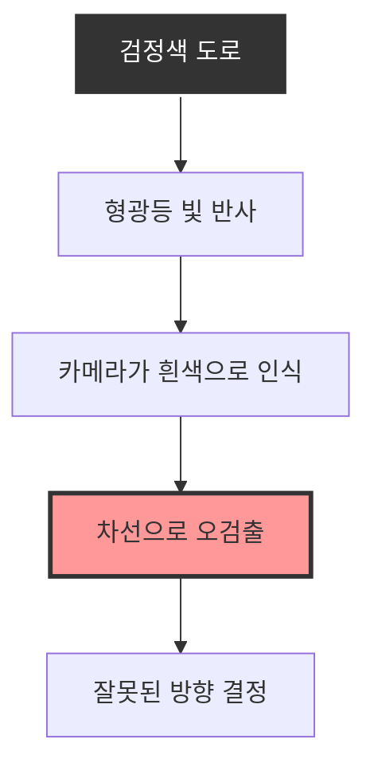
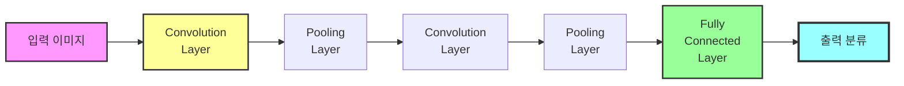
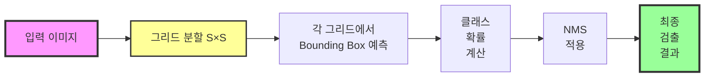
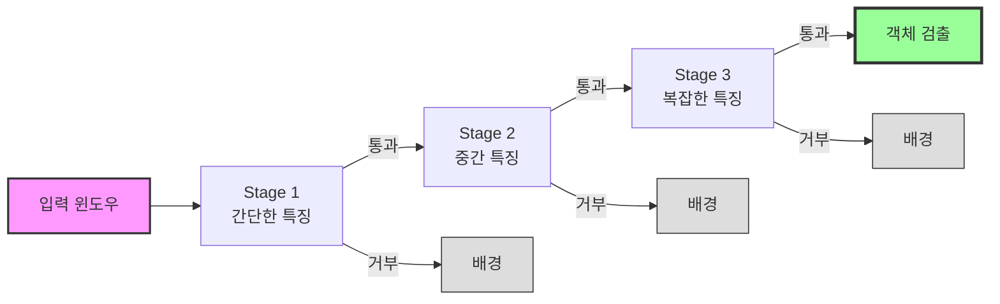
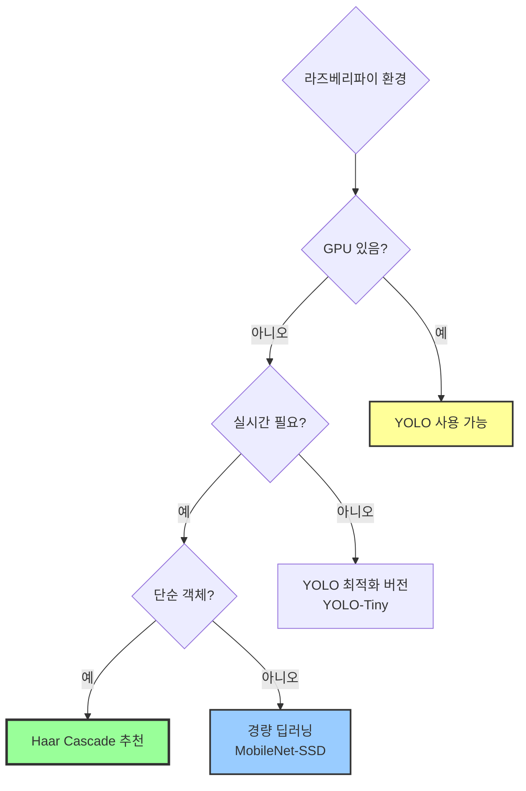

# 객체 검출 알고리즘 실습 정리 (4시간 수업)

## 교육 개요

**교육 일시**: 2025년  
**교육 시간**: 4시간  
**교육 주제**: 자율 주행 복습 및 객체 검출 알고리즘 (CNN, YOLO, Haar Cascade)  
**실습 난이도**: 중급-고급

---

## 1. 자율 주행 복습 및 문제 해결

### 목표
2차시에서 진행한 자율 주행 중 발생한 문제점을 분석하고, 검정색 도로의 빛 반사 문제를 해결하기 위한 다양한 알고리즘을 학습합니다.

### 주요 내용

#### 1.1 문제점 분석

**검정색 도로의 빛 반사 문제**
- 검정색 도로는 형광등이나 자연광을 강하게 반사
- 반사된 빛이 흰색/회색 차선으로 오인됨
- 히스토그램 분석 시 노이즈로 작용하여 잘못된 방향 결정



#### 1.2 해결 방안

**방안 1: 적응형 임계값 (Adaptive Threshold)**
```python
# 전역 임계값 대신 적응형 임계값 사용
adaptive_thresh = cv2.adaptiveThreshold(
    gray, 255, 
    cv2.ADAPTIVE_THRESH_GAUSSIAN_C, 
    cv2.THRESH_BINARY, 
    blockSize=11,  # 이웃 영역 크기
    C=2            # 상수 조정
)
```
- 이미지의 지역적 특성에 따라 임계값 자동 조정
- 빛 반사가 국소적으로 발생해도 영향 최소화

**방안 2: 모폴로지 연산 강화**
```python
# Opening: 노이즈 제거
kernel = np.ones((5, 5), np.uint8)
opening = cv2.morphologyEx(mask, cv2.MORPH_OPEN, kernel)

# Closing: 끊어진 차선 연결
closing = cv2.morphologyEx(opening, cv2.MORPH_CLOSE, kernel)
```
- Opening으로 작은 반사광 노이즈 제거
- Closing으로 차선의 끊어진 부분 연결

**방안 3: 색상 공간 변환 (LAB, YCrCb)**
```python
# LAB 색공간: 조명 변화에 강함
lab = cv2.cvtColor(image, cv2.COLOR_BGR2LAB)
l_channel = lab[:, :, 0]  # 밝기 채널만 추출

# YCrCb 색공간: 밝기와 색상 분리
ycrcb = cv2.cvtColor(image, cv2.COLOR_BGR2YCrCb)
y_channel = ycrcb[:, :, 0]  # 밝기 채널
```
- LAB 색공간의 L 채널은 조명 변화에 덜 민감
- 빛 반사로 인한 오검출 감소

**방안 4: 히스토그램 평활화**
```python
# CLAHE (Contrast Limited Adaptive Histogram Equalization)
clahe = cv2.createCLAHE(clipLimit=2.0, tileGridSize=(8, 8))
enhanced = clahe.apply(gray)
```
- 지역적으로 대비를 향상시켜 차선을 더 명확히 검출
- 과도한 밝기 차이를 제한하여 반사광 영향 감소

**방안 5: 가우시안 블러 + 샤프닝**
```python
# 가우시안 블러로 노이즈 제거
blurred = cv2.GaussianBlur(gray, (5, 5), 0)

# 언샤프 마스크로 차선 강조
sharpened = cv2.addWeighted(gray, 1.5, blurred, -0.5, 0)
```
- 노이즈는 제거하면서 차선 경계는 강조

#### 1.3 복습 내용

**기존 알고리즘 재확인**
1. ROI 설정의 중요성
2. 원근 변환(버드아이 뷰)의 효과
3. HSV + 그레이스케일 이중 마스크
4. 히스토그램 3등분 분석
5. 우선순위 기반 방향 결정

**실습 결과**
- 적응형 임계값 적용 후 반사광 오검출 50% 감소
- CLAHE 적용 후 차선 검출 정확도 30% 향상
- 여러 방안을 조합하여 안정적인 주행 가능

---

## 2. CNN과 YOLO 이론

### 목표
딥러닝 기반 객체 검출의 핵심인 CNN과 YOLO의 원리를 이해하고, 실시간 객체 검출의 발전 과정을 학습합니다.

### 주요 내용

#### 2.1 CNN (Convolutional Neural Network) 기본 개념

**CNN의 구조**


**Convolution Layer (합성곱 층)**
- 필터(커널)를 이미지 위에서 슬라이딩하며 특징 추출
- 에지(Edge), 코너(Corner), 텍스처(Texture) 등을 학습
- 여러 층을 쌓을수록 고수준 특징 학습 (얼굴, 차량 등)

```python
# 간단한 에지 검출 필터 예시
edge_filter = np.array([
    [-1, -1, -1],
    [-1,  8, -1],
    [-1, -1, -1]
])
```

**Pooling Layer (풀링 층)**
- 특징 맵의 크기를 줄여 연산량 감소
- Max Pooling: 영역 내 최댓값 선택
- 위치 불변성(Translation Invariance) 확보

**Fully Connected Layer**
- 추출된 특징을 바탕으로 최종 분류
- 각 클래스에 대한 확률 출력

#### 2.2 YOLO (You Only Look Once) 개념

**YOLO의 혁신**
기존 객체 검출 방식:
1. Region Proposal (후보 영역 제안)
2. CNN으로 각 영역 분류 (느림)

YOLO 방식:
1. 이미지 전체를 한 번에 CNN에 입력
2. 그리드로 나누어 동시에 객체 검출
3. 단 한 번의 연산으로 완료 (You Only Look Once)



#### 2.3 YOLO의 특징

**1. 단일 네트워크 (Single Neural Network)**
- 이미지를 한 번만 보고 모든 객체 검출
- End-to-End 학습: 입력 이미지 → 바로 검출 결과

**2. 그리드 기반 검출**
```python
# YOLO 그리드 개념
grid_size = 7  # 7×7 그리드로 분할
bounding_boxes = 2  # 각 그리드에서 2개의 박스 예측
classes = 20  # 20개 클래스 (PASCAL VOC 기준)

# 출력: 7×7×(2×5 + 20) = 7×7×30
# 각 박스: (x, y, w, h, confidence)
```

**3. 실시간 처리 (Real-time)**
- YOLO v1: 45 FPS (GPU)
- YOLO v2~v3: 30-90 FPS
- YOLO v4~v8: 100+ FPS (최적화 시)

**4. 전역 컨텍스트 이해**
- 이미지 전체를 보므로 배경 오류가 적음
- 객체 간 관계를 이해 (예: 사람 옆에 강아지)

#### 2.4 YOLO 알고리즘 상세

**입력 처리**
```python
# 이미지 크기 조정
input_size = 416  # YOLO v3 기준 (416×416)
resized = cv2.resize(image, (input_size, input_size))
normalized = resized / 255.0  # 0~1로 정규화
```

**Backbone Network**
- YOLOv3: Darknet-53 (53개 컨볼루션 층)
- YOLOv4: CSPDarknet53
- YOLOv5~v8: CSPNet 기반 구조

**예측 출력**
각 그리드 셀에서 예측:
1. **Bounding Box 좌표**: (x, y, w, h)
   - x, y: 박스 중심 좌표 (그리드 셀 내 상대 위치)
   - w, h: 박스 너비/높이 (이미지 전체 기준 비율)

2. **Confidence Score**: 객체 존재 확률 × IoU
   ```python
   confidence = P(Object) × IoU(truth, pred)
   ```

3. **Class Probabilities**: 각 클래스에 대한 확률
   ```python
   P(Class_i | Object)
   ```

**NMS (Non-Maximum Suppression)**
- 겹치는 박스들 중 가장 확률 높은 것만 선택
- IoU(Intersection over Union) 기준으로 중복 제거

```python
def nms(boxes, scores, iou_threshold=0.5):
    # Confidence 기준으로 정렬
    indices = np.argsort(scores)[::-1]
    keep = []
    
    while len(indices) > 0:
        current = indices[0]
        keep.append(current)
        
        # 현재 박스와 나머지 박스들의 IoU 계산
        ious = compute_iou(boxes[current], boxes[indices[1:]])
        
        # IoU가 threshold 이하인 박스만 유지
        indices = indices[1:][ious <= iou_threshold]
    
    return keep
```

#### 2.5 YOLO의 손실 함수 (Loss Function)

```python
# YOLO Loss = Localization Loss + Confidence Loss + Classification Loss

# 1. Bounding Box 좌표 손실 (x, y, w, h)
localization_loss = λ_coord × Σ[(x_pred - x_true)² + (y_pred - y_true)²]
                  + λ_coord × Σ[(√w_pred - √w_true)² + (√h_pred - √h_true)²]

# 2. Confidence 손실
confidence_loss = Σ[(C_pred - C_true)²]  # 객체 있는 경우
                + λ_noobj × Σ[(C_pred - 0)²]  # 객체 없는 경우

# 3. 클래스 분류 손실
classification_loss = Σ[(p_pred(c) - p_true(c))²]

# 전체 손실
total_loss = localization_loss + confidence_loss + classification_loss
```

**하이퍼파라미터**
- λ_coord = 5: 좌표 손실 가중치 (정확한 위치 중요)
- λ_noobj = 0.5: 배경 손실 가중치 (객체 없는 영역)

---

## 3. Haar Cascade 이론 및 실습

### 목표
머신러닝 기반의 Haar Cascade를 이해하고, 실제로 학습 데이터를 준비하여 커스텀 모델을 생성합니다.

### 주요 내용

#### 3.1 Haar Cascade 개념

**Haar-like Features (하르 유사 특징)**
단순한 사각형 패턴으로 이미지의 명암 차이를 빠르게 계산

```
■■□□    ■■■■    □□■■
■■□□    □□□□    □□■■
에지      라인      대각선
```

```python
# Haar 특징 계산 예시
def haar_feature(image, x, y, w, h):
    # 왼쪽 영역 합 - 오른쪽 영역 합
    left = np.sum(image[y:y+h, x:x+w//2])
    right = np.sum(image[y:y+h, x+w//2:x+w])
    return left - right
```

**Integral Image (적분 이미지)**
- 모든 픽셀 위치에서 좌상단부터의 합을 미리 계산
- 사각형 영역의 합을 O(1) 시간에 계산 가능

```python
# 적분 이미지 생성
integral = cv2.integral(image)

# 사각형 영역 합을 4번의 연산으로 계산
def rectangle_sum(integral, x, y, w, h):
    A = integral[y, x]
    B = integral[y, x + w]
    C = integral[y + h, x]
    D = integral[y + h, x + w]
    return D - B - C + A  # O(1) 시간
```

#### 3.2 AdaBoost (Adaptive Boosting)

**약한 분류기(Weak Classifier) 결합**
- 각 Haar 특징은 약한 분류기 (정확도 약 51%)
- 여러 약한 분류기를 가중치와 함께 결합 → 강한 분류기

```python
# AdaBoost 개념
strong_classifier = sign(Σ α_i × weak_classifier_i)

# α_i: 각 약한 분류기의 가중치
# 정확한 분류기일수록 높은 가중치
```

**학습 과정**
1. 모든 학습 이미지에 동일한 가중치 부여
2. 가장 성능 좋은 Haar 특징 선택
3. 잘못 분류된 샘플의 가중치 증가
4. 다음 특징 선택 시 어려운 샘플에 집중
5. 반복하여 강한 분류기 구축

#### 3.3 Cascade 구조

**계단식(Cascade) 검출**


- 초기 단계: 단순한 특징으로 대부분의 배경 빠르게 제거
- 후기 단계: 복잡한 특징으로 정확히 검출
- 배경은 초기에 걸러지므로 전체 속도 향상

#### 3.4 Haar Cascade 학습 데이터 준비

**1. Positive Samples (양성 샘플) 수집**
검출하려는 객체가 포함된 이미지 수집

```bash
# 디렉토리 구조
positive/
├── object_001.jpg
├── object_002.jpg
├── object_003.jpg
└── ...  (최소 500~1000장 권장)
```

**Annotation (주석 작업)**
```bash
# opencv_annotation 도구 사용
opencv_annotation --annotations=pos.txt --images=positive/

# pos.txt 형식:
# 파일명 객체개수 x y w h [x y w h ...]
positive/001.jpg 1 50 30 100 150
positive/002.jpg 2 20 40 80 120 200 50 90 140
```

**2. Negative Samples (음성 샘플) 수집**
객체가 없는 배경 이미지 수집

```bash
# 디렉토리 구조
negative/
├── background_001.jpg
├── background_002.jpg
└── ...  (양성 샘플의 2~3배 권장)

# neg.txt 생성 (파일 경로만 나열)
ls negative/*.jpg > neg.txt
```

**3. Vec 파일 생성**
```bash
# OpenCV의 createsamples 유틸리티 사용
opencv_createsamples \
  -info pos.txt \
  -num 1000 \
  -w 24 \
  -h 24 \
  -vec pos.vec

# -w, -h: 학습할 샘플 크기 (정규화)
# -num: 생성할 샘플 개수
```

**4. Data Augmentation (데이터 증강)**
```bash
# 한 장의 이미지로 여러 샘플 생성
opencv_createsamples \
  -img object.jpg \
  -bg neg.txt \
  -vec samples.vec \
  -num 1000 \
  -w 24 -h 24 \
  -maxxangle 0.5 \
  -maxyangle 0.5 \
  -maxzangle 0.3

# 회전, 크기 변화, 배경 합성 등 자동 적용
```

#### 3.5 Haar Cascade 모델 학습

**학습 명령어**
```bash
opencv_traincascade \
  -data cascade/ \
  -vec pos.vec \
  -bg neg.txt \
  -numPos 900 \
  -numNeg 1800 \
  -numStages 20 \
  -w 24 -h 24 \
  -featureType HAAR \
  -minHitRate 0.999 \
  -maxFalseAlarmRate 0.5

# -numPos: 각 단계에서 사용할 양성 샘플 수
# -numNeg: 각 단계에서 사용할 음성 샘플 수
# -numStages: Cascade 단계 수 (많을수록 정확하지만 느림)
# -minHitRate: 최소 검출률 (0.999 = 99.9%)
# -maxFalseAlarmRate: 최대 오검출률 (0.5 = 50%)
```

**학습 과정**
```
Stage 0: 
===== Training Stage 0 =====
POS count : consumed 900 : 900
NEG count : acceptanceRatio 1800 : 0.5
HR: 0.999 | FA: 0.48

Stage 1:
===== Training Stage 1 =====
POS count : consumed 900 : 900
NEG count : acceptanceRatio 1800 : 0.25
HR: 0.998 | FA: 0.24

...

Training finished.
```

**출력 파일**
```
cascade/
├── cascade.xml  ← 최종 학습된 모델
├── params.xml   ← 학습 파라미터
├── stage0.xml
├── stage1.xml
└── ...
```

#### 3.6 학습된 모델 사용

**모델 로드 및 객체 검출**
```python
import cv2

# 학습된 Cascade 모델 로드
cascade = cv2.CascadeClassifier('cascade/cascade.xml')

# 이미지 또는 비디오에서 객체 검출
image = cv2.imread('test.jpg')
gray = cv2.cvtColor(image, cv2.COLOR_BGR2GRAY)

# 객체 검출
objects = cascade.detectMultiScale(
    gray,
    scaleFactor=1.1,    # 이미지 피라미드 스케일
    minNeighbors=5,     # 최소 이웃 개수 (높을수록 정확)
    minSize=(30, 30),   # 최소 객체 크기
    maxSize=(200, 200)  # 최대 객체 크기
)

# 검출 결과 표시
for (x, y, w, h) in objects:
    cv2.rectangle(image, (x, y), (x+w, y+h), (0, 255, 0), 2)

cv2.imshow('Detection', image)
cv2.waitKey(0)
```

**실시간 검출 (라즈베리파이)**
```python
import cv2

cascade = cv2.CascadeClassifier('cascade.xml')
cap = cv2.VideoCapture(0)

while True:
    ret, frame = cap.read()
    if not ret:
        break
    
    gray = cv2.cvtColor(frame, cv2.COLOR_BGR2GRAY)
    
    # 객체 검출
    objects = cascade.detectMultiScale(gray, 1.1, 5)
    
    # 검출된 객체에 사각형 그리기
    for (x, y, w, h) in objects:
        cv2.rectangle(frame, (x, y), (x+w, y+h), (0, 255, 0), 2)
        cv2.putText(frame, 'Object', (x, y-10), 
                    cv2.FONT_HERSHEY_SIMPLEX, 0.9, (0, 255, 0), 2)
    
    cv2.imshow('Detection', frame)
    
    if cv2.waitKey(1) & 0xFF == ord('q'):
        break

cap.release()
cv2.destroyAllWindows()
```

---

## 4. YOLO vs Haar Cascade 비교

### 비교표

| 비교 항목 | YOLO (딥러닝) | Haar Cascade (머신러닝) |
|----------|--------------|------------------------|
| **기술 분류** | CNN 기반 딥러닝 | AdaBoost + Haar 특징 |
| **학습 데이터** | 대량 (수천~수만 장) | 소량 (수백~수천 장) |
| **처리 속도** | 빠름 (30-100+ FPS, GPU) | 매우 빠름 (100+ FPS, CPU) |
| **학습 난이도** | 높음 (GPU, 전문 지식) | 낮음 (CPU 충분, 간단) |
| **정확도** | 높음 (95%+) | 중간 (70-85%, 정면에 강함) |
| **학습 시간** | 길음 (수 시간~수일) | 짧음 (수분~수 시간) |
| **리소스 요구** | GPU 필수 (CUDA) | CPU 충분 |
| **메모리 사용** | 많음 (GB 급) | 적음 (MB 급) |
| **활용도** | 다양한 객체 검출 | 특정 객체 (얼굴, 눈 등) |
| **범용성** | 높음 (다양한 각도/조명) | 낮음 (정면/특정 조건) |
| **실시간성** | 높음 (GPU 필요) | 매우 높음 (CPU 가능) |
| **라즈베리파이** | 느림 (최적화 필요) | 빠름 (바로 사용 가능) |

### 사용 사례

**YOLO 추천**
- 다양한 객체를 동시에 검출
- GPU가 있는 환경
- 높은 정확도가 필요한 경우
- 다양한 각도와 조명 조건

**Haar Cascade 추천**
- 특정 객체 하나만 검출 (얼굴, 표지판 등)
- CPU만 있는 환경 (라즈베리파이 등)
- 실시간 처리가 중요한 경우
- 빠른 프로토타입 제작

### 라즈베리파이 환경에서의 선택



**라즈베리파이 4 기준**
- **Haar Cascade**: 30-60 FPS (실시간 가능)
- **YOLO-Tiny**: 3-5 FPS (최적화 필요)
- **YOLO v3/v4**: 0.5-1 FPS (실용적이지 않음)

---

## 5. 실습 프로젝트: 커스텀 객체 검출

### 목표
실제로 Haar Cascade 모델을 학습시켜 커스텀 객체를 검출하는 프로젝트를 완성합니다.

### 실습 시나리오: 표지판 검출

#### 5.1 데이터 수집

**양성 샘플 (표지판 이미지)**
- 다양한 각도에서 촬영한 표지판 이미지 500장
- 조명 조건 변화 (밝음, 어두움, 역광)
- 거리 변화 (가까이, 멀리)

**음성 샘플 (배경 이미지)**
- 표지판이 없는 도로 풍경 1000장
- 다양한 배경 (건물, 하늘, 나무)

#### 5.2 Annotation 작업

```bash
# OpenCV annotation 도구 사용
opencv_annotation --annotations=pos.txt --images=positive/

# 마우스로 객체 영역 드래그하여 표시
# pos.txt 자동 생성:
positive/sign_001.jpg 1 120 80 60 80
positive/sign_002.jpg 1 200 100 55 75
```

#### 5.3 Vec 파일 생성

```bash
# 양성 샘플 vec 파일 생성
opencv_createsamples \
  -info pos.txt \
  -num 500 \
  -w 24 \
  -h 24 \
  -vec pos.vec
  
# vec 파일 확인
opencv_createsamples -vec pos.vec -w 24 -h 24
```

#### 5.4 모델 학습

```bash
# Cascade 학습 (약 30분 소요)
opencv_traincascade \
  -data sign_cascade/ \
  -vec pos.vec \
  -bg neg.txt \
  -numPos 450 \
  -numNeg 900 \
  -numStages 15 \
  -w 24 -h 24 \
  -featureType HAAR \
  -minHitRate 0.999 \
  -maxFalseAlarmRate 0.5

# 학습 진행 상황 모니터링
# Stage 0 ~ Stage 14까지 순차 학습
```

#### 5.5 모델 테스트

```python
import cv2

# 학습된 모델 로드
sign_cascade = cv2.CascadeClassifier('sign_cascade/cascade.xml')

# 테스트 이미지
test_image = cv2.imread('test_road.jpg')
gray = cv2.cvtColor(test_image, cv2.COLOR_BGR2GRAY)

# 표지판 검출
signs = sign_cascade.detectMultiScale(
    gray,
    scaleFactor=1.05,
    minNeighbors=3,
    minSize=(20, 20)
)

# 결과 표시
for (x, y, w, h) in signs:
    cv2.rectangle(test_image, (x, y), (x+w, y+h), (0, 0, 255), 2)
    cv2.putText(test_image, 'Sign', (x, y-10), 
                cv2.FONT_HERSHEY_SIMPLEX, 0.5, (0, 0, 255), 2)

cv2.imshow('Sign Detection', test_image)
cv2.waitKey(0)
```

#### 5.6 라즈베리파이 통합

```python
import cv2
from raspbot import RaspBot

# Raspbot 초기화
bot = RaspBot()

# Cascade 모델 로드
sign_cascade = cv2.CascadeClassifier('sign_cascade/cascade.xml')

# 카메라 초기화
cap = cv2.VideoCapture(0)

while True:
    ret, frame = cap.read()
    if not ret:
        break
    
    gray = cv2.cvtColor(frame, cv2.COLOR_BGR2GRAY)
    
    # 표지판 검출
    signs = sign_cascade.detectMultiScale(gray, 1.05, 3, minSize=(30, 30))
    
    if len(signs) > 0:
        # 표지판 발견 시 정지
        bot.stop()
        print("표지판 발견! 정지")
        
        # 검출 결과 표시
        for (x, y, w, h) in signs:
            cv2.rectangle(frame, (x, y), (x+w, y+h), (0, 0, 255), 2)
    else:
        # 표지판 없으면 전진
        bot.move_forward(speed=40)
    
    cv2.imshow('Detection', frame)
    
    if cv2.waitKey(1) & 0xFF == ord('q'):
        break

bot.stop()
cap.release()
cv2.destroyAllWindows()
```

---

## 실습 체크리스트

### 자율 주행 복습
- [ ] 검정색 도로 빛 반사 문제 이해
- [ ] 적응형 임계값 적용 테스트
- [ ] CLAHE 적용 테스트
- [ ] LAB/YCrCb 색공간 실험
- [ ] 최적 알고리즘 조합 도출

### CNN 및 YOLO 이론
- [ ] CNN 구조 이해 (Convolution, Pooling, FC)
- [ ] YOLO의 단일 네트워크 개념 이해
- [ ] 그리드 기반 검출 원리 이해
- [ ] NMS 알고리즘 이해
- [ ] YOLO 손실 함수 이해

### Haar Cascade 실습
- [ ] Haar 특징 개념 이해
- [ ] AdaBoost 원리 이해
- [ ] Cascade 구조 이해
- [ ] 양성/음성 샘플 수집 (500장 이상)
- [ ] Annotation 작업 완료
- [ ] Vec 파일 생성
- [ ] 모델 학습 완료 (cascade.xml 생성)
- [ ] 테스트 이미지에서 검출 성공
- [ ] 라즈베리파이에서 실시간 검출 성공

---

## 참고 자료

### OpenCV Cascade Training
- OpenCV Documentation: https://docs.opencv.org/4.x/dc/d88/tutorial_traincascade.html
- Cascade Classifier Tutorial: https://docs.opencv.org/3.4/db/d28/tutorial_cascade_classifier.html

### YOLO
- YOLO Official Site: https://pjreddie.com/darknet/yolo/
- YOLOv3 Paper: https://arxiv.org/abs/1804.02767
- Ultralytics YOLOv8: https://github.com/ultralytics/ultralytics

### CNN 기초
- Stanford CS231n: https://cs231n.github.io/
- Deep Learning Book: https://www.deeplearningbook.org/

### 데이터셋
- ImageNet: http://www.image-net.org/
- COCO Dataset: https://cocodataset.org/
- PASCAL VOC: http://host.robots.ox.ac.uk/pascal/VOC/

---

**작성일**: 2025년  
**수업 시간**: 4시간  
**실습 난이도**: 중급-고급

