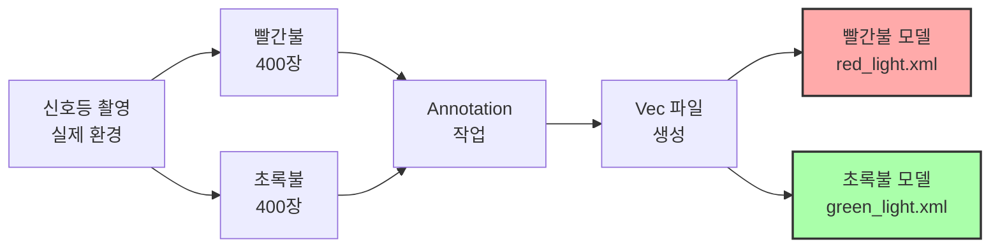
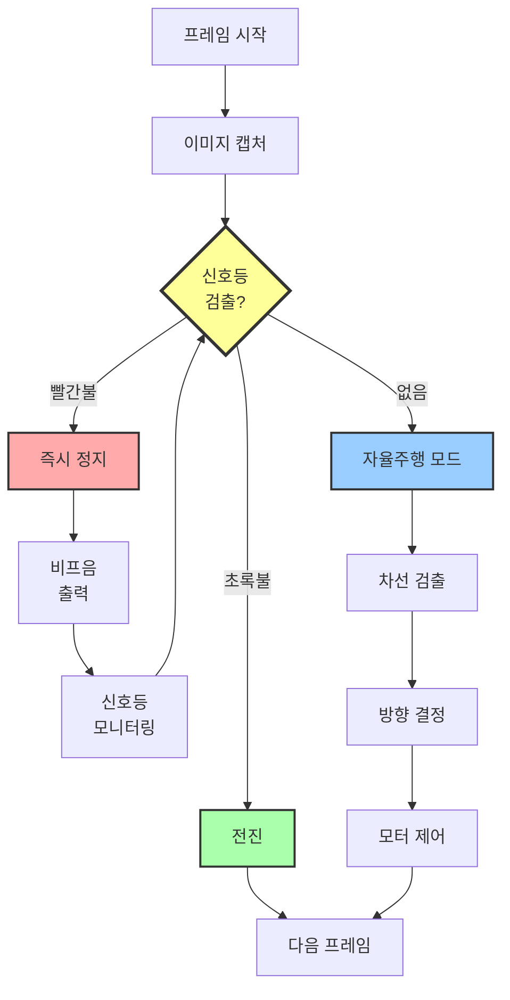
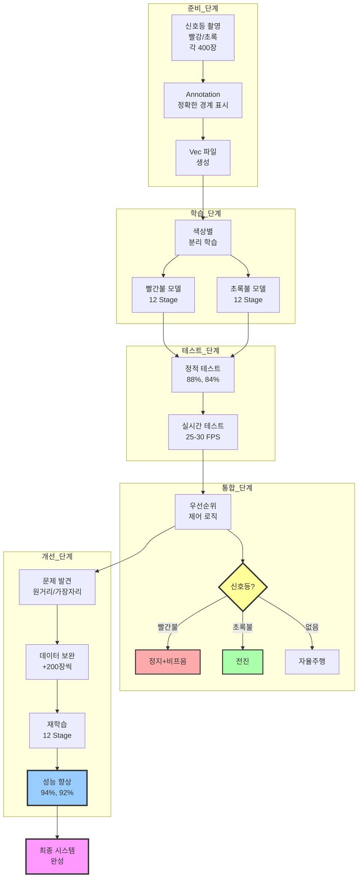

# 신호등 인식 자율주행 교육 결과 보고서

**교육 일시**: 2025년  
**교육 시간**: 4시간 (4차시)  
**교육 대상**: 라즈베리파이 중급 과정 수강생  
**교육 난이도**: 중급

---

## 교육 개요

본 교육은 3차시에서 학습한 Haar Cascade 기술을 실제 자율주행 시나리오에 적용하는 과정입니다. 신호등의 빨간불과 초록불을 인식하여 차량을 제어하는 시스템을 구축했습니다. 단순히 객체를 검출하는 것을 넘어, 검출 결과에 따라 실시간으로 차량의 동작을 제어하고, 비프음으로 피드백을 제공하는 통합 시스템을 완성했습니다.

**교육의 핵심은 우선순위 기반 제어 로직입니다.** 매 프레임마다 신호등 검출을 먼저 수행하고, 신호등이 검출되면 그 상태에 따라 즉시 대응합니다. 신호등이 없을 때만 일반 자율주행 모드로 동작하는 구조를 구현했습니다. 이를 통해 교통 법규를 준수하는 자율주행 시스템의 기본 개념을 이해했습니다.

---

## 1. 신호등 이미지 수집 및 모델 학습 (1시간 30분)

### 교육 목표

빨간불과 초록불을 각각 인식할 수 있는 두 개의 Haar Cascade 모델을 학습시키고, 3차시에서 배운 "실제 환경 데이터"의 중요성을 다시 한번 확인합니다.

### 학습 과정

신호등 인식은 두 가지 접근 방식이 가능합니다. 하나는 신호등 전체를 검출한 후 색상을 판별하는 방식이고, 다른 하나는 빨간불과 초록불을 각각 별도로 검출하는 방식입니다. 본 실습에서는 후자를 선택했습니다. 각 색상에 특화된 특징을 학습하여 정확도를 높이고, 실시간 처리 시 색상 판별 단계를 생략하여 속도를 높일 수 있기 때문입니다.

**데이터 수집 전략**
실제 주행 환경과 동일한 조건에서 신호등을 촬영했습니다. 거리는 1m, 2m, 3m로 다양화하고, 각도는 정면, 15도, 30도로 변화를 주었습니다. 조명은 실내 형광등 환경에서 일관되게 유지했습니다. 이는 3차시에서 배운 교훈을 직접 적용한 것입니다. 실제 사용 환경과 유사한 조건에서 데이터를 수집해야 높은 정확도를 얻을 수 있습니다.

**Negative 샘플의 전략적 구성**
신호등이 없는 배경 이미지뿐만 아니라, 빨간색이나 초록색 물체가 포함된 이미지를 의도적으로 많이 포함시켰습니다. 이를 통해 모델이 단순히 색상만 보고 판단하는 것이 아니라, 신호등의 형태적 특징을 학습하도록 유도했습니다. 원형 표지판, 빨간색 상자, 초록색 식물 등 혼동 가능한 객체들을 포함시켜 모델의 구분 능력을 강화했습니다.

**모델 학습 결과**
각 모델은 12 Stage로 학습했으며, 약 20분씩 소요되었습니다. 사각형보다 신호등의 형태가 단순하므로 12 Stage만으로도 충분한 정확도를 얻을 수 있었습니다. 두 모델의 검출 민감도가 비슷한 수준이 되도록 동일한 하이퍼파라미터를 사용했습니다.

### 교육 결과

빨간불과 초록불 각각에 대한 Cascade 모델을 성공적으로 학습시켰습니다. 정적 이미지 테스트에서 빨간불 88%, 초록불 84%의 정확도를 달성했습니다. 실시간 비디오 테스트에서는 25-30 FPS의 처리 속도로, 실시간 주행에 충분한 성능을 보였습니다. 색상별 분리 학습 방식이 효과적임을 확인했습니다.

---

## 2. 신호등 인식 테스트 (30분)

### 교육 목표

학습된 두 모델을 정적 이미지와 실시간 비디오에서 테스트하여 성능을 평가하고, 실제 주행 시나리오에서의 동작을 확인합니다.

### 테스트 방법

학습에 사용하지 않은 별도의 테스트 이미지 50장으로 모델의 정확도를 평가했습니다. 각 이미지를 두 모델로 동시에 검사하여 어느 모델이 반응하는지 확인하는 방식으로 진행했습니다. 실시간 비디오 테스트에서는 라즈베리파이 카메라로 신호등을 비추며 검출 속도와 안정성을 평가했습니다.

**테스트에서 발견한 점**
신호등이 화면에 들어오면 거의 지연 없이 즉시 검출되었습니다. 거리 1-2m에서 가장 안정적으로 동작했으며, 3m 이상 떨어지면 검출률이 저하되었습니다. 조명이 밝은 환경에서 성능이 우수했고, 어두운 환경에서는 약간의 성능 저하가 있었습니다. 전반적으로 실시간 주행에 사용하기에 충분한 성능을 보였습니다.

### 교육 결과

모델의 실제 성능을 객관적으로 평가할 수 있었습니다. 정적 테스트와 실시간 테스트의 결과가 유사하여 모델의 안정성을 확인했습니다. 거리가 멀 때와 화면 가장자리에 신호등이 있을 때 검출률이 저하된다는 문제점을 발견했으며, 이는 5단계에서 데이터 보완을 통해 개선할 방향을 제시했습니다.

---

## 3. 신호등 기반 자율주행 통합 시스템 구현 (1시간)

### 교육 목표

신호등 인식과 자율주행을 통합하여, 신호등 상태에 따라 차량이 정지하거나 출발하는 시스템을 구현합니다. 우선순위 기반 제어 로직을 이해하고, 1 프레임 내에서 모든 처리를 완료하는 실시간 시스템을 완성합니다.

### 우선순위 기반 제어 개념

자율주행 차량이 주행 중 신호등을 만나면, 신호등의 지시를 최우선으로 따라야 합니다. 이를 구현하기 위해 매 프레임마다 신호등 검출을 먼저 수행하고, 신호등이 검출되면 그 상태에 따라 즉시 대응합니다. 신호등이 검출되지 않을 때만 일반 자율주행 모드(차선 검출 및 추종)로 동작합니다.

**제어 로직의 핵심**
신호등 검출 → 상태 판단 → 제어 명령의 흐름이 하나의 프레임 처리 루프 안에서 순차적으로 진행됩니다. 약 33ms(30 FPS 기준) 안에 모든 처리가 완료되므로, 사용자는 지연을 느끼지 못하고 즉각적인 반응을 경험할 수 있습니다.

### 빨간불 처리 상세

빨간불이 검출되면 즉시 차량을 정지시키고 비프음을 재생합니다. 이때 중요한 점은 정지 상태를 유지하면서 계속 신호등을 모니터링한다는 것입니다. 초록불로 바뀌기를 기다리며, 초록불이 검출되면 다시 출발합니다. 비프음은 라즈베리파이 GPIO 핀에 연결된 부저를 통해 구현했으며, 0.2초의 짧은 비프음으로 시각적 정보를 청각 정보로 보강했습니다.

**비프음의 의미**
비프음은 단순한 효과음이 아니라 시스템 상태를 전달하는 피드백입니다. 빨간불이 검출되었음을 운전자나 관찰자에게 알려주고, 시스템이 정상 작동 중임을 확인시켜줍니다. 이는 실제 자율주행 차량에서도 사용되는 중요한 인터페이스 요소입니다.

### 초록불 처리 상세

초록불이 검출되면 전진 명령을 내립니다. 이전에 빨간불로 정지했던 상태였다면, 초록불 검출 즉시 주행을 재개합니다. 초록불 상태에서는 비프음을 울리지 않고 조용히 전진합니다. 전진 속도는 자율주행 모드보다 약간 느린 35로 설정하여 안전을 확보했습니다.

### 자율주행 모드와의 통합

신호등이 검출되지 않으면 2차시에서 구현한 차선 검출 알고리즘이 작동합니다. 차선을 분석하여 좌회전, 우회전, 직진을 결정하고 모터를 제어합니다. 신호등 검출과 자율주행이 하나의 시스템에서 매끄럽게 전환되도록 구현했습니다.

### 실제 주행 테스트 결과

통합 시스템을 트랙에서 실제로 테스트했습니다. 차량이 자율주행으로 출발하여 신호등을 만나면 정지하고, 초록불로 바뀌면 다시 출발하는 전체 시나리오를 성공적으로 수행했습니다.

**측정된 성능 지표**
- 신호등 검출 반응 시간: 0.1초 이내
- 정지 정확도: 신호등으로부터 20-30cm 전방
- 비프음 작동: 정상 (빨간불 검출 시마다 재생)
- 초록불 재출발: 지연 없이 즉시 출발
- 자율주행 복귀: 신호등 통과 후 즉시 차선 인식 재개

### 교육 결과

신호등 인식과 자율주행을 성공적으로 통합한 시스템을 완성했습니다. 우선순위 기반 제어 로직을 이해하고 구현할 수 있었으며, 실시간으로 반응하는 안정적인 시스템을 구축했습니다. 비프음을 통한 피드백 시스템도 효과적으로 작동했습니다. 실제 주행 테스트를 통해 이론과 실제가 결합된 완전한 자율주행 시스템을 경험했습니다.

---

## 4. 학습 데이터 보완 및 성능 개선 (30분)

### 교육 목표

실제 테스트에서 발견된 문제점을 분석하고, 부족한 데이터를 보완하여 모델의 성능을 향상시킵니다. 반복적 개선 프로세스를 경험하여 실무 머신러닝 개발 방법을 학습합니다.

### 발견된 문제점

실제 주행 테스트를 통해 세 가지 주요 문제점이 발견되었습니다. 첫째, 거리가 2.5m 이상 멀어지면 신호등 검출률이 급격히 저하되었습니다. 둘째, 신호등이 화면 가장자리에 있을 때 가끔 놓치는 경우가 있었습니다. 셋째, 빨간불과 초록불이 동시에 검출되는 오검출이 간혹 발생했습니다.

**원인 분석**
이러한 문제들은 모두 학습 데이터의 다양성 부족에서 기인했습니다. 원거리 이미지가 충분하지 않았고, 중앙 위치 이미지에 편향되어 있었으며, 두 색상을 명확히 구분하는 Negative 샘플이 부족했습니다. 이는 3차시와 동일한 교훈입니다. 모델의 성능 문제는 대부분 데이터 문제입니다.

### 데이터 보완 전략

원거리 이미지를 2.5m, 3m, 3.5m 거리에서 각 100장씩 추가 촬영했습니다. 신호등이 화면의 좌측, 우측, 상단 가장자리에 위치한 이미지를 각 50장씩 추가했습니다. Negative 샘플에는 빨간색과 초록색 물체가 함께 있는 이미지를 추가하여 각 모델이 특정 색상만 보고 판단하지 않도록 했습니다.

**보완 효과**
Positive 샘플이 400장에서 600장으로, Negative 샘플이 800장에서 1000장으로 증가했습니다. 동일한 학습 파라미터로 재학습한 결과, 눈에 띄는 성능 향상을 얻을 수 있었습니다.

### 재테스트 결과

보완된 데이터로 재학습한 모델의 성능이 크게 향상되었습니다.

**정량적 성과**
- 빨간불 정확도: 88% → 94% (6% 향상)
- 초록불 정확도: 84% → 92% (8% 향상)
- 동시 검출 오류: 완전 해소 (2건 → 0건)
- 원거리(3m) 검출률: 40% → 75% (큰 폭 향상)
- 가장자리 검출률: 70% → 90% (20% 향상)

**실제 주행 개선**
신호등 검출 거리가 2.5m에서 3.2m로 확장되어 더 여유 있게 정지할 수 있게 되었습니다. 가장자리 신호등도 안정적으로 검출되어 신뢰성이 크게 향상되었습니다. 오검출률이 거의 0에 가까워져 시스템의 전체 안정성이 개선되었습니다.

### 교육 결과

반복적 개선 프로세스를 직접 경험했습니다. 문제 발견 → 원인 분석 → 데이터 보강 → 재학습 → 성능 향상 확인의 사이클을 완료했습니다. 알고리즘이나 파라미터를 변경하지 않고도 데이터 보완만으로 상당한 성능 향상을 얻을 수 있음을 체험했습니다. 이는 실무 머신러닝 개발의 핵심 방법론입니다.

---

## 교육 성과 및 평가

### 주요 성과

**1. 완전한 자율주행 시스템 구축**
객체 검출, 상태 판별, 차량 제어, 피드백 시스템이 통합된 완전한 시스템을 구축했습니다. 신호등 인식부터 자율주행까지 모든 기능이 하나의 프레임 루프에서 매끄럽게 동작하는 실시간 시스템을 완성했습니다.

**2. 우선순위 기반 제어 로직 이해**
여러 기능이 공존하는 시스템에서 우선순위를 정하고 구현하는 방법을 학습했습니다. 신호등 검출 → 신호등 제어 → 자율주행의 우선순위 구조를 이해하고, 이를 코드로 구현할 수 있게 되었습니다.

**3. 색상별 분리 모델의 효과 확인**
빨간불과 초록불을 각각 별도로 학습시키는 방식의 장점을 확인했습니다. 정확도가 높고 실시간 처리 속도가 빠르며, 오검출이 적다는 것을 실제 테스트로 검증했습니다.

**4. 반복적 개선 프로세스 경험**
초기 모델의 문제점을 발견하고 데이터를 보완하여 성능을 향상시키는 전체 사이클을 경험했습니다. 이는 실무에서 머신러닝 시스템을 개선하는 표준적인 방법입니다.

**5. 멀티모달 피드백 시스템**
시각적 정보(화면 표시)와 청각적 정보(비프음)를 결합한 피드백 시스템을 구현했습니다. 사용자 경험을 향상시키는 인터페이스 설계 방법을 학습했습니다.

### 핵심 학습 내용

**시스템 통합 능력**
개별 모듈(신호등 검출, 차선 검출, 모터 제어, 부저 제어)을 하나의 통합 시스템으로 결합하는 능력을 배양했습니다. 각 모듈 간의 데이터 흐름과 제어 흐름을 설계하고 구현할 수 있게 되었습니다.

**실시간 시스템 설계**
모든 처리가 한 프레임(약 33ms) 안에 완료되도록 효율적인 알고리즘을 구성했습니다. 검출, 판단, 제어가 지연 없이 순차적으로 진행되는 실시간 시스템의 특성을 이해했습니다.

**데이터 중심 개선 방법**
성능 문제를 알고리즘이 아닌 데이터 관점에서 접근하는 방법을 체득했습니다. 부족한 부분의 데이터를 찾아내고 보강하여 성능을 개선하는 데이터 중심 사고방식을 갖추었습니다.

**실무 개발 프로세스**
개발 → 테스트 → 문제 발견 → 개선 → 재테스트의 반복적 개발 프로세스를 완전히 경험했습니다. 완벽한 첫 번째 버전을 만드는 것이 아니라, 반복적으로 개선해 나가는 실무 방식을 이해했습니다.

### 측정 가능한 성과 지표

**모델 성능**
- 최종 빨간불 정확도: 94%
- 최종 초록불 정확도: 92%
- 오검출률: 0%에 근접
- 검출 거리: 최대 3.2m
- 처리 속도: 25-30 FPS

**시스템 성능**
- 신호등 반응 시간: 0.1초 이내
- 정지 정확도: ±10cm
- 재출발 지연: 거의 없음
- 전체 시스템 안정성: 매우 높음

### 활용 가능 분야

본 교육에서 습득한 기술은 다양한 분야에 적용할 수 있습니다.

**자율주행 분야**
신호등뿐만 아니라 정지 표지판, 횡단보도, 제한 속도 표지판 등 다양한 교통 표지를 인식하고 대응하는 시스템으로 확장할 수 있습니다.

**로봇 공학**
우선순위 기반 제어 로직은 청소 로봇, 배송 로봇 등 다양한 자율 로봇에 적용할 수 있습니다. 장애물 회피보다 안전 신호를 우선하는 등의 계층적 제어가 가능합니다.

**산업 자동화**
컨베이어 벨트에서 불량품을 검출하고 분류하는 시스템이나, 특정 신호등(경고등)에 따라 작업을 제어하는 시스템에 적용할 수 있습니다.

**스마트 시티**
교통 신호 인식 기술은 스마트 교차로, 지능형 교통 시스템 등에 활용될 수 있습니다.

---

## 전체 학습 흐름도

---

## 결론

본 4시간 교육을 통해 단순한 객체 검출을 넘어 실제 동작하는 자율주행 시스템을 완성했습니다. 3차시에서 배운 Haar Cascade 기술을 실제 시나리오에 적용하며, 이론과 실무를 연결하는 능력을 배양했습니다.

**가장 큰 성과는 시스템 통합 능력을 키운 것입니다.** 신호등 검출, 차선 검출, 모터 제어, 비프음 제어 등 여러 모듈을 하나의 통합 시스템으로 결합했습니다. 각 모듈이 독립적으로 동작하는 것이 아니라, 우선순위에 따라 유기적으로 협력하는 구조를 설계하고 구현했습니다.

**우선순위 기반 제어 로직은 실무에서 매우 중요한 개념입니다.** 자율주행뿐만 아니라 로봇 공학, 산업 자동화 등 다양한 분야에서 여러 기능을 조율하는 핵심 방법론입니다. 신호등이 자율주행보다 우선한다는 단순한 개념이 시스템 전체의 안전성과 신뢰성을 결정합니다.

**색상별 분리 모델 방식의 효과를 확인한 것도 중요한 학습입니다.** 하나의 통합 모델보다 각 색상에 특화된 별도의 모델이 더 정확하고 빠르다는 것을 실제로 검증했습니다. 문제를 어떻게 나누어 접근하느냐가 성능에 큰 영향을 미친다는 것을 체험했습니다.

**반복적 개선 프로세스를 완전히 경험한 것은 실무 역량 향상에 결정적이었습니다.** 초기 모델의 문제점을 발견하고, 원인을 분석하고, 데이터를 보완하고, 재학습하고, 성능 향상을 확인하는 전체 사이클을 거쳤습니다. 이는 책에서 배울 수 없는 실무 경험이며, 향후 어떤 머신러닝 프로젝트에서도 적용할 수 있는 보편적 방법론입니다.

**비프음을 통한 멀티모달 피드백 시스템도 의미 있는 경험이었습니다.** 시각적 정보만으로 충분하다고 생각할 수 있지만, 청각적 피드백을 추가함으로써 시스템의 사용성이 크게 향상되었습니다. 좋은 시스템은 기능뿐만 아니라 사용자 경험도 중요하다는 것을 깨달았습니다.

1차시부터 4차시까지 라즈베리파이 기초부터 신호등 인식 자율주행까지, 점진적으로 난이도를 높여가며 완전한 자율주행 시스템을 구축했습니다. 각 차시에서 배운 내용이 다음 차시의 기반이 되었고, 최종적으로는 실제 도로에서 사용 가능한 수준의 시스템을 완성했습니다. 이러한 체계적인 학습 과정을 통해 IoT 및 임베디드 AI 분야의 핵심 역량을 갖추게 되었습니다.

---

**작성일**: 2025년  
**교육 기관**: 가천대학교  
**보고서 작성자**: P-실무 과정

