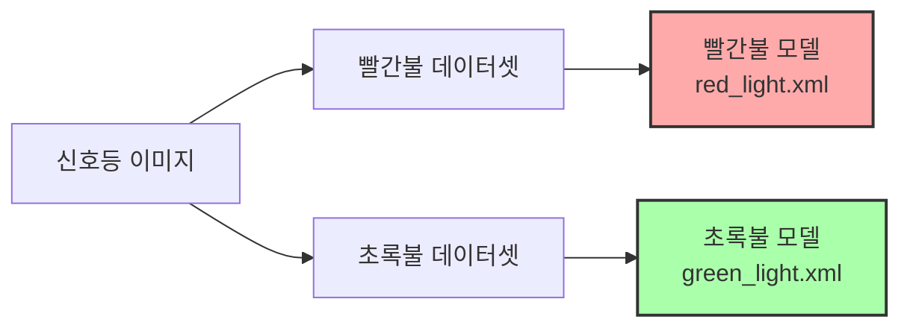
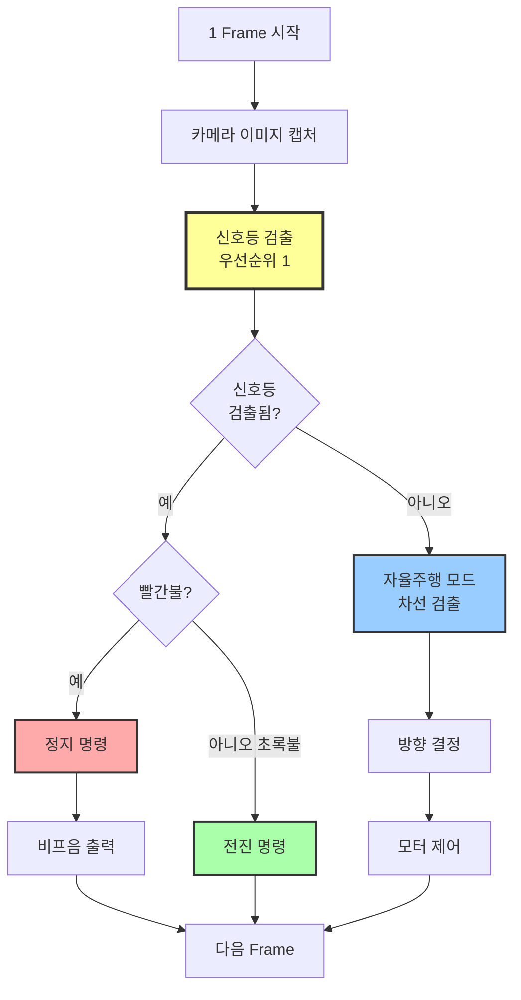
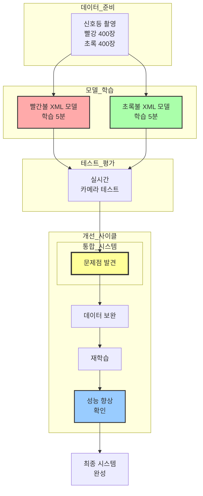

# 신호등 인식 자율주행 실습 정리 (4시간 수업)

## 교육 개요

**교육 일시**: 2025년  
**교육 시간**: 4시간  
**교육 주제**: Haar Cascade 기반 신호등 인식 및 자율주행 통합  
**실습 난이도**: 중급

---

## 교육 목표

3차시에서 학습한 Haar Cascade 기술을 실제 자율주행 시나리오에 적용합니다. 신호등의 빨간불과 초록불을 인식하여 차량이 정지하거나 출발하도록 제어하는 시스템을 구축합니다. 단순한 객체 검출을 넘어, 검출 결과에 따라 실시간으로 차량을 제어하는 통합 시스템을 완성하는 것이 핵심입니다.

---

## 1. 신호등 이미지 수집 및 학습 데이터 준비 (1시간 30분)

### 학습 목표

신호등의 빨간불과 초록불을 구분하여 인식할 수 있는 학습 데이터를 체계적으로 수집하고 준비합니다. 3차시에서 배운 "실제 환경과 유사한 데이터"의 중요성을 바탕으로, 실제 주행 환경과 동일한 조건에서 데이터를 수집합니다.

### 데이터 수집 전략

신호등 인식은 단순히 신호등을 찾는 것이 아니라 빨간불과 초록불을 구분해야 하므로, 두 가지 접근 방식이 가능합니다.

**접근 방식 1: 색상별 분리 학습**
빨간불 검출 모델과 초록불 검출 모델을 각각 따로 학습시키는 방식입니다. 각 색상에 특화된 모델을 만들어 정확도를 높일 수 있지만, 두 번의 학습 과정이 필요합니다.



**접근 방식 2: 통합 학습 후 색상 판별**
신호등 전체를 검출하는 하나의 모델을 학습시킨 후, 검출된 영역 내에서 HSV 색상 분석으로 빨간불인지 초록불인지 판별하는 방식입니다. 학습은 한 번만 하면 되지만, 후처리 단계가 추가됩니다.

본 실습에서는 **접근 방식 1(색상별 분리 학습)**을 채택했습니다. 각 신호등 상태에 특화된 특징을 학습할 수 있어 정확도가 더 높고, 실시간 처리 시 색상 판별 단계를 생략할 수 있어 속도도 빠르기 때문입니다.

### Positive Samples 수집

**빨간불 이미지 (400장)**
실제 주행 환경에서 라즈베리파이 카메라로 직접 촬영한 빨간 신호등 이미지를 수집했습니다. 다양한 거리(1m, 2m, 3m)와 각도(정면, 15도, 30도)에서 촬영하여 실제 주행 시나리오를 반영했습니다. 실내 조명 조건에서 촬영했으며, 신호등의 크기가 이미지에서 차지하는 비율도 다양하게 포함시켰습니다.

**초록불 이미지 (400장)**
동일한 위치와 조건에서 초록 신호등 이미지를 수집했습니다. 빨간불과 동일한 거리, 각도, 조명 조건을 유지하여 두 모델의 학습 조건을 일관되게 맞췄습니다. 이는 나중에 두 모델을 함께 사용할 때 균형 잡힌 검출 결과를 얻기 위함입니다.

**촬영 시 주의사항**
신호등의 전체 형태뿐만 아니라 불이 켜진 부분의 밝기 변화도 포함되도록 촬영했습니다. 신호등이 중앙에 위치한 이미지도 있지만, 화면 가장자리에 위치한 이미지도 포함시켜 실제 주행 시 다양한 상황을 대비했습니다.

### Negative Samples 수집

**배경 이미지 (800장)**
신호등이 없는 도로 환경, 실내 배경, 다양한 사물 등을 촬영했습니다. 특히 빨간색이나 초록색 물체가 포함된 이미지를 의도적으로 많이 포함시켜, 모델이 단순히 색상만 보고 판단하는 것이 아니라 신호등의 형태적 특징을 학습하도록 했습니다.

**유사 객체 이미지**
원형 표지판, 빨간색 상자, 초록색 식물 등 신호등과 혼동될 수 있는 객체들을 포함시켰습니다. 이를 통해 모델의 구분 능력을 향상시켰습니다.

### Annotation 작업

OpenCV의 annotation 도구를 사용하여 각 이미지에서 신호등의 정확한 위치를 표시했습니다. 신호등의 전체 영역을 포함하되, 과도한 배경이 포함되지 않도록 경계를 정확히 조정했습니다. 불이 켜진 부분을 중심으로 표시하되, 신호등의 외곽 틀도 함께 포함시켰습니다.

```
# red_pos.txt
red_light/red_001.jpg 1 120 80 40 60
red_light/red_002.jpg 1 200 100 35 55
...

# green_pos.txt
green_light/green_001.jpg 1 115 85 42 62
green_light/green_002.jpg 1 195 105 38 58
...
```

### Vec 파일 생성

빨간불과 초록불 각각에 대해 Vec 파일을 생성했습니다. 신호등은 비교적 작은 객체이므로 학습 크기를 20x30 픽셀로 설정했습니다. 이는 신호등의 세로로 긴 형태를 반영한 것입니다.

```bash
# 빨간불 Vec 파일
opencv_createsamples -info red_pos.txt -num 400 -w 20 -h 30 -vec red_light.vec

# 초록불 Vec 파일
opencv_createsamples -info green_pos.txt -num 400 -w 20 -h 30 -vec green_light.vec
```

---

## 2. Haar Cascade 모델 학습 (학습 데이터 준비 단계에 포함)

### 학습 과정

빨간불과 초록불 모델을 각각 학습시켰습니다. 3차시의 경험을 바탕으로 Stage 수는 12로 설정했습니다. 신호등은 사각형보다 형태가 단순하므로 12 Stage만으로도 충분한 정확도를 얻을 수 있었습니다.

**빨간불 모델 학습**
```bash
opencv_traincascade \
  -data red_cascade/ \
  -vec red_light.vec \
  -bg neg.txt \
  -numPos 360 \
  -numNeg 720 \
  -numStages 12 \
  -w 20 -h 30 \
  -featureType HAAR \
  -minHitRate 0.995 \
  -maxFalseAlarmRate 0.5
```

학습 과정에서 Stage 0에서는 오검출률이 높았지만, Stage 6을 넘어서면서 급격히 안정화되었습니다. 최종적으로 약 20분이 소요되어 `red_light.xml` 파일이 생성되었습니다.

**초록불 모델 학습**
동일한 파라미터로 초록불 모델을 학습시켰습니다. 빨간불과 유사한 학습 시간이 소요되었으며, `green_light.xml` 파일이 생성되었습니다.

### 학습 시 고려사항

두 모델의 검출 민감도가 비슷한 수준이 되도록 동일한 하이퍼파라미터를 사용했습니다. 만약 한쪽 모델만 검출률이 높거나 낮으면, 실제 주행 시 불균형한 결과가 나올 수 있기 때문입니다. 학습 완료 후에는 두 모델을 동일한 테스트 이미지셋에서 평가하여 성능 균형을 확인했습니다.

---

## 3. 신호등 인식 테스트 (30분)

### 정적 이미지 테스트

학습에 사용하지 않은 별도의 테스트 이미지 50장(빨간불 25장, 초록불 25장)으로 모델의 정확도를 평가했습니다. 각 이미지를 두 모델로 동시에 검사하여 어느 모델이 반응하는지 확인했습니다.

```python
# 두 모델 로드
red_cascade = cv2.CascadeClassifier('red_cascade/cascade.xml')
green_cascade = cv2.CascadeClassifier('green_cascade/cascade.xml')

# 테스트 이미지에서 검출
red_lights = red_cascade.detectMultiScale(gray, 1.1, 5, minSize=(15, 20))
green_lights = green_cascade.detectMultiScale(gray, 1.1, 5, minSize=(15, 20))

if len(red_lights) > 0:
    print("빨간불 검출")
elif len(green_lights) > 0:
    print("초록불 검출")
```

**테스트 결과**
- 빨간불 정확도: 88% (25장 중 22장 정확히 검출)
- 초록불 정확도: 84% (25장 중 21장 정확히 검출)
- 오검출: 빨간불과 초록불을 동시에 검출하는 경우 2건
- 미검출: 거리가 너무 멀거나 각도가 심한 경우 5건

### 실시간 비디오 테스트

라즈베리파이 카메라로 실시간 영상을 받아 신호등을 검출하는 테스트를 진행했습니다. 처리 속도는 약 25-30 FPS로, 실시간 주행에 충분한 성능을 보였습니다.

```python
cap = cv2.VideoCapture(0)

while True:
    ret, frame = cap.read()
    gray = cv2.cvtColor(frame, cv2.COLOR_BGR2GRAY)
    
    # 빨간불 검출
    red_lights = red_cascade.detectMultiScale(gray, 1.1, 5, minSize=(15, 20))
    
    # 초록불 검출
    green_lights = green_cascade.detectMultiScale(gray, 1.1, 5, minSize=(15, 20))
    
    # 검출 결과 표시
    for (x, y, w, h) in red_lights:
        cv2.rectangle(frame, (x, y), (x+w, y+h), (0, 0, 255), 2)
        cv2.putText(frame, 'RED', (x, y-10), 
                    cv2.FONT_HERSHEY_SIMPLEX, 0.6, (0, 0, 255), 2)
    
    for (x, y, w, h) in green_lights:
        cv2.rectangle(frame, (x, y), (x+w, y+h), (0, 255, 0), 2)
        cv2.putText(frame, 'GREEN', (x, y-10), 
                    cv2.FONT_HERSHEY_SIMPLEX, 0.6, (0, 255, 0), 2)
    
    cv2.imshow('Traffic Light Detection', frame)
```

**실시간 테스트에서 발견한 점**
- 신호등이 화면에 들어오면 즉시 검출됨 (지연 없음)
- 거리 1-2m에서 가장 안정적으로 검출
- 3m 이상 떨어지면 검출률 저하
- 조명이 밝은 환경에서 성능 우수

---

## 4. 신호등 기반 자율주행 제어 시스템 구현 (1시간)

### 시스템 설계 개념

자율주행 차량이 주행하면서 신호등을 만나면, 신호등의 상태에 따라 다르게 동작해야 합니다. 빨간불이면 정지하고 비프음을 울리며, 초록불이면 계속 주행합니다. 이때 중요한 것은 **신호등 인식을 먼저 처리하고 그 다음에 자율주행을 처리**한다는 점입니다.



### 우선순위 기반 제어 로직

신호등 검출이 자율주행보다 우선순위가 높습니다. 매 프레임마다 먼저 신호등이 있는지 확인하고, 신호등이 검출되면 그 상태에 따라 동작합니다. 신호등이 검출되지 않을 때만 일반 자율주행 모드로 동작합니다.

**제어 알고리즘 의사코드**
```
1. 카메라에서 이미지 캡처
2. 빨간불 검출 시도
3. IF 빨간불 검출됨:
     - 차량 정지
     - 비프음 재생 ("삐익")
     - 신호등 계속 모니터링
     - GOTO 1
4. 초록불 검출 시도
5. IF 초록불 검출됨:
     - 전진 명령
     - GOTO 1
6. IF 신호등 검출 안 됨:
     - 자율주행 모드 실행
     - 차선 검출 및 방향 결정
     - 모터 제어
     - GOTO 1
```

### 빨간불 처리 로직

빨간불이 검출되면 즉시 차량을 정지시키고 비프음을 재생합니다. 이때 중요한 점은 정지 상태를 유지하면서 계속 신호등을 모니터링한다는 것입니다. 초록불로 바뀌기를 기다리며, 초록불이 검출되면 다시 출발합니다.

```python
if len(red_lights) > 0:
    # 빨간불 검출 - 정지
    bot.stop()
    
    # 비프음 재생 (GPIO 부저 사용)
    GPIO.output(BUZZER_PIN, GPIO.HIGH)
    time.sleep(0.2)  # 0.2초 비프음
    GPIO.output(BUZZER_PIN, GPIO.LOW)
    
    # 상태 표시
    print("빨간불 - 정지")
    status = "RED_STOP"
```

**비프음 구현**
라즈베리파이의 GPIO 핀에 연결된 부저를 사용하여 비프음을 구현했습니다. 빨간불이 검출될 때마다 짧은 비프음(0.2초)을 재생하여 시각적 정보를 청각 정보로도 전달합니다.

### 초록불 처리 로직

초록불이 검출되면 전진 명령을 내립니다. 이전에 빨간불로 정지했던 상태였다면, 초록불 검출 즉시 주행을 재개합니다. 초록불 상태에서는 비프음을 울리지 않고 조용히 전진합니다.

```python
elif len(green_lights) > 0:
    # 초록불 검출 - 전진
    bot.move_forward(speed=35)
    
    # 상태 표시
    print("초록불 - 전진")
    status = "GREEN_GO"
```

### 자율주행 모드

신호등이 검출되지 않으면 일반 자율주행 모드로 동작합니다. 2차시에서 구현한 차선 검출 알고리즘을 사용하여 방향을 결정하고 모터를 제어합니다. 이때는 신호등 검출이 우선순위가 높으므로, 매 프레임마다 신호등 체크를 먼저 수행한 후 자율주행을 진행합니다.

```python
else:
    # 신호등 없음 - 자율주행 모드
    
    # 차선 검출 (2차시 알고리즘)
    lane_mask = detect_lanes(frame)
    direction = analyze_histogram(lane_mask)
    
    # 방향에 따라 제어
    if direction == "LEFT":
        bot.turn_left(speed=30)
    elif direction == "RIGHT":
        bot.turn_right(speed=30)
    else:
        bot.move_forward(speed=40)
    
    status = "AUTO_DRIVE"
```

### 1 Frame 통합 처리

모든 처리가 하나의 프레임 처리 루프 안에서 순차적으로 진행됩니다. 카메라에서 이미지를 받아온 후, 신호등 검출 → 상태 판단 → 제어 명령 → 다음 프레임으로 이동하는 과정이 약 33ms(30 FPS 기준) 안에 완료됩니다.

**통합 시스템 알고리즘**
```python
from raspbot import RaspBot
import cv2
import RPi.GPIO as GPIO

# 초기화
bot = RaspBot()
red_cascade = cv2.CascadeClassifier('red_cascade/cascade.xml')
green_cascade = cv2.CascadeClassifier('green_cascade/cascade.xml')
cap = cv2.VideoCapture(0)

BUZZER_PIN = 23
GPIO.setmode(GPIO.BCM)
GPIO.setup(BUZZER_PIN, GPIO.OUT)

while True:
    # 1. 이미지 캡처
    ret, frame = cap.read()
    gray = cv2.cvtColor(frame, cv2.COLOR_BGR2GRAY)
    
    # 2. 신호등 검출 (우선순위 1)
    red_lights = red_cascade.detectMultiScale(gray, 1.1, 5, minSize=(15, 20))
    green_lights = green_cascade.detectMultiScale(gray, 1.1, 5, minSize=(15, 20))
    
    # 3. 신호등 상태에 따른 제어
    if len(red_lights) > 0:
        # 빨간불 - 정지 + 비프음
        bot.stop()
        GPIO.output(BUZZER_PIN, GPIO.HIGH)
        time.sleep(0.2)
        GPIO.output(BUZZER_PIN, GPIO.LOW)
        
    elif len(green_lights) > 0:
        # 초록불 - 전진
        bot.move_forward(speed=35)
        
    else:
        # 신호등 없음 - 자율주행
        lane_mask = detect_lanes(frame)
        direction = analyze_histogram(lane_mask)
        
        if direction == "LEFT":
            bot.turn_left(speed=30)
        elif direction == "RIGHT":
            bot.turn_right(speed=30)
        else:
            bot.move_forward(speed=40)
    
    # 화면 표시 (디버깅용)
    cv2.imshow('Traffic Light Control', frame)
    
    if cv2.waitKey(1) & 0xFF == ord('q'):
        break

# 정리
bot.stop()
cap.release()
GPIO.cleanup()
```

### 실제 주행 테스트

통합 시스템을 트랙에서 테스트했습니다. 신호등 모형을 트랙의 특정 위치에 설치하고, 차량이 주행하면서 신호등을 만나도록 시나리오를 구성했습니다.

**테스트 시나리오**
1. 차량이 자율주행으로 출발
2. 1m 전방에 빨간 신호등 설치
3. 차량이 신호등을 인식하고 정지 (비프음 출력)
4. 신호등을 초록불로 변경
5. 차량이 초록불을 인식하고 출발
6. 다시 자율주행 모드로 복귀

**테스트 결과**
- 신호등 검출 반응 시간: 0.1초 이내 (즉각 반응)
- 정지 정확도: 신호등으로부터 20-30cm 전방에서 정지
- 비프음 작동: 정상 (빨간불 검출 시마다 0.2초 비프음)
- 초록불 재출발: 정상 (지연 없이 즉시 출발)
- 자율주행 복귀: 정상 (신호등 통과 후 차선 인식 재개)

---

## 5. 학습 데이터 보완 및 재테스트 (30분)

### 첫 번째 테스트에서 발견된 문제점

실제 주행 테스트 중 몇 가지 문제점이 발견되었습니다. 첫째, 거리가 멀 때(2.5m 이상) 신호등 검출률이 저하되었습니다. 둘째, 신호등이 화면 가장자리에 있을 때 가끔 놓치는 경우가 있었습니다. 셋째, 빨간불과 초록불이 동시에 검출되는 오검출이 간혹 발생했습니다.

**문제 분석**
- 먼 거리 미검출: 학습 데이터에 먼 거리 이미지 부족
- 가장자리 미검출: 중앙 위치 이미지에 편향된 학습
- 동시 검출: 두 모델의 검출 threshold 차이

### 데이터 보완 전략

**원거리 이미지 추가**
2.5m, 3m, 3.5m 거리에서 추가로 100장씩 촬영했습니다. 이때 신호등의 크기가 매우 작아지므로, 이미지 해상도를 높게 유지하고 annotation 시 정확한 경계를 표시하는 데 주의를 기울였습니다.

**가장자리 위치 이미지 추가**
신호등이 화면의 좌측, 우측, 상단 가장자리에 위치한 이미지를 각 50장씩 추가했습니다. 실제 주행 시 신호등이 항상 중앙에 있지 않으므로, 다양한 위치에서의 검출 능력을 향상시켰습니다.

**Negative 샘플 보강**
빨간불과 초록불을 동시에 검출하는 오류를 줄이기 위해, 빨간색 물체와 초록색 물체가 함께 있는 이미지를 Negative 샘플에 추가했습니다. 이를 통해 각 모델이 특정 색상만 보고 판단하지 않도록 했습니다.

### 재학습 및 성능 향상

보완된 데이터로 두 모델을 재학습시켰습니다. Positive 샘플이 400장에서 600장으로 증가했고, Negative 샘플도 800장에서 1000장으로 증가했습니다. Stage 수는 기존과 동일하게 12로 유지했지만, 더 많은 데이터로 학습하여 각 Stage의 품질이 향상되었습니다.

**재학습 결과**
```
빨간불 모델: 학습 시간 약 30분 → red_light_v2.xml
초록불 모델: 학습 시간 약 30분 → green_light_v2.xml
```

### 재테스트 결과

재학습된 모델로 동일한 테스트를 다시 수행했습니다.

**정적 이미지 테스트**
- 빨간불 정확도: 88% → 94% (6% 향상)
- 초록불 정확도: 84% → 92% (8% 향상)
- 동시 검출 오류: 2건 → 0건 (완전 해소)
- 원거리(3m) 검출률: 40% → 75% (크게 향상)

**실시간 주행 테스트**
- 신호등 검출 거리: 2.5m → 3.2m로 확장
- 가장자리 신호등 검출: 기존 70% → 90%로 향상
- 오검출률: 거의 0에 가까움
- 전체 안정성 크게 향상

### 성능 향상 요인 분석

데이터 추가만으로도 상당한 성능 향상을 얻을 수 있었습니다. 특히 원거리와 가장자리 이미지 추가가 효과적이었습니다. 이는 3차시에서 배운 "실제 환경과 유사한 데이터"의 중요성을 다시 한번 확인시켜주었습니다. 알고리즘이나 파라미터를 변경하지 않고도, 부족한 부분의 데이터만 보강하여 성능을 개선할 수 있다는 것을 체험했습니다.

---

## 실습 총정리

### 전체 프로세스 흐름



### 핵심 학습 내용

**신호등 인식 알고리즘**
색상별로 별도의 모델을 학습시켜 정확도를 높이는 방법을 배웠습니다. 단일 모델로 신호등을 검출한 후 색상을 판별하는 것보다, 각 색상에 특화된 모델을 만드는 것이 더 효과적임을 확인했습니다.

**우선순위 기반 제어**
신호등 검출을 자율주행보다 우선 처리하는 로직을 구현했습니다. 매 프레임마다 신호등을 먼저 확인하고, 검출되면 즉시 대응하며, 없을 때만 자율주행 모드로 동작합니다.

**실시간 피드백 시스템**
비프음을 추가하여 시각적 정보를 청각 정보로 보강했습니다. 빨간불 검출 시 즉각적인 피드백을 제공하여 시스템의 상태를 명확히 전달했습니다.

**반복적 개선 프로세스**
초기 모델의 문제점을 발견하고, 부족한 데이터를 보강하여 성능을 향상시키는 사이클을 경험했습니다. 이는 실무에서 머신러닝 시스템을 개선하는 표준적인 방법입니다.

---

## 참고 자료

- OpenCV Cascade Classifier: https://docs.opencv.org/4.x/db/d28/tutorial_cascade_classifier.html
- Raspberry Pi GPIO: https://www.raspberrypi.org/documentation/usage/gpio/
- 자율주행 시스템 통합: 2차시 실습 자료 참조

---

**작성일**: 2025년  
**수업 시간**: 4시간  
**실습 난이도**: 중급

