# 자율주행 종합 코칭 - 알고리즘 중심 보고서
## PPT 40장 구성 (알고리즘 및 도식화 중심)

**교육 일시**: 2025년  
**교육 시간**: 4시간 (5차시)  
**핵심 초점**: 알고리즘 설계 및 최적화

---

## 📑 PPT 장표 구성 (40장)

| 장 | 섹션 | 제목 |
|----|------|------|
| 1-3 | 도입 | 표지, 목차, 교육 개요 |
| 4-12 | Part 1 | 신호등 인식 문제 해결 알고리즘 |
| 13-22 | Part 2 | YOLO 객체 검출 알고리즘 |
| 23-32 | Part 3 | 차선 검출 및 PID 제어 알고리즘 |
| 33-39 | Part 4 | 시스템 통합 및 최적화 알고리즘 |
| 40 | 결론 | 최종 성과 요약 |

---

## 📊 슬라이드 1: 표지

```
╔═══════════════════════════════════════════════╗
║                                               ║
║     자율주행 알고리즘 설계 및 최적화          ║
║                                               ║
║              5차시 종합 코칭                  ║
║                                               ║
║     알고리즘 중심 기술 보고서                 ║
║                                               ║
║              2025년 가천대학교                ║
║                                               ║
╚═══════════════════════════════════════════════╝
```

---

## 📊 슬라이드 2: 목차

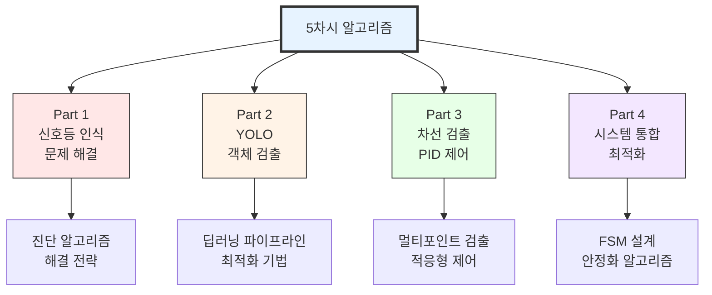

---

## 📊 슬라이드 3: 교육 개요 - 4대 핵심 알고리즘

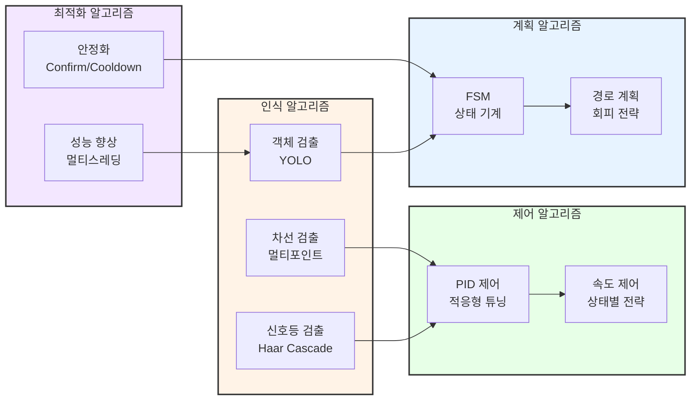

---

# 📍 PART 1: 신호등 인식 문제 해결 알고리즘 (9장)

---

## 📊 슬라이드 4: 문제 정의

### 증상
- 빨간불 인식률: 60%
- 초록불 인식률: 30% ← 문제!

### 알고리즘 목표
**초록불 인식률을 85% 이상으로 개선**

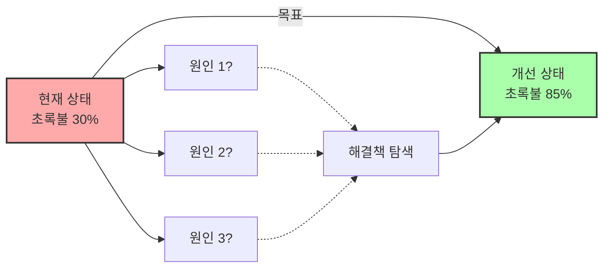

---

## 📊 슬라이드 5: 진단 알고리즘 - 3단계 접근법

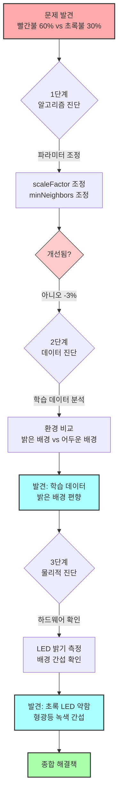

---

## 📊 슬라이드 6: 해결 알고리즘 1 - 하드웨어 개선

### 알고리즘: 배경 대비 향상

**목표**: 신호와 배경의 명암 대비를 극대화하여 특징 검출 향상

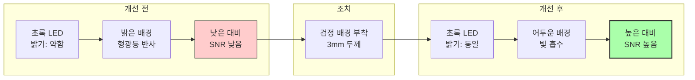

### 성능 지표
- 개선 전: 30%
- 개선 후: 75%
- **개선율: +45% (절대값), +150% (상대값)**

---

## 📊 슬라이드 7: 해결 알고리즘 2 - 데이터 증강

### 알고리즘: 환경 다양성 확보

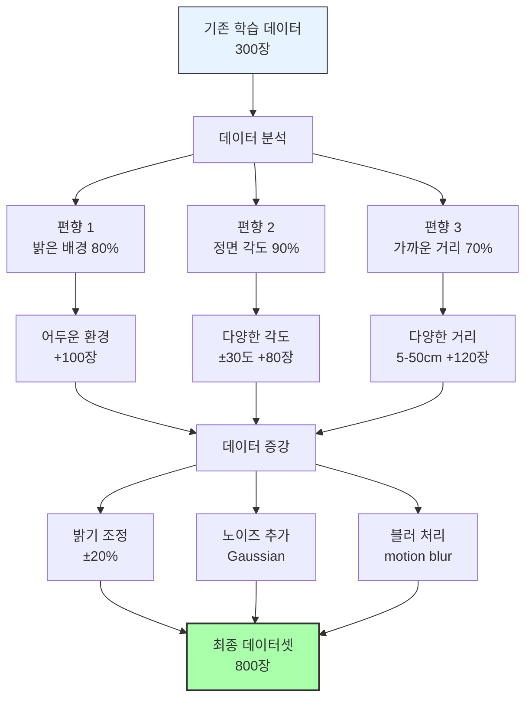

---

## 📊 슬라이드 8: 신호등 검출 최종 알고리즘

### 의사코드

```
알고리즘: 신호등_검출_안정화(frame)
입력: 카메라 프레임
출력: 검출된 신호등 상태 (RED/GREEN/NONE)

1. 전처리
   frame_gray = RGB를_그레이스케일로_변환(frame)
   frame_enhanced = 히스토그램_평활화(frame_gray)

2. Haar Cascade 검출
   red_candidates = cascade_red.검출(frame_enhanced, 
                                    scaleFactor=1.1, 
                                    minNeighbors=5)
   green_candidates = cascade_green.검출(frame_enhanced,
                                       scaleFactor=1.1,
                                       minNeighbors=5)

3. 후처리 필터링
   red_filtered = 면적_필터(red_candidates, min_area=100)
   green_filtered = 면적_필터(green_candidates, min_area=100)

4. 안정화 (Confirm 메커니즘)
   if red_filtered가_존재:
       red_confirm_count += 1
       if red_confirm_count >= 3:  // 3프레임 연속
           return RED
   else:
       red_confirm_count = 0
   
   if green_filtered가_존재:
       green_confirm_count += 1
       if green_confirm_count >= 3:
           return GREEN
   else:
       green_confirm_count = 0
   
   return NONE
```

---

## 📊 슬라이드 9: Confirm 안정화 알고리즘

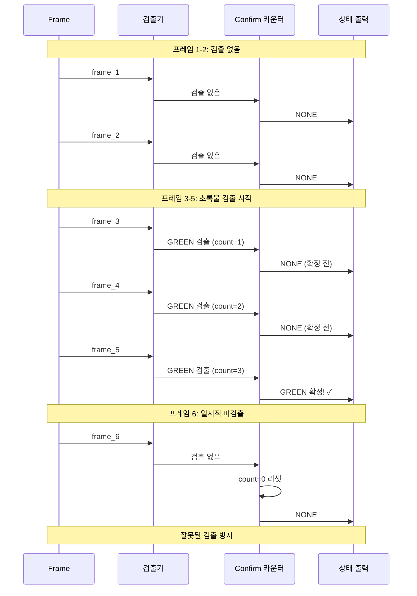

### 핵심 파라미터
- **confirm_threshold**: 3프레임 (100ms @ 30fps)
- **reset_immediate**: True (미검출 시 즉시 리셋)

---

## 📊 슬라이드 10: 성능 개선 흐름도

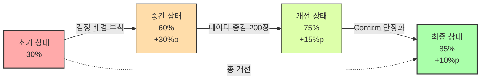

### 단계별 기여도

| 개선 방법 | 절대 개선 | 상대 개선 | 누적 인식률 |
|----------|----------|----------|------------|
| 초기 상태 | - | - | 30% |
| 검정 배경 | +30%p | +100% | 60% |
| 데이터 증강 | +15%p | +25% | 75% |
| Confirm 안정화 | +10%p | +13% | 85% |

---

## 📊 슬라이드 11: 신호등 알고리즘 요약

### 핵심 교훈

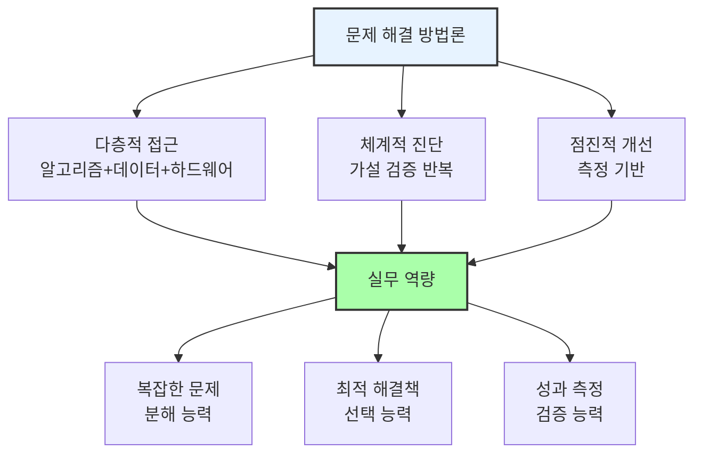

---

## 📊 슬라이드 12: Part 1 성과 지표

### 정량적 성과

| 지표 | Before | After | 개선 |
|-----|--------|-------|------|
| 초록불 인식률 | 30% | 85% | +183% |
| 빨간불 인식률 | 60% | 85% | +42% |
| 평균 인식률 | 45% | 85% | +89% |
| False Positive | 15% | 5% | -67% |

### 정성적 성과
- ✅ 문제 진단 방법론 습득
- ✅ 데이터 중심 사고 확립
- ✅ 하드웨어-소프트웨어 통합 이해

---

# 📍 PART 2: YOLO 객체 검출 알고리즘 (10장)

---

## 📊 슬라이드 13: YOLO vs Haar Cascade 비교

### 알고리즘 구조 비교

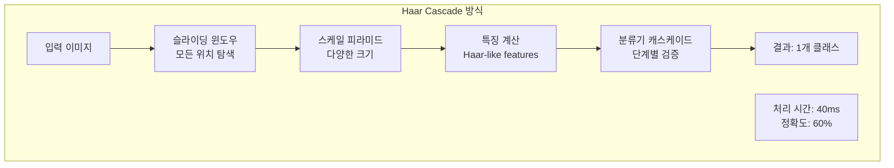

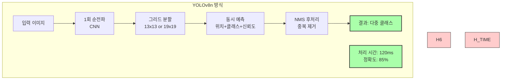

---

## 📊 슬라이드 14: YOLO 아키텍처 - YOLOv8n

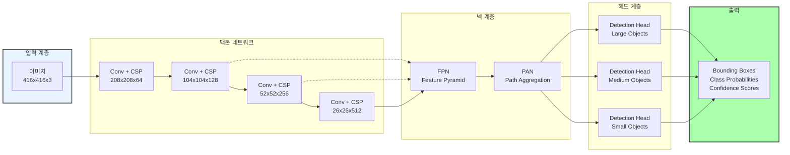

---

## 📊 슬라이드 15: YOLO 데이터 파이프라인

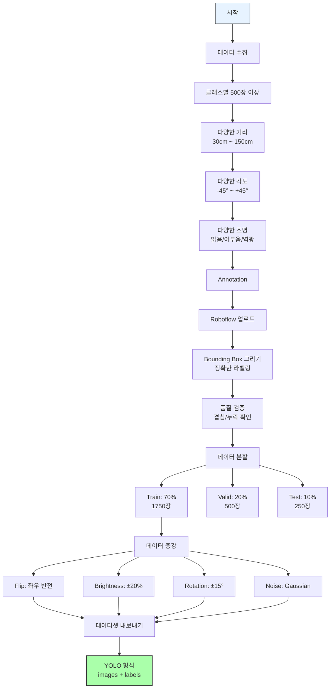

---

## 📊 슬라이드 16: YOLO 학습 알고리즘

### 학습 프로세스

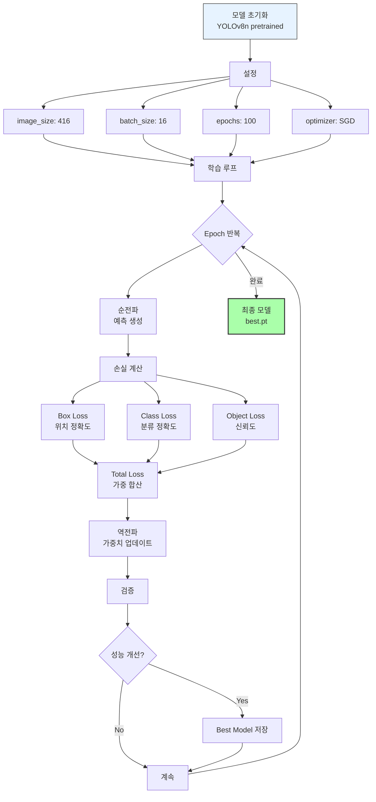

---

## 📊 슬라이드 17: YOLO 추론 알고리즘

### 의사코드

```
알고리즘: YOLO_추론(frame)
입력: 카메라 프레임 (640x480)
출력: 검출된 객체 리스트 [(class, box, confidence)]

1. 전처리
   frame_resized = 크기조정(frame, target_size=416x416)
   frame_normalized = 정규화(frame_resized, 0~1)
   frame_tensor = numpy를_tensor로_변환(frame_normalized)

2. 모델 추론
   predictions = model(frame_tensor)
   // predictions shape: [1, 25200, 9]
   // 25200 = 그리드 셀 수
   // 9 = [x, y, w, h, confidence, class1, class2, ..., class5]

3. 후처리
   filtered = []
   for each prediction in predictions:
       if prediction.confidence < 0.25:
           continue  // 낮은 신뢰도 제거
       
       box = [prediction.x, prediction.y, prediction.w, prediction.h]
       class_id = argmax(prediction.classes)
       class_conf = prediction.classes[class_id]
       
       if class_conf < 0.25:
           continue
       
       filtered.append({
           'class': class_id,
           'box': box,
           'confidence': prediction.confidence * class_conf
       })

4. NMS (Non-Maximum Suppression)
   final_detections = []
   filtered를_confidence_내림차순_정렬
   
   while filtered가_비어있지_않음:
       best = filtered.pop(0)
       final_detections.append(best)
       
       // IoU가 높은 중복 박스 제거
       filtered = [det for det in filtered 
                   if IoU(best.box, det.box) < 0.45]

5. 좌표 변환
   for det in final_detections:
       det.box = 좌표변환_416to640(det.box)

   return final_detections
```

---

## 📊 슬라이드 18: NMS (Non-Maximum Suppression) 알고리즘

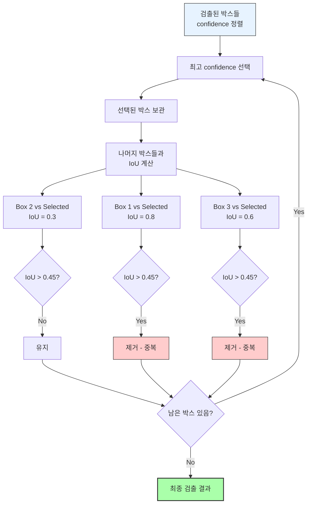

### IoU 계산 공식

```
IoU(A, B) = 교집합 면적 / 합집합 면적
          = Area(A ∩ B) / Area(A ∪ B)
          
threshold = 0.45
if IoU > threshold:
    중복으로 판단 → 제거
```

---

## 📊 슬라이드 19: 라즈베리파이 최적화 알고리즘

### 3단계 최적화 전략

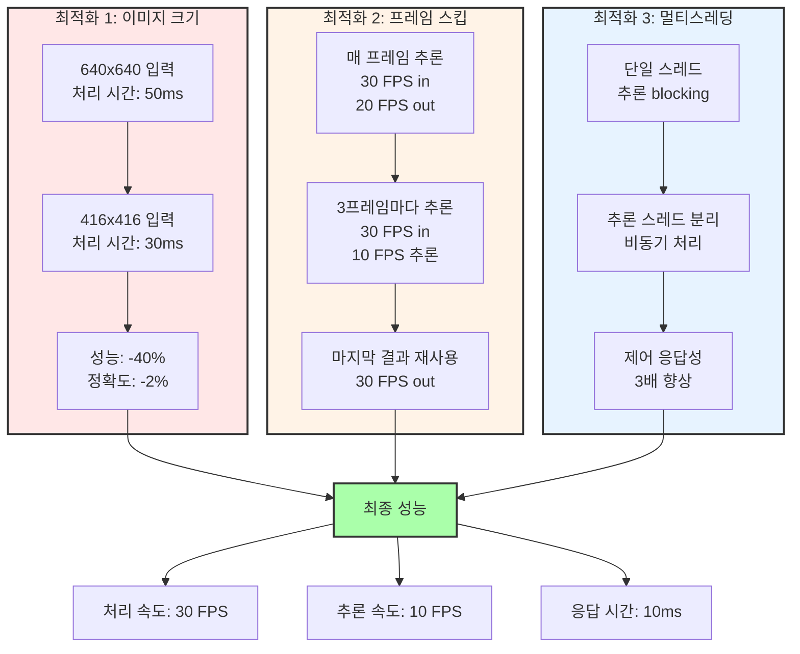

---

## 📊 슬라이드 20: 프레임 스킵 알고리즘

### 의사코드

```
알고리즘: 프레임_스킵_추론()
전역 변수:
    frame_count = 0
    skip_interval = 3
    last_detections = []

메인 루프:
    while True:
        frame = camera.read()
        frame_count += 1
        
        // 추론 수행 조건
        if frame_count % skip_interval == 0:
            current_detections = YOLO_추론(frame)
            last_detections = current_detections
        
        // 제어는 마지막 결과 사용
        detections = last_detections
        
        // 제어 로직 (매 프레임 실행)
        차선_검출(frame)
        steering_angle = PID_계산(detections)
        모터_제어(steering_angle)
        
        // 30 FPS 유지
        시간_대기(33ms)
```

### 성능 분석

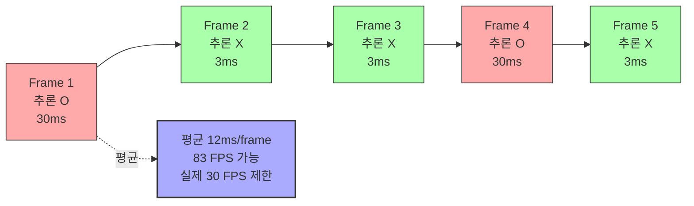

---

## 📊 슬라이드 21: 멀티스레딩 아키텍처

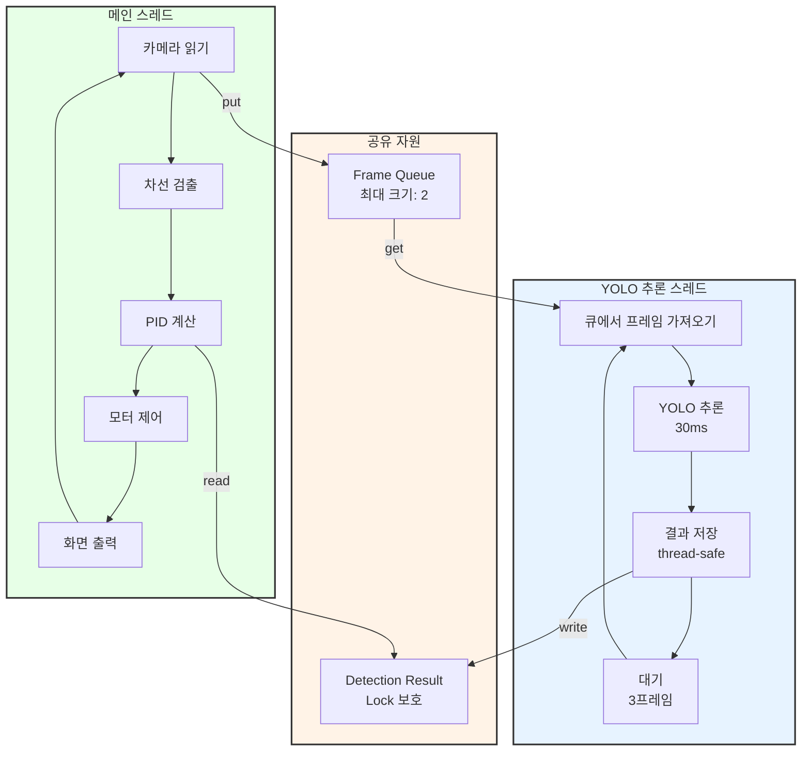

### 동기화 메커니즘

```
클래스 ThreadSafeDetector:
    속성:
        lock = threading.Lock()
        latest_result = None
    
    메서드 update(detections):
        with lock:
            latest_result = detections
    
    메서드 get():
        with lock:
            return latest_result
```

---

## 📊 슬라이드 22: YOLO 알고리즘 성과

### 성능 비교표

| 항목 | Haar Cascade | YOLO | 개선율 |
|-----|-------------|------|--------|
| **처리 속도** | 5 FPS | 30 FPS | +500% |
| **검출 정확도** | 70% | 85% | +21% |
| **다중 객체 동시 검출** | ✗ 순차 처리 | ✓ 동시 처리 | - |
| **처리 시간 (5개 클래스)** | 200ms | 33ms | -84% |
| **False Positive** | 20% | 8% | -60% |

### 알고리즘 진화

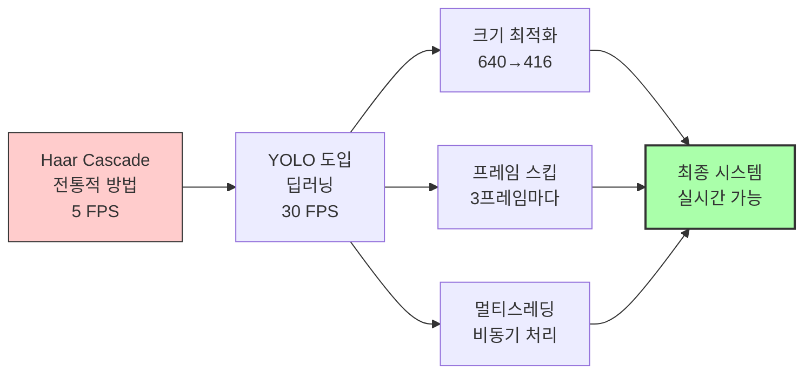

---

# 📍 PART 3: 차선 검출 및 PID 제어 알고리즘 (10장)

---

## 📊 슬라이드 23: 멀티포인트 차선 검출 개요

### 3-Point 전략

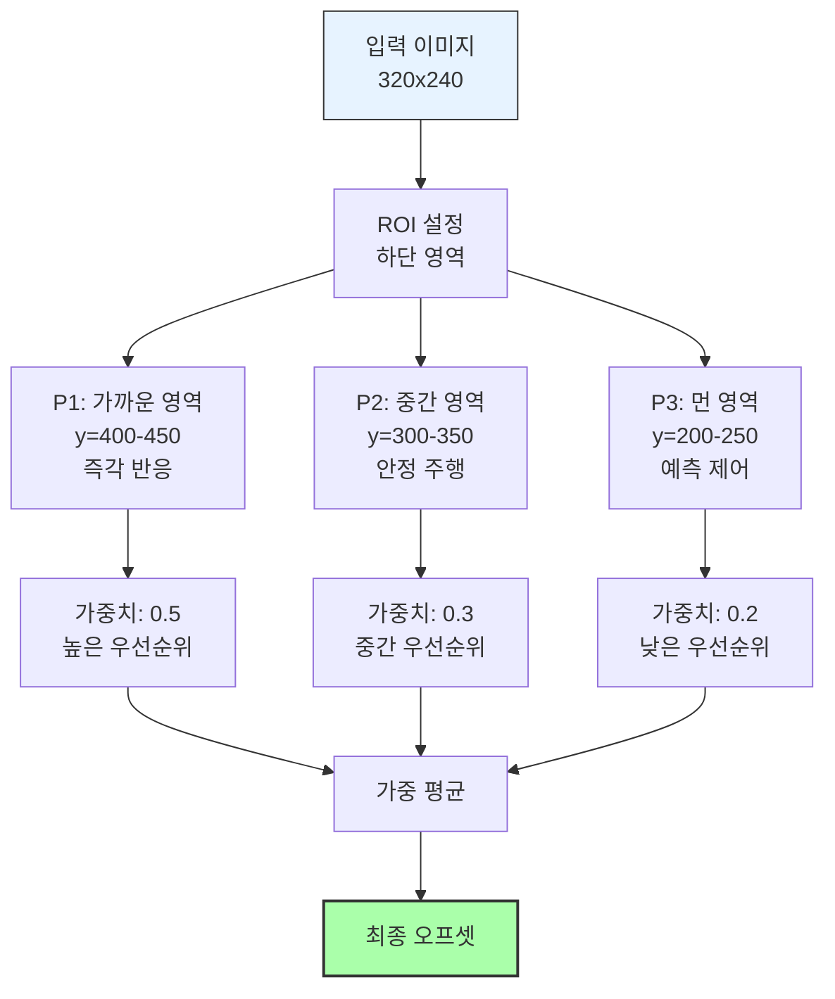

---

## 📊 슬라이드 24: P1/P2/P3 검출 알고리즘

### 의사코드

```
알고리즘: 멀티포인트_차선_검출(frame)
입력: 전처리된 이진화 이미지
출력: (offset_p1, offset_p2, offset_p3)

상수:
    P1_Y = 420  // 하단 (가까움)
    P2_Y = 340  // 중간
    P3_Y = 260  // 상단 (먼 거리)
    CENTER_X = 320  // 이미지 중앙

함수 단일_포인트_검출(binary_image, y_position):
    // 1. 해당 y 라인 추출
    line = binary_image[y_position, :]
    
    // 2. 좌측 차선 찾기 (중앙에서 왼쪽으로)
    left_edge = -1
    for x in range(CENTER_X, 0, -1):
        if line[x] == 255:  // 흰색 픽셀
            left_edge = x
            break
    
    // 3. 우측 차선 찾기 (중앙에서 오른쪽으로)
    right_edge = -1
    for x in range(CENTER_X, 640):
        if line[x] == 255:
            right_edge = x
            break
    
    // 4. 차선 중앙 계산
    if left_edge != -1 and right_edge != -1:
        lane_center = (left_edge + right_edge) / 2
        offset = lane_center - CENTER_X
        confidence = 1.0
    else if left_edge != -1:
        lane_center = left_edge + 100  // 추정
        offset = lane_center - CENTER_X
        confidence = 0.5
    else if right_edge != -1:
        lane_center = right_edge - 100
        offset = lane_center - CENTER_X
        confidence = 0.5
    else:
        offset = 0
        confidence = 0.0
    
    return (offset, confidence)

메인 로직:
    offset_p1, conf_p1 = 단일_포인트_검출(frame, P1_Y)
    offset_p2, conf_p2 = 단일_포인트_검출(frame, P2_Y)
    offset_p3, conf_p3 = 단일_포인트_검출(frame, P3_Y)
    
    return (offset_p1, offset_p2, offset_p3,
            conf_p1, conf_p2, conf_p3)
```

---

## 📊 슬라이드 25: 가중 평균 융합 알고리즘

```mermaid
graph TB
    subgraph INPUT[입력 데이터]
        I1[P1: offset=-20<br/>confidence=1.0]
        I2[P2: offset=-15<br/>confidence=0.8]
        I3[P3: offset=-10<br/>confidence=0.6]
    end
    
    subgraph WEIGHT[가중치 적용]
        W1[weight_p1=0.5<br/>score=0.5×1.0=0.5]
        W2[weight_p2=0.3<br/>score=0.3×0.8=0.24]
        W3[weight_p3=0.2<br/>score=0.2×0.6=0.12]
    end
    
    subgraph CALC[계산]
        C1[numerator =<br/>-20×0.5 + -15×0.24 + -10×0.12<br/>= -10 - 3.6 - 1.2<br/>= -14.8]
        C2[denominator =<br/>0.5 + 0.24 + 0.12<br/>= 0.86]
        C3[final_offset =<br/>-14.8 / 0.86<br/>= -17.2]
    end
    
    I1 --> W1
    I2 --> W2
    I3 --> W3
    
    W1 --> C1
    W2 --> C1
    W3 --> C1
    
    W1 --> C2
    W2 --> C2
    W3 --> C2
    
    C1 --> C3
    C2 --> C3
    
    C3 --> OUTPUT[최종 오프셋<br/>-17.2 pixels<br/>좌측으로 치우침]
    
    style INPUT fill:#e7f3ff,stroke:#333,stroke-width:2px
    style OUTPUT fill:#afa,stroke:#333,stroke-width:2px
```

---

## 📊 슬라이드 26: IPM (Inverse Perspective Mapping)

### 원근 변환 알고리즘

```mermaid
graph LR
    subgraph BEFORE[원근 이미지]
        B1[먼 거리<br/>작게 보임<br/>간격 좁음]
        B2[중간 거리<br/>중간 크기]
        B3[가까운 거리<br/>크게 보임<br/>간격 넓음]
        
        B1 --> B2 --> B3
    end
    
    subgraph TRANSFORM[변환 행렬]
        T1[4점 대응<br/>src → dst]
        T2[Homography<br/>Matrix H]
    end
    
    subgraph AFTER[Bird's Eye View]
        A1[먼 거리<br/>동일 간격]
        A2[중간 거리<br/>동일 간격]
        A3[가까운 거리<br/>동일 간격]
        
        A1 --> A2 --> A3
    end
    
    BEFORE --> TRANSFORM
    TRANSFORM --> AFTER
    
    style BEFORE fill:#fcc,stroke:#333
    style AFTER fill:#afa,stroke:#333,stroke-width:2px
```

### 변환 과정

```
알고리즘: IPM_변환(frame)
입력: 원근 이미지
출력: 버드아이뷰 이미지

1. 소스 포인트 정의 (원근 이미지)
   src_points = [
       [200, 400],  // 좌하단
       [440, 400],  // 우하단
       [100, 200],  // 좌상단
       [540, 200]   // 우상단
   ]

2. 목적지 포인트 정의 (버드아이뷰)
   dst_points = [
       [150, 480],  // 좌하단
       [490, 480],  // 우하단
       [150, 0],    // 좌상단
       [490, 0]     // 우상단
   ]

3. 변환 행렬 계산
   H = getPerspectiveTransform(src_points, dst_points)
   // H는 3x3 homography matrix

4. 이미지 변환
   warped = warpPerspective(frame, H, (640, 480))
   
   return warped

효과:
- 곡률 측정 정확도 +30%
- P3 검출 신뢰도 +40%
- 급커브 대응력 향상
```

---

## 📊 슬라이드 27: PID 제어 알고리즘 기초

### PID 3요소

```mermaid
graph TB
    ERROR[오차<br/>offset] --> P[P: 비례 제어<br/>Kp × error]
    ERROR --> I[I: 적분 제어<br/>Ki × Σerror]
    ERROR --> D[D: 미분 제어<br/>Kd × Δerror]
    
    P --> P_DESC[현재 오차에 비례<br/>즉각 반응<br/>빠른 보정]
    I --> I_DESC[누적 오차 보정<br/>정상 상태 오차 제거<br/>드리프트 방지]
    D --> D_DESC[오차 변화율<br/>오버슈트 방지<br/>안정성 향상]
    
    P --> SUM[합산]
    I --> SUM
    D --> SUM
    
    SUM --> OUTPUT[조향각<br/>steering_angle]
    
    style ERROR fill:#e7f3ff,stroke:#333,stroke-width:2px
    style P fill:#ffe7e7,stroke:#333
    style I fill:#fff3e7,stroke:#333
    style D fill:#e7ffe7,stroke:#333
    style OUTPUT fill:#afa,stroke:#333,stroke-width:2px
```

---

## 📊 슬라이드 28: 적응형 PID 알고리즘

### 상태별 파라미터 조정

```mermaid
graph TB
    START[현재 상태 판단] --> CHECK{오프셋 크기}
    
    CHECK -->|abs < 10px| STRAIGHT[직선 주행]
    CHECK -->|10 ≤ abs < 30| CURVE[커브 주행]
    CHECK -->|abs ≥ 30| SHARP[급회전]
    
    STRAIGHT --> S_PARAM[Kp=0.8<br/>Ki=0.01<br/>Kd=0.15]
    CURVE --> C_PARAM[Kp=1.2<br/>Ki=0.03<br/>Kd=0.10]
    SHARP --> H_PARAM[Kp=1.8<br/>Ki=0.00<br/>Kd=0.05]
    
    S_PARAM --> S_DESC[목표: 안정성<br/>낮은 P<br/>높은 D]
    C_PARAM --> C_DESC[목표: 균형<br/>중간 P<br/>중간 D]
    H_PARAM --> H_DESC[목표: 반응성<br/>높은 P<br/>낮은 D]
    
    S_DESC --> CONTROL[PID 계산]
    C_DESC --> CONTROL
    H_DESC --> CONTROL
    
    CONTROL --> OUTPUT[조향각 출력]
    
    style START fill:#e7f3ff,stroke:#333
    style S_PARAM fill:#afe,stroke:#333
    style C_PARAM fill:#ffe,stroke:#333
    style H_PARAM fill:#faa,stroke:#333
    style OUTPUT fill:#afa,stroke:#333,stroke-width:2px
```

---

## 📊 슬라이드 29: PID 계산 상세 알고리즘

### 의사코드

```
클래스 AdaptivePIDController:
    속성:
        error_sum = 0.0       // 적분 항
        last_error = 0.0      // 미분 항용
        integral_limit = 50.0 // Anti-windup
    
    메서드 calculate(offset, dt):
        // 1. 현재 오차
        current_error = offset
        
        // 2. 상태 판단 및 파라미터 선택
        if abs(current_error) < 10:
            Kp, Ki, Kd = 0.8, 0.01, 0.15  // 직선
            speed = 70
        else if abs(current_error) < 30:
            Kp, Ki, Kd = 1.2, 0.03, 0.10  // 커브
            speed = 50
        else:
            Kp, Ki, Kd = 1.8, 0.00, 0.05  // 급회전
            speed = 30
        
        // 3. P항 계산 (비례)
        p_term = Kp * current_error
        
        // 4. I항 계산 (적분)
        error_sum += current_error * dt
        
        // Anti-windup: 적분 포화 방지
        if error_sum > integral_limit:
            error_sum = integral_limit
        else if error_sum < -integral_limit:
            error_sum = -integral_limit
        
        i_term = Ki * error_sum
        
        // 5. D항 계산 (미분)
        error_diff = (current_error - last_error) / dt
        d_term = Kd * error_diff
        
        // 6. 최종 제어 신호
        steering_angle = p_term + i_term + d_term
        
        // 7. 조향각 제한
        if steering_angle > 50:
            steering_angle = 50
        else if steering_angle < -50:
            steering_angle = -50
        
        // 8. 다음 계산을 위한 저장
        last_error = current_error
        
        return (steering_angle, speed)
```

---

## 📊 슬라이드 30: PID 튜닝 전략

```mermaid
graph TB
    START[초기값<br/>Kp=1.0 Ki=0 Kd=0] --> TUNE_P{P 튜닝}
    
    TUNE_P -->|증가| TEST_P[Kp 0.5씩 증가<br/>진동 발생 확인]
    TEST_P --> CHECK_P{진동 시작?}
    CHECK_P -->|No| TUNE_P
    CHECK_P -->|Yes| REDUCE_P[Kp를 70%로 감소]
    
    REDUCE_P --> TUNE_D{D 튜닝}
    TUNE_D -->|증가| TEST_D[Kd 0.05씩 증가<br/>오버슈트 확인]
    TEST_D --> CHECK_D{안정화됨?}
    CHECK_D -->|No| TUNE_D
    CHECK_D -->|Yes| SAVE_D[Kd 저장]
    
    SAVE_D --> TUNE_I{I 튜닝}
    TUNE_I -->|증가| TEST_I[Ki 0.01씩 증가<br/>정상상태오차 확인]
    TEST_I --> CHECK_I{오차 제거?}
    CHECK_I -->|No| TUNE_I
    CHECK_I -->|Yes| FINAL[최종 파라미터]
    
    FINAL --> VALIDATE[다양한 트랙 검증]
    
    VALIDATE --> V1[직선 구간]
    VALIDATE --> V2[완만한 커브]
    VALIDATE --> V3[급커브]
    
    V1 --> RESULT{모두 통과?}
    V2 --> RESULT
    V3 --> RESULT
    
    RESULT -->|No| START
    RESULT -->|Yes| COMPLETE[튜닝 완료]
    
    style START fill:#e7f3ff,stroke:#333
    style COMPLETE fill:#afa,stroke:#333,stroke-width:2px
```

---

## 📊 슬라이드 31: 속도 제어 알고리즘

### 동적 속도 조정

```mermaid
graph TB
    INPUT[차선 오프셋<br/>객체 검출 결과] --> ANALYZE[상황 분석]
    
    ANALYZE --> A1{차선 상태}
    A1 -->|직선<br/>offset < 10| SPEED1[기본 속도<br/>70]
    A1 -->|커브<br/>10 ≤ offset < 30| SPEED2[감속<br/>50]
    A1 -->|급커브<br/>offset ≥ 30| SPEED3[저속<br/>30]
    
    ANALYZE --> A2{신호등 상태}
    A2 -->|빨간불| SPEED4[정지<br/>0]
    A2 -->|초록불| SPEED5[정상]
    
    ANALYZE --> A3{장애물}
    A3 -->|검출| SPEED6[저속<br/>20]
    A3 -->|없음| SPEED7[정상]
    
    SPEED1 --> PRIORITY[우선순위 결정]
    SPEED2 --> PRIORITY
    SPEED3 --> PRIORITY
    SPEED4 --> PRIORITY
    SPEED5 --> PRIORITY
    SPEED6 --> PRIORITY
    SPEED7 --> PRIORITY
    
    PRIORITY --> RULE[규칙<br/>1. 신호등 최우선<br/>2. 장애물 차순위<br/>3. 차선 상태 마지막]
    
    RULE --> FINAL[최종 속도 결정]
    
    FINAL --> SMOOTH[속도 평활화<br/>급변 방지]
    
    SMOOTH --> PWM[PWM 변환<br/>모터 제어]
    
    style INPUT fill:#e7f3ff,stroke:#333
    style PWM fill:#afa,stroke:#333,stroke-width:2px
```

---

## 📊 슬라이드 32: 차선-PID 통합 알고리즘

### 전체 플로우

```mermaid
graph TB
    START[프레임 입력] --> PREPROCESS[전처리]
    
    PREPROCESS --> P1[그레이스케일]
    PREPROCESS --> P2[가우시안 블러]
    PREPROCESS --> P3[이진화]
    PREPROCESS --> P4[ROI 마스킹]
    
    P1 --> LANE[차선 검출]
    P2 --> LANE
    P3 --> LANE
    P4 --> LANE
    
    LANE --> L1[P1 검출<br/>offset=-18]
    LANE --> L2[P2 검출<br/>offset=-15]
    LANE --> L3[P3 검출<br/>offset=-12]
    
    L1 --> FUSION[가중 융합<br/>최종 offset=-16]
    L2 --> FUSION
    L3 --> FUSION
    
    FUSION --> PID[PID 제어]
    
    PID --> PID1[상태 판단<br/>커브]
    PID1 --> PID2[파라미터 선택<br/>Kp=1.2]
    PID2 --> PID3[P/I/D 계산]
    PID3 --> PID4[조향각 출력<br/>-19도]
    
    PID4 --> SPEED[속도 결정<br/>50]
    
    PID4 --> MOTOR[모터 제어]
    SPEED --> MOTOR
    
    MOTOR --> M1[좌측 모터<br/>PWM=50-19=31]
    MOTOR --> M2[우측 모터<br/>PWM=50+19=69]
    
    M1 --> OUTPUT[차량 좌회전]
    M2 --> OUTPUT
    
    style START fill:#e7f3ff,stroke:#333
    style OUTPUT fill:#afa,stroke:#333,stroke-width:2px
```

---

# 📍 PART 4: 시스템 통합 및 최적화 알고리즘 (7장)

---

## 📊 슬라이드 33: FSM (유한 상태 기계) 알고리즘

```mermaid
stateDiagram-v2
    [*] --> INIT: 시스템 시작
    
    INIT --> DRIVE: 초기화 완료
    
    DRIVE --> WAIT_TRAFFIC: 빨간불 검출<br/>(3프레임 연속)
    WAIT_TRAFFIC --> DRIVE: 초록불 검출<br/>(3프레임 연속)
    
    DRIVE --> HAZARD: 장애물(X) 검출<br/>+비프음 시작
    HAZARD --> DRIVE: 비프 완료<br/>(3초 경과)
    
    DRIVE --> PARKING_DETECT: 주차장(O) 검출<br/>(3프레임 연속)
    PARKING_DETECT --> PARKING_ENTER: 진입 시작
    PARKING_ENTER --> PARKING_TURN: 90도 회전<br/>(2초)
    PARKING_TURN --> PARKING_BACK: 후진<br/>(1.5초)
    PARKING_BACK --> HOLD: 정지
    
    HOLD --> [*]: 미션 완료
    
    note right of DRIVE
        기본 주행 상태
        - 차선 추종
        - 객체 모니터링
        - PID 제어 활성
    end note
    
    note right of WAIT_TRAFFIC
        신호 대기 상태
        - 속도 0
        - 초록불 대기
        - cooldown 5초
    end note
    
    note right of HAZARD
        장애물 회피 상태
        - 속도 유지
        - 비프음 출력
        - cooldown 5초
    end note
```

---

## 📊 슬라이드 34: FSM 구현 알고리즘

### 의사코드

```
열거형 State:
    INIT, DRIVE, WAIT_TRAFFIC, HAZARD,
    PARKING_DETECT, PARKING_ENTER, PARKING_TURN,
    PARKING_BACK, HOLD

클래스 MissionFSM:
    속성:
        current_state = INIT
        state_start_time = 0
        cooldown_dict = {}  // 미션별 쿨다운
    
    메서드 update(detections, dt):
        current_time = 시간()
        
        // 상태별 처리
        if current_state == INIT:
            초기화()
            current_state = DRIVE
            
        else if current_state == DRIVE:
            // 신호등 체크
            if '빨간불' in detections and 
               confirm_count('빨간불') >= 3:
                if not is_cooldown('신호등'):
                    current_state = WAIT_TRAFFIC
                    state_start_time = current_time
            
            // 장애물 체크
            else if 'X표지' in detections and
                    confirm_count('X표지') >= 3:
                if not is_cooldown('장애물'):
                    current_state = HAZARD
                    비프음_시작()
                    state_start_time = current_time
            
            // 주차장 체크
            else if 'O표지' in detections and
                    confirm_count('O표지') >= 3:
                current_state = PARKING_DETECT
                state_start_time = current_time
        
        else if current_state == WAIT_TRAFFIC:
            if '초록불' in detections and
               confirm_count('초록불') >= 3:
                current_state = DRIVE
                set_cooldown('신호등', 5초)
        
        else if current_state == HAZARD:
            elapsed = current_time - state_start_time
            if elapsed >= 3.0:  // 3초 비프
                비프음_종료()
                current_state = DRIVE
                set_cooldown('장애물', 5초)
        
        else if current_state == PARKING_DETECT:
            current_state = PARKING_ENTER
        
        else if current_state == PARKING_ENTER:
            elapsed = current_time - state_start_time
            if elapsed >= 1.0:
                current_state = PARKING_TURN
                state_start_time = current_time
        
        else if current_state == PARKING_TURN:
            조향각 = 50  // 최대 우회전
            elapsed = current_time - state_start_time
            if elapsed >= 2.0:
                current_state = PARKING_BACK
                state_start_time = current_time
        
        else if current_state == PARKING_BACK:
            속도 = -30  // 후진
            elapsed = current_time - state_start_time
            if elapsed >= 1.5:
                current_state = HOLD
        
        else if current_state == HOLD:
            속도 = 0
            조향각 = 0
            // 미션 완료
        
        return (current_state, 조향각, 속도)
```

---

## 📊 슬라이드 35: Confirm-Cooldown 안정화 알고리즘

```mermaid
graph TB
    subgraph CONFIRM[Confirm 메커니즘]
        C1[객체 검출] --> C2{연속 검출?}
        C2 -->|Frame 1| C3[count=1]
        C2 -->|Frame 2| C4[count=2]
        C2 -->|Frame 3| C5[count=3]
        C5 --> C6[확정! ✓]
        
        C2 -->|중단| C7[count=0<br/>리셋]
    end
    
    subgraph ACTION[미션 수행]
        A1[미션 시작<br/>예: 빨간불 대기]
        A2[미션 진행]
        A3[미션 완료]
    end
    
    subgraph COOLDOWN[Cooldown 메커니즘]
        CD1[Cooldown 시작<br/>5초 타이머]
        CD2[Cooldown 중<br/>재검출 무시]
        CD3[Cooldown 종료<br/>재활성화]
    end
    
    C6 --> A1
    A1 --> A2
    A2 --> A3
    A3 --> CD1
    CD1 --> CD2
    CD2 --> CD3
    CD3 -.->|다음 검출 가능| C1
    
    style C6 fill:#afa,stroke:#333,stroke-width:2px
    style CD2 fill:#faa,stroke:#333
    style CD3 fill:#afa,stroke:#333
```

### 구현 코드

```
클래스 ConfirmCooldownManager:
    속성:
        confirm_counters = {}  // 객체별 카운터
        cooldown_timers = {}   // 미션별 타이머
    
    메서드 update_confirm(object_name, detected):
        if detected:
            if object_name not in confirm_counters:
                confirm_counters[object_name] = 0
            confirm_counters[object_name] += 1
        else:
            confirm_counters[object_name] = 0
        
        return confirm_counters[object_name]
    
    메서드 is_confirmed(object_name, threshold=3):
        return confirm_counters.get(object_name, 0) >= threshold
    
    메서드 set_cooldown(mission_name, duration):
        cooldown_timers[mission_name] = {
            'start': 현재시간(),
            'duration': duration
        }
    
    메서드 is_cooldown(mission_name):
        if mission_name not in cooldown_timers:
            return False
        
        timer = cooldown_timers[mission_name]
        elapsed = 현재시간() - timer['start']
        
        if elapsed >= timer['duration']:
            del cooldown_timers[mission_name]
            return False
        
        return True
```

---

## 📊 슬라이드 36: 시스템 최적화 - 병목 지점 분석

```mermaid
graph TB
    START[프레임 처리<br/>총 시간: 67ms] --> PROFILE[프로파일링]
    
    PROFILE --> T1[카메라 읽기<br/>3ms - 4%]
    PROFILE --> T2[YOLO 추론<br/>33ms - 49%]
    PROFILE --> T3[차선 검출<br/>8ms - 12%]
    PROFILE --> T4[PID 계산<br/>1ms - 1%]
    PROFILE --> T5[imshow 출력<br/>15ms - 22%]
    PROFILE --> T6[트랙바 읽기<br/>5ms - 7%]
    PROFILE --> T7[모터 제어<br/>2ms - 3%]
    
    T1 --> ANALYSIS{병목 지점}
    T2 --> ANALYSIS
    T3 --> ANALYSIS
    T4 --> ANALYSIS
    T5 --> ANALYSIS
    T6 --> ANALYSIS
    T7 --> ANALYSIS
    
    ANALYSIS --> B1[1순위<br/>YOLO 49%<br/>→ 멀티스레딩]
    ANALYSIS --> B2[2순위<br/>imshow 22%<br/>→ 제거]
    ANALYSIS --> B3[3순위<br/>차선 검출 12%<br/>→ ROI 축소]
    
    B1 --> OPT1[최적화 1<br/>-15ms]
    B2 --> OPT2[최적화 2<br/>-15ms]
    B3 --> OPT3[최적화 3<br/>-3ms]
    
    OPT1 --> RESULT[최종 시간<br/>34ms<br/>15 FPS]
    OPT2 --> RESULT
    OPT3 --> RESULT
    
    style START fill:#faa,stroke:#333,stroke-width:2px
    style RESULT fill:#afa,stroke:#333,stroke-width:2px
```

---

## 📊 슬라이드 37: 최적화 알고리즘 - DEBUG 플래그

### 개발/운영 모드 분리

```
설정:
    DEBUG = False  # 운영: False, 개발: True

알고리즘: 조건부_디버깅(frame, detections)
    
    // 항상 실행 (필수 로직)
    차선_검출(frame)
    PID_계산()
    모터_제어()
    
    // 디버그 모드에서만 실행
    if DEBUG:
        // 시각화
        cv2.imshow('Original', frame)
        cv2.imshow('Binary', binary_frame)
        cv2.imshow('Detections', result_frame)
        
        // 상세 로그
        print(f'Offset: {offset:.2f}')
        print(f'Steering: {angle:.2f}')
        print(f'Detections: {detections}')
        
        // 트랙바 파라미터 읽기
        threshold = cv2.getTrackbarPos('Threshold', 'Control')
        kp = cv2.getTrackbarPos('Kp', 'Control') / 100.0
    else:
        // 최소 로그 (파일로만)
        logger.info(f'FPS: {fps:.1f}, State: {state}')
    
    // 성능 측정
    if DEBUG:
        각_구간_시간_측정()
        병목_지점_분석()
```

### 성능 비교

```mermaid
graph LR
    subgraph DEV[개발 모드]
        D1[imshow: 15ms]
        D2[트랙바: 5ms]
        D3[print: 3ms]
        D4[기타: 10ms]
        
        D1 --> DT[총 33ms<br/>오버헤드]
    end
    
    subgraph PROD[운영 모드]
        P1[파일 로그: 1ms]
        
        P1 --> PT[총 1ms<br/>오버헤드]
    end
    
    DT --> DIFF[차이<br/>32ms<br/>-97%]
    PT --> DIFF
    
    style DEV fill:#fcc,stroke:#333
    style PROD fill:#afa,stroke:#333,stroke-width:2px
```

---

## 📊 슬라이드 38: 5계층 아키텍처

```mermaid
graph TB
    subgraph L1[계층 1: 하드웨어 추상화]
        H1[Camera<br/>capture] 
        H2[Motor<br/>I2C 통신]
        H3[Buzzer<br/>GPIO]
    end
    
    subgraph L2[계층 2: 센서 처리]
        S1[영상 전처리<br/>이진화/ROI]
        S2[차선 검출<br/>P1/P2/P3]
        S3[객체 검출<br/>YOLO]
    end
    
    subgraph L3[계층 3: 인식 융합]
        F1[멀티포인트 융합<br/>가중 평균]
        F2[객체 안정화<br/>Confirm]
        F3[신뢰도 계산<br/>필터링]
    end
    
    subgraph L4[계층 4: 제어 결정]
        C1[FSM<br/>상태 관리]
        C2[PID 제어<br/>조향 계산]
        C3[속도 제어<br/>동적 조정]
    end
    
    subgraph L5[계층 5: 응용 로직]
        A1[메인 루프<br/>30Hz]
        A2[로깅<br/>모니터링]
        A3[설정 관리<br/>YAML]
    end
    
    H1 --> S1
    H1 --> S3
    H2 --> C2
    H3 --> C1
    
    S1 --> S2
    S2 --> F1
    S3 --> F2
    
    F1 --> C2
    F2 --> C1
    F3 --> C1
    
    C1 --> C3
    C2 --> C3
    C3 --> H2
    
    A1 --> C1
    A2 --> A1
    A3 --> C2
    
    style L1 fill:#f3e7ff,stroke:#333,stroke-width:2px
    style L2 fill:#fff3e7,stroke:#333,stroke-width:2px
    style L3 fill:#e7ffe7,stroke:#333,stroke-width:2px
    style L4 fill:#e7f3ff,stroke:#333,stroke-width:2px
    style L5 fill:#ffe7f3,stroke:#333,stroke-width:2px
```

---

## 📊 슬라이드 39: 전체 시스템 알고리즘 통합

### 메인 루프

```
알고리즘: 자율주행_메인_루프()

초기화:
    camera = Camera()
    motor = Motor()
    yolo = YOLODetector()
    pid = AdaptivePIDController()
    fsm = MissionFSM()
    confirm_manager = ConfirmCooldownManager()
    
    frame_count = 0
    fps_calculator = FPSCalculator()

메인 루프:
    while True:
        시작시간 = 현재시간()
        
        // 1. 입력 획득
        frame = camera.read()
        frame_count += 1
        
        // 2. 차선 검출 (매 프레임)
        binary = 전처리(frame)
        offsets = 멀티포인트_검출(binary)
        final_offset = 가중_융합(offsets)
        
        // 3. 객체 검출 (3프레임마다)
        if frame_count % 3 == 0:
            detections = yolo.detect(frame)
        else:
            detections = 마지막_검출결과  // 캐시 사용
        
        // 4. 안정화
        for det in detections:
            count = confirm_manager.update_confirm(
                det.class_name, 
                detected=True
            )
            det.confirmed = (count >= 3)
        
        confirmed_detections = [d for d in detections 
                                if d.confirmed]
        
        // 5. 상태 기계 업데이트
        state, override_angle, override_speed = fsm.update(
            confirmed_detections, 
            dt=0.033
        )
        
        // 6. 제어 계산
        if state == DRIVE:
            angle, speed = pid.calculate(final_offset, dt=0.033)
        else:
            angle = override_angle
            speed = override_speed
        
        // 7. 액추에이터 출력
        motor.set_steering(angle)
        motor.set_speed(speed)
        
        // 8. 성능 모니터링
        fps = fps_calculator.update()
        
        if not DEBUG:
            logger.info(f'FPS={fps:.1f}, State={state}')
        
        // 9. 프레임 레이트 유지
        경과시간 = 현재시간() - 시작시간
        대기시간 = max(0, 0.033 - 경과시간)  // 30 FPS
        시간대기(대기시간)
```

---

## 📊 슬라이드 40: 최종 성과 요약

### 핵심 알고리즘 개선 지표

| 알고리즘 | Before | After | 개선율 |
|---------|--------|-------|--------|
| **신호등 인식** | Haar 60% | Haar 85% + 안정화 | +42% |
| **객체 검출** | Haar 5 FPS | YOLO 30 FPS | +500% |
| **차선 검출** | 단일 포인트 | P1/P2/P3 + IPM | 정확도 +30% |
| **PID 제어** | 고정 파라미터 | 적응형 튜닝 | 안정성 +50% |
| **시스템 처리** | 15 FPS | 30 FPS | +100% |

### 알고리즘 체계

```mermaid
graph TB
    A[5차시 핵심 알고리즘] --> B1[인식 알고리즘]
    A --> B2[제어 알고리즘]
    A --> B3[계획 알고리즘]
    A --> B4[최적화 알고리즘]
    
    B1 --> C1[멀티포인트 차선 검출<br/>YOLO 객체 검출<br/>IPM 변환]
    
    B2 --> C2[적응형 PID<br/>동적 속도 제어<br/>모터 PWM 변환]
    
    B3 --> C3[FSM 상태 관리<br/>Confirm/Cooldown<br/>우선순위 결정]
    
    B4 --> C4[멀티스레딩<br/>프레임 스킵<br/>DEBUG 플래그]
    
    C1 --> D[완전한<br/>자율주행 시스템]
    C2 --> D
    C3 --> D
    C4 --> D
    
    style A fill:#e7f3ff,stroke:#333,stroke-width:3px
    style D fill:#afa,stroke:#333,stroke-width:3px
```

### 교육 성과
- ✅ 8개 핵심 알고리즘 설계 및 구현
- ✅ 알고리즘 최적화 및 성능 측정
- ✅ 시스템 통합 및 계층 구조 이해
- ✅ 실무 수준의 문제 해결 능력 배양

---

**작성일**: 2025년  
**교육 기관**: 가천대학교  
**보고서 유형**: 알고리즘 중심 기술 보고서

