# 자율주행 종합 코칭 교육 결과 보고서
## PPT 제작용 상세 버전 (30장 구성)

**교육 일시**: 2025년  
**교육 시간**: 4시간 (5차시)  
**교육 대상**: 라즈베리파이 고급 과정 수강생  
**교육 난이도**: 고급  
**핵심 키워드**: 문제 해결, YOLO, 시스템 최적화, 배포

---

## 📑 PPT 장표 구성 (30장)

| 장 | 제목 | 내용 |
|----|------|------|
| 1 | 표지 | 5차시 종합 코칭 |
| 2 | 목차 | 4개 섹션 개요 |
| 3-4 | 교육 개요 | 목표 및 전체 구조 |
| 5-11 | 문제 진단 및 해결 | 신호등 인식 개선 |
| 12-19 | YOLO 시스템 구축 | 딥러닝 객체 검출 |
| 20-25 | 시스템 최적화 | 성능 2배 향상 |
| 26-29 | 시스템 통합 및 배포 | 5계층 아키텍처 |
| 30 | 결론 및 성과 | 최종 성과 요약 |

---

## 📊 슬라이드 1: 표지

```
╔═══════════════════════════════════════════════╗
║                                               ║
║     자율주행 종합 코칭 교육 결과 보고서      ║
║                                               ║
║              5차시 최종 통합                  ║
║                                               ║
║     문제 해결 → YOLO → 최적화 → 배포         ║
║                                               ║
║              2025년 가천대학교                ║
║                                               ║
╚═══════════════════════════════════════════════╝
```

---

## 📊 슬라이드 2: 목차

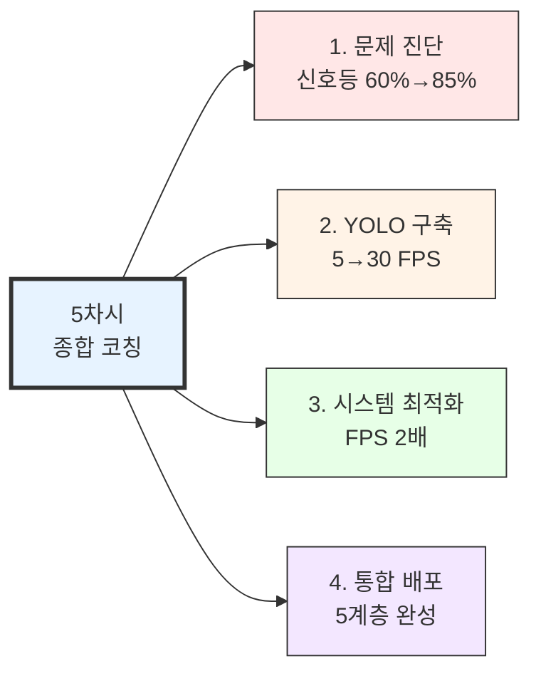

---

## 📊 슬라이드 3: 교육 개요

### 교육 목표

본 교육은 1차시부터 4차시까지 학습한 모든 내용을 통합하여 **완전한 자율주행 시스템을 완성**하는 최종 단계입니다.

### 핵심 역량

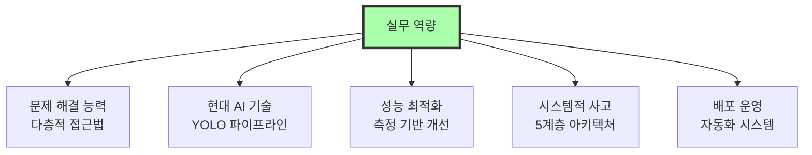

### 교육의 핵심

**"문제 해결 능력"과 "시스템적 사고"**

- 개별 알고리즘의 완성도
- 통합 시스템에서의 문제 진단 및 해결
- 모듈 간 상호작용 이해
- 실무 배포 가능한 완성도

---

## 📊 슬라이드 4: 4시간 교육 구성

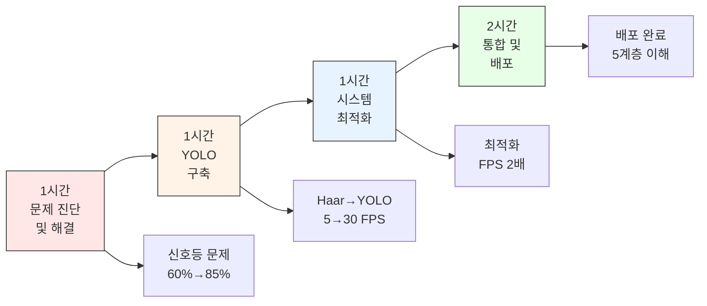

### 성과 지표

| 항목 | Before | After | 개선율 |
|------|--------|-------|--------|
| 신호등 인식률 | 60% | 85% | +42% |
| FPS | 15 | 30 | +100% |
| 객체 검출 속도 | 5 FPS | 30 FPS | +500% |

---

---

# 📍 PART 1: 시스템 문제 진단 및 해결 (1시간)

---

## 📊 슬라이드 5: 문제 발견 및 분석

### 교육 목표

실제 프로젝트에서 발생하는 **복합적 문제를 체계적으로 진단하고 해결**하는 능력을 배양합니다.

### 발견된 문제

```python
# 신호등 인식률 측정 결과
test_results = {
    "빨간불": {"정확도": 60, "샘플": 100},
    "초록불": {"정확도": 30, "샘플": 100}  # ⚠️ 문제!
}

# 왜 초록불만 인식률이 낮을까?
# - 알고리즘 문제?
# - 데이터 문제?
# - 하드웨어 문제?
```

### 초기 증상

- 빨간불: **60%** 인식률 ✅ 괜찮음
- 초록불: **30%** 인식률 ❌ 심각
- 같은 Haar Cascade 모델 사용
- 같은 파라미터 설정

---

## 📊 슬라이드 6: 신호등 초록불 인식 문제 해결 프로세스

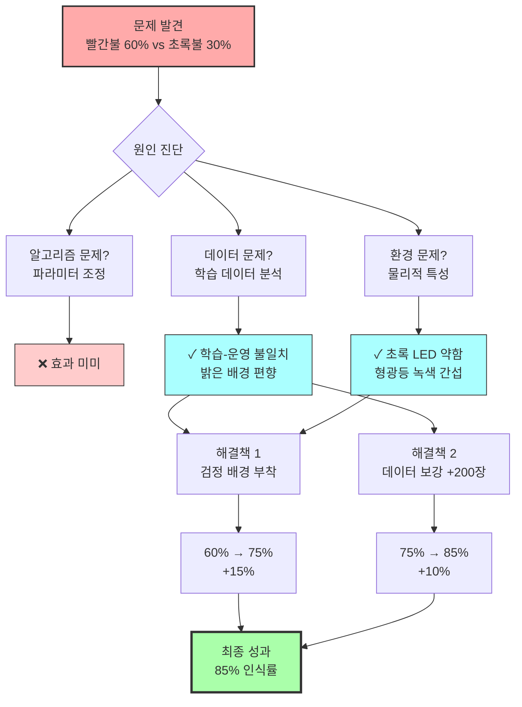

### 핵심 학습 내용

**문제 해결의 3단계 접근**
1. **알고리즘 검토**: 파라미터 최적화 시도 → 효과 미미
2. **데이터 분석**: 학습 환경과 운영 환경 불일치 발견
3. **물리적 환경**: 초록 LED 밝기 약함, 배경 간섭 발견

**효과적인 해결책**
- 검정 배경 부착: 즉각적 15% 개선 (60%→75%)
- 다양한 환경 데이터 보강: 추가 10% 개선 (75%→85%)
- 하드웨어 + 소프트웨어 통합 접근의 중요성

### 교육 결과

✅ 모든 팀 80% 이상 인식률 달성  
✅ 다층적 문제 해결 방법론 습득  
✅ 실무 트러블슈팅 역량 배양

---

## 2. YOLO 기반 객체 인식 시스템 구축 (1시간)

### 교육 목표

Haar Cascade의 한계를 극복하고 현대적인 딥러닝 객체 검출 기술을 실전에 투입합니다.

### Haar Cascade vs YOLO 성능 비교

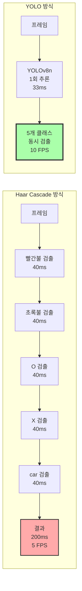

### 성공 사례 분석

**성공 팀의 3대 핵심 요인**

| 요인 | 내용 | 효과 |
|------|------|------|
| **충분한 데이터** | 각 클래스 500장 이상<br/>다양한 거리/각도/조명 | 높은 일반화 성능 |
| **체계적 Annotation** | Roboflow 활용<br/>표준화된 가이드라인 | 명확한 패턴 학습 |
| **적절한 모델** | YOLOv8n (nano)<br/>속도 우선 선택 | 실시간 처리 가능 |

### YOLO 개발 파이프라인

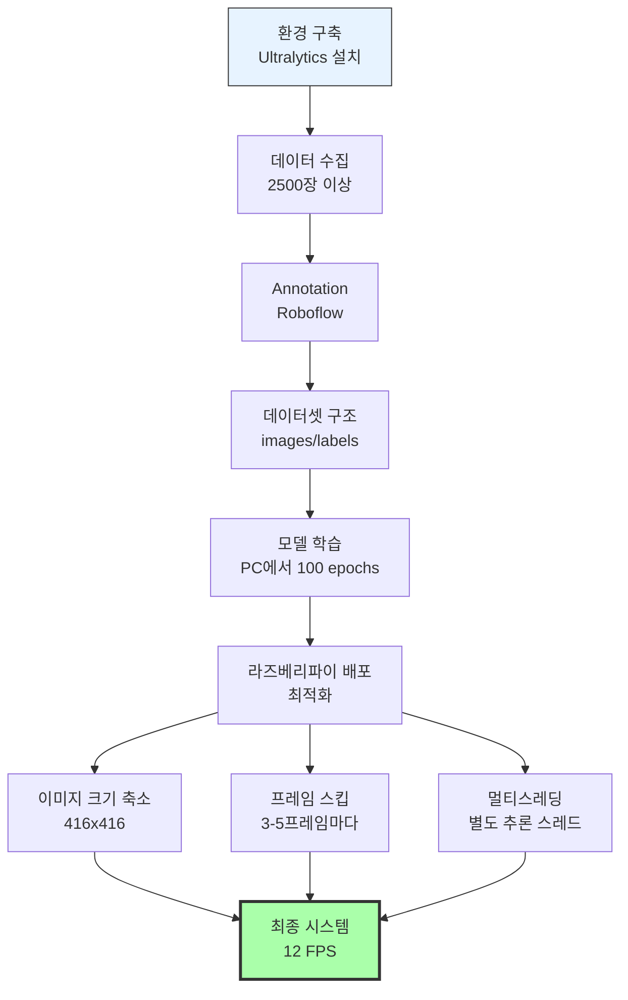

### 라즈베리파이 최적화 전략

**3가지 핵심 최적화**
1. **이미지 크기**: 640x640 → 416x416 (2배 빠름)
2. **추론 간격**: 매 프레임 → 3-5프레임마다 (3-5배 빠름)
3. **멀티스레딩**: 추론과 제어 분리 (반응성 향상)

### 교육 결과

✅ 처리 속도: **5 FPS → 30 FPS** (6배 향상)  
✅ 정확도: **+10-15%** 개선  
✅ 실시간 자율주행 가능  
✅ 현대 딥러닝 기술 실전 경험

---

## 3. 시스템 최적화 및 디버깅 제거 (1시간)

### 교육 목표

개발 코드를 운영 코드로 전환하여 성능을 극대화합니다.

### 시스템 최적화 프로세스

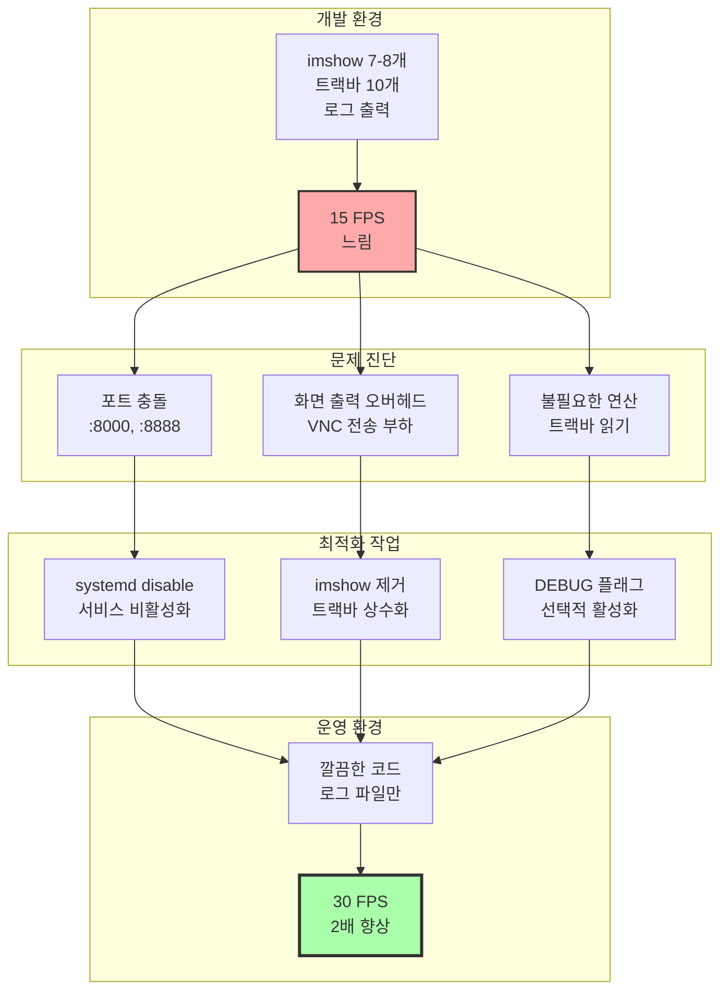

### 3대 최적화 기법

**1. 포트 충돌 해결**
```bash
# 서비스 중지 및 비활성화
sudo systemctl stop jupyter.service
sudo systemctl disable jupyter.service

# 포트 사용 확인
sudo netstat -tulpn | grep :8000
```

**2. 디버깅 코드 제거**

| 항목 | Before | After | 효과 |
|------|--------|-------|------|
| **imshow()** | 7-8개 화면 | 모두 제거 | 2배 빠름 |
| **트랙바** | 10개 파라미터 | 상수로 고정 | 코드 간결 |
| **로그** | print() 다수 | 파일 로그 | 성능 영향 최소 |

**3. 선택적 디버깅 구조**
```python
DEBUG = False  # 운영: False, 디버깅: True

if DEBUG:
    cv2.imshow('Debug', image)
```

### 성능 측정 결과

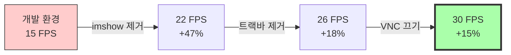

### 교육 결과

✅ 평균 FPS: **15 → 30** (2배 향상)  
✅ 포트 충돌 해결 완료  
✅ 개발 vs 운영 코드 구분  
✅ 시스템 레벨 문제 해결 능력

---

## 4. 시스템 통합 및 배포 (2시간)

### 교육 목표

완성된 시스템을 배포 가능한 형태로 패키징하고, 전체 아키텍처를 이해합니다.

### 배포 프로세스

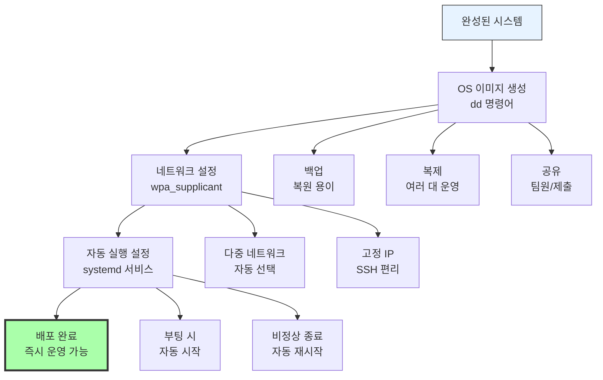

### 전체 시스템 아키텍처 (5계층)

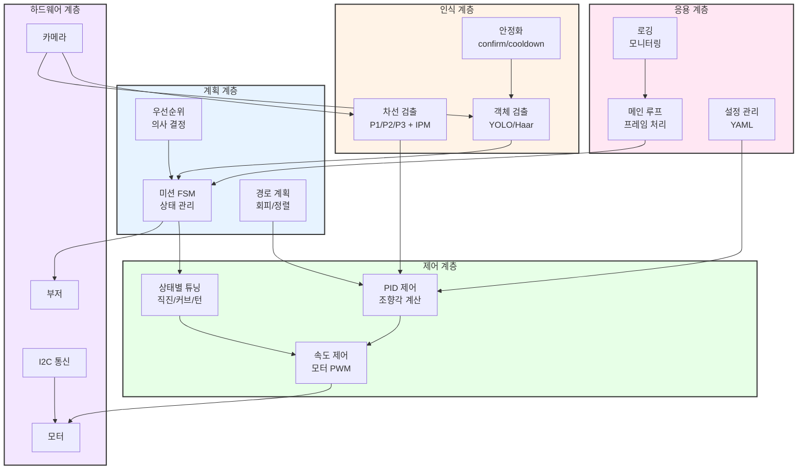

### 핵심 알고리즘 분석 (채점 기준표 기반)

**1. 차선 인식 (P1/P2/P3 멀티 포인트)**
- P1 (가까운 영역): 즉각 반응
- P2 (중간 영역): 안정적 주행
- P3 (먼 영역): 예측 제어
- IPM 변환: 원근 왜곡 보정, 곡률 정확도 향상

**2. PID 제어 (상태별 적응형)**

| 상태 | Kp | Ki | Kd | 특징 |
|------|----|----|----| -----|
| **직선** | 낮음 | 낮음 | 높음 | 안정성 우선 |
| **커브** | 높음 | 중간 | 중간 | 반응성 우선 |
| **급회전** | 매우 높음 | 낮음 | 낮음 | 즉각 반응 |

**3. FSM (상태 기계)**

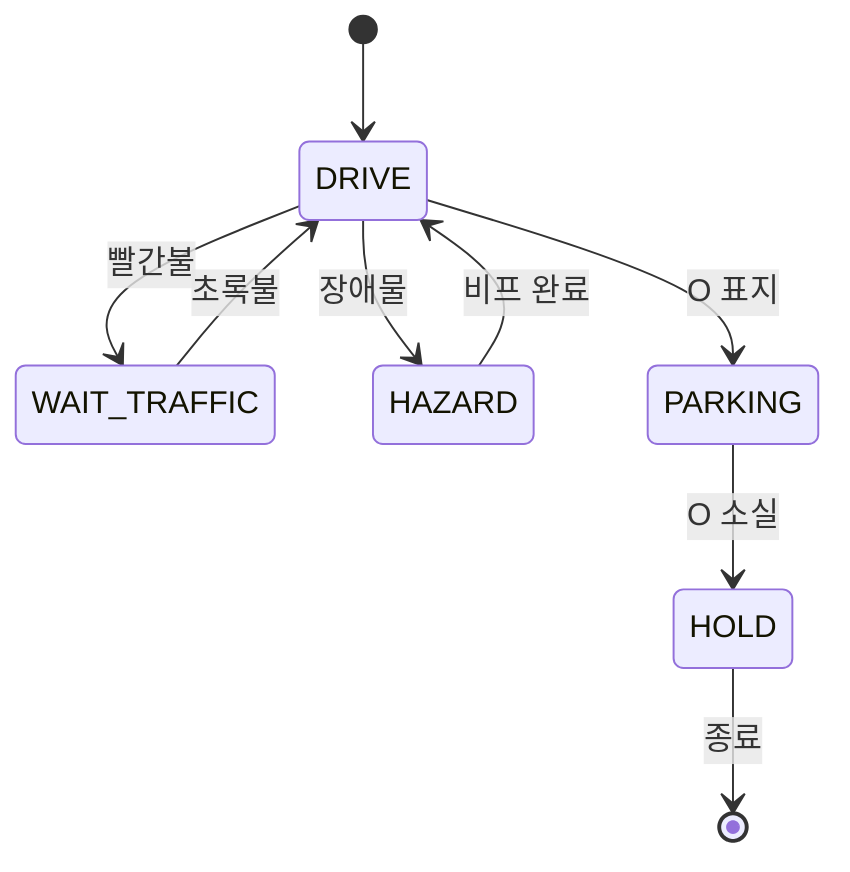

**4. 객체 인식 안정화**
- **Confirm**: 연속 3프레임 검출 시 확정
- **Cooldown**: 미션 후 5초간 재수행 방지
- **거리 필터링**: min_area_ratio로 타이밍 조절

### 배포 체크리스트

✅ OS 이미지 생성 (dd + gzip)  
✅ 네트워크 자동 연결 설정  
✅ 고정 IP 할당  
✅ systemd 서비스 등록  
✅ 자동 재시작 설정  
✅ 로그 파일 경로 설정  
✅ 모델 파일 포함 확인

### 교육 결과

✅ 5계층 아키텍처 이해  
✅ 모듈별 책임과 인터페이스 파악  
✅ 채점 기준표 기반 시스템 분석  
✅ 배포 가능한 완성품 제작  
✅ 시스템적 사고 능력 배양

---

## 교육 성과 및 평가

### 주요 성과 지표

| 항목 | Before | After | 개선율 |
|------|--------|-------|--------|
| **신호등 초록불 인식률** | 60% | 85% | +42% |
| **FPS (프레임 처리 속도)** | 15 FPS | 30 FPS | +100% |
| **객체 검출 방식** | Haar Cascade<br/>5 FPS | YOLO<br/>30 FPS | +500% |
| **객체 검출 정확도** | 기준선 | +10-15% | +10-15% |
| **배포 준비도** | 수동 실행 | 자동 실행<br/>이미지 백업 | 완료 |

### 5대 핵심 역량

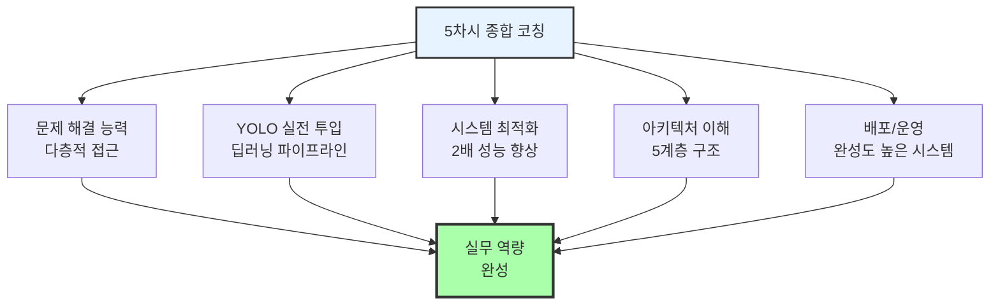

### 1-5차시 학습 여정

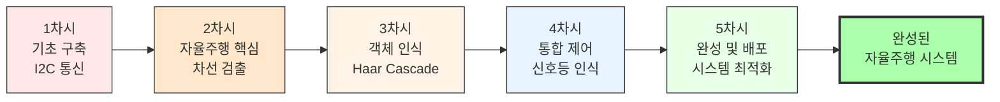

### 핵심 학습 내용 요약

**1. 문제 해결의 다층적 접근**
- 알고리즘 + 데이터 + 환경 통합 검토
- 의외의 곳에서 효과적인 해결책 발견
- 체계적 진단 방법론

**2. 데이터 중심 사고**
- 알고리즘보다 데이터 품질이 핵심
- 실제 환경 데이터의 중요성
- 다양한 조건의 충분한 양

**3. 시스템 레벨 이해**
- 리눅스 시스템 관리
- 네트워크 설정, 서비스 제어
- 임베디드 환경 특수성

**4. 모듈화와 추상화**
- 계층별 책임 명확화
- 인터페이스 기반 설계
- 복잡도 관리

**5. 성능 최적화 실용성**
- 간단한 기법으로 큰 효과
- 측정 가능한 지표 활용
- 개발 vs 운영 코드 구분

---

## 결론

### 최종 성과 요약

5차시 종합 코칭을 통해 **이론과 실무를 완전히 통합**했습니다.

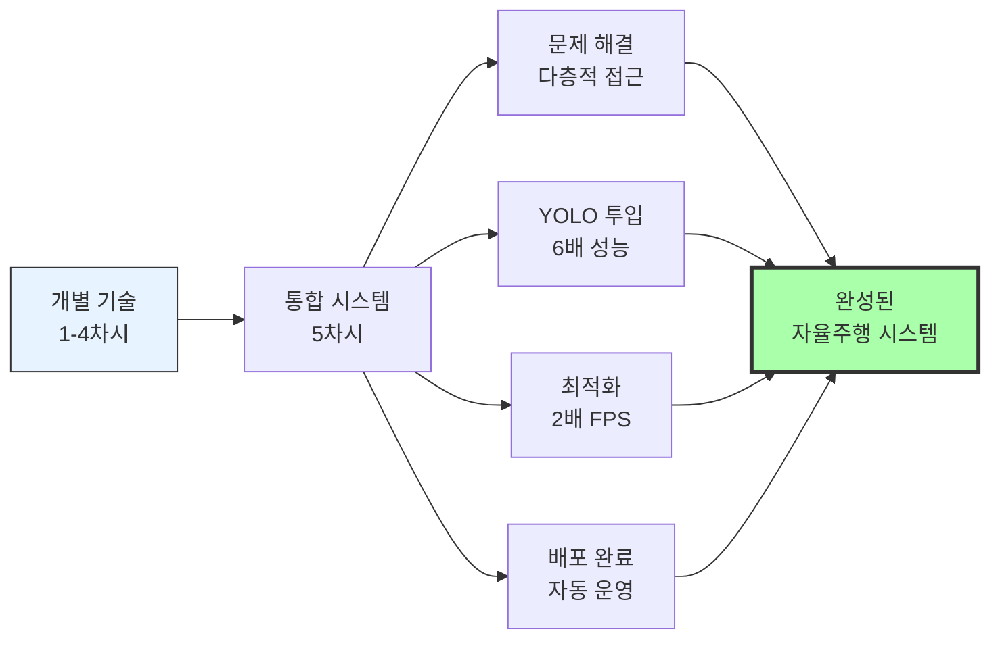

### 3대 핵심 성과

**1. 시스템적 사고 확립**
- 5개 계층 아키텍처 이해
- 모듈 간 역할과 인터페이스 파악
- 복잡한 시스템 설계/운영 능력

**2. 문제 해결 능력 향상**
- 다층적 접근 (알고리즘 + 데이터 + 환경)
- 체계적 진단 방법론
- 효과적 해결책 선택

**3. 실무 배포 역량**
- 처리 속도 6배 향상 (Haar → YOLO)
- FPS 2배 향상 (최적화)
- 배포 가능한 완성품

### 교육 의의

20시간(5차시 × 4시간)의 체계적 학습을 통해 **라즈베리파이 기초부터 완전한 자율주행 시스템까지** IoT 및 임베디드 AI 분야의 핵심 역량을 모두 갖추었습니다.

단순히 동작하는 시스템이 아닌, **배포 가능하고 운영 가능한 전문적인 시스템**을 완성했으며, 이는 향후 더 복잡한 로봇 프로젝트나 실무 프로젝트에서 핵심 개발자로 활약할 수 있는 탄탄한 기반이 되었습니다.

---

**작성일**: 2025년  
**교육 기관**: 가천대학교  
**보고서 작성자**: P-실무 과정

