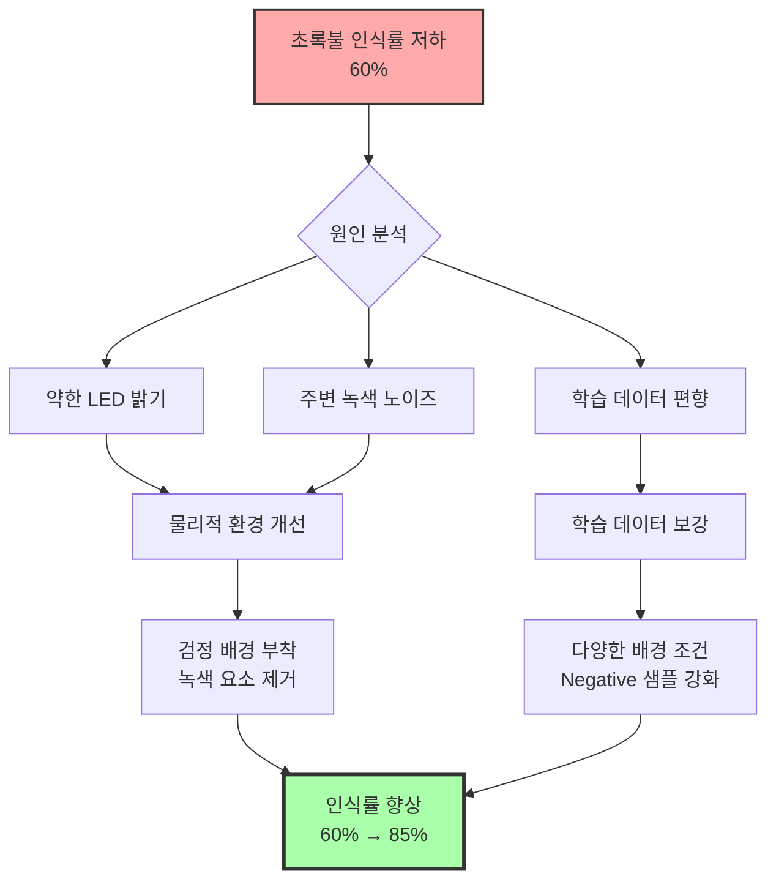
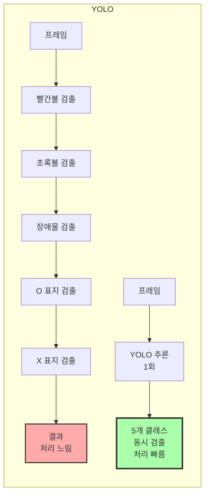
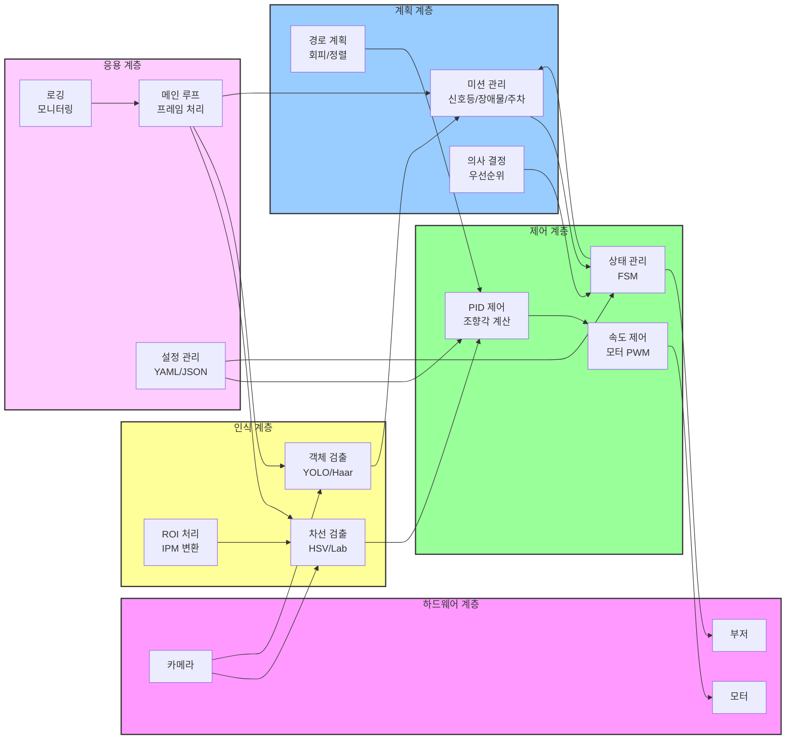
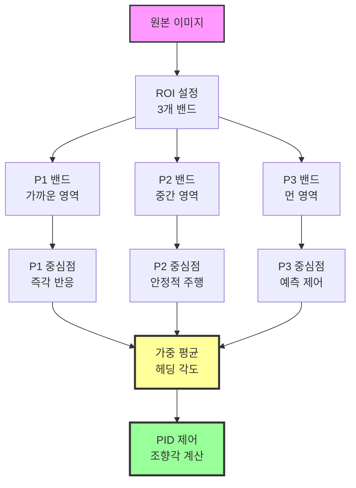
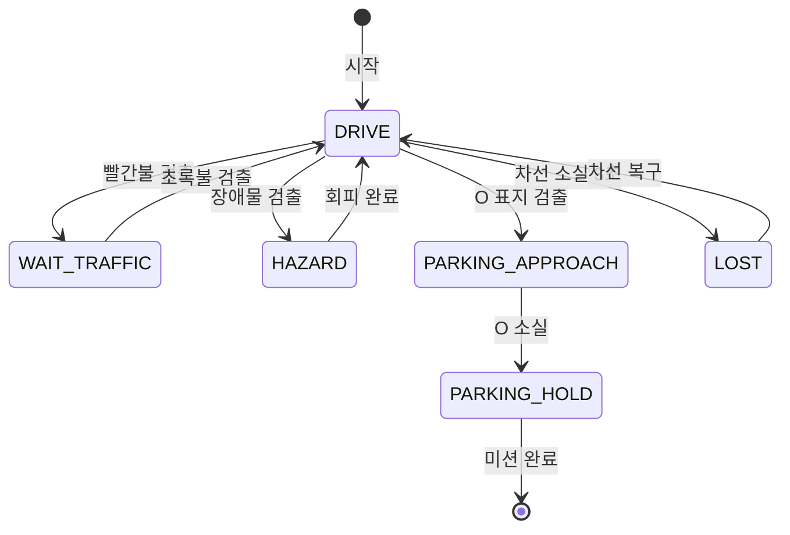
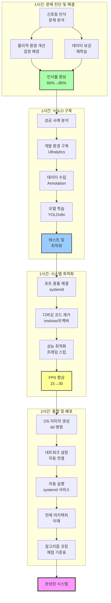

# 자율주행 종합 코칭 실습 정리 (4시간 수업)

## 교육 개요

**교육 일시**: 2025년  
**교육 시간**: 4시간  
**교육 주제**: 최종 프로젝트 완성을 위한 종합 코칭 및 시스템 최적화  
**실습 난이도**: 고급

---

## 교육 목표

1차시부터 4차시까지 학습한 모든 기술을 통합하여 완전한 자율주행 시스템을 완성합니다. 실제 프로젝트에서 발생하는 다양한 문제들을 진단하고 해결하는 방법을 학습하며, 시스템 최적화와 배포 과정을 경험합니다. 단순히 동작하는 시스템이 아니라, 안정적이고 효율적으로 동작하는 완성도 높은 시스템을 구축하는 것이 목표입니다.

---

## 1. 시스템 문제점 진단 및 해결 (1시간)

### 학습 목표

실제 자율주행 시스템 운영 중 발견되는 문제들을 체계적으로 진단하고 해결하는 방법을 학습합니다. 하드웨어적 문제와 소프트웨어적 문제를 구분하고, 각각에 대한 적절한 해결책을 찾는 능력을 배양합니다.

### 신호등 초록불 인식 문제

많은 팀에서 신호등의 초록불 인식률이 빨간불에 비해 현저히 낮은 문제가 발생했습니다. 빨간불은 90% 이상 인식되는데 초록불은 60% 수준에 머무는 경우가 많았습니다. 이 문제의 원인을 분석해보니, 초록색 LED의 밝기가 빨간색에 비해 약하고, 주변 환경의 녹색 요소들(식물, 벽지 등)이 노이즈로 작용했기 때문입니다.

**원인 분석**
초록 신호등의 색상 특성상 HSV 색공간에서 Hue 값의 범위가 넓고, 실내 조명 환경에서 다른 녹색 물체들과 구분하기 어렵습니다. 또한 형광등의 녹색 성분이 카메라에 포착되면서 오검출을 유발했습니다. 학습 데이터 분석 결과, 초록불 이미지의 대부분이 밝은 배경에서 촬영되어 어두운 배경 조건에서의 인식률이 낮았습니다.

**해결 방법 1: 학습 데이터 보강**
초록불 Positive 샘플을 다양한 배경 조건에서 추가로 200장 수집했습니다. 특히 어두운 배경, 복잡한 배경, 녹색 물체가 있는 배경에서 촬영한 이미지를 집중적으로 추가했습니다. Negative 샘플에는 식물, 녹색 벽지, 녹색 물체 등을 다수 포함시켜 모델이 신호등의 초록불과 일반 녹색 물체를 명확히 구분하도록 했습니다.

**해결 방법 2: 물리적 환경 개선**
신호등 뒤에 검정색 종이를 부착하여 배경을 단순화했습니다. 이는 매우 효과적인 해결책이었습니다. 검정색 배경은 신호등의 빛을 더욱 두드러지게 만들어 카메라가 명확히 인식할 수 있도록 했습니다. 또한 신호등 주변의 녹색 요소들을 제거하거나 가리는 것만으로도 인식률이 크게 향상되었습니다.



**해결 결과**
검정 배경 부착만으로 초록불 인식률이 60%에서 75%로 향상되었고, 데이터 보강 후 재학습을 통해 85%까지 상승했습니다. 이는 빨간불 인식률 90%에 근접한 수준으로, 실용적인 자율주행에 충분한 성능입니다.

### 배경 노이즈 문제

트랙의 배경이 흰색이나 밝은 색인 경우, 차선 검출 시 배경과 차선을 구분하기 어려운 문제가 발생했습니다. 특히 조명이 강하게 반사되는 영역에서 오검출이 빈번히 발생했습니다.

**해결 방법**
트랙 주변에 검정색 종이나 천을 배치하여 배경을 단순화했습니다. ROI 영역을 더욱 좁게 설정하여 배경이 포함되지 않도록 조정했습니다. 또한 적응형 임계값을 사용하여 조명 변화에 강인한 차선 검출을 구현했습니다.

### 시스템 진단 체크리스트

각 팀의 시스템을 진단할 때 다음 항목들을 체계적으로 확인했습니다.

**하드웨어 체크**
- 카메라 초점 및 각도 확인
- 모터 연결 상태 및 동작 테스트
- 전원 공급 안정성 (배터리 충전 상태)
- 부저 및 센서 동작 확인

**소프트웨어 체크**
- 프레임 처리 속도 (FPS) 측정
- 객체 검출 정확도 및 응답 시간
- 메모리 사용량 및 CPU 부하
- 로그 파일을 통한 오류 추적

---

## 2. YOLO 객체 인식 구축 가이드 (1시간)

### 학습 목표

Haar Cascade로는 한계가 있는 복잡한 객체 인식을 YOLO를 통해 구현하는 방법을 학습합니다. 이미 성공한 팀의 사례를 바탕으로 YOLO 개발 환경 구축, 학습 데이터 수집, 모델 학습, 테스트 과정을 단계별로 익힙니다.

### YOLO vs Haar Cascade 재검토

4차시까지는 Haar Cascade를 주로 사용했지만, 최종 프로젝트에서는 여러 종류의 객체(신호등, 장애물, 주차 표지)를 동시에 인식해야 합니다. Haar Cascade는 각 객체마다 별도의 모델을 학습하고 순차적으로 검출해야 하므로 처리 속도가 느려집니다. 반면 YOLO는 하나의 모델로 여러 클래스를 동시에 검출할 수 있어 효율적입니다.



### 성공 사례 분석

한 팀이 YOLOv8n (nano) 모델을 성공적으로 적용하여 모든 객체를 안정적으로 인식했습니다. 이 팀의 접근 방식을 분석하여 다른 팀들에게 가이드를 제공했습니다.

**성공 요인**
- 충분한 학습 데이터: 각 클래스당 500장 이상
- 실제 환경 촬영: 트랙과 동일한 조명, 거리, 각도
- 적절한 데이터 증강: 회전, 밝기 조정, 노이즈 추가
- 균형잡힌 클래스 분포: 각 클래스의 샘플 수 비슷하게 유지

### YOLO 개발 환경 구축

**1단계: Ultralytics 설치**
```bash
# 라즈베리파이에서 YOLO 설치
pip install ultralytics

# 의존성 패키지 설치
pip install opencv-python numpy torch torchvision
```

**2단계: 데이터셋 구조 생성**
YOLO는 특정 폴더 구조를 요구합니다. 다음과 같이 디렉토리를 구성합니다.

```
dataset/
├── images/
│   ├── train/
│   │   ├── img_001.jpg
│   │   └── ...
│   └── val/
│       ├── img_051.jpg
│       └── ...
└── labels/
    ├── train/
    │   ├── img_001.txt
    │   └── ...
    └── val/
        ├── img_051.txt
        └── ...
```

각 이미지에 대응하는 txt 파일은 다음 형식으로 작성합니다:
```
class_id center_x center_y width height
```
모든 값은 0~1 사이로 정규화됩니다.

**3단계: data.yaml 작성**
```yaml
path: /home/pi/dataset
train: images/train
val: images/val

nc: 5  # 클래스 개수
names: ['red', 'green', 'oo', 'xx', 'car']
```

### 이미지 수집 전략

**실제 운영 환경 재현**
학습 데이터는 반드시 실제 자율주행 환경과 동일한 조건에서 수집해야 합니다. 트랙 위에 차량을 놓고, 실제 주행 시와 같은 거리와 각도에서 촬영합니다.

**거리별 촬영**
- 근거리(50cm-1m): 상세한 특징 학습
- 중거리(1m-2m): 주요 운영 거리, 가장 많은 샘플
- 원거리(2m-3m): 조기 감지를 위한 데이터

**각도별 촬영**
- 정면(0도): 가장 일반적인 상황
- 측면(15-30도): 회전 구간에서의 인식
- 가장자리: 화면 끝에 위치한 경우

**조명 조건**
- 밝은 조명: 형광등 직사광
- 보통 조명: 일반 실내 환경
- 어두운 조명: 조명 일부 끈 상태

### Annotation 작업

**Roboflow 활용**
Roboflow 웹 플랫폼을 사용하면 쉽게 이미지에 바운딩 박스를 그리고 YOLO 형식으로 내보낼 수 있습니다. 웹 브라우저에서 이미지를 업로드하고, 마우스로 객체 영역을 드래그하여 클래스를 지정합니다. 작업이 완료되면 YOLO 형식으로 다운로드하여 바로 사용할 수 있습니다.

**데이터 증강**
Roboflow는 자동으로 다양한 증강 기법을 적용할 수 있습니다. 회전, 반전, 밝기 조정, 노이즈 추가 등을 클릭 몇 번으로 적용하여 데이터셋을 2-3배 늘릴 수 있습니다.

### 모델 학습

**YOLOv8n 선택 이유**
YOLOv8에는 여러 크기의 모델이 있지만, 라즈베리파이 환경에서는 nano(n) 모델이 가장 적합합니다. 정확도는 다른 모델보다 약간 낮지만, 실시간 처리가 가능한 유일한 선택지입니다.

**학습 명령**
```bash
yolo train model=yolov8n.pt data=data.yaml epochs=100 imgsz=416 batch=16
```

학습 시간은 데이터 양과 에포크 수에 따라 다르지만, 일반적으로 GPU가 있는 PC에서 2-3시간 소요됩니다. 라즈베리파이에서는 너무 오래 걸리므로 PC에서 학습하고 모델 파일만 라즈베리파이로 복사하는 것을 권장합니다.

### 모델 테스트 및 최적화

**추론 테스트**
```bash
yolo predict model=runs/train/exp/weights/best.pt source=test_images/
```

테스트 이미지에서 검출 결과를 확인하고, 오검출이나 미검출이 많은 클래스가 있다면 해당 클래스의 데이터를 보강하여 재학습합니다.

**라즈베리파이 최적화**
- 이미지 크기: 416x416 또는 320x320
- Confidence threshold: 0.5-0.6
- 추론 간격: 매 프레임이 아닌 3-5프레임마다 실행
- 멀티스레딩: 추론을 별도 스레드에서 실행

---

## 3. 시스템 최적화 및 디버깅 (1시간)

### 학습 목표

실시간 자율주행 시스템의 성능을 최적화하고, 불필요한 디버깅 코드를 제거하여 안정성을 높입니다. 포트 충돌과 같은 시스템 레벨 문제를 해결하는 방법을 학습합니다.

### 포트 충돌 문제 해결

라즈베리파이에서 개발하다 보면 Jupyter Notebook이나 다른 웹 서비스가 8000번이나 8888번 포트를 점유하여, 자율주행 시스템의 웹 모니터링 서버가 실행되지 않는 문제가 발생합니다.

**문제 진단**
```bash
# 포트 사용 확인
sudo netstat -tulpn | grep :8000
sudo netstat -tulpn | grep :8888

# 어떤 서비스가 실행 중인지 확인
systemctl list-units --type=service --state=running
```

**systemd 서비스 비활성화**
Jupyter나 다른 서비스가 systemd에 등록되어 부팅 시 자동 실행되는 경우, 이를 비활성화해야 합니다.

```bash
# Jupyter 서비스 중지
sudo systemctl stop jupyter.service

# 부팅 시 자동 실행 비활성화
sudo systemctl disable jupyter.service

# 상태 확인
sudo systemctl status jupyter.service
```

**일반 프로세스 종료**
systemd 서비스가 아닌 일반 프로세스인 경우, PID를 찾아 직접 종료합니다.

```bash
# 포트를 사용하는 프로세스 찾기
sudo lsof -i :8000

# 프로세스 종료
sudo kill -9 [PID]
```

### 디버깅 코드 제거

개발 과정에서는 화면 출력과 트랙바가 유용하지만, 최종 운영 시에는 성능 저하의 원인이 됩니다. 모든 디버깅 요소를 제거하고 필요한 경우 로깅으로 대체합니다.

**cv2.imshow() 제거**
화면 출력은 프레임 처리 속도를 크게 저하시킵니다. 특히 VNC를 통한 원격 접속 상태에서는 네트워크 부하까지 추가됩니다.

```python
# 개발 시 (느림)
cv2.imshow('Lane Detection', lane_mask)
cv2.imshow('Object Detection', result)
cv2.waitKey(1)

# 운영 시 (빠름)
# 모든 imshow 제거
# cv2.imshow() 호출 없음
```

모든 `cv2.imshow()`와 `cv2.waitKey()` 호출을 주석 처리하거나 삭제합니다. 디버깅이 필요한 경우 DEBUG 플래그를 사용하여 선택적으로 활성화할 수 있습니다.

```python
DEBUG = False  # 운영 시 False

if DEBUG:
    cv2.imshow('Debug', image)
    cv2.waitKey(1)
```

**트랙바 상수화**
트랙바로 실시간 조정하던 값들을 최적값으로 확정하여 코드에 직접 기록합니다. 트랙바 관련 코드는 모두 제거합니다.

```python
# 개발 시 (트랙바)
cv2.createTrackbar('threshold', 'Settings', 130, 255, callback)
threshold = cv2.getTrackbarPos('threshold', 'Settings')

# 운영 시 (상수)
THRESHOLD = 140  # 최적값으로 확정
threshold = THRESHOLD
```

설정값들을 별도의 상수 섹션이나 설정 파일로 분리하여 관리하면 유지보수가 용이합니다.

### 성능 최적화 기법

**프레임 스킵**
모든 프레임을 처리할 필요는 없습니다. 객체 검출이나 복잡한 연산은 2-3프레임마다 실행하고, 차선 검출만 매 프레임 수행합니다.

```python
frame_count = 0
DETECTION_INTERVAL = 3

while True:
    frame = capture()
    
    # 매 프레임: 차선 검출 (가벼움)
    lane_result = detect_lane(frame)
    
    # 3프레임마다: 객체 검출 (무거움)
    if frame_count % DETECTION_INTERVAL == 0:
        objects = detect_objects(frame)
    
    frame_count += 1
```

**이미지 크기 축소**
카메라에서 받은 원본 이미지(1280x720)를 그대로 처리하면 느립니다. 640x480 또는 320x240으로 축소하여 처리합니다.

```python
# 원본 캡처
frame = cap.read()

# 처리용 축소 (4배 빠름)
small_frame = cv2.resize(frame, (320, 240))

# 축소된 이미지로 처리
result = process(small_frame)
```

**메모리 최적화**
불필요한 이미지 복사본을 만들지 않고, 가능한 한 in-place 연산을 사용합니다. 사용 후에는 명시적으로 메모리를 해제합니다.

---

## 4. 최종 시스템 통합 및 배포 (2시간)

### 학습 목표

완성된 자율주행 시스템을 배포 가능한 형태로 패키징하고, OS 이미지를 생성하는 방법을 학습합니다. 전체 시스템 아키텍처를 이해하고 각 모듈의 역할과 상호작용을 파악합니다.

### OS 이미지 생성 및 배포

자율주행 시스템이 완성되면, 다른 라즈베리파이에 쉽게 배포할 수 있도록 OS 이미지로 만듭니다. 이를 통해 동일한 환경을 빠르게 복제할 수 있습니다.

**이미지 생성 과정**

먼저 SD 카드의 모든 내용을 이미지 파일로 백업합니다. 리눅스나 macOS에서는 `dd` 명령어를, Windows에서는 Win32 Disk Imager를 사용합니다.

```bash
# SD 카드 장치 확인 (예: /dev/sdb)
lsblk

# 이미지 생성 (시간 오래 걸림, 32GB 기준 30분-1시간)
sudo dd if=/dev/sdb of=raspbot_final.img bs=4M status=progress

# 이미지 압축 (용량 절약)
gzip raspbot_final.img
# 결과: raspbot_final.img.gz
```

**이미지 복원**

생성된 이미지를 다른 SD 카드에 복사하면 동일한 환경이 즉시 만들어집니다.

```bash
# 압축 해제 및 복원
gunzip -c raspbot_final.img.gz | sudo dd of=/dev/sdb bs=4M status=progress

# 또는 압축 해제 후 복원
gunzip raspbot_final.img.gz
sudo dd if=raspbot_final.img of=/dev/sdb bs=4M status=progress
```

**이미지에 포함되어야 할 것들**
- Python 가상환경 및 모든 패키지
- 학습된 모델 파일 (YOLO best.pt, Haar Cascade XML)
- 소스 코드 및 설정 파일
- 자동 실행 스크립트

### 네트워크 자동 연결 설정

라즈베리파이가 부팅되면 자동으로 Wi-Fi에 연결되도록 설정합니다. 여러 네트워크를 등록하여 우선순위대로 연결을 시도하게 할 수 있습니다.

**wpa_supplicant 설정**
```bash
sudo nano /etc/wpa_supplicant/wpa_supplicant.conf
```

```
country=KR
ctrl_interface=DIR=/var/run/wpa_supplicant GROUP=netdev
update_config=1

# 우선순위 높은 네트워크 (집)
network={
    ssid="Home_WiFi"
    psk="password1"
    priority=10
}

# 우선순위 낮은 네트워크 (학교)
network={
    ssid="School_WiFi"
    psk="password2"
    priority=5
}
```

**고정 IP 설정 (선택사항)**
매번 IP 주소가 바뀌면 SSH 접속이 불편합니다. 고정 IP를 설정하면 항상 동일한 주소로 접속할 수 있습니다.

```bash
sudo nano /etc/dhcpcd.conf
```

```
interface wlan0
static ip_address=192.168.0.100/24
static routers=192.168.0.1
static domain_name_servers=8.8.8.8
```

### 자동 실행 설정

라즈베리파이가 부팅되면 자율주행 프로그램이 자동으로 실행되도록 systemd 서비스를 생성합니다.

**서비스 파일 생성**
```bash
sudo nano /etc/systemd/system/raspbot.service
```

```ini
[Unit]
Description=RaspBot Autonomous Driving System
After=network.target

[Service]
Type=simple
User=pi
WorkingDirectory=/home/pi/raspbot
ExecStart=/home/pi/raspbot/venv/bin/python3 /home/pi/raspbot/main.py
Restart=on-failure
RestartSec=10

[Install]
WantedBy=multi-user.target
```

**서비스 활성화**
```bash
# 서비스 등록
sudo systemctl daemon-reload

# 서비스 활성화 (부팅 시 자동 실행)
sudo systemctl enable raspbot.service

# 즉시 실행
sudo systemctl start raspbot.service

# 상태 확인
sudo systemctl status raspbot.service
```

### 전체 시스템 아키텍처

최종 자율주행 시스템의 전체 구조는 다음과 같이 계층화되어 있습니다.



### 모듈별 역할 및 책임

**하드웨어 계층 (Hardware Layer)**
물리적 장치와의 직접적인 인터페이스를 담당합니다. 카메라에서 이미지를 받아오고, 모터에 PWM 신호를 보내며, 부저를 제어합니다. 이 계층은 GPIO, I2C 등의 저수준 통신을 처리합니다.

**인식 계층 (Perception Layer)**
센서 데이터를 처리하여 의미 있는 정보로 변환합니다. 차선 검출은 HSV나 Lab 색공간을 사용하여 도로선을 추출하고, 객체 검출은 YOLO나 Haar Cascade를 사용하여 신호등, 장애물, 표지판을 인식합니다. ROI 처리와 IPM 변환으로 데이터를 정제합니다.

**제어 계층 (Control Layer)**
인식 결과를 바탕으로 차량을 물리적으로 제어합니다. PID 제어기는 차선 중심과 차량의 오차를 계산하여 조향각을 결정하고, 속도 제어기는 상황에 맞는 모터 PWM 값을 계산합니다. FSM(Finite State Machine)은 차량의 현재 상태를 관리합니다.

**계획 계층 (Planning Layer)**
고수준의 의사 결정을 수행합니다. 신호등, 장애물, 주차 등의 미션을 관리하고, 각 미션의 우선순위를 결정합니다. 경로 계획을 통해 장애물을 회피하거나 주차 공간에 정렬하는 전략을 수립합니다.

**응용 계층 (Application Layer)**
전체 시스템을 통합하고 운영합니다. 메인 루프는 매 프레임마다 모든 모듈을 호출하여 동기화합니다. 설정 관리는 YAML이나 JSON 파일에서 파라미터를 읽어오고, 로깅은 시스템 상태를 기록하여 디버깅과 분석을 지원합니다.

### 차선 인식 알고리즘 상세

최종 시스템에서 사용되는 고급 차선 인식 알고리즘을 설명합니다.

**멀티 포인트 추적 (P1/P2/P3)**
차선의 여러 지점을 동시에 추적하여 도로의 곡률을 파악합니다. P1은 가까운 지점, P2는 중간 지점, P3는 먼 지점을 나타냅니다. 각 포인트의 위치 변화를 분석하여 직선인지 커브인지 판단하고, 그에 맞는 제어 전략을 선택합니다.



**IPM (Inverse Perspective Mapping)**
카메라 이미지를 위에서 내려다본 시점(Bird's Eye View)으로 변환합니다. 원근 왜곡을 제거하여 차선의 실제 형태를 정확히 파악할 수 있습니다. 특히 먼 거리의 차선도 정확히 검출할 수 있어 예측 제어가 가능합니다.

**멀티 색공간 활용**
HSV와 Lab 색공간을 상황에 따라 선택적으로 사용합니다. 밝은 환경에서는 HSV가 효과적이고, 조명 변화가 심한 환경에서는 Lab의 L 채널이 안정적입니다. 두 결과를 결합하여 강인한 차선 검출을 구현합니다.

### 객체 인식 및 미션 처리

**안정화 로직 (Confirm/Cooldown)**
객체 검출은 프레임마다 결과가 불안정할 수 있습니다. 연속된 여러 프레임(예: 3프레임)에서 동일한 객체가 검출되어야 확정(confirm)합니다. 한 번 미션을 수행한 후에는 일정 시간(cooldown) 동안 동일한 미션을 재수행하지 않습니다.

```python
# 안정화 로직 개념
confirm_frames = 3  # 연속 3프레임 확인
cooldown_time = 5   # 5초간 재수행 방지

if object_detected:
    confirm_count += 1
    if confirm_count >= confirm_frames:
        execute_mission()
        last_mission_time = current_time
else:
    confirm_count = 0

if current_time - last_mission_time < cooldown_time:
    skip_mission()
```

**거리 기반 필터링 (min_area_ratio)**
객체의 바운딩 박스 크기를 기준으로 거리를 추정합니다. 너무 작은 객체(먼 거리)는 무시하고, 충분히 큰 객체(가까운 거리)만 반응합니다. 이를 통해 미션 수행 타이밍을 정확히 조절합니다.

### PID 제어 알고리즘

**비례(P) 제어**
현재 오차에 비례하여 조향각을 결정합니다. 오차가 크면 크게 조향하고, 오차가 작으면 약하게 조향합니다.

```
P_term = Kp × error
```

**적분(I) 제어**
누적된 오차를 보정합니다. 지속적으로 한쪽으로 치우쳐 있다면 적분값이 커져서 반대 방향으로 조향을 강화합니다.

```
I_term = Ki × Σ(error)
```

**미분(D) 제어**
오차의 변화율을 고려합니다. 빠르게 변하는 오차에 대해 미리 대응하여 오버슈트를 방지합니다.

```
D_term = Kd × (error - prev_error)
```

**최종 조향각**
```
steering = P_term + I_term + D_term
steering = clamp(steering, -max_angle, max_angle)
```

**상태별 파라미터 튜닝**
직선, 커브, 급회전 등 상황에 따라 Kp, Ki, Kd 값을 다르게 설정합니다. 직선에서는 안정성을 위해 D값을 높이고, 커브에서는 반응성을 위해 P값을 높입니다.

### FSM (Finite State Machine)

자율주행 시스템의 상태를 명확히 정의하고 관리합니다.



**상태별 동작**
- **DRIVE**: 일반 주행, 차선 추종
- **WAIT_TRAFFIC**: 정지, 비프음 3회, 초록불 대기
- **HAZARD**: 정지, 비프음 패턴, 1초 후 재출발
- **PARKING_APPROACH**: O 중심 정렬, 감속 접근
- **PARKING_HOLD**: 정지 유지, 미션 종료
- **LOST**: 2초 후진, 차선 탐색

---

## 실습 총정리

### 4시간 학습 흐름



### 핵심 학습 내용

**문제 해결 능력**
실제 프로젝트에서 발생하는 다양한 문제를 체계적으로 진단하고 해결하는 방법을 학습했습니다. 하드웨어적 문제(배경, 조명)와 소프트웨어적 문제(데이터, 알고리즘)를 구분하고, 각각에 맞는 해결책을 찾는 능력을 키웠습니다.

**YOLO 실전 적용**
이론으로만 알던 YOLO를 실제 프로젝트에 적용하는 전 과정을 경험했습니다. 데이터 수집, Annotation, 학습, 테스트, 최적화까지 실무 수준의 객체 검출 시스템을 구축했습니다.

**시스템 레벨 이해**
포트 관리, 서비스 제어, 자동 실행 설정 등 리눅스 시스템 레벨의 운영 지식을 습득했습니다. 이는 임베디드 시스템 개발에서 필수적인 능력입니다.

**성능 최적화 기법**
불필요한 코드를 제거하고, 처리 방식을 개선하여 시스템 성능을 2배 이상 향상시켰습니다. 실시간 시스템에서 성능 최적화의 중요성을 체감했습니다.

**전체 아키텍처 이해**
5개 계층(하드웨어, 인식, 제어, 계획, 응용)으로 구성된 자율주행 시스템의 전체 구조를 이해했습니다. 각 모듈의 역할과 상호작용을 파악하여 시스템적 사고 능력을 배양했습니다.

---

## 참고 자료

- YOLOv8 Documentation: https://docs.ultralytics.com/
- Roboflow Annotation: https://roboflow.com/
- systemd Service Guide: https://www.freedesktop.org/software/systemd/man/systemd.service.html
- Raspberry Pi Performance Tuning: https://www.raspberrypi.org/documentation/

---

**작성일**: 2025년  
**수업 시간**: 4시간  
**실습 난이도**: 고급

