# 🔄 Raspbot v2 마이그레이션 가이드

## YB_Pcb_Car → Raspbot_Lib 전환 가이드

이 문서는 구 버전 `YB_Pcb_Car`를 사용하는 코드를 최신 `Raspbot_Lib`로 전환하는 방법을 설명합니다.

---

## 📋 목차

1. [주요 변경사항](#-주요-변경사항)
2. [시스템 아키텍처](#-시스템-아키텍처)
3. [Raspbot_Lib API 레퍼런스](#-raspbot_lib-api-레퍼런스)
4. [라이브러리 Import 변경](#-라이브러리-import-변경)
5. [모터 제어 변경](#-모터-제어-변경)
6. [서보 모터 변경](#-서보-모터-변경)
7. [LED 제어](#-led-제어)
8. [부저 제어](#-부저-제어)
9. [센서 제어](#-센서-제어)
10. [카메라 제어](#-카메라-제어)
11. [전체 예제 비교](#-전체-예제-비교)
12. [체크리스트](#-체크리스트)

---

## 🎯 주요 변경사항

### 구/신 버전 비교표

| 구분 | 구 버전 (YB_Pcb_Car) | 신 버전 (Raspbot_Lib) |
|------|---------------------|----------------------|
| 라이브러리 | `import YB_Pcb_Car` | `from Raspbot_Lib import Raspbot` |
| 객체 생성 | `car = YB_Pcb_Car.YB_Pcb_Car()` | `bot = Raspbot()` |
| 모터 제어 | `car.Car_Run(speed1, speed2)` | `bot.Ctrl_Muto(id, speed)` |
| 속도 범위 | 0~255 (방향 별도) | -255~255 (음수=후진) |
| 서보 1 각도 | 0~180도 | 0~180도 |
| 서보 2 각도 | 0~180도 | 0~100도 ⚠️ |
| LED 제어 | 없음 | `Ctrl_WQ2812_ALL()` 등 |
| 부저 제어 | 없음 | `Ctrl_BEEP_Switch()` |
| 센서 읽기 | 없음 | `read_data_array()` |

---

## 📐 시스템 아키텍처

### Raspbot_Lib 클래스 구조

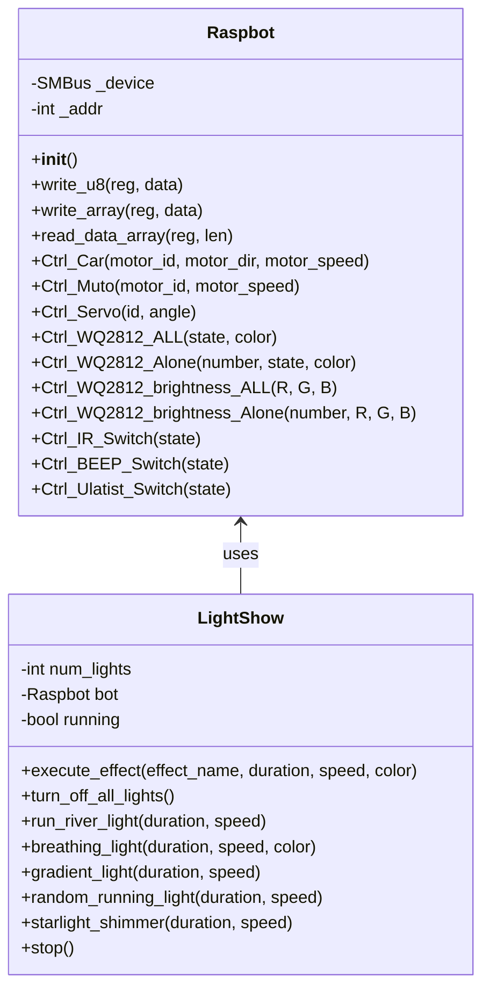

### I2C 레지스터 맵

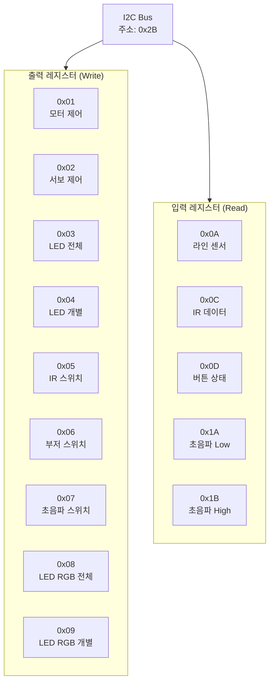

### 하드웨어 연결 구조

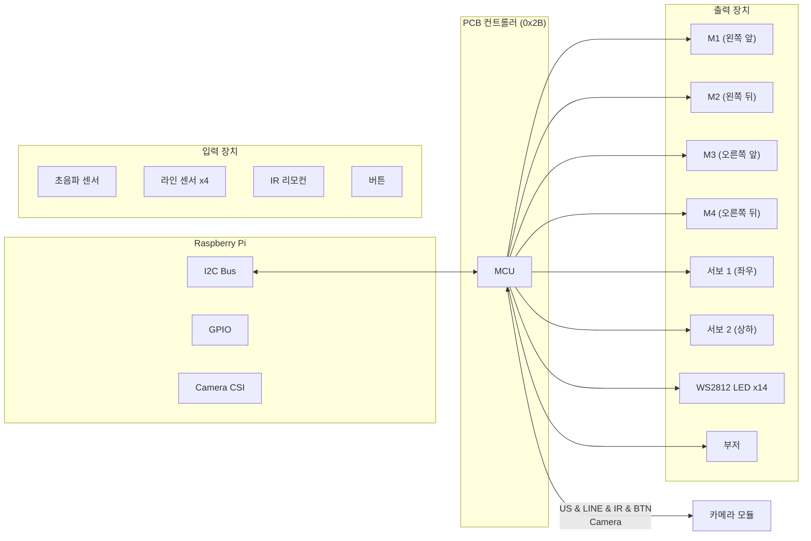

---

## 📚 Raspbot_Lib API 레퍼런스

### API 함수 상세표

| 함수명 | 파라미터 | 반환값 | 설명 |
|--------|----------|--------|------|
| `Ctrl_Muto(motor_id, motor_speed)` | `motor_id`: 0~3<br/>`motor_speed`: -255~255 | None | 모터 제어 (음수=후진) |
| `Ctrl_Car(motor_id, motor_dir, motor_speed)` | `motor_id`: 0~3<br/>`motor_dir`: 0(전진)/1(후진)<br/>`motor_speed`: 0~255 | None | 모터 제어 (레거시) |
| `Ctrl_Servo(id, angle)` | `id`: 1~2<br/>`angle`: 0~180 (서보2는 0~100) | None | 서보 모터 제어 |
| `Ctrl_WQ2812_ALL(state, color)` | `state`: 0(끔)/1(켬)<br/>`color`: 0~6 | None | 전체 LED 색상 제어 |
| `Ctrl_WQ2812_Alone(number, state, color)` | `number`: 1~14<br/>`state`: 0/1<br/>`color`: 0~6 | None | 개별 LED 색상 제어 |
| `Ctrl_WQ2812_brightness_ALL(R, G, B)` | `R, G, B`: 0~255 | None | 전체 LED RGB 밝기 |
| `Ctrl_WQ2812_brightness_Alone(number, R, G, B)` | `number`: 1~14<br/>`R, G, B`: 0~255 | None | 개별 LED RGB 밝기 |
| `Ctrl_BEEP_Switch(state)` | `state`: 0(끔)/1(켬) | None | 부저 제어 |
| `Ctrl_IR_Switch(state)` | `state`: 0(끔)/1(켬) | None | IR 수신 활성화 |
| `Ctrl_Ulatist_Switch(state)` | `state`: 0(끔)/1(켬) | None | 초음파 센서 활성화 |
| `read_data_array(reg, len)` | `reg`: 레지스터 주소<br/>`len`: 읽을 바이트 수 | `list[int]` | I2C 데이터 읽기 |

### 레지스터 주소 및 용도

| 레지스터 | 주소 | 타입 | 데이터 형식 | 설명 |
|----------|------|------|-------------|------|
| 모터 제어 | `0x01` | Write | `[id, dir, speed]` | 4개 모터 개별 제어 |
| 서보 제어 | `0x02` | Write | `[id, angle]` | 2개 서보 제어 |
| LED 전체 | `0x03` | Write | `[state, color]` | 14개 LED 동시 제어 |
| LED 개별 | `0x04` | Write | `[number, state, color]` | 개별 LED 제어 |
| IR 스위치 | `0x05` | Write | `[state]` | IR 수신 활성화 |
| 부저 스위치 | `0x06` | Write | `[state]` | 부저 ON/OFF |
| 초음파 스위치 | `0x07` | Write | `[state]` | 초음파 센서 활성화 |
| LED RGB 전체 | `0x08` | Write | `[R, G, B]` | RGB 밝기 제어 |
| LED RGB 개별 | `0x09` | Write | `[number, R, G, B]` | 개별 RGB 제어 |
| 라인 센서 | `0x0A` | Read | 1 byte (비트 마스크) | 4방향 라인 센서 |
| IR 데이터 | `0x0C` | Read | 1 byte | IR 리모컨 값 |
| 버튼 상태 | `0x0D` | Read | 1 byte | 버튼 눌림 상태 |
| 초음파 Low | `0x1A` | Read | 1 byte | 거리 하위 바이트 |
| 초음파 High | `0x1B` | Read | 1 byte | 거리 상위 바이트 |

### LED 색상 코드표

| 색상 코드 | 색상명 | RGB 근사값 | 상수명 |
|-----------|--------|-----------|--------|
| 0 | 빨강 (Red) | (255, 0, 0) | `LED_RED` |
| 1 | 초록 (Green) | (0, 255, 0) | `LED_GREEN` |
| 2 | 파랑 (Blue) | (0, 0, 255) | `LED_BLUE` |
| 3 | 노랑 (Yellow) | (255, 255, 0) | `LED_YELLOW` |
| 4 | 보라 (Purple) | (255, 0, 255) | `LED_PURPLE` |
| 5 | 청록 (Cyan) | (0, 255, 255) | `LED_CYAN` |
| 6 | 흰색 (White) | (255, 255, 255) | `LED_WHITE` |

---

## 📦 라이브러리 Import 변경

### ❌ 구 버전
```python
import YB_Pcb_Car

car = YB_Pcb_Car.YB_Pcb_Car()
```

### ✅ 신 버전
```python
import sys
import os

# Raspbot 라이브러리 경로 추가
sys.path.append(os.path.join(os.path.dirname(__file__), '..', 'lib', 'raspbot'))

from Raspbot_Lib import Raspbot

bot = Raspbot()
```

### 초기화 흐름도

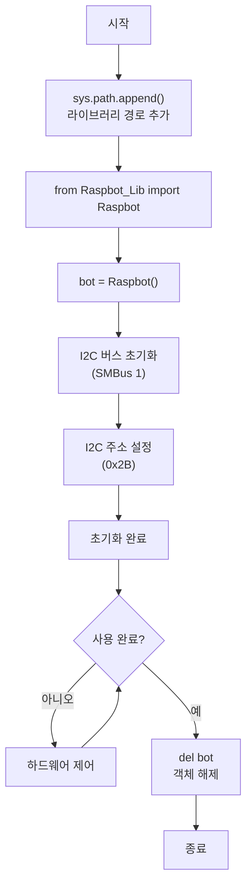

---

## 🚗 모터 제어 변경

### 모터 배치도

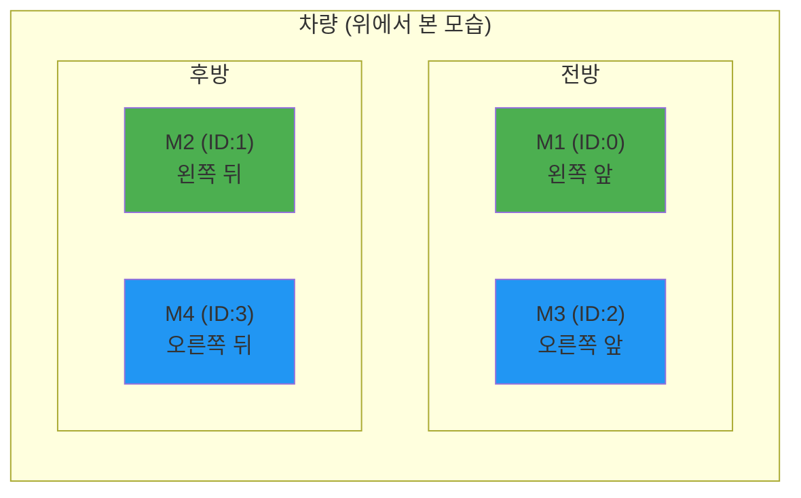

### 모터 제어 파라미터 비교

| 동작 | 구 버전 | 신 버전 | 비고 |
|------|--------|---------|------|
| 전진 최대 | `Car_Run(255, 255)` | `Ctrl_Muto(0, 255)` | 4개 모터 각각 호출 |
| 후진 최대 | `Car_Back(255, 255)` | `Ctrl_Muto(0, -255)` | 음수로 후진 |
| 정지 | `Car_Stop()` | `Ctrl_Muto(0, 0)` | 4개 모터 각각 0 |
| 좌회전 | `Car_Left(50, 100)` | 왼쪽 모터 음수, 오른쪽 양수 | 탱크 회전 |
| 우회전 | `Car_Right(100, 50)` | 왼쪽 모터 양수, 오른쪽 음수 | 탱크 회전 |

### 이동 방향별 모터 속도

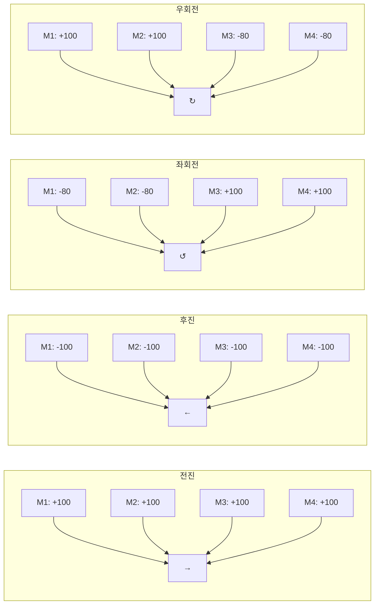

### 신 버전 모터 제어 코드

```python
# ============================================
# 차량 제어 함수 (Raspbot_Lib 기반)
# ============================================

def car_run(speed_left, speed_right):
    """
    직진
    
    Args:
        speed_left: 왼쪽 모터 속도 (-255 ~ 255)
        speed_right: 오른쪽 모터 속도 (-255 ~ 255)
    """
    bot.Ctrl_Muto(0, speed_left)   # M1 (왼쪽 앞)
    bot.Ctrl_Muto(1, speed_left)   # M2 (왼쪽 뒤)
    bot.Ctrl_Muto(2, speed_right)  # M3 (오른쪽 앞)
    bot.Ctrl_Muto(3, speed_right)  # M4 (오른쪽 뒤)


def car_back(speed_left, speed_right):
    """
    후진 (음수 속도 사용)
    """
    bot.Ctrl_Muto(0, -speed_left)
    bot.Ctrl_Muto(1, -speed_left)
    bot.Ctrl_Muto(2, -speed_right)
    bot.Ctrl_Muto(3, -speed_right)


def car_left(speed_left, speed_right):
    """
    좌회전 (왼쪽 후진, 오른쪽 전진)
    """
    bot.Ctrl_Muto(0, -speed_left)
    bot.Ctrl_Muto(1, -speed_left)
    bot.Ctrl_Muto(2, speed_right)
    bot.Ctrl_Muto(3, speed_right)


def car_right(speed_left, speed_right):
    """
    우회전 (왼쪽 전진, 오른쪽 후진)
    """
    bot.Ctrl_Muto(0, speed_left)
    bot.Ctrl_Muto(1, speed_left)
    bot.Ctrl_Muto(2, -speed_right)
    bot.Ctrl_Muto(3, -speed_right)


def car_stop():
    """
    정지 (모든 모터 0)
    """
    for i in range(4):
        bot.Ctrl_Muto(i, 0)


# 사용 예시
car_run(100, 100)    # 전진
car_left(50, 100)    # 좌회전
car_right(100, 50)   # 우회전
car_stop()           # 정지
```

---

## 🎮 서보 모터 변경

### 서보 모터 구조

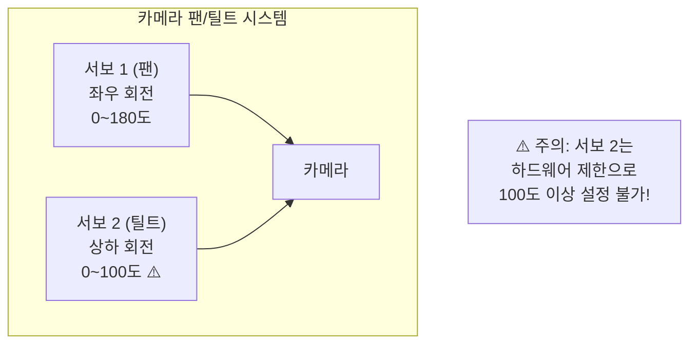

### 서보 제어 코드

```python
# ============================================
# 서보 제어 함수 (Raspbot_Lib 기반)
# ============================================

def set_servo(servo_id, angle):
    """
    서보 각도 설정
    
    Args:
        servo_id: 서보 번호 (1 또는 2)
        angle: 각도
            - 서보 1: 0 ~ 180도
            - 서보 2: 0 ~ 100도 (⚠️ 최대 100도!)
    """
    # 서보 2 안전 검사
    if servo_id == 2 and angle > 100:
        print(f"⚠️ 경고: 서보 2 최대 각도는 100도입니다. 100도로 설정합니다.")
        angle = 100
    
    bot.Ctrl_Servo(servo_id, angle)


def set_servo_1(angle):
    """서보 1 제어 (좌우 팬, 0~180도)"""
    angle = max(0, min(180, angle))
    bot.Ctrl_Servo(1, angle)


def set_servo_2(angle):
    """서보 2 제어 (상하 틸트, 0~100도)"""
    angle = max(0, min(100, angle))  # ⚠️ 최대 100도!
    bot.Ctrl_Servo(2, angle)


def reset_servos():
    """서보 기본 위치로 리셋"""
    bot.Ctrl_Servo(1, 90)   # 중앙
    bot.Ctrl_Servo(2, 25)   # 기본 틸트
    print("서보 리셋: Servo 1=90°, Servo 2=25°")


# 사용 예시
set_servo_1(90)      # 서보 1 중앙
set_servo_2(25)      # 서보 2 기본 위치
reset_servos()       # 모든 서보 리셋
```

### 서보 파라미터 비교표

| 서보 | 파라미터 | 구 버전 | 신 버전 | 비고 |
|------|----------|--------|---------|------|
| 서보 1 | 각도 범위 | 0~180° | 0~180° | 변경 없음 |
| 서보 1 | 기본값 | 90° | 90° | 중앙 |
| 서보 2 | 각도 범위 | 0~180° | **0~100°** ⚠️ | 하드웨어 제한! |
| 서보 2 | 기본값 | 119° | **25°** | 변경됨 |

---

## 🎨 LED 제어

### LED 배치도

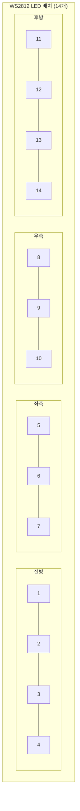

### LED 제어 코드

```python
# ============================================
# LED 제어 함수 (Raspbot_Lib 기반)
# ============================================

# 색상 상수 정의
LED_RED = 0
LED_GREEN = 1
LED_BLUE = 2
LED_YELLOW = 3
LED_PURPLE = 4
LED_CYAN = 5
LED_WHITE = 6


def set_led_color(color_id):
    """
    전체 LED 색상 설정
    
    Args:
        color_id: 색상 코드 (0~6)
            0=빨강, 1=초록, 2=파랑, 3=노랑,
            4=보라, 5=청록, 6=흰색
    """
    if not 0 <= color_id <= 6:
        print(f"⚠️ 잘못된 색상 코드: {color_id}. 0~6 사이여야 합니다.")
        return
    bot.Ctrl_WQ2812_ALL(1, color_id)


def set_led_off():
    """전체 LED 끄기"""
    bot.Ctrl_WQ2812_ALL(0, 0)


def set_led_rgb(r, g, b):
    """
    전체 LED RGB 값 설정
    
    Args:
        r, g, b: RGB 값 (0~255)
    """
    r = max(0, min(255, r))
    g = max(0, min(255, g))
    b = max(0, min(255, b))
    bot.Ctrl_WQ2812_brightness_ALL(r, g, b)


def set_led_alone(number, color_id):
    """
    개별 LED 색상 설정
    
    Args:
        number: LED 번호 (1~14)
        color_id: 색상 코드 (0~6)
    """
    if not 1 <= number <= 14:
        print(f"⚠️ 잘못된 LED 번호: {number}. 1~14 사이여야 합니다.")
        return
    bot.Ctrl_WQ2812_Alone(number, 1, color_id)


def set_led_alone_off(number):
    """개별 LED 끄기"""
    bot.Ctrl_WQ2812_Alone(number, 0, 0)


# 사용 예시
set_led_color(LED_RED)       # 전체 빨간색
set_led_color(LED_GREEN)     # 전체 초록색
set_led_rgb(255, 128, 0)     # 전체 주황색 (RGB)
set_led_alone(1, LED_BLUE)   # 1번 LED 파란색
set_led_off()                # 전체 끄기
```

### LightShow 효과 사용

```python
from Raspbot_Lib import Raspbot, LightShow

bot = Raspbot()
lights = LightShow()

# 효과 실행: execute_effect(효과명, 지속시간, 속도, 색상)
lights.execute_effect('breathing', 5, 0.01, LED_RED)    # 호흡 효과 (빨강)
lights.execute_effect('gradient', 5, 0.02, 0)           # 그라데이션 효과
lights.execute_effect('river', 5, 0.01, 0)              # 흐르는 물 효과
lights.execute_effect('random_running', 5, 0.1, 0)      # 랜덤 러닝 효과
lights.execute_effect('starlight', 5, 0.1, 0)           # 별빛 반짝임 효과

# 효과 중단
lights.turn_off_all_lights()
```

### LightShow 효과 파라미터

| 효과명 | 설명 | 권장 속도 | 색상 파라미터 |
|--------|------|----------|--------------|
| `breathing` | 호흡 효과 (점점 밝아졌다 어두워짐) | 0.01 | 0~6 (색상 선택) |
| `gradient` | 랜덤 색상 그라데이션 | 0.02 | 미사용 |
| `river` | 흐르는 물처럼 이동 | 0.01 | 미사용 (자동 순환) |
| `random_running` | 랜덤 색상 러닝 | 0.1 | 미사용 |
| `starlight` | 별빛 반짝임 | 0.1 | 미사용 (자동 순환) |

---

## 🔊 부저 제어

### 부저 제어 흐름

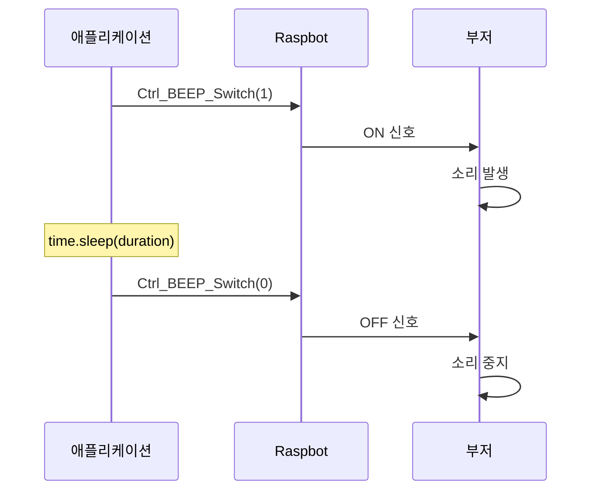

### 부저 제어 코드

```python
# ============================================
# 부저 제어 함수 (Raspbot_Lib 기반)
# ============================================

def buzzer_on():
    """부저 켜기"""
    bot.Ctrl_BEEP_Switch(1)


def buzzer_off():
    """부저 끄기"""
    bot.Ctrl_BEEP_Switch(0)


def buzzer_beep(duration=0.5):
    """
    지정된 시간 동안 부저 울리기
    
    Args:
        duration: 울릴 시간 (초, 기본값: 0.5)
    """
    bot.Ctrl_BEEP_Switch(1)
    time.sleep(duration)
    bot.Ctrl_BEEP_Switch(0)


def buzzer_pattern(pattern):
    """
    패턴에 따라 부저 울리기
    
    Args:
        pattern: (켜기 시간, 끄기 시간) 튜플 리스트
    """
    for on_time, off_time in pattern:
        bot.Ctrl_BEEP_Switch(1)
        time.sleep(on_time)
        bot.Ctrl_BEEP_Switch(0)
        time.sleep(off_time)


# 사용 예시
buzzer_beep(0.5)                           # 0.5초 비프
buzzer_pattern([(0.1, 0.1), (0.1, 0.1)])   # 빠른 2회 비프
buzzer_pattern([(0.5, 0.2), (0.5, 0.2)])   # 느린 2회 비프
```

---

## 📡 센서 제어

### 센서 데이터 읽기 흐름

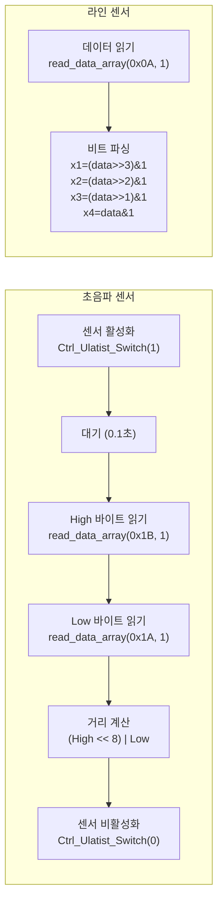

### 초음파 센서 제어 코드

```python
# ============================================
# 초음파 센서 함수 (Raspbot_Lib 기반)
# ============================================

def init_ultrasonic_sensor():
    """초음파 센서 초기화 및 활성화"""
    bot.Ctrl_Ulatist_Switch(1)
    time.sleep(0.1)  # 센서 안정화 대기


def read_ultrasonic_distance():
    """
    초음파 센서로 거리 측정
    
    Returns:
        int: 거리 (mm), 실패 시 -1
    """
    try:
        diss_H = bot.read_data_array(0x1B, 1)[0]  # High 바이트
        diss_L = bot.read_data_array(0x1A, 1)[0]  # Low 바이트
        distance = (diss_H << 8) | diss_L         # 16비트 조합
        return distance
    except Exception as e:
        print(f"거리 읽기 오류: {e}")
        return -1


def cleanup_ultrasonic_sensor():
    """초음파 센서 비활성화"""
    bot.Ctrl_Ulatist_Switch(0)


# 사용 예시
init_ultrasonic_sensor()
distance = read_ultrasonic_distance()
print(f"거리: {distance} mm")
cleanup_ultrasonic_sensor()
```

### 라인 트래킹 센서 제어 코드

```python
# ============================================
# 라인 트래킹 센서 함수 (Raspbot_Lib 기반)
# ============================================

def read_line_tracker_sensor():
    """
    라인 트래킹 센서 원시 데이터 읽기
    
    Returns:
        int: 센서 원시 데이터, 실패 시 -1
    """
    try:
        track_data = bot.read_data_array(0x0A, 1)
        return int(track_data[0])
    except Exception as e:
        print(f"라인 센서 읽기 오류: {e}")
        return -1


def parse_line_tracker_status(track_data):
    """
    라인 센서 데이터를 4개 센서 상태로 파싱
    
    Args:
        track_data: 원시 데이터 (8비트)
    
    Returns:
        tuple: (x1, x2, x3, x4) 각 센서 상태 (0=검출, 1=미검출)
    """
    if track_data < 0:
        return (0, 0, 0, 0)
    
    x1 = (track_data >> 3) & 0x01  # 비트 3
    x2 = (track_data >> 2) & 0x01  # 비트 2
    x3 = (track_data >> 1) & 0x01  # 비트 1
    x4 = track_data & 0x01         # 비트 0
    
    return (x1, x2, x3, x4)


# 사용 예시
track_data = read_line_tracker_sensor()
x1, x2, x3, x4 = parse_line_tracker_status(track_data)
print(f"라인 센서: x1={x1}, x2={x2}, x3={x3}, x4={x4}")
```

### 라인 센서 비트 매핑

| 비트 | 센서 | 위치 | 값=0 | 값=1 |
|------|------|------|------|------|
| Bit 3 | x1 | 왼쪽 바깥 | 라인 감지 | 라인 없음 |
| Bit 2 | x2 | 왼쪽 안쪽 | 라인 감지 | 라인 없음 |
| Bit 1 | x3 | 오른쪽 안쪽 | 라인 감지 | 라인 없음 |
| Bit 0 | x4 | 오른쪽 바깥 | 라인 감지 | 라인 없음 |

### IR 리모컨 제어 코드

```python
# ============================================
# IR 리모컨 함수 (Raspbot_Lib 기반)
# ============================================

def init_ir_receiver():
    """IR 수신기 활성화"""
    bot.Ctrl_IR_Switch(1)
    time.sleep(0.1)


def read_ir_data():
    """
    IR 리모컨 데이터 읽기
    
    Returns:
        int: IR 데이터 값, 실패 시 -1
    """
    try:
        ir_data = bot.read_data_array(0x0C, 1)
        return ir_data[0] if ir_data else -1
    except Exception as e:
        print(f"IR 데이터 읽기 오류: {e}")
        return -1


def cleanup_ir_receiver():
    """IR 수신기 비활성화"""
    bot.Ctrl_IR_Switch(0)


# 사용 예시
init_ir_receiver()
ir_value = read_ir_data()
print(f"IR 값: {ir_value}")
cleanup_ir_receiver()
```

---

## 📷 카메라 제어

### 카메라 시스템 아키텍처

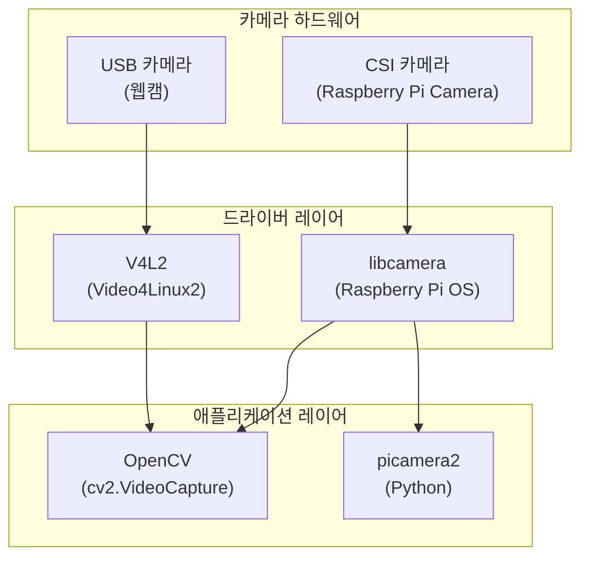

### 카메라 타입 비교

| 항목 | CSI 카메라 (Raspberry Pi Camera) | USB 카메라 (웹캠) |
|------|----------------------------------|-------------------|
| **연결 방식** | CSI 리본 케이블 | USB 포트 |
| **장치 경로** | `/dev/video0` (libcamera 활성화 시) | `/dev/video0` 또는 `/dev/video1` |
| **드라이버** | libcamera | V4L2 |
| **OpenCV 인덱스** | 0 (일반적) | 0 또는 1 |
| **성능** | 높음 (GPU 가속) | 중간 |
| **지연 시간** | 낮음 (~50ms) | 중간 (~100ms) |
| **해상도** | 최대 3280x2464 (Camera V2) | 카메라에 따라 다름 |
| **자율주행 적합도** | ⭐⭐⭐⭐⭐ | ⭐⭐⭐ |

### 카메라 처리 흐름

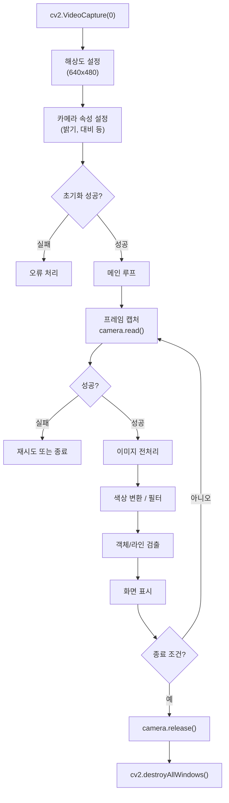

### 이미지 처리 파이프라인

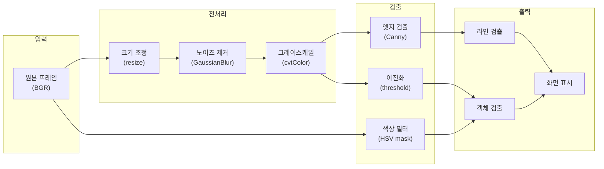

### Raspberry Pi 카메라 설정 (raspi-config)

```bash
# 1. raspi-config 실행
sudo raspi-config

# 2. Interface Options → Legacy Camera 비활성화 (libcamera 사용 시)
# 3. Interface Options → Camera → Enable

# 4. config.txt 편집 (필요시)
sudo nano /boot/config.txt

# 다음 줄 추가 또는 확인
camera_auto_detect=1
# 또는 특정 카메라 사용 시
# dtoverlay=imx219  # Camera V2
# dtoverlay=imx477  # HQ Camera

# 5. 재부팅
sudo reboot

# 6. 카메라 테스트
libcamera-hello --list-cameras
libcamera-still -o test.jpg
```

### 카메라 장치 확인

```bash
# 연결된 카메라 장치 확인
ls -la /dev/video*

# V4L2 정보 확인
v4l2-ctl --list-devices

# 카메라 지원 해상도 확인
v4l2-ctl --list-formats-ext -d /dev/video0

# libcamera 카메라 확인
libcamera-hello --list-cameras
```

### 카메라 파라미터 상세표

| 파라미터 | OpenCV 상수 | 범위 | 기본값 | 단위 | 설명 |
|----------|-------------|------|--------|------|------|
| 너비 | `CAP_PROP_FRAME_WIDTH` | 160~3280 | 640 | px | 이미지 너비 |
| 높이 | `CAP_PROP_FRAME_HEIGHT` | 120~2464 | 480 | px | 이미지 높이 |
| FPS | `CAP_PROP_FPS` | 1~120 | 30 | fps | 프레임 레이트 |
| 밝기 | `CAP_PROP_BRIGHTNESS` | -64~64 | 0 | - | 밝기 조정 |
| 대비 | `CAP_PROP_CONTRAST` | 0~100 | 32 | - | 대비 조정 |
| 채도 | `CAP_PROP_SATURATION` | 0~100 | 64 | - | 색상 포화도 |
| 색조 | `CAP_PROP_HUE` | -180~180 | 0 | deg | 색상 톤 |
| 게인 | `CAP_PROP_GAIN` | 0~100 | 자동 | - | ISO 감도 |
| 노출 | `CAP_PROP_EXPOSURE` | 1~5000 | 156 | - | 노출 시간 |
| 자동노출 | `CAP_PROP_AUTO_EXPOSURE` | 1/3 | 3 | - | 1=수동, 3=자동 |
| 화이트밸런스 | `CAP_PROP_WB_TEMPERATURE` | 2000~8000 | 자동 | K | 색온도 |
| 버퍼크기 | `CAP_PROP_BUFFERSIZE` | 1~10 | 4 | frames | 지연 시간 영향 |
| 코덱 | `CAP_PROP_FOURCC` | - | YUYV | - | MJPG 권장 |

### 해상도별 성능 비교 (Raspberry Pi 4)

| 해상도 | 픽셀 수 | 예상 FPS | 처리 시간 | 메모리 | 자율주행 적합도 |
|--------|---------|----------|-----------|--------|----------------|
| 320x240 | 76,800 | 60+ FPS | ~16ms | ~230KB | ⭐⭐⭐ (빠름, 낮은 정확도) |
| 640x480 | 307,200 | 30~40 FPS | ~25ms | ~920KB | ⭐⭐⭐⭐⭐ (권장) |
| 800x600 | 480,000 | 25~30 FPS | ~33ms | ~1.4MB | ⭐⭐⭐⭐ |
| 1280x720 | 921,600 | 15~20 FPS | ~50ms | ~2.8MB | ⭐⭐⭐ (정밀 작업) |
| 1920x1080 | 2,073,600 | 10~15 FPS | ~70ms | ~6.2MB | ⭐⭐ (사진/영상) |

### 자율주행 최적 카메라 설정

```python
# ============================================
# 자율주행 최적 카메라 설정
# ============================================

def setup_camera_for_self_driving(camera_index=0):
    """
    자율주행에 최적화된 카메라 설정
    
    권장 설정:
    - 해상도: 640x480 (처리 속도와 정확도 균형)
    - FPS: 30 (실시간 처리)
    - 버퍼: 1 (지연 시간 최소화)
    - 코덱: MJPG (빠른 디코딩)
    - 대비: 높음 (라인 검출용)
    - 채도: 낮음 (색상 노이즈 감소)
    """
    camera = cv2.VideoCapture(camera_index)
    
    if not camera.isOpened():
        print("❌ 카메라 열기 실패")
        return None
    
    # 기본 설정
    camera.set(cv2.CAP_PROP_FRAME_WIDTH, 640)
    camera.set(cv2.CAP_PROP_FRAME_HEIGHT, 480)
    camera.set(cv2.CAP_PROP_FPS, 30)
    
    # 성능 최적화 설정
    camera.set(cv2.CAP_PROP_BUFFERSIZE, 1)  # 버퍼 최소화 (지연 감소)
    camera.set(cv2.CAP_PROP_FOURCC, cv2.VideoWriter.fourcc('M', 'J', 'P', 'G'))
    
    # 이미지 품질 설정
    camera.set(cv2.CAP_PROP_BRIGHTNESS, 0)    # 기본 밝기
    camera.set(cv2.CAP_PROP_CONTRAST, 50)     # 높은 대비 (라인 강조)
    camera.set(cv2.CAP_PROP_SATURATION, 40)   # 낮은 채도 (노이즈 감소)
    
    # 자동 노출 사용
    camera.set(cv2.CAP_PROP_AUTO_EXPOSURE, 3)
    
    print("✅ 자율주행용 카메라 설정 완료")
    print(f"   해상도: {int(camera.get(cv2.CAP_PROP_FRAME_WIDTH))}x{int(camera.get(cv2.CAP_PROP_FRAME_HEIGHT))}")
    print(f"   FPS: {camera.get(cv2.CAP_PROP_FPS)}")
    print(f"   백엔드: {camera.getBackendName()}")
    
    return camera
```

### 카메라 트러블슈팅

| 문제 | 원인 | 해결 방법 |
|------|------|----------|
| 카메라 열기 실패 | 장치 인덱스 오류 | `ls /dev/video*`로 확인 후 인덱스 변경 |
| 카메라 열기 실패 | 권한 문제 | `sudo usermod -a -G video $USER` 실행 후 재로그인 |
| 카메라 열기 실패 | 다른 프로세스 사용 중 | `sudo fuser /dev/video0` 확인 후 종료 |
| 검은 화면 | libcamera 비활성화 | `sudo raspi-config`에서 카메라 활성화 |
| 낮은 FPS | 해상도 너무 높음 | 해상도를 640x480으로 낮춤 |
| 낮은 FPS | USB 2.0 포트 사용 | USB 3.0 포트 사용 (파란색) |
| 높은 지연 | 버퍼 크기 큼 | `CAP_PROP_BUFFERSIZE`를 1로 설정 |
| 색상 왜곡 | 화이트밸런스 오류 | 수동 화이트밸런스 설정 또는 자동 |
| 노이즈 많음 | 저조도 | 조명 추가 또는 노출/게인 조정 |
| 초점 안맞음 | 수동 초점 카메라 | 렌즈 수동 조정 |

### 카메라 진단 스크립트

```python
# ============================================
# 카메라 진단 스크립트
# ============================================

def diagnose_camera(camera_index=0):
    """
    카메라 상태 진단 및 정보 출력
    """
    import subprocess
    
    print("="*60)
    print("📷 카메라 진단 시작")
    print("="*60)
    
    # 1. 장치 파일 확인
    print("\n1. 장치 파일 확인:")
    try:
        result = subprocess.run(['ls', '-la', '/dev/video*'], 
                               capture_output=True, text=True, shell=True)
        print(result.stdout if result.stdout else "   장치 없음")
    except:
        print("   확인 실패")
    
    # 2. V4L2 장치 목록
    print("\n2. V4L2 장치 목록:")
    try:
        result = subprocess.run(['v4l2-ctl', '--list-devices'], 
                               capture_output=True, text=True)
        print(result.stdout if result.stdout else "   v4l2-ctl 설치 필요")
    except:
        print("   v4l2-ctl 명령 실행 실패")
    
    # 3. OpenCV로 카메라 테스트
    print(f"\n3. OpenCV 카메라 테스트 (인덱스: {camera_index}):")
    
    camera = cv2.VideoCapture(camera_index)
    
    if not camera.isOpened():
        print("   ❌ 카메라 열기 실패")
        
        # 다른 인덱스 시도
        for idx in range(5):
            if idx != camera_index:
                test_cam = cv2.VideoCapture(idx)
                if test_cam.isOpened():
                    print(f"   💡 인덱스 {idx}에서 카메라 발견")
                    test_cam.release()
        return False
    
    print("   ✅ 카메라 열기 성공")
    
    # 4. 카메라 속성 출력
    print(f"\n4. 카메라 속성:")
    properties = [
        ('FRAME_WIDTH', cv2.CAP_PROP_FRAME_WIDTH),
        ('FRAME_HEIGHT', cv2.CAP_PROP_FRAME_HEIGHT),
        ('FPS', cv2.CAP_PROP_FPS),
        ('BRIGHTNESS', cv2.CAP_PROP_BRIGHTNESS),
        ('CONTRAST', cv2.CAP_PROP_CONTRAST),
        ('SATURATION', cv2.CAP_PROP_SATURATION),
        ('EXPOSURE', cv2.CAP_PROP_EXPOSURE),
        ('GAIN', cv2.CAP_PROP_GAIN),
        ('BACKEND', None),
    ]
    
    for name, prop in properties:
        if prop is None:
            value = camera.getBackendName()
        else:
            value = camera.get(prop)
        print(f"   {name}: {value}")
    
    # 5. 프레임 캡처 테스트
    print(f"\n5. 프레임 캡처 테스트:")
    success, frame = camera.read()
    
    if success:
        print(f"   ✅ 프레임 캡처 성공")
        print(f"   프레임 크기: {frame.shape}")
        print(f"   데이터 타입: {frame.dtype}")
    else:
        print("   ❌ 프레임 캡처 실패")
    
    # 6. FPS 측정
    print(f"\n6. FPS 측정 (30프레임):")
    start_time = time.time()
    frame_count = 0
    
    for _ in range(30):
        success, _ = camera.read()
        if success:
            frame_count += 1
    
    elapsed = time.time() - start_time
    measured_fps = frame_count / elapsed
    print(f"   측정 FPS: {measured_fps:.1f}")
    
    camera.release()
    
    print("\n" + "="*60)
    print("📷 카메라 진단 완료")
    print("="*60)
    
    return True


if __name__ == '__main__':
    diagnose_camera(0)
```

---

## 📝 전체 예제 비교

### ✅ 신 버전 (Raspbot_Lib)

```python
import cv2
import sys
import os
import time

# 라이브러리 경로 추가
sys.path.append(os.path.join(os.path.dirname(__file__), '..', 'lib', 'raspbot'))
from Raspbot_Lib import Raspbot

# 초기화
cap = cv2.VideoCapture(0)
bot = Raspbot()

# 서보 모터 설정
bot.Ctrl_Servo(1, 90)
bot.Ctrl_Servo(2, 25)  # ⚠️ 최대 100도

# LED 켜기 (시작 신호)
bot.Ctrl_WQ2812_ALL(1, 2)  # 파란색

# 부저 (시작 신호)
bot.Ctrl_BEEP_Switch(1)
time.sleep(0.2)
bot.Ctrl_BEEP_Switch(0)

try:
    while True:
        ret, frame = cap.read()
        
        # 전진 (LED: 초록색)
        bot.Ctrl_Muto(0, 100)
        bot.Ctrl_Muto(1, 100)
        bot.Ctrl_Muto(2, 100)
        bot.Ctrl_Muto(3, 100)
        bot.Ctrl_WQ2812_ALL(1, 1)  # 초록색
        time.sleep(1)
        
        # 좌회전 (LED: 노란색)
        bot.Ctrl_Muto(0, -50)
        bot.Ctrl_Muto(1, -50)
        bot.Ctrl_Muto(2, 100)
        bot.Ctrl_Muto(3, 100)
        bot.Ctrl_WQ2812_ALL(1, 3)  # 노란색
        time.sleep(1)
        
        # 정지
        for i in range(4):
            bot.Ctrl_Muto(i, 0)
        
except KeyboardInterrupt:
    pass

finally:
    # 정지
    for i in range(4):
        bot.Ctrl_Muto(i, 0)
    
    # LED 끄기
    bot.Ctrl_WQ2812_ALL(0, 0)
    
    # 부저 끄기
    bot.Ctrl_BEEP_Switch(0)
    
    # 카메라 해제
    cap.release()
    cv2.destroyAllWindows()
    
    # 객체 삭제 (중요!)
    del bot
```

---

## ✅ 체크리스트

기존 코드를 신 버전으로 전환할 때 확인할 사항:

### 필수 변경

- [ ] `import YB_Pcb_Car` → `from Raspbot_Lib import Raspbot`
- [ ] 라이브러리 경로 `sys.path.append()` 추가
- [ ] `car = YB_Pcb_Car.YB_Pcb_Car()` → `bot = Raspbot()`
- [ ] `car.Car_Run()` → `bot.Ctrl_Muto()` (4개 모터 각각)
- [ ] `car.Car_Stop()` → 4개 모터 각각 0으로
- [ ] **서보 2 각도 100도 이하로 제한** ⚠️
- [ ] 모터 속도 음수 사용 (후진)
- [ ] 종료 시 `del bot` 추가

### 선택 변경

- [ ] LED 효과 추가 (`Ctrl_WQ2812_ALL`, `Ctrl_WQ2812_brightness_ALL`)
- [ ] 부저 효과 추가 (`Ctrl_BEEP_Switch`)
- [ ] 센서 읽기 기능 추가 (`read_data_array`)
- [ ] 에러 처리 강화

---

## 🔧 자주 묻는 질문

### Q1: 왜 전환해야 하나요?
**A:** 신 버전은 더 많은 기능(LED, 부저, 센서)과 더 유연한 모터 제어를 제공합니다.

### Q2: 기존 코드가 작동 안 하나요?
**A:** `YB_Pcb_Car`는 여전히 작동하지만, 새로운 하드웨어 기능을 사용할 수 없습니다.

### Q3: 모든 파일을 수정해야 하나요?
**A:** 아니요. 새 프로젝트나 중요한 파일만 우선 전환하세요.

### Q4: 서보 2가 100도까지만 되는 이유는?
**A:** 하드웨어 제한사항입니다. `Raspbot_Lib.py` 99번째 줄에서 확인 가능합니다.

### Q5: 속도 범위가 달라진 이유는?
**A:** 음수로 후진을 표현하여 더 직관적입니다. `Ctrl_Muto(-100)` = 후진 100 속도

### Q6: `del bot`을 꼭 해야 하나요?
**A:** 네, I2C 버스 해제를 위해 프로그램 종료 시 반드시 호출하세요.

---

## 📚 참고 문서

- [QUICK_START.md](./QUICK_START.md) - 빠른 시작 가이드
- [SOURCE_CODE_GUIDE.md](./SOURCE_CODE_GUIDE.md) - 소스 코드 상세 가이드
- `02_Basic/` - 공식 예제 코드
- `lib/raspbot/Raspbot_Lib.py` - 라이브러리 소스

---

## 🎓 마이그레이션 예제

실제 파일 마이그레이션 예제:
- ❌ 구 버전: `03_self_driving/6_custom_autoplot_old.py`
- ✅ 신 버전: `03_self_driving/6_custom_autoplot.py`

두 파일을 비교하여 변경 사항을 확인하세요!

---

**업데이트 날짜**: 2025-12-08  
**버전**: v2.1 (Raspbot_Lib API 상세 추가)
