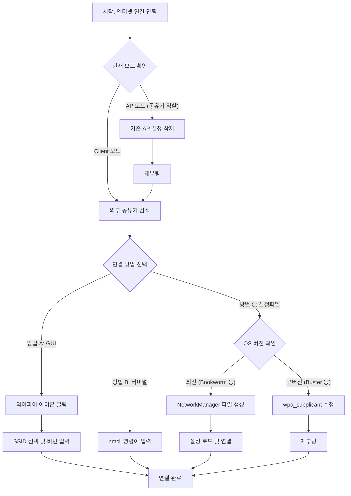

# 라즈베리 파이 와이파이 설정 가이드 (AP 모드 해제 및 외부 공유기 연결)

## 1. 설정 흐름도 (Flowchart)



---

## 2. 연결 방법 비교표

| 구분 | 방법 A: GUI 사용 (권장) | 방법 B: 터미널 (nmcli) | 방법 C: 설정 파일 (NetworkManager) | 방법 D: 구버전 (wpa_supplicant) |
| :--- | :--- | :--- | :--- | :--- |
| **난이도** | ⭐ (매우 쉬움) | ⭐⭐ (보통) | ⭐⭐⭐ (어려움) | ⭐⭐⭐ (어려움) |
| **추천 상황** | 모니터/마우스 연결 시 | 터미널/SSH 작업 시 | 대량 배포 / 자동화 필요 시 | 구형 OS 사용 시 |
| **특징** | 윈도우처럼 클릭으로 해결 | 한 줄 명령어로 깔끔함 | 파일로 설정 관리 가능 | 최신 OS에서 오동작 가능성 있음 |
| **비고** | 가장 직관적임 | 오타 주의 필요 | 권한(600) 설정 필수 | 레거시 방식 |

---

## 3. 단계별 상세 설정 가이드

### 1단계: 기존 핫스팟(AP) 설정 삭제하기

현재 라즈베리 파이가 공유기 역할(AP 모드)을 하고 있어 외부 와이파이를 잡지 못하는 상태입니다. 먼저 이 설정을 지워야 합니다.

> **⚠️ 주의:** 원격 접속 중이라면 설정 삭제 시 연결이 끊깁니다. 반드시 모니터/키보드를 연결하거나 유선 랜을 사용하세요.

1. **터미널 실행 및 명령어 입력**
   ```bash
   sudo rm /etc/NetworkManager/system-connections/Raspbot-9be2c8c5-d64b-42bf-9fbc-1decea417f7c.nmconnection
   ```
   *(팁: `sudo rm /etc/NetworkManager/system-connections/Raspbot*` 로 간략하게 입력 가능)*

2. **재부팅**
   ```bash
   sudo reboot
   ```

---

### 2단계: 외부 공유기 검색 및 연결

재부팅 후 AP 모드가 꺼지면 일반 와이파이 연결이 가능해집니다.

#### 방법 A: 바탕화면 UI에서 연결 (가장 쉬움)
1. 바탕화면 우측 상단 **와이파이 아이콘** 클릭
2. 연결하려는 **외부 와이파이 이름(SSID)** 선택
3. **비밀번호** 입력 후 연결 확인

#### 방법 B: 터미널 명령어로 연결 (nmcli)
UI 사용이 불가능한 경우 터미널에서 진행합니다.

1. **와이파이 목록 검색**
   ```bash
   nmcli device wifi list
   ```

2. **와이파이 연결 시도**
   ```bash
   sudo nmcli device wifi connect "와이파이이름" password "비밀번호"
   ```

---

### 3단계: 설정 파일을 통한 고급 설정 (필요시)

터미널 명령어가 잘 안 되거나, 설정 파일로 관리하고 싶은 경우 사용합니다.

#### 추천: NetworkManager 설정 파일 직접 생성 (최신 OS)

1. **파일 생성**
   ```bash
   sudo nano /etc/NetworkManager/system-connections/MyWifi.nmconnection
   ```

2. **내용 작성**
   ```ini
   [connection]
   id=MyWifi
   type=wifi
   interface-name=wlan0

   [wifi]
   mode=infrastructure
   ssid=연결할_와이파이_이름

   [wifi-security]
   key-mgmt=wpa-psk
   psk=와이파이_비밀번호

   [ipv4]
   method=auto
   
   [ipv6]
   method=auto
   ```

3. **권한 설정 및 적용 (필수)**
   ```bash
   sudo chmod 600 /etc/NetworkManager/system-connections/MyWifi.nmconnection
   sudo nmcli connection reload
   sudo nmcli connection up MyWifi
   ```

## 요약

1. **AP 모드 끄기**: 기존 설정 파일(`Raspbot...nmconnection`) 삭제 후 재부팅
2. **연결하기**: 바탕화면 아이콘 클릭 또는 `nmcli` 명령어 사용
3. **확인하기**: 인터넷 브라우저를 열어 접속 확인
