# YOLO v4 Tiny 쓰레기 인식 알고리즘 상세 가이드

## 📋 목차

1. [시스템 개요](#시스템-개요)
2. [전체 아키텍처](#전체-아키텍처)
3. [클래스 구조](#클래스-구조)
4. [알고리즘 상세 흐름도](#알고리즘-상세-흐름도)
5. [주요 처리 단계](#주요-처리-단계)
6. [데이터 흐름](#데이터-흐름)
7. [성능 최적화](#성능-최적화)

---

## 시스템 개요

### 목적
라즈베리파이 기반 임베디드 환경에서 실시간으로 쓰레기를 감지하고 분류하는 시스템

### 핵심 기술
- **YOLOv4-Tiny**: 경량화된 객체 감지 신경망
- **TensorFlow/Keras**: 딥러닝 프레임워크
- **OpenCV**: 영상 처리
- **PIL**: 이미지 처리 및 시각화

### 주요 기능
1. 실시간 쓰레기 객체 감지 및 분류
2. 바운딩 박스 및 신뢰도 점수 시각화
3. OLED 디스플레이 연동
4. 로봇 팔 제어를 위한 좌표 계산

---

## 전체 아키텍처

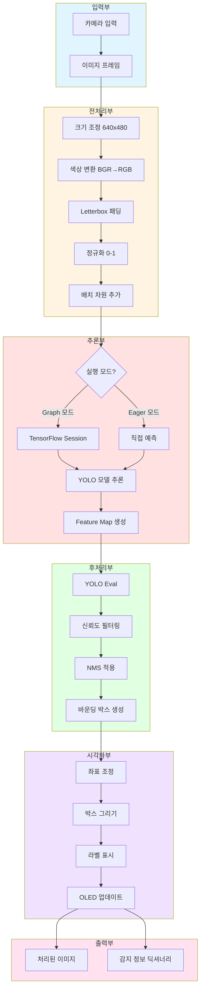

---

## 클래스 구조

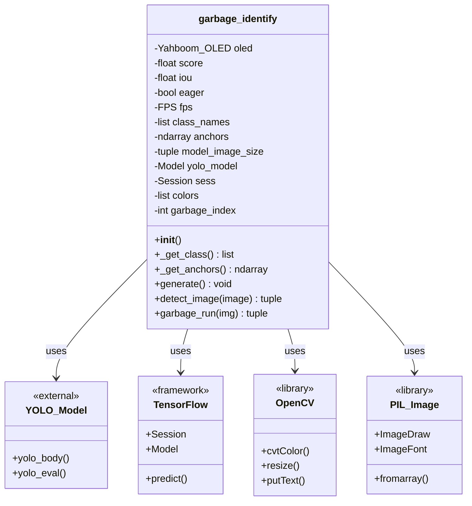

---

## 알고리즘 상세 흐름도

### 1. 초기화 프로세스

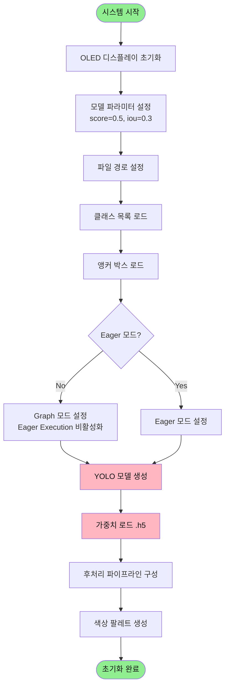

### 2. 메인 실행 루프 (garbage_run)

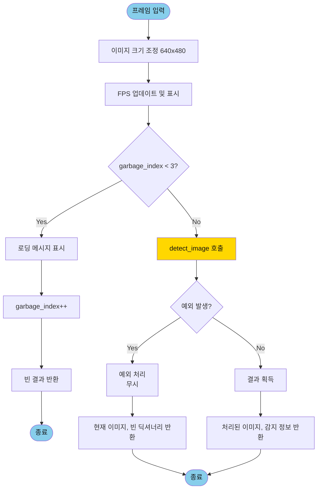

### 3. 객체 감지 프로세스 (detect_image)

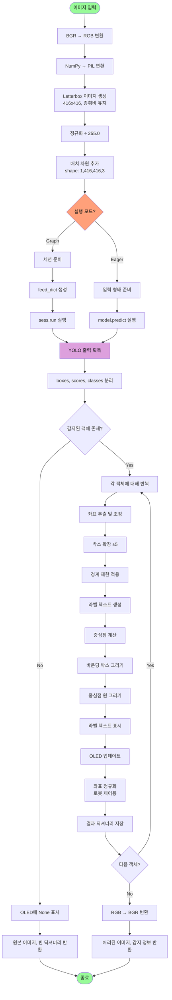

---

## 주요 처리 단계

### 1단계: 이미지 전처리

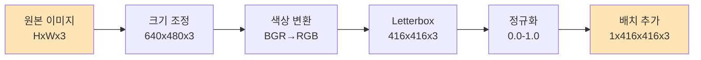

**Letterbox 패딩 원리:**

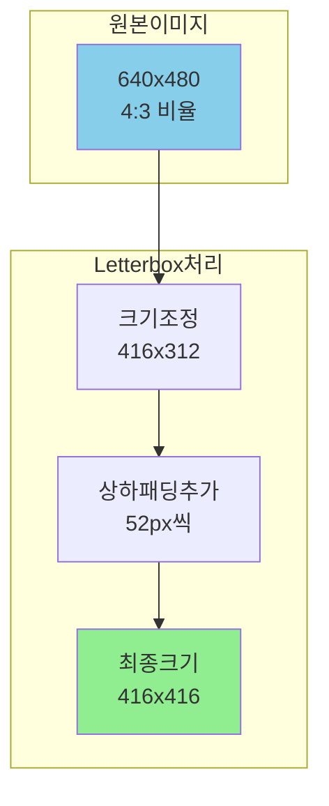

### 2단계: YOLO 추론

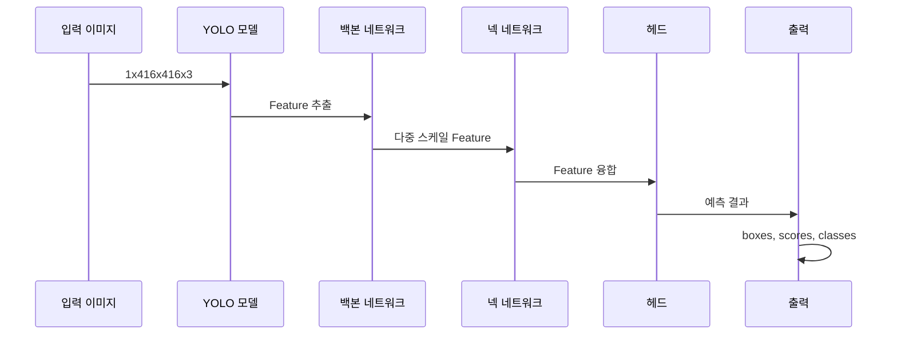

**YOLO 출력 구조:**

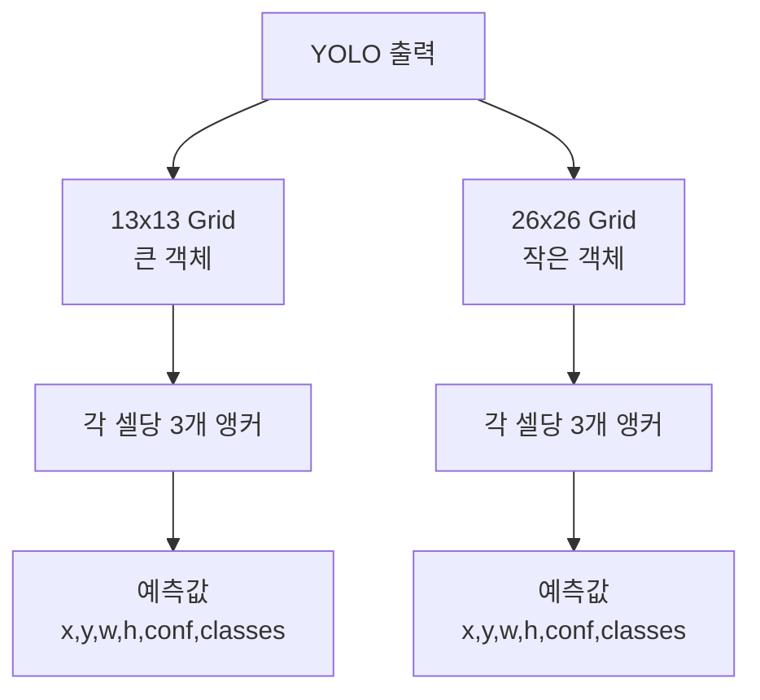

### 3단계: 후처리 (NMS)

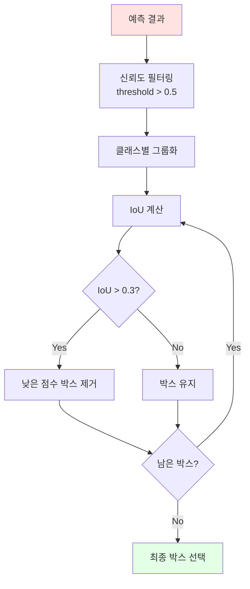

**NMS (Non-Maximum Suppression) 알고리즘:**

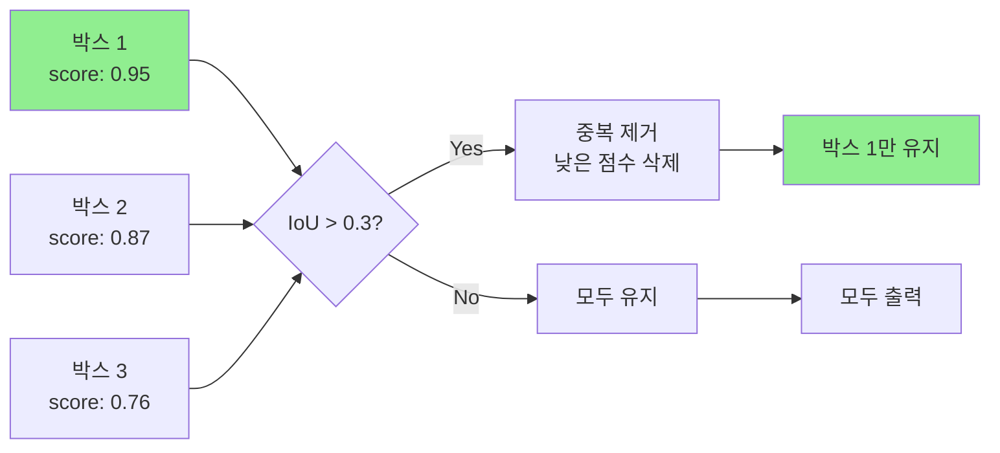

### 4단계: 시각화

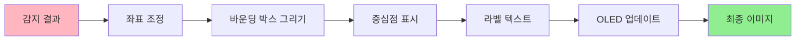

---

## 데이터 흐름

### 전체 데이터 파이프라인

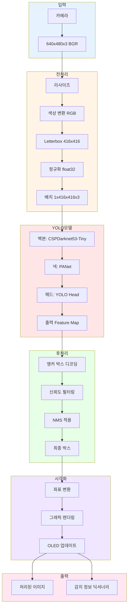

### 좌표 변환 흐름

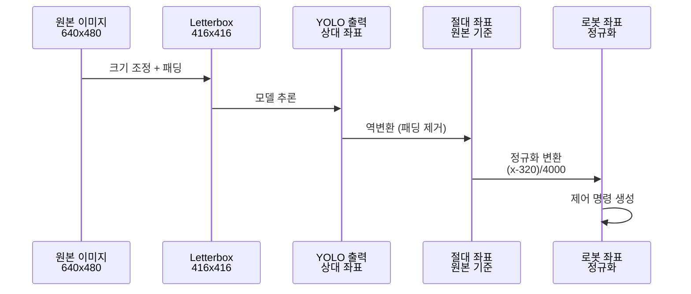

---

## 성능 최적화

### 최적화 전략

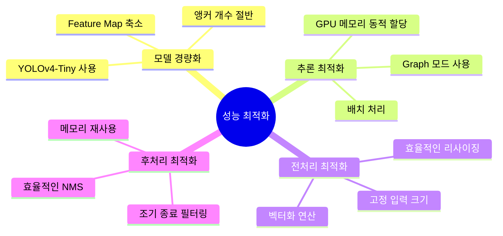

### 실행 모드 비교

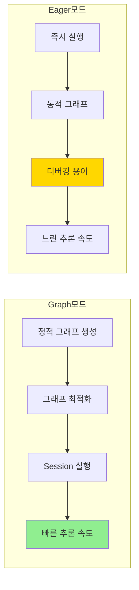

### FPS 향상 기법

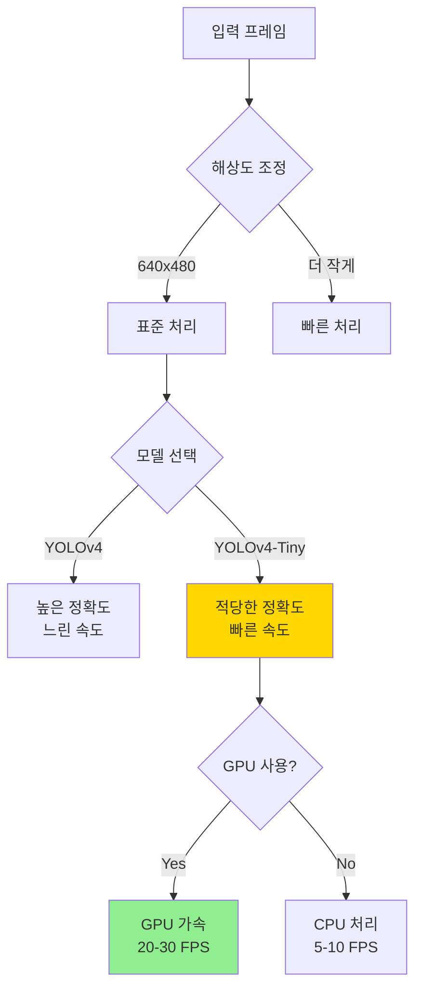

---

## 주요 알고리즘 상세

### 1. Letterbox 알고리즘

```python
"""
Letterbox 이미지 생성 알고리즘

목적: 종횡비를 유지하면서 이미지를 목표 크기로 조정

입력: 원본 이미지 (W, H), 목표 크기 (target_W, target_H)
출력: 패딩이 추가된 이미지 (target_W, target_H)

단계:
1. 종횡비 계산: ratio = min(target_W/W, target_H/H)
2. 새 크기 계산: new_W = W * ratio, new_H = H * ratio
3. 이미지 리사이즈
4. 패딩 계산: pad_W = (target_W - new_W) / 2, pad_H = (target_H - new_H) / 2
5. 회색 패딩 추가
"""
```

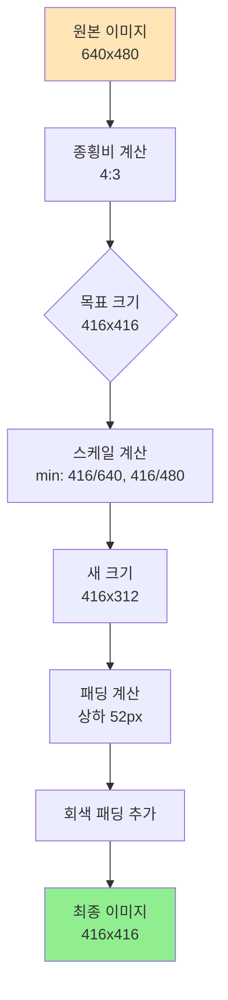

### 2. 좌표 정규화 알고리즘

```python
"""
로봇 제어를 위한 좌표 정규화

입력: 이미지 좌표 (x, y) - 픽셀 단위
출력: 정규화된 좌표 (a, b) - 로봇 좌표계

변환 공식:
a = (x - 320) / 4000  # 수평 위치, 중심 기준
b = ((480 - y) / 3000) * 0.8 + 0.19  # 수직 위치, Y축 반전

설명:
- x = 320: 이미지 중심 (640/2)
- y = 480: 이미지 하단에서 상단으로
- 스케일 팩터: 경험적으로 결정된 값
- 오프셋: 로봇 팔 작업 공간 보정
"""
```

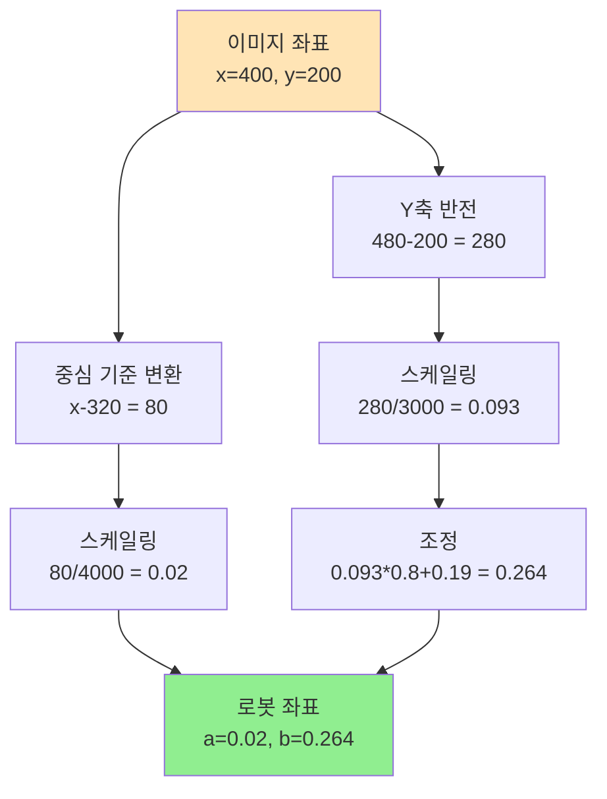

### 3. NMS 상세 알고리즘

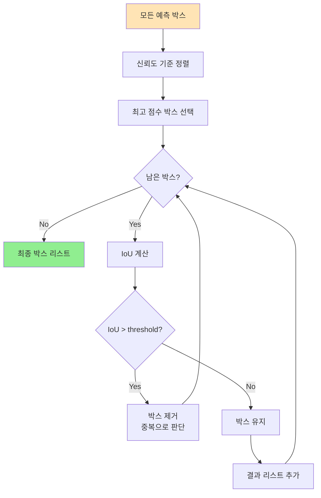

**IoU (Intersection over Union) 계산:**

```mermaid
graph LR
    A[박스 A] --> C[교집합 면적]
    B[박스 B] --> C
    A --> D[합집합 면적]
    B --> D
    C --> E[IoU = 교집합 / 합집합]
    D --> E
    E --> F{IoU > 0.3?}
    F -->|Yes| G[중복 박스]
    F -->|No| H[별개 박스]
    
    style G fill:#FFB6C1
    style H fill:#90EE90
```

---

## 시스템 상태 다이어그램

```mermaid
stateDiagram-v2
    [*] --> 초기화
    초기화 --> 모델로딩
    모델로딩 --> 대기중
    
    대기중 --> 프레임수신 : 카메라 입력
    프레임수신 --> 로딩중 : index < 3
    프레임수신 --> 전처리 : index >= 3
    
    로딩중 --> 대기중 : index++
    
    전처리 --> 추론
    추론 --> 후처리
    후처리 --> 시각화
    시각화 --> 결과반환
    
    결과반환 --> 대기중 : 다음 프레임
    
    추론 --> 에러처리 : 예외 발생
    에러처리 --> 대기중
    
    note right of 로딩중
        초기 3프레임 대기
        모델 워밍업
    end note
    
    note right of 추론
        YOLO 모델 실행
        GPU/CPU 선택
    end note
```

---

## 타이밍 다이어그램

```mermaid
sequenceDiagram
    autonumber
    participant Camera as 카메라
    participant Main as garbage_run
    participant Detect as detect_image
    participant Model as YOLO 모델
    participant Display as OLED
    
    Camera->>Main: 프레임 전달
    Main->>Main: 크기 조정
    Main->>Main: FPS 업데이트
    
    alt 초기 로딩 (index < 3)
        Main->>Main: 로딩 메시지 표시
        Main->>Main: index++
        Main-->>Camera: 빈 결과 반환
    else 정상 실행 (index >= 3)
        Main->>Detect: 프레임 전달
        Detect->>Detect: 전처리 (BGR→RGB)
        Detect->>Detect: Letterbox 패딩
        Detect->>Detect: 정규화
        Detect->>Model: 추론 요청
        Model->>Model: Feature 추출
        Model->>Model: 객체 감지
        Model-->>Detect: boxes, scores, classes
        Detect->>Detect: NMS 적용
        Detect->>Detect: 박스 그리기
        Detect->>Display: 감지 정보 전달
        Display->>Display: 화면 업데이트
        Detect-->>Main: 처리된 이미지, 딕셔너리
        Main-->>Camera: 결과 반환
    end
```

---

## 메모리 사용 패턴

```mermaid
graph TB
    subgraph 모델메모리
        A1[YOLO 가중치<br/>~20MB]
        A2[Feature Maps<br/>~10MB]
    end
    
    subgraph 프레임메모리
        B1[원본 프레임<br/>640x480x3 = 0.9MB]
        B2[전처리 프레임<br/>416x416x3 = 0.5MB]
        B3[출력 프레임<br/>640x480x3 = 0.9MB]
    end
    
    subgraph 추론메모리
        C1[중간 Feature<br/>~5MB]
        C2[예측 결과<br/>~1MB]
    end
    
    Total[총 메모리<br/>~40MB] --> A1
    Total --> A2
    Total --> B1
    Total --> B2
    Total --> B3
    Total --> C1
    Total --> C2
    
    style Total fill:#FFB6C1
```

---

## 에러 처리 흐름

```mermaid
flowchart TD
    A[시스템 실행] --> B{초기화 성공?}
    B -->|No| E1[모델 파일 확인]
    E1 --> E2[경로 수정 또는 재설치]
    E2 --> A
    
    B -->|Yes| C[프레임 수신]
    C --> D{전처리 성공?}
    D -->|No| E3[이미지 형식 확인]
    E3 --> C
    
    D -->|Yes| F{추론 성공?}
    F -->|No| E4[메모리 부족 확인]
    E4 --> E5[리소스 해제]
    E5 --> F
    
    F -->|Yes| G{후처리 성공?}
    G -->|No| E6[예외 로깅]
    E6 --> H[빈 결과 반환]
    
    G -->|Yes| I[정상 결과 반환]
    
    H --> C
    I --> C
    
    style A fill:#90EE90
    style I fill:#90EE90
    style E1 fill:#FFB6C1
    style E3 fill:#FFB6C1
    style E4 fill:#FFB6C1
    style E6 fill:#FFB6C1
```

---

## 핵심 수식

### 1. IoU (Intersection over Union)

$$IoU = \frac{Area(Box_A \cap Box_B)}{Area(Box_A \cup Box_B)}$$

### 2. 신뢰도 점수

$$Score = P(Object) \times IoU(pred, truth) \times P(Class|Object)$$

### 3. 좌표 정규화

$$a = \frac{x - center_x}{scale_x}$$

$$b = \frac{image_height - y}{scale_y} \times weight + offset$$

---

## 성능 메트릭

```mermaid
graph LR
    A[성능 지표] --> B[FPS<br/>초당 프레임 수]
    A --> C[정확도<br/>mAP]
    A --> D[추론 시간<br/>ms/frame]
    A --> E[메모리 사용량<br/>MB]
    
    B --> B1[목표: 15-20 FPS]
    C --> C1[목표: mAP > 0.8]
    D --> D1[목표: < 100ms]
    E --> E1[목표: < 100MB]
    
    style B1 fill:#90EE90
    style C1 fill:#90EE90
    style D1 fill:#90EE90
    style E1 fill:#90EE90
```

---

## 결론

이 시스템은 **YOLOv4-Tiny** 기반의 경량화된 객체 감지 알고리즘을 사용하여 라즈베리파이에서 실시간으로 쓰레기를 인식합니다.

### 주요 특징:
1. ✅ **효율적인 전처리**: Letterbox 패딩으로 왜곡 방지
2. ✅ **빠른 추론**: Graph 모드로 최적화된 성능
3. ✅ **정확한 후처리**: NMS로 중복 제거
4. ✅ **직관적인 시각화**: 바운딩 박스와 신뢰도 표시
5. ✅ **로봇 연동**: 정규화된 좌표로 제어 가능

### 적용 가능 분야:
- 🤖 자율 쓰레기 분류 로봇
- ♻️ 재활용 자동화 시스템
- 🏭 산업용 물체 분류 시스템
- 📚 교육용 AI 프로젝트

