# YOLO 기본 개념 및 구현 가이드

## 📚 목차

1. [YOLO란 무엇인가?](#yolo란-무엇인가)
2. [YOLO 핵심 원리](#yolo-핵심-원리)
3. [YOLO 방법론](#yolo-방법론)
4. [기본 YOLO 구현](#기본-yolo-구현)
5. [핵심 알고리즘](#핵심-알고리즘)
6. [실전 예제 코드](#실전-예제-코드)

---

## YOLO란 무엇인가?

### YOLO (You Only Look Once)

**YOLO**는 이미지를 단 한 번만 보고 객체를 감지하는 실시간 객체 검출 알고리즘입니다.

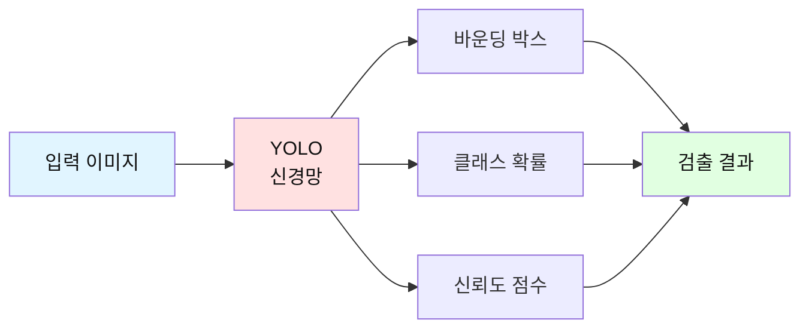

### 기존 방법과의 차이점

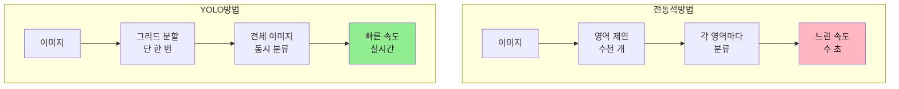

### YOLO의 장점

1. ⚡ **빠른 속도**: 실시간 처리 가능 (30+ FPS)
2. 🎯 **높은 정확도**: 최신 버전은 90%+ mAP
3. 🌍 **전역 이해**: 이미지 전체를 한 번에 봄
4. 💪 **일반화 능력**: 다양한 환경에서 잘 작동

---

## YOLO 핵심 원리

### 1. 이미지 그리드 분할

YOLO는 입력 이미지를 **S × S 그리드**로 나눕니다.

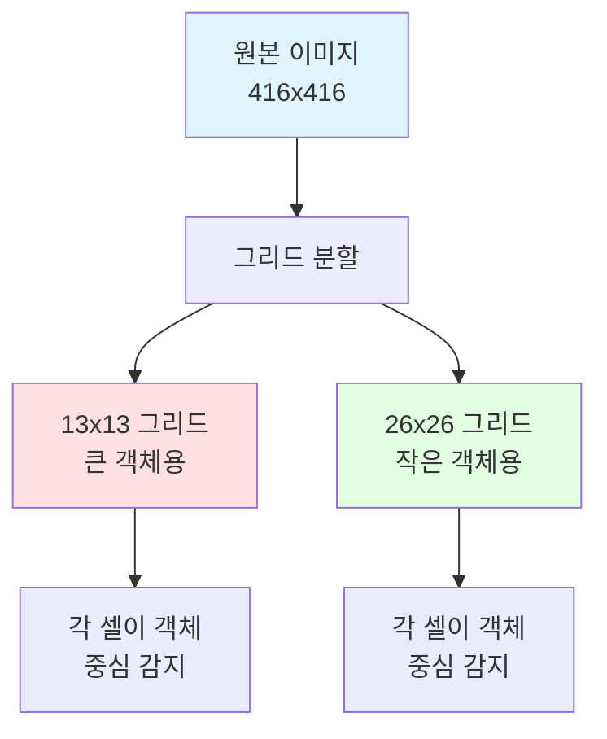

**예시: 13×13 그리드**

```
┌─────┬─────┬─────┬─────┬─────┐
│     │     │ 🐕  │     │     │  ← 개의 중심이 있는 셀이
│     │     │  *  │     │     │     객체 감지 책임
├─────┼─────┼─────┼─────┼─────┤
│     │     │     │     │     │
│     │     │     │ 🚗  │     │  ← 자동차 감지
├─────┼─────┼─────┼─────┼─────┤
│     │     │     │     │     │
│     │     │     │     │     │
└─────┴─────┴─────┴─────┴─────┘
```

### 2. 앵커 박스 (Anchor Boxes)

각 그리드 셀은 **여러 개의 앵커 박스**를 예측합니다.

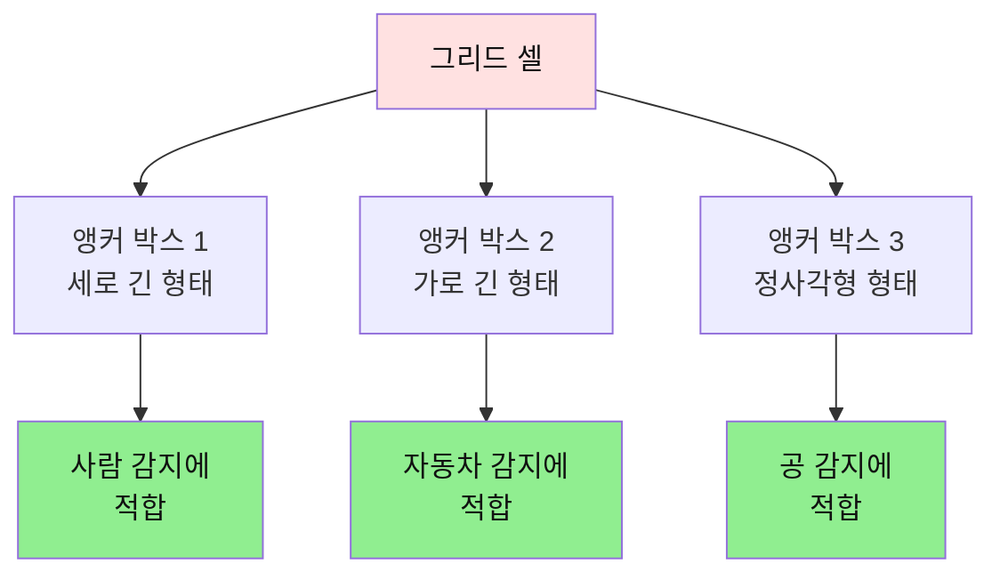

**앵커 박스 예시:**

```python
# YOLOv4-Tiny 앵커 박스 (width, height)
anchors = [
    (10, 14),   # 작은 객체용
    (23, 27),   # 작은 객체용
    (37, 58),   # 중간 객체용
    (81, 82),   # 중간 객체용
    (135, 169), # 큰 객체용
    (344, 319)  # 큰 객체용
]
```

### 3. 예측 출력

각 바운딩 박스는 **5 + C 개의 값**을 예측합니다.

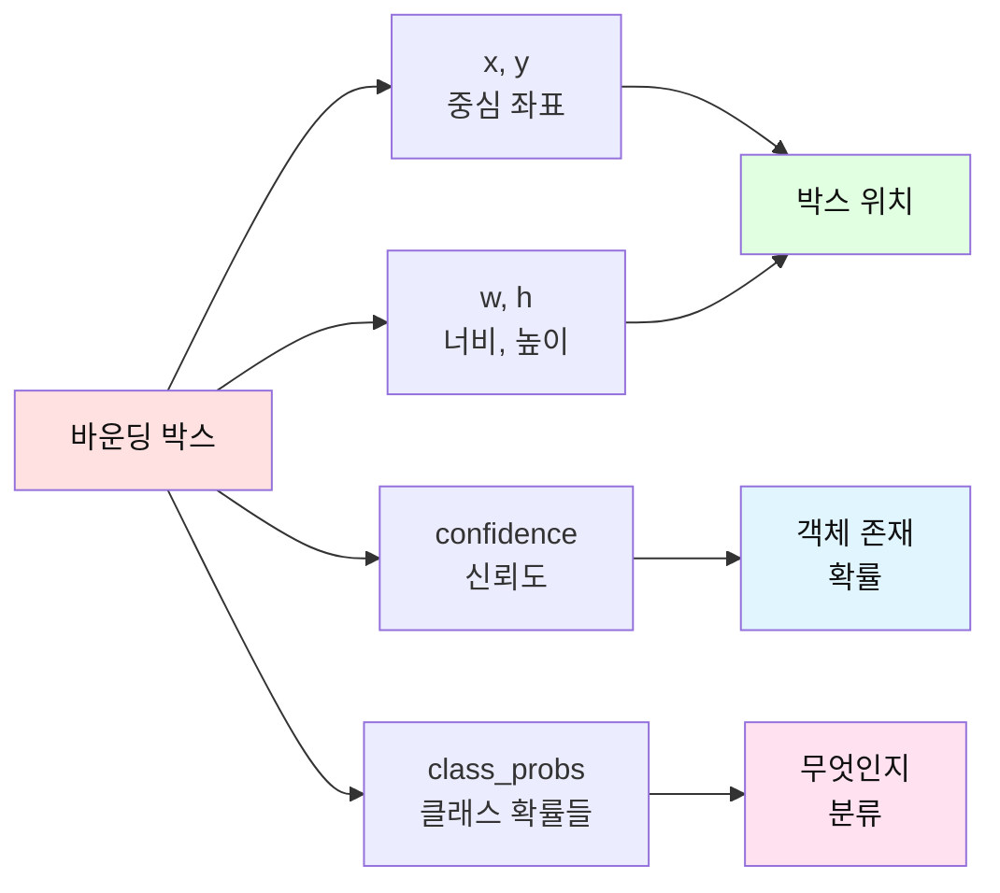

**출력 구조:**

```
┌─────────────────────────────────┐
│ x: 0.45  (박스 중심 X)          │
│ y: 0.32  (박스 중심 Y)          │
│ w: 0.25  (박스 너비)            │
│ h: 0.40  (박스 높이)            │
│ conf: 0.89 (객체 존재 확률)      │
│ class_0: 0.05 (클래스 0 확률)   │
│ class_1: 0.92 (클래스 1 확률)   │
│ class_2: 0.03 (클래스 2 확률)   │
│ ...                             │
└─────────────────────────────────┘
```

---

## YOLO 방법론

### 전체 처리 파이프라인

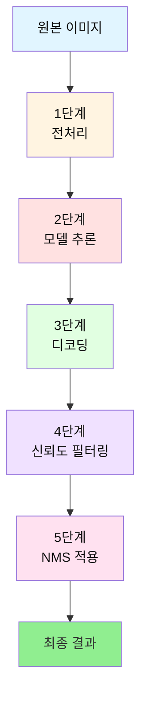

### 1단계: 전처리

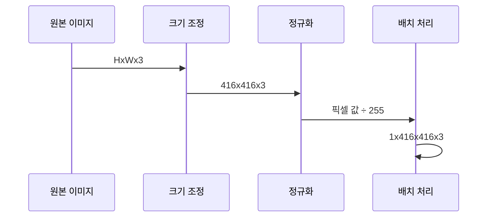

**코드 예시:**

```python
# 1단계: 전처리
def preprocess_image(image):
    """
    이미지 전처리
    
    Args:
        image: OpenCV 이미지 (BGR)
    
    Returns:
        전처리된 이미지 배열
    """
    # 색상 변환: BGR -> RGB
    image = cv2.cvtColor(image, cv2.COLOR_BGR2RGB)
    
    # 크기 조정: 416x416
    image = cv2.resize(image, (416, 416))
    
    # 정규화: 0~255 -> 0~1
    image = image.astype(np.float32) / 255.0
    
    # 배치 차원 추가: (416,416,3) -> (1,416,416,3)
    image = np.expand_dims(image, axis=0)
    
    return image
```

### 2단계: 모델 추론

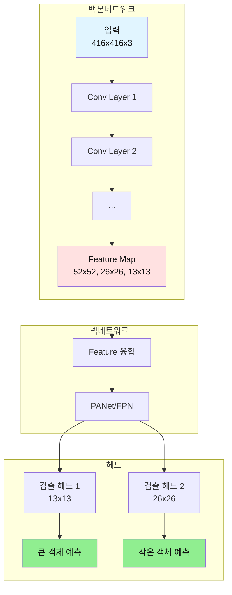

**YOLO 모델 구조:**

```python
def build_yolo_model():
    """
    YOLO 모델 구조 생성
    """
    # 입력 레이어
    input_layer = Input(shape=(416, 416, 3))
    
    # 백본: Feature 추출
    backbone_features = darknet_backbone(input_layer)
    
    # 넥: Feature 융합
    fused_features = neck_network(backbone_features)
    
    # 헤드: 객체 검출
    detections = detection_head(fused_features)
    
    # 모델 생성
    model = Model(inputs=input_layer, outputs=detections)
    
    return model
```

### 3단계: 디코딩

YOLO 출력은 **상대 좌표**이므로 **절대 좌표**로 변환해야 합니다.

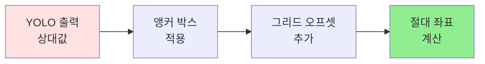

**디코딩 공식:**

```python
def decode_predictions(predictions, anchors, grid_size):
    """
    YOLO 예측값을 실제 좌표로 디코딩
    
    Args:
        predictions: 모델 출력 [batch, grid_h, grid_w, anchors, 5+classes]
        anchors: 앵커 박스 크기
        grid_size: 그리드 크기 (13, 26 등)
    
    Returns:
        디코딩된 박스 좌표
    """
    # 그리드 좌표 생성
    grid_x = np.arange(grid_size)
    grid_y = np.arange(grid_size)
    grid_x, grid_y = np.meshgrid(grid_x, grid_y)
    
    # 예측값 분리
    box_xy = predictions[..., 0:2]      # 중심 좌표
    box_wh = predictions[..., 2:4]      # 너비, 높이
    box_confidence = predictions[..., 4:5]  # 신뢰도
    box_class_probs = predictions[..., 5:]  # 클래스 확률
    
    # 중심 좌표 디코딩
    # sigmoid(x) + grid_offset
    box_xy = (sigmoid(box_xy) + [grid_x, grid_y]) / grid_size
    
    # 너비, 높이 디코딩
    # anchor * exp(wh)
    box_wh = anchors * np.exp(box_wh) / 416
    
    # 최종 박스 좌표 계산
    box_x1y1 = box_xy - box_wh / 2  # 좌상단
    box_x2y2 = box_xy + box_wh / 2  # 우하단
    
    return box_x1y1, box_x2y2, box_confidence, box_class_probs
```

### 4단계: 신뢰도 필터링

낮은 신뢰도 박스를 제거합니다.

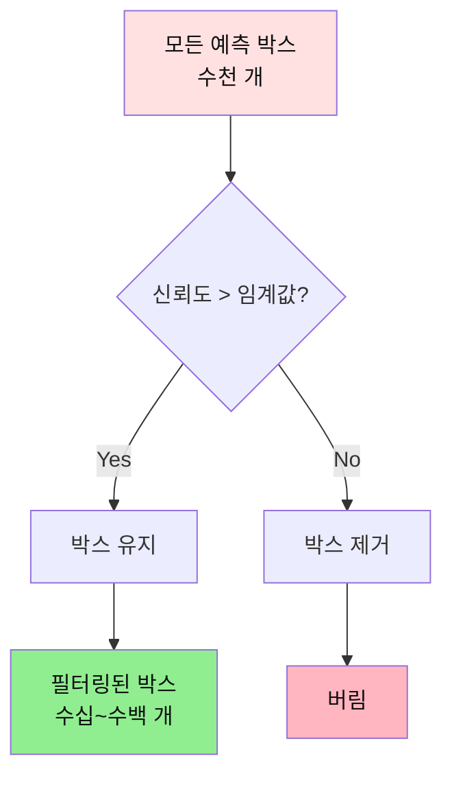

**코드 예시:**

```python
def filter_boxes_by_confidence(boxes, scores, threshold=0.5):
    """
    신뢰도 기준으로 박스 필터링
    
    Args:
        boxes: 바운딩 박스 좌표
        scores: 신뢰도 점수
        threshold: 최소 신뢰도 임계값
    
    Returns:
        필터링된 박스와 점수
    """
    # 신뢰도가 임계값보다 높은 것만 선택
    mask = scores >= threshold
    
    filtered_boxes = boxes[mask]
    filtered_scores = scores[mask]
    
    return filtered_boxes, filtered_scores
```

### 5단계: NMS (Non-Maximum Suppression)

중복된 박스를 제거합니다.

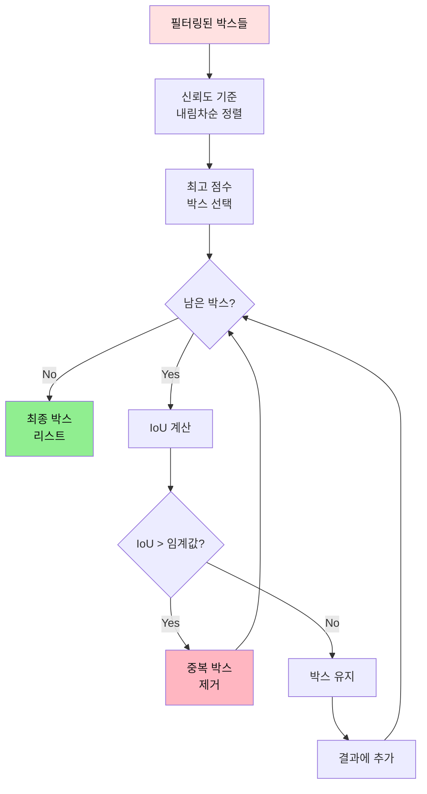

**IoU (Intersection over Union) 계산:**

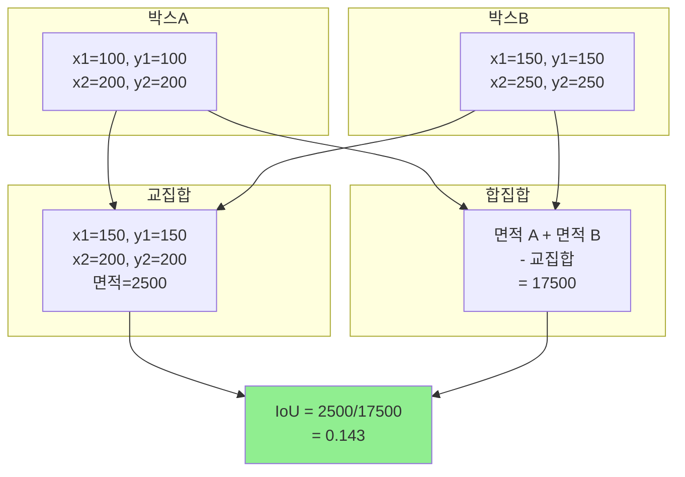

**NMS 코드:**

```python
def non_max_suppression(boxes, scores, iou_threshold=0.5):
    """
    NMS 알고리즘으로 중복 박스 제거
    
    Args:
        boxes: 바운딩 박스 좌표 [N, 4] (x1, y1, x2, y2)
        scores: 신뢰도 점수 [N]
        iou_threshold: IoU 임계값
    
    Returns:
        선택된 박스 인덱스
    """
    # 1. 신뢰도 기준 내림차순 정렬
    order = scores.argsort()[::-1]
    
    keep = []
    
    while order.size > 0:
        # 2. 최고 점수 박스 선택
        i = order[0]
        keep.append(i)
        
        # 3. 나머지 박스들과 IoU 계산
        ious = compute_iou(boxes[i], boxes[order[1:]])
        
        # 4. IoU가 임계값보다 작은 박스만 유지
        inds = np.where(ious <= iou_threshold)[0]
        order = order[inds + 1]
    
    return keep


def compute_iou(box1, boxes):
    """
    IoU (Intersection over Union) 계산
    
    Args:
        box1: 단일 박스 [4] (x1, y1, x2, y2)
        boxes: 여러 박스 [N, 4]
    
    Returns:
        IoU 값들 [N]
    """
    # 교집합 영역 계산
    x1 = np.maximum(box1[0], boxes[:, 0])
    y1 = np.maximum(box1[1], boxes[:, 1])
    x2 = np.minimum(box1[2], boxes[:, 2])
    y2 = np.minimum(box1[3], boxes[:, 3])
    
    # 교집합 면적
    intersection = np.maximum(0, x2 - x1) * np.maximum(0, y2 - y1)
    
    # 각 박스의 면적
    area1 = (box1[2] - box1[0]) * (box1[3] - box1[1])
    area2 = (boxes[:, 2] - boxes[:, 0]) * (boxes[:, 3] - boxes[:, 1])
    
    # 합집합 면적
    union = area1 + area2 - intersection
    
    # IoU 계산
    iou = intersection / union
    
    return iou
```

---

## 기본 YOLO 구현

### 최소 구현 버전

가장 기본적인 YOLO 사용 예제입니다.

```python
#!/usr/bin/env python3
# -*- coding: utf-8 -*-
"""
기본 YOLO 객체 검출 시스템

이 코드는 YOLO의 가장 기본적인 사용 방법을 보여줍니다.
"""

import cv2
import numpy as np


class BasicYOLO:
    """
    기본 YOLO 객체 검출 클래스
    
    이 클래스는 YOLO의 핵심 기능만 포함합니다:
    1. 모델 로드
    2. 이미지 전처리
    3. 객체 검출
    4. 결과 시각화
    """
    
    def __init__(self, model_path, config_path, classes_path):
        """
        YOLO 초기화
        
        Args:
            model_path: 가중치 파일 경로 (.weights)
            config_path: 설정 파일 경로 (.cfg)
            classes_path: 클래스 이름 파일 경로 (.txt)
        """
        # 클래스 이름 로드
        self.classes = self._load_classes(classes_path)
        
        # YOLO 모델 로드
        self.net = cv2.dnn.readNet(model_path, config_path)
        
        # 출력 레이어 이름 가져오기
        self.layer_names = self.net.getLayerNames()
        self.output_layers = [
            self.layer_names[i - 1] 
            for i in self.net.getUnconnectedOutLayers()
        ]
        
        # 색상 팔레트 생성
        self.colors = np.random.uniform(0, 255, size=(len(self.classes), 3))
    
    def _load_classes(self, classes_path):
        """
        클래스 이름 파일 로드
        
        Args:
            classes_path: 클래스 파일 경로
        
        Returns:
            클래스 이름 리스트
        """
        with open(classes_path, 'r') as f:
            classes = [line.strip() for line in f.readlines()]
        return classes
    
    def detect(self, image, conf_threshold=0.5, nms_threshold=0.4):
        """
        객체 검출 실행
        
        Args:
            image: 입력 이미지 (OpenCV BGR)
            conf_threshold: 신뢰도 임계값
            nms_threshold: NMS IoU 임계값
        
        Returns:
            boxes: 바운딩 박스 리스트
            confidences: 신뢰도 리스트
            class_ids: 클래스 ID 리스트
        """
        # 이미지 크기
        height, width = image.shape[:2]
        
        # 1단계: 이미지 전처리
        blob = cv2.dnn.blobFromImage(
            image, 
            1/255.0,        # 정규화 스케일
            (416, 416),     # 입력 크기
            swapRB=True,    # BGR -> RGB
            crop=False      # 크롭 안 함
        )
        
        # 2단계: 모델 추론
        self.net.setInput(blob)
        outputs = self.net.forward(self.output_layers)
        
        # 3단계: 결과 파싱
        boxes = []
        confidences = []
        class_ids = []
        
        for output in outputs:
            for detection in output:
                # 클래스 확률 추출
                scores = detection[5:]
                class_id = np.argmax(scores)
                confidence = scores[class_id]
                
                # 4단계: 신뢰도 필터링
                if confidence > conf_threshold:
                    # 박스 좌표 계산 (상대 좌표 -> 절대 좌표)
                    center_x = int(detection[0] * width)
                    center_y = int(detection[1] * height)
                    w = int(detection[2] * width)
                    h = int(detection[3] * height)
                    
                    # 좌상단 좌표 계산
                    x = int(center_x - w / 2)
                    y = int(center_y - h / 2)
                    
                    boxes.append([x, y, w, h])
                    confidences.append(float(confidence))
                    class_ids.append(class_id)
        
        # 5단계: NMS 적용
        indices = cv2.dnn.NMSBoxes(
            boxes, 
            confidences, 
            conf_threshold, 
            nms_threshold
        )
        
        # 최종 결과 필터링
        final_boxes = []
        final_confidences = []
        final_class_ids = []
        
        if len(indices) > 0:
            for i in indices.flatten():
                final_boxes.append(boxes[i])
                final_confidences.append(confidences[i])
                final_class_ids.append(class_ids[i])
        
        return final_boxes, final_confidences, final_class_ids
    
    def draw_predictions(self, image, boxes, confidences, class_ids):
        """
        검출 결과 시각화
        
        Args:
            image: 원본 이미지
            boxes: 바운딩 박스 리스트
            confidences: 신뢰도 리스트
            class_ids: 클래스 ID 리스트
        
        Returns:
            결과가 그려진 이미지
        """
        for i, box in enumerate(boxes):
            x, y, w, h = box
            
            # 클래스 정보
            class_id = class_ids[i]
            label = self.classes[class_id]
            confidence = confidences[i]
            color = self.colors[class_id]
            
            # 바운딩 박스 그리기
            cv2.rectangle(image, (x, y), (x + w, y + h), color, 2)
            
            # 라벨 텍스트
            text = f"{label}: {confidence:.2f}"
            
            # 텍스트 배경
            (text_width, text_height), _ = cv2.getTextSize(
                text, 
                cv2.FONT_HERSHEY_SIMPLEX, 
                0.5, 
                1
            )
            cv2.rectangle(
                image, 
                (x, y - text_height - 10), 
                (x + text_width, y), 
                color, 
                -1
            )
            
            # 텍스트 그리기
            cv2.putText(
                image, 
                text, 
                (x, y - 5), 
                cv2.FONT_HERSHEY_SIMPLEX, 
                0.5, 
                (0, 0, 0), 
                1
            )
        
        return image


# 사용 예제
if __name__ == "__main__":
    # YOLO 초기화
    yolo = BasicYOLO(
        model_path="yolov4-tiny.weights",
        config_path="yolov4-tiny.cfg",
        classes_path="coco.names"
    )
    
    # 이미지 로드
    image = cv2.imread("test_image.jpg")
    
    # 객체 검출
    boxes, confidences, class_ids = yolo.detect(image)
    
    # 결과 시각화
    result_image = yolo.draw_predictions(image, boxes, confidences, class_ids)
    
    # 결과 표시
    cv2.imshow("YOLO Detection", result_image)
    cv2.waitKey(0)
    cv2.destroyAllWindows()
```

---

## 핵심 알고리즘

### 1. Sigmoid 함수

중심 좌표를 0~1 범위로 제한합니다.

```python
def sigmoid(x):
    """
    Sigmoid 활성화 함수
    
    수식: σ(x) = 1 / (1 + e^(-x))
    
    Args:
        x: 입력 값
    
    Returns:
        0~1 사이의 값
    """
    return 1 / (1 + np.exp(-x))
```

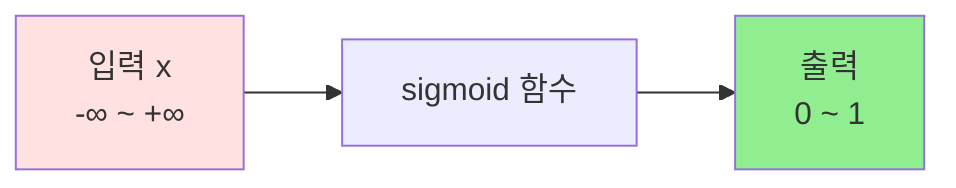

### 2. 박스 좌표 변환

```python
def convert_box_coordinates(box, image_size):
    """
    YOLO 박스 좌표를 이미지 좌표로 변환
    
    Args:
        box: [center_x, center_y, width, height] (정규화된 값 0~1)
        image_size: (이미지 너비, 이미지 높이)
    
    Returns:
        [x1, y1, x2, y2] (픽셀 좌표)
    """
    img_width, img_height = image_size
    
    # 중심 좌표와 크기 추출
    center_x, center_y, width, height = box
    
    # 절대 좌표로 변환
    center_x *= img_width
    center_y *= img_height
    width *= img_width
    height *= img_height
    
    # 좌상단, 우하단 좌표 계산
    x1 = int(center_x - width / 2)
    y1 = int(center_y - height / 2)
    x2 = int(center_x + width / 2)
    y2 = int(center_y + height / 2)
    
    return [x1, y1, x2, y2]
```

### 3. 신뢰도 점수 계산

```python
def calculate_confidence(obj_confidence, class_probs):
    """
    최종 신뢰도 점수 계산
    
    수식: confidence = P(Object) × P(Class|Object)
    
    Args:
        obj_confidence: 객체 존재 확률
        class_probs: 각 클래스 확률 배열
    
    Returns:
        각 클래스에 대한 최종 신뢰도
    """
    # 객체 확률 × 클래스 확률
    confidences = obj_confidence * class_probs
    
    return confidences
```

---

## 실전 예제 코드

### 예제 1: 이미지에서 객체 검출

```python
#!/usr/bin/env python3
# -*- coding: utf-8 -*-
"""
예제 1: 이미지 파일에서 객체 검출
"""

import cv2


def detect_objects_in_image(image_path):
    """
    이미지 파일에서 객체 검출
    
    Args:
        image_path: 이미지 파일 경로
    """
    # YOLO 초기화
    yolo = BasicYOLO(
        model_path="yolov4-tiny.weights",
        config_path="yolov4-tiny.cfg",
        classes_path="coco.names"
    )
    
    # 이미지 로드
    image = cv2.imread(image_path)
    
    if image is None:
        print(f"이미지를 불러올 수 없습니다: {image_path}")
        return
    
    print(f"이미지 크기: {image.shape}")
    
    # 객체 검출
    print("객체 검출 중...")
    boxes, confidences, class_ids = yolo.detect(image)
    
    # 결과 출력
    print(f"검출된 객체 수: {len(boxes)}")
    for i, (box, conf, class_id) in enumerate(zip(boxes, confidences, class_ids)):
        class_name = yolo.classes[class_id]
        print(f"{i+1}. {class_name}: {conf:.2%}")
    
    # 결과 시각화
    result_image = yolo.draw_predictions(image, boxes, confidences, class_ids)
    
    # 결과 저장 및 표시
    output_path = "output_" + image_path
    cv2.imwrite(output_path, result_image)
    print(f"결과 저장: {output_path}")
    
    cv2.imshow("Detection Result", result_image)
    cv2.waitKey(0)
    cv2.destroyAllWindows()


if __name__ == "__main__":
    detect_objects_in_image("test.jpg")
```

### 예제 2: 웹캠 실시간 객체 검출

```python
#!/usr/bin/env python3
# -*- coding: utf-8 -*-
"""
예제 2: 웹캠으로 실시간 객체 검출
"""

import cv2
import time


def detect_objects_realtime():
    """
    웹캠으로 실시간 객체 검출
    """
    # YOLO 초기화
    yolo = BasicYOLO(
        model_path="yolov4-tiny.weights",
        config_path="yolov4-tiny.cfg",
        classes_path="coco.names"
    )
    
    # 웹캠 열기
    cap = cv2.VideoCapture(0)
    
    if not cap.isOpened():
        print("웹캠을 열 수 없습니다.")
        return
    
    print("웹캠 시작 (종료: ESC 키)")
    
    # FPS 계산용
    fps_start_time = time.time()
    fps_frame_count = 0
    fps = 0
    
    while True:
        # 프레임 읽기
        ret, frame = cap.read()
        
        if not ret:
            print("프레임을 읽을 수 없습니다.")
            break
        
        # 객체 검출
        boxes, confidences, class_ids = yolo.detect(frame)
        
        # 결과 시각화
        result_frame = yolo.draw_predictions(frame, boxes, confidences, class_ids)
        
        # FPS 계산
        fps_frame_count += 1
        if fps_frame_count >= 30:
            fps_end_time = time.time()
            fps = 30 / (fps_end_time - fps_start_time)
            fps_start_time = fps_end_time
            fps_frame_count = 0
        
        # FPS 표시
        cv2.putText(
            result_frame,
            f"FPS: {fps:.2f}",
            (10, 30),
            cv2.FONT_HERSHEY_SIMPLEX,
            1,
            (0, 255, 0),
            2
        )
        
        # 검출 개수 표시
        cv2.putText(
            result_frame,
            f"Objects: {len(boxes)}",
            (10, 70),
            cv2.FONT_HERSHEY_SIMPLEX,
            1,
            (0, 255, 0),
            2
        )
        
        # 화면 표시
        cv2.imshow("Real-time Detection", result_frame)
        
        # ESC 키로 종료
        key = cv2.waitKey(1)
        if key == 27:  # ESC
            break
    
    # 리소스 해제
    cap.release()
    cv2.destroyAllWindows()
    print("웹캠 종료")


if __name__ == "__main__":
    detect_objects_realtime()
```

### 예제 3: 동영상 파일 처리

```python
#!/usr/bin/env python3
# -*- coding: utf-8 -*-
"""
예제 3: 동영상 파일에서 객체 검출
"""

import cv2


def detect_objects_in_video(video_path, output_path=None):
    """
    동영상 파일에서 객체 검출
    
    Args:
        video_path: 입력 동영상 경로
        output_path: 출력 동영상 경로 (None이면 저장 안 함)
    """
    # YOLO 초기화
    yolo = BasicYOLO(
        model_path="yolov4-tiny.weights",
        config_path="yolov4-tiny.cfg",
        classes_path="coco.names"
    )
    
    # 동영상 열기
    cap = cv2.VideoCapture(video_path)
    
    if not cap.isOpened():
        print(f"동영상을 열 수 없습니다: {video_path}")
        return
    
    # 동영상 정보
    fps = int(cap.get(cv2.CAP_PROP_FPS))
    width = int(cap.get(cv2.CAP_PROP_FRAME_WIDTH))
    height = int(cap.get(cv2.CAP_PROP_FRAME_HEIGHT))
    total_frames = int(cap.get(cv2.CAP_PROP_FRAME_COUNT))
    
    print(f"동영상 정보:")
    print(f"  - 크기: {width}x{height}")
    print(f"  - FPS: {fps}")
    print(f"  - 총 프레임: {total_frames}")
    
    # 동영상 작성기 (저장할 경우)
    writer = None
    if output_path:
        fourcc = cv2.VideoWriter_fourcc(*'mp4v')
        writer = cv2.VideoWriter(output_path, fourcc, fps, (width, height))
    
    frame_count = 0
    
    while True:
        ret, frame = cap.read()
        
        if not ret:
            break
        
        frame_count += 1
        
        # 객체 검출
        boxes, confidences, class_ids = yolo.detect(frame)
        
        # 결과 시각화
        result_frame = yolo.draw_predictions(frame, boxes, confidences, class_ids)
        
        # 진행률 표시
        progress = (frame_count / total_frames) * 100
        cv2.putText(
            result_frame,
            f"Progress: {progress:.1f}% ({frame_count}/{total_frames})",
            (10, 30),
            cv2.FONT_HERSHEY_SIMPLEX,
            0.7,
            (0, 255, 0),
            2
        )
        
        # 동영상 저장
        if writer:
            writer.write(result_frame)
        
        # 화면 표시
        cv2.imshow("Video Detection", result_frame)
        
        # ESC 키로 종료
        if cv2.waitKey(1) == 27:
            break
        
        # 진행률 출력 (콘솔)
        if frame_count % 30 == 0:
            print(f"처리 중... {progress:.1f}%")
    
    # 리소스 해제
    cap.release()
    if writer:
        writer.release()
    cv2.destroyAllWindows()
    
    print(f"처리 완료: {frame_count} 프레임")
    if output_path:
        print(f"결과 저장: {output_path}")


if __name__ == "__main__":
    detect_objects_in_video(
        video_path="input_video.mp4",
        output_path="output_video.mp4"
    )
```

---

## YOLO 버전 비교

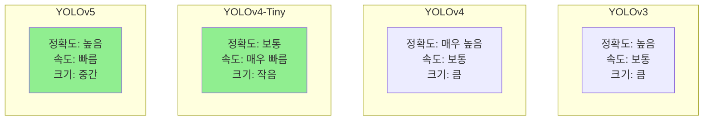

### 버전별 특징

| 버전 | 정확도 | 속도 | 모델 크기 | 용도 |
|------|--------|------|-----------|------|
| **YOLOv3** | ★★★★☆ | ★★★☆☆ | 236 MB | 일반 용도 |
| **YOLOv4** | ★★★★★ | ★★★☆☆ | 244 MB | 고정확도 필요 |
| **YOLOv4-Tiny** | ★★★☆☆ | ★★★★★ | 23 MB | **임베디드** |
| **YOLOv5** | ★★★★☆ | ★★★★☆ | 14-87 MB | **추천** |
| **YOLOv8** | ★★★★★ | ★★★★☆ | 6-136 MB | 최신 기술 |

---

## 학습 방법 (Fine-tuning)

### 커스텀 데이터셋으로 학습하기

```python
#!/usr/bin/env python3
# -*- coding: utf-8 -*-
"""
YOLO 커스텀 학습 예제
"""

# 1. 데이터셋 준비
"""
dataset/
├── images/
│   ├── train/
│   │   ├── img001.jpg
│   │   ├── img002.jpg
│   │   └── ...
│   └── val/
│       ├── img101.jpg
│       └── ...
└── labels/
    ├── train/
    │   ├── img001.txt
    │   ├── img002.txt
    │   └── ...
    └── val/
        ├── img101.txt
        └── ...
"""

# 2. 라벨 형식 (YOLO format)
"""
각 줄: <class_id> <center_x> <center_y> <width> <height>

예시 (img001.txt):
0 0.5 0.3 0.2 0.4
1 0.7 0.6 0.15 0.25

좌표는 모두 정규화된 값 (0~1)
"""

# 3. 학습 설정 파일 (data.yaml)
"""
train: dataset/images/train
val: dataset/images/val

nc: 3  # 클래스 개수
names: ['cardboard', 'glass', 'metal']  # 클래스 이름
"""

# 4. 학습 실행 (YOLOv5 기준)
"""
python train.py \\
    --img 416 \\
    --batch 16 \\
    --epochs 100 \\
    --data data.yaml \\
    --weights yolov5s.pt \\
    --cache
"""
```

---

## 성능 최적화 팁

### 1. 입력 크기 조정

```python
# 작은 입력 크기 = 빠른 속도, 낮은 정확도
yolo.detect(image, input_size=320)  # 빠름

# 큰 입력 크기 = 느린 속도, 높은 정확도
yolo.detect(image, input_size=608)  # 느림
```

### 2. 임계값 조정

```python
# 높은 신뢰도 임계값 = 적은 검출, 높은 정확도
boxes = yolo.detect(image, conf_threshold=0.7)

# 낮은 신뢰도 임계값 = 많은 검출, 낮은 정확도
boxes = yolo.detect(image, conf_threshold=0.3)
```

### 3. GPU 사용

```python
# OpenCV DNN으로 GPU 사용
net.setPreferableBackend(cv2.dnn.DNN_BACKEND_CUDA)
net.setPreferableTarget(cv2.dnn.DNN_TARGET_CUDA)
```

---

## 정리

### YOLO 핵심 개념

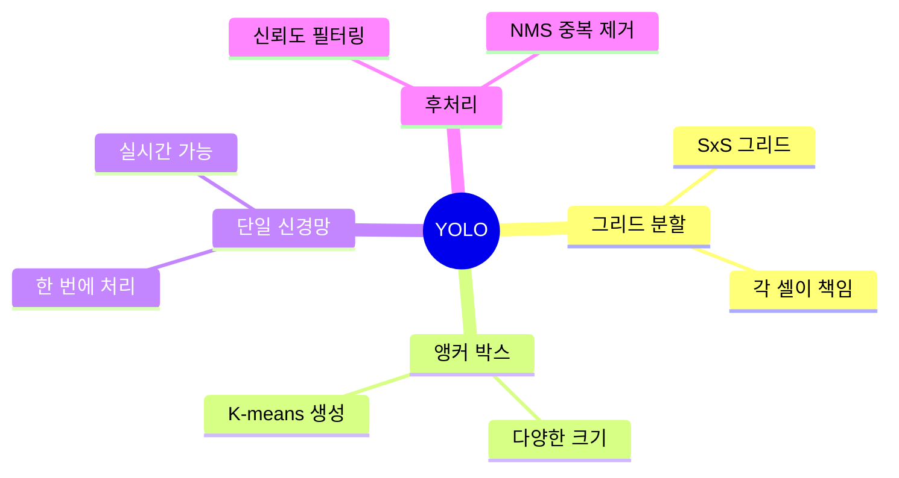

### YOLO 장단점

**장점:**
- ✅ 실시간 처리 가능 (빠른 속도)
- ✅ 전역 맥락 이해 (이미지 전체 분석)
- ✅ 일반화 능력 우수
- ✅ 다양한 버전 선택 가능

**단점:**
- ❌ 작은 객체 검출 어려움
- ❌ 밀집된 객체 처리 제한적
- ❌ 학습 데이터 많이 필요
- ❌ 정확한 위치 파악 한계

### 사용 시나리오

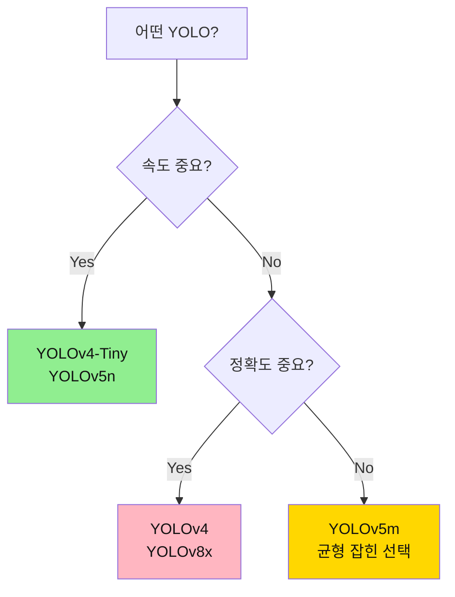

이 가이드를 통해 YOLO의 기본 원리와 구현 방법을 이해하실 수 있습니다! 🚀

